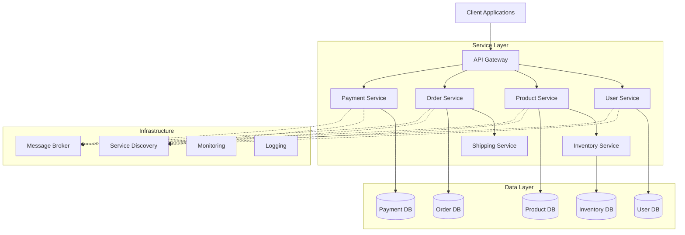

# Introduction to Microservices

## Overview

### What Are Microservices?

Microservices represent an architectural style that structures an application as a collection of loosely coupled, independently deployable services. Each microservice is a self-contained business capability that communicates with other services through well-defined APIs (Application Programming Interfaces). This architectural approach stands in stark contrast to traditional monolithic architectures where all components are tightly integrated into a single deployment unit.

The microservices architecture emerged as a solution to the limitations of monolithic applications. In a monolithic architecture, the entire application is built as a single unit containing all functionality—from user interface to business logic to data persistence. While simple applications can benefit from this approach, large-scale enterprise applications often face significant challenges including tight coupling between components, deployment complexity, technology lock-in, and difficulties in scaling individual components.

### Historical Context and Evolution

The concept of microservices evolved from the natural need to break down large, complex systems into manageable pieces. Amazon pioneered this approach in the early 2000s, developing what they internal called "service-oriented architecture" to support their e-commerce platform. Netflix followed suit around 2009, creating a highly resilient streaming platform built on hundreds of separate services. Uber adopted microservices to support their real-time ride-hailing infrastructure, enabling rapid iteration and geographic expansion.

The term "microservices" was coined in 2014 by software architect James Lewis and Fowler Martin, who described it as an approach to developing a single application as a suite of small services, each running in its own process and communicating with lightweight mechanisms. This formal definition captured the essence of what companies like Amazon and Netflix had been practicing, bringing the architectural style into mainstream software engineering discourse.

### Core Characteristics

Microservices exhibit several defining characteristics that distinguish them from other architectural approaches:

**Service as an Independent Deployment Unit**: Each microservice can be deployed, scaled, and updated independently without affecting other services in the system. This independence enables teams to work on different services simultaneously, accelerating development velocity and reducing coordination overhead between teams.

**Decentralized Data Management**: Unlike monolithic architectures with a single database, microservices typically maintain their own data stores. This decentralization eliminates single points of failure and allows each service to choose the most appropriate database technology for its specific requirements—whether relational databases, document stores, key-value stores, or other specialized solutions.

**Business Capability Focus**: Services are organized around business capabilities rather than technical layers. A single microservice encapsulates all functionality related to a particular business domain—such as user management, order processing, or inventory tracking—rather than dividing functionality by technical concerns like presentation, business logic, and data access.

**Infrastructure Automation**: Microservices embrace automated testing, continuous integration, and continuous deployment pipelines. The independent deployability of services makes automated testing and deployment essential, as manual processes would become prohibitively slow and error-prone at scale.

### The Microservices Ecosystem

A complete microservices ecosystem includes several supporting components beyond the core services themselves:

**Service Discovery**: Mechanisms that allow services to locate and communicate with each other dynamically, handling service registration, health monitoring, and routing.

**API Gateways**: Entry points that provide a unified interface to backend services, handling cross-cutting concerns like authentication, rate limiting, request routing, and protocol translation.

**Messaging Infrastructure**: Message brokers or event streaming platforms that enable asynchronous communication between services, providing loose coupling and resilience.

**Observability Stack**: Distributed tracing, logging aggregation, and metrics collection systems that provide visibility into the behavior of complex, distributed systems.

**Orchestration and Scheduling**: Container orchestration platforms like Kubernetes that manage service deployment, scaling, and recovery.

### When to Choose Microservices

The microservices architecture is not universally optimal. Understanding when to adopt this approach requires careful consideration of project factors:

**Benefits of Microservices for Complex Systems**: Large applications with multiple development teams benefit significantly from the independent deployability and team autonomy that microservices provide. Systems requiring different technology stacks for different components—perhaps using relational databases for transactional data and search engines for full-text search—can leverage polyglot persistence naturally enabled by microservices.

**Challenges That May Favor Monolithic Architecture**: Smaller applications, startups in early product development phases, or teams with limited DevOps expertise may find microservices introduce unnecessary complexity. The operational overhead of managing multiple services, the challenges of distributed systems, and the need for robust deployment and monitoring infrastructure can outweigh benefits for simpler applications.

**Scaling Considerations**: Microservices excel at horizontal scaling, allowing specific services to be replicated based on their individual load characteristics. An e-commerce application might run ten instances of its product catalog service while running only two instances of its returns processing service. This granular scalability would be impossible in a monolithic architecture without scaling the entire application.

### Industry Adoption

Major technology companies have widely adopted microservices:

**Netflix**: Runs over 1,000 microservices powering its streaming platform, handling recommendations, user profiles, billing, content delivery, and device compatibility. Their open-source contributions including Eureka (service discovery), Hystrix (circuit breaker), and Zuul (API gateway) have become foundational elements of the microservices ecosystem.

**Amazon**: Pioneered service-oriented architecture to power Amazon.com, enabling the company to scale from a bookstore to the "everything store." Their internal services handle product catalogs, recommendations, inventory, orders, payments, and logistics as separate services communicating through well-defined APIs.

**Uber**: Replaced its initial monolithic architecture with microservices to support rapid geographic expansion and real-time ride matching. Distinct services handle rider matching, driver management, pricing, payments, and communications, each scalable and deployable independently.

**Spotify**: Manages its music streaming platform through approximately 800 microservices, with teams organized around service ownership enabling autonomous, rapid development.

### Flow Chart: Microservices Architecture Overview



Each client request flows through the API gateway, which routes to appropriate services. Services maintain their own databases and communicate through both synchronous API calls and asynchronous event messaging. Infrastructure components provide service discovery, messaging, and observability capabilities.

---

## Standard Example

### Building a Simple E-Commerce System

Consider a simple e-commerce application built using microservices principles:

```java
// User Service - Java/Spring Boot

package com.ecommerce.userservice;

import org.springframework.boot.SpringApplication;
import org.springframework.boot.autoconfigure.SpringBootApplication;
import org.springframework.web.bind.annotation.*;
import org.springframework.http.ResponseEntity;
import org.springframework.http.HttpStatus;

@SpringBootApplication
public class UserServiceApplication {
    public static void main(String[] args) {
        SpringApplication.run(UserServiceApplication.class, args);
    }
}

// User Entity
class User {
    private String userId;
    private String email;
    private String name;
    private String address;
    
    // Getters and Setters
    public String getUserId() { return userId; }
    public void setUserId(String userId) { this.userId = userId; }
    public String getEmail() { return email; }
    public void setEmail(String email) { this.email = email; }
    public String getName() { return name; }
    public void setName(String name) { this.name = name; }
    public String getAddress() { return address; }
    public void setAddress(String address) { this.address = address; }
}

// User Controller
@RestController
@RequestMapping("/api/v1/users")
class UserController {
    
    private final UserService userService;
    
    public UserController(UserService userService) {
        this.userService = userService;
    }
    
    @PostMapping
    public ResponseEntity<User> createUser(@RequestBody CreateUserRequest request) {
        User user = userService.createUser(request.getEmail(), request.getName(), request.getAddress());
        return ResponseEntity.status(HttpStatus.CREATED).body(user);
    }
    
    @GetMapping("/{userId}")
    public ResponseEntity<User> getUser(@PathVariable String userId) {
        return userService.findById(userId)
            .map(ResponseEntity::ok)
            .orElse(ResponseEntity.notFound().build());
    }
}

// User Service - Business Logic
@Service
class UserService {
    
    private final UserRepository userRepository;
    private final EventPublisher eventPublisher;
    
    public UserService(UserRepository userRepository, EventPublisher eventPublisher) {
        this.userRepository = userRepository;
        this.eventPublisher = eventPublisher;
    }
    
    public User createUser(String email, String name, String address) {
        User user = new User();
        user.setUserId(UUID.randomUUID().toString());
        user.setEmail(email);
        user.setName(name);
        user.setAddress(address);
        
        User savedUser = userRepository.save(user);
        
        // Publish UserCreated event for other services to consume
        eventPublisher.publish("user.created", Map.of(
            "userId", savedUser.getUserId(),
            "email", savedUser.getEmail()
        ));
        
        return savedUser;
    }
    
    public Optional<User> findById(String userId) {
        return userRepository.findById(userId);
    }
}

// Product Service - Separate Service

package com.ecommerce.productservice;

import org.springframework.boot.SpringApplication;
import org.springframework.boot.autoconfigure.SpringBootApplication;
import org.springframework.web.bind.annotation.*;

@SpringBootApplication
public class ProductServiceApplication {
    public static void main(String[] args) {
        SpringApplication.run(ProductServiceApplication.class, args);
    }
}

@RestController
@RequestMapping("/api/v1/products")
class ProductController {
    
    private final ProductService productService;
    
    public ProductController(ProductService productService) {
        this.productService = productService;
    }
    
    @GetMapping
    public List<Product> listProducts(
            @RequestParam(defaultValue = "0") int page,
            @RequestParam(defaultValue = "20") int size) {
        return productService.findAll(page, size);
    }
    
    @GetMapping("/{productId}")
    public Product getProduct(@PathVariable String productId) {
        return productService.findById(productId);
    }
    
    @PostMapping
    public Product createProduct(@RequestBody CreateProductRequest request) {
        return productService.createProduct(
            request.getName(), 
            request.getDescription(), 
            request.getPrice(),
            request.getQuantity()
        );
    }
}
```

This example demonstrates key microservices principles:
- Each service (User Service, Product Service) runs as an independent application
- Services communicate via REST APIs over HTTP
- Each service owns its data, with no shared database
- Events are published for asynchronous communication between services

### Commented Code Explanation

**UserServiceApplication.java**: The main Spring Boot application class that starts the microservice. Each service has its own application entry point.

**User Entity**: Defines the User data model with fields for userId, email, name, and address. This is the service's owned data—no other service shares this database.

**UserController.java**: Exposes RESTful endpoints for user operations. The `@RestController` annotation defines HTTP endpoints, and `@RequestMapping` establishes the API path prefix (api/v1/users).

**UserService.java**: Contains business logic for user operations. The `createUser` method saves a user to the database and publishes an event for other services to consume—this is asynchronous, decoupled communication.

**ProductController.java**: Similar REST controller for product operations. Note how this is in a completely separate package, representing a different microservice.

The product service owns product data while the user service owns user data. When the user service needs product information, it must call the product service's API—never directly access the product database.

---

## Real-World Example 1: Netflix Product Catalog

### Netflix Implementation

Netflix operates one of the world's largest streaming platforms through a microservices architecture. Their product catalog system manages metadata for thousands of movies and TV shows:

**Scale**: Netflix serves over 230 million subscribers across 190 countries, each browsing content, viewing recommendations, and managing watchlists. This requires managing content metadata, licensing information, availability by region, and personalized recommendations across millions of titles.

**Service Decomposition**: The product catalog functionality is decomposed into multiple services:

- **Metadata Service**: Maintains title information (descriptions, cast, crew, genres, ratings)
- **Availability Service**: Tracks licensing and regional availability
- **Search Service**: Enables full-text search across the catalog
- **Recommendation Service**: Generates personalized suggestions
- **Playlicy Service**: Handles content licensing rules

```java
// Netflix-style Product Catalog Service

package com.netflix.catalogservice;

import org.springframework.beans.factory.annotation.Value;
import org.springframework.boot.web.client.RestTemplateBuilder;
import org.springframework.context.annotation.Bean;
import org.springframework.context.annotation.Configuration;
import org.springframework.web.client.RestTemplate;
import java.time.Duration;

@Configuration
class CatalogConfig {
    
    @Value("${netflix.availability-service.url}")
    private String availabilityServiceUrl;
    
    @Value("${netflix.search-service.url}")
    private String searchServiceUrl;
    
    @Bean
    public RestTemplate catalogRestTemplate(RestTemplateBuilder builder) {
        return builder
            .connectTimeout(Duration.ofSeconds(5))
            .readTimeout(Duration.ofSeconds(10))
            .build();
    }
}

@Service
class MetadataService {
    
    private final RestTemplate restTemplate;
    private final MetadataRepository metadataRepository;
    private final EventPublisher eventPublisher;
    
    @Value("${netflix.availability-service.url}")
    private String availabilityServiceUrl;
    
    public MetadataService(
            RestTemplate restTemplate,
            MetadataRepository metadataRepository,
            EventPublisher eventPublisher) {
        this.restTemplate = restTemplate;
        this.metadataRepository = metadataRepository;
        this.eventPublisher = eventPublisher;
    }
    
    public Title getTitleDetails(String titleId) {
        // Get metadata from local cache/repository
        Title title = metadataRepository.findById(titleId)
            .orElseGet(() -> fetchTitleFromSource(titleId));
        
        if (title == null) {
            return null;
        }
        
        // Fetch availability asynchronously
        CompletableFuture.runAsync(() -> {
            try {
                Availability availability = restTemplate.getForObject(
                    availabilityServiceUrl + "/api/v1/availability/" + titleId,
                    Availability.class
                );
                title.setAvailability(availability);
            } catch (Exception e) {
                // Log error, continue with limited data
                log.warn("Failed to fetch availability for title: " + titleId, e);
            }
        });
        
        return title;
    }
    
    private Title fetchTitleFromSource(String titleId) {
        // External content ingest from production studios
        return metadataRepository.findByExternalId(titleId)
            .orElse(null);
    }
}

@Service
class SearchService {
    
    private final ElasticsearchTemplate elasticsearchTemplate;
    private final MetadataRepository metadataRepository;
    
    public SearchService(
            ElasticsearchTemplate elasticsearchTemplate,
            MetadataRepository metadataRepository) {
        this.elasticsearchTemplate = elasticsearchTemplate;
        this.metadataRepository = metadataRepository;
    }
    
    public SearchResult search(String query, int page, int size) {
        // Perform full-text search
        List<String> titleIds = elasticsearchTemplate.search(query, page, size);
        
        // Fetch full metadata for results
        List<Title> titles = titleIds.stream()
            .map(metadataRepository::findById)
            .filter(Optional::isPresent)
            .map(Optional::get)
            .collect(Collectors.toList());
        
        // Build faceted results
        return SearchResult.builder()
            .query(query)
            .titles(titles)
            .facets(buildFacets(titles))
            .totalResults(elasticsearchTemplate.count(query))
            .page(page)
            .pageSize(size)
            .build();
    }
    
    private Map<String, Long> buildFacets(List<Title> titles) {
        return titles.stream()
            .flatMap(title -> title.getGenres().stream())
            .collect(Collectors.groupingBy(
                Function.identity(),
                Collectors.counting()
            ));
    }
}
```

### Architecture Details

Netflix implements several sophisticated patterns:

**Asynchronous Availability Fetching**: Title details include availability information that comes from a separate availability service. Rather than waiting for this data synchronously, the metadata service initiates the call asynchronously and populates availability once the response arrives. This prevents slow services from blocking user interactions.

**Search Optimization**: Full-text search uses Elasticsearch (or Netflix'sEvolve search infrastructure) optimized for the high-volume query patterns typical of content browsing. Results include faceted information (genre counts, release year distribution) enabling rich filtering in the user interface.

**Data Replication**: Content metadata is replicated to edge locations using Netflix's Open Connect platform, ensuring low-latency delivery to global subscribers.

---

## Real-World Example 2: Uber Trip Management

### Uber Implementation

Uber's real-time trip management system handles millions of ride requests daily, coordinating drivers and riders through a complex microservices ecosystem:

**Requirements**: Real-time matching of riders with drivers, dynamic pricing, trip lifecycle management, GPS tracking, payment processing, and communication between drivers and riders.

**Service Decomposition**:

- **Rider Service**: Manages rider profiles, preferences, and trip history
- **Driver Service**: Manages driver profiles, vehicles, and availability
- **Matching Service**: Pairs riders with nearby drivers in real-time
- **Pricing Service**: Calculates dynamic prices based on demand
- **Trip Service**: Manages active trip state and lifecycle
- **Payment Service**: Processes payments after trip completion

```java
// Uber-style Trip Management Services

package com.uber.tripservice;

@Service
class MatchingService {
    
    private final DriverRepository driverRepository;
    private final PricingService pricingService;
    private final EventPublisher eventPublisher;
    
    // Configuration for matching algorithm
    @Value("${uber.matching.search-radius-meters:5000}")
    private int defaultSearchRadius;
    
    @Value("${uber.matching.max-wait-seconds:300}")
    private int maxWaitTime;
    
    public MatchingService(
            DriverRepository driverRepository,
            PricingService pricingService,
            EventPublisher eventPublisher) {
        this.driverRepository = driverRepository;
        this.pricingService = pricingService;
        this.eventPublisher = eventPublisher;
    }
    
    public MatchResult findMatchingDrivers(TripRequest request) {
        // Find available drivers within search radius
        List<Driver> availableDrivers = driverRepository
            .findAvailableDriversNear(
                request.getPickupLocation(),
                defaultSearchRadius
            );
        
        if (availableDrivers.isEmpty()) {
            return MatchResult.noDriversAvailable();
        }
        
        // Calculate dynamic price
        String surgeZoneId = pricingService.getSurgeZoneId(
            request.getPickupLocation()
        );
        BigDecimal surgeMultiplier = pricingService.getSurgeMultiplier(surgeZoneId);
        BigDecimal estimatedPrice = pricingService.estimatePrice(
            request.getPickupLocation(),
            request.getDropoffLocation(),
            surgeMultiplier
        );
        
        // Rank drivers by expected pickup time
        List<DriverMatch> rankedDrivers = availableDrivers.stream()
            .map(driver -> calculateDriverMatch(driver, request))
            .sorted(Comparator.comparing(DriverMatch::getExpectedPickupTime))
            .limit(5)
            .collect(Collectors.toList());
        
        return MatchResult.builder()
            .requestId(request.getRequestId())
            .drivers(rankedDrivers)
            .estimatedPrice(estimatedPrice)
            .surgeMultiplier(surgeMultiplier)
            .build();
    }
    
    private DriverMatch calculateDriverMatch(Driver driver, TripRequest request) {
        // Calculate straight-line distance (simplified)
        double distanceMeters = calculateDistance(
            driver.getLocation(),
            request.getPickupLocation()
        );
        
        // Estimate pickup time based on traffic
        int estimatedPickupSeconds = pricingService.estimatePickupTime(
            driver.getLocation(),
            request.getPickupLocation()
        );
        
        return DriverMatch.builder()
            .driverId(driver.getDriverId())
            .driverName(driver.getName())
            .vehicleInfo(driver.getVehicle())
            .rating(driver.getRating())
            .distanceMeters(distanceMeters)
            .estimatedPickupSeconds(estimatedPickupSeconds)
            .build();
    }
}

@Service
class TripService {
    
    private final TripRepository tripRepository;
    private final MatchingService matchingService;
    private final PaymentService paymentService;
    private final EventPublisher eventPublisher;
    private final Clock clock;
    
    public TripService(
            TripRepository tripRepository,
            MatchingService matchingService,
            PaymentService paymentService,
            EventPublisher eventPublisher,
            Clock clock) {
        this.tripRepository = tripRepository;
        this.matchingService = matchingService;
        this.paymentService = paymentService;
        this.eventPublisher = eventPublisher;
        this.clock = clock;
    }
    
    public Trip acceptOffer(String tripId, String driverId) {
        Trip trip = tripRepository.findById(tripId)
            .orElseThrow(() -> new TripNotFoundException(tripId));
        
        // Verify trip is still inoffering state
        if (trip.getStatus() != TripStatus.OFFERING) {
            throw new InvalidTripStateException(
                "Trip " + tripId + " is in " + trip.getStatus() + " state"
            );
        }
        
        // Accept the offer
        trip.setDriverId(driverId);
        trip.setStatus(TripStatus.ACCEPTED);
        trip.setAcceptedAt(clock.now());
        
        Trip savedTrip = tripRepository.save(trip);
        
        // Publish events for other services
        eventPublisher.publish("trip.accepted", Map.of(
            "tripId", tripId,
            "driverId", driverId,
            "riderId", trip.getRiderId()
        ));
        
        return savedTrip;
    }
    
    public Trip completeTrip(String tripId) {
        Trip trip = tripRepository.findById(tripId)
            .orElseThrow(() -> new TripNotFoundException(tripId));
        
        // Calculate final price
        BigDecimal finalPrice = paymentService.calculateFinalPrice(
            trip.getTripId(),
            trip.getPickupLocation(),
            trip.getDropoffLocation(),
            trip.getStartTime(),
            clock.now()
        );
        
        trip.setStatus(TripStatus.COMPLETED);
        trip.setFinalPrice(finalPrice);
        trip.setCompletedAt(clock.now());
        
        Trip savedTrip = tripRepository.save(trip);
        
        // Trigger payment processing
        eventPublisher.publish("trip.completed", Map.of(
            "tripId", tripId,
            "riderId", trip.getRiderId(),
            "driverId", trip.getDriverId(),
            "amount", finalPrice
        ));
        
        return savedTrip;
    }
}
```

### Real-World Implementation Details

**Matching Algorithm**: Uber's matching service performs geospatial queries to find available drivers within a configurable radius. Drivers are ranked by expected pickup time, considering distance and current traffic conditions.

**Dynamic Pricing**: The surge multiplier is calculated based on demand patterns in specific geographic zones (surge zones). During high demand, prices increase to balance supply and demand.

**Event-Driven Coordination**: Services communicate through events (trip.accepted, trip.completed) rather than synchronous calls where possible. This allows the matching service to focus on matching while payment processing happens after trip completion.

**State Machine**: The TripService implements a strict state machine (OFFERING → ACCEPTED → IN_PROGRESS → COMPLETED), preventing invalid state transitions that could cause inconsistent billing or tracking.

---

## Best Practices

### Implementing Microservices Successfully

**Start Simple, Evolve Incrementally**: Begin with a modular monolith—components separated into packages or modules but deployed together. Extract services only when you have clear boundaries and operational confidence.

**Define Clear Service Boundaries**: Use domain-driven design to identify bounded contexts. Services should align with business capabilities, not arbitrary technical divisions.

**Design for Failure**: Assume network calls will fail, services will be unavailable, and partial outages will occur. Implement circuit breakers, timeouts, and fallback behaviors.

**Invest in Observability**: Distributed systems are impossible to debug without logging, metrics, and distributed tracing. Build observability into services from the start.

**Automate Everything**: Continuous integration, automated testing, and continuous deployment are essential. Manual deployment processes cannot scale with service count.

**Use APIs as Contracts**: Treat service APIs as stable contracts. Use versioning strategies (URL paths, headers) to allow evolution without breaking consumers.

### Common Pitfalls to Avoid

**Avoid Distributed Monoliths**: Services that communicate synchronously for every operation and require all services to be available simultaneously are "distributed monoliths"—they combine the complexity of microservices with the brittleness of monoliths.

**Don't Share Databases**: Each service should own its data. Shared databases create tight coupling and prevent independent deployment and scaling.

**Avoid Overly Fine-Grained Services**: If a service has only one or two endpoints and trivial logic, it's probably too fine-grained. Find the right decomposition level for your organization.

**Don't Neglect Operations**: Microservices shift complexity from code to operations. If you don't have DevOps expertise, you'll struggle with the operational burden.

### Service Ownership and Team Structure

**Conway's Law**: Organizations that design systems are constrained to produce designs which are copies of the communication structures of these organizations. Structure teams around services, not layer boundaries.

**Team Autonomy**: Each service team should have end-to-end ownership—from requirements through development to production operation. This enables rapid iteration.

**Service Level Agreements**: Define clear SLAs for service availability and latency. Services that don't meet their SLAs should be improved before new features.

---

## Additional Resources

### Learning More About Microservices

**Foundational Literature**:
- "Building Microservices" by Sam Newman (O'Reilly)
- "Microservices Patterns" by Chris Richardson (Manning)
- Martin Fowler's microservices article collection

**Technology Resources**:
- Spring Cloud (Netflix OSS components)
- Kubernetes documentation
- Service Mesh interfaces (Istio, Linkerd)

**Community Resources**:
- Microservices Meetups
- Docker and Kubernetes certification programs