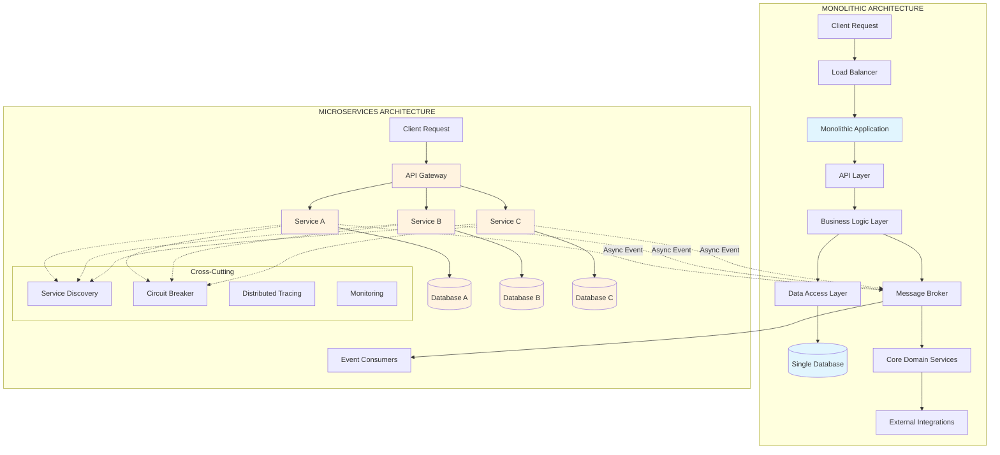

# Microservices vs Monolith

## Overview

Understanding the fundamental differences between microservices and monolithic architectures is essential for making informed architectural decisions in software development. This comprehensive guide explores both approaches, examining their characteristics, advantages, disadvantages, and providing frameworks for choosing the right architecture for your specific needs.

### What is Monolithic Architecture?

Monolithic architecture is the traditional approach to building software applications where all components are tightly coupled and deployed as a single, unified unit. In a monolithic application, the user interface, business logic, data access layer, and database are all packaged together into one deployment artifact, typically a WAR file, JAR file, or executable. This means that every function and feature of the application shares the same memory space, runs in the same process, and typically uses a single database for all data persistence needs.

The monolithic architecture has been the dominant pattern for decades, particularly in enterprise software development. When you build a typical web application using frameworks like Spring Boot, Django, Ruby on Rails, or ASP.NET, you are typically creating a monolith unless you explicitly design for microservices. The framework itself encourages this approach by providing conventions that bundle everything together, making it the path of least resistance for developers.

Monolithic applications are characterized by several key features that distinguish them from distributed architectures. First, they have a unified codebase where all functionality exists in a single project or repository. Second, they use a single technology stack throughout the application, meaning you use one programming language, one framework, and one database for everything. Third, they deploy as one unit, requiring the entire application to be rebuilt and redeployed for any change, no matter how small. Fourth, they scale as a whole, meaning you must replicate the entire application to handle increased load, even if only one component is under stress.

Despite these perceived limitations, monolithic architecture offers significant advantages that make it the right choice for many applications and organizations. The simplicity of development allows developers to understand the entire system more easily, particularly when onboarding new team members. Debugging is straightforward because all code runs in the same process, making it easy to trace execution and set breakpoints across the entire application. Deployment is simple, requiring only one artifact to be deployed to production. Testing is easier to perform at the integration level since everything runs together. The operational overhead is minimal, requiring only basic infrastructure knowledge to deploy and manage the application.

### What is Microservices Architecture?

Microservices architecture is an approach that structures an application as a collection of loosely coupled, independently deployable services. Each microservice is a self-contained business capability that encapsulates a specific domain or functional area of the application. These services communicate with each other through well-defined APIs, typically over HTTP using REST or gRPC protocols, or through asynchronous message-based communication using message brokers like RabbitMQ, Kafka, or AWS SQS.

The microservices architecture emerged as a solution to the challenges faced by large-scale monolithic applications, particularly in organizations with multiple teams working on the same codebase. Companies like Amazon, Netflix, and Uber pioneered this approach in the early 2000s to support their rapid growth and need for continuous deployment of new features. The formal term "microservices" was coined in 2014 by James Lewis and Martin Fowler, who described it as an approach to developing a single application as a suite of small services, each running in its own process and communicating with lightweight mechanisms.

Microservices architectures are characterized by several defining principles that guide their design and implementation. Each service is independently deployable, meaning you can update or scale one service without affecting others. Services own their data and have their own databases, following the principle of decentralized data management. Services are organized around business capabilities rather than technical layers, allowing each team to focus on a specific domain. The architecture embraces polyglot persistence, allowing each service to use the most appropriate database technology for its specific needs. Infrastructure automation is essential, with robust CI/CD pipelines, containerization, and orchestration systems being fundamental requirements.

The benefits of microservices architecture are substantial for the right use cases. Team autonomy allows different teams to work on different services simultaneously without stepping on each other's toes, dramatically accelerating development velocity. Technology flexibility enables each service to use different programming languages, frameworks, and databases based on its specific requirements. Independent scaling allows you to scale only the services that are under heavy load, optimizing infrastructure costs. Fault isolation means that failures in one service do not cascade to bring down the entire system. Faster deployment cycles enable teams to deploy updates independently, reducing the risk and impact of each change.

### Key Differences: Development, Deployment, and Scaling

The differences between monolithic and microservices architectures extend far beyond just the number of deployable units. These differences impact every aspect of the software development lifecycle and require different organizational structures, skill sets, and operational capabilities to be successful.

In terms of development, monolithic applications typically have a single codebase that all developers work in, requiring coordination to avoid merge conflicts and ensuring consistent code quality. While this provides a complete view of the system, it can become challenging as the codebase grows and more developers work in parallel. Microservices have multiple codebases, one for each service, allowing teams to work independently. However, this fragmentation requires robust practices for API versioning, documentation, and maintaining consistency across services.

Deployment approaches differ significantly between the two architectures. A monolith requires rebuilding and redeploying the entire application for any change, which can be risky and time-consuming. While blue-green deployments can reduce downtime, the blast radius of any deployment issue affects the entire application. Microservices allow independent deployment of each service, enabling teams to deploy changes more frequently and with less risk. However, this requires sophisticated deployment automation, service discovery, and rollback mechanisms to manage the complexity of coordinating multiple services.

Scaling strategies represent one of the most significant differences between the two approaches. Monolithic applications scale vertically by increasing the resources (CPU, memory) of a single server, or horizontally by replicating the entire application across multiple servers with load balancing. This means you must scale everything even if only one component is experiencing high demand. Microservices enable horizontal scaling at the service level, allowing you to deploy more instances of specific services based on their individual load characteristics. For example, an e-commerce application might run ten instances of the product catalog service while running only two instances of the returns service.

### Team Structure and Organization

The architectural choice between microservices and monolith has profound implications for how teams are organized and how they collaborate. This relationship is described by Conway's Law, which states that organizations that design systems are constrained to produce designs which are copies of the communication structures of these organizations.

In a monolithic architecture, teams are typically organized around technical layers or functional areas within the application. You might have a frontend team, a backend team, and a database team, or teams organized by features that cross-cut these layers. Communication is typically synchronous and frequent, as developers work in the same codebase and need to coordinate their changes. Code reviews and integration testing are essential for maintaining quality and avoiding conflicts.

Microservices architecture enables a team-of-teams model where each team is responsible for one or more services from conception through production. This ownership includes designing, implementing, testing, deploying, and operating the service. Teams are typically organized around business capabilities or product areas, with each team having end-to-end responsibility for their domain. This autonomy allows teams to make decisions quickly without coordinating with other teams, but it requires clear API contracts and communication protocols to ensure services work together correctly.

The size and structure of the organization should inform the architectural choice. Small teams with limited operational experience may struggle with the complexity of microservices, while large organizations with multiple teams working on the same codebase may find that microservices provide the autonomy they need to move fast. The microservices pattern is not inherently better or worse; it's a tool that addresses specific organizational challenges.

### Technology Flexibility and Stack Choices

Monolithic architectures typically enforce a single technology stack throughout the application. All code is written in the same programming language, uses the same framework, connects to the same type of database, and follows the same patterns and conventions. This homogeneity has advantages: developers can move between parts of the codebase more easily, there are fewer technology decisions to make, and the team builds deep expertise in their chosen stack. However, it can also be limiting when different parts of the application have different requirements.

Microservices architecture embraces polyglot architecture, allowing each service to use the most appropriate technology for its specific needs. A service that requires complex relational queries might use PostgreSQL, while a service that needs high-speed lookups might use Redis. A service that benefits from functional programming patterns might be written in Scala or Elixir, while a service that needs to process large amounts of data might use Python. This flexibility allows teams to choose the best tool for each job, but it requires additional expertise and introduces complexity in managing multiple technologies.

The choice of technology stack also affects the hiring and onboarding process. Monolithic applications with a single stack are simpler to staff, as you need only hire developers familiar with that stack. Microservices can require a broader set of skills across the organization, as different teams may be working with different technologies. However, this can also be an advantage in attracting developers who want to work with specific technologies.

### Operational Complexity and Infrastructure

The operational complexity of microservices versus monolithic architectures represents one of the most significant factors in choosing between them. This complexity is often underestimated by organizations adopting microservices, leading to operational challenges that can outweigh the benefits.

Monolithic applications are operationally simple to deploy, monitor, and debug. Deployment requires copying a single artifact to a server or container. Monitoring requires tracking a single application's metrics, logs, and health. Debugging involves tracing requests through a single process, which is straightforward with traditional debugging tools. Troubleshooting typically involves looking at one set of logs and one set of metrics. The operational skills required are fundamental: basic server management, web server configuration, and database administration.

Microservices introduce significant operational complexity that requires specialized skills and tools. Each service must be deployed, monitored, and scaled independently. Distributed tracing is essential to understand how requests flow through multiple services. Log aggregation must collect and correlate logs from many services. Health monitoring must track the health of each service and detect cascading failures. Service discovery must dynamically locate service instances as they scale up and down. Network communication must be managed between services, requiring attention to latency, reliability, and security. This operational burden requires investment in DevOps expertise, monitoring tools, and automation infrastructure.

### Data Management and Transactions

Data management differs fundamentally between monolithic and microservices architectures, with significant implications for data consistency, application design, and operational complexity.

Monolithic applications typically use a single database for all data persistence, enabling ACID transactions that guarantee data consistency. Operations that span multiple tables can be wrapped in a single transaction, ensuring that either all changes succeed or all changes are rolled back. Complex queries that span multiple domains can be written using JOINs across tables. While this simplicity is powerful, it can also create bottlenecks as the application scales, with all operations competing for the same database resources.

Microservices follow the principle of database per service, where each service owns its data and exposes it only through its API. This isolation provides loose coupling between services and allows each service to choose its own database technology. However, it also means that operations that span multiple services cannot use traditional database transactions. Instead, distributed systems patterns like sagas must be used to coordinate changes across services, accepting eventual consistency rather than strong consistency. Queries that aggregate data from multiple services require making multiple API calls and combining the results, which can be slower and more complex.

### Testing Approaches

Testing strategies must adapt to the architectural approach, with significant differences in how tests are written, organized, and executed.

Monolithic applications can leverage comprehensive integration testing that exercises the entire application in a realistic environment. Because all components run in the same process, integration tests can verify that the UI, business logic, and database all work together correctly. Unit tests can test individual classes and methods in isolation. The testing pyramid is straightforward: many unit tests at the bottom, fewer integration tests in the middle, and few end-to-end tests at the top. Test databases can be set up once and used for all tests.

Microservices require a different testing strategy that accounts for distributed communication and service independence. Unit tests still apply to individual service logic. Integration tests verify that a service correctly communicates with its dependencies. Contract tests verify that services correctly implement the APIs they expose and consume. End-to-end tests verify that complete user journeys work across multiple services, but these become more expensive to run and more fragile due to the distributed nature of the system. Service virtualization or mock services are often used to isolate services during testing, allowing tests to run faster and more reliably.

### Decision Framework: Choosing the Right Architecture

Choosing between microservices and monolithic architecture requires careful consideration of multiple factors, including team size, organizational structure, system complexity, scaling requirements, and operational capabilities. Neither architecture is universally superior; the right choice depends on the specific context.

Monolithic architecture is often the right choice in the following situations. Small teams with limited experience in distributed systems will find it easier to develop, test, and operate a monolith. Applications with straightforward requirements that are unlikely to need independent scaling of components benefit from the simplicity. Early-stage startups that need to iterate quickly and may pivot their business model benefit from the ability to make changes quickly across the entire system. Organizations with limited DevOps capabilities can deploy and operate a monolith with basic infrastructure knowledge. Applications with tight consistency requirements benefit from the ability to use database transactions.

Microservices architecture is often the right choice in the following situations. Large organizations with multiple teams that need to work independently benefit from the team autonomy microservices provide. Applications with components that have very different scaling requirements can scale each component independently. Systems that need to use different technologies for different components can leverage polyglot architecture. Organizations with strong DevOps capabilities can manage the operational complexity. Applications that require high availability and fault isolation benefit from the independent failure domains. Systems that need to deploy frequently with minimal risk benefit from independent deployment.

A practical approach is to start with a modular monolith that separates components into distinct modules or packages within a single deployment unit. This provides the benefits of clean architecture and service boundaries while maintaining the operational simplicity of a monolith. As the system grows and the need for independent deployment or scaling emerges, services can be extracted from the monolith into truly independent services. This evolutionary approach allows organizations to begin with simplicity and add complexity only when needed.

### Comparison Chart: Microservices vs Monolith

The following comprehensive comparison highlights the key differences across multiple dimensions that matter when choosing an architecture.

| Dimension | Monolithic Architecture | Microservices Architecture |
|-----------|------------------------|---------------------------|
| Code Structure | Single codebase, all components in one project | Multiple codebases, one per service |
| Deployment | Single unit, entire app deployed together | Independent services, deployed separately |
| Scaling | Vertical scaling or horizontal replication of entire app | Horizontal scaling per service |
| Technology Stack | Single stack throughout | Polyglot, each service can use different technologies |
| Data Management | Single database, ACID transactions | Database per service, eventual consistency |
| Team Structure | Organized by layers or features | Organized by service ownership |
| Development Speed | Slower as codebase grows | Faster with team autonomy |
| Fault Isolation | Single failure affects entire system | Failures contained to one service |
| Operational Complexity | Low | High |
| Infrastructure Requirements | Basic servers and databases | Containers, orchestration, service mesh |
| Testing | Integration testing is straightforward | Requires contract testing, distributed tracing |
| Time to Initial Deployment | Faster to get started | More setup time for infrastructure |
| Debugging | Simple, single process | Complex, distributed across services |
| Network Latency | In-process calls, very fast | Network calls between services |
| Data Consistency | Strong consistency with transactions | Eventual consistency with sagas |

## Flow Chart

The following diagram illustrates the architectural differences between monolithic and microservices approaches, showing how requests flow through each type of system and the key components involved.



The flow chart illustrates several key architectural differences. In the monolith, all requests flow through a single application instance that handles all business logic and data access. The monolithic application typically follows layered architecture patterns with API, business logic, and data access layers. All components share the same database and run in the same process.

In microservices architecture, requests enter through an API gateway that routes to appropriate services. Each service maintains its own database and can be scaled independently. Services communicate both synchronously through the API gateway and asynchronously through a message broker. Cross-cutting concerns like service discovery, circuit breakers, and distributed tracing are handled by infrastructure components that span all services.

## Standard Example

### E-Commerce Application: Monolithic vs Microservices Implementation

This section demonstrates how to build a simple e-commerce application using both architectures, highlighting the differences in code structure, deployment, and operational characteristics.

### Monolithic Implementation

The monolithic implementation packages all functionality into a single application with clear module boundaries but unified deployment.

```java
// Monolithic E-Commerce Application
// File: com.ecommerce.EcommerceApplication.java

package com.ecommerce;

import org.springframework.boot.SpringApplication;
import org.springframework.boot.autoconfigure.SpringBootApplication;
import org.springframework.web.bind.annotation.*;
import org.springframework.stereotype.Service;
import org.springframework.beans.factory.annotation.Autowired;
import org.springframework.transaction.annotation.Transactional;
import org.springframework.http.ResponseEntity;
import org.springframework.http.HttpStatus;

import jakarta.persistence.*;
import java.util.List;
import java.util.Optional;
import java.util.UUID;

@SpringBootApplication
public class EcommerceApplication {
    
    public static void main(String[] args) {
        SpringApplication.run(EcommerceApplication.class, args);
    }
}

// ============================================================================
// DOMAIN MODELS - Shared across all modules in the monolith
// ============================================================================

@Entity
@Table(name = "users")
class User {
    
    @Id
    @GeneratedValue(strategy = GenerationType.UUID)
    private UUID id;
    
    @Column(unique = true, nullable = false)
    private String email;
    
    @Column(nullable = false)
    private String name;
    
    @Column
    private String address;
    
    @Column
    private String phone;
    
    // Getters, setters, constructors
    public UUID getId() { return id; }
    public void setId(UUID id) { this.id = id; }
    public String getEmail() { return email; }
    public void setEmail(String email) { this.email = email; }
    public String getName() { return name; }
    public void setName(String name) { this.name = name; }
    public String getAddress() { return address; }
    public void setAddress(String address) { this.address = address; }
    public String getPhone() { return phone; }
    public void setPhone(String phone) { this.phone = phone; }
}

@Entity
@Table(name = "products")
class Product {
    
    @Id
    @GeneratedValue(strategy = GenerationType.UUID)
    private UUID id;
    
    @Column(nullable = false)
    private String name;
    
    @Column(length = 2000)
    private String description;
    
    @Column(nullable = false)
    private BigDecimal price;
    
    @Column
    private Integer stockQuantity;
    
    @Column
    private String category;
    
    // Getters, setters, constructors
    public UUID getId() { return id; }
    public void setId(UUID id) { this.id = id; }
    public String getName() { return name; }
    public void setName(String name) { this.name = name; }
    public String getDescription() { return description; }
    public void setDescription(String description) { this.description = description; }
    public BigDecimal getPrice() { return price; }
    public void setPrice(BigDecimal price) { this.price = price; }
    public Integer getStockQuantity() { return stockQuantity; }
    public void setStockQuantity(Integer stockQuantity) { this.stockQuantity = stockQuantity; }
    public String getCategory() { return category; }
    public void setCategory(String category) { this.category = category; }
}

@Entity
@Table(name = "orders")
class Order {
    
    public enum Status { PENDING, CONFIRMED, SHIPPED, DELIVERED, CANCELLED }
    
    @Id
    @GeneratedValue(strategy = GenerationType.UUID)
    private UUID id;
    
    @ManyToOne
    @JoinColumn(name = "user_id", nullable = false)
    private User user;
    
    @Column(nullable = false)
    @Enumerated(EnumType.STRING)
    private Status status;
    
    @Column(nullable = false)
    private BigDecimal totalAmount;
    
    @Column
    private LocalDateTime createdAt;
    
    @Column
    private LocalDateTime updatedAt;
    
    @OneToMany(mappedBy = "order", cascade = CascadeType.ALL)
    private List<OrderItem> items;
    
    // Getters, setters, constructors
}

@Entity
@Table(name = "order_items")
class OrderItem {
    
    @Id
    @GeneratedValue(strategy = GenerationType.UUID)
    private UUID id;
    
    @ManyToOne
    @JoinColumn(name = "order_id", nullable = false)
    private Order order;
    
    @ManyToOne
    @JoinColumn(name = "product_id", nullable = false)
    private Product product;
    
    @Column(nullable = false)
    private Integer quantity;
    
    @Column(nullable = false)
    private BigDecimal unitPrice;
    
    // Getters, setters, constructors
}

// ============================================================================
// REPOSITORIES - Data access layer
// All repositories share the same database in the monolith
// ============================================================================

interface UserRepository extends JpaRepository<User, UUID> {
    Optional<User> findByEmail(String email);
}

interface ProductRepository extends JpaRepository<Product, UUID> {
    List<Product> findByCategory(String category);
    List<Product> findByNameContainingIgnoreCase(String name);
}

interface OrderRepository extends JpaRepository<Order, UUID> {
    List<Order> findByUserId(UUID userId);
    List<Order> findByStatus(Order.Status status);
}

// ============================================================================
// SERVICES - Business logic layer
// All services run in the same process and can call each other directly
// ============================================================================

@Service
class UserService {
    
    @Autowired
    private UserRepository userRepository;
    
    // Direct method calls to other services - no network overhead
    @Autowired
    private OrderService orderService;
    
    public User createUser(String email, String name, String address, String phone) {
        User user = new User();
        user.setEmail(email);
        user.setName(name);
        user.setAddress(address);
        user.setPhone(phone);
        return userRepository.save(user);
    }
    
    public Optional<User> getUserById(UUID id) {
        return userRepository.findById(id);
    }
    
    public List<Order> getUserOrders(UUID userId) {
        // Direct call to OrderService - runs in same process
        return orderService.getOrdersByUserId(userId);
    }
    
    public User updateUser(UUID id, User updatedUser) {
        User user = userRepository.findById(id)
            .orElseThrow(() -> new RuntimeException("User not found"));
        user.setName(updatedUser.getName());
        user.setAddress(updatedUser.getAddress());
        user.setPhone(updatedUser.getPhone());
        return userRepository.save(user);
    }
}

@Service
class ProductService {
    
    @Autowired
    private ProductRepository productRepository;
    
    public Product createProduct(String name, String description, 
                                  BigDecimal price, Integer stockQuantity, String category) {
        Product product = new Product();
        product.setName(name);
        product.setDescription(description);
        product.setPrice(price);
        product.setStockQuantity(stockQuantity);
        product.setCategory(category);
        return productRepository.save(product);
    }
    
    public List<Product> getAllProducts() {
        return productRepository.findAll();
    }
    
    public Optional<Product> getProductById(UUID id) {
        return productRepository.findById(id);
    }
    
    public List<Product> searchProducts(String query) {
        return productRepository.findByNameContainingIgnoreCase(query);
    }
    
    public Product updateStock(UUID productId, Integer quantityChange) {
        Product product = productRepository.findById(productId)
            .orElseThrow(() -> new RuntimeException("Product not found"));
        
        int newStock = product.getStockQuantity() + quantityChange;
        if (newStock < 0) {
            throw new RuntimeException("Insufficient stock");
        }
        product.setStockQuantity(newStock);
        return productRepository.save(product);
    }
}

@Service
class OrderService {
    
    @Autowired
    private OrderRepository orderRepository;
    
    @Autowired
    private ProductService productService;
    
    @Autowired
    private UserService userService;
    
    // Database transaction ensures all-or-nothing operation
    @Transactional
    public Order createOrder(UUID userId, List<OrderRequestItem> items) {
        // Validate user exists - direct call, same transaction
        User user = userService.getUserById(userId)
            .orElseThrow(() -> new RuntimeException("User not found"));
        
        // Create order in pending status
        Order order = new Order();
        order.setUser(user);
        order.setStatus(Order.Status.PENDING);
        order.setTotalAmount(BigDecimal.ZERO);
        order.setCreatedAt(LocalDateTime.now());
        
        BigDecimal totalAmount = BigDecimal.ZERO;
        
        // Process each item - can roll back entire order if any fails
        for (OrderRequestItem item : items) {
            Product product = productService.getProductById(item.getProductId())
                .orElseThrow(() -> new RuntimeException("Product not found: " + item.getProductId()));
            
            // Check and update stock atomically within the transaction
            productService.updateStock(product.getId(), -item.getQuantity());
            
            OrderItem orderItem = new OrderItem();
            orderItem.setOrder(order);
            orderItem.setProduct(product);
            orderItem.setQuantity(item.getQuantity());
            orderItem.setUnitPrice(product.getPrice());
            
            order.getItems().add(orderItem);
            totalAmount = totalAmount.add(product.getPrice().multiply(BigDecimal.valueOf(item.getQuantity())));
        }
        
        order.setTotalAmount(totalAmount);
        order.setStatus(Order.Status.CONFIRMED);
        
        return orderRepository.save(order);
    }
    
    public List<Order> getOrdersByUserId(UUID userId) {
        return orderRepository.findByUserId(userId);
    }
    
    public Order updateOrderStatus(UUID orderId, Order.Status newStatus) {
        Order order = orderRepository.findById(orderId)
            .orElseThrow(() -> new RuntimeException("Order not found"));
        order.setStatus(newStatus);
        order.setUpdatedAt(LocalDateTime.now());
        return orderRepository.save(order);
    }
}

// Request DTOs
class OrderRequestItem {
    private UUID productId;
    private Integer quantity;
    
    public UUID getProductId() { return productId; }
    public void setProductId(UUID productId) { this.productId = productId; }
    public Integer getQuantity() { return quantity; }
    public void setQuantity(Integer quantity) { this.quantity = quantity; }
}

// ============================================================================
// REST CONTROLLERS - API layer
// All endpoints are in the same application
// ============================================================================

@RestController
@RequestMapping("/api/v1/users")
class UserController {
    
    @Autowired
    private UserService userService;
    
    @PostMapping
    public ResponseEntity<User> createUser(@RequestBody CreateUserRequest request) {
        User user = userService.createUser(
            request.getEmail(),
            request.getName(),
            request.getAddress(),
            request.getPhone()
        );
        return ResponseEntity.status(HttpStatus.CREATED).body(user);
    }
    
    @GetMapping("/{id}")
    public ResponseEntity<User> getUser(@PathVariable UUID id) {
        return userService.getUserById(id)
            .map(ResponseEntity::ok)
            .orElse(ResponseEntity.notFound().build());
    }
    
    @GetMapping("/{id}/orders")
    public ResponseEntity<List<Order>> getUserOrders(@PathVariable UUID id) {
        List<Order> orders = userService.getUserOrders(id);
        return ResponseEntity.ok(orders);
    }
}

@RestController
@RequestMapping("/api/v1/products")
class ProductController {
    
    @Autowired
    private ProductService productService;
    
    @PostMapping
    public ResponseEntity<Product> createProduct(@RequestBody CreateProductRequest request) {
        Product product = productService.createProduct(
            request.getName(),
            request.getDescription(),
            request.getPrice(),
            request.getStockQuantity(),
            request.getCategory()
        );
        return ResponseEntity.status(HttpStatus.CREATED).body(product);
    }
    
    @GetMapping
    public ResponseEntity<List<Product>> getAllProducts() {
        return ResponseEntity.ok(productService.getAllProducts());
    }
    
    @GetMapping("/{id}")
    public ResponseEntity<Product> getProduct(@PathVariable UUID id) {
        return productService.getProductById(id)
            .map(ResponseEntity::ok)
            .orElse(ResponseEntity.notFound().build());
    }
    
    @GetMapping("/search")
    public ResponseEntity<List<Product>> searchProducts(@RequestParam String q) {
        return ResponseEntity.ok(productService.searchProducts(q));
    }
}

@RestController
@RequestMapping("/api/v1/orders")
class OrderController {
    
    @Autowired
    private OrderService orderService;
    
    @PostMapping
    public ResponseEntity<Order> createOrder(@RequestBody CreateOrderRequest request) {
        Order order = orderService.createOrder(request.getUserId(), request.getItems());
        return ResponseEntity.status(HttpStatus.CREATED).body(order);
    }
    
    @GetMapping("/user/{userId}")
    public ResponseEntity<List<Order>> getUserOrders(@PathVariable UUID userId) {
        return ResponseEntity.ok(orderService.getOrdersByUserId(userId));
    }
}
```

### Microservices Implementation

The microservices implementation splits functionality into separate services, each with its own database and deployment pipeline.

```java
// ============================================================================
// USER SERVICE - Independent microservice for user management
// File: user-service/src/main/java/com/ecommerce/userservice/UserServiceApplication.java
// ============================================================================

package com.ecommerce.userservice;

import org.springframework.boot.SpringApplication;
import org.springframework.boot.autoconfigure.SpringBootApplication;
import org.springframework.web.bind.annotation.*;
import org.springframework.stereotype.Service;
import org.springframework.beans.factory.annotation.Autowired;
import org.springframework.http.ResponseEntity;
import org.springframework.http.HttpStatus;

import jakarta.persistence.*;
import java.util.UUID;

@SpringBootApplication
public class UserServiceApplication {
    public static void main(String[] args) {
        SpringApplication.run(UserServiceApplication.class, args);
    }
}

// Only User entity - this service owns user data
@Entity
@Table(name = "users")
class User {
    
    @Id
    @GeneratedValue(strategy = GenerationType.UUID)
    private UUID id;
    
    @Column(unique = true, nullable = false)
    private String email;
    
    @Column(nullable = false)
    private String name;
    
    @Column
    private String address;
    
    @Column
    private String phone;
    
    // Getters and setters
    public UUID getId() { return id; }
    public void setId(UUID id) { this.id = id; }
    public String getEmail() { return email; }
    public void setEmail(String email) { this.email = email; }
    public String getName() { return name; }
    public void setName(String name) { this.name = name; }
    public String getAddress() { return address; }
    public void setAddress(String address) { this.address = address; }
    public String getPhone() { return phone; }
    public void setPhone(String phone) { this.phone = phone; }
}

interface UserRepository extends JpaRepository<User, UUID> {
    Optional<User> findByEmail(String email);
}

@Service
class UserService {
    
    @Autowired
    private UserRepository userRepository;
    
    @Autowired
    private EventPublisher eventPublisher;
    
    public User createUser(String email, String name, String address, String phone) {
        User user = new User();
        user.setEmail(email);
        user.setName(name);
        user.setAddress(address);
        user.setPhone(phone);
        
        User savedUser = userRepository.save(user);
        
        // Publish event for other services to react
        eventPublisher.publish("user.created", Map.of(
            "userId", savedUser.getId().toString(),
            "email", savedUser.getEmail(),
            "name", savedUser.getName()
        ));
        
        return savedUser;
    }
    
    public Optional<User> getUserById(UUID id) {
        return userRepository.findById(id);
    }
}

@RestController
@RequestMapping("/api/v1/users")
class UserController {
    
    @Autowired
    private UserService userService;
    
    @PostMapping
    public ResponseEntity<User> createUser(@RequestBody CreateUserRequest request) {
        User user = userService.createUser(
            request.getEmail(),
            request.getName(),
            request.getAddress(),
            request.getPhone()
        );
        return ResponseEntity.status(HttpStatus.CREATED).body(user);
    }
    
    @GetMapping("/{id}")
    public ResponseEntity<User> getUser(@PathVariable UUID id) {
        return userService.getUserById(id)
            .map(ResponseEntity::ok)
            .orElse(ResponseEntity.notFound().build());
    }
}

// ============================================================================
// PRODUCT SERVICE - Independent microservice for product management
// File: product-service/src/main/java/com/ecommerce/productservice/ProductServiceApplication.java
// ============================================================================

package com.ecommerce.productservice;

import org.springframework.boot.SpringApplication;
import org.springframework.boot.autoconfigure.SpringBootApplication;
import org.springframework.web.bind.annotation.*;
import org.springframework.stereotype.Service;
import org.springframework.beans.factory.annotation.Autowired;
import org.springframework.http.ResponseEntity;
import org.springframework.http.HttpStatus;

import jakarta.persistence.*;
import java.math.BigDecimal;
import java.util.List;
import java.util.UUID;

@SpringBootApplication
public class ProductServiceApplication {
    public static void main(String[] args) {
        SpringApplication.run(ProductServiceApplication.class, args);
    }
}

@Entity
@Table(name = "products")
class Product {
    
    @Id
    @GeneratedValue(strategy = GenerationType.UUID)
    private UUID id;
    
    @Column(nullable = false)
    private String name;
    
    @Column(length = 2000)
    private String description;
    
    @Column(nullable = false)
    private BigDecimal price;
    
    @Column
    private Integer stockQuantity;
    
    @Column
    private String category;
    
    // Getters and setters
    public UUID getId() { return id; }
    public void setId(UUID id) { this.id = id; }
    public String getName() { return name; }
    public void setName(String name) { this.name = name; }
    public String getDescription() { return description; }
    public void setDescription(String description) { this.description = description; }
    public BigDecimal getPrice() { return price; }
    public void setPrice(BigDecimal price) { this.price = price; }
    public Integer getStockQuantity() { return stockQuantity; }
    public void setStockQuantity(Integer stockQuantity) { this.stockQuantity = stockQuantity; }
    public String getCategory() { return category; }
    public void setCategory(String category) { this.category = category; }
}

interface ProductRepository extends JpaRepository<Product, UUID> {
    List<Product> findByCategory(String category);
    List<Product> findByNameContainingIgnoreCase(String name);
}

@Service
class ProductService {
    
    @Autowired
    private ProductRepository productRepository;
    
    public Product createProduct(String name, String description, 
                                  BigDecimal price, Integer stockQuantity, String category) {
        Product product = new Product();
        product.setName(name);
        product.setDescription(description);
        product.setPrice(price);
        product.setStockQuantity(stockQuantity);
        product.setCategory(category);
        return productRepository.save(product);
    }
    
    public List<Product> getAllProducts() {
        return productRepository.findAll();
    }
    
    public Optional<Product> getProductById(UUID id) {
        return productRepository.findById(id);
    }
    
    public List<Product> searchProducts(String query) {
        return productRepository.findByNameContainingIgnoreCase(query);
    }
    
    @Transactional
    public Product updateStock(UUID productId, Integer quantityChange) {
        Product product = productRepository.findById(productId)
            .orElseThrow(() -> new RuntimeException("Product not found"));
        
        int newStock = product.getStockQuantity() + quantityChange;
        if (newStock < 0) {
            throw new RuntimeException("Insufficient stock");
        }
        product.setStockQuantity(newStock);
        return productRepository.save(product);
    }
}

@RestController
@RequestMapping("/api/v1/products")
class ProductController {
    
    @Autowired
    private ProductService productService;
    
    @PostMapping
    public ResponseEntity<Product> createProduct(@RequestBody CreateProductRequest request) {
        Product product = productService.createProduct(
            request.getName(),
            request.getDescription(),
            request.getPrice(),
            request.getStockQuantity(),
            request.getCategory()
        );
        return ResponseEntity.status(HttpStatus.CREATED).body(product);
    }
    
    @GetMapping
    public ResponseEntity<List<Product>> getAllProducts() {
        return ResponseEntity.ok(productService.getAllProducts());
    }
    
    @GetMapping("/{id}")
    public ResponseEntity<Product> getProduct(@PathVariable UUID id) {
        return productService.getProductById(id)
            .map(ResponseEntity::ok)
            .orElse(ResponseEntity.notFound().build());
    }
    
    @GetMapping("/search")
    public ResponseEntity<List<Product>> searchProducts(@RequestParam String q) {
        return ResponseEntity.ok(productService.searchProducts(q));
    }
}

// ============================================================================
// ORDER SERVICE - Independent microservice for order management
// Uses HTTP calls to User Service and Product Service
// File: order-service/src/main/java/com/ecommerce/orderservice/OrderServiceApplication.java
// ============================================================================

package com.ecommerce.orderservice;

import org.springframework.boot.SpringApplication;
import org.springframework.boot.autoconfigure.SpringBootApplication;
import org.springframework.web.bind.annotation.*;
import org.springframework.stereotype.Service;
import org.springframework.beans.factory.annotation.Autowired;
import org.springframework.http.ResponseEntity;
import org.springframework.http.HttpStatus;
import org.springframework.web.client.RestTemplate;

import jakarta.persistence.*;
import java.math.BigDecimal;
import java.time.LocalDateTime;
import java.util.List;
import java.util.UUID;
import java.util.stream.Collectors;

@SpringBootApplication
public class OrderServiceApplication {
    
    // RestTemplate configured for inter-service communication
    @Bean
    public RestTemplate restTemplate() {
        return new RestTemplate();
    }
    
    public static void main(String[] args) {
        SpringApplication.run(OrderServiceApplication.class, args);
    }
}

// Order entity - this service owns order data
@Entity
@Table(name = "orders")
class Order {
    
    public enum Status { PENDING, CONFIRMED, SHIPPED, DELIVERED, CANCELLED }
    
    @Id
    @GeneratedValue(strategy = GenerationType.UUID)
    private UUID id;
    
    @Column(name = "user_id", nullable = false)
    private UUID userId;
    
    @Column(nullable = false)
    @Enumerated(EnumType.STRING)
    private Status status;
    
    @Column(nullable = false)
    private BigDecimal totalAmount;
    
    @Column
    private LocalDateTime createdAt;
    
    @Column
    private LocalDateTime updatedAt;
    
    @OneToMany(mappedBy = "order", cascade = CascadeType.ALL)
    private List<OrderItem> items;
    
    // Getters and setters
    public UUID getId() { return id; }
    public void setId(UUID id) { this.id = id; }
    public UUID getUserId() { return userId; }
    public void setUserId(UUID userId) { this.userId = userId; }
    public Status getStatus() { return status; }
    public void setStatus(Status status) { this.status = status; }
    public BigDecimal getTotalAmount() { return totalAmount; }
    public void setTotalAmount(BigDecimal totalAmount) { this.totalAmount = totalAmount; }
    public LocalDateTime getCreatedAt() { return createdAt; }
    public void setCreatedAt(LocalDateTime createdAt) { this.createdAt = createdAt; }
    public LocalDateTime getUpdatedAt() { return updatedAt; }
    public void setUpdatedAt(LocalDateTime updatedAt) { this.updatedAt = updatedAt; }
    public List<OrderItem> getItems() { return items; }
    public void setItems(List<OrderItem> items) { this.items = items; }
}

@Entity
@Table(name = "order_items")
class OrderItem {
    
    @Id
    @GeneratedValue(strategy = GenerationType.UUID)
    private UUID id;
    
    @ManyToOne
    @JoinColumn(name = "order_id", nullable = false)
    private Order order;
    
    @Column(name = "product_id", nullable = false)
    private UUID productId;
    
    @Column(nullable = false)
    private Integer quantity;
    
    @Column(nullable = false)
    private BigDecimal unitPrice;
    
    // Getters and setters
}

interface OrderRepository extends JpaRepository<Order, UUID> {
    List<Order> findByUserId(UUID userId);
}

@Service
class OrderService {
    
    @Autowired
    private OrderRepository orderRepository;
    
    @Autowired
    private RestTemplate restTemplate;
    
    @Autowired
    private EventPublisher eventPublisher;
    
    // Service URLs - typically from configuration
    @Value("${services.user-service.url:http://localhost:8081}")
    private String userServiceUrl;
    
    @Value("${services.product-service.url:http://localhost:8082}")
    private String productServiceUrl;
    
    public Order createOrder(UUID userId, List<OrderRequestItem> items) {
        // Validate user exists by calling User Service over HTTP
        try {
            restTemplate.getForObject(
                userServiceUrl + "/api/v1/users/" + userId,
                UserResponse.class
            );
        } catch (HttpClientErrorException.NotFound e) {
            throw new RuntimeException("User not found: " + userId);
        }
        
        // Create order
        Order order = new Order();
        order.setUserId(userId);
        order.setStatus(Order.Status.PENDING);
        order.setTotalAmount(BigDecimal.ZERO);
        order.setCreatedAt(LocalDateTime.now());
        
        BigDecimal totalAmount = BigDecimal.ZERO;
        
        // Process each item by calling Product Service
        for (OrderRequestItem item : items) {
            // Get product from Product Service
            ProductResponse product;
            try {
                product = restTemplate.getForObject(
                    productServiceUrl + "/api/v1/products/" + item.getProductId(),
                    ProductResponse.class
                );
            } catch (HttpClientErrorException.NotFound e) {
                throw new RuntimeException("Product not found: " + item.getProductId());
            }
            
            // Update stock in Product Service - separate HTTP call
            try {
                restTemplate.exchange(
                    productServiceUrl + "/api/v1/products/" + item.getProductId() + "/stock",
                    HttpMethod.PUT,
                    new HttpEntity<>(new StockUpdateRequest(-item.getQuantity())),
                    Void.class
                );
            } catch (HttpClientErrorException e) {
                throw new RuntimeException("Failed to update stock: " + e.getMessage());
            }
            
            // Create order item
            OrderItem orderItem = new OrderItem();
            orderItem.setOrder(order);
            orderItem.setProductId(item.getProductId());
            orderItem.setQuantity(item.getQuantity());
            orderItem.setUnitPrice(product.getPrice());
            
            order.getItems().add(orderItem);
            totalAmount = totalAmount.add(
                product.getPrice().multiply(BigDecimal.valueOf(item.getQuantity()))
            );
        }
        
        order.setTotalAmount(totalAmount);
        order.setStatus(Order.Status.CONFIRMED);
        
        Order savedOrder = orderRepository.save(order);
        
        // Publish event for other services
        eventPublisher.publish("order.created", Map.of(
            "orderId", savedOrder.getId().toString(),
            "userId", userId.toString(),
            "totalAmount", totalAmount.toString()
        ));
        
        return savedOrder;
    }
    
    public List<Order> getOrdersByUserId(UUID userId) {
        return orderRepository.findByUserId(userId);
    }
}

@RestController
@RequestMapping("/api/v1/orders")
class OrderController {
    
    @Autowired
    private OrderService orderService;
    
    @PostMapping
    public ResponseEntity<Order> createOrder(@RequestBody CreateOrderRequest request) {
        Order order = orderService.createOrder(request.getUserId(), request.getItems());
        return ResponseEntity.status(HttpStatus.CREATED).body(order);
    }
    
    @GetMapping("/user/{userId}")
    public ResponseEntity<List<Order>> getUserOrders(@PathVariable UUID userId) {
        return ResponseEntity.ok(orderService.getOrdersByUserId(userId));
    }
}

// Response DTOs for inter-service communication
class UserResponse {
    private UUID id;
    private String email;
    private String name;
    // Getters and setters
}

class ProductResponse {
    private UUID id;
    private String name;
    private BigDecimal price;
    private Integer stockQuantity;
    // Getters and setters
}

class StockUpdateRequest {
    private Integer quantityChange;
    // Constructor, getters, setters
}
```

### Key Differences Between Implementations

The monolithic implementation demonstrates several fundamental differences from the microservices implementation. In the monolith, all entities exist in the same application, services can directly call each other as method calls without any network overhead, and a single database transaction can ensure atomicity across all operations. The code is simpler and easier to understand, with straightforward error handling and debugging.

In the microservices implementation, each service owns its data and exposes it only through APIs. Services communicate over HTTP using RestTemplate or similar clients, introducing network latency and the possibility of network failures. Each service has its own database, requiring different approaches to consistency. Error handling must account for service unavailability, network timeouts, and partial failures. The complexity of coordinating multiple services requires additional infrastructure like service discovery, circuit breakers, and distributed tracing.

## Real-World Example 1: Netflix Platform Architecture

### Netflix: From Monolith to Microservices at Scale

Netflix provides one of the most compelling case studies for microservices architecture, having transitioned from a monolithic DVD rental service to a streaming platform serving over 230 million subscribers through hundreds of microservices. This transformation offers valuable lessons for organizations considering similar architectural changes.

### The Monolithic Beginning

Netflix started as a DVD-by-mail service in 1997, and like most startups, it began with a monolithic architecture. Their initial application was a traditional three-tier architecture with a Java backend, relational database, and simple web interface. This architecture served them well for years as they grew from a small startup to a publicly traded company. However, as they expanded their offerings to include streaming video, the limitations of their monolithic architecture became increasingly apparent.

The monolithic codebase grew to millions of lines of code, making it difficult for developers to understand the full system. Deploying any change required rebuilding and redeploying the entire application, which was risky and time-consuming. A bug in one feature could potentially affect the entire system. Different components had different scaling requirements, but the monolithic architecture forced them to scale everything together. Teams working on different features had to coordinate closely to avoid conflicts, slowing down development velocity.

### The Microservices Transformation

Beginning around 2009, Netflix embarked on an ambitious program to decompose their monolithic architecture into hundreds of microservices. This transformation took years and required significant investment in infrastructure, tooling, and organizational changes. The key principles they adopted shaped the modern microservices ecosystem.

**Service Decomposition**: Netflix decomposed their system into services organized around business capabilities. Key services include the metadata service managing title information, the availability service tracking licensing and regional availability, the search service enabling full-text content search, the recommendation service generating personalized suggestions, the playback service managing video streaming, and the billing service handling subscriptions and payments. Each service is owned by a specific team with end-to-end responsibility.

**Database Per Service**: Each service maintains its own data store, choosing the most appropriate technology for its needs. The recommendation service uses Cassandra for its write-heavy, eventually consistent workload. The playback service uses Redis for low-latency session data. The billing service uses PostgreSQL for its transactional requirements. This polyglot persistence allows each service to optimize for its specific access patterns.

**Event-Driven Communication**: Services communicate through events for asynchronous, loosely coupled interactions. When a user watches a video, an event is published describing what was watched, when, and on what device. Multiple services can consume this event to update recommendations, track viewing history, adjust recommendations, and perform analytics. This event-driven approach decouples services and enables parallel processing.

**Infrastructure Investment**: Netflix built extensive infrastructure to support their microservices architecture. They developed and open-sourced Eureka for service registration and discovery, Hystrix for circuit breakers and fault tolerance, Zuul for API gateway and routing, and Ribbon for client-side load balancing. They also built the Netflix Prana sidecar for applications running outside their primary infrastructure.

### Implementation Details

```java
// Netflix-style Recommendation Service
// Demonstrates how Netflix implements service-to-service communication
// with resilience patterns

package com.netflix.recommendationservice;

import org.springframework.beans.factory.annotation.Value;
import org.springframework.boot.web.client.RestTemplateBuilder;
import org.springframework.context.annotation.Bean;
import org.springframework.stereotype.Service;
import org.springframework.web.client.RestTemplate;
import java.time.Duration;
import java.util.List;
import java.util.Map;
import java.util.stream.Collectors;

import com.netflix.hystrix.HystrixCommand;
import com.netflix.hystrix.HystrixCommandGroupKey;

@Configuration
class RecommendationConfig {
    
    @Value("${netflix.metadata-service.url}")
    private String metadataServiceUrl;
    
    @Value("${netflix.viewing-history-service.url}")
    private String viewingHistoryServiceUrl;
    
    @Bean
    public RestTemplate recommendationRestTemplate(RestTemplateBuilder builder) {
        return builder
            .connectTimeout(Duration.ofSeconds(5))    // Connection timeout
            .readTimeout(Duration.ofSeconds(10))       // Read timeout
            .build();
    }
}

@Service
class RecommendationService {
    
    private final RestTemplate restTemplate;
    private final ViewingHistoryRepository viewingHistoryRepository;
    private final RecommendationCache recommendationCache;
    
    public RecommendationService(
            RestTemplate restTemplate,
            ViewingHistoryRepository viewingHistoryRepository,
            RecommendationCache recommendationCache) {
        this.restTemplate = restTemplate;
        this.viewingHistoryRepository = viewingHistoryRepository;
        this.recommendationCache = recommendationCache;
    }
    
    // Hystrix circuit breaker protects against cascading failures
    // If the metadata service fails repeatedly, the circuit opens
    // and fallback recommendations are returned immediately
    public List<RecommendedTitle> getPersonalizedRecommendations(
            String userId, int count) {
        
        // Check cache first for low-latency responses
        List<RecommendedTitle> cached = recommendationCache.get(userId);
        if (cached != null && cached.size() >= count) {
            return cached.stream().limit(count).collect(Collectors.toList());
        }
        
        // Use Hystrix command for fault tolerance
        return new GetRecommendationsCommand(
            restTemplate,
            metadataServiceUrl,
            viewingHistoryServiceUrl,
            userId,
            count
        ).execute();
    }
    
    // Hystrix command with fallback
    static class GetRecommendationsCommand extends HystrixCommand<List<RecommendedTitle>> {
        
        private final RestTemplate restTemplate;
        private final String metadataServiceUrl;
        private final String viewingHistoryServiceUrl;
        private final String userId;
        private final int count;
        
        public GetRecommendationsCommand(
                RestTemplate restTemplate,
                String metadataServiceUrl,
                String viewingHistoryServiceUrl,
                String userId,
                int count) {
            super(Setter.withGroupKey(
                HystrixCommandGroupKey.Factory.asKey("RecommendationService")
            ));
            this.restTemplate = restTemplate;
            this.metadataServiceUrl = metadataServiceUrl;
            this.viewingHistoryServiceUrl = viewingHistoryServiceUrl;
            this.userId = userId;
            this.count = count;
        }
        
        @Override
        protected List<RecommendedTitle> run() throws Exception {
            // Fetch viewing history from viewing history service
            ViewingHistory history = restTemplate.getForObject(
                viewingHistoryServiceUrl + "/api/v1/users/" + userId + "/history",
                ViewingHistory.class
            );
            
            // Get content metadata from metadata service
            List<String> genrePreferences = history.getTopGenres();
            List<MetadataTitle> availableTitles = restTemplate.postForObject(
                metadataServiceUrl + "/api/v1/titles/by-genres",
                new GenreRequest(genrePreferences),
                new ParameterizedTypeReference<List<MetadataTitle>>() {}
            );
            
            // Apply recommendation algorithm
            return generateRecommendations(availableTitles, history, count);
        }
        
        @Override
        protected List<RecommendedTitle> getFallback() {
            // Return popular content when personalized recommendations fail
            // This ensures the service remains available even when dependencies fail
            return getPopularContent(count);
        }
        
        private List<RecommendedTitle> generateRecommendations(
                List<MetadataTitle> titles,
                ViewingHistory history,
                int count) {
            // Apply collaborative filtering and content-based scoring
            // Return top N recommendations
            return titles.stream()
                .map(title -> scoreTitle(title, history))
                .sorted((a, b) -> b.getScore().compareTo(a.getScore()))
                .limit(count)
                .collect(Collectors.toList());
        }
        
        private RecommendedTitle scoreTitle(MetadataTitle title, ViewingHistory history) {
            double score = 0.0;
            
            // Factor in genre preference
            if (history.getTopGenres().contains(title.getGenre())) {
                score += 0.4;
            }
            
            // Factor in viewing patterns
            if (history.getSimilarUsersWatched().contains(title.getId())) {
                score += 0.3;
            }
            
            // Factor in recency
            score += (1.0 / (1.0 + daysSinceRelease(title.getReleaseDate())));
            
            return new RecommendedTitle(title.getId(), title.getTitle(), score);
        }
        
        private List<RecommendedTitle> getPopularContent(int count) {
            // Fallback: return globally popular content
            return restTemplate.getForObject(
                metadataServiceUrl + "/api/v1/titles/popular?count=" + count,
                new ParameterizedTypeReference<List<RecommendedTitle>>() {}
            );
        }
        
        private double daysSinceRelease(LocalDate releaseDate) {
            return ChronoUnit.DAYS.between(releaseDate, LocalDate.now());
        }
    }
}

@Service
class RecommendationCache {
    
    // Redis-based distributed cache for recommendations
    // Cache invalidation happens asynchronously via events
    
    @Autowired
    private RedisTemplate<String, RecommendedTitle> redisTemplate;
    
    private static final String CACHE_KEY_PREFIX = "recommendations:";
    private static final Duration CACHE_TTL = Duration.ofHours(2);
    
    public List<RecommendedTitle> get(String userId) {
        String key = CACHE_KEY_PREFIX + userId;
        List<RecommendedTitle> cached = redisTemplate.opsForValue().get(key);
        return cached;
    }
    
    public void put(String userId, List<RecommendedTitle> recommendations) {
        String key = CACHE_KEY_PREFIX + userId;
        redisTemplate.opsForValue().set(key, recommendations, CACHE_TTL);
    }
    
    public void invalidate(String userId) {
        String key = CACHE_KEY_PREFIX + userId;
        redisTemplate.delete(key);
    }
}
```

### Key Lessons from Netflix

Netflix's journey from monolith to microservices provides several important lessons for organizations considering similar transformations. First, the microservices architecture enabled Netflix to scale from serving a few million DVD customers to over 230 million streaming subscribers worldwide. The independent scaling of services allowed them to handle massive traffic spikes during popular content releases. Second, the event-driven architecture enabled real-time personalization at scale, with recommendations updated in near real-time based on viewing behavior. Third, the circuit breaker pattern prevented cascading failures, ensuring that failures in one service did not bring down the entire platform.

However, Netflix's success came with significant investment in infrastructure, tooling, and organizational capabilities. The operational complexity requires robust deployment automation, comprehensive monitoring, and skilled DevOps engineers. The transition took years and required careful, incremental migration rather than a big-bang rewrite.

## Real-World Example 2: Amazon E-Commerce Platform

### Amazon: Pioneering Service-Oriented Architecture

Amazon's transformation to a service-oriented architecture (SOA) predates the term "microservices" and provides a blueprint for how large organizations can leverage distributed systems to achieve unprecedented scale and agility. Amazon's approach demonstrates both the benefits and challenges of microservices architecture in the context of a global e-commerce platform.

### The Amazon Architecture Evolution

Amazon's e-commerce platform started as a monolithic bookstore in 1995, but as the company expanded to become the "everything store," the limitations of their original architecture became apparent. The development team was constantly stepping on each other's toes, deployments were risky and infrequent, and scaling required scaling the entire application. In the early 2000s, Amazon made a strategic decision to decompose their architecture into services, pioneering what would later be called microservices.

Amazon's service-oriented architecture was built on several key principles. Services expose functionality through well-defined APIs, allowing other services to consume functionality without understanding internal implementation. Services are loosely coupled, communicating through standardized protocols and sharing no database or other internal state. Services are independently deployable, with each service having its own deployment pipeline and team ownership. Services are organized around business capabilities, with teams owning everything from customer-facing features to backend infrastructure.

### Implementation: Amazon Order Processing

```java
// Amazon-style Order Processing Service
// Demonstrates event-driven order processing at scale

package com.amazon.orderservice;

import org.springframework.beans.factory.annotation.Value;
import org.springframework.context.annotation.Bean;
import org.springframework.stereotype.Service;
import org.springframework.web.client.RestTemplate;
import java.math.BigDecimal;
import java.time.Instant;
import java.util.List;
import java.util.Map;
import java.util.UUID;
import java.util.concurrent.CompletableFuture;

@Service
class OrderProcessingService {
    
    private final OrderRepository orderRepository;
    private final RestTemplate restTemplate;
    private final EventPublisher eventPublisher;
    private final InventoryServiceClient inventoryClient;
    private final PaymentServiceClient paymentClient;
    private final NotificationServiceClient notificationClient;
    
    public OrderProcessingService(
            OrderRepository orderRepository,
            RestTemplate restTemplate,
            EventPublisher eventPublisher,
            InventoryServiceClient inventoryClient,
            PaymentServiceClient paymentClient,
            NotificationServiceClient notificationClient) {
        this.orderRepository = orderRepository;
        this.restTemplate = restTemplate;
        this.eventPublisher = eventPublisher;
        this.inventoryClient = inventoryClient;
        this.paymentClient = paymentClient;
        this.notificationClient = notificationClient;
    }
    
    // Saga orchestrator - coordinates the distributed order placement process
    // Each step can compensate (rollback) if a subsequent step fails
    public OrderResult placeOrder(PlaceOrderRequest request) {
        Order order = createOrder(request);
        
        try {
            // Step 1: Reserve inventory (can be compensated)
            InventoryReservationResult reservation = inventoryClient.reserveInventory(
                request.getItems()
            );
            
            if (!reservation.isSuccess()) {
                return OrderResult.failure("Insufficient inventory");
            }
            
            // Step 2: Process payment (can be compensated)
            PaymentResult payment = paymentClient.charge(
                request.getUserId(),
                order.getTotalAmount(),
                request.getPaymentMethodId()
            );
            
            if (!payment.isSuccess()) {
                // Compensate: release inventory reservation
                inventoryClient.releaseReservation(reservation.getReservationId());
                return OrderResult.failure("Payment failed: " + payment.getFailureReason());
            }
            
            // Step 3: Confirm order
            order.setStatus(OrderStatus.CONFIRMED);
            order.setReservationId(reservation.getReservationId());
            order.setPaymentId(payment.getPaymentId());
            orderRepository.save(order);
            
            // Step 4: Publish order confirmed event asynchronously
            // Other services can react without blocking order confirmation
            eventPublisher.publish("order.confirmed", Map.of(
                "orderId", order.getId().toString(),
                "userId", order.getUserId(),
                "totalAmount", order.getTotalAmount().toString(),
                "items", request.getItems()
            ));
            
            // Step 5: Send confirmation notification asynchronously
            // Don't wait for notification to complete - use fire-and-forget
            CompletableFuture.runAsync(() -> {
                try {
                    notificationClient.sendOrderConfirmation(
                        order.getUserId(),
                        order.getId()
                    );
                } catch (Exception e) {
                    // Log but don't fail the order
                    // Notification can be retried separately
                }
            });
            
            return OrderResult.success(order);
            
        } catch (Exception e) {
            // Handle any unexpected errors
            order.setStatus(OrderStatus.FAILED);
            order.setFailureReason(e.getMessage());
            orderRepository.save(order);
            
            // Compensate for any completed steps
            // This is a simplified saga compensation
            return OrderResult.failure("Order processing failed: " + e.getMessage());
        }
    }
    
    private Order createOrder(PlaceOrderRequest request) {
        Order order = new Order();
        order.setId(UUID.randomUUID());
        order.setUserId(request.getUserId());
        order.setItems(request.getItems());
        order.setStatus(OrderStatus.PENDING);
        order.setTotalAmount(calculateTotal(request.getItems()));
        order.setCreatedAt(Instant.now());
        
        return orderRepository.save(order);
    }
    
    private BigDecimal calculateTotal(List<OrderItem> items) {
        return items.stream()
            .map(item -> item.getPrice().multiply(BigDecimal.valueOf(item.getQuantity())))
            .reduce(BigDecimal.ZERO, BigDecimal::add);
    }
}

// Inventory Service Client with retry logic
@Service
class InventoryServiceClient {
    
    private final RestTemplate restTemplate;
    private final String inventoryServiceUrl;
    
    @Autowired
    public InventoryServiceClient(
            RestTemplate restTemplate,
            @Value("${services.inventory.url}") String inventoryServiceUrl) {
        this.restTemplate = restTemplate;
        this.inventoryServiceUrl = inventoryServiceUrl;
    }
    
    public InventoryReservationResult reserveInventory(List<ReserveItemRequest> items) {
        try {
            // Retry up to 3 times with exponential backoff
            return RetryTemplate.builder()
                .maxAttempts(3)
                .exponentialBackoff(100, 2, 1000)
                .retryableException(InventoryServiceException.class)
                .build()
                .execute(context -> {
                    return restTemplate.postForObject(
                        inventoryServiceUrl + "/api/v1/inventory/reserve",
                        new ReserveInventoryRequest(items),
                        InventoryReservationResult.class
                    );
                });
        } catch (Exception e) {
            throw new InventoryServiceException("Failed to reserve inventory", e);
        }
    }
    
    public void releaseReservation(String reservationId) {
        try {
            restTemplate.delete(
                inventoryServiceUrl + "/api/v1/inventory/reservations/" + reservationId
            );
        } catch (Exception e) {
            // Log for manual compensation
            // In production, this would trigger an alert
        }
    }
}

// Event publisher for asynchronous communication
@Service
class EventPublisher {
    
    @Autowired
    private KafkaTemplate<String, Object> kafkaTemplate;
    
    @Value("${kafka.topic.orders}")
    private String ordersTopic;
    
    public void publish(String eventType, Map<String, Object> eventData) {
        // Add event metadata
        Map<String, Object> event = Map.of(
            "eventType", eventType,
            "timestamp", Instant.now().toString(),
            "data", eventData
        );
        
        // Publish to Kafka for asynchronous processing
        kafkaTemplate.send(ordersTopic, eventType, event);
    }
}

// Order event consumer - processes events from other services
@Service
class OrderEventConsumer {
    
    @Autowired
    private OrderRepository orderRepository;
    
    @KafkaListener(topics = "${kafka.topic.orders}", groupId = "order-service")
    public void handleOrderEvent(ConsumerRecord<String, Object> record) {
        String eventType = record.key();
        Map<String, Object> event = (Map<String, Object>) record.value();
        
        switch (eventType) {
            case "order.shipped":
                handleOrderShipped(event);
                break;
            case "order.cancelled":
                handleOrderCancelled(event);
                break;
            // Handle other event types
        }
    }
    
    private void handleOrderShipped(Map<String, Object> event) {
        String orderId = (String) event.get("orderId");
        String trackingNumber = (String) event.get("trackingNumber");
        
        Order order = orderRepository.findById(UUID.fromString(orderId))
            .orElseThrow();
        
        order.setStatus(OrderStatus.SHIPPED);
        order.setTrackingNumber(trackingNumber);
        orderRepository.save(order);
    }
}
```

### Amazon's Architectural Patterns

Amazon employs several key architectural patterns that enable their massive scale. The service-oriented architecture allows different teams to work independently, with each team responsible for specific services from design through deployment. This autonomy enables rapid iteration and innovation. The event-driven architecture enables loose coupling between services while supporting complex workflows that span multiple services. The saga pattern manages distributed transactions that span multiple services, providing eventual consistency rather than strong ACID transactions.

The API-first approach means all functionality is exposed through well-defined APIs that other services consume. This creates stable contracts between services and enables teams to evolve their services independently. The extensive use of caching at multiple levels improves performance and reduces load on backend services. The sophisticated inventory and fulfillment systems manage the complexity of millions of products with varying availability and shipping constraints.

## Output Statement

### Expected Outcomes: Microservices vs Monolith

When implementing either microservices or monolithic architecture, organizations should expect specific outcomes based on their architectural choice. Understanding these expected outcomes helps set realistic expectations and guide decision-making.

### Monolithic Architecture Outcomes

Organizations choosing monolithic architecture can expect the following outcomes in terms of development, operations, and business value delivery.

**Development Velocity**: Initial development is typically faster because developers can work in a single codebase with straightforward coordination. All code is in one place, making it easy to understand the full system. Refactoring is simpler when all code is accessible. However, as the codebase grows, development velocity typically decreases due to the need for coordination and the risk of unintended changes.

**Deployment Complexity**: Deployments are straightforward but carry higher risk. Every change requires deploying the entire application, which means longer testing cycles and more cautious release processes. Rollbacks, while possible, affect the entire application. Blue-green deployments can minimize downtime but require duplicate infrastructure.

**Operational Overhead**: Operations are relatively simple with a small team of generalists. Monitoring requires tracking a single application. Debugging involves tracing requests through a single process. Troubleshooting is typically faster for simple issues. The operational skill requirements are lower, making it accessible to organizations with limited DevOps expertise.

**Scalability Characteristics**: Scaling requires replicating the entire application, which can be cost-inefficient when only specific components need more capacity. The single database can become a bottleneck. However, for applications with moderate traffic, vertical scaling or simple horizontal scaling is often sufficient.

**Time to Market**: Initial time to market is typically faster for new products or features. The simplicity of a monolith allows small teams to ship quickly. However, as the system grows, the time to ship changes typically increases due to testing and deployment complexity.

### Microservices Architecture Outcomes

Organizations choosing microservices architecture can expect different outcomes that trade operational complexity for increased agility at scale.

**Development Velocity**: Teams can develop and deploy independently, dramatically increasing development velocity for large organizations with multiple teams. Each team can choose the best technology for their service. However, the initial setup time is longer due to the need for infrastructure and operational capabilities. Coordination between teams is required for API changes but is less frequent than in monoliths.

**Deployment Complexity**: Deployments are simpler for individual services but the overall deployment process is more complex. Each service has its own deployment pipeline. Deploying a feature that spans multiple services requires coordinating deployments or using feature flags. Rollbacks are simpler for individual services. Service mesh and container orchestration add complexity but provide powerful capabilities.

**Operational Overhead**: Operations require significant investment in infrastructure, tooling, and expertise. Service discovery, load balancing, circuit breakers, distributed tracing, and comprehensive monitoring are essential. Teams need DevOps expertise or dedicated platform teams. The operational skill requirements are higher, and the operational cost is typically greater.

**Scalability Characteristics**: Services can scale independently based on their specific load patterns. Different services can use different scaling strategies. The system can handle higher overall load with more efficient resource utilization. However, distributed systems introduce new challenges around latency, consistency, and fault tolerance.

**Time to Market**: For large organizations with multiple teams, time to market for individual features can be dramatically faster due to team autonomy. However, the initial time to market is longer due to infrastructure setup. The break-even point depends on team size, system complexity, and scaling requirements.

### Decision Matrix

Use the following decision matrix to guide your architectural choice based on expected outcomes.

| Factor | Choose Monolith | Choose Microservices |
|--------|-----------------|---------------------|
| Team Size | 1-10 developers | 50+ developers |
| System Complexity | Simple to moderate | Complex |
| Scaling Requirements | Moderate traffic, uniform scaling | High traffic, varied scaling |
| Operational Capabilities | Limited DevOps | Strong DevOps, dedicated platform team |
| Time to Market Priority | Fast initial launch | Long-term agility |
| Change Frequency | Infrequent major changes | Frequent independent changes |
| Consistency Requirements | Strong consistency required | Eventual consistency acceptable |

## Best Practices

### Key Takeaways for Architecture Decisions

Making the right architectural decision requires balancing multiple factors and understanding the trade-offs involved. The following best practices guide organizations in choosing and evolving their architecture.

**Start Simple, Evolve Gradually**: The best approach for most organizations is to start with a well-structured monolith that has clear module boundaries. This provides the benefits of clean architecture while maintaining operational simplicity. As the system grows and the need for independent deployment or scaling emerges, extract services incrementally. This evolutionary approach allows organizations to begin with simplicity and add complexity only when needed.

**Define Clear Service Boundaries**: Use domain-driven design to identify bounded contexts within your system. Services should align with business capabilities, not arbitrary technical divisions. Avoid the trap of creating services that are too fine-grained, which introduces unnecessary complexity. A good service has enough functionality to justify its operational overhead and provides clear value as a unit of deployment and scaling.

**Design for Failure**: Distributed systems will experience failures, whether from network issues, service unavailability, or resource exhaustion. Implement circuit breakers to prevent cascading failures. Add timeouts to all remote calls. Design fallback behaviors that allow the system to degrade gracefully. Test failure scenarios regularly to ensure your system handles them correctly.

**Invest in Observability**: Distributed systems are impossible to debug and operate without comprehensive observability. Implement structured logging that correlates requests across services. Add metrics that track service health, latency, and throughput. Use distributed tracing to understand request flows. Invest in dashboards that provide visibility into system behavior.

**Automate Everything**: Manual processes cannot scale with the number of services. Implement continuous integration that runs tests on every change. Create automated deployment pipelines for each service. Automate infrastructure provisioning using infrastructure as code. Implement automated scaling based on load patterns. Automate rollback procedures for failed deployments.

**Treat APIs as Contracts**: Service APIs are the contracts between teams. Version APIs carefully to allow evolution without breaking consumers. Document APIs comprehensively using tools like OpenAPI. Implement contract testing to verify that providers and consumers agree on API semantics. Deprecate old API versions gracefully with clear timelines.

### Common Pitfalls to Avoid

Organizations adopting microservices often fall into common traps that undermine the benefits of the architecture while introducing its complexities. Avoiding these pitfalls is essential for successful implementation.

**Avoid Distributed Monoliths**: Creating services that must all be deployed together or that cannot function independently defeats the purpose of microservices. If services share databases or require synchronous calls for every operation, they are tightly coupled and should be reconsidered. True microservices can be deployed and scaled independently.

**Do Not Share Databases**: Each service should own its data and expose it only through APIs. Sharing databases creates tight coupling that prevents independent deployment and scaling. If multiple services need the same data, replicate it or create a separate service that owns that data.

**Avoid Overly Fine-Grained Services**: If a service has only one or two endpoints and trivial logic, it's probably too fine-grained. The overhead of deploying, operating, and maintaining each service outweighs the benefits. Find the right decomposition level that provides meaningful boundaries and ownership.

**Do Not Neglect Operations**: Microservices shift complexity from code to operations. If you don't have DevOps expertise, you'll struggle with the operational burden. Invest in building operational capabilities before or alongside microservices adoption. Consider using managed services for infrastructure components to reduce operational overhead.

**Avoid Lack of Clear Ownership**: Each service needs clear ownership by a specific team. Without clear ownership, services become orphaned and accumulate technical debt. Ownership includes not just development but also deployment, operations, and reliability. The team that builds a service should be responsible for running it.

**Do Not Skip Testing**: Testing microservices is more complex but more important than testing monoliths. Implement contract testing to verify API compatibility between services. Implement integration testing to verify service interactions. Implement chaos engineering to test resilience. Do not skip testing to move faster.

### Summary and Recommendations

The choice between microservices and monolithic architecture is not binary but rather a spectrum. Organizations should approach this decision pragmatically, considering their current situation and future needs.

For small teams building new applications, starting with a monolith is often the right choice. The simplicity allows faster initial development and easier operations. As the team and system grow, extract services when clear benefits emerge.

For large organizations with multiple teams working on complex systems, microservices architecture can provide the autonomy and scalability needed to deliver software quickly. However, microservices require significant investment in infrastructure, tooling, and organizational capabilities.

Regardless of the initial choice, design your application with clean module boundaries that could eventually become service boundaries. This provides flexibility to evolve the architecture as needs change. The best architecture is one that serves the organization's current needs while providing a foundation for future growth.
