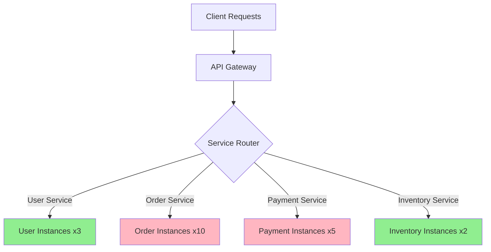
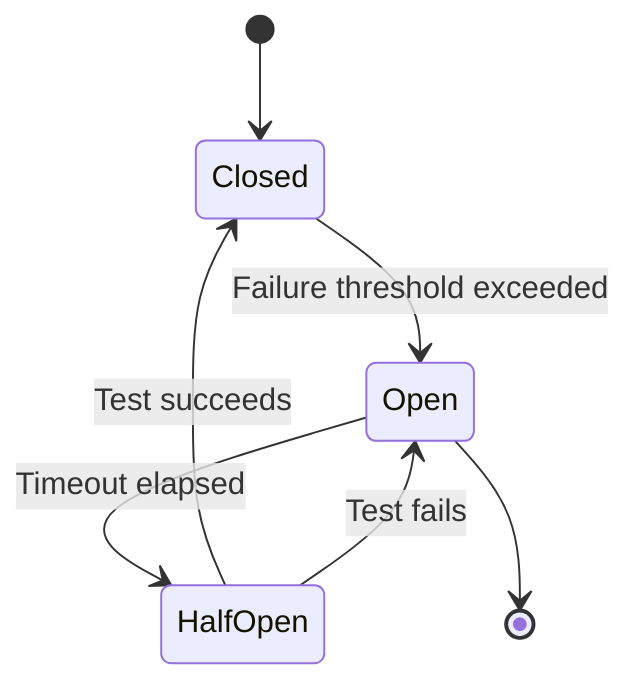
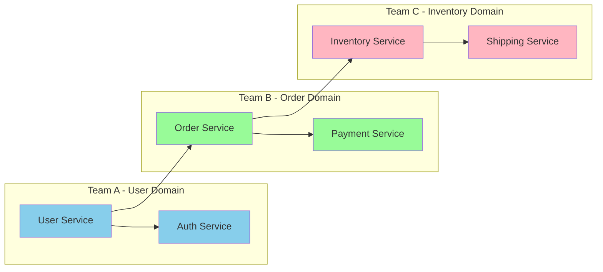
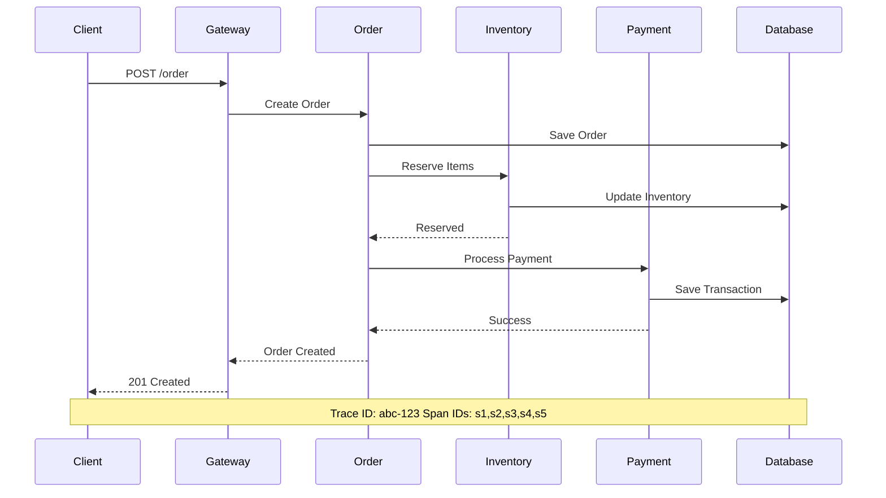

# Microservices: Benefits and Challenges

## Overview

Microservices architecture has transformed how organizations build and deploy software. This approach structures an application as a collection of loosely coupled services, each owning a specific business capability. While offering significant advantages, it also introduces new complexities that teams must carefully manage.

---

## Benefits

### 1. Agility and Faster Time-to-Market

Microservices enable teams to develop, test, and deploy features independently. Each service has its own codebase and deployment pipeline, allowing parallel development without waiting for monolithic releases.

**Real-World Example - Netflix:**
Netflix decomposed their monolithic DVD rental application into 100+ microservices. New features can now be deployed in hours instead of months. Their deployment frequency increased from once per month to thousands of times per day.

```java
// Netflix's Zuul API Gateway - Enables independent routing
@Component
public class ZuulRoutingFilter extends ZuulFilter {
    @Override
    public String filterType() {
        return "route";
    }

    @Override
    public Object run() {
        RequestContext ctx = RequestContext.getCurrentContext();
        HttpServletRequest request = ctx.getRequest();
        
        // Route to specific microservice based on path
        String serviceId = determineServiceId(request);
        String routeUrl = serviceRegistry.resolve(serviceId);
        
        ctx.setRouteHost(getUrl(serviceId));
        return null;
    }
}
```

### 2. Scalability

Services can be scaled independently based on demand. CPU-intensive services can scale differently from memory-intensive ones, optimizing resource utilization and costs.

**Flow Chart - Independent Scaling:**



**Best Practice:** Implement auto-scaling policies based on metrics:

```yaml
# Kubernetes HPA Configuration
apiVersion: autoscaling/v2
kind: HorizontalPodAutoscaler
metadata:
  name: order-service-hpa
spec:
  scaleTargetRef:
    apiVersion: apps/v1
    kind: Deployment
    name: order-service
  minReplicas: 3
  maxReplicas: 50
  metrics:
    - type: Resource
      resource:
        name: cpu
        target:
          type: Utilization
          averageUtilization: 70
    - type: Pods
      pods:
        metric:
          name: requests_per_second
        target:
          type: AverageValue
          averageValue: "1000"
```

### 3. Fault Isolation

Failures in one service don't cascade to others. Circuit breakers and bulkheads prevent system-wide outages.

**Real-World Example - Uber:**
Uber uses fault isolation between their pricing, dispatch, and trip services. When pricing experiences high load, it doesn't affect dispatch functionality.

```python
# Python Circuit Breaker Implementation
from functools import wraps
import time
import logging

class CircuitBreaker:
    def __init__(self, failure_threshold=5, timeout=60, expected_exception=Exception):
        self.failure_threshold = failure_threshold
        self.timeout = timeout
        self.expected_exception = expected_exception
        self.failure_count = 0
        self.last_failure_time = None
        self.state = "CLOSED"

    def call(self, func, *args, **kwargs):
        if self.state == "OPEN":
            if time.time() - self.last_failure_time > self.timeout:
                self.state = "HALF_OPEN"
                logging.info("Circuit breaker: Moving to HALF_OPEN")
            else:
                raise Exception("Circuit breaker is OPEN")

        try:
            result = func(*args, **kwargs)
            self._on_success()
            return result
        except self.expected_exception as e:
            self._on_failure()
            raise e

    def _on_success(self):
        self.failure_count = 0
        self.state = "CLOSED"

    def _on_failure(self):
        self.failure_count += 1
        self.last_failure_time = time.time()
        if self.failure_count >= self.failure_threshold:
            self.state = "OPEN"
            logging.warning("Circuit breaker: Opening circuit")

# Usage
circuit_breaker = CircuitBreaker()

def call_payment_service(amount):
    return circuit_breaker.call(payment_service.process_payment, amount)
```

**Circuit Breaker Flow:**



### 4. Technology Flexibility

Each team can choose the best technology stack for their service's specific requirements. Polyglot architecture allows mixing languages, frameworks, and databases.

**Technology Mix Example - Spotify:**

| Service Type | Technology | Rationale |
|--------------|------------|-----------|
| User Management | Java/Spring | Enterprise integration |
| Music Streaming | C++ | Low latency audio |
| Recommendation | Python/Scikit-learn | ML libraries |
| Playlist Service | Go | High concurrency |
| Analytics | Scala/Spark | Big data processing |

```java
// Different databases for different services
@Service
public class UserProfileService {
    private final JdbcTemplate jdbcTemplate;  // PostgreSQL for user data
    
    @Autowired
    public UserProfileService(DataSource userDataSource) {
        this.jdbcTemplate = new JdbcTemplate(userDataSource);
    }
}

@Service
public class PlaylistService {
    private final MongoTemplate mongoTemplate;  // MongoDB for flexible schemas
    
    @Autowired
    public PlaylistService(MongoDatabaseFactory mongoDbFactory) {
        this.mongoTemplate = new MongoTemplate(mongoDbFactory);
    }
}

@Service
public class AnalyticsService {
    private final RedisTemplate redisTemplate;  // Redis for caching/analytics
    
    @Autowired
    public AnalyticsService(RedisConnectionFactory redisConnection) {
        this.redisTemplate = new RedisTemplate(redisConnection);
    }
}
```

### 5. Team Autonomy

Teams own their services end-to-end, from development to production. This increases accountability and accelerates decision-making.

**Architecture:**



**Team Structure Best Practices:**

- Each team has 5-9 members (two-pizza team)
- Team owns service lifecycle: development, deployment, operations
- Clear API contracts between teams
- Team can choose their own tech stack within guidelines

### 6. Continuous Deployment

Services can be deployed independently, enabling frequent releases with minimal risk.

```yaml
# GitHub Actions CI/CD Pipeline
name: Microservice CI/CD

on:
  push:
    paths:
      - 'services/user-service/**'
    branches:
      - main

jobs:
  deploy:
    runs-on: ubuntu-latest
    steps:
      - uses: actions/checkout@v3
      
      - name: Set up Docker
        uses: docker/setup-buildx-action@v2
        
      - name: Build and push user-service
        uses: docker/build-push-action@v4
        with:
          context: ./services/user-service
          push: true
          tags: registry.example.com/user-service:${{ github.sha }}
          
      - name: Deploy to Kubernetes
        uses: azure/k8s-set-context@v3
        with:
          kubeconfig: ${{ secrets.KUBE_CONFIG }}
          
      - name: Update deployment
        run: |
          kubectl set image deployment/user-service \
          user-service=registry.example.com/user-service:${{ github.sha }}
```

---

## Challenges

### 1. Distributed System Complexity

Services communicate over networks, introducing complexity in service discovery, load balancing, and fault tolerance.

```java
// Service Discovery with Eureka
@SpringBootApplication
@EnableDiscoveryClient
public class OrderServiceApplication {
    public static void main(String[] args) {
        SpringApplication.run(OrderServiceApplication.class, args);
    }
}

@Service
public class OrderService {
    @Autowired
    private DiscoveryClient discoveryClient;

    public List<ServiceInstance> findPaymentServices() {
        return discoveryClient.getInstances("payment-service");
    }

    public String callPaymentService(Order order) {
        List<ServiceInstance> instances = findPaymentServices();
        ServiceInstance selected = loadBalancer.choose(instances);
        
        String url = String.format("http://%s:%d/payment/process",
            selected.getHost(), selected.getPort());
        
        return restTemplate.postForObject(url, order, String.class);
    }
}
```

### 2. Data Consistency

Each service maintains its own database, making distributed transactions challenging. eventual consistency becomes the norm.

**Saga Pattern Implementation:**

```java
// Choreography-based Saga
@Service
public class OrderService {
    @Autowired
    private EventPublisher eventPublisher;

    @Transactional
    public Order createOrder(OrderRequest request) {
        Order order = new Order();
        order.setStatus(OrderStatus.PENDING);
        order = orderRepository.save(order);
        
        // Publish event for other services
        eventPublisher.publish(new OrderCreatedEvent(order.getId(), request));
        
        return order;
    }
}

@Service
public class InventoryService {
    @KafkaListener(topics = "order-events")
    public void handleOrderCreated(OrderCreatedEvent event) {
        try {
            inventoryService.reserveItems(event.getItems());
            eventPublisher.publish(new InventoryReservedEvent(event.getOrderId()));
        } catch (InsufficientStockException e) {
            eventPublisher.publish(new OrderFailedEvent(event.getOrderId(), e.getMessage()));
        }
    }
}

@Service
public class PaymentService {
    @KafkaListener(topics = "inventory-events")
    public void handleInventoryReserved(InventoryReservedEvent event) {
        try {
            paymentService.charge(event.getAmount());
            eventPublisher.publish(new PaymentCompletedEvent(event.getOrderId()));
        } catch (PaymentFailedException e) {
            // Compensating action
            eventPublisher.publish(new InventoryReleaseEvent(event.getOrderId()));
            eventPublisher.publish(new OrderFailedEvent(event.getOrderId(), e.getMessage()));
        }
    }
}
```

### 3. Testing Complexity

Testing spans multiple services requiring integration tests, contract testing, and end-to-end testing strategies.

```java
// Contract Testing with Pact
@SpringBootTest
@RunWith(SpringRunner.class)
@Provider("order-service")
@PactFolder("pacts")
public class ContractVerificationTest {
    @InjectMy
    MockServer mockServer;

    @TestTemplate
    @ExtendWith(PactVerificationInvocationContextProvider.class)
    void verifyPact(PactVerificationContext context) {
        context.verifyInteraction();
    }

    @State("an order exists")
    void setupOrderExists() {
        // Set up test data
    }
}

// Consumer Test
@ExtendWith(PactConsumerTestExt.class)
class PaymentServiceConsumerTest {
    @Pact(consumer = "order-service", provider = "payment-service")
    V4Pact createPaymentPact(PactDslWithProvider builder) {
        return builder
            .given("payment service is available")
            .uponReceiving("a payment request")
                .path("/payment/process")
                .method("POST")
                .body(newJsonBody(body -> {
                    body.stringValue("orderId", "order-123");
                    body.integerType("amount", 1000);
                }).build())
            .willRespondWith()
                .status(200)
                .body(newJsonBody(body -> {
                    body.stringValue("status", "SUCCESS");
                    body.stringValue("transactionId", "txn-456");
                }).build())
            .toPact(V4Pact.class);
    }

    @Test
    @PactTestFor(pactMethod = "createPaymentPact")
    void testPaymentProcessing(MockServer mockServer) {
        PaymentRequest request = new PaymentRequest("order-123", 1000);
        PaymentResponse response = paymentClient.processPayment(request);
        
        assertEquals("SUCCESS", response.getStatus());
    }
}
```

### 4. Operational Overhead

Managing, monitoring, and maintaining many services requires sophisticated infrastructure and tooling.

```yaml
# Prometheus + Grafana Monitoring Stack
apiVersion: v1
kind: ConfigMap
metadata:
  name: monitoring-config
data:
  prometheus.yml: |
    global:
      scrape_interval: 15s
    scrape_configs:
      - job_name: 'microservices'
        kubernetes_sd_configs:
          - role: pod
        relabel_configs:
          - source_labels: [__meta_kubernetes_pod_annotation_prometheus_io_scrape]
            action: keep
            regex: true
---
apiVersion: v1
kind: ServiceMonitor
metadata:
  name: service-monitor
spec:
  selector:
    matchLabels:
      app: microservices
  endpoints:
    - port: metrics
      interval: 30s
```

**Key Metrics to Monitor:**

| Metric | Description | Alert Threshold |
|--------|-------------|-----------------|
| Request Latency | Time for service to respond | > 500ms p95 |
| Error Rate | Percentage of failed requests | > 1% |
| CPU Usage | Resource utilization | > 80% |
| Memory Usage | Heap consumption | > 85% |
| Circuit Breaker | Failure state | OPEN state |
| Queue Depth | Message backlog | > 1000 |

### 5. Network Latency

Inter-service communication adds network overhead. Service mesh and caching strategies help mitigate this.

```java
// gRPC for Low-Latency Communication
service PaymentService {
    rpc ProcessPayment(PaymentRequest) returns (PaymentResponse);
    rpc GetPaymentStatus(PaymentStatusRequest) returns (PaymentStatusResponse);
}

message PaymentRequest {
    string order_id = 1;
    double amount = 2;
    string currency = 3;
    PaymentMethod method = 4;
}

message PaymentResponse {
    string transaction_id = 1;
    PaymentStatus status = 2;
    string message = 3;
}

// gRPC Client with Connection Pooling
@Bean
public ManagedChannel managedChannel() {
    return ManagedChannelBuilder.forAddress("payment-service", 8080)
        .enableRetry()
        .maxRetryAttempts(3)
        .keepAliveTime(30, TimeUnit.SECONDS)
        .build();
}

@Bean
public PaymentServiceGrpc.PaymentServiceBlockingStub paymentStub(
        ManagedChannel channel) {
    return PaymentServiceGrpc.newBlockingStub(channel)
        .withDeadline(Duration.ofSeconds(5));
}
```

### 6. Debugging Difficulties

Distributed tracing is essential for understanding request flows across services.

```java
// OpenTelemetry Distributed Tracing
@Configuration
public class TracingConfig {
    @Bean
    public OpenTelemetry openTelemetry() {
        return OpenTelemetrySdk.builder()
            .setTracerProvider(
                JaegerExporter.builder()
                    .setEndpoint("http://jaeger:14268/api/traces")
                    .build())
            .build();
    }

    @Bean
    public Tracer tracer(OpenTelemetry openTelemetry) {
        return openTelemetry.getTracer("order-service", "1.0.0");
    }
}

@Service
public class OrderService {
    @Autowired
    private Tracer tracer;

    public Order processOrder(OrderRequest request) {
        Span span = tracer.spanBuilder("processOrder")
            .setAttribute("order.id", request.getId())
            .setAttribute("customer.id", request.getCustomerId())
            .startSpan();
        
        try (Scope scope = span.makeCurrent()) {
            // Business logic with tracing
            inventoryService.reserveItems(request.getItems());
            paymentService.charge(request.getAmount());
            
            span.setStatus(StatusCode.OK);
            return order;
        } catch (Exception e) {
            span.setStatus(StatusCode.ERROR, e.getMessage());
            span.recordException(e);
            throw e;
        } finally {
            span.end();
        }
    }
}
```

**Distributed Tracing Flow:**



---

## Best Practices Summary

| Category | Practice |
|----------|----------|
| **Design** | Single Responsibility: One service = one domain capability |
| **Communication** | Use API contracts, version APIs carefully |
| **Data** | Database per service, embrace eventual consistency |
| **Resilience** | Implement circuit breakers, timeouts, retries |
| **Observability** | Distributed tracing, centralized logging, metrics |
| **Deployment** | Containerization, orchestration with Kubernetes |
| **Security** | Service-to-service authentication (mTLS) |
| **Testing** | Contract testing, chaos engineering |

---

## Conclusion

Microservices architecture offers significant benefits in agility, scalability, and team autonomy but introduces complexity that requires robust tooling, processes, and expertise. Organizations like Netflix, Uber, and Spotify have successfully navigated these challenges by investing in platform engineering, observability, and automated deployment pipelines.

The decision to adopt microservices should be based on team maturity, organizational size, and specific business requirements. Start with a modular monolith and evolve to microservices as the need arises.