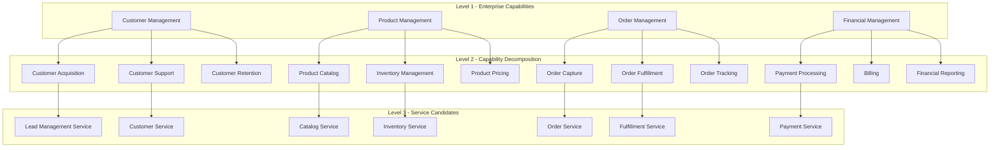

# Business Capability Decomposition

## Overview

Business Capability Decomposition is a fundamental approach to microservices design that focuses on identifying and mapping the essential capabilities a business provides to its customers and stakeholders. This pattern forms the cornerstone of service decomposition, providing a structured methodology for breaking down complex business operations into discrete, manageable, and independently deployable services. Unlike technical decomposition that organizes code by layers or components, business capability decomposition aligns services with the organization's domain knowledge and strategic objectives, ensuring that each microservice represents a meaningful unit of business functionality.

The concept of business capabilities originated from enterprise architecture frameworks, particularly ARIS (Architecture of Integrated Information Systems) and the Zachman Framework. In the context of microservices, business capabilities represent the "what" of an organization—what it does to create value for its customers. These capabilities are relatively stable over time, even as the underlying technology and implementation details change. This stability makes capabilities an ideal foundation for service boundaries, as they provide a durable abstraction that can guide architectural decisions through technology evolution.

Understanding business capability decomposition requires examining several interconnected aspects: how to identify capabilities from business analysis, how to map capabilities to technical services, what decomposition strategies exist, and how real-world organizations have successfully applied these principles. This pattern serves as the primary mechanism for determining where service boundaries should be drawn, making it essential for any microservices initiative.

## What Are Business Capabilities?

A business capability is a specific ability or capacity that an organization possesses to perform a particular set of activities or deliver specific outcomes. Capabilities are defined at a level of abstraction that is independent of organizational structure, specific processes, or technology implementations. They represent the fundamental "doing" of the organization—what it is capable of accomplishing regardless of how it currently achieves it.

Business capabilities differ from business processes in a crucial way: capabilities describe "what" an organization can do, while processes describe "how" it does it. For example, "order management" is a capability that encompasses the organization's ability to handle customer orders. The specific steps, workflows, and systems that implement order management constitute processes. This distinction is important because capabilities remain stable even as processes are redesigned or automated, providing a stable foundation for service boundaries.

Capabilities are typically organized in a hierarchical model, with high-level capabilities decomposing into more granular sub-capabilities. A retail organization might have a top-level "merchandising" capability, which decomposes into "product catalog management," "pricing," "inventory management," and "promotions." Each of these can further decompose into specific activities. This hierarchical nature enables organizations to choose the appropriate level of granularity for service boundaries based on their specific context and needs.

The relationship between capabilities and organizational strategy is fundamental. Capabilities represent the organization's ability to execute its strategy; they are the building blocks through which strategic objectives are achieved. When decomposing for microservices, the goal is to create services that align with these strategic capabilities, ensuring that the technical architecture supports rather than impedes business objectives.

### Identifying Business Capabilities

Identifying business capabilities requires a combination of business analysis techniques and domain expertise. The process typically involves several complementary approaches that together provide a comprehensive view of organizational capabilities.

**Value Chain Analysis**: Starting from Michael Porter's value chain model, organizations can identify primary activities (inbound logistics, operations, outbound logistics, marketing/sales, service) and support activities (procurement, technology development, human resource management, firm infrastructure). These categories provide an initial framework for capability identification that can be refined for specific industry contexts.

**Event Storming and Domain Storytelling**: These lightweight modeling techniques bring together domain experts and technical team members to explore business operations through the lens of events and activities. Event Storming, in particular, has become popular in the microservices community as a way to discover domain boundaries and identify potential service candidates. Participants use sticky notes to represent domain events, commands, and aggregates, building a visual model of business operations.

**Capability Mapping Workshops**: Structured workshops with business stakeholders can directly identify capabilities by asking fundamental questions: "What must we do to serve our customers?" "What activities create value for our organization?" "What would we need to protect or enhance to maintain our competitive position?" These questions surface capabilities at various levels of abstraction.

**Existing Documentation Analysis**: Business requirement documents, process specifications, organizational charts, and system documentation provide valuable inputs for capability identification. While these documents may describe current state (processes, systems, organizations), they can be analyzed to extract the underlying capabilities those elements support.

## Business Capability Model Example



This hierarchical decomposition illustrates how high-level enterprise capabilities break down into more specific sub-capabilities, which in turn become candidates for microservice implementation. The key principle is that each service should align with a coherent set of capabilities that can be owned by a single team.

## Decomposition Strategies

When using business capabilities as the foundation for microservice design, several decomposition strategies can guide the process of identifying appropriate service boundaries. These strategies are not mutually exclusive; organizations typically employ a combination based on their specific context.

### Top-Down Decomposition

The top-down approach starts with enterprise-level capabilities and progressively decomposes them into finer-grained capabilities until reaching a level suitable for service implementation. This strategy works well for organizations with clear strategic capabilities and established business domains.

The process begins with identifying high-level capabilities (often 10-20 for a medium-sized organization), then analyzing each to determine whether it should remain as a single service or be decomposed further. The decomposition continues until each resulting unit meets criteria for service candidacy: bounded context, team ownership potential, independent deployability, and meaningful business functionality.

```java
// Example: Top-down capability decomposition in code structure

package com.enterprise.capability;

public enum CapabilityLevel {
    ENTERPRISE,      // Level 1: Top-level capabilities
    DOMAIN,          // Level 2: Domain capabilities
    SERVICE,         // Level 3: Service-level capabilities
    OPERATION        // Level 4: Individual operations
}

// Capability hierarchy representation
public class CapabilityModel {
    private String capabilityId;
    private String name;
    private String description;
    private CapabilityLevel level;
    private CapabilityModel parent;
    private List<CapabilityModel> children;
    private List<String> associatedSystems;
    
    public boolean isLeafCapability() {
        return children == null || children.isEmpty();
    }
    
    public List<CapabilityModel> getServiceCandidates() {
        // Return capabilities suitable for service implementation
        if (level == CapabilityLevel.SERVICE && isLeafCapability()) {
            return List.of(this);
        }
        return children.stream()
            .flatMap(c -> c.getServiceCandidates().stream())
            .collect(Collectors.toList());
    }
}

// Capability catalog for an e-commerce organization
public class ECommerceCapabilityCatalog {
    public static List<CapabilityModel> buildCatalog() {
        return List.of(
            CapabilityModel.builder()
                .capabilityId("CUST")
                .name("Customer Management")
                .level(CapabilityLevel.DOMAIN)
                .children(List.of(
                    CapabilityModel.builder()
                        .capabilityId("CUST-ACQ")
                        .name("Customer Acquisition")
                        .level(CapabilityLevel.SERVICE)
                        .associatedSystems(List.of("CRM", "Marketing Automation"))
                        .build(),
                    CapabilityModel.builder()
                        .capabilityId("CUST-SUP")
                        .name("Customer Support")
                        .level(CapabilityLevel.SERVICE)
                        .associatedSystems(List.of("Help Desk", "Knowledge Base"))
                        .build()
                ))
                .build(),
            CapabilityModel.builder()
                .capabilityId("ORD")
                .name("Order Management")
                .level(CapabilityLevel.DOMAIN)
                .children(List.of(
                    CapabilityModel.builder()
                        .capabilityId("ORD-CAP")
                        .name("Order Capture")
                        .level(CapabilityLevel.SERVICE)
                        .associatedSystems(List.of("Order System", "Cart"))
                        .build(),
                    CapabilityModel.builder()
                        .capabilityId("ORD-FUL")
                        .name("Order Fulfillment")
                        .level(CapabilityLevel.SERVICE)
                        .associatedSystems(List.of("WMS", "ERP"))
                        .build()
                ))
                .build()
        );
    }
}
```

### Bottom-Up Decomposition

The bottom-up approach starts by analyzing existing systems, applications, and data stores, then groups related functionality into coherent capabilities. This approach leverages existing investment and knowledge about current systems but may result in capabilities that reflect legacy organizational or technical decisions.

The process involves cataloging existing applications and their responsibilities, identifying data ownership and flow between systems, analyzing integration points and dependencies, and grouping related functionality into capability clusters. This approach is particularly useful when migrating from a monolithic application or when inheriting a complex system landscape.

### Inside-Out Decomposition

The inside-out approach focuses on the core domain—those capabilities that provide unique competitive advantage and are central to the organization's value proposition. These core capabilities are identified first, then supporting capabilities are defined around them.

This strategy is particularly effective when the organization has a clear understanding of its differentiating activities. Core capabilities receive priority in terms of architectural investment and team attention, while supporting capabilities may be implemented more pragmatically or even outsourced.

## Real-World Example: Amazon Order Management

Amazon's order management system provides an excellent example of business capability decomposition. The company operates hundreds of microservices, many of which map directly to identified business capabilities.

**Capability Identification**: Amazon's order management decomposes into distinct capabilities including order capture, order processing, inventory allocation, fulfillment orchestration, shipping execution, delivery tracking, returns processing, and refund management. Each capability has been implemented as one or more microservices with well-defined boundaries.

```java
// Amazon-style Order Management Capability Implementation

package com.amazon.orderservice;

import org.springframework.stereotype.Service;
import java.time.Instant;
import java.util.UUID;

@Service
public class OrderCaptureCapability {
    
    private final OrderRepository orderRepository;
    private final InventoryServiceClient inventoryClient;
    private final CustomerServiceClient customerClient;
    private final EventPublisher eventPublisher;
    
    public OrderCaptureCapability(
            OrderRepository orderRepository,
            InventoryServiceClient inventoryClient,
            CustomerServiceClient customerClient,
            EventPublisher eventPublisher) {
        this.orderRepository = orderRepository;
        this.inventoryClient = inventoryClient;
        this.customerClient = customerClient;
        this.eventPublisher = eventPublisher;
    }
    
    public Order createOrder(CreateOrderRequest request) {
        // Validate customer exists and is active
        Customer customer = customerClient.getCustomer(request.getCustomerId());
        if (customer == null || !customer.isActive()) {
            throw new InvalidCustomerException(request.getCustomerId());
        }
        
        // Validate inventory availability for each item
        List<OrderLineItem> lineItems = request.getItems().stream()
            .map(item -> {
                boolean available = inventoryClient.checkAvailability(
                    item.getSku(), 
                    item.getQuantity()
                );
                if (!available) {
                    throw new InsufficientInventoryException(
                        item.getSku(), 
                        item.getQuantity()
                    );
                }
                return new OrderLineItem(
                    item.getSku(),
                    item.getQuantity(),
                    inventoryClient.getPrice(item.getSku())
                );
            })
            .collect(Collectors.toList());
        
        // Calculate order total
        BigDecimal total = lineItems.stream()
            .map(OrderLineItem::getSubtotal)
            .reduce(BigDecimal.ZERO, BigDecimal::add);
        
        // Create order
        Order order = Order.builder()
            .orderId(UUID.randomUUID().toString())
            .customerId(request.getCustomerId())
            .shippingAddress(request.getShippingAddress())
            .lineItems(lineItems)
            .total(total)
            .status(OrderStatus.CREATED)
            .createdAt(Instant.now())
            .build();
        
        Order savedOrder = orderRepository.save(order);
        
        // Publish OrderCreated event for downstream capabilities
        eventPublisher.publish("order.created", Map.of(
            "orderId", savedOrder.getOrderId(),
            "customerId", savedOrder.getCustomerId(),
            "total", savedOrder.getTotal().toString(),
            "items", savedOrder.getLineItems().size()
        ));
        
        return savedOrder;
    }
}

@Service
public class OrderFulfillmentCapability {
    
    private final OrderRepository orderRepository;
    private final InventoryServiceClient inventoryClient;
    private final ShippingServiceClient shippingClient;
    private final EventPublisher eventPublisher;
    
    public OrderFulfillmentCapability(
            OrderRepository orderRepository,
            InventoryServiceClient inventoryClient,
            ShippingServiceClient shippingClient,
            EventPublisher eventPublisher) {
        this.orderRepository = orderRepository;
        this.inventoryClient = inventoryClient;
        this.shippingClient = shippingClient;
        this.eventPublisher = eventPublisher;
    }
    
    public FulfillmentPlan fulfillOrder(String orderId) {
        Order order = orderRepository.findById(orderId)
            .orElseThrow(() -> new OrderNotFoundException(orderId));
        
        if (order.getStatus() != OrderStatus.PAID) {
            throw new InvalidOrderStateException(
                "Order must be paid before fulfillment"
            );
        }
        
        // Allocate inventory for each line item
        List<InventoryAllocation> allocations = order.getLineItems().stream()
            .map(item -> inventoryClient.allocate(
                item.getSku(),
                item.getQuantity(),
                order.getOrderId()
            ))
            .collect(Collectors.toList());
        
        // Determine optimal fulfillment strategy
        FulfillmentStrategy strategy = determineFulfillmentStrategy(order, allocations);
        
        // Create fulfillment plan
        FulfillmentPlan plan = FulfillmentPlan.builder()
            .orderId(orderId)
            .strategy(strategy)
            .allocations(allocations)
            .estimatedDelivery(calculateEstimatedDelivery(strategy, order))
            .build();
        
        // Update order status
        order.setStatus(OrderStatus.FULFILLING);
        orderRepository.save(order);
        
        return plan;
    }
    
    private FulfillmentStrategy determineFulfillmentStrategy(
            Order order, 
            List<InventoryAllocation> allocations) {
        
        // Multi-warehouse fulfillment logic
        boolean multiWarehouse = allocations.stream()
            .map(InventoryAllocation::getWarehouseId)
            .distinct()
            .count() > 1;
        
        if (multiWarehouse) {
            return FulfillmentStrategy.MULTI_WAREHOUSE;
        }
        
        // Check for expedited shipping
        if (order.isExpedited()) {
            return FulfillmentStrategy.PRORITY;
        }
        
        return FulfillmentStrategy.STANDARD;
    }
}

@Service
public class ReturnsProcessingCapability {
    
    private final OrderRepository orderRepository;
    private final InventoryServiceClient inventoryClient;
    private final RefundServiceClient refundClient;
    private final EventPublisher eventPublisher;
    
    public ReturnsProcessingCapability(
            OrderRepository orderRepository,
            InventoryServiceClient inventoryClient,
            RefundServiceClient refundClient,
            EventPublisher eventPublisher) {
        this.orderRepository = orderRepository;
        this.inventoryClient = inventoryClient;
        this.refundClient = refundClient;
        this.eventPublisher = eventPublisher;
    }
    
    public ReturnAuthorization initiateReturn(String orderId, ReturnRequest request) {
        Order order = orderRepository.findById(orderId)
            .orElseThrow(() -> new OrderNotFoundException(orderId));
        
        // Validate return is within allowed window
        Instant returnWindow = order.getCreatedAt().plusDays(30);
        if (Instant.now().isAfter(returnWindow)) {
            throw new ReturnWindowExpiredException(orderId);
        }
        
        // Validate items being returned
        List<String> validSkus = order.getLineItems().stream()
            .map(OrderLineItem::getSku)
            .collect(Collectors.toList());
        
        for (ReturnItem item : request.getItems()) {
            if (!validSkus.contains(item.getSku())) {
                throw new InvalidItemException(item.getSku());
            }
        }
        
        // Generate return authorization
        ReturnAuthorization authorization = ReturnAuthorization.builder()
            .returnId(UUID.randomUUID().toString())
            .orderId(orderId)
            .items(request.getItems())
            .reason(request.getReason())
            .labelUrl(generateReturnLabel(order.getShippingAddress()))
            .expiresAt(Instant.now().plusDays(14))
            .build();
        
        eventPublisher.publish("return.initiated", Map.of(
            "returnId", authorization.getReturnId(),
            "orderId", orderId
        ));
        
        return authorization;
    }
}
```

### Amazon's Service Architecture

Amazon's approach demonstrates several key principles of business capability decomposition:

**Clear Capability Boundaries**: Each service maps to a specific business capability with clear responsibilities. Order capture handles order creation, order fulfillment manages the fulfillment process, and returns processing handles the return lifecycle.

**Event-Driven Integration**: Services communicate through events (order.created, return.initiated), enabling loose coupling while maintaining system coherence. New capabilities can be added by subscribing to relevant events.

**Data Ownership**: Each service owns its data. The order service owns order data, the inventory service owns inventory data, and so forth. No service directly accesses another service's database.

**API contracts**: Services expose well-defined APIs that other services consume. These contracts are stable and versioned to allow independent evolution of services.

## Code Example: Capability-Based Service Design

The following example demonstrates how to implement capability-based decomposition in practice:

```java
// Base infrastructure for capability-based services

// Capability annotation for service identification
@Target(ElementType.TYPE)
@Retention(RetentionPolicy.RUNTIME)
public @interface BusinessCapability {
    String value();
    String description();
    CapabilityCategory category();
}

public enum CapabilityCategory {
    CORE,       // Differentiating capabilities
    SUPPORT,    // Supporting capabilities
    GENERIC     // Commodity capabilities
}

// Base class for capability services
public abstract class BaseCapabilityService<T> {
    
    protected final Logger logger = LoggerFactory.getLogger(getClass());
    
    public abstract String getCapabilityName();
    public abstract T execute(CapabilityRequest request);
    
    protected void publishCapabilityEvent(String eventType, Map<String, Object> data) {
        CapabilityEvent event = CapabilityEvent.builder()
            .eventId(UUID.randomUUID().toString())
            .capabilityName(getCapabilityName())
            .eventType(eventType)
            .timestamp(Instant.now())
            .data(data)
            .build();
        
        eventPublisher.publish(event);
    }
}

// Example: Customer Onboarding Capability

@BusinessCapability(
    value = "customer-onboarding",
    description = "Handles new customer registration and profile setup",
    category = CapabilityCategory.CORE
)
public class CustomerOnboardingService extends BaseCapabilityService<CustomerProfile> {
    
    private final CustomerRepository customerRepository;
    private final IdentityVerificationService identityService;
    private final CommunicationService communicationService;
    
    @Override
    public String getCapabilityName() {
        return "customer-onboarding";
    }
    
    @Override
    public CustomerProfile execute(CapabilityRequest request) {
        CustomerOnboardingRequest onboardingRequest = 
            (CustomerOnboardingRequest) request;
        
        // Verify identity
        IdentityVerificationResult verification = 
            identityService.verify(onboardingRequest.getIdentityInfo());
        
        if (!verification.isSuccessful()) {
            throw new IdentityVerificationFailedException(
                verification.getFailureReason()
            );
        }
        
        // Create customer profile
        CustomerProfile profile = CustomerProfile.builder()
            .customerId(UUID.randomUUID().toString())
            .email(onboardingRequest.getEmail())
            .name(onboardingRequest.getName())
            .verificationLevel(verification.getLevel())
            .status(CustomerStatus.ONBOARDING)
            .createdAt(Instant.now())
            .build();
        
        CustomerProfile saved = customerRepository.save(profile);
        
        // Publish onboarding completion event
        publishCapabilityEvent("customer.onboarded", Map.of(
            "customerId", saved.getCustomerId(),
            "email", saved.getEmail(),
            "verificationLevel", saved.getVerificationLevel().toString()
        ));
        
        // Send welcome communication
        communicationService.sendWelcomeEmail(saved.getEmail());
        
        return saved;
    }
}

// Capability registry for service discovery
@Service
public class CapabilityRegistry {
    
    private final Map<String, BaseCapabilityService<?>> capabilities = new HashMap<>();
    
    @PostConstruct
    public void registerCapabilities() {
        // Auto-register all capability services
        Set<BaseCapabilityService<?>> services = 
            applicationContext.getBeansOfType(BaseCapabilityService.class).values();
        
        for (BaseCapabilityService<?> service : services) {
            capabilities.put(service.getCapabilityName(), service);
            logger.info("Registered capability: {}", service.getCapabilityName());
        }
    }
    
    public BaseCapabilityService<?> getCapability(String capabilityName) {
        BaseCapabilityService<?> capability = capabilities.get(capabilityName);
        if (capability == null) {
            throw new CapabilityNotFoundException(capabilityName);
        }
        return capability;
    }
}
```

## Best Practices

### Defining Clear Capability Boundaries

**Avoid Overlapping Capabilities**: Each capability should have a clear, distinct purpose. Overlapping capabilities lead to unclear ownership and integration challenges. Use a capability matrix to identify and resolve overlaps.

**Maintain Capability Stability**: Capabilities should be relatively stable compared to processes and technology. If a capability changes frequently, it may be too granular or improperly scoped.

**Balance Granularity**: Too few capabilities results in large, complex services. Too many capabilities creates an overly fragmented architecture with excessive integration complexity. Aim for a balanced decomposition that enables team autonomy.

### Capability Modeling Recommendations

**Involve Business Stakeholders**: Capability decomposition is fundamentally a business modeling activity. Technical teams alone cannot accurately identify business capabilities.

**Iteratively Refine**: Start with a high-level capability model and progressively refine it. Initial models will be imperfect; use iterative refinement to improve accuracy.

**Document Capability Relationships**: Capabilities don't exist in isolation. Document relationships between capabilities (dependencies, information flows, shared entities) to guide service integration design.

### Common Pitfalls

**Avoid Technical Capability Naming**: Naming capabilities after technology or technical components (database service, API service) defeats the purpose of business capability decomposition. Capabilities should be named in business terms.

**Don't Over-Engineer**: Not every capability needs to become a microservice. Some capabilities are better implemented as part of larger services or kept within existing systems.

**Avoid Capability Proliferation**: Creating too many fine-grained capabilities leads to integration complexity and operational overhead. Find the right level of decomposition for your organization.

## Summary

Business Capability Decomposition provides a principled approach to microservices design that aligns technical architecture with business objectives. By identifying and mapping business capabilities, organizations can create services that represent meaningful units of business functionality, enabling team autonomy, independent deployment, and evolutionary change.

The key to successful decomposition lies in understanding your organization's business domain deeply, involving both business and technical stakeholders in the decomposition process, and maintaining a balance between capability granularity and architectural complexity. When done well, capability-based decomposition creates a foundation for scalable, maintainable microservices architecture that can evolve with changing business needs.

---

## Related Patterns

- **Subdomain-Based Decomposition**: DDD approach to decomposition that complements capability-based analysis
- **Functional Decomposition**: Alternative approach focusing on functional requirements
- **Bounded Context**: The DDD concept that often aligns with service boundaries

## Further Reading

- Capability-Based Planning methodologies from enterprise architecture
- "Enterprise Architecture as Strategy" by Ross, Weill, and Robertson
- Zachman Framework capability modeling approaches