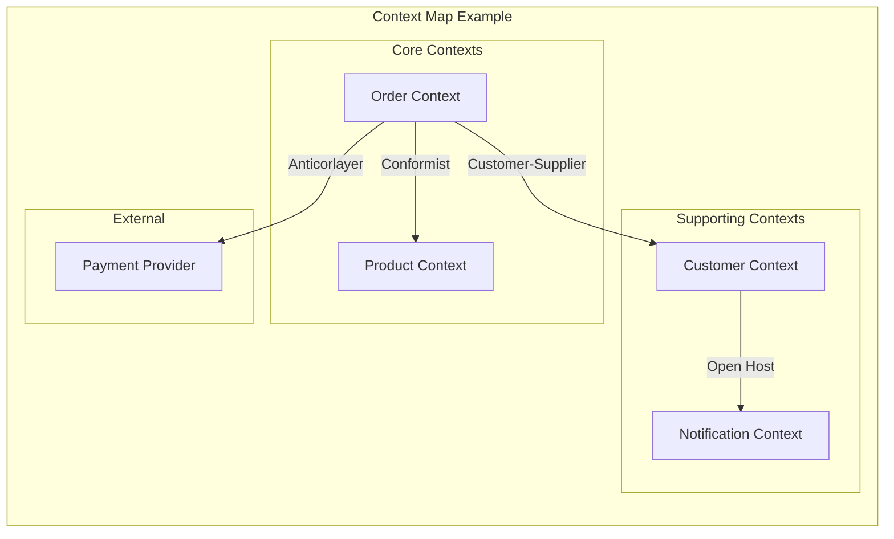

# Subdomain-Based Decomposition

## Overview

Subdomain-Based Decomposition applies Domain-Driven Design (DDD) principles to identify natural boundaries within a problem space, enabling the creation of microservices that align with domain logic and business rules. This approach leverages the concept of subdomains—logical partitions of the overall business domain—along with bounded contexts to establish clear service boundaries that minimize integration complexity while maximizing domain cohesion.

The subdomain approach emerged from Eric Evans' Domain-Driven Design methodology, which emphasized understanding the problem space before designing the solution. In DDD, a domain is the problem space the software addresses; subdomains are the natural divisions within that domain. The key insight is that different parts of the domain have different characteristics: some are core to the business's value proposition, some support the core, and some are commodity activities that can be outsourced or standardized.

When applied to microservices, subdomain-based decomposition produces services that are internally coherent (they encapsulate all related business logic) while minimizing the need for inter-service communication. This approach naturally leads to what DDD practitioners call "bounded contexts"—the boundary within which a particular domain model is valid and consistent.

## Understanding Subdomains

A subdomain represents a cohesive slice of the overall business domain that can be understood and analyzed relatively independently. When decomposing a monolithic application or designing a new system, identifying subdomains helps teams understand where natural boundaries exist in the problem space.

### Types of Subdomains

Domain-Driven Design categorizes subdomains into three types based on their strategic importance to the business:

**Core Subdomains**: These represent the heart of the business—the activities that make the organization unique and provide competitive advantage. Core subdomains contain the most valuable business logic and often require the most sophisticated modeling. Examples include Amazon's recommendation algorithm, Uber's matching algorithm, and Netflix's content recommendation system.

**Supporting Subdomains**: These support the core subdomains but don't directly provide competitive advantage. They are necessary for the business to function but are not differentiating. Examples include notification systems, authentication/authorization, and reporting/dashboard functionality.

**Generic Subdomains**: These represent activities that are common across many organizations and don't provide competitive advantage. The organization can often use existing solutions (either open-source or commercial) rather than building custom implementations. Examples include email sending, payment processing (though not the payment logic itself), and standard authentication protocols.

```mermaid
graph TB
    subgraph "Domain: E-Commerce Platform"
        subgraph "Core Subdomains" [
            subgraph "Order Management"
                O1[Order Processing]
                O2[Inventory Allocation]
                O3[Dynamic Pricing]
            ]
            subgraph "Recommendation Engine"
                R1[Personalization]
                R2[Similar Products]
                R3[Trending Items]
            ]
        ]
        
        subgraph "Supporting Subdomains" [
            S1[User Management]
            S2[Product Catalog]
            S3[Search]
            S4[Reviews]
        ]
        
        subgraph "Generic Subdomains" [
            G1[Authentication]
            G2[Email Service]
            G3[Logging]
            G4[Analytics]
        ]
    end
    
    style Core Subdomains fill:#ff6b6b
    style Supporting Subdomains fill:#4ecdc4
    style Generic Subdomains fill:#95a5a6
```

This diagram illustrates how an e-commerce platform might categorize its subdomains, with different styling to indicate their strategic importance.

### Identifying Subdomains

Subdomain identification requires deep domain knowledge and collaborative analysis. Several techniques help uncover the natural boundaries within a domain:

**Event Storming**: This workshop format brings together domain experts and technical team members to explore the domain through domain events. The resulting event flow often reveals natural subdomain boundaries as clusters of related events emerge.

**Context Mapping**: This DDD technique involves mapping the relationships between different parts of the system. By analyzing how information flows and where conceptual boundaries exist, context boundaries become apparent.

**Domain Expert Interviews**: Speaking with people who work in different parts of the business reveals natural divisions. The language experts use often reflects underlying subdomain boundaries—different teams may use different terminology even when discussing the same concepts.

**Existing System Analysis**: Looking at existing applications, databases, and integrations often reveals historical boundaries that may align with subdomain boundaries.

## Bounded Contexts and Microservices

In Domain-Driven Design, a bounded context is the boundary within which a particular domain model is consistent and valid. Each bounded context has explicit boundaries that define where its model applies. When translating DDD to microservices, bounded contexts often map directly to service boundaries.

### The Relationship Between Subdomains and Bounded Contexts

While related, subdomains and bounded contexts are not identical:

- **Subdomains** are a problem-space concept—they exist in the business domain regardless of any software implementation
- **Bounded contexts** are a solution-space concept—they define how software models will be structured

A subdomain might be implemented by one or more bounded contexts. Conversely, a bounded context might implement parts of multiple subdomains. In practice, for microservices decomposition, the goal is to align bounded contexts with subdomains as closely as possible.

### Context Mapping Patterns

When multiple bounded contexts (and thus multiple microservices) must interact, several patterns from DDD govern how those relationships should be structured:

**Customer-Supplier**: One context (the customer) depends on another (the supplier). The supplier context provides APIs that the customer consumes.

**Conformist**: One context conforms to the model of another context it depends on. This is simpler than translation but creates tight coupling.

**Anticorruption Layer**: When integrating with legacy or external systems, a layer that translates between the local model and the external model prevents contamination of the local model.

**Open Host Service**: A context that provides a well-documented protocol for other contexts to consume its services.



## Real-World Example: Uber's Domain Model

Uber's ride-hailing platform provides an excellent example of subdomain-based decomposition. The domain can be clearly divided into subdomains that have been implemented as microservices.

**The Core Subdomain: Trip Management**: The trip lifecycle—from ride request to completion—is Uber's core subdomain. This includes matching riders with drivers, pricing, and real-time trip state management. This is where Uber's competitive advantage lies.

**Supporting Subdomains**: User management (both rider and driver profiles), fleet management, and ratings/reputation support the core trip management but don't provide direct competitive advantage.

**Generic Subdomains**: Authentication, push notification delivery, and basic analytics are generic subdomains that Uber could implement using standard solutions.

```java
// Uber-style Subdomain Implementation

package com.uber.domain.trip;

public class TripAggregate {
    private TripId tripId;
    private RiderId riderId;
    private DriverId driverId;
    private Location pickupLocation;
    private Location dropoffLocation;
    private TripStatus status;
    private Money fare;
    private Instant requestedAt;
    private Instant acceptedAt;
    private Instant startedAt;
    private Instant completedAt;
    
    // Core domain logic - trip state transitions
    public void accept(DriverId driverId) {
        if (this.status != TripStatus.REQUESTED) {
            throw new IllegalStateException(
                "Cannot accept trip in status: " + this.status
            );
        }
        this.driverId = driverId;
        this.status = TripStatus.ACCEPTED;
        this.acceptedAt = Instant.now();
    }
    
    public void start() {
        if (this.status != TripStatus.ACCEPTED) {
            throw new IllegalStateException(
                "Cannot start trip in status: " + this.status
            );
        }
        this.status = TripStatus.IN_PROGRESS;
        this.startedAt = Instant.now();
    }
    
    public void complete(Location finalLocation, Money finalFare) {
        if (this.status != TripStatus.IN_PROGRESS) {
            throw new IllegalStateException(
                "Cannot complete trip in status: " + this.status
            );
        }
        this.dropoffLocation = finalLocation;
        this.fare = finalFare;
        this.status = TripStatus.COMPLETED;
        this.completedAt = Instant.now();
    }
    
    // Domain invariants
    public boolean canBeCancelled() {
        return this.status == TripStatus.REQUESTED || 
               this.status == TripStatus.ACCEPTED;
    }
}

package com.uber.domain.pricing;

public class PricingService {
    
    private final SurgePricingRepository surgeRepository;
    private final BaseFareRepository baseFareRepository;
    
    public Money calculateFare(TripRequest request) {
        BigDecimal baseFare = baseFareRepository.getBaseFare(
            request.getPickupZone(), 
            request.getVehicleType()
        );
        
        BigDecimal distanceFare = calculateDistanceFare(
            request.getPickupLocation(),
            request.getDropoffLocation()
        );
        
        BigDecimal timeFare = calculateTimeFare(
            request.getEstimatedDuration()
        );
        
        BigDecimal surgeMultiplier = getSurgeMultiplier(
            request.getPickupLocation(),
            request.getRequestTime()
        );
        
        BigDecimal totalFare = baseFare
            .add(distanceFare)
            .add(timeFare)
            .multiply(surgeMultiplier);
        
        return Money.roundToCent(totalFare);
    }
    
    private BigDecimal getSurgeMultiplier(Location location, Instant time) {
        SurgeZone zone = surgeRepository.findZoneByLocation(location);
        if (zone == null) {
            return BigDecimal.ONE;
        }
        
        // Surge pricing logic based on demand
        double currentDemand = demandService.getCurrentDemand(zone);
        double currentSupply = supplyService.getCurrentSupply(zone);
        
        if (currentSupply == 0) {
            return BigDecimal.valueOf(2.0); // Maximum surge
        }
        
        double ratio = currentDemand / currentSupply;
        
        // Graduated surge pricing
        if (ratio >= 3.0) {
            return BigDecimal.valueOf(2.5);
        } else if (ratio >= 2.0) {
            return BigDecimal.valueOf(1.75);
        } else if (ratio >= 1.5) {
            return BigDecimal.valueOf(1.25);
        } else {
            return BigDecimal.ONE;
        }
    }
}
```

## Subdomain Implementation Patterns

When implementing subdomains as microservices, several patterns help maintain clean boundaries and proper encapsulation:

### Domain Event Publishing

Each subdomain publishes domain events that other subdomains can consume, enabling integration without tight coupling:

```java
// Domain event infrastructure

public interface DomainEvent {
    String getEventId();
    String getAggregateType();
    String getAggregateId();
    Instant getOccurredAt();
    int getVersion();
}

public class TripAcceptedEvent implements DomainEvent {
    private final String eventId;
    private final String tripId;
    private final String driverId;
    private final String riderId;
    private final Instant acceptedAt;
    
    // Event publishing from within the aggregate
    public static DomainEvent from(TripAggregate trip) {
        return new TripAcceptedEvent(
            UUID.randomUUID().toString(),
            trip.getTripId().value(),
            trip.getDriverId().value(),
            trip.getRiderId().value(),
            Instant.now()
        );
    }
}

@Service
public class DomainEventPublisher {
    
    private final ApplicationEventPublisher eventPublisher;
    
    public void publish(DomainEvent event) {
        log.debug("Publishing domain event: {}", event.getEventId());
        eventPublisher.publishEvent(event);
    }
}

// In TripService - applying domain events
@Service
public class TripService {
    
    private final TripRepository tripRepository;
    private final DomainEventPublisher eventPublisher;
    
    public Trip acceptTrip(String tripId, Driver driver) {
        TripAggregate trip = tripRepository.findById(tripId)
            .orElseThrow(() -> new TripNotFoundException(tripId));
        
        trip.accept(driver.getDriverId());
        Trip saved = tripRepository.save(trip);
        
        // Publish domain event
        eventPublisher.publish(TripAcceptedEvent.from(saved));
        
        return saved;
    }
}
```

### Anticorruption Layer for External Integration

When subdomains must integrate with external systems, an anticorruption layer prevents the external model's concepts from contaminating the subdomain's clean model:

```java
// Anticorruption layer for payment integration

public interface PaymentGateway {
    PaymentResult charge(Money amount, PaymentMethod method);
    RefundResult refund(String transactionId, Money amount);
}

@Service
public class PaymentAnticorruptionLayer {
    
    private final ExternalPaymentGateway externalGateway;
    private final PaymentRepository paymentRepository;
    
    public PaymentResult processPayment(TripAggregate trip, PaymentMethod method) {
        // Translate domain model to external gateway model
        ExternalPaymentRequest request = ExternalPaymentRequest.builder()
            .amount(trip.getEstimatedFare().getAmount())
            .currency(trip.getEstimatedFare().getCurrency().toString())
            .customerId(trip.getRiderId().value())
            .metadata(Map.of(
                "tripId", trip.getTripId().value(),
                "pickup", trip.getPickupLocation().toString(),
                "dropoff", trip.getDropoffLocation().toString()
            ))
            .build();
        
        ExternalPaymentResponse response = externalGateway.charge(request);
        
        // Translate external response back to domain model
        Payment payment = Payment.builder()
            .paymentId(new PaymentId(response.getTransactionId()))
            .tripId(trip.getTripId())
            .amount(trip.getEstimatedFare())
            .status(mapStatus(response.getStatus()))
            .processedAt(Instant.now())
            .build();
        
        return paymentRepository.save(payment);
    }
    
    private PaymentStatus mapStatus(ExternalPaymentStatus status) {
        return switch (status) {
            case SUCCESS -> PaymentStatus.SUCCESS;
            case PENDING -> PaymentStatus.PENDING;
            case FAILED -> PaymentStatus.FAILED;
            case REFUNDED -> PaymentStatus.REFUNDED;
        };
    }
}
```

## Code Example: Subdomain Service Structure

The following demonstrates how to structure microservices around subdomains with proper layering:

```java
// Domain layer - pure business logic, no infrastructure dependencies

package com.ecommerce.order.domain;

public class Order {
    private OrderId id;
    private CustomerId customerId;
    private List<OrderLine> lines;
    private Money total;
    private OrderStatus status;
    
    public void submit() {
        if (lines.isEmpty()) {
            throw new DomainException("Cannot submit empty order");
        }
        if (status != OrderStatus.DRAFT) {
            throw new DomainException("Order must be in DRAFT status to submit");
        }
        
        this.status = OrderStatus.SUBMITTED;
        this.submittedAt = Instant.now();
    }
    
    public void cancel() {
        if (!status.allowsCancellation()) {
            throw new DomainException(
                "Cannot cancel order in status: " + status
            );
        }
        this.status = OrderStatus.CANCELLED;
        this.cancelledAt = Instant.now();
    }
}

// Application layer - orchestrates domain logic

package com.ecommerce.order.application;

@Service
public class OrderApplicationService {
    
    private final OrderRepository orderRepository;
    private final InventoryService inventoryService;
    private final DomainEventPublisher eventPublisher;
    
    public OrderDto submitOrder(SubmitOrderCommand command) {
        // Create order from command
        Order order = Order.create(
            command.getCustomerId(),
            command.getLines().stream()
                .map(l -> new OrderLine(l.getProductId(), l.getQuantity()))
                .collect(Collectors.toList())
        );
        
        // Reserve inventory
        for (OrderLine line : order.getLines()) {
            inventoryService.reserve(
                line.getProductId(),
                line.getQuantity(),
                order.getId()
            );
        }
        
        // Submit order
        order.submit();
        Order saved = orderRepository.save(order);
        
        // Publish domain event
        eventPublisher.publish(OrderSubmittedEvent.from(saved));
        
        return OrderDto.from(saved);
    }
}

// Infrastructure layer - external integrations

package com.ecommerce.order.infrastructure;

@Repository
public class JpaOrderRepository implements OrderRepository {
    
    @PersistenceContext
    private EntityManager em;
    
    @Override
    public Order save(Order order) {
        if (order.getId() == null) {
            em.persist(order);
            return order;
        } else {
            return em.merge(order);
        }
    }
}

@Service
public class InventoryServiceClient implements InventoryService {
    
    private final RestTemplate restTemplate;
    
    @Value("${services.inventory.url}")
    private String inventoryUrl;
    
    @Override
    public void reserve(ProductId productId, int quantity, OrderId orderId) {
        try {
            restTemplate.postForLocation(
                inventoryUrl + "/api/reserve",
                new ReserveRequest(productId, quantity, orderId)
            );
        } catch (HttpClientErrorException e) {
            throw new InventoryReservationFailedException(
                productId, quantity, e
            );
        }
    }
}
```

## Best Practices

### Subdomain Classification

**Invest Heavily in Core Subdomains**: The core subdomains are where the organization competes. These deserve the most sophisticated modeling, the best engineering talent, and the greatest architectural investment.

**Accept Simpler Solutions for Generic Subdomains**: Generic subdomains don't provide competitive advantage. Use existing solutions, open-source software, or even SaaS offerings rather than building custom implementations.

**Don't Over-Engineer Supporting Subdomains**: While supporting subdomains are necessary, they don't warrant the same level of domain modeling investment as core subdomains.

### Implementation Recommendations

**Start with Context Mapping**: Before implementing microservices, create a context map showing how different bounded contexts relate to each other. This prevents integration surprises later.

**Use the Strangler Fig Pattern**: When migrating from a monolith, use the Strangler Fig pattern to gradually replace functionality with subdomain-based microservices.

**Maintain Ubiquitous Language**: Within each bounded context, use consistent terminology. Avoid translating domain concepts between contexts; instead, use the anticorruption layer pattern.

### Common Pitfalls

**Avoid Over-Contexting**: Creating too many bounded contexts leads to integration complexity. Each boundary has a cost.

**Don't Ignore Generic Subdomains**: Failing to recognize generic subdomains leads to wasted effort building commodity functionality.

**Avoid Contaminated Models**: When subdomains share concepts (like "customer" or "product"), ensure each context has its own clean model rather than sharing a single model across contexts.

## Summary

Subdomain-Based Decomposition provides a principled approach to microservices design that leverages Domain-Driven Design concepts. By identifying core, supporting, and generic subdomains, organizations can make informed decisions about where to invest architectural effort and where to use simpler solutions.

The key to successful subdomain decomposition is deep domain knowledge and collaborative modeling with domain experts. The goal is to create bounded contexts that encapsulate coherent domain logic while minimizing inter-context integration complexity.

When combined with other decomposition patterns, subdomain-based decomposition creates a robust foundation for microservices architecture that aligns technical design with business value.

---

## Related Patterns

- **Business Capability Decomposition**: Complementary approach focusing on business capabilities
- **Bounded Context**: The DDD concept that maps to service boundaries
- **Event-Driven Decomposition**: Integration pattern often used between bounded contexts

## Further Reading

- "Domain-Driven Design" by Eric Evans
- "Implementing Domain-Driven Design" by Vaughn Vernon
- "Domain-Driven Design Distilled" by Vaughn Vernon