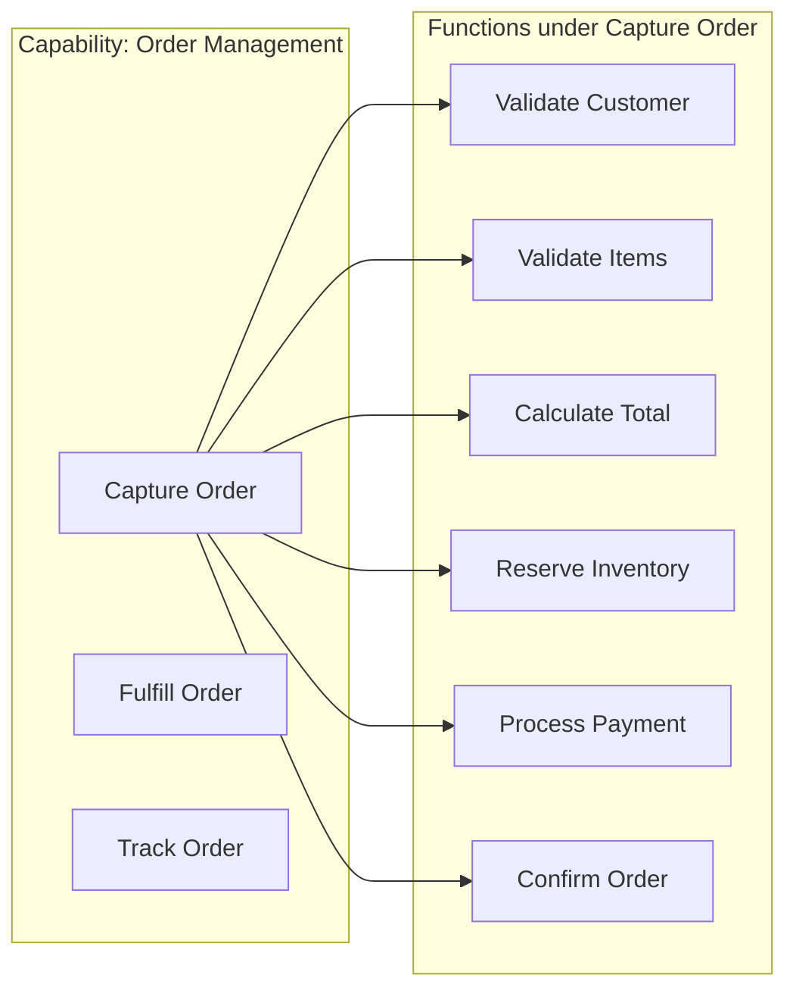

# Functional Decomposition

## Overview

Functional Decomposition is a systematic approach to breaking down a system into its constituent functions or operations, then organizing these functions into discrete services. This pattern identifies the primary functions the system must perform and groups related functions together based on their cohesive purpose. While business capability decomposition focuses on what the organization does, functional decomposition focuses on what the system must do to support those capabilities.

The functional decomposition pattern has its roots in traditional software engineering and systems analysis. When applied to microservices, it provides a complementary perspective to capability-based decomposition. Functions represent the specific operations or actions the system performs—these can often be more granular than capabilities and provide a different lens through which to view service boundaries.

Understanding when to use functional decomposition versus other patterns requires understanding the relationship between capabilities and functions. A business capability might encompass multiple functions, while a single function might support multiple capabilities. This many-to-many relationship means functional decomposition is often used in conjunction with other decomposition approaches rather than in isolation.

## Functions vs. Capabilities

The distinction between capabilities and functions is fundamental to understanding functional decomposition, yet the terms are often confused. Understanding this difference helps architects choose the appropriate decomposition approach.

### Capabilities: The "What"

A capability represents the ability to do something—to achieve a particular outcome. Capabilities are defined in business terms and represent the organization's potential to create value. They are relatively stable over time and often align with organizational structure or strategic objectives.

Examples of capabilities include:
- "Manage customer relationships"
- "Process orders"
- "Deliver products"
- "Handle payments"

Capabilities describe outcomes and value delivered, not the specific steps taken to achieve those outcomes.

### Functions: The "How"

Functions represent specific operations or activities that the system must perform. They are more granular than capabilities and often describe specific actions or transformations. Functions change more frequently than capabilities as business processes evolve and technology advances.

Examples of functions include:
- "Validate credit card"
- "Calculate shipping cost"
- "Generate invoice"
- "Send notification"



This diagram illustrates how functions are more granular than capabilities, with multiple functions supporting a single capability.

## Decomposition Approaches

Functional decomposition can proceed in several ways depending on the system's purpose and the team's goals. Understanding these approaches helps select the right strategy.

### Process-Centered Decomposition

This approach starts with the primary business processes and decomposes them into the functions required to execute each process step. Process-centered decomposition is particularly effective for transactional systems where the primary concern is executing business workflows.

The decomposition follows business process flows:
1. Identify primary business processes
2. For each process, identify the steps or activities
3. Group related activities into cohesive units
4. Define service boundaries around activity groups

```java
// Process-Centered Decomposition Example: Order Processing

// Primary process: Order Fulfillment
// Decomposed into these services/functions

@Service
public class OrderProcessingService {
    
    private final InventoryService inventoryService;
    private final PaymentService paymentService;
    private final ShippingService shippingService;
    private final NotificationService notificationService;
    
    public ProcessOrderResult processOrder(Order order) {
        // Step 1: Validate Order
        ValidationResult validation = validateOrder(order);
        if (!validation.isValid()) {
            return ProcessOrderResult.validationFailed(validation.getErrors());
        }
        
        // Step 2: Reserve Inventory
        InventoryReservation reservation = inventoryService.reserve(
            order.getItems(),
            order.getShippingAddress()
        );
        
        // Step 3: Process Payment
        PaymentResult payment = paymentService.process(
            order.getCustomerId(),
            order.getTotal(),
            order.getPaymentMethod()
        );
        
        // Step 4: Initiate Shipping
        ShippingLabel label = shippingService.createLabel(
            order.getShippingAddress(),
            reservation.getItems()
        );
        
        // Step 5: Send Notification
        notificationService.sendOrderConfirmation(order);
        
        return ProcessOrderResult.success(order, reservation, payment, label);
    }
}
```

### Data-Centered Decomposition

This approach focuses on the data entities and information flows within the system. Services are organized around the primary data entities they manage, with functions related to creating, reading, updating, and deleting those entities.

Data-centered decomposition aligns well with CRUD-style services and works particularly well for systems where data management is the primary concern.

```java
// Data-Centered Decomposition Example: Product Data Management

// Service organized around Product entity

@Service
public class ProductDataService {
    
    private final ProductRepository productRepository;
    private final CategoryRepository categoryRepository;
    private final SearchIndexService searchIndexService;
    
    // Create functions
    public Product createProduct(CreateProductCommand command) {
        Product product = Product.builder()
            .sku(command.getSku())
            .name(command.getName())
            .description(command.getDescription())
            .price(command.getPrice())
            .category(command.getCategoryId())
            .build();
        
        Product saved = productRepository.save(product);
        
        // Update search index
        searchIndexService.index(saved);
        
        return saved;
    }
    
    // Read functions
    public Product getProduct(String sku) {
        return productRepository.findBySku(sku)
            .orElseThrow(() -> new ProductNotFoundException(sku));
    }
    
    public List<Product> searchProducts(ProductSearchCriteria criteria) {
        return productRepository.search(criteria);
    }
    
    public List<Product> getProductsByCategory(String categoryId) {
        return productRepository.findByCategory(categoryId);
    }
    
    // Update functions
    public Product updateProduct(String sku, UpdateProductCommand command) {
        Product product = getProduct(sku);
        
        if (command.getName() != null) {
            product.setName(command.getName());
        }
        if (command.getPrice() != null) {
            product.setPrice(command.getPrice());
        }
        if (command.getDescription() != null) {
            product.setDescription(command.getDescription());
        }
        
        Product updated = productRepository.save(product);
        searchIndexService.reindex(updated);
        
        return updated;
    }
    
    // Delete functions
    public void deleteProduct(String sku) {
        Product product = getProduct(sku);
        productRepository.delete(product);
        searchIndexService.remove(sku);
    }
}
```

### Feature-Centered Decomposition

This approach identifies distinct features or user-facing capabilities and groups all functions related to delivering that feature into a single service. Feature-centered decomposition is particularly effective for product-based applications where different features have different lifecycles and team ownership.

```java
// Feature-Centered Decomposition: Shopping Cart Feature

@Service
public class ShoppingCartFeature {
    
    private final CartRepository cartRepository;
    private final ProductService productService;
    private final PricingService pricingService;
    private final InventoryService inventoryService;
    private final PromotionService promotionService;
    
    // All functions for the shopping cart feature
    
    public AddItemResult addItem(String cartId, AddItemRequest request) {
        // Validate product exists
        Product product = productService.getProduct(request.getSku());
        
        // Get or create cart
        Cart cart = cartRepository.findById(cartId)
            .orElse(Cart.create());
        
        // Check inventory
        boolean available = inventoryService.checkAvailability(
            request.getSku(),
            request.getQuantity()
        );
        
        if (!available) {
            return AddItemResult.insufficientInventory();
        }
        
        // Add item to cart
        cart.addItem(product, request.getQuantity());
        
        // Apply promotions
        List<Promotion> applicablePromotions = 
            promotionService.getApplicablePromotions(cart);
        cart.applyPromotions(applicablePromotions);
        
        // Calculate totals
        PricingInfo pricing = pricingService.calculateCartPricing(cart);
        
        Cart saved = cartRepository.save(cart);
        
        return AddItemResult.success(saved, pricing);
    }
    
    public ApplyCouponResult applyCoupon(String cartId, String couponCode) {
        Cart cart = cartRepository.findById(cartId)
            .orElseThrow(() -> new CartNotFoundException(cartId));
        
        Promotion promotion = promotionService.validateCoupon(couponCode, cart);
        cart.applyPromotions(List.of(promotion));
        
        PricingInfo pricing = pricingService.calculateCartPricing(cart);
        
        return ApplyCouponResult.success(cartRepository.save(cart), pricing);
    }
    
    public CheckoutResult checkout(String cartId, CheckoutRequest request) {
        Cart cart = cartRepository.findById(cartId)
            .orElseThrow(() -> new CartNotFoundException(cartId));
        
        // Final inventory validation
        for (CartItem item : cart.getItems()) {
            if (!inventoryService.checkAvailability(item.getSku(), item.getQuantity())) {
                return CheckoutResult.insufficientInventory(item.getSku());
            }
        }
        
        // Reserve inventory
        inventoryService.reserveItems(cart.getItems());
        
        // Create order (delegates to Order service)
        Order order = orderService.createFromCart(cart, request);
        
        // Clear cart
        cart.clear();
        cartRepository.save(cart);
        
        return CheckoutResult.success(order);
    }
}
```

## Real-World Example: Netflix Content Delivery

Netflix's content delivery system demonstrates functional decomposition, organizing services around the specific functions required to deliver streaming content to users.

**Content Ingestion Function**: Netflix receives content from studios in various formats and must process, transcode, and store this content for streaming.

**Catalog Management Function**: Maintains metadata about available content, including titles, descriptions, cast information, and availability by region.

**Streaming Function**: Handles the technical delivery of video content to users, including adaptive bitrate streaming, CDN selection, and playback control.

**Recommendation Function**: Analyzes user behavior and content attributes to generate personalized recommendations.

```java
// Netflix-style Content Delivery Services

// Content Ingestion Service
@Service
public class ContentIngestionService {
    
    private final ContentRepository contentRepository;
    private final TranscodingService transcodingService;
    private final StorageService storageService;
    private final MetadataService metadataService;
    
    public IngestionJob ingestContent(IngestionRequest request) {
        // Download source content
        byte[] sourceContent = downloadFromStudio(request.getSourceUrl());
        
        // Create content metadata
        Content content = Content.builder()
            .contentId(UUID.randomUUID().toString())
            .title(request.getTitle())
            .studio(request.getStudio())
            .sourceFormat(request.getFormat())
            .ingestionStatus(IngestionStatus.PROCESSING)
            .build();
        
        Content saved = contentRepository.save(content);
        
        // Queue for transcoding
        List<TranscodingProfile> profiles = getTranscodingProfiles(
            request.getTargetResolutions()
        );
        
        for (TranscodingProfile profile : profiles) {
            transcodingService.queueJob(
                TranscodingJob.builder()
                    .jobId(UUID.randomUUID().toString())
                    .contentId(saved.getContentId())
                    .profile(profile)
                    .priority(request.getPriority())
                    .build()
            );
        }
        
        return IngestionJob.fromContent(saved, profiles);
    }
    
    private List<TranscodingProfile> getTranscodingProfiles(
            List<String> resolutions) {
        
        return resolutions.stream()
            .map(res -> TranscodingProfile.builder()
                .resolution(res)
                .bitrate(getBitrateForResolution(res))
                .codec("h265")
                .build())
            .collect(Collectors.toList());
    }
}

// Catalog Management Service  
@Service
public class CatalogManagementService {
    
    private final ContentRepository contentRepository;
    private final MetadataRepository metadataRepository;
    private final AvailabilityService availabilityService;
    private final SearchIndexService searchIndexService;
    
    public Title getTitleDetails(String titleId, String region) {
        Content content = contentRepository.findById(titleId)
            .orElseThrow(() -> new TitleNotFoundException(titleId));
        
        Metadata metadata = metadataRepository.findByContentId(titleId);
        Availability availability = availabilityService.getAvailability(titleId, region);
        
        return Title.builder()
            .content(content)
            .metadata(metadata)
            .availability(availability)
            .build();
    }
    
    public void updateMetadata(String titleId, MetadataUpdate update) {
        Content content = contentRepository.findById(titleId)
            .orElseThrow(() -> new TitleNotFoundException(titleId));
        
        Metadata metadata = metadataRepository.findByContentId(titleId);
        metadata.update(update);
        
        Metadata saved = metadataRepository.save(metadata);
        
        // Update search index
        searchIndexService.reindex(content, saved);
    }
}

// Streaming Service
@Service
public class StreamingService {
    
    private final ContentRepository contentRepository;
    private final CDNService cdnService;
    private final PlaybackService playbackService;
    private final MetricsService metricsService;
    
    public StreamManifest getStreamManifest(String titleId, String deviceId) {
        // Get content versions available
        List<ContentVersion> versions = contentRepository.findVersions(titleId);
        
        // Get device capabilities
        DeviceCapabilities capabilities = 
            playbackService.getDeviceCapabilities(deviceId);
        
        // Select appropriate version
        ContentVersion selected = selectVersion(versions, capabilities);
        
        // Get CDN URLs
        List<CDNUrl> urls = cdnService.getCDNUrls(selected);
        
        // Create manifest
        StreamManifest manifest = StreamManifest.builder()
            .titleId(titleId)
            .version(selected)
            .urls(urls)
            .drmLicenseUrl(getDRMLicenseUrl(deviceId))
            .build();
        
        // Track playback start
        metricsService.recordPlaybackStart(titleId, deviceId);
        
        return manifest;
    }
    
    private ContentVersion selectVersion(
            List<ContentVersion> versions,
            DeviceCapabilities capabilities) {
        
        return versions.stream()
            .filter(v -> v.getResolution().height <= capabilities.getMaxResolution())
            .filter(v -> supportsCodec(v.getCodec(), capabilities.getSupportedCodecs()))
            .max(Comparator.comparing(ContentVersion::getBitrate))
            .orElseThrow(() -> new NoCompatibleVersionException());
    }
}
```

## Decomposition Decision Framework

When deciding on functional decomposition, consider several factors that influence the granularity and structure of resulting services:

### Transaction Boundaries

Functions that must be executed within a single transaction should generally reside in the same service. Distributed transactions across services are complex and should be minimized.

```java
// Functions within transaction boundary
@Service
public class OrderService {
    
    @Transactional
    public Order placeOrder(PlaceOrderCommand command) {
        // These functions share a transaction
        // 1. Validate customer
        // 2. Check inventory
        // 3. Reserve inventory
        // 4. Calculate price
        // 5. Charge payment
        // 6. Create order
        
        // All in same service to maintain consistency
    }
}
```

### Frequency of Change

Functions that change together should be in the same service. Functions with different change rates benefit from separation, allowing one to change without affecting the other.

### Team Structure

 Conway's Law suggests that system structure tends to mirror organizational structure. Consider how teams are organized when grouping functions into services.

### Performance Requirements

Functions with significantly different performance requirements (latency, throughput) should be separated to allow independent scaling.

## Code Example: Service Function Registry

```java
// Function registry for functional decomposition

@Target(ElementType.TYPE)
@Retention(RetentionPolicy.RUNTIME)
public @interface ServiceFunction {
    String value();
    String description();
    FunctionCategory category();
}

public enum FunctionCategory {
    CORE,       // Primary business functions
    SUPPORT,    // Supporting functions
    INTEGRATION, // External integration functions
    UTILITY     // Common utility functions
}

@Service
@ServiceFunction(
    value = "order-management",
    description = "Order processing and management functions",
    category = FunctionCategory.CORE
)
public class OrderFunctionService {
    
    private final Map<String, FunctionHandler> handlers;
    
    @PostConstruct
    public void registerHandlers() {
        handlers = Map.of(
            "createOrder", this::handleCreateOrder,
            "cancelOrder", this::handleCancelOrder,
            "modifyOrder", this::handleModifyOrder,
            "getOrderStatus", this::handleGetOrderStatus,
            "trackOrder", this::handleTrackOrder
        );
    }
    
    public FunctionResult execute(String functionName, FunctionRequest request) {
        FunctionHandler handler = handlers.get(functionName);
        if (handler == null) {
            throw new FunctionNotFoundException(functionName);
        }
        
        try {
            return handler.execute(request);
        } catch (Exception e) {
            return FunctionResult.failure(e.getMessage());
        }
    }
    
    @FunctionalInterface
    interface FunctionHandler {
        FunctionResult execute(FunctionRequest request);
    }
}
```

## Best Practices

### Balancing Granularity

**Avoid Both Extremes**: Services that are too fine-grained create integration complexity and operational overhead. Services that are too coarse-grained lose the benefits of microservices (independent deployment, scaling, team autonomy).

**Use the "Two Pizza Team" Rule**: If a service requires more than one team to maintain, it's likely too large. If a service can be understood by a new team member in an hour, it might be too fine-grained.

### Functional Cohesion

**Single Responsibility Within Services**: Each service should have a clear, focused purpose. All functions within a service should relate to that purpose.

**Avoid Feature Envy**: Functions that frequently access data owned by other services are a sign that those functions may belong in a different service.

### Documentation

**Document Function Dependencies**: Clearly document which functions call which other functions and services. This helps with understanding system behavior and planning changes.

**Maintain Function Catalogs**: As systems evolve, maintain a catalog of all functions and their service assignments to avoid duplication and confusion.

### Common Pitfalls

**Avoid Anemic Services**: Services that are merely CRUD wrappers around a database don't provide much value. Focus on business functions, not just data access.

**Don't Ignore Domain Logic**: Putting all business logic in orchestration layers and leaving services as simple function handlers can lead to the "distributed monolith" anti-pattern.

**Avoid Premature Decomposition**: Don't decompose functions into separate services until there's a clear benefit (team autonomy, independent scaling, different technology requirements).

## Summary

Functional decomposition provides a systematic approach to identifying service boundaries by analyzing the functions a system must perform. Unlike capability-based decomposition which focuses on business outcomes, functional decomposition examines the specific operations and activities required to achieve those outcomes.

The key to successful functional decomposition is finding the right balance between granularity and cohesion. Functions that are closely related and frequently change together should be grouped into the same service, while functions with different lifecycles, performance requirements, or team ownership should be separated.

When combined with other decomposition patterns—particularly business capability decomposition—functional decomposition helps create microservices architectures that are maintainable, scalable, and aligned with both business needs and technical constraints.

---

## Related Patterns

- **Business Capability Decomposition**: Complementary approach focusing on business outcomes
- **Transactional Outbox Pattern**: For handling distributed transactions in decomposed systems
- **API Gateway Pattern**: For exposing functional services to clients

## Further Reading

- "Software Systems Architecture" by Rozanski and Woods
- "Applying UML and Patterns" by Craig Larman
- "Enterprise Integration Patterns" by Hohpe and Woolf