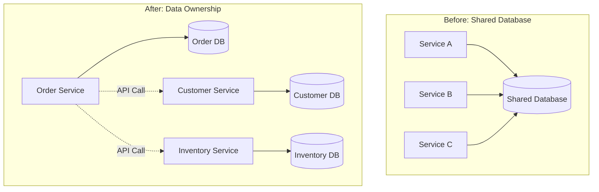
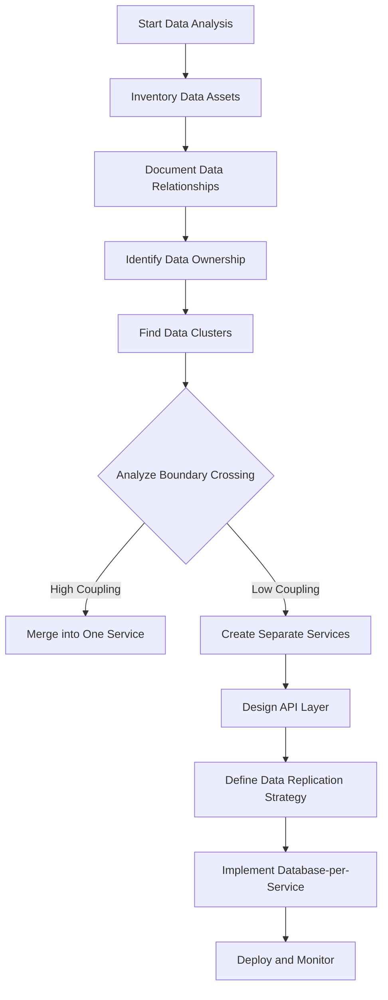

# Data-Driven Decomposition

## Overview

Data-Driven Decomposition is a microservices design pattern that uses data analysis and data ownership as the primary criteria for service boundary identification. This approach examines the data landscape of an organization—including databases, data models, data flows, and data dependencies—to determine how to split functionality into services. By focusing on data, this pattern ensures that each service owns its data completely, eliminating shared databases and the tight coupling they create.

The fundamental principle behind data-driven decomposition is that data boundaries often represent natural service boundaries. When different parts of an organization manipulate the same data in different ways, conflicts arise. By separating data ownership, each service can evolve its data model independently without affecting other services. This principle, often summarized as "each service owns its data," is one of the most important guidelines in microservices architecture.

Data-driven decomposition became prominent as organizations struggled with the challenges of shared databases in service-oriented architectures. Traditional SOA often permitted multiple services to access the same database, leading to the infamous "shared database" anti-pattern where schema changes required coordinated deployments across multiple services. Microservices architecture explicitly avoids this by enforcing data ownership boundaries, and data-driven decomposition provides a systematic approach to identifying these boundaries.

This pattern is particularly valuable when an organization has existing data assets that must be preserved during the transition to microservices. Rather than starting from scratch with business capabilities, teams can analyze their current data landscape to identify natural service boundaries that minimize migration risk. The pattern also helps identify data consolidation opportunities where redundant data stores can be merged into single, authoritative sources.

Understanding data-driven decomposition requires examining how to analyze existing data, how to identify data ownership boundaries, how to handle data that crosses boundaries, and how real organizations have successfully applied these principles. This pattern often works well in combination with business capability decomposition, as data analysis can validate and refine capability-based service boundaries.

## Core Principles

### Data Ownership

The cornerstone of data-driven decomposition is the principle that each service owns its data completely. This means other services cannot directly access another service's database, even for read operations. Instead, services must communicate through APIs, maintaining loose coupling and enabling independent evolution.



Data ownership has several important implications for service design. First, each service must expose all data access patterns that other services might need through its API. This requires careful analysis of data consumption patterns during decomposition. Second, data duplication across services is acceptable and often desirable. For performance reasons, a service might cache data owned by another service, accepting eventual consistency. Third, data migration between services may require careful orchestration to maintain consistency during transitions.

### Database-per-Service Pattern

The database-per-service pattern is the implementation of data ownership at the infrastructure level. Each service has its own database schema or even its own database instance, completely isolated from other services. This isolation provides several architectural benefits that make microservices more manageable and evolvable.

```java
// Database-per-service configuration example

// Order Service Database Configuration
@Configuration
public class OrderDatabaseConfig {
    
    @Bean
    @ConfigurationProperties("spring.datasource.order")
    public DataSource orderDataSource() {
        return DataSourceBuilder.create().build();
    }
    
    @Bean
    public LocalContainerEntityManagerFactoryBean orderEntityManagerFactory(
            EntityManagerFactoryBuilder builder,
            @Qualifier("orderDataSource") DataSource dataSource) {
        return builder
            .dataSource(dataSource)
            .packages("com.orderservice.entity")
            .persistenceUnit("orderPU")
            .build();
    }
}

// Customer Service Database Configuration
@Configuration
public class CustomerDatabaseConfig {
    
    @Bean
    @ConfigurationProperties("spring.datasource.customer")
    public DataSource customerDataSource() {
        return DataSourceBuilder.create().build();
    }
    
    @Bean
    public LocalContainerEntityManagerFactoryBean customerEntityManagerFactory(
            EntityManagerFactoryBuilder builder,
            @Qualifier("customerDataSource") DataSource dataSource) {
        return builder
            .dataSource(dataSource)
            .packages("com.customerservice.entity")
            .persistenceUnit("customerPU")
            .build();
    }
}
```

The database-per-service pattern requires significant organizational discipline and infrastructure investment. Each database must be provisioned, monitored, backed up, and secured independently. Connection management becomes more complex, as services cannot rely on distributed transactions across services. These challenges are addressable but must be considered during decomposition.

### Data Analysis Process

Data-driven decomposition begins with comprehensive data analysis. This analysis identifies the existing data landscape, including all data stores, their schemas, the applications that access them, and the relationships between different data elements. The goal is to build a complete picture of how data flows through the organization.

```java
// Data analysis framework for decomposition

public class DataAsset {
    private String assetId;
    private String name;
    private String description;
    private DataAssetType type; // TABLE, FILE, API, CACHE
    private String ownerService;
    private Set<String> consumingServices;
    private Set<String> producingServices;
    private Map<String, String> schema;
    private DataSensitivity sensitivity;
    
    public boolean sharesDataWith(DataAsset other) {
        // Analyze common fields or relationships
        return schema.keySet().stream()
            .anyMatch(field -> other.schema.containsKey(field));
    }
}

public class DataRelationship {
    private String relationshipId;
    private DataAsset source;
    private DataAsset target;
    private RelationshipType type; // ONE_TO_ONE, ONE_TO_MANY, MANY_TO_MANY
    private String joiningKey;
    private boolean isOwned; // true if source owns the relationship
}

public class DataDecompositionAnalyzer {
    
    private List<DataAsset> dataAssets;
    private List<DataRelationship> relationships;
    
    public DecompositionResult analyze() {
        // Build data ownership matrix
        Map<String, Set<DataAsset>> serviceDataOwnership = 
            dataAssets.stream()
                .collect(groupingBy(
                    DataAsset::getOwnerService,
                    mapping(identity(), toSet())
                ));
        
        // Identify data clusters (potential services)
        List<DataCluster> clusters = identifyDataClusters();
        
        // Find boundary-crossing data
        List<CrossBoundaryData> crossBoundary = identifyCrossBoundaryData();
        
        // Analyze coupling
        CouplingAnalysis coupling = analyzeCoupling();
        
        return new DecompositionResult(clusters, crossBoundary, coupling);
    }
    
    private List<DataCluster> identifyDataClusters() {
        // Use graph algorithms to identify strongly connected components
        // Data that is frequently accessed together should likely belong to the same service
        Graph<DataAsset, DefaultEdge> dataGraph = 
            createDataRelationshipGraph();
        
        GraphAlgoritms.findStronglyConnectedComponents(dataGraph);
    }
    
    private List<CrossBoundaryData> identifyCrossBoundaryData() {
        // Identify data that is referenced by multiple services
        // This data may need replication, APIs, or event synchronization
    }
}
```

## Data-Driven Decomposition Flow



This flow illustrates the iterative nature of data-driven decomposition. Initial analysis identifies data clusters, but the boundary decisions require understanding how data crosses those boundaries. The analysis may reveal that some data should be combined into a single service despite initial assumptions, or that data currently in one database should be split across services.

## Standard Example: E-Commerce Data Decomposition

Consider an e-commerce application with a monolithic database containing customer data, order data, product data, and inventory data. Using data-driven decomposition, we analyze these data entities to identify service boundaries.

```java
// Original monolithic entity relationships (before decomposition)

@Entity
@Table(name = "MONOLITHIC_ENTITIES")
public class MonolithicEntity {
    @Id
    private Long id;
    
    // Customer fields
    private String customerName;
    private String customerEmail;
    private String customerAddress;
    
    // Order fields
    private Long orderId;
    private BigDecimal orderTotal;
    private String orderStatus;
    
    // Product fields
    private String productName;
    private String productSku;
    private BigDecimal productPrice;
    
    // Inventory fields
    private Integer stockQuantity;
    private String warehouseLocation;
}

// After data-driven decomposition - Order Service entities

@Entity
@Table(name = "orders")
public class Order {
    @Id
    @GeneratedValue(strategy = GenerationType.IDENTITY)
    private Long id;
    
    private String orderNumber;
    private String customerId; // Reference to Customer Service
    private BigDecimal totalAmount;
    private String status;
    private Instant createdAt;
    private Instant updatedAt;
    
    @OneToMany(mappedBy = "order", cascade = CascadeType.ALL)
    private List<OrderLineItem> lineItems;
    
    @OneToOne
    @JoinColumn(name = "shipping_address_id")
    private Address shippingAddress;
    
    @OneToOne
    @JoinColumn(name = "payment_id")
    private Payment payment;
}

@Entity
@Table(name = "order_line_items")
public class OrderLineItem {
    @Id
    @GeneratedValue(strategy = GenerationType.IDENTITY)
    private Long id;
    
    @ManyToOne
    @JoinColumn(name = "order_id")
    private Order order;
    
    private String productId; // Reference to Product Service
    private Integer quantity;
    private BigDecimal unitPrice;
    private BigDecimal subtotal;
}

// Customer Service entities (separate database)

@Entity
@Table(name = "customers")
public class Customer {
    @Id
    private String id;
    
    private String name;
    private String email;
    private String phoneNumber;
    
    @OneToMany(mappedBy = "customer", cascade = CascadeType.ALL)
    private List<Address> addresses;
    
    @OneToMany(mappedBy = "customer")
    private List<PaymentMethod> paymentMethods;
    
    private CustomerStatus status;
    private Instant createdAt;
    private Instant lastModifiedAt;
}

@Entity
@Table(name = "addresses")
public class Address {
    @Id
    @GeneratedValue(strategy = GenerationType.IDENTITY)
    private Long id;
    
    @ManyToOne
    @JoinColumn(name = "customer_id")
    private Customer customer;
    
    private String street;
    private String city;
    private String state;
    private String postalCode;
    private String country;
    private AddressType type; // SHIPPING, BILLING
}

// Product Service entities (separate database)

@Entity
@Table(name = "products")
public class Product {
    @Id
    private String id;
    
    private String name;
    private String description;
    private String sku;
    private BigDecimal price;
    
    @ManyToOne
    @JoinColumn(name = "category_id")
    private ProductCategory category;
    
    @OneToMany(mappedBy = "product")
    private List<ProductImage> images;
    
    private ProductStatus status;
}

// Inventory Service entities (separate database)

@Entity
@Table(name = "inventory")
public class Inventory {
    @Id
    @GeneratedValue(strategy = GenerationType.IDENTITY)
    private Long id;
    
    @Column(unique = true)
    private String productId;
    
    private Integer availableQuantity;
    private Integer reservedQuantity;
    private Integer reorderPoint;
    
    @ManyToOne
    @JoinColumn(name = "warehouse_id")
    private Warehouse warehouse;
    
    private Instant lastRestockedAt;
}
```

```java
// Service-to-service communication for data access

@Service
public class OrderService {
    
    private final OrderRepository orderRepository;
    private final CustomerClient customerClient;
    private final ProductClient productClient;
    private final InventoryClient inventoryClient;
    
    public Order createOrder(CreateOrderRequest request) {
        // Validate customer exists via API
        Customer customer = customerClient.getCustomer(request.getCustomerId());
        if (customer == null) {
            throw new CustomerNotFoundException(request.getCustomerId());
        }
        
        // Validate products and check inventory via APIs
        List<OrderLineItem> lineItems = new ArrayList<>();
        for (ItemRequest item : request.getItems()) {
            Product product = productClient.getProduct(item.getProductId());
            if (product == null) {
                throw new ProductNotFoundException(item.getProductId());
            }
            
            boolean available = inventoryClient.checkAvailability(
                item.getProductId(), 
                item.getQuantity()
            );
            if (!available) {
                throw new InsufficientInventoryException(item.getProductId());
            }
            
            lineItems.add(new OrderLineItem(product, item.getQuantity()));
        }
        
        // Create order with validated data
        Order order = new Order(request.getCustomerId(), lineItems);
        return orderRepository.save(order);
    }
}

// Feign client interfaces for inter-service communication

@FeignClient(name = "customer-service", url = "${services.customer.url}")
public interface CustomerClient {
    @GetMapping("/customers/{id}")
    Customer getCustomer(@PathVariable("id") String id);
    
    @GetMapping("/customers/{id}/addresses")
    List<Address> getCustomerAddresses(@PathVariable("id") String id);
}

@FeignClient(name = "product-service", url = "${services.product.url}")
public interface ProductClient {
    @GetMapping("/products/{id}")
    Product getProduct(@PathVariable("id") String id);
    
    @GetMapping("/products/batch")
    List<Product> getProducts(@RequestParam("ids") List<String> ids);
}

@FeignClient(name = "inventory-service", url = "${services.inventory.url}")
public interface InventoryClient {
    @GetMapping("/inventory/{productId}/availability")
    boolean checkAvailability(
        @PathVariable("productId") String productId,
        @RequestParam("quantity") Integer quantity
    );
    
    @PostMapping("/inventory/reserve")
    ReservationResult reserveInventory(@RequestBody ReservationRequest request);
}
```

## Real-World Example 1: Spotify

Spotify's microservices architecture demonstrates sophisticated data-driven decomposition. The music streaming platform operates thousands of microservices, many of which were decomposed based on data ownership principles.

**Data Analysis Process**: Spotify's engineers analyzed their data landscape to identify distinct data domains: user data, music metadata, playback state, playlists, social graph, and billing. Each domain became the foundation for one or more microservices with dedicated data stores.

```java
// Simplified Spotify-style microservice examples

// User Service - Owns user profile data
@Service
public class UserService {
    
    private final UserRepository userRepository;
    private final EventBus eventBus;
    
    public User createUser(CreateUserRequest request) {
        User user = User.builder()
            .username(request.getUsername())
            .email(request.getEmail())
            .country(request.getCountry())
            .birthDate(request.getBirthDate())
            .createdAt(Instant.now())
            .build();
        
        User saved = userRepository.save(user);
        
        // Publish event for other services
        eventBus.publish(UserCreatedEvent.builder()
            .userId(saved.getId())
            .username(saved.getUsername())
            .email(saved.getEmail())
            .build());
        
        return saved;
    }
    
    public UserProfile getUserProfile(String userId) {
        return userRepository.findById(userId)
            .map(this::toProfile)
            .orElseThrow(() -> new UserNotFoundException(userId));
    }
}

// Playback State Service - Owns current playback data
@Service
public class PlaybackStateService {
    
    private final PlaybackStateRepository repository;
    private final MusicCatalogClient musicCatalog;
    
    public PlaybackState startPlayback(StartPlaybackRequest request) {
        // Get track from music catalog
        Track track = musicCatalog.getTrack(request.getTrackId());
        
        PlaybackState state = PlaybackState.builder()
            .userId(request.getUserId())
            .trackId(track.getId())
            .positionMs(0)
            .state(PlaybackStateEnum.PLAYING)
            .deviceId(request.getDeviceId())
            .startedAt(Instant.now())
            .build();
        
        return repository.save(state);
    }
    
    public void updatePosition(String userId, String trackId, long positionMs) {
        repository.findByUserIdAndTrackIdAndState(userId, trackId, PlaybackStateEnum.PLAYING)
            .ifPresent(state -> {
                state.setPositionMs(positionMs);
                repository.save(state);
            });
    }
}

// Playlist Service - Owns playlist data
@Service
public class PlaylistService {
    
    private final PlaylistRepository playlistRepository;
    private final UserServiceClient userService;
    private final MusicCatalogClient musicCatalog;
    
    public Playlist createPlaylist(CreatePlaylistRequest request) {
        // Verify ownership via user service
        userService.verifyUserExists(request.getOwnerId());
        
        Playlist playlist = Playlist.builder()
            .name(request.getName())
            .description(request.getDescription())
            .ownerId(request.getOwnerId())
            .isPublic(request.isPublic())
            .tracks(new ArrayList<>())
            .createdAt(Instant.now())
            .build();
        
        return playlistRepository.save(playlist);
    }
    
    public Playlist addTracks(String playlistId, List<String> trackIds, String userId) {
        Playlist playlist = playlistRepository.findById(playlistId)
            .orElseThrow(() -> new PlaylistNotFoundException(playlistId));
        
        // Verify user permission
        if (!playlist.getOwnerId().equals(userId)) {
            throw new UnauthorizedException("Not the playlist owner");
        }
        
        // Validate tracks exist in catalog
        List<Track> tracks = musicCatalog.getTracks(trackIds);
        
        playlist.getTracks().addAll(tracks);
        return playlistRepository.save(playlist);
    }
}
```

### Spotify's Data Decomposition Strategy

Spotify decomposed their monolith by analyzing data ownership and access patterns. The key principles they followed included isolating each microservice's data store, using event-driven architecture for data synchronization, and accepting eventual consistency where acceptable.

For example, when a user plays a track, the playback state service owns that data and publishes events. The recommendation service subscribes to these events to build user preference profiles. The billing service tracks listening time for subscription management. Each service owns its data and provides APIs for others to access it.

## Real-World Example 2: Uber

Uber's migration to microservices demonstrates data-driven decomposition at scale. The ride-sharing platform decomposed its monolithic architecture based on distinct data domains.

**Domain Identification**: Uber's data domains included rider data, driver data, trip data, mapping and location data, pricing data, and payment data. Each domain became a separate service with its own database.

```java
// Simplified Uber-style microservices

// Rider Service - Owns rider accounts and preferences
@Service
public class RiderService {
    
    private final RiderRepository riderRepository;
    private final PaymentServiceClient paymentService;
    private final TripServiceClient tripService;
    
    public Rider createRider(CreateRiderRequest request) {
        Rider rider = Rider.builder()
            .email(request.getEmail())
            .phoneNumber(request.getPhoneNumber())
            .name(request.getName())
            .status(RiderStatus.ACTIVE)
            .preferredPaymentMethodId(null)
            .homeLocation(request.getHomeLocation())
            .workLocation(request.getWorkLocation())
            .build();
        
        return riderRepository.save(rider);
    }
    
    public RiderProfile getRiderProfile(String riderId) {
        Rider rider = riderRepository.findById(riderId)
            .orElseThrow(() -> new RiderNotFoundException(riderId));
        
        // Get trip history from trip service
        List<TripSummary> recentTrips = tripService.getRecentTrips(riderId, 5);
        
        return RiderProfile.builder()
            .rider(rider)
            .recentTrips(recentTrips)
            .totalTrips(tripService.getTripCount(riderId))
            .build();
    }
    
    public void updatePaymentMethod(String riderId, String paymentMethodId) {
        Rider rider = riderRepository.findById(riderId)
            .orElseThrow(() -> new RiderNotFoundException(riderId));
        
        // Verify payment method via payment service
        paymentService.verifyPaymentMethod(paymentMethodId);
        
        rider.setPreferredPaymentMethodId(paymentMethodId);
        riderRepository.save(rider);
    }
}

// Trip Service - Owns trip lifecycle data
@Service
public class TripService {
    
    private final TripRepository tripRepository;
    private final DriverServiceClient driverService;
    private final PricingServiceClient pricingService;
    private final MapServiceClient mapService;
    
    public Trip requestTrip(TripRequest request) {
        // Get available drivers
        List<Driver> nearbyDrivers = driverService.findNearbyDrivers(
            request.getPickupLocation(),
            request.getRadius()
        );
        
        if (nearbyDrivers.isEmpty()) {
            throw new NoDriversAvailableException();
        }
        
        // Get estimated price
        PriceEstimate estimate = pricingService.getPriceEstimate(
            request.getPickupLocation(),
            request.getDropoffLocation()
        );
        
        Trip trip = Trip.builder()
            .riderId(request.getRiderId())
            .status(TripStatus.SEARCHING)
            .pickupLocation(request.getPickupLocation())
            .dropoffLocation(request.getDropoffLocation())
            .estimatedPrice(estimate.getEstimatedTotal())
            .build();
        
        return tripRepository.save(trip);
    }
    
    public Trip assignDriver(String tripId, String driverId) {
        Trip trip = tripRepository.findById(tripId)
            .orElseThrow(() -> new TripNotFoundException(tripId));
        
        Driver driver = driverService.getDriver(driverId);
        
        trip.setDriverId(driverId);
        trip.setStatus(TripStatus.DRIVER_ASSIGNED);
        trip.setAssignedAt(Instant.now());
        
        return tripRepository.save(trip);
    }
    
    public Trip completeTrip(String tripId, DropoffInfo dropoffInfo) {
        Trip trip = tripRepository.findById(tripId)
            .orElseThrow(() -> new TripNotFoundException(tripId));
        
        // Calculate actual fare
        FareCalculation fare = pricingService.calculateFare(
            trip.getPickupLocation(),
            dropoffInfo.getDropoffLocation(),
            trip.getStartTime(),
            dropoffInfo.getTimestamp()
        );
        
        trip.setStatus(TripStatus.COMPLETED);
        trip.setDropoffLocation(dropoffInfo.getDropoffLocation());
        trip.setActualFare(fare.getTotal());
        trip.setDuration(fare.getDuration());
        trip.setDistance(fare.getDistance());
        
        return tripRepository.save(trip);
    }
}
```

### Uber's Data Architecture

Uber's architecture demonstrates several key data-driven decomposition principles. Each service owns its data completely: the rider service owns rider data, the driver service owns driver data, and the trip service owns trip data. When a trip requires information from multiple services, it uses API calls rather than direct database access.

Uber also uses event-driven data synchronization. When a trip completes, the trip service publishes an event that payment, pricing, and driver services consume to update their own data. This maintains data consistency across services while keeping them decoupled.

## Output Statement

Data-Driven Decomposition provides a systematic approach to microservices design by using data ownership as the primary boundary identification criterion. This pattern ensures that each service owns its data completely, eliminating shared databases and enabling independent service evolution. The analysis of existing data assets, relationships, and access patterns reveals natural service boundaries that minimize coupling and maximize autonomy.

The output of data-driven decomposition includes a complete mapping of data assets to services, identification of cross-boundary data flows, API contracts for data access, and a data replication strategy where needed. Organizations that apply this pattern successfully create architectures where services can be developed, deployed, and scaled independently, with clear ownership of their data domains.

---

## Best Practices

### Data Ownership Discipline

Enforce strict data ownership rules across the organization. No service should ever access another service's database directly, even for read operations. All data access must go through well-defined APIs. This discipline prevents the formation of hidden dependencies that can derail microservices initiatives.

When teams violate data ownership boundaries, they create implicit dependencies that make services harder to evolve independently. A service that reads directly from another service's database becomes coupled to that database's schema, requiring coordinated changes when the schema evolves. By enforcing API-based access, teams maintain the flexibility to change internal implementations without affecting consumers.

### API-First Data Access Design

Design APIs around data access patterns rather than CRUD operations. Services should expose the data operations that consumers actually need, which may differ significantly from simple create, read, update, delete operations. Understanding consumer requirements before designing APIs prevents both over-exposure and under-exposure of data.

```java
// Example: Consumer-driven API design

// Instead of generic CRUD, design specific data access operations
public interface CustomerDataAccessor {
    
    // For order service - needs customer for order
    Customer getCustomerForOrder(String customerId);
    
    // For shipping service - needs shipping address
    Address getShippingAddress(String customerId);
    
    // For marketing service - needs customer segments
    CustomerSegment getCustomerSegment(String customerId);
    
    // For fraud detection - needs risk score
    RiskProfile getRiskProfile(String customerId);
}
```

### Embrace Data Duplication

Data duplication is acceptable in microservices architectures when it improves performance or reduces coupling. A service may cache data from other services for performance reasons, accepting eventual consistency. This approach requires explicit design decisions about which data to duplicate and how to keep it synchronized.

The key is to make duplication explicit and manageable. Document which services cache which data, establish consistency guarantees, and implement appropriate synchronization mechanisms. Uncontrolled duplication that emerges organically creates confusion and inconsistency.

### Data Migration Planning

Plan data migration carefully when decomposing existing systems. Use strangler fig patterns to gradually migrate data, maintaining synchronization between old and new data stores during the transition. This approach reduces risk and allows for rollback if issues arise.

Data migration often reveals hidden assumptions and dependencies in existing systems. Plan for thorough testing of data integrity after migration, and establish clear rollback procedures. The migration process itself can provide valuable insights into data quality issues that should be addressed.

### Monitor Data Consistency

Implement monitoring for data consistency across services, especially when using event-driven synchronization or data duplication. Establish clear SLAs for consistency and track violations. Early detection of consistency issues prevents data corruption and maintains user trust.

```java
// Example: Data consistency monitoring

@Service
public class DataConsistencyMonitor {
    
    private final MeterRegistry meterRegistry;
    
    public void recordEventualConsistencyDelay(
            String sourceService, 
            String targetService, 
            Duration delay) {
        
        Timer timer = Timer.builder("data.consistency.delay")
            .tag("source", sourceService)
            .tag("target", targetService)
            .register(meterRegistry);
        
        timer.record(delay);
        
        if (delay.toMinutes() > 5) {
            // Alert on significant delays
            alertService.alert(
                "Data consistency delay exceeds threshold",
                Map.of("source", sourceService, "target", targetService,
                       "delay", delay.toString())
            );
        }
    }
}
```

## Related Patterns

- **Database per Service**: The infrastructure pattern that implements data ownership
- **API Gateway**: Provides unified access to data across services
- **Event Sourcing**: Alternative approach where data changes are stored as events
- **CQRS**: Complements data decomposition by separating read and write models
