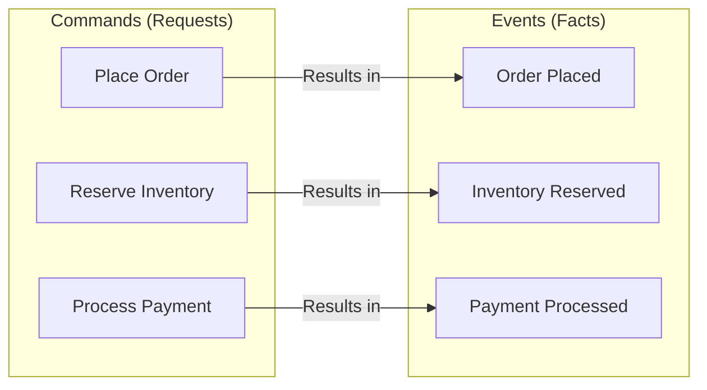
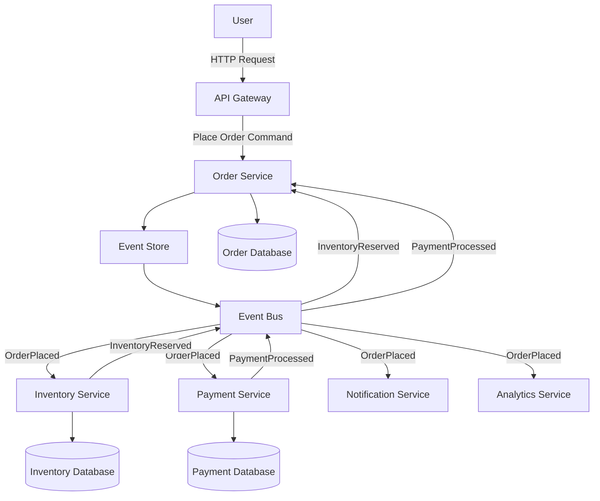

# Event-Driven Decomposition

## Overview

Event-Driven Decomposition is a microservices design pattern that uses events as the primary mechanism for service boundaries and integration. In this approach, services communicate by publishing and subscribing to events rather than making synchronous API calls. This pattern enables loose coupling between services, makes system behavior easier to understand through explicit event flows, and naturally captures business events that can be used for auditing, analytics, and downstream processing.

The fundamental concept behind event-driven decomposition is that business operations can be represented as sequences of events. When something meaningful happens in a business context—a customer places an order, an inventory item is reserved, a payment is processed—that occurrence is captured as an event. Other services can react to these events without needing to know which service originated them or what triggered them. This decoupling enables services to evolve independently and allows new consumers to be added without modifying producers.

Event-driven architecture has its roots in enterprise application integration patterns, particularly the Event-Driven Architecture (EDA) style. In the context of microservices, event-driven decomposition gained significant traction as organizations sought ways to reduce synchronous coupling between services and enable more resilient, scalable systems. The pattern aligns well with Domain-Driven Design's concept of domain events and provides a natural fit for complex business workflows.

This pattern is particularly powerful for workflows that involve multiple steps, multiple services, or where audit trails are important. It also enables powerful architectural patterns like event sourcing and saga orchestration. However, event-driven decomposition introduces complexity in handling eventual consistency, debugging distributed flows, and ensuring events are processed reliably.

Understanding event-driven decomposition requires examining event modeling techniques, event backbone infrastructure, service design patterns that work well with events, and how real-world systems have successfully implemented this approach. This pattern often complements other decomposition approaches, providing the integration mechanism that binds capability-based or domain-based service boundaries together.

## Core Concepts

### Events vs Commands

Understanding the distinction between events and commands is fundamental to event-driven decomposition. Events represent something that has happened—a fact that cannot be changed or undone. Commands represent an intent or request that may or may not be fulfilled. This distinction has significant implications for how services interact.



Events should be named in past tense, reflecting that they represent completed actions. A command like "PlaceOrder" results in an event like "OrderPlaced." This naming convention helps teams maintain clarity about what each message represents and prevents confusion between requests and completed actions.

```java
// Command and event definitions

// Commands - represent intent
public record PlaceOrderCommand(
    String customerId,
    List<OrderItem> items,
    Address shippingAddress,
    PaymentMethod paymentMethod
) {}

public record ReserveInventoryCommand(
    List<InventoryReservation> reservations,
    String orderId
) {}

public record ProcessPaymentCommand(
    String customerId,
    BigDecimal amount,
    PaymentMethod paymentMethod,
    String referenceId
) {}

// Events - represent facts
public record OrderPlacedEvent(
    String orderId,
    String customerId,
    List<OrderItem> items,
    Address shippingAddress,
    BigDecimal totalAmount,
    Instant timestamp
) {}

public record InventoryReservedEvent(
    String reservationId,
    String orderId,
    List<InventoryReservation> reservations,
    Instant timestamp
) {}

public record PaymentProcessedEvent(
    String paymentId,
    String customerId,
    String referenceId,
    BigDecimal amount,
    PaymentStatus status,
    Instant timestamp
) {}
```

### Event Schema Design

Well-designed event schemas are crucial for the long-term success of event-driven systems. Events should be self-contained, meaning consumers can understand the event without needing to look up additional information. However, schemas should also be versioned to allow evolution over time.

```java
// Event schema design with versioning

@Schema(name = "OrderPlaced", version = "1.0")
public class OrderPlacedEventV1 {
    
    @Schema(required = true)
    private String orderId;
    
    @Schema(required = true)
    private String customerId;
    
    @Schema(required = true)
    private List<OrderLineItem> items;
    
    @Schema(required = true)
    private Address shippingAddress;
    
    @Schema(required = true)
    private BigDecimal totalAmount;
    
    private Instant timestamp;
    
    // For backwards compatibility with v1 events
    public static OrderPlacedEventV1 fromCurrent(OrderPlacedEvent event) {
        OrderPlacedEventV1 v1 = new OrderPlacedEventV1();
        v1.orderId = event.orderId();
        v1.customerId = event.customerId();
        v1.items = event.items();
        v1.shippingAddress = event.shippingAddress();
        v1.totalAmount = event.totalAmount();
        v1.timestamp = event.timestamp();
        return v1;
    }
}

@Schema(name = "OrderPlaced", version = "2.0")
public class OrderPlacedEventV2 {
    
    @Schema(required = true)
    private String orderId;
    
    @Schema(required = true)
    private String customerId;
    
    @Schema(required = true)
    private List<OrderLineItemV2> items;
    
    @Schema(required = true)
    private AddressV2 shippingAddress;
    
    @Schema(required = true)
    private BigDecimal totalAmount;
    
    // New field in v2
    @Schema(required = false)
    private String source;
    
    private Instant timestamp;
}
```

## Event Flow Architecture



This flow demonstrates how event-driven services communicate. The Order Service receives a command, processes it, and publishes an OrderPlacedEvent. Multiple services consume this event to perform their respective responsibilities. The Inventory Service reserves stock, the Payment Service processes payment, and both publish their own events that the Order Service may consume.

## Standard Example: Order Processing System

The following example demonstrates a complete event-driven order processing system with multiple services communicating through events.

```java
// Event infrastructure

public interface EventPublisher {
    void publish(String topic, Event event);
    void publish(String topic, List<Event> events);
}

public interface EventSubscriber {
    void subscribe(String topic, EventHandler handler);
    void unsubscribe(String topic, EventHandler handler);
}

public record Event(
    String eventId,
    String eventType,
    String aggregateId,
    Instant timestamp,
    int version,
    Object payload
) {}

// Base event handler

public abstract class EventHandler {
    
    protected final Logger logger = LoggerFactory.getLogger(getClass());
    protected final ObjectMapper objectMapper = new ObjectMapper();
    
    public abstract String getEventType();
    
    public abstract void handle(Event event);
    
    protected <T> T deserializePayload(Event event, Class<T> payloadClass) {
        return objectMapper.convertValue(event.payload(), payloadClass);
    }
}

// Order Service with event publishing

@Service
public class OrderService {
    
    private final OrderRepository orderRepository;
    private final EventPublisher eventPublisher;
    private final InventoryServiceClient inventoryClient;
    private final PaymentServiceClient paymentClient;
    
    public Order placeOrder(PlaceOrderCommand command) {
        // Validate inventory availability
        boolean available = inventoryClient.checkAvailability(
            command.items().stream()
                .map(i -> new InventoryCheck(i.productId(), i.quantity()))
                .toList()
        );
        
        if (!available) {
            throw new InventoryUnavailableException("Some items not available");
        }
        
        // Create order
        Order order = Order.builder()
            .orderId(UUID.randomUUID().toString())
            .customerId(command.customerId())
            .items(command.items())
            .shippingAddress(command.shippingAddress())
            .status(OrderStatus.PENDING)
            .createdAt(Instant.now())
            .build();
        
        order.calculateTotal();
        Order savedOrder = orderRepository.save(order);
        
        // Publish OrderPlaced event
        OrderPlacedEvent event = new OrderPlacedEvent(
            savedOrder.getOrderId(),
            savedOrder.getCustomerId(),
            savedOrder.getItems(),
            savedOrder.getShippingAddress(),
            savedOrder.getTotalAmount(),
            Instant.now()
        );
        
        eventPublisher.publish("order.placed", toEvent(savedOrder, event));
        
        return savedOrder;
    }
    
    private Event toEvent(Order order, OrderPlacedEvent payload) {
        return new Event(
            UUID.randomUUID().toString(),
            "OrderPlaced",
            order.getOrderId(),
            Instant.now(),
            1,
            payload
        );
    }
    
    @EventHandler
    public void handleInventoryReserved(Event event) {
        InventoryReservedEvent payload = deserializePayload(
            event, InventoryReservedEvent.class
        );
        
        Order order = orderRepository.findById(payload.orderId())
            .orElseThrow(() -> new OrderNotFoundException(payload.orderId()));
        
        order.addInventoryReservation(payload.reservationId());
        
        if (order.isFullyReserved()) {
            order.setStatus(OrderStatus.INVENTORY_RESERVED);
            orderRepository.save(order);
        }
    }
    
    @EventHandler
    public void handlePaymentProcessed(Event event) {
        PaymentProcessedEvent payload = deserializePayload(
            event, PaymentProcessedEvent.class
        );
        
        Order order = orderRepository.findById(payload.referenceId())
            .orElseThrow(() -> new OrderNotFoundException(payload.referenceId()));
        
        order.setPaymentId(payload.paymentId());
        
        if (payload.status() == PaymentStatus.SUCCESS) {
            order.setStatus(OrderStatus.PAID);
            orderRepository.save(order);
        }
    }
}

// Inventory Service with event publishing and consuming

@Service
public class InventoryService {
    
    private final InventoryRepository inventoryRepository;
    private final EventPublisher eventPublisher;
    
    @EventHandler
    public void handleOrderPlaced(Event event) {
        OrderPlacedEvent payload = deserializePayload(event, OrderPlacedEvent.class);
        
        List<InventoryReservation> reservations = new ArrayList<>();
        
        for (OrderItem item : payload.items()) {
            Inventory inventory = inventoryRepository
                .findByProductId(item.productId())
                .orElseThrow(() -> new InventoryNotFoundException(item.productId()));
            
            if (inventory.getAvailableQuantity() < item.quantity()) {
                // Reserve what we can
                int reserved = inventory.reserve(item.quantity());
                reservations.add(new InventoryReservation(
                    item.productId(),
                    reserved,
                    inventory.getId()
                ));
            } else {
                inventory.reserve(item.quantity());
                reservations.add(new InventoryReservation(
                    item.productId(),
                    item.quantity(),
                    inventory.getId()
                ));
            }
        }
        
        // Publish reservation event
        InventoryReservedEvent reservationEvent = new InventoryReservedEvent(
            UUID.randomUUID().toString(),
            payload.orderId(),
            reservations,
            Instant.now()
        );
        
        eventPublisher.publish("inventory.reserved", toEvent(payload.orderId(), reservationEvent));
    }
    
    private Event toEvent(String aggregateId, InventoryReservedEvent payload) {
        return new Event(
            UUID.randomUUID().toString(),
            "InventoryReserved",
            aggregateId,
            Instant.now(),
            1,
            payload
        );
    }
}

// Payment Service with event publishing and consuming

@Service
public class PaymentService {
    
    private final PaymentRepository paymentRepository;
    private final EventPublisher eventPublisher;
    private final PaymentGateway paymentGateway;
    
    @EventHandler
    public void handleOrderPlaced(Event event) {
        OrderPlacedEvent payload = deserializePayload(event, OrderPlacedEvent.class);
        
        // Process payment asynchronously
        Payment payment = Payment.builder()
            .paymentId(UUID.randomUUID().toString())
            .customerId(payload.customerId())
            .amount(payload.totalAmount())
            .referenceId(payload.orderId())
            .status(PaymentStatus.PENDING)
            .createdAt(Instant.now())
            .build();
        
        paymentRepository.save(payment);
        
        // Process payment via gateway
        try {
            PaymentGatewayResult result = paymentGateway.process(
                payload.customerId(),
                payload.totalAmount()
            );
            
            payment.setStatus(result.success() ? 
                PaymentStatus.SUCCESS : PaymentStatus.FAILED);
            payment.setGatewayTransactionId(result.transactionId());
            
        } catch (PaymentGatewayException e) {
            payment.setStatus(PaymentStatus.FAILED);
            payment.setFailureReason(e.getMessage());
        }
        
        paymentRepository.save(payment);
        
        // Publish payment event
        PaymentProcessedEvent paymentEvent = new PaymentProcessedEvent(
            payment.getPaymentId(),
            payload.customerId(),
            payload.orderId(),
            payload.totalAmount(),
            payment.getStatus(),
            Instant.now()
        );
        
        eventPublisher.publish("payment.processed", 
            toEvent(payload.orderId(), paymentEvent));
    }
    
    private Event toEvent(String aggregateId, PaymentProcessedEvent payload) {
        return new Event(
            UUID.randomUUID().toString(),
            "PaymentProcessed",
            aggregateId,
            Instant.now(),
            1,
            payload
        );
    }
}
```

## Real-World Example 1: Amazon Order Processing

Amazon's order processing system exemplifies event-driven decomposition at massive scale. The company processes billions of events daily across its distributed architecture.

**Event Architecture**: Amazon uses an internal event backbone called AWS EventBridge internally (similar to their public service). Services publish events to this backbone, and interested services subscribe to relevant event types. This architecture enables Amazon to add new processing capabilities without modifying existing services.

```java
// Simplified Amazon-style event-driven order processing

// Event definitions following Amazon's internal patterns
public class AmazonOrderPlacedEvent {
    private String orderId;
    private String marketplaceId;
    private String customerId;
    private List<AmazonOrderItem> items;
    private AmazonAddress shippingAddress;
    private BigDecimal orderTotal;
    private String fulfillmentMethod; // FBA, Merchant
    private Instant orderPlacedAt;
    
    // Constructors, getters, setters
}

public class AmazonInventoryAllocatedEvent {
    private String allocationId;
    private String orderId;
    private List<InventoryAllocation> allocations;
    private Instant allocatedAt;
}

public class AmazonShipmentCreatedEvent {
    private String shipmentId;
    private String orderId;
    private String carrier;
    private String trackingNumber;
    private Instant estimatedDelivery;
}

// Amazon Order Service - Event Producer
@Service
public class AmazonOrderService {
    
    private final AmazonEventBridge eventBridge;
    private final OrderRepository orderRepository;
    
    public AmazonOrder submitOrder(AmazonSubmitOrderRequest request) {
        // Validate and create order
        AmazonOrder order = createOrder(request);
        
        // Publish OrderPlaced event
        AmazonOrderPlacedEvent event = AmazonOrderPlacedEvent.builder()
            .orderId(order.getOrderId())
            .marketplaceId(request.getMarketplaceId())
            .customerId(order.getCustomerId())
            .items(order.getItems())
            .shippingAddress(order.getShippingAddress())
            .orderTotal(order.getTotal())
            .fulfillmentMethod(request.getFulfillmentMethod())
            .orderPlacedAt(Instant.now())
            .build();
        
        eventBridge.putEvents(AmazonEventBridge PutEventsRequest.builder()
            .entries(PutEventsRequestEntry.builder()
                .eventBusName("amazon-orders")
                .source("com.amazon.order-service")
                .detailType("OrderPlaced")
                .detail(objectMapper.writeValueAsString(event))
                .build())
            .build());
        
        return order;
    }
}

// Amazon Fulfillment Service - Event Consumer
@Service
public class AmazonFulfillmentService {
    
    private final AmazonEventBridge eventBridge;
    private final FulfillmentService fulfillmentService;
    
    @PostConstruct
    public void subscribeToEvents() {
        // Subscribe to OrderPlaced events
        eventBridge.putRule(Rule.builder()
            .name("order-placed-fulfillment-rule")
            .eventBusName("amazon-orders")
            .eventPattern(EventPattern.builder()
                .source("com.amazon.order-service")
                .detailType("OrderPlaced")
                .build())
            .targets(LambdaFunction Target.builder()
                .functionName("fulfillment-processor")
                .build())
            .build());
    }
    
    // Lambda handler for OrderPlaced events
    public void handleOrderPlaced(AmazonOrderPlacedEvent event) {
        // Determine fulfillment strategy
        FulfillmentPlan plan = fulfillmentService.createFulfillmentPlan(event);
        
        // Allocate inventory
        InventoryAllocationResult allocation = 
            fulfillmentService.allocateInventory(event.getItems());
        
        // Publish InventoryAllocated event
        AmazonInventoryAllocatedEvent allocationEvent = 
            AmazonInventoryAllocatedEvent.builder()
                .allocationId(UUID.randomUUID().toString())
                .orderId(event.getOrderId())
                .allocations(allocation.getAllocations())
                .allocatedAt(Instant.now())
                .build();
        
        eventBridge.putEvents(createEventEntry("InventoryAllocated", allocationEvent));
        
        // Create shipment
        Shipment shipment = fulfillmentService.createShipment(event, allocation);
        
        // Publish ShipmentCreated event
        AmazonShipmentCreatedEvent shipmentEvent = 
            AmazonShipmentCreatedEvent.builder()
                .shipmentId(shipment.getShipmentId())
                .orderId(event.getOrderId())
                .carrier(shipment.getCarrier())
                .trackingNumber(shipment.getTrackingNumber())
                .estimatedDelivery(shipment.getEstimatedDelivery())
                .build();
        
        eventBridge.putEvents(createEventEntry("ShipmentCreated", shipmentEvent));
    }
}
```

### Amazon's Event Architecture Principles

Amazon's event-driven architecture follows several key principles. First, events are immutable facts that capture business occurrences. Once published, events are never modified. Second, services evolve independently by adding new consumers for existing events. Third, Amazon uses event sourcing patterns internally to reconstruct system state from event history.

## Real-World Example 2: LinkedIn

LinkedIn uses event-driven architecture extensively for its real-time processing needs, including activity streams, notifications, and analytics.

**Activity Stream Processing**: When a member posts content, performs an action, or updates their profile, events are published to LinkedIn's event backbone (Kafka-based internally). Multiple services consume these events to update search indexes, generate notifications, update recommendation models, and power analytics.

```java
// Simplified LinkedIn-style event-driven architecture

// Activity event definitions
public class LinkedInActivityEvent {
    private String activityId;
    private String actorId; // Who performed the action
    private String targetId; // What they acted upon
    private ActivityType type; // POST, COMMENT, LIKE, SHARE, UPDATE
    private Map<String, Object> metadata;
    private Instant timestamp;
}

public class LinkedInNotificationEvent {
    private String notificationId;
    private String recipientId;
    private NotificationType type;
    private String actorId;
    private String targetId;
    private String message;
    private Map<String, String> actionUrl;
    private Instant createdAt;
}

// LinkedIn Feed Service - Event Producer
@Service
public class LinkedInFeedService {
    
    private final KafkaTemplate<String, Object> kafkaTemplate;
    private final FeedRepository feedRepository;
    
    public FeedPost createPost(CreatePostRequest request) {
        FeedPost post = FeedPost.builder()
            .postId(UUID.randomUUID().toString())
            .authorId(request.getAuthorId())
            .content(request.getContent())
            .visibility(request.getVisibility())
            .createdAt(Instant.now())
            .build();
        
        FeedPost saved = feedRepository.save(post);
        
        // Publish activity event
        LinkedInActivityEvent activityEvent = LinkedInActivityEvent.builder()
            .activityId(saved.getPostId())
            .actorId(saved.getAuthorId())
            .targetId(saved.getPostId())
            .type(ActivityType.POST)
            .metadata(Map.of(
                "visibility", saved.getVisibility().toString(),
                "contentType", saved.getContentType()
            ))
            .timestamp(saved.getCreatedAt())
            .build();
        
        kafkaTemplate.send("linkedin-activity-events", 
            saved.getAuthorId(), activityEvent);
        
        return saved;
    }
    
    public void likePost(String postId, String actorId) {
        // Record like
        Like like = Like.builder()
            .likeId(UUID.randomUUID().toString())
            .postId(postId)
            .actorId(actorId)
            .createdAt(Instant.now())
            .build();
        
        // Publish activity event
        LinkedInActivityEvent activityEvent = LinkedInActivityEvent.builder()
            .activityId(like.getLikeId())
            .actorId(actorId)
            .targetId(postId)
            .type(ActivityType.LIKE)
            .timestamp(Instant.now())
            .build();
        
        kafkaTemplate.send("linkedin-activity-events", actorId, activityEvent);
    }
}

// LinkedIn Notification Service - Event Consumer
@Service
public class LinkedInNotificationService {
    
    private final KafkaConsumer<String, LinkedInActivityEvent> consumer;
    private final NotificationService notificationService;
    
    @PostConstruct
    public void initialize() {
        consumer.subscribe(List.of("linkedin-activity-events"));
        
        // Start consuming in background
        Executors.newSingleThreadExecutor().submit(this::consumeEvents);
    }
    
    private void consumeEvents() {
        while (true) {
            ConsumerRecords<String, LinkedInActivityEvent> records = 
                consumer.poll(Duration.ofMillis(100));
            
            for (ConsumerRecord<String, LinkedInActivityEvent> record : records) {
                try {
                    processActivityEvent(record.value());
                } catch (Exception e) {
                    // Handle error - retry or dead letter
                    handleError(record.value(), e);
                }
            }
        }
    }
    
    private void processActivityEvent(LinkedInActivityEvent event) {
        // Determine who should receive notifications
        List<String> recipients = determineRecipients(event);
        
        for (String recipientId : recipients) {
            if (recipientId.equals(event.getActorId())) {
                continue; // Don't notify actor of their own action
            }
            
            NotificationType type = mapActivityToNotificationType(event.getType());
            
            LinkedInNotificationEvent notification = 
                LinkedInNotificationEvent.builder()
                    .notificationId(UUID.randomUUID().toString())
                    .recipientId(recipientId)
                    .type(type)
                    .actorId(event.getActorId())
                    .targetId(event.getTargetId())
                    .message(buildNotificationMessage(type, event))
                    .createdAt(Instant.now())
                    .build();
            
            notificationService.sendNotification(notification);
        }
    }
    
    private List<String> determineRecipients(LinkedInActivityEvent event) {
        // Logic to determine notification recipients based on:
        // - Activity type
        // - Connection graph
        // - User preferences
    }
}

// LinkedIn Search Index Service - Event Consumer
@Service
public class LinkedInSearchIndexService {
    
    private final KafkaConsumer<String, LinkedInActivityEvent> consumer;
    private final SearchIndexClient searchIndexClient;
    
    @PostConstruct
    public void initialize() {
        consumer.subscribe(List.of("linkedin-activity-events"));
        Executors.newSingleThreadExecutor().submit(this::consumeEvents);
    }
    
    private void consumeEvents() {
        while (true) {
            ConsumerRecords<String, LinkedInActivityEvent> records = 
                consumer.poll(Duration.ofMillis(100));
            
            for (ConsumerRecord<String, LinkedInActivityEvent> record : records) {
                indexActivity(record.value());
            }
        }
    }
    
    private void indexActivity(LinkedInActivityEvent event) {
        SearchDocument document = SearchDocument.builder()
            .id(event.getTargetId())
            .type(event.getType().toString())
            .authorId(event.getActorId())
            .content(extractContent(event))
            .metadata(event.getMetadata())
            .timestamp(event.getTimestamp())
            .build();
        
        searchIndexClient.index(document);
    }
}
```

### LinkedIn's Event Architecture Benefits

LinkedIn's event-driven architecture enables several key capabilities. Real-time feed updates happen within seconds of an action, rather than batch processing delays. Search index updates occur in near real-time, making new content immediately searchable. Notifications are personalized and delivered based on connection graphs and user preferences. Analytics pipelines receive continuous event streams for real-time metrics.

## Output Statement

Event-Driven Decomposition provides a powerful approach to microservices design that naturally captures business operations as explicit events. This pattern enables loose coupling between services, makes system behavior traceable through event flows, and supports complex multi-step workflows without synchronous dependencies. By publishing events when significant business actions occur, services can communicate without direct knowledge of each other, enabling independent evolution and easier addition of new capabilities.

The output of event-driven decomposition includes well-designed event schemas, service boundaries defined around event processing responsibilities, an event backbone infrastructure, and clear contracts between event producers and consumers. Organizations that implement this pattern successfully create systems that are more resilient to failures, easier to debug through event traceability, and more capable of supporting real-time processing requirements.

---

## Best Practices

### Design Events Carefully

Invest significant effort in designing event schemas. Events should be self-contained and include all information consumers need. Use versioning from the start, as event schemas will evolve. Keep events focused on a single business occurrence rather than bundling multiple related facts into a single event.

Well-designed events reduce coupling between services because consumers don't need to look up additional information. However, avoid making events too granular, as this can lead to an explosion of event types. Find the right balance that captures meaningful business occurrences without excessive detail.

### Handle Eventual Consistency Explicitly

Event-driven systems inherently operate with eventual consistency. Make this consistency model explicit to all stakeholders and design accordingly. Users should understand that some operations may not be immediately reflected across all services. Use compensating transactions for operations that need strong consistency.

```java
// Example: Handling eventual consistency in service design

@Service
public class OrderService {
    
    public OrderStatus getOrderStatus(String orderId) {
        Order order = orderRepository.findById(orderId)
            .orElseThrow(() -> new OrderNotFoundException(orderId));
        
        // Return the order's current status, which may not reflect
        // all downstream processing that has occurred
        return order.getStatus();
    }
    
    // Provide way to check if processing is complete
    public OrderProcessingStatus getProcessingStatus(String orderId) {
        Order order = orderRepository.findById(orderId)
            .orElseThrow(() -> new OrderNotFoundException(orderId));
        
        return OrderProcessingStatus.builder()
            .orderId(orderId)
            .orderStatus(order.getStatus())
            .inventoryReserved(!order.getInventoryReservationIds().isEmpty())
            .paymentProcessed(order.getPaymentId() != null)
            .shipmentCreated(order.getShipmentId() != null)
            .build();
    }
}
```

### Implement Idempotency

Events may be delivered multiple times due to retries or infrastructure failures. Design event handlers to be idempotent—processing the same event multiple times should produce the same result. Use event IDs to track processed events and prevent duplicate processing.

```java
// Example: Idempotent event handling

@Service
public class InventoryService {
    
    private final Set<String> processedEventIds = ConcurrentHash.newKeySet();
    
    public void handleInventoryReserved(Event event) {
        // Check if already processed
        if (processedEventIds.contains(event.eventId())) {
            logger.info("Event {} already processed, skipping", event.eventId());
            return;
        }
        
        // Process the event
        InventoryReservedEvent payload = deserializePayload(event);
        reserveInventory(payload);
        
        // Mark as processed
        processedEventIds.add(event.eventId());
        
        // Periodically clean up processed event IDs to prevent memory growth
        if (processedEventIds.size() > 100000) {
            cleanupProcessedEventIds();
        }
    }
}
```

### Use Correlation IDs for Tracing

Implement correlation ID propagation across event processing chains. When a command triggers an event that triggers another event, include the original correlation ID throughout. This enables tracing the complete processing path for debugging and monitoring.

```java
// Example: Correlation ID propagation

public record Event(
    String eventId,
    String eventType,
    String aggregateId,
    String correlationId, // Added for tracing
    String causationId,   // ID of the event that caused this one
    Instant timestamp,
    int version,
    Object payload
) {}

// Command handler that initiates the chain
public class OrderService {
    
    public Order placeOrder(PlaceOrderCommand command, String correlationId) {
        // Create order...
        
        // Publish event with correlation ID
        OrderPlacedEvent event = new OrderPlacedEvent(/* ... */);
        
        Event envelope = new Event(
            UUID.randomUUID().toString(),
            "OrderPlaced",
            order.getOrderId(),
            correlationId,  // Propagate from command
            null,           // This is the first event in the chain
            Instant.now(),
            1,
            event
        );
        
        eventPublisher.publish("order.placed", envelope);
    }
}

// Event handler that continues the chain
public class InventoryService {
    
    public void handleOrderPlaced(Event event) {
        // Extract correlation ID for downstream events
        String correlationId = event.correlationId();
        
        // Reserve inventory...
        
        // Publish with same correlation ID
        InventoryReservedEvent inventoryEvent = /* ... */;
        
        Event envelope = new Event(
            UUID.randomUUID().toString(),
            "InventoryReserved",
            orderId,
            correlationId,  // Propagate
            event.eventId(), // Causation: caused by OrderPlaced
            Instant.now(),
            1,
            inventoryEvent
        );
        
        eventPublisher.publish("inventory.reserved", envelope);
    }
}
```

### Monitor Event Processing

Implement comprehensive monitoring for event processing. Track event processing times, failure rates, and backlog sizes. Set up alerts for processing delays or failures. Good monitoring is essential for operating event-driven systems reliably.

```java
// Example: Event processing monitoring

@Service
public class EventProcessingMetrics {
    
    private final MeterRegistry registry;
    
    public void recordProcessingTime(String eventType, Duration duration) {
        Timer timer = Timer.builder("event.processing.time")
            .tag("eventType", eventType)
            .register(registry);
        timer.record(duration);
    }
    
    public void recordEventProcessed(String eventType) {
        Counter counter = Counter.builder("event.processed")
            .tag("eventType", eventType)
            .register(registry);
        counter.increment();
    }
    
    public void recordEventFailed(String eventType, String errorType) {
        Counter counter = Counter.builder("event.failed")
            .tag("eventType", eventType)
            .tag("errorType", errorType)
            .register(registry);
        counter.increment();
    }
    
    public void recordEventBacklog(String topic, int backlogSize) {
        Gauge.builder("event.backlog", () -> backlogSize)
            .tag("topic", topic)
            .register(registry);
    }
}
```

## Related Patterns

- **Event Sourcing**: Stores state as a sequence of events rather than current state
- **Saga Pattern**: Manages distributed transactions through events
- **CQRS**: Separates read and write models, often using events
- **Event Store**: Specialized database for storing events
