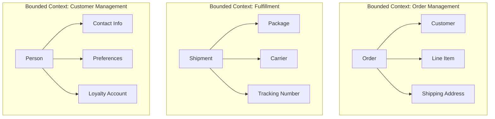
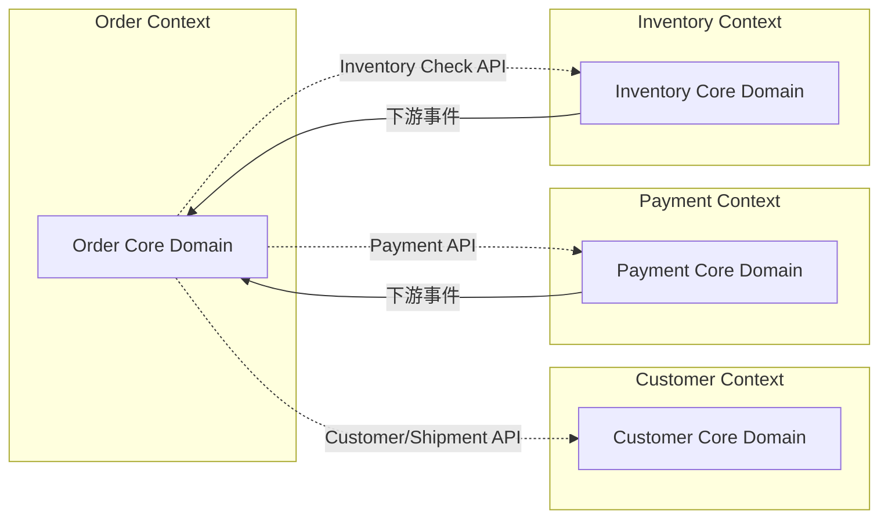
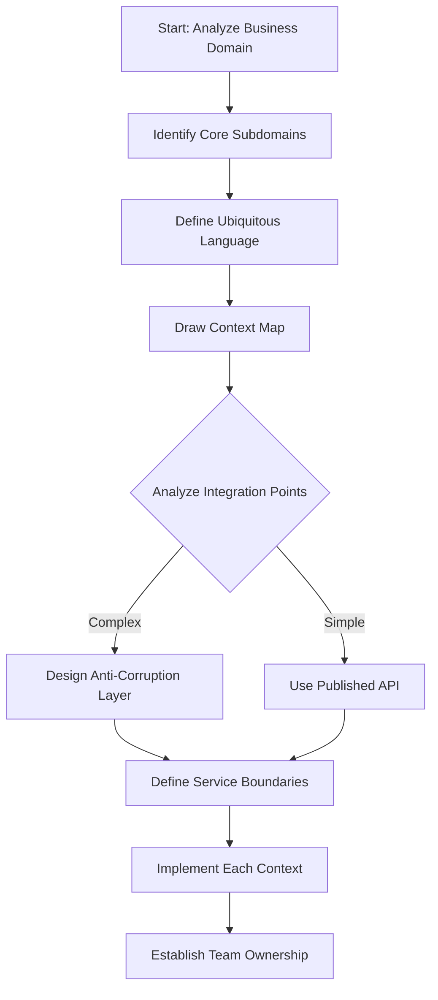

# Bounded Context Pattern

## Overview

Bounded Context is a fundamental Domain-Driven Design (DDD) pattern that defines clear boundaries around specific domain models and functionality. In microservices architecture, bounded contexts serve as the primary mechanism for determining service boundaries, providing a principled approach to decomposing complex business domains into manageable, independently deployable services. Each bounded context represents a specific area of the business with its own domain model, language, and team ownership.

The concept of bounded contexts emerged from Eric Evans's Domain-Driven Design work, where it was recognized that large systems cannot have a single unified model. Instead, different parts of the system naturally model different concepts, and these different models must be explicitly bounded to prevent them from becoming confused or corrupted. A bounded context defines the range of applicability of a particular domain model, establishing where the model makes sense and where it does not.

In the context of microservices, bounded contexts provide the strategic boundaries that align business functionality with team ownership. Each bounded context contains a complete, consistent domain model that can evolve independently from other contexts. This isolation enables teams to make decisions about their bounded context without coordinating with other teams, which is essential for achieving the autonomy that microservices promise.

Understanding bounded contexts requires examining how to identify them from the business domain, how to define the relationships between contexts, how to implement them as microservices, and how real-world organizations have successfully applied this pattern. Bounded context decomposition often produces different service boundaries than other approaches like business capability or functional decomposition, and understanding when each approach is appropriate is key to successful microservices design.

## Core Concepts

### Ubiquitous Language Within Contexts

Each bounded context has its own ubiquitous language—a consistent, carefully structured set of terms and definitions that the team uses to describe the domain. This language is specific to the context and may use terms that have different meanings in other contexts. For example, "order" in a retail context might refer to a customer purchase, while "order" in a manufacturing context might refer to a production order.



The existence of different ubiquitous languages across bounded contexts is not a problem—it is a feature. The different languages reflect the different perspectives that different parts of the organization have on the business. The challenge is managing the translations between these languages, which is where patterns like Anti-Corruption Layers become important.

### Context Mapping

Bounded contexts do not exist in isolation; they have relationships with each other. Context mapping is the discipline of understanding and documenting these relationships. Different types of relationships exist between contexts, each with different implications for integration and team coordination.



The primary context mapping relationships include:
- **Partnership**: Teams for two contexts cooperate closely, often through shared milestones
- **Conformist**: One team adopts the model of another, following their lead
- **Customer-Supplier**: One context (supplier) provides services to another (customer), with formal agreements
- **Antagonistic**: Contexts that cannot be reconciled and must be isolated
- **Open Host Service**: One context defines a protocol for others to integrate
- **Published Language**: A well-documented language for integration

### Aggregates and Entities

Within a bounded context, the domain model is organized into aggregates—clusters of related objects that are treated as a unit. Each aggregate has a root entity, called the aggregate root, which is the only object that external references can hold. This boundary protects the internal consistency of the aggregate.

```java
// Aggregate root example in Order bounded context

public class Order implements AggregateRoot {
    
    private OrderId id;
    private CustomerId customerId;
    private List<LineItem> lineItems;
    private ShippingAddress shippingAddress;
    private OrderStatus status;
    private Money total;
    private Instant createdAt;
    private Instant modifiedAt;
    
    // Only way to add items - goes through aggregate root
    public void addItem(ProductId productId, int quantity, Money unitPrice) {
        if (status != OrderStatus.DRAFT) {
            throw new IllegalStateException("Cannot modify non-draft order");
        }
        
        LineItem item = new LineItem(
            LineItemId.generate(),
            productId,
            quantity,
            unitPrice
        );
        
        lineItems.add(item);
        recalculateTotal();
    }
    
    // Internal state changes protected by aggregate methods
    public void submit() {
        if (lineItems.isEmpty()) {
            throw new IllegalStateException("Cannot submit empty order");
        }
        
        this.status = OrderStatus.SUBMITTED;
        this.modifiedAt = Instant.now();
        
        // Domain events are raised from aggregate
        DomainEvents.publish(new OrderSubmittedEvent(this.id, this.customerId));
    }
    
    public void confirm() {
        if (status != OrderStatus.SUBMITTED) {
            throw new IllegalStateException("Can only confirm submitted orders");
        }
        
        this.status = OrderStatus.CONFIRMED;
        this.modifiedAt = Instant.now();
        
        DomainEvents.publish(new OrderConfirmedEvent(this.id));
    }
}

// LineItem is part of the Order aggregate but not the root
public class LineItem {
    
    private LineItemId id;
    private ProductId productId;
    private int quantity;
    private Money unitPrice;
    private Money subtotal;
    
    // Private constructor - only Order can create LineItems
    private LineItem(LineItemId id, ProductId productId, int quantity, Money unitPrice) {
        this.id = id;
        this.productId = productId;
        this.quantity = quantity;
        this.unitPrice = unitPrice;
        this.subtotal = unitPrice.multiply(quantity);
    }
    
    // Getters only - immutability after construction
}
```

## Bounded Context Decomposition Flow



This flow demonstrates how bounded context decomposition proceeds from domain analysis to service implementation. The key is that service boundaries emerge from domain analysis rather than being imposed from outside.

## Standard Example: E-Commerce Bounded Contexts

The following example demonstrates how an e-commerce system might be decomposed into bounded contexts, each implemented as a microservice.

```java
// Bounded Context 1: Order Management

// Order Context Domain Model
public class Order implements AggregateRoot {
    
    @AggregateId
    private OrderId id;
    private CustomerId customerId;
    private List<OrderLineItem> lineItems;
    private ShippingAddress shippingAddress;
    private BillingAddress billingAddress;
    private Money total;
    private OrderState state;
    private Instant createdAt;
    
    // Aggregate behavior
    public void place() {
        validateCanPlace();
        this.state = OrderState.PLACED;
        addDomainEvent(new OrderPlacedEvent(this));
    }
    
    private void validateCanPlace() {
        if (lineItems.isEmpty()) {
            throw new DomainException("Cannot place empty order");
        }
        if (shippingAddress == null) {
            throw new DomainException("Shipping address required");
        }
    }
}

// Order Repository - persistence for Order context
public interface OrderRepository extends Repository<Order, OrderId> {
    Optional<Order> findById(OrderId id);
    Optional<Order> findByCustomerIdAndState(CustomerId customerId, OrderState state);
    List<Order> findByCustomerId(CustomerId customerId);
}

// Order Service - application service for Order context
@Service
public class OrderApplicationService {
    
    private final OrderRepository orderRepository;
    private final CustomerServiceClient customerService;
    private final InventoryServiceClient inventoryService;
    private final DomainEventPublisher eventPublisher;
    
    public OrderId placeOrder(PlaceOrderCommand command) {
        // Verify customer exists (integration with Customer context)
        Customer customer = customerService.getCustomer(command.getCustomerId());
        if (customer == null) {
            throw new CustomerNotFoundException(command.getCustomerId());
        }
        
        // Verify inventory (integration with Inventory context)
        boolean available = inventoryService.checkAvailability(
            command.getItems().stream()
                .map(i -> new InventoryCheck(i.getSku(), i.getQuantity()))
                .toList()
        );
        
        if (!available) {
            throw new InventoryUnavailableException();
        }
        
        // Build order
        Order order = Order.builder()
            .id(OrderId.generate())
            .customerId(command.getCustomerId())
            .lineItems(buildLineItems(command.getItems()))
            .shippingAddress(command.getShippingAddress())
            .billingAddress(command.getBillingAddress())
            .state(OrderState.DRAFT)
            .build();
        
        order.place();
        orderRepository.save(order);
        
        // Publish domain event
        eventPublisher.publish(new OrderPlacedEvent(order));
        
        return order.getId();
    }
}

// Bounded Context 2: Customer Management

// Customer Context Domain Model
public class Customer implements AggregateRoot {
    
    @AggregateId
    private CustomerId id;
    private Email email;
    private PersonName name;
    private List<ContactInfo> contactMethods;
    private List<Address> addresses;
    private CustomerTier tier;
    private LoyaltyPoints loyaltyPoints;
    private Instant memberSince;
    
    public void updateProfile(NameUpdateCommand command) {
        this.name = command.getName();
        addDomainEvent(new CustomerProfileUpdatedEvent(this.id));
    }
    
    public void addAddress(Address address) {
        this.addresses.add(address);
        addDomainEvent(new CustomerAddressAddedEvent(this.id, address));
    }
}

// Customer Service
@Service
public class CustomerApplicationService {
    
    private final CustomerRepository customerRepository;
    private final VerificationService verificationService;
    
    public CustomerId registerCustomer(RegisterCustomerCommand command) {
        verificationService.verifyEmail(command.getEmail());
        
        Customer customer = Customer.builder()
            .id(CustomerId.generate())
            .email(command.getEmail())
            .name(command.getName())
            .tier(CustomerTier.STANDARD)
            .loyaltyPoints(LoyaltyPoints.ZERO)
            .memberSince(Instant.now())
            .build();
        
        customerRepository.save(customer);
        return customer.getId();
    }
}

// Bounded Context 3: Inventory Management

// Inventory Context Domain Model
public class InventoryItem implements AggregateRoot {
    
    @AggregateId
    private InventoryItemId id;
    private ProductSku sku;
    private WarehouseLocation location;
    private Quantity availableQuantity;
    private Quantity reservedQuantity;
    
    public ReservationResult reserve(Quantity quantity, String orderId) {
        if (availableQuantity().lessThan(quantity)) {
            return ReservationResult.insufficientStock(id, availableQuantity());
        }
        
        this.reservedQuantity = this.reservedQuantity.add(quantity);
        this.availableQuantity = this.availableQuantity.subtract(quantity);
        
        addDomainEvent(new InventoryReservedEvent(id, sku, quantity, orderId));
        
        return ReservationResult.success(id, quantity);
    }
    
    private Quantity availableQuantity() {
        return availableQuantity.subtract(reservedQuantity);
    }
}

// Inventory Service
@Service
public class InventoryApplicationService {
    
    private final InventoryRepository inventoryRepository;
    
    public AvailabilityResult checkAvailability(List<InventoryCheck> checks) {
        List<SkuAvailability> results = checks.stream()
            .map(check -> checkAvailability(check.sku(), check.quantity()))
            .toList();
        
        boolean allAvailable = results.stream().allMatch(SkuAvailability::available);
        
        return new AvailabilityResult(allAvailable, results);
    }
    
    private SkuAvailability checkAvailability(ProductSku sku, Quantity quantity) {
        return inventoryRepository.findBySku(sku)
            .map(item -> item.checkAvailability(quantity))
            .orElse(SkuAvailability.unavailable(sku, "SKU not found"));
    }
}

// Bounded Context 4: Payment

// Payment Context Domain Model
public class Payment implements AggregateRoot {
    
    @AggregateId
    private PaymentId id;
    private CustomerId customerId;
    private Money amount;
    private PaymentMethod paymentMethod;
    private PaymentReference reference;
    private PaymentState state;
    private String gatewayTransactionId;
    
    public void process(PaymentGateway gateway) {
        if (state != PaymentState.PENDING) {
            throw new IllegalStateException("Payment not in pending state");
        }
        
        try {
            GatewayResponse response = gateway.charge(
                customerId,
                amount,
                paymentMethod
            );
            
            this.gatewayTransactionId = response.getTransactionId();
            this.state = PaymentState.COMPLETED;
            
            addDomainEvent(new PaymentCompletedEvent(this));
            
        } catch (PaymentException e) {
            this.state = PaymentState.FAILED;
            this.failureReason = e.getMessage();
            
            addDomainEvent(new PaymentFailedEvent(this, e.getMessage()));
        }
    }
}
```

## Real-World Example 1: Banking System

Large banking systems often implement bounded contexts for different banking functions, each with distinct domain models and regulatory requirements.

**Context Boundaries**: A banking system might have bounded contexts for Core Banking (accounts, transactions), Payments (internal and external transfers), Cards (credit and debit cards), Loans (loan management), and Compliance (regulatory reporting).

```java
// Bounded Context: Core Banking

// Account aggregate - central to Core Banking context
public class Account implements AggregateRoot {
    
    @AggregateId
    private AccountId id;
    private AccountNumber accountNumber;
    private AccountType type;
    private Money balance;
    private AccountHolderId holderId;
    private AccountStatus status;
    private List<AccountTransaction> transactions;
    
    public void credit(Money amount, String description) {
        validateActive();
        
        this.balance = this.balance.add(amount);
        
        AccountTransaction tx = AccountTransaction.builder()
            .id(TransactionId.generate())
            .type(Credit)
            .amount(amount)
            .description(description)
            .timestamp(Instant.now())
            .runningBalance(this.balance)
            .build();
        
        transactions.add(tx);
        addDomainEvent(new AccountCreditedEvent(id, amount, description));
    }
    
    public void debit(Money amount, String description) {
        validateActive();
        
        if (this.balance.lessThan(amount)) {
            throw new InsufficientFundsException(id, balance, amount);
        }
        
        this.balance = this.balance.subtract(amount);
        
        AccountTransaction tx = AccountTransaction.builder()
            .id(TransactionId.generate())
            .type(Debit)
            .amount(amount)
            .description(description)
            .timestamp(Instant.now())
            .runningBalance(this.balance)
            .build();
        
        transactions.add(tx);
        addDomainEvent(new AccountDebitedEvent(id, amount, description));
    }
    
    private void validateActive() {
        if (status != AccountStatus.ACTIVE) {
            throw new AccountNotActiveException(id, status);
        }
    }
}

// Core Banking Service
@Service
public class CoreBankingService {
    
    private final AccountRepository accountRepository;
    private final EventPublisher eventPublisher;
    
    public AccountId createAccount(CreateAccountCommand command) {
        Account account = Account.builder()
            .id(AccountId.generate())
            .accountNumber(generateAccountNumber())
            .type(command.getType())
            .holderId(command.getHolderId())
            .balance(Money.ZERO)
            .status(AccountStatus.ACTIVE)
            .transactions(new ArrayList<>())
            .build();
        
        accountRepository.save(account);
        eventPublisher.publish(new AccountCreatedEvent(account));
        
        return account.getId();
    }
    
    public void transfer(String fromAccountId, String toAccountId, Money amount) {
        Account from = accountRepository.findByAccountNumber(fromAccountId)
            .orElseThrow(() -> new AccountNotFoundException(fromAccountId));
        
        Account to = accountRepository.findByAccountNumber(toAccountId)
            .orElseThrow(() -> new AccountNotFoundException(toAccountId));
        
        from.debit(amount, "Transfer to " + toAccountId);
        to.credit(amount, "Transfer from " + fromAccountId);
        
        accountRepository.save(from);
        accountRepository.save(to);
        
        eventPublisher.publish(new TransferCompletedEvent(
            fromAccountId, toAccountId, amount
        ));
    }
}

// Bounded Context: Payments

// Payment transaction aggregate
public class PaymentTransaction implements AggregateRoot {
    
    @AggregateId
    private PaymentTransactionId id;
    private String sourceAccountId;
    private String destinationAccountId;
    private Money amount;
    private PaymentType type;
    private PaymentStatus status;
    private Instant initiatedAt;
    private Instant completedAt;
    private String failureReason;
    
    public void initiate() {
        this.status = PaymentStatus.INITIATED;
        this.initiatedAt = Instant.now();
    }
    
    public void complete() {
        this.status = PaymentStatus.COMPLETED;
        this.completedAt = Instant.now();
        addDomainEvent(new PaymentCompletedEvent(id, amount));
    }
    
    public void fail(String reason) {
        this.status = PaymentStatus.FAILED;
        this.failureReason = reason;
        this.completedAt = Instant.now();
        addDomainEvent(new PaymentFailedEvent(id, reason));
    }
}

// Payments Service
@Service
public class PaymentsService {
    
    private final PaymentTransactionRepository transactionRepository;
    private final CoreBankingClient coreBankingClient;
    private final EventPublisher eventPublisher;
    
    public PaymentTransactionId initiateTransfer(TransferRequest request) {
        PaymentTransaction transaction = PaymentTransaction.builder()
            .id(PaymentTransactionId.generate())
            .sourceAccountId(request.getFromAccount())
            .destinationAccountId(request.getToAccount())
            .amount(request.getAmount())
            .type(Transfer)
            .status(PaymentStatus.PENDING)
            .build();
        
        transaction.initiate();
        transactionRepository.save(transaction);
        
        // Async processing via event
        eventPublisher.publish(new PaymentInitiatedEvent(transaction));
        
        return transaction.getId();
    }
}
```

### Banking Context Mapping

In this banking example, the contexts have clear relationships. Core Banking is the system of record for accounts, and Payments integrates with it. The Compliance context consumes events from both to meet regulatory requirements. Each context has its own model: Core Banking thinks in terms of accounts and balances, while Payments thinks in terms of transactions and settlements.

## Real-World Example 2: Healthcare System

Healthcare systems demonstrate complex bounded context patterns due to the diverse roles and requirements in the healthcare domain.

**Context Boundaries**: A healthcare system might have bounded contexts for Patient Administration (scheduling, registration), Clinical (medical records, diagnoses), Pharmacy (medications, prescriptions), Billing (insurance, claims), and Laboratory (test results).

```java
// Bounded Context: Patient Administration

// Patient aggregate
public class Patient implements AggregateRoot {
    
    @AggregateId
    private PatientId id;
    private PersonDemographics demographics;
    private List<PatientIdentifier> identifiers;
    private List<Address> addresses;
    private InsuranceInfo insuranceInfo;
    private List<ScheduledAppointment> appointments;
    private PatientConsent consents;
    
    public void scheduleAppointment(AppointmentRequest request) {
        validateCanSchedule();
        
        ScheduledAppointment appointment = ScheduledAppointment.builder()
            .appointmentId(AppointmentId.generate())
            .appointmentType(request.getType())
            .providerId(request.getProviderId())
            .locationId(request.getLocationId())
            .scheduledTime(request.getTime())
            .status(Scheduled)
            .build();
        
        appointments.add(appointment);
        addDomainEvent(new AppointmentScheduledEvent(this.id, appointment));
    }
    
    private void validateCanSchedule() {
        // Validate patient is active and not deceased
    }
}

// Patient Administration Service
@Service
public class PatientAdministrationService {
    
    private final PatientRepository patientRepository;
    private final EventPublisher eventPublisher;
    
    public PatientId registerPatient(RegisterPatientCommand command) {
        Patient patient = Patient.builder()
            .id(PatientId.generate())
            .demographics(command.getDemographics())
            .identifiers(generatePatientIdentifiers())
            .build();
        
        patientRepository.save(patient);
        eventPublisher.publish(new PatientRegisteredEvent(patient));
        
        return patient.getId();
    }
}

// Bounded Context: Clinical

// Medical Record aggregate
public class MedicalRecord implements AggregateRoot {
    
    @AggregateId
    private MedicalRecordId id;
    private PatientId patientId;
    private List<ClinicalNote> notes;
    private List<Diagnosis> diagnoses;
    private List<Procedure> procedures;
    private List<VitalSignSet> vitalSigns;
    
    public void addClinicalNote(ClinicalNote note) {
        note.setAuthorId(getCurrentProvider());
        note.setCreatedAt(Instant.now());
        notes.add(note);
        addDomainEvent(new ClinicalNoteAddedEvent(id, note));
    }
    
    public void addDiagnosis(Diagnosis diagnosis) {
        diagnoses.add(diagnosis);
        addDomainEvent(new DiagnosisAddedEvent(id, diagnosis));
    }
}

// Clinical Service
@Service
public class ClinicalService {
    
    private final MedicalRecordRepository recordRepository;
    private final PatientAdministrationClient patientClient;
    private final PharmacyClient pharmacyClient;
    
    public void recordDiagnosis(RecordDiagnosisCommand command) {
        // Verify patient exists via Patient Administration context
        Patient patient = patientClient.getPatient(command.getPatientId());
        if (patient == null) {
            throw new PatientNotFoundException(command.getPatientId());
        }
        
        MedicalRecord record = recordRepository.findByPatientId(command.getPatientId())
            .orElseGet(() -> createMedicalRecord(command.getPatientId()));
        
        Diagnosis diagnosis = Diagnosis.builder()
            .diagnosisId(DiagnosisId.generate())
            .code(command.getDiagnosisCode())
            .description(command.getDescription())
            .onsetDate(command.getOnsetDate())
            .severity(command.getSeverity())
            .recordedAt(Instant.now())
            .build();
        
        record.addDiagnosis(diagnosis);
        recordRepository.save(record);
    }
}
```

### Healthcare Context Boundaries

Healthcare systems require careful boundary definition. Patient Administration and Clinical are closely related but have distinct responsibilities. Patient Administration handles scheduling and demographics, while Clinical handles the actual medical care documentation. When a prescription is written in Clinical, it triggers an integration with Pharmacy context. The Billing context then integrates with both Clinical and Patient Administration for insurance claims.

## Output Statement

Bounded Context provides a principled approach to microservices decomposition by using domain-driven design to identify natural service boundaries. Each bounded context contains a complete, consistent domain model with its own ubiquitous language, enabling teams to develop and evolve their contexts independently. The relationships between contexts are explicitly mapped, allowing teams to understand and manage integration complexity.

The output of bounded context decomposition includes a context map showing the relationships between contexts, domain models for each context, integration patterns for how contexts communicate, and clear team ownership assignments. Organizations that implement this pattern successfully create microservices architectures where each service has a well-defined domain responsibility, enabling focused development and clear accountability.

---

## Best Practices

### Start with Large Contexts

When beginning bounded context decomposition, err on the side of larger contexts. It is easier to split contexts later than to merge them. Starting with too fine-grained decomposition leads to excessive integration complexity that can undermine the benefits of microservices.

Many successful microservices architectures began with larger bounded contexts and refined them over time as understanding of the domain improved. The initial goal should be to identify the major domain areas that naturally separate, not to find every possible boundary.

### Define Clear Contracts

Each bounded context should expose clear, stable contracts for integration with other contexts. These contracts should be expressed in terms of the context's ubiquitous language, not in terms of implementation details. Use published languages or open host services for well-documented integration patterns.

```java
// Example: Clear contract definition

// Customer Context API contract
public interface CustomerServicePort {
    
    // Query operations
    Customer getCustomer(String customerId);
    List<Customer> searchCustomers(CustomerSearchCriteria criteria);
    
    // Commands
    Customer createCustomer(CreateCustomerRequest request);
    void updateCustomer(String customerId, UpdateCustomerRequest request);
    void deactivateCustomer(String customerId);
    
    // Domain events for other contexts to consume
    @EventListener
    void handleCustomerEvent(CustomerEvent event);
}
```

### Use Events for Integration When Possible

Event-driven integration between bounded contexts reduces coupling and enables independent evolution. When one context publishes events that others consume, the producing context doesn't need to know about its consumers. This makes adding new consumers easier and reduces coordination requirements.

However, not all integrations should be event-driven. Some operations require immediate responses or have strong consistency requirements. In these cases, synchronous API calls are appropriate, possibly with an anti-corruption layer to protect the context's domain model.

### Protect Your Domain Model

The bounded context's domain model should be protected from contamination by other contexts. Use anti-corruption layers when integrating with other contexts, transforming external models into the context's own ubiquitous language. Don't let external concepts leak into your domain model just because they're convenient.

```java
// Example: Anti-corruption layer

@Component
public class CustomerContextAdapter {
    
    private final CustomerServicePort customerService;
    
    public InternalCustomerModel getCustomerForOrderContext(String customerId) {
        // Get external customer representation
        Customer external = customerService.getCustomer(customerId);
        
        // Transform to Order Context's language
        return InternalCustomerModel.builder()
            .customerId(external.getId())
            .shippingAddress(transformAddress(external.getDefaultShippingAddress()))
            .tier(transformTier(external.getMembershipTier()))
            .build();
    }
    
    private Address transformAddress(ExternalAddress external) {
        return Address.builder()
            .street(external.getStreetLine1())
            .city(external.getCity())
            .state(external.getStateProvince())
            .postalCode(external.getPostalCode())
            .country(external.getCountryCode())
            .build();
    }
    
    private CustomerTier transformTier(ExternalTier external) {
        return switch (external) {
            case PREMIUM -> CustomerTier.PREMIUM;
            case STANDARD -> CustomerTier.STANDARD;
            case BASIC -> CustomerTier.BASIC;
        };
    }
}
```

### Establish Team Ownership

Each bounded context should be owned by a single team. That team is responsible for all aspects of the context: development, operations, and evolution. Clear ownership prevents the confusion that occurs when multiple teams modify the same context, and enables the autonomous decision-making that microservices require.

Team ownership should include the database as well. Each context should own its data completely, with no shared databases that would create implicit coupling between teams.

## Related Patterns

- **Anti-Corruption Layer**: Protects context models from external contamination
- **Context Mapping**: Documents relationships between bounded contexts
- **Domain Events**: Enables integration between contexts
- **Published Language**: Well-defined format for cross-context communication