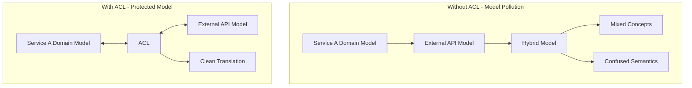
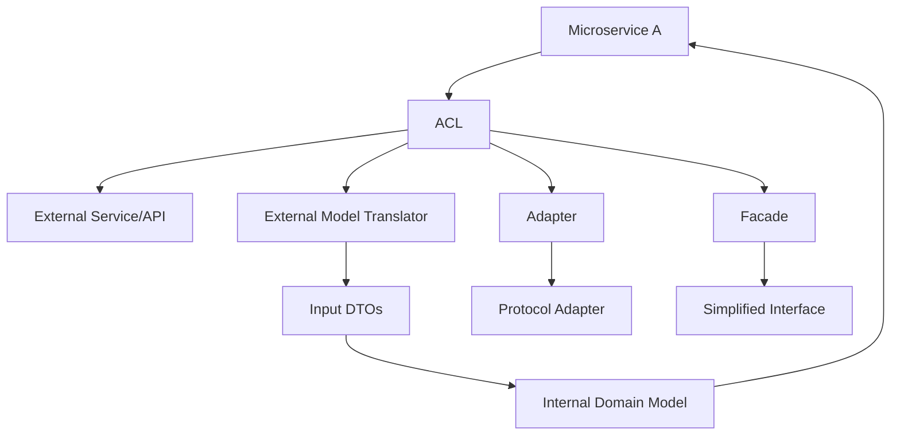

# Anti-Corruption Layer Pattern

## Overview

The Anti-Corruption Layer (ACL) is a foundational Domain-Driven Design pattern that protects a bounded context's domain model from being corrupted by concepts and models from external systems. When a microservice needs to integrate with other services or external systems, the ACL acts as an intermediary that translates between the external system's model and the internal domain model, ensuring that external complexities and idiosyncrasies do not pollute the local domain.

The need for anti-corruption layers arises frequently in microservices architectures. Each service has its own bounded context with its own ubiquitous language and domain model. When one service needs to communicate with another, there is a temptation to directly use the external service's model in the consuming service. Without protection, this leads to what DDD practitioners call "model pollution"—the gradual erosion of the local domain model as external concepts infiltrate it.

The anti-corruption layer pattern was explicitly named in Eric Evans's Domain-Driven Design book, though the underlying concept of isolating systems from external influences has been recognized in software architecture for decades. In modern microservices architectures, ACLs are essential for maintaining clean domain models and enabling services to evolve independently without being constrained by the models of other services they consume.

This pattern is particularly important during migrations from monolithic architectures, when new microservices must integrate with existing systems that may have poorly designed or legacy models. The ACL allows new services to define their own clean domain models while still interacting with the existing systems. It also helps when integrating with third-party services or APIs that have models designed for different purposes.

Understanding anti-corruption layers requires examining when and why they are needed, how to implement them, what transformations they perform, and how real-world systems have successfully applied this pattern. The pattern has significant implications for service design, testing, and evolution.

## The Problem of Model Pollution

Without an anti-corruption layer, a service that consumes an external API or service will tend to incorporate the external model's concepts directly into its own code. Over time, this leads to a hybrid domain model that mixes the service's own concepts with those from external systems. This pollution has several negative consequences.



Model pollution makes the local domain model harder to understand and maintain. Concepts that belong to other contexts appear in the local model, violating the bounded context's isolation. Changes to the external API require changes throughout the consuming service. Testing becomes more complex because the external system's model is embedded in the service's core logic.

```java
// Example: Model pollution without ACL

// Polluted Order Service domain model
// The Order entity directly uses external Customer concepts
public class Order {
    
    private String orderId;
    private String customerId;
    
    // External customer fields embedded directly
    private String customerName;           // From Customer API
    private String customerEmail;          // From Customer API
    private String customerPhone;          // From Customer API
    private String customerAddressLine1;  // From Customer API
    private String customerAddressLine2;  // From Customer API
    private String customerCity;           // From Customer API
    private String customerState;          // From Customer API
    private String customerZipCode;       // From Customer API
    
    // Order-specific fields
    private List<OrderItem> items;
    private BigDecimal total;
    private OrderStatus status;
    
    // Customer API returns this structure directly
    // The order service must handle Customer-specific fields
}

// The service layer directly uses external API
@Service
public class PollutedOrderService {
    
    private final CustomerApiClient customerClient;
    
    public void createOrder(CreateOrderRequest request) {
        // Get customer from external API
        CustomerDto customer = customerClient.getCustomer(request.getCustomerId());
        
        // Use external fields directly in Order
        Order order = new Order();
        order.setCustomerId(customer.getId());
        order.setCustomerName(customer.getFullName());    // External concept
        order.setCustomerEmail(customer.getEmailAddress());  // External concept
        // ... more external fields
        
        // Order logic mixed with customer handling
    }
}
```

## Anti-Corruption Layer Architecture



The anti-corruption layer sits between the consuming service and the external system. It receives requests from the consuming service, translates them into the format expected by the external system, makes the call, and then translates the response back into the consuming service's domain model. This translation layer ensures that external concepts never enter the service's core domain.

## Standard Implementation Example

The following example demonstrates how to implement an anti-corruption layer in a Java Spring application when integrating with an external customer service.

```java
// Step 1: Define internal domain model

// Internal domain model - clean, focused on Order context
public class CustomerReference {
    
    private final CustomerId id;
    private final CustomerName name;
    private final ShippingAddress defaultShippingAddress;
    private final ContactInfo contactInfo;
    private final CustomerSegment segment;
    
    private CustomerReference(
            CustomerId id,
            CustomerName name,
            ShippingAddress defaultShippingAddress,
            ContactInfo contactInfo,
            CustomerSegment segment) {
        this.id = id;
        this.name = name;
        this.defaultShippingAddress = defaultShippingAddress;
        this.contactInfo = contactInfo;
        this.segment = segment;
    }
    
    public static CustomerReference create(
            CustomerId id,
            CustomerName name,
            ShippingAddress defaultShippingAddress,
            ContactInfo contactInfo,
            CustomerSegment segment) {
        return new CustomerReference(id, name, defaultShippingAddress, contactInfo, segment);
    }
    
    // Value objects for type safety
    public record CustomerId(String value) {}
    public record CustomerName(String fullName, String firstName, String lastName) {}
    public record ShippingAddress(
            String street,
            String city,
            String state,
            String postalCode,
            String country) {}
    public record ContactInfo(String email, String phone) {}
    public enum CustomerSegment { PREMIUM, STANDARD, BASIC }
}

public class CustomerReferenceBuilder {
    private CustomerId id;
    private CustomerName name;
    private ShippingAddress defaultShippingAddress;
    private ContactInfo contactInfo;
    private CustomerSegment segment;
    
    public CustomerReferenceBuilder id(String id) {
        this.id = new CustomerId(id);
        return this;
    }
    
    public CustomerReferenceBuilder name(String fullName) {
        this.name = new CustomerName(
            fullName,
            fullName.split(" ")[0],
            fullName.contains(" ") ? fullName.substring(fullName.indexOf(" ") + 1) : ""
        );
        return this;
    }
    
    public CustomerReferenceBuilder address(
            String street, String city, String state, String postalCode, String country) {
        this.defaultShippingAddress = new ShippingAddress(street, city, state, postalCode, country);
        return this;
    }
    
    public CustomerReferenceBuilder contact(String email, String phone) {
        this.contactInfo = new ContactInfo(email, phone);
        return this;
    }
    
    public CustomerReferenceBuilder segment(String segment) {
        this.segment = CustomerSegment.valueOf(segment.toUpperCase());
        return this;
    }
    
    public CustomerReference build() {
        return CustomerReference.create(
            Objects.requireNonNull(id),
            Objects.requireNonNull(name),
            Objects.requireNonNull(defaultShippingAddress),
            Objects.requireNonNull(contactInfo),
            Objects.requireNonNull(segment)
        );
    }
}

// Step 2: Define external DTOs (in a separate package)

package com.example.order.adapters.external.customer.dto;

public class CustomerExternalDto {
    private String id;
    private String fullName;
    private String firstName;
    private String lastName;
    private String emailAddress;
    private String phoneNumber;
    private AddressDto defaultShippingAddress;
    private String membershipTier;
    private Map<String, Object> additionalFields;
    
    // Getters and setters
}

public class AddressDto {
    private String streetLine1;
    private String streetLine2;
    private String city;
    private String stateProvince;
    private String postalCode;
    private String countryCode;
    
    // Getters and setters
}

// Step 3: Implement the translator

@Component
public class CustomerAclTranslator {
    
    public CustomerReference translateToDomain(CustomerExternalDto external) {
        if (external == null) {
            return null;
        }
        
        return new CustomerReferenceBuilder()
            .id(external.getId())
            .name(determineFullName(external))
            .address(
                external.getDefaultShippingAddress().getStreetLine1(),
                external.getDefaultShippingAddress().getCity(),
                external.getDefaultShippingAddress().getStateProvince(),
                external.getDefaultShippingAddress().getPostalCode(),
                external.getDefaultShippingAddress().getCountryCode()
            )
            .contact(external.getEmailAddress(), external.getPhoneNumber())
            .segment(external.getMembershipTier())
            .build();
    }
    
    private String determineFullName(CustomerExternalDto dto) {
        // Handle different name formats from external API
        if (dto.getFullName() != null && !dto.getFullName().isEmpty()) {
            return dto.getFullName();
        }
        if (dto.getFirstName() != null && dto.getLastName() != null) {
            return dto.getFirstName() + " " + dto.getLastName();
        }
        return "Unknown";
    }
}

// Step 4: Implement the adapter

@Component
public class CustomerServiceAdapter implements CustomerPort {
    
    private final CustomerApiClient externalClient;
    private final CustomerAclTranslator translator;
    private final Logger logger = LoggerFactory.getLogger(getClass());
    
    @Override
    public Optional<CustomerReference> getCustomer(CustomerId customerId) {
        try {
            logger.debug("Fetching customer {} from external service", customerId.value());
            
            CustomerExternalDto external = externalClient.fetchCustomer(customerId.value());
            
            if (external == null) {
                return Optional.empty();
            }
            
            CustomerReference reference = translator.translateToDomain(external);
            logger.debug("Successfully translated customer {}", customerId.value());
            
            return Optional.of(reference);
            
        } catch (CustomerServiceUnavailableException e) {
            logger.error("Customer service unavailable for customer {}", customerId.value(), e);
            throw new CustomerIntegrationException(
                "Customer service temporarily unavailable", e);
            
        } catch (CustomerNotFoundInExternalSystemException e) {
            logger.warn("Customer {} not found in external system", customerId.value());
            return Optional.empty();
        }
    }
    
    @Override
    public List<CustomerReference> searchCustomers(CustomerSearchCriteria criteria) {
        try {
            List<CustomerExternalDto> externalResults = 
                externalClient.searchCustomers(criteria.name(), criteria.email());
            
            return externalResults.stream()
                .map(translator::translateToDomain)
                .toList();
                
        } catch (ExternalServiceException e) {
            logger.error("Failed to search customers", e);
            throw new CustomerIntegrationException(
                "Failed to search customers", e);
        }
    }
}

// Step 5: Define the port (interface)

public interface CustomerPort {
    
    Optional<CustomerReference> getCustomer(CustomerId customerId);
    
    List<CustomerReference> searchCustomers(CustomerSearchCriteria criteria);
}

// Step 6: Use in the Order Service

@Service
public class OrderService {
    
    private final CustomerPort customerPort;
    private final OrderRepository orderRepository;
    
    public Order createOrder(CreateOrderCommand command) {
        // Use the ACL to get customer - internal domain model
        CustomerReference customer = customerPort.getCustomer(command.getCustomerId())
            .orElseThrow(() -> new CustomerNotFoundException(command.getCustomerId()));
        
        // Order domain model is clean - uses internal CustomerReference
        Order order = Order.builder()
            .customerId(customer.id())
            .shippingAddress(customer.defaultShippingAddress())
            .items(command.getItems())
            .build();
        
        // Business logic uses domain model concepts
        applyCustomerDiscount(order, customer.segment());
        
        return orderRepository.save(order);
    }
    
    private void applyCustomerDiscount(Order order, CustomerSegment segment) {
        BigDecimal discount = switch (segment) {
            case PREMIUM -> new BigDecimal("0.15");
            case STANDARD -> new BigDecimal("0.05");
            case BASIC -> BigDecimal.ZERO;
        };
        
        order.applyDiscount(discount);
    }
}
```

## Real-World Example 1: Legacy System Integration

Many organizations need to integrate new microservices with legacy systems that have outdated or poorly designed models. The anti-corruption layer is essential in these scenarios.

**Integration Scenario**: A company is building a new e-commerce platform while maintaining a legacy order management system. The new platform needs to read order data from the legacy system without adopting its data model.

```java
// Legacy system DTOs - complex and poorly designed
package com.example.legacy.adapter.dto;

public class LegacyOrderRecord {
    private String ord_num;
    private String cust_ref;
    private String[] prod_codes;
    private int[] prod_qtys;
    private double[] prod_prices;
    private String ship_to_name;
    private String ship_to_addr1;
    private String ship_to_addr2;
    private String ship_to_city;
    private String ship_to_st;
    private String ship_to_zip;
    private String order_dt;
    private String status_cd;
    private double total_amt;
    private String notes;  // JSON blob with additional data
    
    // Getters with inconsistent naming
    public String getOrdNum() { return ord_num; }
    public String getCustRef() { return cust_ref; }
    // ... inconsistent field access
}

// Anti-corruption layer for legacy integration

@Component
public class LegacyOrderAdapter implements OrderPort {
    
    private final LegacyOrderClient legacyClient;
    private final LegacyOrderTranslator translator;
    
    @Override
    public Optional<OrderReference> getOrder(OrderId orderId) {
        try {
            LegacyOrderRecord legacyOrder = legacyClient.fetchOrder(orderId.value());
            
            if (legacyOrder == null) {
                return Optional.empty();
            }
            
            return Optional.of(translator.translateToDomain(legacyOrder));
            
        } catch (LegacySystemException e) {
            throw new LegacyIntegrationException(
                "Failed to fetch order from legacy system", e);
        }
    }
    
    @Override
    public List<OrderReference> getOrdersByCustomer(CustomerId customerId) {
        List<LegacyOrderRecord> legacyOrders = legacyClient.fetchOrdersByCustomer(
            customerId.value()
        );
        
        return legacyOrders.stream()
            .map(translator::translateToDomain)
            .toList();
    }
}

@Component
public class LegacyOrderTranslator {
    
    public OrderReference translateToDomain(LegacyOrderRecord legacy) {
        if (legacy == null) {
            return null;
        }
        
        // Parse complex legacy fields
        List<OrderItem> items = parseItems(legacy);
        ShippingAddress address = parseAddress(legacy);
        Instant orderDate = parseOrderDate(legacy.getOrderDt());
        OrderStatus status = translateStatus(legacy.getStatusCd());
        
        return OrderReference.builder()
            .orderId(new OrderId(legacy.getOrdNum()))
            .customerId(new CustomerId(legacy.getCustRef()))
            .items(items)
            .shippingAddress(address)
            .totalAmount(BigDecimal.valueOf(legacy.getTotalAmt()))
            .orderDate(orderDate)
            .status(status)
            .build();
    }
    
    private List<OrderItem> parseItems(LegacyOrderRecord legacy) {
        if (legacy.getProdCodes() == null) {
            return Collections.emptyList();
        }
        
        List<OrderItem> items = new ArrayList<>();
        
        for (int i = 0; i < legacy.getProdCodes().length; i++) {
            items.add(OrderItem.builder()
                .productCode(new ProductCode(legacy.getProdCodes()[i]))
                .quantity(legacy.getProdQtys()[i])
                .unitPrice(BigDecimal.valueOf(legacy.getProdPrices()[i]))
                .build());
        }
        
        return items;
    }
    
    private ShippingAddress parseAddress(LegacyOrderRecord legacy) {
        return ShippingAddress.builder()
            .name(legacy.getShipToName())
            .street(legacy.getShipToAddr1())
            .street2(legacy.getShipToAddr2())
            .city(legacy.getShipToCity())
            .state(legacy.getShipToSt())
            .postalCode(legacy.getShipToZip())
            .country("US")  // Default, not in legacy data
            .build();
    }
    
    private Instant parseOrderDate(String dateStr) {
        try {
            return Instant.parse(dateStr);
        } catch (Exception e) {
            // Try alternative formats
            try {
                LocalDateTime dt = LocalDateTime.parse(dateStr, 
                    DateTimeFormatter.ofPattern("yyyy-MM-dd HH:mm:ss"));
                return dt.atZone(ZoneOffset.UTC).toInstant();
            } catch (Exception e2) {
                return Instant.now();  // Fallback
            }
        }
    }
    
    private OrderStatus translateStatus(String legacyStatus) {
        return switch (legacyStatus.toUpperCase()) {
            case "PEND" -> OrderStatus.PENDING;
            case "CONF" -> OrderStatus.CONFIRMED;
            case "SHIP" -> OrderStatus.SHIPPED;
            case "DELV" -> OrderStatus.DELIVERED;
            case "CANC" -> OrderStatus.CANCELLED;
            default -> OrderStatus.UNKNOWN;
        };
    }
}
```

### Legacy Integration Benefits

In this example, the anti-corruption layer provides several key benefits. The new e-commerce platform can use its own clean domain model without being constrained by the legacy system's structure. The translation logic is isolated in the ACL, making it easy to update when the legacy system changes. The core domain logic is protected from the legacy system's quirks and inconsistencies.

## Real-World Example 2: Third-Party API Integration

Organizations frequently integrate with third-party services that have their own data models. The anti-corruption layer protects the internal domain from external API changes.

**Integration Scenario**: An e-commerce platform integrates with multiple shipping carriers (FedEx, UPS, DHL) for rate calculation and label generation. Each carrier has a different API model.

```java
// Third-party carrier DTOs

// FedEx response format
public class FedExRateResponse {
    private List<FedExRate> rates;
    private String transactionId;
}

public class FedExRate {
    private String serviceType;
    private String serviceName;
    private FedExMoney price;
    private int transitDays;
}

public class FedExMoney {
    private String amount;
    private String currency;
}

// UPS response format
public class UpsRateResponse {
    private UpsRatedShipment ratedShipment;
}

public class UpsRatedShipment {
    private String service;
    private UpsCharge totalCharge;
    private String guaranteedDeliveryDate;
}

public class UpsCharge {
    private String value;
    private String currencyCode;
}

// DHL response format
public class DhlRateResponse {
    private List<DhlService> services;
}

public class DhlService {
    private String productCode;
    private String productName;
    private DhlPrice price;
    private String deliveryTime;
}

public class DhlPrice {
    private BigDecimal value;
    private String currency;
}

// Anti-corruption layer - unified shipping model

public interface ShippingRatePort {
    
    List<ShippingQuote> getQuotes(ShippingQuoteRequest request);
}

@Component
public class CarrierAdapter implements ShippingRatePort {
    
    private final FedExClient fedExClient;
    private final UpsClient upsClient;
    private final DhlClient dhlClient;
    private final CarrierTranslator translator;
    
    @Override
    public List<ShippingQuote> getQuotes(ShippingQuoteRequest request) {
        List<ShippingQuote> allQuotes = new ArrayList<>();
        
        // Fetch from each carrier
        try {
            FedExRateResponse fedExResponse = fedExClient.getRates(request.toFedExRequest());
            allQuotes.addAll(translator.translateFedExQuotes(fedExResponse));
        } catch (FedExException e) {
            // Log but continue with other carriers
            log.warn("FedEx unavailable", e);
        }
        
        try {
            UpsRateResponse upsResponse = upsClient.getRates(request.toUpsRequest());
            allQuotes.addAll(translator.translateUpsQuotes(upsResponse));
        } catch (UpsException e) {
            log.warn("UPS unavailable", e);
        }
        
        try {
            DhlRateResponse dhlResponse = dhlClient.getRates(request.toDhlRequest());
            allQuotes.addAll(translator.translateDhlQuotes(dhlResponse));
        } catch (DhlException e) {
            log.warn("DHL unavailable", e);
        }
        
        return allQuotes;
    }
}

@Component
public class CarrierTranslator {
    
    public List<ShippingQuote> translateFedExQuotes(FedExRateResponse response) {
        if (response.getRates() == null) {
            return Collections.emptyList();
        }
        
        return response.getRates().stream()
            .map(rate -> ShippingQuote.builder()
                .carrier(Carrier.FEDEX)
                .serviceType(translateFedExService(rate.getServiceType()))
                .price(new Money(
                    new BigDecimal(rate.getPrice().getAmount()),
                    Currency.getInstance(rate.getPrice().getCurrency())
                ))
                .transitDays(rate.getTransitDays())
                .build())
            .toList();
    }
    
    public List<ShippingQuote> translateUpsQuotes(UpsRateResponse response) {
        if (response.getRatedShipment() == null) {
            return Collections.emptyList();
        }
        
        UpsRatedShipment shipment = response.getRatedShipment();
        
        return List.of(ShippingQuote.builder()
            .carrier(Carrier.UPS)
            .serviceType(translateUpsService(shipment.getService()))
            .price(new Money(
                new BigDecimal(shipment.getTotalCharge().getValue()),
                Currency.getInstance(shipment.getTotalCharge().getCurrencyCode())
            ))
            .estimatedDelivery(parseDeliveryDate(shipment.getGuaranteedDeliveryDate()))
            .build());
    }
    
    public List<ShippingQuote> translateDhlQuotes(DhlRateResponse response) {
        if (response.getServices() == null) {
            return Collections.emptyList();
        }
        
        return response.getServices().stream()
            .map(service -> ShippingQuote.builder()
                .carrier(Carrier.DHL)
                .serviceType(translateDhlService(service.getProductCode()))
                .price(new Money(
                    service.getPrice().getValue(),
                    Currency.getInstance(service.getPrice().getCurrency())
                ))
                .transitDays(parseDeliveryDays(service.getDeliveryTime()))
                .build())
            .toList();
    }
    
    private ShippingServiceType translateFedExService(String fedExService) {
        return switch (fedExService) {
            case "FEDEX_GROUND" -> ShippingServiceType.GROUND;
            case "FEDEX_EXPRESS_SAVER" -> ShippingServiceType.EXPRESS;
            case "PRIORITY_OVERNIGHT" -> ShippingServiceType.OVERNIGHT;
            case "INTERNATIONAL_PRIORITY" -> ShippingServiceType.INTERNATIONAL;
            default -> ShippingServiceType.STANDARD;
        };
    }
    
    private ShippingServiceType translateUpsService(String upsService) {
        return switch (upsService) {
            case "Ground" -> ShippingServiceType.GROUND;
            case "2nd Day Air" -> ShippingServiceType.EXPRESS;
            case "Next Day Air" -> ShippingServiceType.OVERNIGHT;
            default -> ShippingServiceType.STANDARD;
        };
    }
    
    private ShippingServiceType translateDhlService(String dhlCode) {
        return switch (dhlCode) {
            case "EX" -> ShippingServiceType.EXPRESS;
            case "EC" -> ShippingServiceType.ECONOMY;
            case "DO" -> ShippingServiceType.OVERNIGHT;
            default -> ShippingServiceType.STANDARD;
        };
    }
    
    // Unified internal model
    public class ShippingQuote {
        private Carrier carrier;
        private ShippingServiceType serviceType;
        private Money price;
        private Integer transitDays;
        private Instant estimatedDelivery;
        
        // Builder, getters
    }
}
```

### Third-Party Integration Benefits

This anti-corruption layer enables the e-commerce platform to use a unified internal model for shipping quotes, regardless of which carrier provides the rates. When a carrier updates their API, only the translator needs to change. The core shipping logic is protected from carrier-specific complexities.

## Output Statement

The Anti-Corruption Layer pattern protects a microservice's domain model from pollution by external systems. By implementing translation logic between external models and the internal domain model, the ACL ensures that external concepts, quirks, and changes do not infiltrate the service's core domain. This isolation enables services to evolve their internal models independently while maintaining clean integration with external systems.

The output of implementing ACL includes clean internal domain models, isolated translation logic, protected bounded contexts, and resilient integration with external systems. Organizations that implement this pattern successfully create microservices that can evolve without being constrained by the models of the systems they integrate with, leading to more maintainable and adaptable architectures.

---

## Best Practices

### Isolate the ACL

The anti-corruption layer should be a clearly isolated component, not scattered throughout the service. All interaction with external systems should go through the ACL, ensuring consistent translation and error handling. This isolation also makes it easier to test the translation logic independently.

```java
// Example: ACL isolation

// All external access goes through ACL
@Component
public class CustomerAcl {
    
    private final CustomerApiClient externalClient;
    private final CustomerTranslator translator;
    private final CustomerCache cache;
    
    public Optional<CustomerReference> getCustomer(CustomerId id) {
        // Check cache first
        Optional<CustomerReference> cached = cache.get(id);
        if (cached.isPresent()) {
            return cached;
        }
        
        // Fetch from external system
        CustomerExternalDto external = externalClient.getCustomer(id.value());
        
        if (external == null) {
            return Optional.empty();
        }
        
        CustomerReference reference = translator.toDomain(external);
        
        // Cache result
        cache.put(id, reference);
        
        return Optional.of(reference);
    }
}

// Service only talks to ACL, never directly to external client
@Service
public class OrderService {
    
    private final CustomerAcl customerAcl;
    
    public Order createOrder(CreateOrderCommand command) {
        // CustomerReference is internal model from ACL
        CustomerReference customer = customerAcl.getCustomer(command.getCustomerId())
            .orElseThrow(() -> new CustomerNotFoundException());
        
        // Order logic uses internal model
    }
}
```

### Handle Failures Gracefully

The ACL should handle failures from external systems gracefully, potentially providing fallback behavior or clear error messages. The internal service should not be aware of the details of external system failures.

```java
// Example: Graceful failure handling in ACL

@Component
public class CustomerAcl {
    
    private final CustomerApiClient externalClient;
    private final FallbackCustomerService fallbackService;
    
    public Optional<CustomerReference> getCustomer(CustomerId id) {
        try {
            CustomerExternalDto external = externalClient.getCustomer(id.value());
            return Optional.of(translator.toDomain(external));
            
        } catch (CustomerServiceUnavailableException e) {
            // Try fallback
            return fallbackService.getCustomer(id);
            
        } catch (CustomerNotFoundException e) {
            return Optional.empty();
            
        } catch (Exception e) {
            // Log and provide degraded service
            log.error("Unexpected error fetching customer {}", id.value(), e);
            throw new CustomerServiceException(
                "Customer service unavailable", e);
        }
    }
}

@Component
public class FallbackCustomerService {
    
    public Optional<CustomerReference> getCustomer(CustomerId id) {
        // Return cached data or default values
        // This provides degraded service when external system is down
    }
}
```

### Make Translation Explicit

Translation logic should be explicit and well-documented. When translating between models, decisions are made that affect the domain. These decisions should be clear and intentional, not hidden in implicit conversions.

```java
// Example: Explicit, documented translation

@Component
public class CustomerTranslator {
    
    /**
     * Translates external customer model to internal domain model.
     * 
     * Translation decisions:
     * - Maps external "VIP" status to internal PREMIUM segment
     * - Uses shipping address as default if available, otherwise billing
     * - Maps external "home" and "work" phone types to single ContactInfo
     * - Throws exception if essential fields (id, name) are missing
     * 
     * @param external the external customer DTO
     * @return internal CustomerReference
     * @throws TranslationException if required fields are missing
     */
    public CustomerReference toDomain(CustomerExternalDto external) {
        validateExternalInput(external);
        
        return CustomerReference.builder()
            .id(new CustomerId(external.getId()))
            .name(parseName(external))
            .contactInfo(parseContactInfo(external))
            .defaultShippingAddress(parseShippingAddress(external))
            .segment(mapSegment(external.getMembershipStatus()))
            .build();
    }
    
    private void validateExternalInput(CustomerExternalDto external) {
        if (external == null) {
            throw new TranslationException("External customer cannot be null");
        }
        if (external.getId() == null || external.getId().isEmpty()) {
            throw new TranslationException("External customer ID is required");
        }
    }
    
    private CustomerSegment mapSegment(String externalStatus) {
        if (externalStatus == null) {
            return CustomerSegment.BASIC;
        }
        
        return switch (externalStatus.toLowerCase()) {
            case "vip", "gold", "platinum" -> CustomerSegment.PREMIUM;
            case "silver" -> CustomerSegment.STANDARD;
            default -> CustomerSegment.BASIC;
        };
    }
}
```

### Test the ACL Thoroughly

The translation logic in the ACL is critical and should be thoroughly tested. Unit tests should cover various input scenarios, including edge cases and error conditions. The ACL is the boundary between the service and external systems, making it a likely source of integration issues.

```java
// Example: ACL testing

@ExtendWith(MockitoExtension.class)
class CustomerAclTranslatorTest {
    
    @InjectMocks
    private CustomerAclTranslator translator;
    
    @Test
    void shouldTranslateCompleteCustomer() {
        // Given
        CustomerExternalDto external = createExternalCustomer();
        
        // When
        CustomerReference result = translator.toDomain(external);
        
        // Then
        assertThat(result.id().value()).isEqualTo("CUST-001");
        assertThat(result.name().fullName()).isEqualTo("John Doe");
        assertThat(result.segment()).isEqualTo(CustomerSegment.PREMIUM);
    }
    
    @Test
    void shouldHandleNullAddress() {
        // Given
        CustomerExternalDto external = createExternalCustomer();
        external.setDefaultShippingAddress(null);
        
        // When
        CustomerReference result = translator.toDomain(external);
        
        // Then - should use billing address as fallback
        assertThat(result.defaultShippingAddress()).isNotNull();
    }
    
    @Test
    void shouldThrowOnMissingRequiredFields() {
        // Given
        CustomerExternalDto external = new CustomerExternalDto();
        external.setId(null);
        
        // When/Then
        assertThatThrownBy(() -> translator.toDomain(external))
            .isInstanceOf(TranslationException.class)
            .hasMessageContaining("ID is required");
    }
    
    private CustomerExternalDto createExternalCustomer() {
        // Create test data
    }
}
```

### Version the ACL

When external APIs change, the ACL should be versioned to maintain backward compatibility for internal consumers. The ACL can support multiple versions of external APIs while presenting a consistent internal interface, or it can translate between different external versions and a single internal model.

## Related Patterns

- **Bounded Context**: The pattern ACL protects
- **Adapter**: The structural pattern ACL implements
- **Gateway**: Similar pattern for external system access
- **Published Language**: Can work with ACL for integration