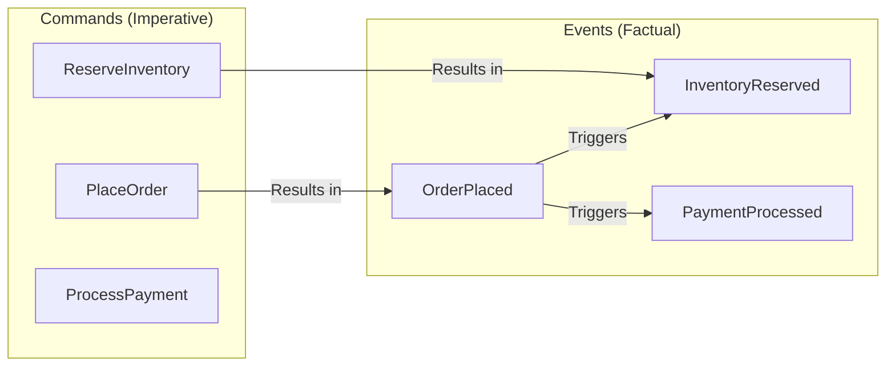
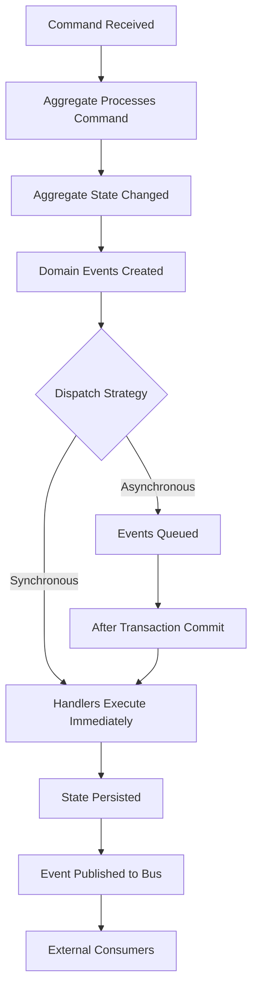

# Domain Events Pattern

## Overview

Domain Events are a powerful Domain-Driven Design pattern that captures significant occurrences within a domain and communicates them to other parts of the system. In microservices architecture, domain events serve as the backbone for event-driven communication between services, enabling loose coupling, eventual consistency, and complex workflow orchestration. When something important happens in a bounded context—a business rule is triggered, a state transition occurs, or a significant decision is made—a domain event is raised to notify interested parties.

The concept of domain events comes from the realization that domain models often need to communicate with other parts of the system beyond simple method calls. When an order is placed, not only does the order need to be saved, but inventory must be checked, payment must be processed, notifications must be sent, and analytics must be updated. Domain events provide a way to express these cross-cutting concerns without creating tight coupling between the order management logic and all the other systems that need to react.

Domain events differ from simple application events or infrastructure events because they represent meaningful business occurrences. "OrderPlaced" is a domain event because placing an order is a significant business action. "DatabaseRecordUpdated" is not a domain event because it's an infrastructure detail. This distinction is important because domain events are part of the domain model and should be designed with the same care as entities and value objects.

In microservices architectures, domain events become the primary mechanism for service integration. Services publish events when significant actions occur, and other services subscribe to events they care about. This pattern enables services to evolve independently, as producers don't need to know about consumers, and new consumers can be added without modifying producers.

Understanding domain events requires examining event design, event dispatch mechanisms, how to handle events reliably, and how real-world systems apply this pattern. Domain events are closely related to event-driven decomposition and event sourcing patterns.

## Core Concepts

### Events vs Commands

Understanding the distinction between events and commands is fundamental to using domain events effectively. Commands represent a request for an action to be performed; they may succeed or fail. Events represent a fact that something has happened; they cannot be undone or rejected.



Commands are directed—they are addressed to a specific handler that will process them. Events are broadcast—they are published and any interested subscriber can react. This fundamental difference has significant implications for how systems are designed and how they handle failures.

```java
// Command definition - imperative, may fail
public record PlaceOrderCommand(
    String customerId,
    List<OrderItem> items,
    ShippingAddress shippingAddress
) {}

// Domain Event definition - factual, represents something that happened
public record OrderPlacedEvent(
    String orderId,
    String customerId,
    List<OrderItem> items,
    ShippingAddress shippingAddress,
    BigDecimal totalAmount,
    Instant occurredAt
) {}
```

### Event Design Principles

Well-designed domain events have several key characteristics. They are named in past tense to reflect that they represent completed actions. They are self-contained, including all information needed by consumers. They are immutable—once published, events are not changed.

```java
// Good event design

public record OrderPlacedEvent(
    // What: the event represents
    String eventId,           // Unique identifier for this event
    String eventType,         // "OrderPlaced"
    int eventVersion,         // For evolution
    
    // Which order: aggregate identifier
    String orderId,
    
    // Who/What: domain data needed by consumers
    String customerId,
    List<OrderLineItem> items,
    ShippingAddress shippingAddress,
    BigDecimal totalAmount,
    
    // When: timestamp
    Instant occurredAt,
    
    // Why: causation and correlation for tracing
    String correlationId,     // Original request ID
    String causationId        // Event that caused this one
) {}
```

### Event Dispatch Mechanism

The mechanism for dispatching domain events is a crucial architectural decision. Events can be dispatched synchronously within the same transaction as the state change, or asynchronously as a separate process. Each approach has trade-offs.

```java
// Synchronous event dispatch within transaction

@Service
public class OrderService {
    
    private final OrderRepository orderRepository;
    private final DomainEventDispatcher eventDispatcher;
    
    @Transactional
    public Order placeOrder(PlaceOrderCommand command) {
        // Create and save order
        Order order = Order.create(command);
        orderRepository.save(order);
        
        // Dispatch events synchronously - within the same transaction
        order.getDomainEvents().forEach(event -> {
            eventDispatcher.dispatch(event);
        });
        
        // Clear events after dispatch
        order.clearDomainEvents();
        
        return order;
    }
}

// Asynchronous event dispatch

@Service
public class AsyncOrderService {
    
    private final OrderRepository orderRepository;
    private final DomainEventPublisher eventPublisher;
    
    @Transactional
    public Order placeOrder(PlaceOrderCommand command) {
        Order order = Order.create(command);
        orderRepository.save(order);
        
        // Schedule events for async dispatch after transaction commits
        order.getDomainEvents().forEach(event -> {
            eventPublisher.publishAsync(event);
        });
        
        order.clearDomainEvents();
        
        return order;
    }
}

// Event listener for async processing
@Component
public class DomainEventListener {
    
    private final DomainEventPublisher publisher;
    
    @TransactionalEventListener(phase = TransactionPhase.AFTER_COMMIT)
    public void handleDomainEvent(DomainEvent event) {
        publisher.publish(event);
    }
}
```

## Domain Events Flow



## Standard Implementation Example

The following example demonstrates a complete domain events implementation in an e-commerce system.

```java
// Base event infrastructure

public interface DomainEvent {
    String getEventId();
    String getEventType();
    String getAggregateId();
    Instant getOccurredAt();
    int getVersion();
}

public interface DomainEventHandler<T extends DomainEvent> {
    void handle(T event);
    String getEventType();
}

// Event base class
public abstract class AbstractDomainEvent implements DomainEvent {
    
    private final String eventId;
    private final String aggregateId;
    private final Instant occurredAt;
    private final int version;
    
    protected AbstractDomainEvent(String aggregateId) {
        this.eventId = UUID.randomUUID().toString();
        this.aggregateId = aggregateId;
        this.occurredAt = Instant.now();
        this.version = 1;
    }
    
    // Getters
}

// Order aggregate with domain events

public class Order implements AggregateRoot {
    
    @AggregateId
    private OrderId id;
    private CustomerId customerId;
    private List<OrderLineItem> lineItems;
    private ShippingAddress shippingAddress;
    private OrderStatus status;
    private BigDecimal total;
    private final List<DomainEvent> domainEvents = new ArrayList<>();
    
    private Order() {} // For persistence
    
    public static Order create(PlaceOrderCommand command) {
        Order order = new Order();
        order.id = OrderId.generate();
        order.customerId = new CustomerId(command.getCustomerId());
        order.lineItems = command.getItems().stream()
            .map(OrderLineItem::create)
            .toList();
        order.shippingAddress = command.getShippingAddress();
        order.status = OrderStatus.PENDING;
        order.calculateTotal();
        
        // Add domain event
        order.addDomainEvent(new OrderPlacedEvent(
            order.id.value(),
            order.customerId.value(),
            order.lineItems.stream().map(OrderLineItem::toDto).toList(),
            order.shippingAddress,
            order.total,
            Instant.now()
        ));
        
        return order;
    }
    
    public void confirm() {
        if (this.status != OrderStatus.PENDING) {
            throw new IllegalStateException("Cannot confirm order in " + this.status + " status");
        }
        
        this.status = OrderStatus.CONFIRMED;
        
        addDomainEvent(new OrderConfirmedEvent(
            this.id.value(),
            this.customerId.value(),
            Instant.now()
        ));
    }
    
    public void cancel(String reason) {
        if (this.status == OrderStatus.SHIPPED || this.status == OrderStatus.DELIVERED) {
            throw new IllegalStateException("Cannot cancel shipped or delivered order");
        }
        
        this.status = OrderStatus.CANCELLED;
        
        addDomainEvent(new OrderCancelledEvent(
            this.id.value(),
            this.customerId.value(),
            reason,
            Instant.now()
        ));
    }
    
    private void addDomainEvent(DomainEvent event) {
        this.domainEvents.add(event);
    }
    
    public List<DomainEvent> getDomainEvents() {
        return Collections.unmodifiableList(this.domainEvents);
    }
    
    public void clearDomainEvents() {
        this.domainEvents.clear();
    }
}

// Domain event definitions

public record OrderPlacedEvent(
    String eventId,
    String orderId,
    String customerId,
    List<OrderLineItemDto> items,
    ShippingAddress shippingAddress,
    BigDecimal totalAmount,
    Instant occurredAt,
    String correlationId
) implements DomainEvent {
    
    public OrderPlacedEvent(String orderId, String customerId, 
            List<OrderLineItemDto> items, ShippingAddress shippingAddress,
            BigDecimal totalAmount, Instant occurredAt) {
        this(UUID.randomUUID().toString(), orderId, customerId, items,
            shippingAddress, totalAmount, occurredAt, null);
    }
    
    @Override
    public String getEventId() { return eventId; }
    @Override
    public String getEventType() { return "OrderPlaced"; }
    @Override
    public String getAggregateId() { return orderId; }
    @Override
    public Instant getOccurredAt() { return occurredAt; }
    @Override
    public int getVersion() { return 1; }
}

public record OrderConfirmedEvent(
    String eventId,
    String orderId,
    String customerId,
    Instant occurredAt
) implements DomainEvent {
    
    public OrderConfirmedEvent(String orderId, String customerId, Instant occurredAt) {
        this(UUID.randomUUID().toString(), orderId, customerId, occurredAt);
    }
    
    @Override
    public String getEventId() { return eventId; }
    @Override
    public String getEventType() { return "OrderConfirmed"; }
    @Override
    public String getAggregateId() { return orderId; }
    @Override
    public Instant getOccurredAt() { return occurredAt; }
    @Override
    public int getVersion() { return 1; }
}

public record OrderCancelledEvent(
    String eventId,
    String orderId,
    String customerId,
    String reason,
    Instant occurredAt
) implements DomainEvent {
    
    public OrderCancelledEvent(String orderId, String customerId, String reason, Instant occurredAt) {
        this(UUID.randomUUID().toString(), orderId, customerId, reason, occurredAt);
    }
    
    @Override
    public String getEventId() { return eventId; }
    @Override
    public String getEventType() { return "OrderCancelled"; }
    @Override
    public String getAggregateId() { return orderId; }
    @Override
    public Instant getOccurredAt() { return occurredAt; }
    @Override
    public int getVersion() { return 1; }
}

// Event dispatcher

@Service
public class DomainEventDispatcher {
    
    private final Map<String, List<DomainEventHandler<? extends DomainEvent>>> handlers = new HashMap<>();
    
    public void registerHandler(DomainEventHandler<? extends DomainEvent> handler) {
        handlers.computeIfAbsent(handler.getEventType(), k -> new ArrayList<>())
            .add(handler);
    }
    
    public void dispatch(DomainEvent event) {
        List<DomainEventHandler<? extends DomainEvent>> eventHandlers = 
            handlers.get(event.getEventType());
        
        if (eventHandlers != null) {
            for (DomainEventHandler<? extends DomainEvent> handler : eventHandlers) {
                try {
                    handler.handle(event);
                } catch (Exception e) {
                    // Log and potentially retry
                    log.error("Error handling event {}", event.getEventId(), e);
                }
            }
        }
    }
    
    public void dispatchAll(List<DomainEvent> events) {
        events.forEach(this::dispatch);
    }
}

// Event handlers

@Service
public class InventoryEventHandler implements DomainEventHandler<OrderPlacedEvent> {
    
    private final InventoryService inventoryService;
    
    @Override
    public String getEventType() {
        return "OrderPlaced";
    }
    
    @Override
    public void handle(OrderPlacedEvent event) {
        // Reserve inventory for the order
        InventoryReservation reservation = InventoryReservation.builder()
            .orderId(event.orderId())
            .items(event.items())
            .build();
        
        inventoryService.reserveInventory(reservation);
    }
}

@Service
public class PaymentEventHandler implements DomainEventHandler<OrderPlacedEvent> {
    
    private final PaymentService paymentService;
    
    @Override
    public String getEventType() {
        return "OrderPlaced";
    }
    
    @Override
    public void handle(OrderPlacedEvent event) {
        // Initiate payment for the order
        PaymentRequest request = PaymentRequest.builder()
            .orderId(event.orderId())
            .customerId(event.customerId())
            .amount(event.totalAmount())
            .build();
        
        paymentService.processPayment(request);
    }
}

@Service
public class NotificationEventHandler implements DomainEventHandler<OrderPlacedEvent> {
    
    private final NotificationService notificationService;
    
    @Override
    public String getEventType() {
        return "OrderPlaced";
    }
    
    @Override
    public void handle(OrderPlacedEvent event) {
        // Send order confirmation notification
        Notification notification = Notification.builder()
            .type(NotificationType.ORDER_CONFIRMATION)
            .recipient(event.customerId())
            .templateData(Map.of("orderId", event.orderId()))
            .build();
        
        notificationService.send(notification);
    }
}
```

## Real-World Example 1: Netflix

Netflix uses domain events extensively in its microservices architecture to handle the complex workflows involved in video streaming, recommendation, and billing.

**Event-Driven Workflows**: When a user starts watching a video, numerous domain events are generated: viewing session started, recommendation engine updated, billing system notified, and more. These events enable Netflix to provide a seamless viewing experience while processing analytics and maintaining system state.

```java
// Simplified Netflix-style domain events

// Viewing session events
public record ViewingSessionStartedEvent(
    String eventId,
    String sessionId,
    String userId,
    String contentId,
    String deviceId,
    Instant startedAt,
    String playbackUrl
) implements DomainEvent {}

public record ViewingSessionEndedEvent(
    String eventId,
    String sessionId,
    String userId,
    String contentId,
    Duration watchDuration,
    Duration contentDuration,
    Instant endedAt,
    String terminationReason  // USER_STOP, ERROR, COMPLETED
) implements DomainEvent {}

public record ContentProgressEvent(
    String eventId,
    String sessionId,
    String userId,
    String contentId,
    Duration currentPosition,
    Duration totalDuration,
    Instant timestamp
) implements DomainEvent {}

// Event handlers in Netflix-style microservices

@Service
public class ViewingAnalyticsHandler 
        implements DomainEventHandler<ViewingSessionEndedEvent> {
    
    private final ViewingHistoryRepository historyRepository;
    private final UserPreferenceService preferenceService;
    
    @Override
    public String getEventType() { return "ViewingSessionEnded"; }
    
    @Override
    public void handle(ViewingSessionEndedEvent event) {
        // Record viewing history for analytics
        ViewingHistory history = ViewingHistory.builder()
            .userId(event.userId())
            .contentId(event.contentId())
            .watchDuration(event.watchDuration())
            .completionPercentage(calculateCompletion(
                event.watchDuration(), 
                event.contentDuration()
            ))
            .viewedAt(event.endedAt())
            .build();
        
        historyRepository.save(history);
        
        // Update user preferences based on viewing
        preferenceService.updatePreferences(event.userId(), event.contentId());
    }
    
    private double calculateCompletion(Duration watched, Duration total) {
        if (total.isZero()) return 0;
        return (double) watched.toSeconds() / total.toSeconds() * 100;
    }
}

@Service
public class RecommendationHandler 
        implements DomainEventHandler<ViewingSessionEndedEvent> {
    
    private final RecommendationEngine recommendationEngine;
    
    @Override
    public String getEventType() { return "ViewingSessionEnded"; }
    
    @Override
    public void handle(ViewingSessionEndedEvent event) {
        // Update real-time recommendations
        recommendationEngine.recordViewing(
            event.userId(), 
            event.contentId()
        );
        
        // Invalidate cached recommendations
        recommendationEngine.invalidateCache(event.userId());
    }
}

@Service
public class BillingHandler 
        implements DomainEventHandler<ViewingSessionEndedEvent> {
    
    private final SubscriptionService subscriptionService;
    
    @Override
    public String getEventType() { return "ViewingSessionEnded"; }
    
    @Override
    public void handle(ViewingSessionEndedEvent event) {
        // Track viewing for subscription billing
        // (e.g., if billing is based on hours watched)
        
        subscriptionService.recordUsage(
            event.userId(),
            UsageRecord.builder()
                .contentType(ContentType.MOVIE)
                .duration(event.watchDuration())
                .timestamp(event.endedAt())
                .build()
        );
    }
}
```

### Netflix's Event Architecture

Netflix's domain event architecture enables several key capabilities. Personalized recommendations update in near real-time as users watch content. Analytics pipelines receive continuous data for content popularity tracking. Billing systems accurately track usage for various subscription models. The architecture supports massive scale, processing billions of events per day.

## Real-World Example 2: Uber

Uber uses domain events to manage the complex workflows involved in matching riders with drivers, processing trips, and handling payments.

**Trip Lifecycle Events**: The Uber platform generates domain events for every significant action in a trip: trip requested, driver matched, trip started, trip completed, and trip rated. These events enable multiple services to react to trip lifecycle changes without direct coupling.

```java
// Simplified Uber-style domain events

// Trip lifecycle events
public record TripRequestedEvent(
    String eventId,
    String tripId,
    String riderId,
    GeoLocation pickupLocation,
    GeoLocation dropoffLocation,
    Instant requestedAt
) implements DomainEvent {}

public record DriverMatchedEvent(
    String eventId,
    String tripId,
    String driverId,
    String vehicleInfo,
    Duration estimatedPickup,
    Instant matchedAt
) implements DomainEvent {}

public record TripStartedEvent(
    String eventId,
    String tripId,
    String driverId,
    String riderId,
    GeoLocation startLocation,
    Instant startTime,
    MeteredRate initialRate
) implements DomainEvent {}

public record TripCompletedEvent(
    String eventId,
    String tripId,
    String driverId,
    String riderId,
    GeoLocation endLocation,
    Instant endTime,
    Duration duration,
    Distance distance,
    Money fare,
    String routeTaken
) implements DomainEvent {}

public record TripRatedEvent(
    String eventId,
    String tripId,
    String raterId;  // rider or driver
    int rating,
    String feedback,
    Instant ratedAt
) implements DomainEvent {}

// Event handlers in Uber-style microservices

@Service
public class PricingHandler implements DomainEventHandler<TripCompletedEvent> {
    
    private final PricingRepository pricingRepository;
    
    @Override
    public String getEventType() { return "TripCompleted"; }
    
    @Override
    public void handle(TripCompletedEvent event) {
        // Calculate final fare based on trip data
        FareCalculation calculation = FareCalculation.builder()
            .baseFare(new Money("2.50"))
            .perMinuteRate(new Money("0.25"))
            .perMileRate(new Money("1.50"))
            .duration(event.duration())
            .distance(event.distance())
            .build();
        
        Money finalFare = calculation.calculate();
        
        // Store fare for billing
        TripFare fare = TripFare.builder()
            .tripId(event.tripId())
            .amount(finalFare)
            .calculatedAt(Instant.now())
            .build();
        
        pricingRepository.save(fare);
    }
}

@Service
public class PaymentHandler implements DomainEventHandler<TripCompletedEvent> {
    
    private final PaymentService paymentService;
    
    @Override
    public String getEventType() { return "TripCompleted"; }
    
    @Override
    public void handle(TripCompletedEvent event) {
        // Process payment after trip completion
        PaymentRequest request = PaymentRequest.builder()
            .tripId(event.tripId())
            .riderId(event.riderId())
            .amount(event.fare())
            .build();
        
        paymentService.chargeRider(request);
    }
}

@Service
public class DriverEarningsHandler implements DomainEventHandler<TripCompletedEvent> {
    
    private final DriverEarningsService earningsService;
    
    @Override
    public String getEventType() { return "TripCompleted"; }
    
    @Override
    public void handle(TripCompletedEvent event) {
        // Calculate driver earnings (after Uber's commission)
        Money driverEarnings = event.fare()
            .multiply(new BigDecimal("0.75"));  // Driver gets 75%
        
        earningsService.recordEarnings(
            event.driverId(),
            EarningsRecord.builder()
                .tripId(event.tripId())
                .amount(driverEarnings)
                .timestamp(event.endTime())
                .build()
        );
    }
}

@Service
public class TripAnalyticsHandler implements DomainEventHandler<TripCompletedEvent> {
    
    private final AnalyticsService analyticsService;
    
    @Override
    public String getEventType() { return "TripCompleted"; }
    
    @Override
    public void handle(TripCompletedEvent event) {
        // Record trip metrics for analytics
        TripMetrics metrics = TripMetrics.builder()
            .tripId(event.tripId())
            .duration(event.duration())
            .distance(event.distance())
            .fare(event.fare())
            .timestamp(event.endTime())
            .build();
        
        analyticsService.recordMetrics(metrics);
    }
}

@Service
public class SurgePricingHandler implements DomainEventHandler<TripRequestedEvent> {
    
    private final SurgePricingService surgeService;
    
    @Override
    public String getEventType() { return "TripRequested"; }
    
    @Override
    public void handle(TripRequestedEvent event) {
        // Calculate surge pricing for the request
        BigDecimal surgeMultiplier = surgeService.calculateSurge(
            event.pickupLocation(),
            Instant.now()
        );
        
        // Store surge info for pricing handler
        surgeService.recordSurge(
            event.tripId(),
            event.pickupLocation(),
            surgeMultiplier
        );
    }
}
```

### Uber's Event Architecture

Uber's domain event architecture enables the platform to handle millions of trips daily. Each trip lifecycle event triggers multiple handlers across different services. The architecture supports real-time pricing adjustments, accurate payment processing, driver earnings calculations, and comprehensive analytics without tight coupling between services.

## Output Statement

Domain Events provide a powerful mechanism for capturing significant business occurrences and communicating them across a microservices architecture. By designing events around business semantics rather than technical operations, teams create systems that are easier to understand, test, and evolve. Events enable loose coupling between services, supporting independent development and deployment while maintaining system coherence.

The output of domain events implementation includes well-designed event schemas, event dispatch mechanisms, handlers for each event type, and integration with the event backbone. Organizations that implement this pattern successfully create systems where business workflows are explicitly modeled, making it easy to add new capabilities by subscribing to relevant events.

---

## Best Practices

### Design Events as Part of the Domain

Domain events should be designed with the same care as entities and value objects. They represent meaningful business occurrences and should be designed to capture all information needed by consumers. Include domain experts in event design, just as you would include them in entity design.

```java
// Example: Domain expert involvement in event design

/**
 * Order Placed Event
 * 
 * Designed with input from:
 * - Order team (order data)
 * - Inventory team (needs items for reservation)
 * - Payment team (needs customer and amount)
 * - Notification team (needs customer and order ID)
 * - Analytics team (needs all data for reporting)
 */
public record OrderPlacedEvent(
    String eventId,
    String orderId,
    String customerId,
    List<OrderLineItemDto> items,
    ShippingAddress shippingAddress,
    BigDecimal totalAmount,
    String currency,
    String orderSource,  // MOBILE, WEB, API
    Instant occurredAt,
    String correlationId
) implements DomainEvent {}
```

### Keep Events Self-Contained

Events should contain all information needed by handlers. While handlers can look up additional data, self-contained events are more robust and easier to reason about. Include relevant context in the event rather than expecting handlers to fetch additional data.

```java
// Good: Self-contained event
public record OrderPlacedEvent(
    String orderId,
    String customerId,
    String customerEmail,
    List<OrderLineItem> items,
    ShippingAddress shippingAddress,
    BigDecimal totalAmount
) {}

// Avoid: Event requiring handler to fetch additional data
// (Handler would need to call customer service)
public record OrderPlacedEvent(String orderId) {}
```

### Handle Failures Explicitly

Events may fail to be processed due to transient errors or handler bugs. Design your system to handle failures gracefully, with retry mechanisms, dead letter queues, and appropriate logging. Consider idempotency to handle duplicate processing.

```java
// Example: Failure handling in event handler

@Service
public class InventoryReservationHandler 
        implements DomainEventHandler<OrderPlacedEvent> {
    
    private final InventoryService inventoryService;
    private final EventFailureTracker failureTracker;
    
    @Override
    public void handle(OrderPlacedEvent event) {
        try {
            inventoryService.reserveInventory(
                event.orderId(),
                event.items()
            );
        } catch (InventoryServiceException e) {
            // Log and track for retry
            failureTracker.track(
                event.eventId(),
                "InventoryReservation",
                e.getMessage()
            );
            
            // Could throw to trigger retry or handle gracefully
            // For critical operations, consider compensating actions
            throw e;
        }
    }
}
```

### Use Correlation IDs for Tracing

When events are processed asynchronously across multiple services, tracking the complete flow becomes challenging. Include correlation IDs to trace events from their origin through all processing steps.

```java
// Example: Correlation ID propagation

public class OrderService {
    
    public Order placeOrder(PlaceOrderCommand command) {
        String correlationId = UUID.randomUUID().toString();
        
        Order order = createOrder(command);
        
        // Publish with correlation ID
        OrderPlacedEvent event = new OrderPlacedEvent(/* ... */);
        event.setCorrelationId(correlationId);
        
        eventPublisher.publish(event);
        
        return order;
    }
}

public class InventoryHandler {
    
    public void handle(OrderPlacedEvent event) {
        // Reserve inventory
        
        // Publish next event with same correlation
        InventoryReservedEvent nextEvent = new InventoryReservedEvent(/* ... */);
        nextEvent.setCorrelationId(event.getCorrelationId());
        nextEvent.setCausationId(event.getEventId());
        
        eventPublisher.publish(nextEvent);
    }
}
```

### Version Events Carefully

Events may need to evolve as domain understanding improves. Design events to be versioned and handle multiple versions during transitions. Consider whether handlers need to handle old event versions or if a migration layer is needed.

```java
// Example: Versioned event handling

public class OrderPlacedEventHandler 
        implements DomainEventHandler<OrderPlacedEvent> {
    
    @Override
    public void handle(OrderPlacedEvent event) {
        // Handle based on version
        switch (event.getVersion()) {
            case 1:
                handleV1(event);
                break;
            case 2:
                handleV2(event);
                break;
            default:
                throw new UnsupportedEventVersionException(
                    event.getEventType(), event.getVersion());
        }
    }
    
    private void handleV1(OrderPlacedEvent event) {
        // Original handling
    }
    
    private void handleV2(OrderPlacedEvent event) {
        // New handling with additional fields
    }
}
```

## Related Patterns

- **Event-Driven Decomposition**: Decomposition approach that uses events
- **Event Sourcing**: Stores state as a sequence of events
- **CQRS**: Often uses events for read model updates
- **Saga Pattern**: Uses events for distributed transaction management