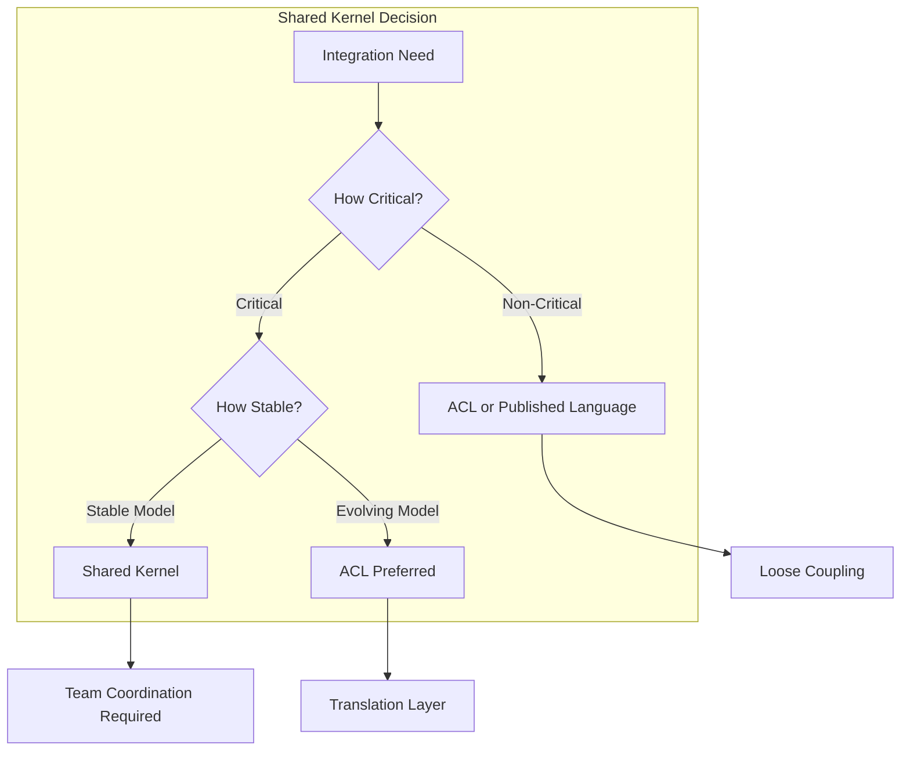
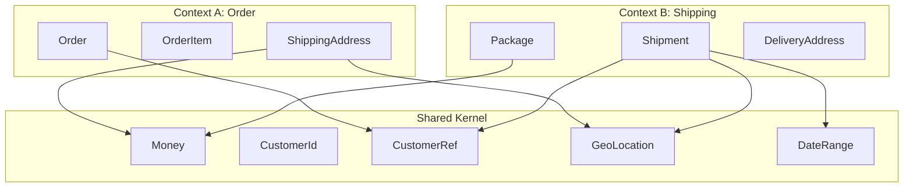
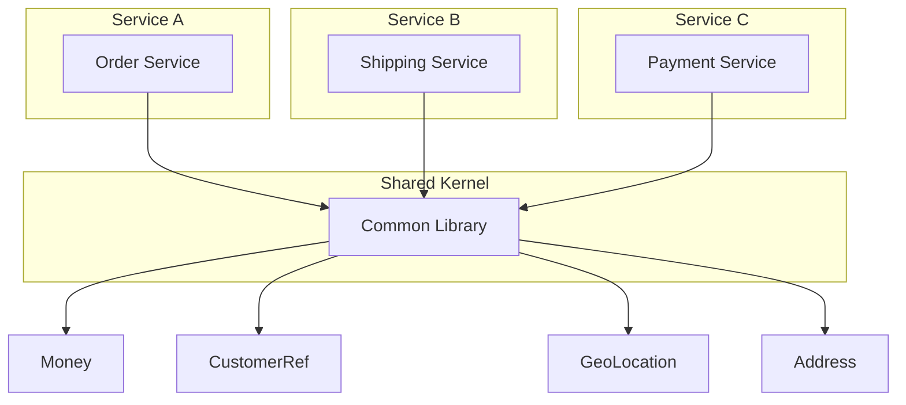

# Shared Kernel Pattern

## Overview

The Shared Kernel is a Domain-Driven Design pattern that defines a shared subset of the domain model that multiple bounded contexts use in common. Unlike complete isolation between contexts, or full integration through ACLs, the Shared Kernel represents a carefully selected piece of the domain that is developed and evolved jointly by teams responsible for the participating contexts. This shared code becomes a dependency that both teams must coordinate around.

The concept of a Shared Kernel emerges from the recognition that some domain concepts naturally span multiple bounded contexts. Customer information, for example, might be relevant to both the Order context and the Marketing context. Rather than maintaining separate copies of customer data or building complex translation layers, the teams might agree to share a core customer model.

In microservices architectures, the Shared Kernel pattern becomes a practical compromise between complete isolation and tight coupling. It reduces the translation overhead that Anti-Corruption Layers require while avoiding the chaos of unlimited shared models. The key is that the kernel is small, stable, and carefully managed.

Eric Evans introduced the Shared Kernel pattern in Domain-Driven Design as one of the fundamental context mapping relationships. In microservices, this pattern manifests as shared libraries, common data models, or shared service components that multiple microservices depend on. The pattern requires explicit coordination between teams but enables tighter integration where needed.

Understanding the Shared Kernel pattern requires examining what constitutes a good kernel, how to manage the kernel's evolution, what alternatives exist, and how real-world systems have applied this pattern. The pattern has significant implications for team organization, deployment coordination, and architectural flexibility.

## When to Use Shared Kernel

The Shared Kernel pattern is appropriate in specific situations where the benefits outweigh the coordination costs. Understanding when to use this pattern is crucial for successful implementation.



The Shared Kernel works well when multiple services need access to the same domain concepts with minimal translation, when those concepts are relatively stable and well-understood, when tight integration is required for performance or consistency, and when teams are willing to coordinate their development and deployment.

## Core Concepts

### Identifying Shared Elements

The elements that become part of the Shared Kernel must be carefully selected. Common candidates include basic value objects like money, addresses, and dates; identifier types that span contexts; fundamental entities like customer or product that multiple contexts reference; and enumeration types for status values and categories.



These shared elements should be small, stable, and widely used. They form the "lingua franca" that enables communication between contexts without extensive translation.

### Kernel Management

The Shared Kernel requires explicit management to remain valuable. Both teams must agree on the kernel's contents, change process, and evolution timeline. Changes to the kernel affect all consuming services and require coordination.

```java
// Example: Shared kernel package structure

package com.company.kernel;

// Money value object - used by multiple contexts
public final class Money implements Serializable {
    
    private final BigDecimal amount;
    private final Currency currency;
    
    private Money(BigDecimal amount, Currency currency) {
        this.amount = amount;
        this.currency = currency;
    }
    
    public static Money of(BigDecimal amount, Currency currency) {
        return new Money(amount.setScale(2, RoundingMode.HALF_UP), currency);
    }
    
    public static Money zero(Currency currency) {
        return new Money(BigDecimal.ZERO, currency);
    }
    
    public Money add(Money other) {
        requireSameCurrency(other);
        return new Money(this.amount.add(other.amount), this.currency);
    }
    
    public Money subtract(Money other) {
        requireSameCurrency(other);
        return new Money(this.amount.subtract(other.amount), this.currency);
    }
    
    public Money multiply(BigDecimal factor) {
        return new Money(this.amount.multiply(factor), this.currency);
    }
    
    private void requireSameCurrency(Money other) {
        if (!this.currency.equals(other.currency)) {
            throw new IllegalArgumentException(
                "Cannot operate on Money with different currencies");
        }
    }
    
    // equals, hashCode, toString
}

// Customer reference - shared identifier and basic reference
public final class CustomerRef implements Serializable {
    
    private final CustomerId id;
    private final String name;
    private final Email email;
    
    private CustomerRef(CustomerId id, String name, Email email) {
        this.id = id;
        this.name = name;
        this.email = email;
    }
    
    public static CustomerRef of(CustomerId id, String name, Email email) {
        return new CustomerRef(id, name, email);
    }
    
    public CustomerId getId() { return id; }
    public String getName() { return name; }
    public Email getEmail() { return email; }
}

// Geo location for addresses
public final class GeoLocation implements Serializable {
    
    private final double latitude;
    private final double longitude;
    
    public GeoLocation(double latitude, double longitude) {
        this.latitude = latitude;
        this.longitude = longitude;
    }
    
    public double getLatitude() { return latitude; }
    public double getLongitude() { return longitude; }
    
    public double distanceTo(GeoLocation other) {
        // Haversine formula implementation
    }
}

// Date range for various operations
public final class DateRange implements Serializable {
    
    private final Instant start;
    private final Instant end;
    
    public DateRange(Instant start, Instant end) {
        if (start.isAfter(end)) {
            throw new IllegalArgumentException("Start must be before end");
        }
        this.start = start;
        this.end = end;
    }
    
    public static DateRange between(Instant start, Instant end) {
        return new DateRange(start, end);
    }
    
    public boolean contains(Instant instant) {
        return !instant.isBefore(start) && !instant.isAfter(end);
    }
    
    public Duration getDuration() {
        return Duration.between(start, end);
    }
}
```

### Team Coordination

Shared Kernel requires coordination between teams. When one team changes the kernel, it potentially affects all consuming services. A lightweight governance process ensures changes are communicated and accommodated.

```java
// Example: Kernel evolution coordination

/**
 * Shared Kernel Change Process
 * 
 * 1. PROPOSAL: Team proposes change to kernel
 * 2. REVIEW: Other kernel consumers review impact
 * 3. AGREEMENT: Teams agree on timeline
 * 4. IMPLEMENTATION: Change made to kernel
 * 5. DEPLOYMENT: Kernel version updated
 * 6. CONSUMER UPDATE: Consuming services updated
 */

// Example: Change proposal

/**
 * PROPOSAL: Add preferredLocale to CustomerRef
 * 
 * REQUESTING TEAM: Order Management
 * CONSUMING TEAMS: Customer Service, Marketing Service
 * 
 * CHANGE:
 * - Add optional preferredLocale field to CustomerRef
 * - This enables localized communications based on customer preference
 * 
 * IMPACT:
 * - Low: New field is optional, backward compatible
 * - Order Management: Will use for confirmation emails
 * - Customer Service: Read-only, no changes needed
 * - Marketing Service: Will use for campaign localization
 * 
 * TIMELINE:
 * - Kernel release: 2024-01-15
 * - Consumer updates: By 2024-01-30
 */
```

## Shared Kernel Architecture



## Standard Implementation Example

The following example demonstrates how to implement a Shared Kernel in a multi-service architecture.

```java
// Step 1: Create shared kernel module

// Kernel module: com.company.kernel
// Build as separate artifact (jar)

// Address - used by Order, Shipping, and Payment contexts
package com.company.kernel;

import java.io.Serializable;

public final class Address implements Serializable {
    
    private final String street1;
    private final String street2;
    private final String city;
    private final String state;
    private final String postalCode;
    private final String country;
    private final GeoLocation location;
    
    private Address(String street1, String street2, String city,
            String state, String postalCode, String country, GeoLocation location) {
        this.street1 = street1;
        this.street2 = street2;
        this.city = city;
        this.state = state;
        this.postalCode = postalCode;
        this.country = country;
        this.location = location;
    }
    
    public static Address of(String street1, String street2, String city,
            String state, String postalCode, String country) {
        return new Address(street1, street2, city, state, postalCode, country, null);
    }
    
    public static Address withLocation(String street1, String street2, String city,
            String state, String postalCode, String country, GeoLocation location) {
        return new Address(street1, street2, city, state, postalCode, country, location);
    }
    
    public String getStreet1() { return street1; }
    public String getStreet2() { return street2; }
    public String getCity() { return city; }
    public String getState() { return state; }
    public String getPostalCode() { return postalCode; }
    public String getCountry() { return country; }
    public GeoLocation getLocation() { return location; }
    
    public String getFormattedAddress() {
        return String.format("%s %s, %s %s, %s",
            street1, street2, city, state, postalCode);
    }
}

// Customer ID - shared identifier type
package com.company.kernel;

import java.util.UUID;

public final class CustomerId implements Serializable {
    
    private final String value;
    
    private CustomerId(String value) {
        this.value = value;
    }
    
    public static CustomerId of(String value) {
        if (value == null || value.isBlank()) {
            throw new IllegalArgumentException("CustomerId cannot be null or blank");
        }
        return new CustomerId(value);
    }
    
    public static CustomerId generate() {
        return new CustomerId(UUID.randomUUID().toString());
    }
    
    public String getValue() { return value; }
    
    @Override
    public boolean equals(Object o) {
        if (this == o) return true;
        if (o == null || getClass() != o.getClass()) return false;
        CustomerId that = (CustomerId) o;
        return value.equals(that.value);
    }
    
    @Override
    public int hashCode() {
        return value.hashCode();
    }
    
    @Override
    public String toString() {
        return "CustomerId{" + value + "}";
    }
}

// Step 2: Use shared kernel in Order Service

package com.company.orders;

import com.company.kernel.*;

public class Order {
    
    private final OrderId id;
    private final CustomerId customerId;
    private final Address shippingAddress;
    private final List<OrderItem> items;
    private final Money total;
    
    // Uses kernel Address and Money
    public Order(OrderId id, CustomerId customerId, Address shippingAddress,
            List<OrderItem> items, Money total) {
        this.id = id;
        this.customerId = customerId;
        this.shippingAddress = shippingAddress;
        this.items = items;
        this.total = total;
    }
    
    public Address getShippingAddress() {
        return shippingAddress;
    }
    
    public Money getTotal() {
        return total;
    }
}

// Step 3: Use shared kernel in Shipping Service

package com.company.shipping;

import com.company.kernel.*;

public class Shipment {
    
    private final String shipmentId;
    private final CustomerId customerId;
    private final Address deliveryAddress;
    private final List<Package> packages;
    private final ShippingMethod method;
    
    // Uses kernel Address and CustomerId
    public Shipment(String shipmentId, CustomerId customerId, Address deliveryAddress,
            List<Package> packages, ShippingMethod method) {
        this.shipmentId = shipmentId;
        this.customerId = customerId;
        this.deliveryAddress = deliveryAddress;
        this.packages = packages;
        this.method = method;
    }
    
    public Address getDeliveryAddress() {
        return deliveryAddress;
    }
}

// Shipping calculation using kernel Money
public class ShippingCalculator {
    
    public Money calculateShippingCost(Address origin, Address destination,
            double weight, ShippingMethod method) {
        
        double distance = origin.getLocation().distanceTo(destination.getLocation());
        
        BigDecimal baseCost = BigDecimal.valueOf(5.00);
        BigDecimal distanceCost = BigDecimal.valueOf(distance * 0.01);
        BigDecimal weightCost = BigDecimal.valueOf(weight * 0.50);
        
        BigDecimal total = baseCost.add(distanceCost).add(weightCost)
            .multiply(BigDecimal.valueOf(method.getMultiplier()));
        
        return Money.of(total, Currency.USD);
    }
}

// Step 4: Use shared kernel in Payment Service

package com.company.payment;

import com.company.kernel.*;

public class Payment {
    
    private final String paymentId;
    private final CustomerId customerId;
    private final Money amount;
    private final PaymentMethod paymentMethod;
    private final PaymentStatus status;
    
    // Uses kernel Money and CustomerId
    public Payment(String paymentId, CustomerId customerId, Money amount,
            PaymentMethod paymentMethod, PaymentStatus status) {
        this.paymentId = paymentId;
        this.customerId = customerId;
        this.amount = amount;
        this.paymentMethod = paymentMethod;
        this.status = status;
    }
    
    public Money getAmount() {
        return amount;
    }
}
```

## Real-World Example 1: Financial Trading Platform

Financial trading platforms often have multiple services that need to share common financial models. The Shared Kernel pattern is valuable in this domain where precision and consistency are critical.

**Shared Elements**: In a trading platform, elements like Money, TradingPair, OrderType, and TimeInForce might be shared across Order Management, Execution, Risk Management, and Reporting services.

```java
// Financial Trading Platform Shared Kernel

package com.trading.kernel;

// Trading pair (e.g., BTC-USD)
public final class TradingPair implements Serializable {
    
    private final String baseCurrency;
    private final String quoteCurrency;
    
    public TradingPair(String baseCurrency, String quoteCurrency) {
        this.baseCurrency = baseCurrency;
        this.quoteCurrency = quoteCurrency;
    }
    
    public static TradingPair fromString(String pair) {
        String[] parts = pair.split("-");
        if (parts.length != 2) {
            throw new IllegalArgumentException("Invalid trading pair: " + pair);
        }
        return new TradingPair(parts[0], parts[1]);
    }
    
    public String getBaseCurrency() { return baseCurrency; }
    public String getQuoteCurrency() { return quoteCurrency; }
    public String toString() { return baseCurrency + "-" + quoteCurrency; }
}

// Price with precision for financial calculations
public final class Price implements Serializable {
    
    private final BigDecimal value;
    private final int decimalPlaces;
    
    public Price(BigDecimal value, int decimalPlaces) {
        this.value = value.setScale(decimalPlaces, RoundingMode.HALF_UP);
        this.decimalPlaces = decimalPlaces;
    }
    
    public static Price of(BigDecimal value, int decimalPlaces) {
        return new Price(value, decimalPlaces);
    }
    
    public BigDecimal getValue() { return value; }
    public int getDecimalPlaces() { return decimalPlaces; }
    
    public Money toMoney(Currency currency) {
        return Money.of(value, currency);
    }
}

// Order type enumeration
public enum OrderType {
    MARKET,
    LIMIT,
    STOP_LOSS,
    STOP_LIMIT,
    TRAILING_STOP
}

// Time in force
public enum TimeInForce {
    GTC,  // Good Till Cancel
    IOC,  // Immediate Or Cancel
    FOK,  // Fill Or Kill
    GTD   // Good Till Date
}

// Trading service using shared kernel

package com.trading.order;

import com.trading.kernel.*;

public class TradingOrder {
    
    private final OrderId id;
    private final TradingPair pair;
    private final OrderType type;
    private final Side side;  // BUY or SELL
    private final Price price;
    private final Quantity quantity;
    private final TimeInForce timeInForce;
    
    public TradingOrder(OrderId id, TradingPair pair, OrderType type, Side side,
            Price price, Quantity quantity, TimeInForce timeInForce) {
        this.id = id;
        this.pair = pair;
        this.type = type;
        this.side = side;
        this.price = price;
        this.quantity = quantity;
        this.timeInForce = timeInForce;
    }
    
    public Money calculateNotionalValue() {
        return Money.of(
            price.getValue().multiply(quantity.getValue()),
            Currency.getInstance(pair.getQuoteCurrency())
        );
    }
}

// Risk service using shared kernel

package com.trading.risk;

import com.trading.kernel.*;

public class RiskCalculator {
    
    public RiskMetrics calculateRisk(TradingOrder order, Portfolio portfolio) {
        Money notional = order.calculateNotionalValue();
        
        BigDecimal positionRatio = notional.getAmount()
            .divide(portfolio.getTotalValue().getAmount(), RoundingMode.HALF_UP);
        
        boolean exceedsLimit = positionRatio.compareTo(
            new BigDecimal("0.1")) > 0;  // 10% limit
        
        return RiskMetrics.builder()
            .orderId(order.getId())
            .notionalValue(notional)
            .positionRatio(positionRatio)
            .exceedsPositionLimit(exceedsLimit)
            .build();
    }
}
```

### Financial Platform Shared Kernel Benefits

In this financial example, the shared kernel ensures consistent handling of financial concepts across all services. Money, Price, and TradingPair have consistent behavior everywhere they're used. The kernel eliminates duplicate logic and ensures that financial calculations are consistent. Changes to these core types are carefully coordinated, ensuring all services stay in sync.

## Real-World Example 2: Healthcare Platform

Healthcare platforms frequently need to share patient, provider, and clinical concepts across multiple services. The Shared Kernel pattern helps maintain consistency in this highly regulated domain.

**Shared Elements**: Patient demographics, provider identifiers, clinical dates, and medication codes might all be part of a shared kernel across Patient Administration, Clinical, Pharmacy, and Billing services.

```java
// Healthcare Platform Shared Kernel

package com.healthcare.kernel;

// Patient identifier with type
public final class PatientIdentifier implements Serializable {
    
    private final String value;
    private final IdentifierType type;
    
    public enum IdentifierType {
        MRN,    // Medical Record Number
        SSN,    // Social Security Number
        INSURANCE,  // Insurance ID
        INTERNAL    // Internal system ID
    }
    
    public PatientIdentifier(String value, IdentifierType type) {
        this.value = value;
        this.type = type;
    }
    
    public String getValue() { return value; }
    public IdentifierType getType() { return type; }
}

// Provider identifier
public final class ProviderIdentifier implements Serializable {
    
    private final String value;
    private final String npi;  // National Provider Identifier
    
    public ProviderIdentifier(String value, String npi) {
        this.value = value;
        this.npi = npi;
    }
    
    public String getValue() { return value; }
    public String getNpi() { return npi; }
}

// Clinical code (ICD-10, SNOMED, etc.)
public final class ClinicalCode implements Serializable {
    
    private final String code;
    private final CodeSystem system;
    private final String description;
    
    public enum CodeSystem {
        ICD10,
        SNOMED_CT,
        LOINC,
        RXNORM,
        CPT
    }
    
    public ClinicalCode(String code, CodeSystem system, String description) {
        this.code = code;
        this.system = system;
        this.description = description;
    }
    
    public String getCode() { return code; }
    public CodeSystem getSystem() { return system; }
    public String getDescription() { return description; }
}

// Clinical date range for records
public final class ClinicalPeriod implements Serializable {
    
    private final Instant start;
    private final Instant end;
    private final boolean ongoing;
    
    public ClinicalPeriod(Instant start, Instant end, boolean ongoing) {
        if (!ongoing && end.isBefore(start)) {
            throw new IllegalArgumentException("End must be after start");
        }
        this.start = start;
        this.end = end;
        this.ongoing = ongoing;
    }
    
    public static ClinicalPeriod ongoing(Instant start) {
        return new ClinicalPeriod(start, null, true);
    }
    
    public static ClinicalPeriod between(Instant start, Instant end) {
        return new ClinicalPeriod(start, end, false);
    }
    
    public Instant getStart() { return start; }
    public Instant getEnd() { return end; }
    public boolean isOngoing() { return ongoing; }
}

// Patient Administration using kernel

package com.healthcare.patient;

import com.healthcare.kernel.*;

public class Patient {
    
    private final PatientId id;
    private final List<PatientIdentifier> identifiers;
    private final PersonDemographics demographics;
    private final List<Address> addresses;
    private final ContactInfo contactInfo;
    
    public Patient(PatientId id, List<PatientIdentifier> identifiers,
            PersonDemographics demographics, List<Address> addresses,
            ContactInfo contactInfo) {
        this.id = id;
        this.identifiers = identifiers;
        this.demographics = demographics;
        this.addresses = addresses;
        this.contactInfo = contactInfo;
    }
    
    public List<PatientIdentifier> getIdentifiers() {
        return identifiers;
    }
}

// Clinical using kernel

package com.healthcare.clinical;

import com.healthcare.kernel.*;

public class Diagnosis {
    
    private final String diagnosisId;
    private final ClinicalCode code;
    private final String description;
    private final ClinicalPeriod period;
    private final ProviderIdentifier diagnosingProvider;
    
    public Diagnosis(String diagnosisId, ClinicalCode code, String description,
            ClinicalPeriod period, ProviderIdentifier diagnosingProvider) {
        this.diagnosisId = diagnosisId;
        this.code = code;
        this.description = description;
        this.period = period;
        this.diagnosingProvider = diagnosingProvider;
    }
    
    public ClinicalCode getCode() {
        return code;
    }
}
```

### Healthcare Platform Shared Kernel Benefits

In healthcare, consistency in identifiers and codes is critical for patient safety. The shared kernel ensures that patient identifiers, provider identifiers, and clinical codes are handled consistently across all services. Regulatory requirements for data consistency are more easily met when everyone uses the same core types.

## Output Statement

The Shared Kernel pattern provides a balanced approach to cross-context integration in microservices architectures. By carefully selecting a small set of domain concepts to share, teams can reduce the translation overhead of Anti-Corruption Layers while maintaining the autonomy of separate bounded contexts. The kernel becomes a stable foundation that multiple services depend on, enabling consistent behavior across the system.

The output of implementing Shared Kernel includes a well-defined shared library containing common types, explicit team agreements about kernel governance and change process, and clear boundaries around what is and is not in the kernel. Organizations that implement this pattern successfully balance integration efficiency with coordination overhead, using the Shared Kernel for truly shared concepts while relying on ACLs for context-specific models.

---

## Best Practices

### Keep the Kernel Small

The Shared Kernel should be as small as possible while still providing value. Include only the concepts that are genuinely shared across multiple contexts. Avoid the temptation to put more in the kernel just because it's convenient.

```java
// Good: Minimal kernel
package com.company.kernel;

public final class Money { /* ... */ }
public final class Address { /* ... */ }
public final class CustomerId { /* ... */ }
public final class GeoLocation { /* ... */ }

// Not good: Bloated kernel
package com.company.kernel;

// Many of these are context-specific and shouldn't be shared
public final class Money { /* ... */ }
public final class Address { /* ... */ }
public final class Customer { /* ... */ }  // Too rich, belongs in Customer context
public final class Order { /* ... */ }      // Belongs in Order context
public final class Product { /* ... */ }   // Belongs in Product context
```

### Design for Stability

The kernel should contain the most stable, well-understood parts of the domain. Avoid including concepts that are still evolving or that have context-specific variations. If a concept changes frequently, keep it within individual contexts.

```java
// Good: Stable kernel concepts
public final class Money { /* ... */ }
public final class Address { /* ... */ }

// Avoid: Unstable, evolving concepts
public class CustomerPreferences { /* ... */ }  // Evolving frequently
public class ProductCategory { /* ... */ }       // Context-specific variations
```

### Version Carefully

Changes to the kernel require coordinated updates across all consuming services. Use semantic versioning and maintain backward compatibility when possible. Communicate changes well in advance of breaking changes.

```java
// Example: Kernel versioning strategy

/*
 * Kernel Versioning:
 * - Major version: Breaking changes, requires all consumers to update
 * - Minor version: Backward compatible new features
 * - Patch version: Bug fixes, backward compatible
 * 
 * Change Process:
 * 1. Propose change with impact assessment
 * 2. Review with consuming teams
 * 3. Agree on timeline for updates
 * 4. Release new kernel version
 * 5. Consuming teams update within agreed timeframe
 */
```

### Document Usage Guidelines

The kernel should come with clear documentation about how to use each type correctly. This prevents misuse and ensures consistent behavior across contexts.

```java
/**
 * Money value object usage guidelines:
 * 
 * - Always use Money for currency values, never plain BigDecimal
 * - Always specify Currency when creating Money
 * - Use Money.of() factory method, not constructor
 * - Never modify Money after creation (immutable)
 * - Use Money arithmetic methods (add, subtract, multiply)
 *   rather than BigDecimal operations directly
 * 
 * Example:
 *   Money price = Money.of(new BigDecimal("99.99"), Currency.USD);
 *   Money tax = price.multiply(new BigDecimal("0.08"));
 *   Money total = price.add(tax);
 */
```

### Have an Escape Hatch

Despite careful design, there may be times when a context needs a variation of a kernel type. Have a clear process for handling these cases, whether through extension, wrapping, or explicit exceptions to the shared model.

```java
// Example: Extension pattern for kernel types

// Kernel provides base type
package com.company.kernel;

public final class Address { /* ... */ }

// Context can extend for specific needs
package com.company.shipping;

import com.company.kernel.Address;

public class DeliveryAddress extends Address {
    
    private final DeliveryInstructions instructions;
    private final String gateCode;
    
    public DeliveryAddress(String street1, String street2, String city,
            String state, String postalCode, String country,
            DeliveryInstructions instructions, String gateCode) {
        super(street1, street2, city, state, postalCode, country);
        this.instructions = instructions;
        this.gateCode = gateCode;
    }
    
    public DeliveryInstructions getInstructions() { return instructions; }
    public String getGateCode() { return gateCode; }
}
```

### Coordinate Changes

Establish a lightweight governance process for kernel changes. This doesn't need to be heavyweight, but it should ensure all consuming teams are aware of changes and can plan for updates.

```java
// Example: Lightweight coordination process

/**
 * Shared Kernel Change Coordination:
 * 
 * 1. Change Proposal (via Slack channel #kernel-changes):
 *    - What is changing
 *    - Why it's needed
 *    - Impact on consumers
 *    - Proposed timeline
 * 
 * 2. Review Period (3 days):
 *    - Consuming teams review impact
 *    - Raise concerns or objections
 * 
 * 3. Decision:
 *    - If no objections: proceed
 *    - If concerns: discuss and resolve
 *    - If blocking: find alternative approach
 * 
 * 4. Communication:
 *    - Announce in #kernel-changes
 *    - Update kernel changelog
 *    - Tag release in repository
 */
```

## Related Patterns

- **Bounded Context**: The contexts that share the kernel
- **Anti-Corruption Layer**: Alternative to sharing when concepts differ
- **Published Language**: Formalized shared language for integration
- **Context Mapping**: Documenting relationships including Shared Kernel