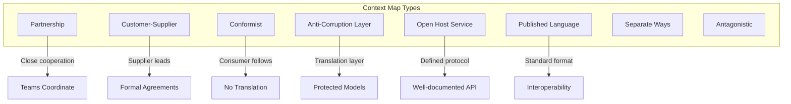
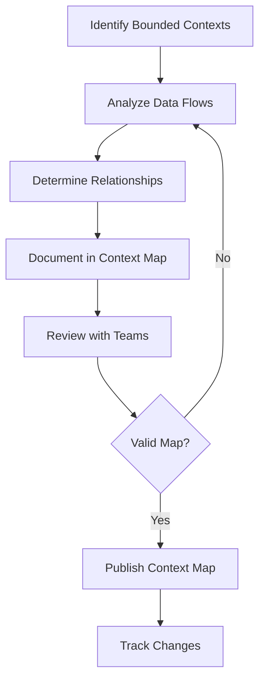

# Context Mapping Pattern

## Overview

Context Mapping is a Domain-Driven Design technique for understanding and documenting the relationships between bounded contexts in a microservice architecture. It provides a bird's-eye view of how different services interact, what their interfaces look like, where integration challenges exist, and how teams should coordinate their work. Without context mapping, microservices architectures can become tangled webs of dependencies that are difficult to understand, maintain, and evolve.

The need for context mapping emerges naturally as systems grow beyond a single bounded context. When multiple contexts exist, they must communicate in some way. This communication creates dependencies, and those dependencies form a map—a network of relationships that defines how the system works as a whole. Understanding this map is essential for making good architectural decisions.

Eric Evans formalized context mapping in Domain-Driven Design as one of the key strategic patterns. He identified several types of relationships between contexts: Partnership, Customer-Supplier, Conformist, Anti-Corruption Layer, Open Host Service, Published Language, and others. Each relationship type has different implications for how teams work together and how integration is implemented.

In microservices architectures, context mapping serves multiple purposes. It helps identify appropriate service boundaries during decomposition. It reveals integration complexity and helps prioritize refactoring. It guides team organization and identifies where coordination is needed. It documents architectural decisions for future reference.

Understanding context mapping requires examining the different relationship types, how to discover them, how to document them, and how real-world systems apply this pattern. Context mapping is not a one-time activity but an ongoing practice that evolves as the system changes.

## Types of Context Relationships

Understanding the different types of relationships between bounded contexts is fundamental to effective context mapping. Each relationship type has distinct characteristics, challenges, and appropriate integration patterns.



### Partnership

Partnership relationships exist between contexts whose teams must cooperate closely to ensure integration works well. This relationship is appropriate when two contexts are tightly integrated and changes in one frequently affect the other. Teams coordinate through shared milestones and frequent communication.

In a microservices architecture, partnership might exist between contexts that share significant data flows or that must coordinate to maintain consistency. The teams might hold regular synchronization meetings, share code repositories, or have integrated deployment pipelines.

```java
// Partnership example: Order and Fulfillment contexts

/**
 * Partnership: Order and Fulfillment teams work closely together
 * 
 * - Shared on-call rotation for integration issues
 * - Joint planning for new features
 * - Coordinated deployments (deploy together or have rollback procedures)
 * - Shared domain experts for order fulfillment semantics
 */

// Order context exposes API for Fulfillment
public interface OrderPort {
    
    // Fulfillment needs order details
    Order getOrder(String orderId);
    
    // Fulfillment updates order status
    void updateOrderStatus(String orderId, OrderStatus status);
    
    // Fulfillment gets items for picking
    List<OrderItem> getOrderItems(String orderId);
}

// Fulfillment context
@Service
public class FulfillmentService {
    
    private final OrderPort orderPort;
    
    public FulfillmentPlan createFulfillmentPlan(String orderId) {
        Order order = orderPort.getOrder(orderId);
        
        // Work closely with Order team on fulfillment logic
        // Order team helps interpret business rules
        List<OrderItem> items = orderPort.getOrderItems(orderId);
        
        return FulfillmentPlan.builder()
            .orderId(orderId)
            .items(items)
            .build();
    }
}
```

### Customer-Supplier

The Customer-Supplier relationship describes a relationship where one context (the Supplier) provides services to another (the Customer). The Supplier's priorities may differ from the Customer's, and the Customer depends on the Supplier's capabilities. This relationship requires explicit agreements about service levels and change processes.

In microservices, customer-supplier relationships are common. For example, the Payment context might be a supplier to the Order context. The Order team (customer) depends on Payment to process payments, but Payment has its own roadmap and priorities.

```java
// Customer-Supplier example: Order (Customer) and Payment (Supplier)

// Supplier (Payment) publishes its API spec
public interface PaymentServicePort {
    
    /**
     * PROCESS_PAYMENT - Customer-Supplier relationship
     * SLA: 99.9% availability
     * Max latency: 500ms for 95th percentile
     * Support: business-hours only
     */
    PaymentResult processPayment(PaymentRequest request);
    
    PaymentStatus getPaymentStatus(String paymentId);
    
    RefundResult refundPayment(String paymentId, BigDecimal amount);
}

// Customer (Order) uses the supplier's API
@Service
public class OrderPaymentService {
    
    private final PaymentServicePort paymentService;
    
    public void processPaymentForOrder(Order order) {
        PaymentRequest request = PaymentRequest.builder()
            .orderId(order.getId())
            .amount(order.getTotal())
            .paymentMethod(order.getPaymentMethod())
            .build();
        
        // Customer must work within supplier's capabilities
        PaymentResult result = paymentService.processPayment(request);
        
        if (result.isSuccessful()) {
            order.markAsPaid(result.getPaymentId());
        } else {
            throw new PaymentFailedException(result.getFailureReason());
        }
    }
}
```

### Conformist

A Conformist relationship exists when a consuming context adopts the model of the producing context without translation. This simplifies integration but means the consumer is bound to the producer's model and its changes. This is appropriate when the producing context's model is already well-suited to the consumer's needs.

```java
// Conformist example: Analytics consuming Order events

// Order context defines events
public record OrderPlacedEvent(
    String orderId,
    String customerId,
    List<OrderLineItem> items,
    BigDecimal total
) {}

// Analytics context conforms to Order's model
@Service
public class AnalyticsEventHandler {
    
    // Simply uses Order's event model directly
    // No translation or adaptation
    public void handleOrderPlaced(OrderPlacedEvent event) {
        AnalyticsRecord record = AnalyticsRecord.builder()
            .eventType("ORDER_PLACED")
            .customerId(event.customerId())
            .total(event.total())
            .itemCount(event.items().size())
            .timestamp(Instant.now())
            .build();
        
        analyticsRepository.save(record);
    }
}
```

### Anti-Corruption Layer

The Anti-Corruption Layer pattern, discussed in detail in its own section, represents a relationship where one context protects its model from being polluted by another. This is appropriate when the external model is poorly designed, significantly different, or changing in ways that would be disruptive to adopt.

### Open Host Service

An Open Host Service defines a protocol for other contexts to integrate. The protocol is well-documented, stable, and potentially used by multiple consumers. This is appropriate when a context needs to expose its capabilities to many other contexts in a controlled way.

```java
// Open Host Service example: Shipping carrier integration

/**
 * SHIPPING OPEN HOST SERVICE
 * 
 * Protocol version: 2.0
 * Base URL: /api/v2/shipping
 * Authentication: API key
 * Rate limit: 1000 requests/minute
 */

// Protocol definition
public interface ShippingServiceProtocol {
    
    /**
     * Calculate shipping rates
     * GET /rates?origin={}&destination={}&weight={}
     */
    List<ShippingRate> getRates(RateRequest request);
    
    /**
     * Create shipment
     * POST /shipments
     */
    ShipmentResponse createShipment(CreateShipmentRequest request);
    
    /**
     * Track shipment
     * GET /shipments/{trackingNumber}
     */
    TrackingInfo getTrackingInfo(String trackingNumber);
    
    /**
     * Cancel shipment
     * DELETE /shipments/{shipmentId}
     */
    CancelResult cancelShipment(String shipmentId);
}

// Multiple contexts use the protocol
@Service
public class OrderService {
    private final ShippingServiceProtocol shippingService;
    
    public void shipOrder(Order order) {
        CreateShipmentRequest request = CreateShipmentRequest.builder()
            .from(order.getWarehouseAddress())
            .to(order.getShippingAddress())
            .items(order.getItems())
            .build();
        
        ShipmentResponse response = shippingService.createShipment(request);
        order.setTrackingNumber(response.getTrackingNumber());
    }
}
```

## Context Mapping Flow



## Standard Implementation Example

The following example demonstrates how to create a context map for an e-commerce system.

```java
// Context Map documentation for E-Commerce System

/**
 * E-COMMERCE CONTEXT MAP
 * 
 * Bounded Contexts:
 * 1. Customer Management
 * 2. Product Catalog
 * 3. Order Management
 * 4. Inventory
 * 5. Payment
 * 6. Shipping
 * 7. Notification
 * 8. Analytics
 * 
 * Relationships:
 */

// Relationship 1: Order Management -> Customer Management
// Type: Customer-Supplier
// Supplier: Customer Management (provides customer data)
// Customer: Order Management (needs customer data for orders)

/**
 * CUSTOMER - ORDER RELATIONSHIP
 * 
 * Direction: Order consumes Customer
 * Type: Customer-Supplier
 * Integration: API calls with Customer Service
 * Protocol: REST/JSON
 * SLA: 99.9% availability, <200ms latency
 * 
 * Customer Service provides:
 * - Customer lookup by ID
 * - Customer address for shipping
 * - Customer validation
 */
public interface CustomerServiceClient {
    
    @GetMapping("/customers/{id}")
    CustomerDto getCustomer(@PathVariable("id") String id);
    
    @GetMapping("/customers/{id}/addresses")
    List<AddressDto> getCustomerAddresses(@PathVariable("id") String id);
}

// Relationship 2: Order Management -> Inventory
// Type: Customer-Supplier (synchronous) + Event-driven (async)
// Supplier: Inventory (reserves stock)
// Customer: Order Management (needs availability)

/**
 * ORDER - INVENTORY RELATIONSHIP
 * 
 * Direction: Order consumes Inventory
 * Type: Customer-Supplier (check), Event-driven (update)
 * 
 * Synchronous (check availability):
 * - Order checks stock before accepting order
 * - API: GET /inventory/availability?sku=X&qty=Y
 * 
 * Asynchronous (update state):
 * - Inventory publishes: InventoryReserved, InventoryReleased
 * - Order subscribes to update order state
 */
public interface InventoryServiceClient {
    
    @GetMapping("/inventory/availability")
    AvailabilityResult checkAvailability(
        @RequestParam("sku") String sku,
        @RequestParam("quantity") int quantity
    );
}

@Component
public class InventoryEventHandler {
    
    @EventListener
    public void handleInventoryReserved(InventoryReservedEvent event) {
        orderService.updateInventoryStatus(event.getOrderId(), RESERVED);
    }
}

// Relationship 3: Order -> Payment
// Type: Customer-Supplier

/**
 * ORDER - PAYMENT RELATIONSHIP
 * 
 * Direction: Order consumes Payment
 * Type: Customer-Supplier
 * Integration: Synchronous API calls
 * Protocol: REST/JSON
 * 
 * Payment Service provides:
 * - Payment processing (credit card, debit card)
 * - Payment status查询
 * - Refund processing
 */

// Relationship 4: Order -> Shipping
// Type: Customer-Supplier

/**
 * ORDER - SHIPPING RELATIONSHIP
 * 
 * Direction: Order consumes Shipping
 * Type: Customer-Supplier
 * Integration: Synchronous + Event-driven
 * 
 * Synchronous: Get shipping rates, create shipments
 * Event-driven: Shipping publishes ShipmentCreated, ShipmentDelivered
 */
public interface ShippingServiceClient {
    
    @PostMapping("/shipping/rates")
    List<ShippingRate> getRates(@RequestBody RateRequest request);
    
    @PostMapping("/shipping/shipments")
    ShipmentResponse createShipment(@RequestBody ShipmentRequest request);
}

// Relationship 5: Order -> Notification
// Type: Open Host Service (Notification is a shared service)

/**
 * ORDER - NOTIFICATION RELATIONSHIP
 * 
 * Direction: Multiple contexts use Notification
 * Type: Open Host Service
 * 
 * Notification Service exposes:
 * - Send email
 * - Send SMS
 * - Send push notification
 * 
 * Protocol: Event-based (publish to queue) or direct API
 */

// Relationship 6: Order -> Analytics
// Type: Conformist (Analytics conforms to Order's events)

/**
 * ORDER - ANALYTICS RELATIONSHIP
 * 
 * Direction: Analytics consumes Order events
 * Type: Conformist
 * 
 * Analytics uses Order's event model directly:
 * - OrderPlacedEvent
 * - OrderShippedEvent
 * - OrderDeliveredEvent
 * - OrderCancelledEvent
 */
```

```java
// Context Map visual representation

public class ContextMapDocumentation {
    
    public static void main(String[] args) {
        // Print context map
        System.out.println("=== E-COMMERCE CONTEXT MAP ===\n");
        
        contexts().forEach(ctx -> {
            System.out.println("Context: " + ctx.name());
            System.out.println("  Type: " + ctx.type());
            System.out.println("  Team: " + ctx.team());
            System.out.println("  Technologies: " + ctx.technologies());
            System.out.println();
        });
        
        relationships().forEach(rel -> {
            System.out.println("Relationship: " + rel.name());
            System.out.println("  From: " + rel.from());
            System.out.println("  To: " + rel.to());
            System.out.println("  Type: " + rel.type());
            System.out.println("  Integration: " + rel.integration());
            System.out.println();
        });
    }
    
    static List<BoundedContext> contexts() {
        return List.of(
            new BoundedContext("Customer Management", "CORE", "Customer Team", "PostgreSQL, Spring Boot"),
            new BoundedContext("Product Catalog", "CORE", "Product Team", "MongoDB, Spring Boot"),
            new BoundedContext("Order Management", "CORE", "Order Team", "PostgreSQL, Spring Boot"),
            new BoundedContext("Inventory", "CORE", "Inventory Team", "PostgreSQL, Redis"),
            new BoundedContext("Payment", "CORE", "Payment Team", "PostgreSQL, Java"),
            new BoundedContext("Shipping", "GENERIC", "Logistics Team", "Go, MySQL"),
            new BoundedContext("Notification", "SUPPORT", "Platform Team", "Node.js, Kafka"),
            new BoundedContext("Analytics", "SUPPORT", "Data Team", "Kafka, ClickHouse")
        );
    }
    
    static List<ContextRelationship> relationships() {
        return List.of(
            new ContextRelationship("Order-Customer", "Order Management", "Customer Management", "CUSTOMER_SUPPLIER", "API calls"),
            new ContextRelationship("Order-Inventory", "Order Management", "Inventory", "CUSTOMER_SUPPLIER", "API + Events"),
            new ContextRelationship("Order-Payment", "Order Management", "Payment", "CUSTOMER_SUPPLIER", "API calls"),
            new ContextRelationship("Order-Shipping", "Order Management", "Shipping", "CUSTOMER_SUPPLIER", "API + Events"),
            new ContextRelationship("Order-Notification", "Order Management", "Notification", "OPEN_HOST_SERVICE", "Event publishing"),
            new ContextRelationship("Order-Analytics", "Analytics", "Order Management", "CONFORMIST", "Event consuming")
        );
    }
}
```

## Real-World Example 1: Insurance Policy Management

Insurance systems typically involve multiple bounded contexts with complex relationships. A policy management system might have contexts for Underwriting, Claims, Billing, Customer, and Reporting.

```java
// Insurance Context Map

/**
 * INSURANCE POLICY SYSTEM CONTEXT MAP
 * 
 * Bounded Contexts:
 * 1. Underwriting - Evaluate and issue policies
 * 2. Claims - Process insurance claims
 * 3. Billing - Manage premium payments
 * 4. Customer - Customer data management
 * 5. Agent Management - Agent data and commissions
 * 6. Reporting - Business intelligence
 */

// Underwriting -> Customer
// Type: Customer-Supplier
// Underwriting needs customer data to evaluate applications
public interface CustomerPolicyService {
    
    @GetMapping("/customers/{id}/policies")
    List<PolicySummary> getCustomerPolicies(@PathVariable("id") String customerId);
}

// Underwriting -> Agent Management
// Type: Customer-Supplier
// Need agent information for commission calculation
public interface AgentService {
    
    @GetMapping("/agents/{id}")
    AgentDto getAgent(@PathVariable("id") String agentId);
}

// Claims -> Underwriting
// Type: Customer-Supplier
// Claims needs policy details from Underwriting
public interface PolicyServicePort {
    
    @GetMapping("/policies/{policyId}")
    PolicyDetails getPolicy(@PathVariable("policyId") String policyId);
    
    @GetMapping("/policies/{policyId}/coverage")
    List<Coverage> getPolicyCoverage(@PathVariable("policyId") String policyId);
}

// Billing -> Underwriting
// Type: Customer-Supplier
// Billing needs policy information for premium calculation
public interface PolicyBillingService {
    
    @GetMapping("/policies/{policyId}/premium")
    PremiumInfo getPremium(@PathVariable("policyId") String policyId);
    
    @PostMapping("/policies/{policyId}/premium/update")
    void updatePremium(@PathVariable("policyId") String policyId, PremiumUpdate update);
}

// Claims -> Billing
// Type: Customer-Supplier
// Claims needs to process claim payments via Billing
public interface BillingClaimService {
    
    @PostMapping("/claims/payments")
    PaymentResult processClaimPayment(ClaimPaymentRequest request);
}

// Reporting consumes events from all contexts
// Type: Conformist
// Reporting conforms to each context's event model
@Component
public class ReportingEventHandler {
    
    @EventListener
    public void handlePolicyIssued(PolicyIssuedEvent event) {
        // Report policy issuance
    }
    
    @EventListener
    public void handleClaimSubmitted(ClaimSubmittedEvent event) {
        // Report claim submission
    }
    
    @EventListener
    public void handlePremiumPaid(PremiumPaidEvent event) {
        // Report payment
    }
}
```

### Insurance Context Map Analysis

In this insurance example, Underwriting is a core context that serves multiple other contexts (Claims, Billing). Claims and Billing both depend on Underwriting's policy data. The Customer context is consumed by multiple contexts. The Reporting context takes a conformist approach, consuming events from all other contexts.

## Real-World Example 2: Real Estate Platform

Real estate platforms involve complex interactions between property listings, search, scheduling, transactions, and communications.

```java
// Real Estate Context Map

/**
 * REAL ESTATE PLATFORM CONTEXT MAP
 * 
 * Bounded Contexts:
 * 1. Listings - Property listings management
 * 2. Search - Property search and recommendations
 * 3. Scheduling - Tour scheduling
 * 4. Transactions - Offer management and closings
 * 5. Communication - Messaging and notifications
 * 6. Agent - Agent management
 * 7. Analytics - Platform analytics
 */

// Search -> Listings
// Type: Conformist
// Search conforms to Listings' model for index consistency
public class SearchIndexHandler {
    
    @EventListener
    public void handleListingCreated(ListingCreatedEvent event) {
        // Index directly using Listings event structure
        searchIndex.indexListing(event.getListing());
    }
}

// Scheduling -> Listings
// Type: Customer-Supplier
// Scheduling needs listing details for tour scheduling
public interface ListingScheduleService {
    
    @GetMapping("/listings/{id}/availability")
    List<TimeSlot> getAvailability(
        @PathVariable("id") String listingId,
        @RequestParam("start") Instant start,
        @RequestParam("end") Instant end
    );
}

// Scheduling -> Agent
// Type: Customer-Supplier
// Need agent availability
public interface AgentScheduleService {
    
    @GetMapping("/agents/{id}/availability")
    List<TimeSlot> getAgentAvailability(
        @PathVariable("id") String agentId,
        @RequestParam("date") LocalDate date
    );
}

// Transaction -> Listings
// Type: Anti-Corruption Layer
// Transaction has different model for offers
@Component
public class ListingAclAdapter implements ListingPort {
    
    public ListingReference getListingForTransaction(String listingId) {
        ListingDto listing = listingClient.getListing(listingId);
        
        // Transform Listings model to Transaction model
        return ListingReference.builder()
            .listingId(listing.getId())
            .address(listing.getAddress())
            .price(transformPrice(listing.getPrice()))
            .listingType(transformType(listing.getListingType()))
            .build();
    }
}

// Transaction -> Agent
// Type: Customer-Supplier
// Transaction needs agent for offer communication
public interface AgentTransactionService {
    
    @GetMapping("/agents/{id}/transactions")
    List<TransactionSummary> getAgentTransactions(@PathVariable("id") String agentId);
}

// Communication -> All contexts
// Type: Open Host Service
// Communication provides messaging to all other contexts
public interface NotificationPort {
    
    void sendEmail(EmailNotification notification);
    void sendSms(SmsNotification notification);
    void sendPush(PushNotification notification);
}

// Analytics -> All contexts
// Type: Conformist
// Analytics consumes events from all contexts
```

## Output Statement

Context Mapping provides the essential documentation and understanding needed to effectively manage a microservices architecture. By explicitly identifying bounded contexts and their relationships, teams gain clarity about integration patterns, dependencies, and coordination requirements. The context map becomes a living document that guides architectural decisions and helps new team members understand the system.

The output of context mapping includes a visual or written representation of all bounded contexts and their relationships, identification of integration patterns (Customer-Supplier, Conformist, ACL, etc.), clarity on team ownership and coordination requirements, and documentation of API contracts and protocols. Organizations that implement this pattern successfully can make informed decisions about where to invest in integration infrastructure, where to refactor boundaries, and how to organize teams.

---

## Best Practices

### Create a Living Document

Context maps should be versioned and updated as the system evolves. Store the context map in a version-controlled location accessible to all teams. Review and update it during architectural discussions and when significant changes occur.

```java
// Example: Context map stored as code

/**
 * context-map.yaml
 * 
 * # E-Commerce Context Map
 * # Last Updated: 2024-01-15
 * # Review Frequency: Monthly
 * 
 * contexts:
 *   - name: Customer Management
 *     type: CORE
 *     team: Customer Team
 *     technology: PostgreSQL, Spring Boot
 *     
 *   - name: Order Management
 *     type: CORE
 *     team: Order Team
 *     technology: PostgreSQL, Spring Boot
 * 
 * relationships:
 *   - from: Order Management
 *     to: Customer Management
 *     type: CUSTOMER_SUPPLIER
 *     integration: REST API
 *     
 *   - from: Order Management
 *     to: Inventory
 *     type: CUSTOMER_SUPPLIER
 *     integration: REST API + Events
 */
```

### Use the Map for Decision-Making

The context map should inform architectural decisions. Before creating a new integration, check how it fits with existing relationships. Consider whether existing relationships need to change when adding new contexts.

```java
// Example: Using context map for new feature

/**
 * New Feature: Loyalty Points
 * 
 * Questions to answer using context map:
 * 
 * 1. Which existing contexts does this relate to?
 *    - Customer Management (existing points)
 *    - Order Management (earning points)
 *    - Notification (rewards notifications)
 * 
 * 2. What type of relationship should exist?
 *    - Order -> Customer: Customer-Supplier (existing)
 *    - Notification -> Loyalty: Open Host Service (new)
 * 
 * 3. Should we create a new context?
 *    - Yes, Loyalty context for points management
 *    - Aligns with Single Responsibility
 */
```

### Identify Integration Complexity

Use the context map to identify areas of high integration complexity. These areas may be candidates for refactoring or additional investment in integration infrastructure.

```java
// Example: Complexity analysis

/**
 * Integration Complexity Analysis:
 * 
 * HIGH COMPLEXITY:
 * - Order Management (5 inbound, 4 outbound relationships)
 *   -> Consider: More resources for this context
 *   -> Consider: Simplify by combining some relationships
 * 
 * MEDIUM COMPLEXITY:
 * - Payment (2 inbound, 2 outbound)
 *   -> Manageable with current approach
 * 
 * LOW COMPLEXITY:
 * - Analytics (only consuming events)
 *   -> Simple conformist relationship works well
 */
```

### Match Relationships to Team Structures

Context relationships should inform team structures. Partnership relationships require close team coordination, which is easier when teams are co-located or have regular sync meetings. Customer-Supplier relationships can work with more distributed teams but require clear service level agreements.

```java
// Example: Team organization based on context map

/**
 * Team Structure Aligned with Context Map:
 * 
 * Customer Team: Owns Customer Management context
 *   - Coordinates with Order Team (Customer-Supplier)
 *   - Weekly sync meetings for API changes
 * 
 * Order Team: Owns Order Management context
 *   - Has 5 integration points
 *   - Needs more resources for coordination
 *   - Has dedicated integration engineer
 * 
 * Platform Team: Owns Notification context
 *   - Provides Open Host Service
 *   - Documents API changes 2 weeks in advance
 *   - Maintains uptime SLAs
 */
```

### Document the Exceptions

Every context map has exceptions—situations where the standard relationship type doesn't quite fit. Document these exceptions explicitly, as they often represent the most interesting and challenging parts of the architecture.

```java
// Example: Documenting exceptions

/**
 * Context Map Exceptions:
 * 
 * 1. Order -> Payment (Customer-Supplier, with exception)
 *    Exception: Payment has special priority for Order's checkout flow
 *    Solution: Dedicated channel for checkout payment processing
 *    Review: Quarterly to assess if still needed
 * 
 * 2. Analytics -> Order (Conformist, with exception)
 *    Exception: Analytics needs real-time data, not just events
 *    Solution: Analytics has direct read replica of Order database
 *    Risk: Tight coupling, must coordinate schema changes
 *    Mitigation: Schema change process includes analytics review
 */
```

### Make It Visible

The context map should be visible to everyone involved in the system. Post it in team spaces, include it in onboarding materials, and reference it in architecture discussions. A map that lives only in documentation is rarely used.

## Related Patterns

- **Bounded Context**: The nodes in the context map
- **Anti-Corruption Layer**: One relationship type in context mapping
- **Open Host Service**: Another relationship type
- **Partnership**: Relationship type for close cooperation
- **Customer-Supplier**: Relationship type for provider/consumer relationships