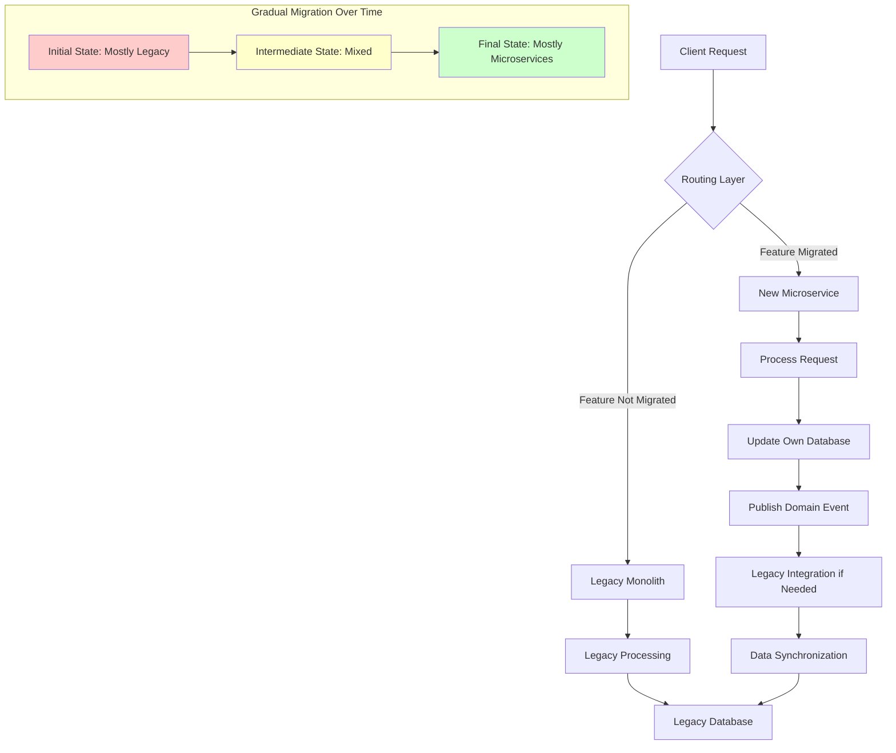

# Strangler Fig Pattern

## Overview

The Strangler Fig Pattern is a migration strategy that enables the gradual replacement of a legacy monolith application with microservices without requiring a complete system rewrite or downtime. Named after the strangler fig tree—a species that begins as a seed deposited on another tree, grows roots that wrap around the host tree, and eventually replaces it—the pattern provides a safe, incremental approach to modernizing complex systems. This pattern has become one of the most important strategies in the microservices toolbox because it addresses one of the biggest challenges organizations face: how to evolve from a monolithic architecture to microservices without disrupting ongoing business operations.

The fundamental principle behind the Strangler Fig Pattern is that new functionality is built as microservices while the legacy system continues to operate. Over time, more and more functionality migrates to the new microservices, and the legacy system gradually shrinks until it can be completely decommissioned. This approach provides numerous advantages over other migration strategies: it allows for incremental validation of the new architecture, minimizes risk by maintaining a working system throughout the transition, and enables the business to continue operating without interruption.

The pattern requires careful implementation of several key components: a facade or routing layer that can route requests to either the legacy system or the new microservices based on which functionality has been migrated, clear boundaries around the microservices being created, and mechanisms for sharing data between the old and new systems during the transition period. The routing layer acts as the "trunk" of the strangler fig, gradually taking over more of the system's responsibilities as the new services mature.

Understanding when to apply the Strangler Fig Pattern is crucial for successful migration. This pattern is most appropriate when the legacy system is large and complex, when the business cannot tolerate downtime for a complete rewrite, when there is an active development team maintaining the legacy system, when the system serves critical business functions that cannot be paused, and when the migration is expected to take months or years rather than weeks. Organizations that have successfully applied this pattern include those migrating from mainframe systems, replacing custom ERP implementations, and modernizing e-commerce platforms.

## Flow Chart



This flow chart illustrates how the Strangler Fig Pattern operates at runtime. The routing layer examines each incoming request and determines whether the requested functionality has been migrated to a microservice. If it has, the request is routed to the new microservice; if not, it's forwarded to the legacy monolith. Over time, as more functionality migrates, the routing layer routes more requests to microservices, and the legacy system handles fewer and fewer requests.

The data synchronization component is critical during the transition period. When a microservice handles a request, it may need to update both its own database and synchronize relevant data with the legacy database. This ensures consistency across the system and allows a clean cutover when the migration is complete. The three states shown at the bottom—initial, intermediate, and final—represent the evolution of the system over the course of the migration project.

## Standard Example

A standard implementation of the Strangler Fig Pattern involves creating a routing facade, extracting individual services one at a time, and establishing data synchronization mechanisms. The following example demonstrates how to implement this pattern in a Java Spring application:

```java
// Routing Facade - The "Strangler" facade that routes requests

package com.example.legacy;

import org.springframework.stereotype.Component;
import org.springframework.web.servlet.HandlerInterceptor;
import javax.servlet.http.HttpServletRequest;
import javax.servlet.http.HttpServletResponse;
import java.util.Map;
import java.util.Set;

@Component
public class StranglerRoutingInterceptor implements HandlerInterceptor {
    
    private final MigrationRouter router;
    private final LegacyAdapter legacyAdapter;
    private final MetricsCollector metrics;
    
    public StranglerRoutingInterceptor(
            MigrationRouter router,
            LegacyAdapter legacyAdapter,
            MetricsCollector metrics) {
        this.router = router;
        this.legacyAdapter = legacyAdapter;
        this.metrics = metrics;
    }
    
    @Override
    public boolean preHandle(
            HttpServletRequest request, 
            HttpServletResponse response, 
            Object handler) throws Exception {
        
        String path = request.getRequestURI();
        String method = request.getMethod();
        String routeKey = router.buildRouteKey(method, path);
        
        long startTime = System.currentTimeMillis();
        request.setAttribute("startTime", startTime);
        request.setAttribute("routeKey", routeKey);
        
        if (router.isMigrated(routeKey)) {
            // Route to new microservice via service mesh or direct call
            metrics.increment("requests.microservice", routeKey);
            return true; // Continue to annotated controller
        } else {
            // Route to legacy system
            metrics.increment("requests.legacy", routeKey);
            legacyAdapter.forwardToLegacy(request, response);
            return false; // Stop chain, request handled by legacy
        }
    }
    
    @Override
    public void afterCompletion(
            HttpServletRequest request,
            HttpServletResponse response,
            Object handler,
            Exception ex) throws Exception {
        
        long startTime = (Long) request.getAttribute("startTime");
        String routeKey = (String) request.getAttribute("routeKey");
        long duration = System.currentTimeMillis() - startTime;
        
        metrics.record("request.duration", routeKey, duration);
        
        if (response.getStatus() >= 400) {
            metrics.increment("request.errors", routeKey);
        }
    }
}

// Migration Router - Determines where to route requests

package com.example.legacy;

import org.springframework.stereotype.Component;
import java.util.Map;
import java.util.concurrent.ConcurrentHashMap;

@Component
public class MigrationRouter {
    
    private final Map<String, RouteDestination> routeTable = new ConcurrentHashMap<>();
    private final FeatureFlagService featureFlags;
    
    public MigrationRouter(FeatureFlagService featureFlags) {
        this.featureFlags = featureFlags;
        initializeRouteTable();
    }
    
    private void initializeRouteTable() {
        // Initialize with current migration state
        routeTable.put("GET:/api/products", RouteDestination.MICROSERVICE);
        routeTable.put("POST:/api/products", RouteDestination.MICROSERVICE);
        routeTable.put("GET:/api/orders", RouteDestination.MICROSERVICE);
        routeTable.put("POST:/api/orders", RouteDestination.LEGACY);
        routeTable.put("GET:/api/customers", RouteDestination.LEGACY);
        routeTable.put("PUT:/api/inventory", RouteDestination.LEGACY);
    }
    
    public String buildRouteKey(String method, String path) {
        return method + ":" + path;
    }
    
    public boolean isMigrated(String routeKey) {
        // Check feature flag first for canary testing
        if (featureFlags.isEnabled("microservice." + routeKey)) {
            return featureFlags.getVariant("microservice." + routeKey);
        }
        
        RouteDestination destination = routeTable.get(routeKey);
        return destination == RouteDestination.MICROSERVICE;
    }
    
    public void updateRoute(String routeKey, RouteDestination destination) {
        routeTable.put(routeKey, destination);
    }
    
    public enum RouteDestination {
        MICROSERVICE, LEGACY
    }
}

// Legacy Adapter - Forwards requests to legacy system during transition

package com.example.legacy;

import org.springframework.stereotype.Component;
import javax.servlet.http.*;
import java.io.IOException;

@Component
public class LegacyAdapter {
    
    private final String legacyBaseUrl;
    private final RestTemplate restTemplate;
    
    public LegacyAdapter(
            @Value("${legacy.system.url}") String legacyBaseUrl,
            RestTemplate restTemplate) {
        this.legacyBaseUrl = legacyBaseUrl;
        this.restTemplate = restTemplate;
    }
    
    public void forwardToLegacy(HttpServletRequest request, HttpServletResponse response) 
            throws IOException {
        
        String path = request.getRequestURI();
        String queryString = request.getQueryString();
        String targetUrl = legacyBaseUrl + path + (queryString != null ? "?" + queryString : "");
        
        try {
            HttpHeaders headers = new HttpHeaders();
            request.getHeaderNames().asIterator()
                .forEachRemaining(name -> 
                    headers.add(name, request.getHeader(name)));
            
            HttpMethod method = HttpMethod.valueOf(request.getMethod());
            
            if (method == HttpMethod.GET || method == HttpMethod.HEAD) {
                ResponseEntity<byte[]> entity = restTemplate.exchange(
                    targetUrl,
                    method,
                    new HttpEntity<>(headers),
                    byte[].class
                );
                
                response.setStatus(entity.getStatusCode().value());
                entity.getHeaders().forEach((name, values) ->
                    values.forEach(value -> response.addHeader(name, value)));
                
                if (entity.getBody() != null) {
                    response.getOutputStream().write(entity.getBody());
                }
            } else {
                // For POST, PUT, DELETE, need to handle request body
                String body = request.getReader().lines()
                    .collect(Collectors.joining("\n"));
                
                HttpEntity<String> httpEntity = new HttpEntity<>(body, headers);
                ResponseEntity<String> entity = restTemplate.exchange(
                    targetUrl,
                    method,
                    httpEntity,
                    String.class
                );
                
                response.setStatus(entity.getStatusCode().value());
                response.setContentType(entity.getHeaders().getContentType() != null 
                    ? entity.getHeaders().getContentType().toString() 
                    : "application/json");
                response.getWriter().write(entity.getBody());
            }
        } catch (HttpClientErrorException e) {
            response.setStatus(e.getStatusCode().value());
            response.getWriter().write(e.getResponseBodyAsString());
        }
    }
}

// Data Synchronization Service - Keeps legacy and new databases in sync

package com.example.legacy;

import org.springframework.stereotype.Service;
import org.springframework.transaction.annotation.Transactional;
import java.time.Instant;

@Service
public class DataSynchronizationService {
    
    private final ProductRepository productRepository;
    private final LegacyProductRepository legacyProductRepository;
    private final EventPublisher eventPublisher;
    
    public DataSynchronizationService(
            ProductRepository productRepository,
            LegacyProductRepository legacyProductRepository,
            EventPublisher eventPublisher) {
        this.productRepository = productRepository;
        this.legacyProductRepository = legacyProductRepository;
        this.eventPublisher = eventPublisher;
    }
    
    @Transactional
    public Product saveProduct(Product product) {
        // Save to new microservice database
        Product saved = productRepository.save(product);
        
        // Publish event for legacy synchronization
        eventPublisher.publish("product.created", Map.of(
            "productId", saved.getId(),
            "name", saved.getName(),
            "price", saved.getPrice().toString(),
            "timestamp", Instant.now().toString()
        ));
        
        return saved;
    }
    
    // Handle events from other services that need legacy synchronization
    public void syncFromEvent(ProductEvent event) {
        switch (event.getType()) {
            case "product.updated":
                legacyProductRepository.updateProduct(
                    event.getProductId(),
                    event.getName(),
                    event.getPrice()
                );
                break;
            case "product.deleted":
                legacyProductRepository.deleteProduct(event.getProductId());
                break;
        }
    }
}
```

This standard example demonstrates the key components of the Strangler Fig Pattern. The routing interceptor acts as the facade, determining at runtime whether to route to a new microservice or the legacy system. The migration router maintains the routing table, which can be updated as features are migrated. The legacy adapter provides backward compatibility during the transition. The data synchronization service ensures that both the new and legacy databases stay consistent during the migration.

## Real-World Example 1: Walmart's Legacy E-Commerce Migration

Walmart provides an excellent real-world example of the Strangler Fig Pattern in action. The retail giant had a massive legacy e-commerce platform built on traditional architecture that struggled to handle the scale of online shopping, especially during peak periods like Black Friday. The company embarked on a multi-year migration to microservices using the strangler approach.

The migration strategy began with identifying the highest-value, lowest-risk components to extract first. Product catalog functionality was chosen as the initial candidate because it was relatively isolated, had clear boundaries, and provided significant performance improvements when modernized. A routing layer was implemented that would check if a request was for product information; if so, it would route to the new product microservice; otherwise, it would pass through to the legacy system.

Over the next several years, Walmart incrementally extracted additional components: customer profiles, shopping cart, inventory management, and payment processing. Each extraction followed the same pattern—implement the new microservice, configure the routing layer to direct traffic to it, run in parallel with the legacy system to validate correctness, and eventually remove the legacy implementation. The company reported that this approach reduced risk significantly compared to a "big bang" migration and allowed them to realize benefits incrementally rather than waiting for the entire migration to complete.

The data synchronization challenge was particularly complex for Walmart given the scale of their operations. They implemented event sourcing and change data capture mechanisms to ensure that both the new microservices and the legacy system had consistent views of critical data like inventory levels and order status. This allowed the two systems to coexist without data inconsistencies that could lead to overselling or customer confusion.

## Real-World Example 2: Netflix's Migration to Microservices

Netflix's journey from monolithic Java application to hundreds of microservices is one of the most well-documented transformations in the industry. While Netflix's migration employed multiple patterns, the Strangler Fig Pattern was foundational to their approach, allowing them to continuously improve their architecture without disrupting the streaming service that serves millions of customers worldwide.

Netflix started their migration by identifying a single, relatively contained component to extract: their movie metadata management system. This system needed to handle massive amounts of data about movies, TV shows, and other content, and the existing monolithic architecture struggled to scale during peak viewing times. The new microservice was built alongside the existing system, and a routing layer directed a small percentage of traffic to it initially. This canary approach allowed Netflix to validate the new service's behavior before routing significant traffic.

The gradual increase in traffic to new microservices followed a carefully designed progression. Initially, perhaps 1% of requests would go to the new service; if error rates remained low, the percentage would increase to 5%, then 25%, then 50%, and eventually 100%. Throughout this process, Netflix maintained the ability to roll back to the legacy system instantly if problems were detected. This approach, combined with extensive automated testing, gave Netflix confidence to migrate critical functionality without risking service outages.

One of the key innovations Netflix developed during their migration was the "Zuul" edge service, which acts as the routing layer for the strangler pattern. Zuul provides dynamic routing, request filtering, and traffic management capabilities that enable sophisticated migration strategies. Netflix open-sourced Zuul, and it has become a widely-used component in microservices architectures. The lessons learned from Netflix's migration have influenced countless other organizations undertaking similar transformations.

## Output Statement

The Strangler Fig Pattern provides a proven, low-risk approach to migrating from monolithic architectures to microservices. By allowing incremental migration while maintaining full system functionality, organizations can realize the benefits of microservices without the massive risk and disruption of a complete rewrite. The pattern requires careful implementation of routing, data synchronization, and validation mechanisms, but the reduced risk and ability to deliver value incrementally make it the preferred choice for most migration scenarios. Organizations should apply this pattern when migrating large, complex systems where downtime is unacceptable, when the migration is expected to take significant time, and when there is a need to validate the new architecture progressively before committing fully.

## Best Practices

### Routing Layer Design

The routing layer is the cornerstone of the Strangler Fig Pattern and deserves careful attention in its design. The router should make routing decisions based on feature flags or configuration rather than hard-coded routes, enabling dynamic traffic shifting without deployment. Implement circuit breakers on calls to both microservices and legacy systems to prevent cascading failures—the legacy system may be slower or less reliable than the new services, and the routing layer should handle these failures gracefully. Ensure that the routing layer is transparent to clients; they should not need to know whether their request is being handled by a new microservice or the legacy system.

### Data Synchronization Strategy

Maintaining data consistency between the legacy system and new microservices during the transition period is one of the most challenging aspects of this pattern. Choose an appropriate synchronization strategy based on your specific requirements: event publishing for asynchronous updates, change data capture for database-level synchronization, or dual writes for synchronous updates. Implement idempotency in your synchronization logic to handle duplicate events gracefully. Consider implementing a reconciliation process that periodically compares data between the legacy and new systems to detect and fix drift.

### Testing Strategy

Implement comprehensive testing at each stage of the migration. Contract tests ensure that new microservices maintain the same API behavior as the legacy system for the same functionality. Integration tests verify that data flows correctly between the new microservices and legacy system. Load tests validate that new services can handle the expected traffic volume. End-to-end tests ensure that the overall system behavior remains consistent as functionality migrates between the legacy system and microservices.

### Gradual Migration Approach

Start with low-risk, high-value components to build confidence and demonstrate progress. Extract functionality that has clear boundaries and minimal dependencies first. Run new microservices in parallel with legacy implementations for a period before removing legacy code—this parallel operation validates correctness under real production load. Monitor both new microservices and legacy system performance during the transition to identify issues quickly.

### Avoid Common Pitfalls

Do not try to migrate too much too quickly; the incremental approach exists to reduce risk, and bypassing it defeats the pattern's purpose. Avoid creating "sacrificial" microservices that exist only to call the legacy system; the goal is to replace legacy functionality, not wrap it indefinitely. Do not neglect the legacy system during migration; it still needs maintenance and bug fixes for the functionality that hasn't been migrated yet. Avoid migrating functionality that doesn't need migration—the pattern is for migration, not for creating microservices from scratch.
