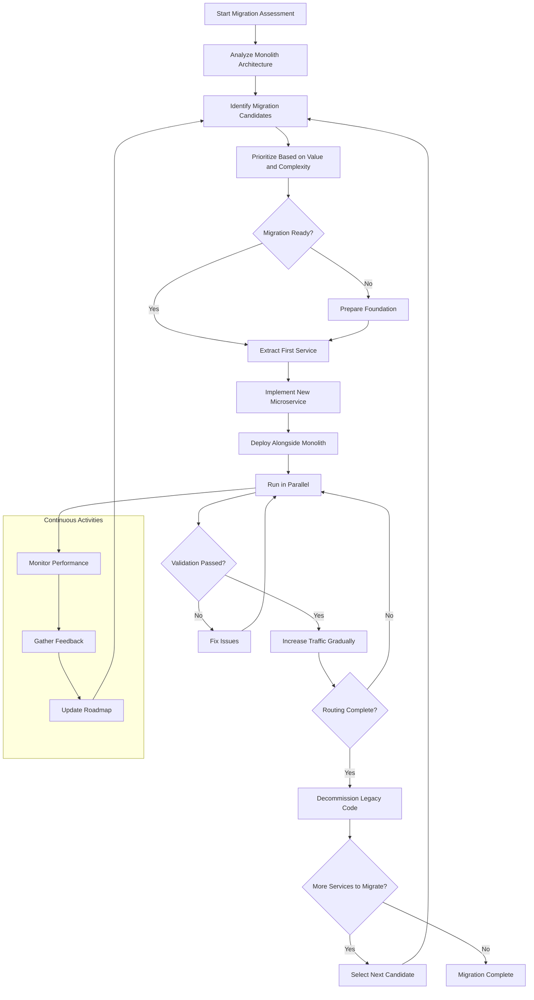

# Incremental Migration

## Overview

Incremental Migration is a decomposition strategy that emphasizes the gradual, step-by-step transformation of a monolithic application into microservices over an extended period. Unlike approaches that attempt large-scale transformations all at once, incremental migration focuses on small, manageable changes that can be delivered incrementally, reducing risk and allowing the organization to learn and adapt throughout the migration process. This strategy recognizes that microservices migration is not a single project but rather a continuous transformation that unfolds over months or years, requiring sustained investment and careful prioritization.

The fundamental philosophy behind incremental migration is that large, complex systems cannot be safely transformed in a single effort. Instead, the system is decomposed into smaller pieces, each of which can be understood, designed, implemented, and deployed independently. Each increment delivers value to the business while building toward the ultimate goal of a complete microservices architecture. This approach aligns well with agile software development principles and allows organizations to demonstrate progress to stakeholders while managing risk effectively.

Incremental migration differs from the Strangler Fig Pattern in important ways. While the Strangler Fig Pattern specifically focuses on routing traffic between the legacy system and new microservices during a transitional period, incremental migration is a broader concept that encompasses various approaches to making small, progressive changes. The Strangler Fig Pattern can be considered one specific technique within the broader incremental migration strategy. Incremental migration might also include approaches like strangler-based extraction, database decomposition, service extraction, and modular monolith development, all pursued incrementally over time.

The key success factors for incremental migration include strong executive sponsorship that maintains commitment over the long term, a clear and evolving roadmap that prioritizes high-value migrations, technical capabilities for building and operating microservices, organizational structures that support cross-functional teams, and robust automation for testing and deployment. Organizations that have successfully implemented incremental migrations have typically invested heavily in these foundational capabilities before or during the migration process.

## Flow Chart



This flow chart illustrates the incremental nature of the migration process. After initial assessment and prioritization, each service extraction follows a consistent pattern: implement, deploy in parallel, validate, gradually shift traffic, and finally decommission the legacy code. Throughout the process, continuous monitoring and feedback inform the prioritization of subsequent migrations. This creates a feedback loop that allows the organization to learn from each increment and adjust the overall strategy accordingly.

## Standard Example

The following example demonstrates how to implement an incremental migration in practice, showing the planning, extraction, and validation phases:

```java
// Migration Planning - Prioritization framework

package com.example.migration;

import java.time.Instant;
import java.util.*;

public class MigrationCandidate {
    private final String candidateId;
    private final String name;
    private final String description;
    private final String boundedContext;
    private final Set<String> dependencies;
    private final Set<String> dependentFeatures;
    private final int estimatedComplexity; // 1-10
    private final int businessValue; // 1-10
    private final int technicalRisk; // 1-10
    
    public MigrationCandidate(
            String candidateId,
            String name,
            String description,
            String boundedContext,
            Set<String> dependencies,
            Set<String> dependentFeatures,
            int estimatedComplexity,
            int businessValue,
            int technicalRisk) {
        this.candidateId = candidateId;
        this.name = name;
        this.description = description;
        this.boundedContext = boundedContext;
        this.dependencies = dependencies;
        this.dependentFeatures = dependentFeatures;
        this.estimatedComplexity = estimatedComplexity;
        this.businessValue = businessValue;
        this.technicalRisk = technicalRisk;
    }
    
    public int getPriorityScore() {
        // Higher is better: high business value, low complexity, low risk
        return (businessValue * 3) - (estimatedComplexity * 2) - (technicalRisk * 2);
    }
    
    public boolean isReadyForMigration(Map<String, Boolean> migratedServices) {
        // Can only migrate if all dependencies are already migrated
        return dependencies.stream()
            .allMatch(dep -> migratedServices.getOrDefault(dep, false));
    }
}

public class MigrationPlanner {
    
    private final List<MigrationCandidate> candidates;
    private final Map<String, Boolean> migratedServices = new HashMap<>();
    
    public MigrationPlanner(List<MigrationCandidate> candidates) {
        this.candidates = new ArrayList<>(candidates);
    }
    
    public List<MigrationCandidate> getMigrationSequence() {
        List<MigrationCandidate> sequence = new ArrayList<>();
        Set<String> migrated = new HashSet<>();
        
        // Iteratively select the highest priority candidate whose dependencies are met
        while (sequence.size() < candidates.size()) {
            MigrationCandidate next = candidates.stream()
                .filter(c -> !sequence.contains(c))
                .filter(c -> c.isReadyForMigration(
                    migrated.stream().collect(Collectors.toMap(s -> s, s -> true))))
                .max(Comparator.comparingInt(MigrationCandidate::getPriorityScore))
                .orElse(null);
            
            if (next == null) {
                break; // No more candidates with dependencies satisfied
            }
            
            sequence.add(next);
            migrated.add(next.getCandidateId());
        }
        
        return sequence;
    }
    
    public MigrationPlan createPlan() {
        List<MigrationCandidate> sequence = getMigrationSequence();
        Map<String, Instant> timeline = new HashMap<>();
        
        Instant startDate = Instant.now();
        for (int i = 0; i < sequence.size(); i++) {
            // Estimate 4-8 weeks per service depending on complexity
            int weeks = sequence.get(i).getEstimatedComplexity() < 5 ? 4 : 8;
            timeline.put(
                sequence.get(i).getCandidateId(),
                startDate.plusSeconds(weeks * 7L * 24 * 60 * 60)
            );
        }
        
        return new MigrationPlan(sequence, timeline);
    }
}

// Service Extraction - Incremental extraction implementation

package com.example.migration;

import org.springframework.stereotype.Service;
import org.springframework.transaction.annotation.Transactional;
import java.util.*;

@Service
public class ServiceExtractor {
    
    private final DatabaseSchemaExtractor schemaExtractor;
    private final CodeDependencyAnalyzer dependencyAnalyzer;
    private final InterfaceExtractor interfaceExtractor;
    
    public ServiceExtractor(
            DatabaseSchemaExtractor schemaExtractor,
            CodeDependencyAnalyzer dependencyAnalyzer,
            InterfaceExtractor interfaceExtractor) {
        this.schemaExtractor = schemaExtractor;
        this.dependencyAnalyzer = dependencyAnalyzer;
        this.interfaceExtractor = interfaceExtractor;
    }
    
    public ExtractionPlan analyzeAndPlanExtraction(String moduleName) {
        // Analyze code dependencies
        Set<String> codeDependencies = dependencyAnalyzer.analyze(moduleName);
        
        // Analyze database dependencies
        DatabaseSchemaAnalysis schemaAnalysis = schemaExtractor.analyzeSchema(moduleName);
        
        // Extract interfaces and contracts
        Set<InterfaceDefinition> interfaces = interfaceExtractor.extractInterfaces(moduleName);
        
        // Create extraction plan
        return ExtractionPlan.builder()
            .moduleName(moduleName)
            .codeDependencies(codeDependencies)
            .databaseChanges(schemaAnalysis.getRequiredChanges())
            .interfaces(interfaces)
            .estimatedEffort(calculateEffort(codeDependencies, schemaAnalysis))
            .risks(identifyRisks(codeDependencies, schemaAnalysis))
            .build();
    }
    
    private int calculateEffort(
            Set<String> codeDependencies,
            DatabaseSchemaAnalysis schemaAnalysis) {
        int baseEffort = 10; // Base story points
        baseEffort += codeDependencies.size() * 2;
        baseEffort += schemaAnalysis.getTableCount() * 3;
        return baseEffort;
    }
    
    private Set<String> identifyRisks(
            Set<String> codeDependencies,
            DatabaseSchemaAnalysis schemaAnalysis) {
        Set<String> risks = new HashSet<>();
        
        if (codeDependencies.size() > 10) {
            risks.add("High code coupling may require additional refactoring");
        }
        
        if (schemaAnalysis.getSharedTables().size() > 3) {
            risks.add("Multiple modules share database tables - requires data migration strategy");
        }
        
        if (schemaAnalysis.getCircularReferences().size() > 0) {
            risks.add("Circular database references detected");
        }
        
        return risks;
    }
}

// Parallel Running - Run old and new service simultaneously

package com.example.migration;

import org.springframework.stereotype.Component;
import java.util.concurrent.*;
import java.util.function.*;

@Component
public class ParallelRunValidator {
    
    private final MetricsCollector metrics;
    private final ComparisonEngine comparisonEngine;
    
    public ParallelRunValidator(
            MetricsCollector metrics,
            ComparisonEngine comparisonEngine) {
        this.metrics = metrics;
        this.comparisonEngine = comparisonEngine;
    }
    
    public <T> ParallelRunResult<T> validateParallelExecution(
            Supplier<T> legacySupplier,
            Supplier<T> microserviceSupplier,
            Comparator<T> responseComparator,
            int sampleSize,
            double minimumMatchRate) {
        
        ExecutorService executor = Executors.newFixedThreadPool(2);
        List<Future<T>> legacyFutures = new ArrayList<>();
        List<Future<T>> microserviceFutures = new ArrayList<>();
        
        // Execute requests in parallel
        for (int i = 0; i < sampleSize; i++) {
            legacyFutures.add(executor.submit(legacySupplier));
            microserviceFutures.add(executor.submit(microserviceSupplier));
        }
        
        // Collect results
        List<T> legacyResults = new ArrayList<>();
        List<T> microserviceResults = new ArrayList<>();
        
        for (int i = 0; i < sampleSize; i++) {
            try {
                legacyResults.add(legacyFutures.get(i).get(5, TimeUnit.SECONDS));
                microserviceResults.add(microserviceFutures.get(i).get(5, TimeUnit.SECONDS));
            } catch (Exception e) {
                // Handle timeouts or errors
            }
        }
        
        executor.shutdown();
        
        // Compare results
        int matches = 0;
        List<ComparisonResult> comparisonResults = new ArrayList<>();
        
        for (int i = 0; i < Math.min(legacyResults.size(), microserviceResults.size()); i++) {
            ComparisonResult result = responseComparator.compare(
                legacyResults.get(i),
                microserviceResults.get(i)
            );
            comparisonResults.add(result);
            if (result.isMatch()) {
                matches++;
            }
        }
        
        double matchRate = (double) matches / comparisonResults.size();
        boolean passed = matchRate >= minimumMatchRate;
        
        return ParallelRunResult.<T>builder()
            .passed(passed)
            .matchRate(matchRate)
            .comparisonResults(comparisonResults)
            .sampleSize(sampleSize)
            .build();
    }
    
    public void recordValidationMetrics(ParallelRunResult<?> result) {
        metrics.record("validation.matchRate", result.getMatchRate());
        metrics.record("validation.sampleSize", result.getSampleSize());
        metrics.record("validation.passed", result.isPassed() ? 1 : 0);
    }
}

// Gradual Traffic Shifting

package com.example.migration;

import org.springframework.stereotype.Service;
import java.util.concurrent.atomic.AtomicInteger;

@Service
public class TrafficShifter {
    
    private final Map<String, AtomicInteger> trafficWeights = new ConcurrentHashMap<>();
    private final int totalWeight = 100;
    
    public void setTrafficWeight(String serviceName, int weightPercentage) {
        if (weightPercentage < 0 || weightPercentage > 100) {
            throw new IllegalArgumentException("Weight must be between 0 and 100");
        }
        trafficWeights.put(serviceName, new AtomicInteger(weightPercentage));
    }
    
    public boolean shouldRouteToMicroservice(String serviceName, String sessionId) {
        Integer weight = trafficWeights.get(serviceName) != null 
            ? trafficWeights.get(serviceName).get() 
            : 0;
        
        if (weight == 0) {
            return false;
        }
        
        if (weight == 100) {
            return true;
        }
        
        // Use session ID for consistent routing
        int hash = Math.abs(sessionId.hashCode() % 100);
        return hash < weight;
    }
    
    public void incrementTraffic(String serviceName, int increment) {
        trafficWeights.computeIfAbsent(serviceName, k -> new AtomicInteger(0));
        int current = trafficWeights.get(serviceName).get();
        int newValue = Math.min(100, current + increment);
        trafficWeights.get(serviceName).set(newValue);
    }
    
    public Map<String, Integer> getCurrentTrafficDistribution() {
        Map<String, Integer> distribution = new HashMap<>();
        trafficWeights.forEach((service, weight) -> 
            distribution.put(service, weight.get()));
        return distribution;
    }
}
```

This example demonstrates key components of incremental migration: a prioritization framework for determining migration order, tools for analyzing and planning extractions, parallel validation to ensure new services match legacy behavior, and gradual traffic shifting capabilities. Each component supports the incremental approach by enabling small, controlled changes that can be validated before proceeding to the next increment.

## Real-World Example 1: Amazon's Product Catalog Migration

Amazon's migration of their product catalog from a monolithic architecture to microservices represents one of the largest and most successful incremental migrations in industry history. The product catalog, containing information about millions of products across numerous categories, was a critical system that needed to handle enormous scale while remaining continuously available.

Amazon began their incremental migration by identifying the product catalog as a good initial candidate due to its relatively clear boundaries and high value to the business. The migration was planned over multiple years, with specific milestones for extracting different aspects of the catalog: product details, pricing, inventory, reviews, and recommendations. Each aspect was extracted as a separate microservice, following the incremental pattern of implementing, validating in production, and gradually increasing traffic.

The incremental approach allowed Amazon to continue adding features to the product catalog throughout the migration. While one team worked on extracting pricing to a microservice, another team could work on new features in the monolith. This parallel operation was only possible because of the incremental approach—no team was blocked waiting for the entire migration to complete. Over time, the monolith shrank as more functionality moved to microservices, and the benefits of the new architecture became increasingly apparent in terms of scalability and deployment velocity.

Amazon's approach also demonstrated the importance of adapting the migration plan based on learnings. Initial estimates for some extractions proved too optimistic, while others completed faster than expected. The incremental framework allowed for these adjustments without derailing the overall migration, because each increment was self-contained and could be accelerated or decelerated independently.

## Real-World Example 2: Shopify's Monolith to Microservices Journey

Shopify's transformation from a Rails monolith to a microservices architecture provides valuable lessons in incremental migration for companies with e-commerce platforms. Like Amazon, Shopify faced the challenge of maintaining a platform serving millions of merchants while fundamentally changing the underlying architecture. Their approach emphasized incremental extraction and the concept of the "modular monolith" as an intermediate step.

Shopify's incremental migration strategy focused on extracting services that had the clearest boundaries and highest value. Their first significant extraction was the shipping calculation service, which had well-defined inputs and outputs and was relatively isolated from other functionality. This service was extracted as a Ruby microservice that could communicate with the main Rails application, allowing for validation of the new architecture pattern before attempting more complex extractions.

One distinctive aspect of Shopify's approach was their use of a "service-oriented Rails" intermediate stage before moving to full microservices. In this stage, the Rails application was refactored internally to follow service-oriented principles—clear boundaries, separate database schemas, and well-defined APIs—without actually deploying separate services. This allowed them to develop the skills and patterns needed for microservices while continuing to operate a single deployed application. Once confident in their approach, they could "flip the switch" to deploy these modules as independent services.

Shopety's experience highlights several important principles of incremental migration: starting with smaller, less risky extractions to build team confidence and skills; investing in internal refactoring before external service extraction; maintaining the ability to rollback to the monolith during the transition; and focusing on developer experience and tooling to make the migration sustainable over the long term.

## Output Statement

Incremental Migration provides a pragmatic, low-risk approach to microservices adoption that allows organizations to realize benefits progressively while managing complexity. By breaking down the migration into small, manageable increments, organizations can validate their architecture decisions at each step, maintain business continuity, and build the skills and infrastructure needed for microservices over time. This strategy is particularly appropriate for large, complex systems where a complete rewrite is not feasible, and where the organization can sustain multi-year transformation efforts. Success requires careful prioritization, robust automation, and the ability to learn and adapt throughout the migration process.

## Best Practices

### Prioritization Framework

Develop a clear prioritization framework that considers business value, technical complexity, risk, and dependencies. High-value, low-complexity services that have few dependencies on unmigrated services should be prioritized first. Consider both the benefits the organization will receive from the migration and the risks associated with extracting each service. Regularly review and adjust priorities based on learnings from previous increments.

### Maintain Business Continuity

Ensure that each increment does not disrupt ongoing business operations. New services should be deployed alongside existing functionality, with traffic gradually shifted only after thorough validation. Implement comprehensive rollback mechanisms that allow returning to the previous state if issues are detected. Maintain feature parity between legacy and new implementations during the transition period.

### Build Reusable Infrastructure

Invest in building reusable infrastructure that can accelerate subsequent migrations. Components like service templates, deployment pipelines, monitoring dashboards, and testing frameworks can be reused across multiple migrations. Document patterns and practices discovered during early migrations so that later increments benefit from accumulated learning.

### Automate Extensively

Automation is essential for sustainable incremental migration. Automate testing to ensure that new services match legacy behavior. Automate deployment to enable frequent, low-risk releases. Automate infrastructure provisioning to reduce operational burden. Automate data synchronization to ensure consistency between legacy and new systems. The more that can be automated, the faster subsequent increments can be completed.

### Manage Team Resources

Incremental migration over extended periods requires careful management of team resources and morale. Rotate team members across migration work and new feature development to prevent burnout and maintain skill diversity. Celebrate milestones and communicate progress to maintain organizational buy-in. Consider the long-term career development of team members working on migration—ensure they are developing skills relevant to their career goals.
