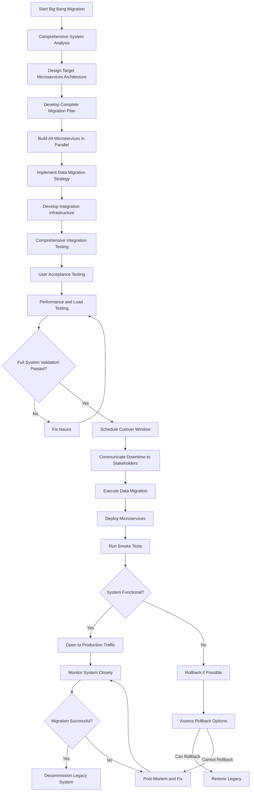

# Big Bang Migration

## Overview

Big Bang Migration is a decomposition strategy that involves performing a complete, simultaneous transformation from a monolithic application to microservices in a single, coordinated effort. Unlike incremental approaches that migrate functionality gradually over time, big bang migration attempts to deliver the entire new microservices architecture at once, with a cutover from the legacy system to the new system at a predetermined point in time. This approach is characterized by extensive upfront planning, a fixed deadline, and a complete transition that typically requires a planned downtime window.

The philosophy behind big bang migration is that attempting to maintain dual systems during an extended migration period introduces complexity, ongoing operational overhead, and prolonged uncertainty. Proponents argue that a single, definitive cutover can be less risky than years of incremental changes, because it avoids the indefinite maintenance of the legacy system alongside new services and eliminates the need for complex routing and synchronization layers. From a business perspective, big bang migration may be preferred when the organization has a clear timeline constraint, when the legacy system is unsupportable and must be replaced urgently, or when the cost of maintaining dual systems outweighs the risks of a single cutover.

However, big bang migration carries significant risks that have led many organizations to avoid it in practice. The primary risk is that a complete migration involves transforming every component of the system simultaneously, meaning that any issue anywhere in the new architecture can block the entire cutover. Additionally, the organization loses the ability to learn from partial migrations and adjust the strategy accordingly. The testing requirements for a big bang migration are enormous because the entire system must be validated as an integrated whole before the cutover. Finally, if problems are discovered after the cutover, rolling back to the legacy system may be impractical or impossible.

Despite these risks, big bang migration remains a valid strategy in specific circumstances. It may be appropriate when the legacy system is already failing or approaching end-of-life and cannot be maintained, when the organization has a unique window for migration (such as a planned regulatory change or market event), when the system is small enough that complete migration is manageable, or when the organization has prior experience with similar transformations and high confidence in their ability to execute. Understanding these tradeoffs is essential for making an informed decision about which migration strategy to pursue.

## Flow Chart



This flow chart illustrates the sequential nature of big bang migration, where each phase must be completed before moving to the next. The critical feature is the single cutover point where traffic shifts from the legacy system to the new microservices. Unlike incremental approaches that validate each service in isolation and in production, big bang migration requires comprehensive upfront testing because there is no opportunity to validate in production before the cutover.

## Standard Example

The following example demonstrates the key components of big bang migration planning and execution:

```java
// Migration Master Plan - Comprehensive planning for big bang migration

package com.example.bigbang;

import java.time.*;
import java.util.*;

public class MigrationMasterPlan {
    
    private final String projectName;
    private final Instant migrationDate;
    private final List<ServiceMigrationPlan> servicePlans;
    private final DataMigrationPlan dataMigrationPlan;
    private final CutoverPlan cutoverPlan;
    
    public MigrationMasterPlan(
            String projectName,
            Instant migrationDate,
            List<ServiceMigrationPlan> servicePlans,
            DataMigrationPlan dataMigrationPlan,
            CutoverPlan cutoverPlan) {
        this.projectName = projectName;
        this.migrationDate = migrationDate;
        this.servicePlans = servicePlans;
        this.dataMigrationPlan = dataMigrationPlan;
        this.cutoverPlan = cutoverPlan;
    }
    
    public Instant getMigrationDeadline() {
        return migrationDate;
    }
    
    public Duration getTimeRemaining() {
        return Duration.between(Instant.now(), migrationDate);
    }
    
    public boolean isOnTrack() {
        Instant now = Instant.now();
        
        for (ServiceMigrationPlan plan : servicePlans) {
            if (plan.getExpectedCompletion().isBefore(now) 
                    && plan.getStatus() != MigrationStatus.COMPLETED) {
                return false;
            }
        }
        
        return dataMigrationPlan.getExpectedCompletion().isBefore(now)
            || dataMigrationPlan.getStatus() == MigrationStatus.COMPLETED;
    }
}

public class ServiceMigrationPlan {
    
    private final String serviceName;
    private final String boundedContext;
    private final Instant expectedCompletion;
    private MigrationStatus status;
    private final Set<String> dependencies;
    private final List<String> requiredIntegrations;
    
    public ServiceMigrationPlan(
            String serviceName,
            String boundedContext,
            Instant expectedCompletion,
            Set<String> dependencies,
            List<String> requiredIntegrations) {
        this.serviceName = serviceName;
        this.boundedContext = boundedContext;
        this.expectedCompletion = expectedCompletion;
        this.dependencies = dependencies;
        this.requiredIntegrations = requiredIntegrations;
        this.status = MigrationStatus.PLANNED;
    }
    
    public Instant getExpectedCompletion() {
        return expectedCompletion;
    }
    
    public MigrationStatus getStatus() {
        return status;
    }
    
    public void setStatus(MigrationStatus status) {
        this.status = status;
    }
}

public class DataMigrationPlan {
    
    private final List<TableMigrationSpec> tableSpecs;
    private final Map<String, String> legacyToNewMapping;
    private final Instant expectedCompletion;
    private MigrationStatus status;
    
    public DataMigrationPlan(
            List<TableMigrationSpec> tableSpecs,
            Map<String, String> legacyToNewMapping,
            Instant expectedCompletion) {
        this.tableSpecs = tableSpecs;
        this.legacyToNewMapping = legacyToNewMapping;
        this.expectedCompletion = expectedCompletion;
        this.status = MigrationStatus.PLANNED;
    }
    
    public Instant getExpectedCompletion() {
        return expectedCompletion;
    }
    
    public MigrationStatus getStatus() {
        return status;
    }
}

public class TableMigrationSpec {
    
    private final String legacyTableName;
    private final String newTableName;
    private final long rowCount;
    private final Map<String, String> columnMapping;
    private final DataMigrationStrategy strategy;
    
    public TableMigrationSpec(
            String legacyTableName,
            String newTableName,
            long rowCount,
            Map<String, String> columnMapping,
            DataMigrationStrategy strategy) {
        this.legacyTableName = legacyTableName;
        this.newTableName = newTableName;
        this.rowCount = rowCount;
        this.columnMapping = columnMapping;
        this.strategy = strategy;
    }
}

public enum MigrationStatus {
    PLANNED,
    IN_PROGRESS,
    COMPLETED,
    BLOCKED,
    FAILED
}

public enum DataMigrationStrategy {
    DIRECT_MIGRATION,      // Direct copy with transformation
    DUAL_WRITE,            // Write to both during migration window
    EVENT_REPLAY,          // Replay events to rebuild state
    SNAPSHOT_AND_CDC       // Initial snapshot + change data capture
}

// Cutover Execution - Managing the big bang cutover

package com.example.bigbang;

import org.springframework.stereotype.Service;
import java.time.*;

@Service
public class CutoverExecution {
    
    private final List<ServiceHealthChecker> healthCheckers;
    private final DataMigrationExecutor dataMigrationExecutor;
    private final TrafficSwitch trafficSwitch;
    private final NotificationService notificationService;
    
    public CutoverExecution(
            List<ServiceHealthChecker> healthCheckers,
            DataMigrationExecutor dataMigrationExecutor,
            TrafficSwitch trafficSwitch,
            NotificationService notificationService) {
        this.healthCheckers = healthCheckers;
        this.dataMigrationExecutor = dataMigrationExecutor;
        this.trafficSwitch = trafficSwitch;
        this.notificationService = notificationService;
    }
    
    public CutoverResult executeCutover(CutoverPlan plan) {
        CutoverResult result = new CutoverResult();
        Instant startTime = Instant.now();
        
        try {
            notificationService.notifyStart(plan);
            
            // Phase 1: Data Migration
            result.addPhaseResult(executeDataMigration(plan.getDataMigrationPlan()));
            
            if (!result.isSuccessful()) {
                return result;
            }
            
            // Phase 2: Service Deployment
            result.addPhaseResult(deployServices(plan.getServiceDeployments()));
            
            if (!result.isSuccessful()) {
                return result;
            }
            
            // Phase 3: Health Verification
            result.addPhaseResult(verifySystemHealth());
            
            if (!result.isSuccessful()) {
                return result;
            }
            
            // Phase 4: Traffic Switch
            result.addPhaseResult(switchTraffic());
            
            // Phase 5: Post-Cutover Validation
            result.addPhaseResult(validatePostCutover());
            
            result.setSuccess(true);
            
        } catch (Exception e) {
            result.setSuccess(false);
            result.setFailureReason(e.getMessage());
            result.addPhaseResult(CutoverPhase.ROLLBACK, false, e.getMessage());
        } finally {
            Instant endTime = Instant.now();
            result.setDuration(Duration.between(startTime, endTime));
            notificationService.notifyComplete(result);
        }
        
        return result;
    }
    
    private PhaseResult executeDataMigration(DataMigrationPlan plan) {
        try {
            dataMigrationExecutor.execute(plan);
            return new PhaseResult(CutoverPhase.DATA_MIGRATION, true, "Data migrated successfully");
        } catch (Exception e) {
            return new PhaseResult(CutoverPhase.DATA_MIGRATION, false, e.getMessage());
        }
    }
    
    private PhaseResult deployServices(List<ServiceDeployment> deployments) {
        try {
            for (ServiceDeployment deployment : deployments) {
                deployment.execute();
            }
            return new PhaseResult(CutoverPhase.SERVICE_DEPLOYMENT, true, "All services deployed");
        } catch (Exception e) {
            return new PhaseResult(CutoverPhase.SERVICE_DEPLOYMENT, false, e.getMessage());
        }
    }
    
    private PhaseResult verifySystemHealth() {
        try {
            boolean allHealthy = true;
            List<String> issues = new ArrayList<>();
            
            for (ServiceHealthChecker checker : healthCheckers) {
                HealthCheckResult checkResult = checker.checkHealth();
                if (!checkResult.isHealthy()) {
                    allHealthy = false;
                    issues.add(checkResult.getMessage());
                }
            }
            
            if (allHealthy) {
                return new PhaseResult(CutoverPhase.HEALTH_CHECK, true, "All services healthy");
            } else {
                return new PhaseResult(CutoverPhase.HEALTH_CHECK, false, 
                    "Health check failed: " + String.join(", ", issues));
            }
        } catch (Exception e) {
            return new PhaseResult(CutoverPhase.HEALTH_CHECK, false, e.getMessage());
        }
    }
    
    private PhaseResult switchTraffic() {
        try {
            trafficSwitch.switchToMicroservices();
            return new PhaseResult(CutoverPhase.TRAFFIC_SWITCH, true, "Traffic switched");
        } catch (Exception e) {
            return new PhaseResult(CutoverPhase.TRAFFIC_SWITCH, false, e.getMessage());
        }
    }
    
    private PhaseResult validatePostCutover() {
        try {
            Thread.sleep(30000); // Wait 30 seconds for initial validation
            
            for (ServiceHealthChecker checker : healthCheckers) {
                HealthCheckResult result = checker.checkHealth();
                if (!result.isHealthy()) {
                    return new PhaseResult(CutoverPhase.POST_VALIDATION, false, 
                        "Post-cutover validation failed");
                }
            }
            
            return new PhaseResult(CutoverPhase.POST_VALIDATION, true, 
                "Post-cutover validation successful");
        } catch (Exception e) {
            return new PhaseResult(CutoverPhase.POST_VALIDATION, false, e.getMessage());
        }
    }
}

// Rollback Management

package com.example.bigbang;

public class RollbackManager {
    
    private final TrafficSwitch trafficSwitch;
    private final ServiceDeployer serviceDeployer;
    private final DatabaseManager databaseManager;
    
    public RollbackManager(
            TrafficSwitch trafficSwitch,
            ServiceDeployer serviceDeployer,
            DatabaseManager databaseManager) {
        this.trafficSwitch = trafficSwitch;
        this.serviceDeployer = serviceDeployer;
        this.databaseManager = databaseManager;
    }
    
    public RollbackResult executeRollback(RollbackPlan plan) {
        RollbackResult result = new RollbackResult();
        
        try {
            // Step 1: Stop traffic to new services
            trafficSwitch.switchToLegacy();
            
            // Step 2: Stop new microservices
            serviceDeployer.stopServices(plan.getServicesToStop());
            
            // Step 3: Restore legacy database if needed
            if (plan.isRestoreDatabase()) {
                databaseManager.restoreBackup(plan.getDatabaseBackupId());
            }
            
            // Step 4: Verify legacy is operational
            boolean legacyOperational = verifyLegacyOperational();
            
            result.setSuccess(legacyOperational);
            result.setMessage(legacyOperational 
                ? "Rollback completed successfully" 
                : "Rollback completed but legacy verification failed");
                
        } catch (Exception e) {
            result.setSuccess(false);
            result.setMessage("Rollback failed: " + e.getMessage());
        }
        
        return result;
    }
    
    private boolean verifyLegacyOperational() {
        // Implementation would verify legacy system is functioning
        return true;
    }
}
```

This example demonstrates key components of big bang migration: comprehensive planning with clear deadlines, phased cutover execution with health checks at each phase, and rollback management capabilities. The critical difference from incremental approaches is that all work is completed before the cutover, and the cutover must succeed because rolling back may be impractical after data has been migrated.

## Real-World Example 1: UK Government Digital Service GOV.UK

The GOV.UK website, which consolidates numerous UK government websites into a single platform, provides an interesting example of a big bang migration approach. Rather than incrementally migrating individual government services, the UK Government Digital Service chose to build an entirely new platform and migrate all services to it in a coordinated launch. This approach allowed them to establish a new, unified platform with consistent design patterns, user experience, and technical architecture.

The migration involved moving hundreds of individual government services from dozens of separate websites to the new GOV.UK platform. Unlike incremental approaches where each service might migrate independently, the GOV.UK approach required coordinating across multiple government departments and agencies. The big bang approach provided a clear deadline that all parties could work toward, and the coordinated launch created significant public attention and momentum for the transformation.

The GOV.UK experience highlighted both the advantages and challenges of the big bang approach. The unified platform delivered a consistent user experience that would have been difficult to achieve through incremental migration. However, the scale of the transformation required extensive planning and coordination, and the team had to carefully manage dependencies between different parts of the system. The lesson from GOV.UK is that big bang migration can succeed when there is strong central coordination and a clear unified vision, but it requires significant planning and organizational alignment.

## Real-World Example 2: New Relic's Platform Migration

New Relic, a software observability company, performed a significant migration of their core monitoring platform that demonstrated aspects of the big bang approach. Facing the need to modernize their infrastructure to support growing scale requirements, New Relic chose to build a completely new platform rather than attempt to extend their existing architecture. The migration was coordinated around a specific date aligned with a major product announcement, providing a clear deadline.

The New Relic migration involved building new back-end infrastructure capable of handling the massive volume of telemetry data they process daily, while simultaneously maintaining the existing platform for their customers. The coordinated approach allowed them to present a unified, modern platform to customers at launch, rather than explaining a gradual transition that might have created confusion about which capabilities were available where.

One of the key learnings from New Relic's experience was the importance of comprehensive testing. Because the new platform would serve all traffic from day one, there was no opportunity to validate in production before the cutover. New Relic invested heavily in testing infrastructure, including load testing with realistic traffic volumes, integration testing across all components, and canary testing in dedicated environments. This extensive testing was essential to building confidence in the new platform before the cutover.

## Output Statement

Big Bang Migration offers a coordinated approach to microservices transformation that can deliver a complete new architecture in a single, definitive change. This strategy is appropriate when the organization has a clear deadline constraint, when the legacy system cannot be maintained long-term, or when the system is small enough to make comprehensive testing feasible. However, big bang migration carries significant execution risk and should be approached with caution for large, complex systems. Organizations considering this strategy should ensure they have comprehensive test coverage, a robust rollback plan, and the organizational ability to execute complex, time-sensitive changes. The key to success is extensive upfront planning, thorough testing, and clear coordination across all teams involved in the migration.

## Best Practices

### Comprehensive Testing Strategy

Because there is no opportunity to validate new services in production before the cutover, big bang migration requires extensive upfront testing. Implement comprehensive integration testing that validates all service interactions. Perform load testing with realistic traffic volumes to verify the new architecture can handle expected load. Conduct user acceptance testing with actual users to validate functional requirements. Consider implementing chaos testing to verify system resilience under failure conditions.

### Detailed Rollback Plan

Always have a detailed rollback plan, even if rolling back is expected to be difficult. Document the exact steps required to restore the legacy system, including database restoration procedures. Ensure that database backups are taken before the migration and can be restored quickly. Consider implementing "fast fail" mechanisms that automatically trigger rollback if critical errors are detected after the cutover.

### Coordinate Teams Effectively

Big bang migration requires tight coordination across multiple teams. Establish clear communication channels and regular synchronization meetings. Create a central command center where decisions can be made quickly during the cutover. Ensure all teams understand their responsibilities and dependencies. Have escalation paths defined for different types of issues that may arise.

### Minimize Cutover Window

The cutover window is the period when the system is transitioning between architectures, and during this time the system may be unavailable or partially available. Minimize the cutover window by automating as much of the migration as possible. Pre-stage as much data as possible before the cutover begins. Have all deployment and configuration changes prepared in advance. Practice the cutover execution in a non-production environment to identify issues.

### Communicate with Stakeholders

Big bang migration typically requires planned downtime, which must be communicated to stakeholders well in advance. Provide clear communication about when the migration will occur, how long downtime is expected to last, and what impact users should expect. Establish communication channels for real-time updates during the cutover. Have a clear escalation path for communicating critical issues to leadership.
