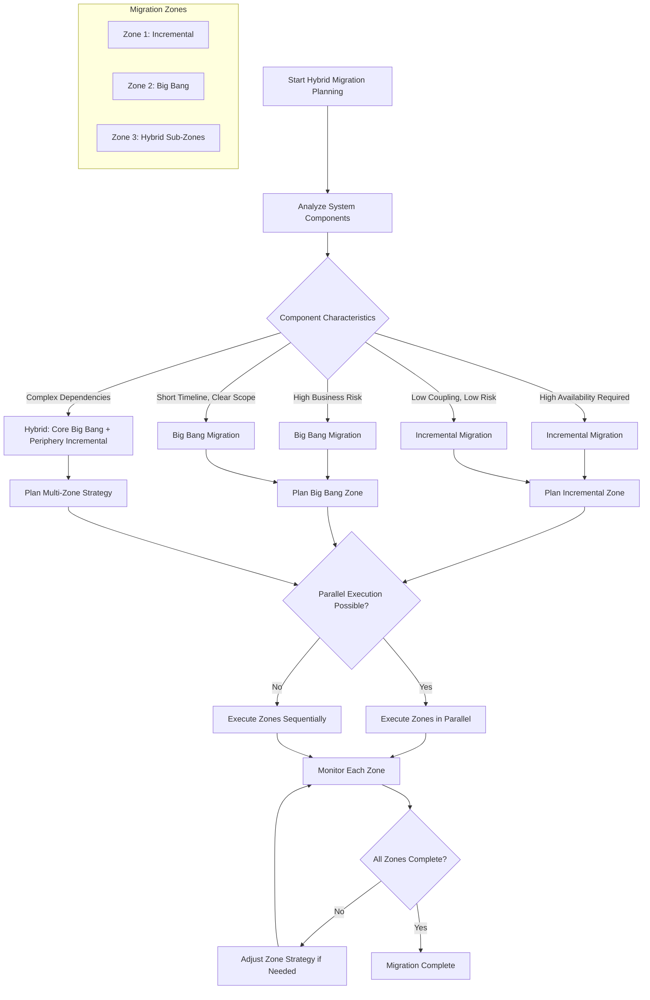

# Hybrid Approach

## Overview

The Hybrid Approach to microservices migration combines elements from both incremental migration and big bang migration strategies, creating a customized approach that leverages the strengths of each while mitigating their respective weaknesses. This pragmatic strategy recognizes that different parts of a system may be best served by different migration approaches, and that the optimal path often involves a thoughtful combination of techniques. Organizations adopting the hybrid approach can migrate certain components incrementally while performing coordinated big bang migrations for other components, creating a migration strategy that is tailored to their specific context and constraints.

The philosophy behind the hybrid approach is that microservices migration is not a one-size-fits-all endeavor. A large enterprise system may have dozens or hundreds of components, each with different characteristics: varying levels of business criticality, different degrees of coupling with other components, varying technical complexity, and different levels of team familiarity. Treating all components the same way—either strictly incremental or strictly big bang—may lead to suboptimal outcomes. The hybrid approach allows organizations to match the migration strategy to the characteristics of each component.

The hybrid approach typically involves partitioning the migration into zones or phases, where different strategies are applied to different zones. For example, an organization might choose to incrementally migrate the customer-facing components that require continuous availability while performing a more coordinated migration for back-office components that can tolerate brief downtime. Alternatively, they might use big bang migration for a small, critical core system while extracting peripheral services incrementally. The key is making informed decisions based on the specific characteristics of each component.

Implementing the hybrid approach requires sophisticated planning capabilities. The organization must be able to analyze each component of the system and determine the appropriate migration strategy, which requires both technical understanding and business context. It also requires the infrastructure to support multiple migration strategies simultaneously, which may include routing layers for incremental components, cutover coordination for big bang components, and the ability to move smoothly between strategies as conditions change.

## Flow Chart



This flow chart illustrates how the hybrid approach evaluates each component of the system and determines the appropriate migration strategy. The decision logic considers factors like availability requirements, coupling, risk, timeline, and dependencies. Once zones are planned, they can be executed in parallel or sequence depending on available resources and dependencies between zones. The monitoring phase is critical, as it allows the organization to adjust strategies if certain approaches are not working as expected.

## Standard Example

The following example demonstrates how to implement a hybrid migration approach in practice:

```java
// Hybrid Migration Planner - Analyze and partition the system

package com.example.hybrid;

import java.time.*;
import java.util.*;

public class HybridMigrationPlanner {
    
    private final SystemAnalyzer systemAnalyzer;
    private final RiskAssessor riskAssessor;
    private final TimelineCalculator timelineCalculator;
    
    public HybridMigrationPlanner(
            SystemAnalyzer systemAnalyzer,
            RiskAssessor riskAssessor,
            TimelineCalculator timelineCalculator) {
        this.systemAnalyzer = systemAnalyzer;
        this.riskAssessor = riskAssessor;
        this.timelineCalculator = timelineCalculator;
    }
    
    public HybridMigrationPlan createPlan(SystemSnapshot snapshot) {
        List<ComponentAnalysis> analyses = systemAnalyzer.analyzeComponents(snapshot);
        
        List<MigrationZone> zones = new ArrayList<>();
        
        // Zone 1: Components best suited for incremental migration
        List<ComponentAnalysis> incrementalCandidates = analyses.stream()
            .filter(this::isIncrementalCandidate)
            .toList();
        
        if (!incrementalCandidates.isEmpty()) {
            MigrationZone zone = createIncrementalZone(incrementalCandidates);
            zones.add(zone);
        }
        
        // Zone 2: Components best suited for big bang migration
        List<ComponentAnalysis> bigBangCandidates = analyses.stream()
            .filter(this::isBigBangCandidate)
            .toList();
        
        if (!bigBangCandidates.isEmpty()) {
            MigrationZone zone = createBigBangZone(bigBangCandidates);
            zones.add(zone);
        }
        
        // Zone 3: Components requiring hybrid approach
        List<ComponentAnalysis> hybridCandidates = analyses.stream()
            .filter(this::isHybridCandidate)
            .toList();
        
        if (!hybridCandidates.isEmpty()) {
            MigrationZone zone = createHybridZone(hybridCandidates);
            zones.add(zone);
        }
        
        return new HybridMigrationPlan(zones, timelineCalculator.calculateTimeline(zones));
    }
    
    private boolean isIncrementalCandidate(ComponentAnalysis analysis) {
        return analysis.getAvailabilityRequirement() >= AvailabilityLevel.HIGH
            && analysis.getCoupling() <= CouplingLevel.MEDIUM
            && analysis.getTeamFamiliarity() >= FamiliarityLevel.MEDIUM;
    }
    
    private boolean isBigBangCandidate(ComponentAnalysis analysis) {
        return analysis.getScope() <= ScopeLevel.SMALL
            && analysis.getTechnicalComplexity() <= ComplexityLevel.LOW
            && analysis.getDeadlineConstraint() != null;
    }
    
    private boolean isHybridCandidate(ComponentAnalysis analysis) {
        // Not clearly incremental or big bang - needs hybrid approach
        return !isIncrementalCandidate(analysis) && !isBigBangCandidate(analysis);
    }
    
    private MigrationZone createIncrementalZone(List<ComponentAnalysis> candidates) {
        return MigrationZone.builder()
            .zoneId("zone-incremental")
            .zoneName("Incremental Migration Zone")
            .strategy(MigrationStrategy.INCREMENTAL)
            .components(candidates)
            .estimatedDuration(Duration.ofMonths(18))
            .build();
    }
    
    private MigrationZone createBigBangZone(List<ComponentAnalysis> candidates) {
        return MigrationZone.builder()
            .zoneId("zone-bigbang")
            .zoneName("Big Bang Migration Zone")
            .strategy(MigrationStrategy.BIG_BANG)
            .components(candidates)
            .estimatedDuration(Duration.ofMonths(6))
            .targetDate(calculateTargetDate(Duration.ofMonths(6)))
            .build();
    }
    
    private MigrationZone createHybridZone(List<ComponentAnalysis> candidates) {
        // Further partition into sub-zones
        List<ComponentAnalysis> coreComponents = candidates.stream()
            .filter(c -> c.getBusinessCriticality() >= CriticalityLevel.HIGH)
            .toList();
        
        List<ComponentAnalysis> peripheralComponents = candidates.stream()
            .filter(c -> c.getBusinessCriticality() < CriticalityLevel.HIGH)
            .toList();
        
        List<MigrationZone> subZones = new ArrayList<>();
        if (!coreComponents.isEmpty()) {
            subZones.add(createBigBangZone(coreComponents));
        }
        if (!peripheralComponents.isEmpty()) {
            subZones.add(createIncrementalZone(peripheralComponents));
        }
        
        return MigrationZone.builder()
            .zoneId("zone-hybrid")
            .zoneName("Hybrid Migration Zone")
            .strategy(MigrationStrategy.HYBRID)
            .components(candidates)
            .subZones(subZones)
            .estimatedDuration(Duration.ofMonths(12))
            .build();
    }
}

// Component Analysis - Detailed analysis of each system component

package com.example.hybrid;

public class ComponentAnalysis {
    
    private final String componentId;
    private final String componentName;
    private final String boundedContext;
    private final AvailabilityLevel availabilityRequirement;
    private final CouplingLevel coupling;
    private final ComplexityLevel technicalComplexity;
    final FamiliarityLevel teamFamiliarity;
    final ScopeLevel scope;
    final CriticalityLevel businessCriticality;
    final Duration estimatedMigrationDuration;
    final Set<String> dependencies;
    final Instant deadlineConstraint;
    final Set<String> dependentFeatures;
    
    public ComponentAnalysis(
            String componentId,
            String componentName,
            String boundedContext,
            AvailabilityLevel availabilityRequirement,
            CouplingLevel coupling,
            ComplexityLevel technicalComplexity,
            FamiliarityLevel teamFamiliarity,
            ScopeLevel scope,
            CriticalityLevel businessCriticality,
            Duration estimatedMigrationDuration,
            Set<String> dependencies,
            Instant deadlineConstraint,
            Set<String> dependentFeatures) {
        this.componentId = componentId;
        this.componentName = componentName;
        this.boundedContext = boundedContext;
        this.availabilityRequirement = availabilityRequirement;
        this.coupling = coupling;
        this.technicalComplexity = technicalComplexity;
        this.teamFamiliarity = teamFamiliarity;
        this.scope = scope;
        this.businessCriticality = businessCriticality;
        this.estimatedMigrationDuration = estimatedMigrationDuration;
        this.dependencies = dependencies;
        this.deadlineConstraint = deadlineConstraint;
        this.dependentFeatures = dependentFeatures;
    }
    
    public MigrationStrategy recommendedStrategy() {
        if (availabilityRequirement == AvailabilityLevel.CRITICAL 
                && technicalComplexity == ComplexityLevel.HIGH) {
            return MigrationStrategy.INCREMENTAL;
        }
        
        if (scope == ScopeLevel.SMALL 
                && coupling == CouplingLevel.LOW 
                && deadlineConstraint != null) {
            return MigrationStrategy.BIG_BANG;
        }
        
        return MigrationStrategy.HYBRID;
    }
}

public enum AvailabilityLevel {
    FLEXIBLE,    // Downtime acceptable
    STANDARD,    // 99% availability
    HIGH,        // 99.9% availability
    CRITICAL     // 99.99%+ availability
}

public enum CouplingLevel {
    LOW,         // Few dependencies
    MEDIUM,      // Moderate dependencies
    HIGH         // Strong coupling with other components
}

public enum ComplexityLevel {
    LOW,         // Straightforward extraction
    MEDIUM,      // Moderate complexity
    HIGH         // Complex dependencies and transformations
}

public enum FamiliarityLevel {
    LOW,         // Team unfamiliar with this component
    MEDIUM,      // Some team experience
    HIGH         // Team very familiar with component
}

public enum ScopeLevel {
    SMALL,       // Under 5000 lines of code
    MEDIUM,      // 5000-20000 lines
    LARGE        // Over 20000 lines
}

public enum CriticalityLevel {
    LOW,         // Non-critical functionality
    MEDIUM,      // Important but not core
    HIGH         // Core business functionality
}

public enum MigrationStrategy {
    INCREMENTAL,   // Gradual extraction
    BIG_BANG,      // Complete migration in one event
    HYBRID         // Combination approach
}

// Zone Coordinator - Managing multiple migration zones

package com.example.hybrid;

import org.springframework.stereotype.Service;
import java.util.*;
import java.time.*;

@Service
public class ZoneCoordinator {
    
    private final Map<String, MigrationZoneExecutor> executors;
    private final MetricsCollector metrics;
    private final AlertService alertService;
    
    public ZoneCoordinator(
            Map<String, MigrationZoneExecutor> executors,
            MetricsCollector metrics,
            AlertService alertService) {
        this.executors = executors;
        this.metrics = metrics;
        this.alertService = alertService;
    }
    
    public ZoneExecutionResult executePlan(HybridMigrationPlan plan) {
        ZoneExecutionResult result = new ZoneExecutionResult();
        Instant startTime = Instant.now();
        
        // Determine execution order based on dependencies
        List<MigrationZone> executionSequence = determineExecutionOrder(plan.getZones());
        
        // Execute zones
        for (MigrationZone zone : executionSequence) {
            MigrationZoneExecutor executor = executors.get(zone.getStrategy().name());
            
            ZoneExecutionResult zoneResult = executor.execute(zone);
            result.addZoneResult(zone.getZoneId(), zoneResult);
            
            // Check for issues
            if (!zoneResult.isSuccessful()) {
                alertService.alert("Zone " + zone.getZoneId() + " failed");
                // Determine if should continue or abort
                if (!shouldContinue(zone, zoneResult)) {
                    result.setSuccess(false);
                    result.setAbortedZone(zone.getZoneId());
                    break;
                }
            }
            
            // Wait between zones if needed
            if (zone.getWaitTimeAfterCompletion() != null) {
                try {
                    Thread.sleep(zone.getWaitTimeAfterCompletion().toMillis());
                } catch (InterruptedException e) {
                    Thread.currentThread().interrupt();
                }
            }
        }
        
        result.setDuration(Duration.between(startTime, Instant.now()));
        return result;
    }
    
    private List<MigrationZone> determineExecutionOrder(List<MigrationZone> zones) {
        // Zones with big bang components should execute first if they have hard deadlines
        return zones.stream()
            .sorted((z1, z2) -> {
                if (z1.getStrategy() == MigrationStrategy.BIG_BANG 
                        && z2.getStrategy() != MigrationStrategy.BIG_BANG) {
                    return -1;
                }
                if (z1.getStrategy() != MigrationStrategy.BIG_BANG 
                        && z2.getStrategy() == MigrationStrategy.BIG_BANG) {
                    return 1;
                }
                return 0;
            })
            .toList();
    }
    
    private boolean shouldContinue(MigrationZone zone, ZoneExecutionResult result) {
        // Determine if migration should continue based on failure severity
        return zone.getStrategy() != MigrationStrategy.BIG_BANG 
            || result.getFailureSeverity() != SeverityLevel.CRITICAL;
    }
}

// Incremental Zone Executor

package com.example.hybrid;

public class IncrementalZoneExecutor implements MigrationZoneExecutor {
    
    private final ServiceExtractor serviceExtractor;
    private final ParallelRunValidator validator;
    private final TrafficShifter trafficShifter;
    
    @Override
    public ZoneExecutionResult execute(MigrationZone zone) {
        ZoneExecutionResult result = new ZoneExecutionResult();
        
        List<ComponentAnalysis> components = zone.getComponents();
        
        for (ComponentAnalysis component : components) {
            // Extract service
            ExtractionResult extraction = serviceExtractor.extract(component);
            
            if (!extraction.isSuccessful()) {
                result.addComponentResult(component.getComponentId(), 
                    ComponentResult.failure(extraction.getError()));
                continue;
            }
            
            // Run in parallel with legacy
            ValidationResult validation = validator.validateParallel(
                component, 
                extraction.getExtractedService());
            
            if (!validation.isPassed()) {
                result.addComponentResult(component.getComponentId(),
                    ComponentResult.failure("Validation failed: " + validation.getErrors()));
                continue;
            }
            
            // Gradually shift traffic
            trafficShifter.shiftTraffic(component.getComponentId(), validation.getMatchRate());
            
            result.addComponentResult(component.getComponentId(), 
                ComponentResult.success());
        }
        
        return result;
    }
}

// Big Bang Zone Executor

package com.example.hybrid;

public class BigBangZoneExecutor implements MigrationZoneExecutor {
    
    private final ServiceExtractor serviceExtractor;
    private final CutoverExecution cutoverExecution;
    private final DataMigrationExecutor dataMigration;
    
    @Override
    public ZoneExecutionResult execute(MigrationZone zone) {
        ZoneExecutionResult result = new ZoneExecutionResult();
        
        try {
            // Execute all extractions
            for (ComponentAnalysis component : zone.getComponents()) {
                ExtractionResult extraction = serviceExtractor.extract(component);
                
                if (!extraction.isSuccessful()) {
                    throw new MigrationException(
                        "Failed to extract component: " + component.getComponentName());
                }
            }
            
            // Execute data migration
            DataMigrationResult dataResult = dataMigration.execute(
                zone.getDataMigrationSpec());
            
            if (!dataResult.isSuccessful()) {
                throw new MigrationException("Data migration failed");
            }
            
            // Execute cutover
            CutoverResult cutoverResult = cutoverExecution.executeCutover(zone.getCutoverPlan());
            
            if (!cutoverResult.isSuccessful()) {
                throw new MigrationException("Cutover failed: " + cutoverResult.getError());
            }
            
            result.setSuccess(true);
            
        } catch (Exception e) {
            result.setSuccess(false);
            result.setError(e.getMessage());
        }
        
        return result;
    }
}
```

This example demonstrates the key components of a hybrid migration planner: the analysis logic that determines which strategy to apply to each component, the zone coordinator that manages multiple migration strategies in parallel, and the executors that implement each strategy. The hybrid approach allows different components to be migrated using the most appropriate strategy based on their specific characteristics.

## Real-World Example 1: Spotify's Migration Approach

Spotify's evolution from a monolithic backend to microservices provides an excellent example of the hybrid approach in practice. As a music streaming platform serving hundreds of millions of users, Spotify had strict availability requirements that precluded simple big bang migration. However, they also recognized that not all components had the same requirements, and different components warranted different approaches.

For their core recommendation engine, Spotify chose a more incremental approach. This system was critical to the user experience and had complex dependencies with other parts of the system. Migrating it required careful, gradual extraction with extensive validation to ensure recommendations remained accurate. The team built new microservices for recommendation components while maintaining the legacy system, gradually shifting traffic as confidence increased.

For more isolated systems, such as certain backend administrative tools and internal services, Spotify was able to use more big bang-like approaches. These systems had fewer users, less critical availability requirements, and simpler dependencies, making a coordinated migration more practical. The key insight from Spotify's approach was that different parts of their system had different characteristics, and attempting to apply a single migration strategy uniformly would have been suboptimal.

## Real-World Example 2: Uber's Core Platform Migration

Uber's migration of their core booking platform from a monolithic architecture to microservices demonstrates sophisticated use of the hybrid approach. The booking system, which handles ride requests, driver matching, and pricing, had extremely high availability requirements—any downtime directly impacted revenue and customer experience. However, surrounding systems had different characteristics that warranted different approaches.

For the core booking system, Uber used an incremental approach with extensive canary testing. New microservices were deployed alongside the monolith, with traffic gradually shifted based on careful validation. The incremental approach allowed them to detect and fix issues before they impacted significant traffic volumes, maintaining the high availability that their business required.

For back-office systems, such as driver onboarding, payment processing for older transaction types, and internal reporting tools, Uber was able to use more big bang-like approaches. These systems were either less critical to real-time operations or were being phased out anyway, making coordinated migration more practical. The hybrid approach allowed Uber to optimize each migration for its specific context while maintaining overall system reliability.

Uber's experience highlighted the importance of having clear criteria for determining which approach to use for each component. They developed a framework that evaluated components based on factors like business criticality, availability requirements, technical complexity, and team familiarity, and used these criteria to make consistent, informed decisions about migration strategy.

## Output Statement

The Hybrid Approach provides a flexible, pragmatic strategy for microservices migration that can optimize for both risk and speed by applying different techniques to different components of the system. This approach recognizes that migration is not a one-size-fits-all endeavor and that different components have different characteristics that make them better suited to different strategies. Organizations should adopt the hybrid approach when their system has components with varying characteristics, when they want to optimize migration speed while managing risk, or when pure incremental or big bang approaches would be suboptimal for their specific context. The key to success is careful analysis of each component, clear criteria for strategy selection, and the infrastructure to support multiple migration strategies simultaneously.

## Best Practices

### Develop Clear Selection Criteria

Establish clear, documented criteria for determining which migration strategy to apply to each component. Criteria should include availability requirements, coupling and dependencies, technical complexity, business criticality, team familiarity, and timeline constraints. Use these criteria consistently to make objective decisions about strategy selection. Document the rationale for each decision to enable review and learning.

### Build Flexible Infrastructure

The hybrid approach requires infrastructure that can support multiple migration strategies. Build or adopt routing layers that can handle both incremental traffic shifting and coordinated cutovers. Implement data synchronization capabilities that work with both parallel-running and cutover-based approaches. Ensure your deployment infrastructure can handle both gradual rollout and simultaneous deployment of multiple services.

### Coordinate Across Zones

When running multiple migration strategies in parallel, careful coordination is essential. Establish clear communication channels between teams working on different zones. Implement cross-zone dependency management to handle cases where components in different zones depend on each other. Create unified dashboards that show the status of all zones to enable holistic monitoring and decision-making.

### Adjust Strategy When Needed

The hybrid approach should be dynamic, allowing strategy adjustments when conditions change. If incremental migration proves too slow for a particular component, consider whether big bang migration is now feasible. If big bang migration encounters unexpected issues, consider whether incremental approaches might work better. Regularly review progress and be willing to adjust strategies based on learnings.

### Balance Speed and Risk

The hybrid approach exists to optimize the tradeoff between migration speed and risk. Avoid the temptation to make all migrations incremental (which maximizes safety but slows progress) or all big bang (which maximizes speed but increases risk). Instead, find the right balance for your organization by applying the approach that best fits each component's characteristics.
