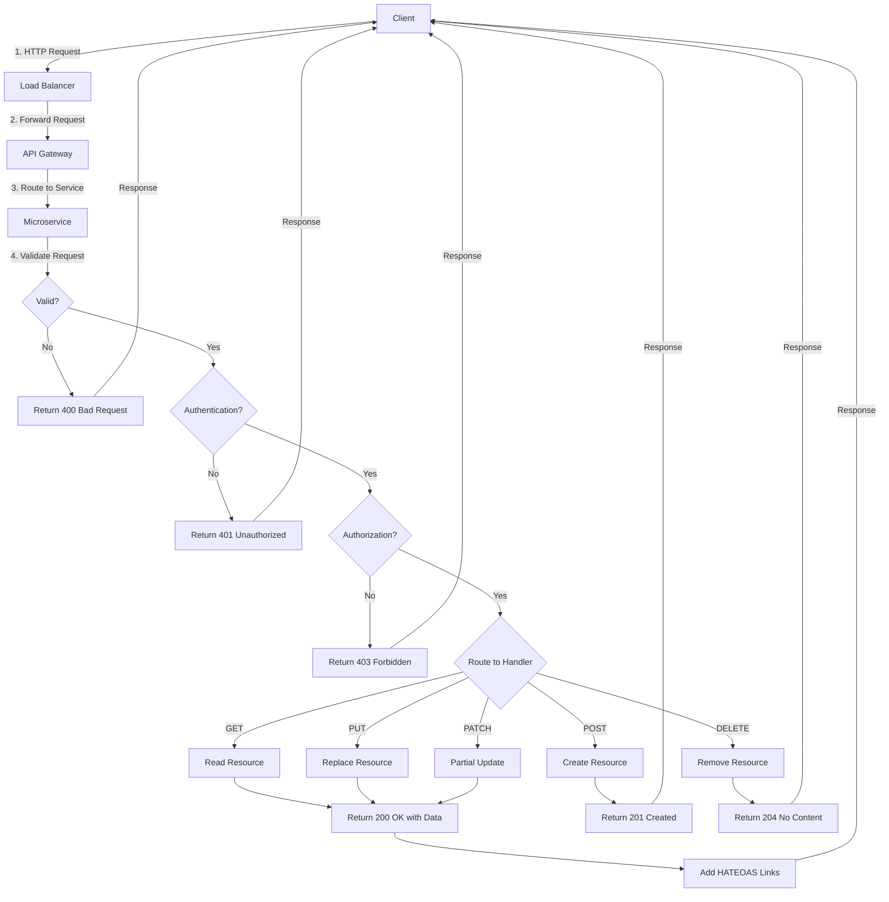

# REST API Pattern in Microservices

## Overview

REST (Representational State Transfer) is an architectural style for designing networked applications. It relies on a stateless, client-server communication protocol — almost always HTTP. REST APIs are the backbone of synchronous communication in microservices architectures, enabling services to exchange data in a standardized, predictable manner.

---

## 1. REST API Fundamentals and Principles

REST is defined by six architectural constraints:

| Constraint | Description |
|------------|-------------|
| **Client-Server Architecture** | Separation of concerns between client and server allows them to evolve independently. |
| **Statelessness** | Each request from client to server must contain all information needed to understand the request. No session state is stored on the server. |
| **Cacheability** | Responses must define themselves as cacheable or non-cacheable to improve performance. |
| **Layered System** | The client cannot assume it connects directly to the server; intermediaries (proxies, load balancers) can exist. |
| **Uniform Interface** | Resources are identified by URIs, and representations (JSON, XML) are used to transfer state. |
| **Code on Demand (Optional)** | Servers can extend client functionality by sending executable code. |

RESTful APIs treat every piece of data as a **resource** that can be accessed and manipulated via standard HTTP methods.

---

## 2. HTTP Methods

HTTP methods define the action to be performed on a resource. In REST, each method has specific semantics:

### GET
- **Purpose**: Retrieve a representation of a resource.
- **Idempotent**: Yes (multiple identical requests produce the same result).
- **Request Body**: Not allowed.
- **Response**: 200 OK with resource data, 404 Not Found, 500 Server Error.

### POST
- **Purpose**: Create a new resource or initiate an action.
- **Idempotent**: No.
- **Request Body**: Contains data for the new resource.
- **Response**: 201 Created with location header, 400 Bad Request, 409 Conflict.

### PUT
- **Purpose**: Replace an existing resource entirely.
- **Idempotent**: Yes.
- **Request Body**: Complete resource representation.
- **Response**: 200 OK, 201 Created, 404 Not Found.

### PATCH
- **Purpose**: Partially update an existing resource.
- **Idempotent**: Yes (if using proper patch semantics).
- **Request Body**: Partial data to update.
- **Response**: 200 OK, 404 Not Found.

### DELETE
- **Purpose**: Remove a resource.
- **Idempotent**: Yes.
- **Response**: 200 OK, 204 No Content, 404 Not Found.

---

## 3. Resource Naming Conventions

Resource naming is critical for a clean, intuitive API. Follow these conventions:

### General Rules
- Use **plural nouns** for resource collections: `/users`, `/orders`, `/products`.
- Use **lowercase** with hyphens for multi-word resources: `/customer-orders`.
- Use **nouns**, not verbs: `/get-users` (bad) → `/users` (good).
- Use **nested resources** for relationships: `/users/123/orders`.
- Keep URLs **short** and **meaningful**.

### Examples

```
GET    /api/v1/users              # Get all users
GET    /api/v1/users/123          # Get user 123
POST   /api/v1/users              # Create a new user
PUT    /api/v1/users/123          # Update user 123 entirely
PATCH  /api/v1/users/123          # Partially update user 123
DELETE /api/v1/users/123          # Delete user 123
GET    /api/v1/users/123/orders   # Get orders for user 123
```

### Anti-Patterns to Avoid
- `/getUsers`, `/createUser`, `/deleteOrder` (using verbs)
- `/Users`, `/USER` (inconsistent casing)
- `/api/v1/resource/some-long-path-that-goes-on-forever`

---

## 4. HTTP Status Codes

Status codes indicate the outcome of an HTTP request. Use them correctly:

### 2xx Success
| Code | Meaning |
|------|---------|
| 200 | OK - Request succeeded (GET, PUT, PATCH) |
| 201 | Created - Resource successfully created (POST) |
| 204 | No Content - Successful deletion or no content to return |

### 3xx Redirection
| Code | Meaning |
|------|---------|
| 301 | Moved Permanently |
| 304 | Not Modified (cached response) |

### 4xx Client Errors
| Code | Meaning |
|------|---------|
| 400 | Bad Request - Invalid client input |
| 401 | Unauthorized - Authentication required |
| 403 | Forbidden - Authenticated but not authorized |
| 404 | Not Found - Resource doesn't exist |
| 409 | Conflict - State conflict (e.g., duplicate) |
| 422 | Unprocessable Entity - Valid but semantic errors |
| 429 | Too Many Requests - Rate limiting |

### 5xx Server Errors
| Code | Meaning |
|------|---------|
| 500 | Internal Server Error |
| 502 | Bad Gateway |
| 503 | Service Unavailable |
| 504 | Gateway Timeout |

---

## 5. HATEOAS (Hypermedia as the Engine of Application State)

HATEOAS is a constraint of REST that allows clients to navigate the API dynamically via hypermedia links included in responses.

### Example

```json
{
  "id": 123,
  "name": "John Doe",
  "email": "john@example.com",
  "_links": {
    "self": {
      "href": "/api/v1/users/123"
    },
    "orders": {
      "href": "/api/v1/users/123/orders"
    },
    "update": {
      "href": "/api/v1/users/123",
      "method": "PUT"
    },
    "delete": {
      "href": "/api/v1/users/123",
      "method": "DELETE"
    }
  }
}
```

HATEOAS reduces coupling — clients don't need to hardcode URLs, making the API more evolvable.

---

## 6. Richardson Maturity Model

Leonard Richardson proposed a model that classifies REST APIs into levels based on their adherence to REST principles:

| Level | Name | Description |
|-------|------|-------------|
| 0 | Swamp of POX | Single endpoint, SOAP-style; no REST characteristics. |
| 1 | Resources | Uses multiple endpoints (resources) but only POST. |
| 2 | HTTP Verbs | Uses proper HTTP methods (GET, POST, PUT, DELETE) and status codes. |
| 3 | Hypermedia Controls | Implements HATEOAS; highest level of REST maturity. |

Most production APIs aim for Level 2 or Level 3.

---

## 7. Best Practices for REST in Microservices

1. **Version Your API**: Use URI versioning (`/api/v1/`) or header versioning to allow backward compatibility.

2. **Use Pagination**: Never return unlimited results.
   ```
   GET /api/v1/users?page=2&limit=20
   ```

3. **Support Filtering, Sorting, and Field Selection**:
   ```
   GET /api/v1/users?status=active&sort=created_at&fields=id,name
   ```

4. **Secure Your API**: Use OAuth 2.0, JWT, or API keys. Always use HTTPS.

5. **Document Your API**: Use OpenAPI (Swagger) specification.

6. **Use Consistent Error Responses**:
   ```json
   {
     "error": {
       "code": "USER_NOT_FOUND",
       "message": "User with ID 123 not found",
       "timestamp": "2024-01-15T10:30:00Z"
     }
   }
   ```

7. **Idempotency Keys**: For POST and PATCH, support idempotency keys to prevent duplicate operations.

8. **Rate Limiting**: Return `429 Too Many Requests` with `Retry-After` header.

9. **Use JSON as Default**: Accept and respond with JSON. Use content negotiation for alternatives.

---

## 8. Code Examples

### Python (Flask)

```python
from flask import Flask, jsonify, request, abort

app = Flask(__name__)

users = {}
user_id_counter = 1

@app.route('/api/v1/users', methods=['GET'])
def get_users():
    page = request.args.get('page', 1, type=int)
    limit = request.args.get('limit', 10, type=int)
    start = (page - 1) * limit
    end = start + limit
    
    paginated_users = [
        {"id": uid, "name": data["name"], "email": data["email"]}
        for uid, data in list(users.items())[start:end]
    ]
    
    return jsonify({
        "data": paginated_users,
        "page": page,
        "limit": limit,
        "total": len(users)
    })

@app.route('/api/v1/users/<int:uid>', methods=['GET'])
def get_user(uid):
    if uid not in users:
        abort(404, description="User not found")
    return jsonify({"id": uid, "name": users[uid]["name"], "email": users[uid]["email"]})

@app.route('/api/v1/users', methods=['POST'])
def create_user():
    global user_id_counter
    data = request.get_json()
    
    if not data or 'name' not in data or 'email' not in data:
        abort(400, description="Missing required fields")
    
    new_id = user_id_counter
    user_id_counter += 1
    users[new_id] = {"name": data["name"], "email": data["email"]}
    
    return jsonify({"id": new_id, "name": data["name"], "email": data["email"]}), 201

@app.route('/api/v1/users/<int:uid>', methods=['PUT'])
def update_user(uid):
    if uid not in users:
        abort(404, description="User not found")
    
    data = request.get_json()
    users[uid] = {"name": data.get("name", users[uid]["name"]), 
                  "email": data.get("email", users[uid]["email"])}
    
    return jsonify({"id": uid, "name": users[uid]["name"], "email": users[uid]["email"]})

@app.route('/api/v1/users/<int:uid>', methods=['PATCH'])
def patch_user(uid):
    if uid not in users:
        abort(404, description="User not found")
    
    data = request.get_json()
    if "name" in data:
        users[uid]["name"] = data["name"]
    if "email" in data:
        users[uid]["email"] = data["email"]
    
    return jsonify({"id": uid, "name": users[uid]["name"], "email": users[uid]["email"]})

@app.route('/api/v1/users/<int:uid>', methods=['DELETE'])
def delete_user(uid):
    if uid not in users:
        abort(404, description="User not found")
    
    del users[uid]
    return '', 204

if __name__ == '__main__':
    app.run(debug=True, port=5000)
```

### Java (Spring Boot)

```java
// User.java
public class User {
    private Long id;
    private String name;
    private String email;
    
    public User() {}
    
    public User(Long id, String name, String email) {
        this.id = id;
        this.name = name;
        this.email = email;
    }
    
    // Getters and Setters
    public Long getId() { return id; }
    public void setId(Long id) { this.id = id; }
    public String getName() { return name; }
    public void setName(String name) { this.name = name; }
    public String getEmail() { return email; }
    public void setEmail(String email) { this.email = email; }
}

// UserController.java
@RestController
@RequestMapping("/api/v1/users")
public class UserController {
    
    private final Map<Long, User> userStore = new ConcurrentHashMap<>();
    private AtomicLong idGenerator = new AtomicLong(1);
    
    @GetMapping
    public ResponseEntity<List<User>> getAllUsers(
            @RequestParam(defaultValue = "1") int page,
            @RequestParam(defaultValue = "10") int limit) {
        
        List<User> allUsers = new ArrayList<>(userStore.values());
        int start = (page - 1) * limit;
        int end = Math.min(start + limit, allUsers.size());
        
        if (start >= allUsers.size()) {
            return ResponseEntity.ok(List.of());
        }
        
        List<User> pagedUsers = allUsers.subList(start, end);
        return ResponseEntity.ok(pagedUsers);
    }
    
    @GetMapping("/{id}")
    public ResponseEntity<User> getUser(@PathVariable Long id) {
        User user = userStore.get(id);
        if (user == null) {
            return ResponseEntity.notFound().build();
        }
        return ResponseEntity.ok(user);
    }
    
    @PostMapping
    public ResponseEntity<User> createUser(@RequestBody User user) {
        if (user.getName() == null || user.getEmail() == null) {
            return ResponseEntity.badRequest().build();
        }
        
        Long newId = idGenerator.getAndIncrement();
        user.setId(newId);
        userStore.put(newId, user);
        
        return ResponseEntity.status(HttpStatus.CREATED).body(user);
    }
    
    @PutMapping("/{id}")
    public ResponseEntity<User> updateUser(@PathVariable Long id, @RequestBody User user) {
        if (!userStore.containsKey(id)) {
            return ResponseEntity.notFound().build();
        }
        
        user.setId(id);
        userStore.put(id, user);
        return ResponseEntity.ok(user);
    }
    
    @PatchMapping("/{id}")
    public ResponseEntity<User> patchUser(@PathVariable Long id, @RequestBody User patch) {
        User existing = userStore.get(id);
        if (existing == null) {
            return ResponseEntity.notFound().build();
        }
        
        if (patch.getName() != null) {
            existing.setName(patch.getName());
        }
        if (patch.getEmail() != null) {
            existing.setEmail(patch.getEmail());
        }
        
        return ResponseEntity.ok(existing);
    }
    
    @DeleteMapping("/{id}")
    public ResponseEntity<Void> deleteUser(@PathVariable Long id) {
        if (!userStore.containsKey(id)) {
            return ResponseEntity.notFound().build();
        }
        
        userStore.remove(id);
        return ResponseEntity.noContent().build();
    }
}
```

---

## 9. Flow Chart: REST API Request-Response Cycle



---

## 10. Real-World Examples

### Stripe API

Stripe is a premier example of a well-designed REST API used in microservices.

**Base URL**: `https://api.stripe.com/v1`

**Key Characteristics**:
- Resource-oriented endpoints: `/customers`, `/charges`, `/subscriptions`
- Nested resources: `/customers/{id}/subscriptions`
- Consistent error responses with `error` object containing `type`, `code`, `message`
- Idempotency keys via `Idempotency-Key` header
- API versioning in URL path

**Example Endpoints**:
```
POST   /v1/customers           # Create customer
GET    /v1/customers/{id}      # Retrieve customer
POST   /v1/charges             # Create charge
GET    /v1/charges/{id}        # Retrieve charge
POST   /v1/customers/{id}/subscriptions  # Create subscription
```

**Error Response**:
```json
{
  "error": {
    "type": "invalid_request_error",
    "code": "parameter_missing",
    "message": "Missing required param: amount",
    "param": "amount"
  }
}
```

### GitHub API

GitHub provides one of the most comprehensive REST APIs for version control operations.

**Base URL**: `https://api.github.com`

**Key Characteristics**:
- Uses ETags for caching
- Conditional requests with `If-None-Match`
- Rate limiting with `X-RateLimit-*` headers
- Pagination via `Link` header
- Hypermedia links in responses

**Example Endpoints**:
```
GET    /users/{username}           # Get user
GET    /users/{username}/repos     # List user repositories
POST   /user/repos                 # Create repository
PATCH  /repos/{owner}/{repo}       # Update repository
DELETE /repos/{owner}/{repo}       # Delete repository
GET    /repos/{owner}/{repo}/contents/{path}  # Get contents
```

**Pagination Header**:
```
Link: <https://api.github.com/repos?page=2>; rel="next",
      <https://api.github.com/repos?page=5>; rel="last"
```

---

## 11. Summary

REST remains the dominant pattern for synchronous communication in microservices due to its simplicity, scalability, and widespread adoption. Key takeaways:

- **Follow HTTP semantics** — use methods correctly and return proper status codes.
- **Design intuitive URIs** — use plural nouns, lowercase, and meaningful paths.
- **Implement HATEOAS** when possible — reduces coupling and improves discoverability.
- **Version your API** — plan for evolution from day one.
- **Document comprehensively** — use OpenAPI/Swagger.
- **Learn from leaders** — Stripe and GitHub set excellent examples.

REST is not a rigid framework but a guiding style. Adapt these principles to your microservices architecture to build robust, maintainable, and scalable systems.

---

## References

1. Fielding, R. T. (2000). *Architectural Styles and the Design of Network-based Software Architectures*.
2. Richardson, L. (2008). *RESTful Web Services*.
3. [Stripe API Documentation](https://stripe.com/docs/api)
4. [GitHub REST API Documentation](https://docs.github.com/en/rest)
5. [OpenAPI Specification](https://swagger.io/specification/)
