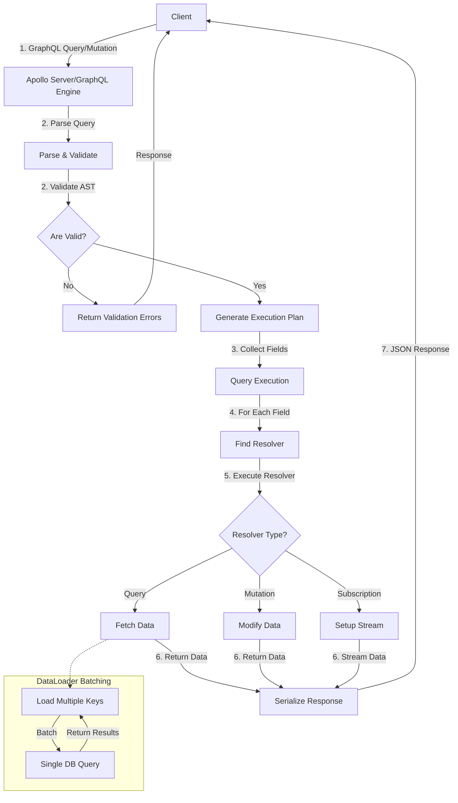

# GraphQL Pattern in Microservices

## Overview

GraphQL is a query language for APIs and a runtime for executing those queries against your data. Developed by Facebook in 2012 and released open-source in 2015, GraphQL provides a more efficient, powerful, and flexible alternative to REST. Instead of having multiple fixed endpoints that return predefined data structures, GraphQL allows clients to request exactly the data they need, nothing more and nothing less.

In microservices architectures, GraphQL serves as an abstraction layer that can aggregate data from multiple backend services into a single unified API. This pattern is particularly valuable when different consumer applications (web, mobile, third-party integrations) require different data shapes from the same underlying services.

---

## 1. GraphQL Fundamentals

### What is GraphQL?

GraphQL is a typed query language that describes how to ask for data. At its core, GraphQL allows clients to define the structure of the data they need, and the server returns exactly that structure. This eliminates over-fetching (getting more data than needed) and under-fetching (making multiple requests to get all needed data).

### Core Concepts

#### Schema Definition Language (SDL)

GraphQL uses its own type system to define the API schema:

```graphql
type User {
  id: ID!
  username: String!
  email: String!
  posts: [Post!]!
  createdAt: DateTime!
}

type Post {
  id: ID!
  title: String!
  content: String!
  author: User!
  comments: [Comment!]!
  publishedAt: DateTime
}

type Query {
  user(id: ID!): User
  users: [User!]!
  post(id: ID!): Post
}

type Mutation {
  createUser(input: CreateUserInput!): User!
  updateUser(id: ID!, input: UpdateUserInput!): User
  deleteUser(id: ID!): Boolean!
}

type Subscription {
  newPost: Post!
}
```

#### Type System

GraphQL's type system includes:

| Type | Description |
|------|-------------|
| **Scalar** | Leaf values: String, Int, Float, Boolean, ID |
| **Object** | Composite types with fields |
| **Interface** | Abstract type that concrete types implement |
| **Union** | Type that can be one of several object types |
| **Enum** | Set of discrete values |
| **Input** | Complex input types for arguments |
| **List** | Array of a specific type |
| **Non-Null** | Required field (marked with `!`) |

---

## 2. Operations: Queries, Mutations, and Subscriptions

### Queries

Query operations read data from the API. Unlike REST where each endpoint has a fixed response shape, GraphQL queries specify exactly what fields to return.

#### Basic Query

```graphql
query {
  user(id: "123") {
    id
    username
    email
  }
}
```

Response:
```json
{
  "data": {
    "user": {
      "id": "123",
      "username": "johndoe",
      "email": "john@example.com"
    }
  }
}
```

#### Nested Queries

```graphql
query {
  user(id: "123") {
    id
    username
    posts {
      id
      title
      comments {
        id
        content
        author {
          username
        }
      }
    }
  }
}
```

#### Query with Arguments

```graphql
query {
  posts(limit: 10, offset: 0, sortBy: "createdAt") {
    id
    title
    publishedAt
    author {
      username
    }
  }
}
```

#### Aliases

Aliases allow you to rename fields in the response:

```graphql
query {
  firstPost: post(id: "1") {
    id
    title
  }
  secondPost: post(id: "2") {
    id
    title
  }
}
```

#### Fragments

Fragments define reusable field sets:

```graphql
fragment UserFields on User {
  id
  username
  email
}

query {
  user(id: "123") {
    ...UserFields
  }
}
```

### Mutations

Mutation operations modify server-side data. They are executed sequentially, unlike queries which can be parallelized.

#### Basic Mutation

```graphql
mutation {
  createUser(input: {
    username: "johndoe"
    email: "john@example.com"
  }) {
    id
    username
    email
    createdAt
  }
}
```

#### Update Mutation

```graphql
mutation {
  updateUser(id: "123", input: {
    email: "newemail@example.com"
  }) {
    id
    username
    email
  }
}
```

#### Delete Mutation

```graphql
mutation {
  deleteUser(id: "123")
}
```

#### Multiple Mutations

Multiple mutations can bebatched in a single request. They execute in order:

```graphql
mutation {
  createPost1: createPost(input: { title: "First Post", content: "Content 1" }) {
    id
    title
  }
  createPost2: createPost(input: { title: "Second Post", content: "Content 2" }) {
    id
    title
  }
}
```

### Subscriptions

Subscriptions establish persistent connections for real-time data. Unlike queries and mutations, subscriptions maintain an open connection to receive data pushed from the server.

#### Subscription Definition

```graphql
type Subscription {
  newPost: Post!
  postUpdated(id: ID!): Post!
}
```

#### Client Subscription

```graphql
subscription {
  newPost {
    id
    title
    author {
      username
    }
  }
}
```

#### Using WebSockets

GraphQL subscriptions typically use WebSocket protocol (graphql-ws or similar):

```javascript
import { createClient } from 'graphql-ws';

const client = createClient({
  url: 'ws://localhost:4000/graphql',
});

client.subscribe(
  {
    query: `subscription { newPost { id title } }`,
  },
  {
    next: (data) => console.log('New post:', data),
    error: (err) => console.error('Error:', err),
    complete: () => console.log('Complete'),
  }
);
```

---

## 3. Schema Design

### Best Practices for Schema Design

#### 1. Use Descriptive Names

```graphql
type User {
  id: ID!
  firstName: String!
  lastName: String!
  emailAddress: String!
}
```

#### 2. Design for Client Needs

```graphql
type Product {
  id: ID!
  name: String!
  price: Float!
  discountedPrice: Float
  inStock: Boolean!
  stockQuantity: Int
}
```

#### 3. Use Connection Pattern for Lists

```graphql
type UserConnection {
  edges: [UserEdge!]!
  pageInfo: PageInfo!
  totalCount: Int!
}

type UserEdge {
  node: User!
  cursor: String!
}

type PageInfo {
  hasNextPage: Boolean!
  hasPreviousPage: Boolean!
  startCursor: String
  endCursor: String
}
```

#### 4. Implement Error Handling

```graphql
type CreateUserPayload {
  user: User
  errors: [UserError!]!
}

type UserError {
  field: String!
  message: String!
}

type Query {
  user(id: ID!): User
}
```

### Schema Federation

In microservices, GraphQL can federate multiple services:

```graphql
# Service A - Users
type User @key(fields: "id") {
  id: ID!
  username: String!
  email: String!
}

# Service B - Posts
type Post @key(fields: "id") {
  id: ID!
  title: String!
  author: User! @external
}
```

---

## 4. Resolvers

Resolvers are functions that fetch data for each field in the schema.

### Basic Resolver

```javascript
const resolvers = {
  Query: {
    user: (_, { id }) => {
      return database.users.findById(id);
    },
    users: () => {
      return database.users.findAll();
    },
  },
  Mutation: {
    createUser: (_, { input }) => {
      return database.users.create(input);
    },
  },
  User: {
    posts: (user) => {
      return database.posts.findByUserId(user.id);
    },
  },
};
```

### Resolver Composition

```javascript
const resolvers = {
  Query: {
    users: async () => {
      return serviceA.getUsers();
    },
  },
  User: {
    profile: async (user) => {
      return serviceB.getProfile(user.id);
    },
    posts: async (user) => {
      const userPosts = await database.posts.findByUserId(user.id);
      return userPosts;
    },
  },
  Post: {
    author: async (post) => {
      return serviceA.getUserById(post.authorId);
    },
    comments: async (post) => {
      return database.comments.findByPostId(post.id);
    },
  },
};
```

---

## 5. The N+1 Problem and Solutions

### Understanding the N+1 Problem

The N+1 query problem occurs when fetching a list of items and then fetching related items for each:

```graphql
query {
  users {
    id
    username
    posts {      # This causes N additional queries
      id
      title
    }
  }
}
```

If there are N users, this generates 1 query + N queries (one per user).

### Solution 1: DataLoader

DataLoader batches and caches requests:

```javascript
import DataLoader from 'dataloader';

const createUserLoader = () => {
  return new DataLoader(async (userIds) => {
    const users = await database.users.findByIds(userIds);
    const userMap = new Map(users.map((u) => [u.id, u]));
    return userIds.map((id) => userMap.get(id));
  });
};

const resolvers = {
  Query: {
    users: () => database.users.findAll(),
  },
  User: {
    posts: async (user, args, context) => {
      return context.postLoader.load(user.id);
    },
  },
};
```

### Solution 2: Query Batching

```javascript
const createPostLoader = () => {
  return new DataLoader(async (userIds) => {
    const posts = await database.posts.findByUserIds(userIds);
    
    const postsByUserId = posts.reduce((acc, post) => {
      if (!acc[post.userId]) {
        acc[post.userId] = [];
      }
      acc[post.userId].push(post);
      return acc;
    }, {});
    
    return userIds.map((id) => postsByUserId[id] || []);
  });
};
```

### Solution 3: AST Parsing and Pre-fetching

```javascript
const infoToFieldASTs = (info) => {
  return graphqlParse(infoAST).fieldNodes[0].selectionSet.selections;
};

const resolvers = {
  Query: {
    users: async (_, __, context, info) => {
      const fields = infoToFieldASTs(info);
      return database.users.findAllWithFields(fields);
    },
  },
};
```

---

## 6. Code Examples

### Node.js with Apollo Server

```javascript
const { ApolloServer, gql } = require('apollo-server');

const typeDefs = gql`
  type User {
    id: ID!
    username: String!
    email: String!
    posts: [Post!]!
  }

  type Post {
    id: ID!
    title: String!
    content: String!
    author: User!
  }

  type Query {
    user(id: ID!): User
    users: [User!]!
    post(id: ID!): Post
  }

  input CreateUserInput {
    username: String!
    email: String!
  }

  input CreatePostInput {
    title: String!
    content: String!
    authorId: ID!
  }

  type Mutation {
    createUser(input: CreateUserInput!): User!
    createPost(input: CreatePostInput!): Post!
  }
`;

const resolvers = {
  Query: {
    user: (_, { id }) => users.find((u) => u.id === id),
    users: () => users,
    post: (_, { id }) => posts.find((p) => p.id === id),
  },
  Mutation: {
    createUser: (_, { input }) => {
      const newUser = {
        id: String(users.length + 1),
        ...input,
      };
      users.push(newUser);
      return newUser;
    },
    createPost: (_, { input }) => {
      const newPost = {
        id: String(posts.length + 1),
        ...input,
      };
      posts.push(newPost);
      return newPost;
    },
  },
  User: {
    posts: (user) => posts.filter((p) => p.authorId === user.id),
  },
  Post: {
    author: (post) => users.find((u) => u.id === post.authorId),
  },
};

const server = new ApolloServer({ typeDefs, resolvers });

server.listen().then(({ url }) => {
  console.log(`Server ready at ${url}`);
});
```

### Python with Graphene

```python
from graphene import ObjectType, String, List, Field, Mutation, InputObjectType
from graphene import Schema, ObjectType

class User(ObjectType):
    id = String()
    username = String()
    email = String()
    posts = List(lambda: Post)

    def resolve_posts(self, info):
        return database.posts.filter(author_id=self.id)

class Post(ObjectType):
    id = String()
    title = String()
    content = String()
    author = Field(lambda: User)

    def resolve_author(self, info):
        return database.users.get(self.author_id)

class Query(ObjectType):
    user = Field(User, id=String())
    users = List(User)
    post = Field(Post, id=String())

    def resolve_user(self, info, id):
        return database.users.get(id)

    def resolve_users(self, info):
        return database.users.all()

    def resolve_post(self, info, id):
        return database.posts.get(id)

class CreateUserInput(InputObjectType):
    username = String()
    email = String()

class CreateUser(Mutation):
    class Arguments:
        input = CreateUserInput()

    User = Field(User)

    def mutate(self, info, input):
        user = database.users.create(
            username=input.username,
            email=input.email
        )
        return CreateUser(user=user)

class Mutation(ObjectType):
    create_user = CreateUser.Field()

schema = Schema(query=Query, mutation=Mutation)
```

---

## 7. Flow Chart: GraphQL Request Flow



---

## 8. Real-World Examples

### GitHub API

GitHub v4 uses GraphQL for its API, providing a powerful example of production GraphQL.

**Endpoint**: `https://api.github.com/graphql`

**Authentication**: Bearer token

**Example Query**:
```graphql
query {
  viewer {
    login
    repositories(first: 10, orderBy: {field: UPDATED_AT, direction: DESC}) {
      nodes {
        name
        description
        stargazerCount
        primaryLanguage {
          name
          color
        }
      }
    }
  }
}
```

**Response**:
```json
{
  "data": {
    "viewer": {
      "login": "username",
      "repositories": {
        "nodes": [
          {
            "name": "my-repo",
            "description": "A repository",
            "stargazerCount": 42,
            "primaryLanguage": {
              "name": "JavaScript",
              "color": "#f1e05a"
            }
          }
        ]
      }
    }
  }
}
```

**GitHub Features**:
- Strict rate limiting (5000 points/hour for authenticated)
- Cursor-based pagination
- Fragments and aliases for complex queries
- Composite queries to reduce round trips

### Shopify Admin API

Shopify uses GraphQL for its Admin API, enabling efficient e-commerce operations.

**Endpoint**: `https://{shop}.myshopify.com/admin/api/2024-01/graphql.json`

**Example Query**:
```graphql
query {
  products(first: 10) {
    edges {
      node {
        id
        title
        variants(first: 5) {
          edges {
            node {
              id
              title
              price
            }
          }
        }
      }
    }
  }
}
```

**Shopify Features**:
- Handles high-volume product catalogs
- Optimizes for mobile clients
- Bulk operations via mutations
- Real-time inventory updates

### Twitter/X API

Twitter's API v2 uses GraphQL for complex queries.

**Features**:
- Optimizes timeline fetching
- Real-time tweet streaming
- User engagement metrics

### SpaceX API

SpaceX provides a public GraphQL API for launch data.

**Endpoint**: `https://api.spacex.land/graphql`

**Example Query**:
```graphql
query {
  launchesPast(limit: 10) {
    mission_name
    launch_date_local
    rocket {
      rocket_name
    }
    launch_site {
      site_name
    }
  }
}
```

---

## 9. Best Practices

### 1. Design for Flexibility

```graphql
type Product {
  id: ID!
  name: String!
  variants: [ProductVariant!]!
  price: Float!
  compareAtPrice: Float
  images(first: 10): [Image!]!
}
```

### 2. Use Proper Error Handling

```graphql
type MutationResult {
  success: Boolean!
  errors: [Error!]!
  user: User
}

type Error {
  field: String!
  message: String!
  code: ErrorCode!
}

enum ErrorCode {
  NOT_FOUND
  ALREADY_EXISTS
  INVALID_INPUT
}
```

### 3. Implement Caching

```javascript
const cache = new InMemoryCache();

const server = new ApolloServer({
  typeDefs,
  resolvers,
  cache,
});
```

### 4. Secure Your API

```javascript
const server = new ApolloServer({
  typeDefs,
  resolvers,
  validationRules: [
    depthLimit(5),
    createComplexityLimit(1000),
  ],
});
```

### 5. Use DataLoader for Batching

```javascript
const userLoader = createUserLoader();
const postLoader = createPostLoader();
```

### 6. Monitor Performance

```javascript
const server = new ApolloServer({
  formatError: (error) => {
    console.error(error);
    return error;
  },
});
```

### 7. Version Your Schema

```graphql
type Query {
  userV1(id: ID!): User @deprecated(reason: "Use user instead")
  user(id: ID!): User
}
```

### 8. Document Your Types

```graphql
"""
Represents a user account in the system.
"""
type User {
  """
  Unique identifier for the user.
  """
  id: ID!
  
  """
  Publicly visible username.
  """
  username: String!
}
```

---

## 10. Summary

GraphQL provides a powerful alternative to REST for microservices, offering:

- **Client-controlled queries** — Request exactly the data needed
- **Single endpoint** — Simplified API surface
- **Strong typing** — Self-documenting schemas
- **Real-time subscriptions** — Push updates to clients
- **Aggregated data** — Federation across services

Key considerations for implementation:

1. Handle the N+1 problem with DataLoader
2. Design schemas for client needs
3. Implement proper error handling
4. Monitor complexity and depth
5. Secure the API appropriately

GitHub, Shopify, and other major platforms demonstrate GraphQL at scale for production microservices.

---

## References

1. GraphQL Official Documentation - https://graphql.org/
2. Apollo Server Documentation - https://www.apollographql.com/docs/apollo-server/
3. GitHub GraphQL API - https://docs.github.com/en/graphql
4. Shopify Admin API - https://shopify.dev/docs/admin-api/graphql
5. GraphQL Code Generator - https://www.graphql-code-generator.com/