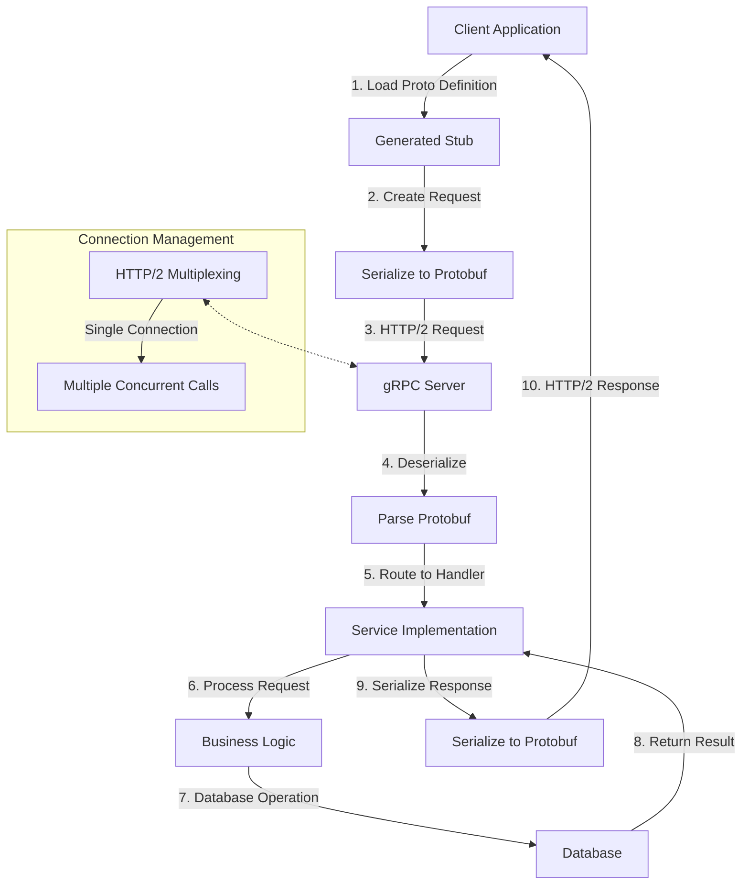

# gRPC Pattern in Microservices

## Overview

gRPC (Google Remote Procedure Call) is a high-performance, open-source framework for inter-service communication. Originally developed by Google, it uses HTTP/2 for transport and Protocol Buffers as the interface definition language (IDL) and underlying message serialization format. gRPC is particularly well-suited for microservices due to its efficiency, strong typing, and built-in support for streaming and code generation.

Unlike REST, which uses JSON over HTTP/1.1, gRPC uses Protocol Buffers (proto3) over HTTP/2, resulting in significantly smaller message sizes, faster serialization/deserialization, and the ability to multiplex multiple requests over a single connection.

---

## 1. gRPC Fundamentals

### Why gRPC?

gRPC addresses several limitations of traditional REST APIs:

- **Efficient serialization** - Protocol Buffers produce smaller messages than JSON
- **Strong typing** - IDL provides compile-time type safety
- **HTTP/2 support** - Multiplexing, header compression, bidirectional streaming
- **Code generation** - Auto-generate client/server code in multiple languages
- **Streaming** - Built-in support for server, client, and bidirectional streaming

### Core Characteristics

| Feature | REST | gRPC |
|---------|------|------|
| Protocol | HTTP/1.1 | HTTP/2 |
| Format | JSON/XML | Protocol Buffers |
| Streaming | Not native | Yes |
| Code generation | Optional/OpenAPI | Native |
| Browser support | Universal | Limited (requires gRPC-Web) |
| Learning curve | Lower | Higher |

---

## 2. Protocol Buffers

Protocol Buffers (protobuf) are Google's language-neutral, platform-neutral, extensible mechanism for serializing structured data.

### Defining Messages

```protobuf
syntax = "proto3";

package example;

message User {
  string id = 1;
  string username = 2;
  string email = 3;
  int64 created_at = 4;
  repeated Post posts = 5;
}

message Post {
  string id = 1;
  string title = 2;
  string content = 3;
  string author_id = 4;
  int64 published_at = 5;
  repeated Comment comments = 6;
}

message Comment {
  string id = 1;
  string content = 2;
  string author_id = 3;
  string post_id = 4;
  int64 created_at = 5;
}
```

### Scalar Types

| Proto Type | Python Type | Description |
|------------|-------------|-------------|
| `double` | float | 64-bit float |
| `float` | float | 32-bit float |
| `int32` | int | 32-bit signed integer |
| `int64` | int | 64-bit signed integer |
| `uint32` | int | 32-bit unsigned integer |
| `uint64` | int | 64-bit unsigned integer |
| `bool` | bool | Boolean |
| `string` | str | UTF-8 or 7-bit ASCII |
| `bytes` | bytes | Byte string |

### Message Options

```protobuf
message User {
  string id = 1 [json_name = "userId"];
  string username = 2;
  string email = 3;
}
```

### Maps

```protobuf
message Product {
  map<string, string> attributes = 1;
  map<string, int64> stock_by_warehouse = 2;
}
```

### Oneofs

```protobuf
message Notification {
  string id = 1;
  oneof content {
    string text = 2;
    Image image = 3;
  }
}

message Image {
  string url = 1;
  int32 width = 2;
  int32 height = 3;
}
```

### Enums

```protobuf
enum OrderStatus {
  ORDER_STATUS_UNSPECIFIED = 0;
  ORDER_STATUS_PENDING = 1;
  ORDER_STATUS_PROCESSING = 2;
  ORDER_STATUS_SHIPPED = 3;
  ORDER_STATUS_DELIVERED = 4;
  ORDER_STATUS_CANCELLED = 5;
}

message Order {
  string id = 1;
  OrderStatus status = 2;
}
```

---

## 3. Service Definitions

gRPC services define remote procedure call (RPC) methods that can be invoked remotely.

### Defining Services

```protobuf
service UserService {
  rpc GetUser(GetUserRequest) returns (User);
  rpc ListUsers(ListUsersRequest) returns (ListUsersResponse);
  rpc CreateUser(CreateUserRequest) returns (User);
  rpc UpdateUser(UpdateUserRequest) returns (User);
  rpc DeleteUser(DeleteUserRequest) returns (Empty);
}

message GetUserRequest {
  string id = 1;
}

message ListUsersRequest {
  int32 page_size = 1;
  string page_token = 2;
}

message ListUsersResponse {
  repeated User users = 1;
  string next_page_token = 2;
}

message CreateUserRequest {
  string username = 1;
  string email = 2;
}

message UpdateUserRequest {
  string id = 1;
  string username = 2;
  string email = 3;
}

message DeleteUserRequest {
  string id = 1;
}

message Empty {}
```

### Request and Response Patterns

#### Unary RPC

```protobuf
rpc GetUser(GetUserRequest) returns (User);
```

#### Server Streaming RPC

```protobuf
rpc ListUsers(ListUsersRequest) returns (stream User);
```

#### Client Streaming RPC

```rpc rpc UploadUsers(stream User) returns (UploadUsersResponse);
```

#### Bidirectional Streaming RPC

```protobuf
rpc Chat(stream ChatMessage) returns (stream ChatMessage);
```

---

## 4. Streaming in gRPC

### Server Streaming

Server sends multiple responses to a single client request:

```protobuf
rpc StreamPosts(GetUserRequest) returns (stream Post);
```

**Python Server**:
```python
class PostServiceServicer(post_service_pb2_grpc.PostServiceServicer):
    def StreamPosts(self, request, context):
        posts = database.posts.find_by_author_id(request.user_id)
        for post in posts:
            yield post
```

**Python Client**:
```python
stub = post_service_pb2_grpc.PostServiceStub(channel)
response_iterator = stub.StreamPosts(request)
for post in response_iterator:
    print(post)
```

### Client Streaming

Client sends multiple requests, server responds once:

```protobuf
rpc UploadPosts(stream Post) returns (UploadResponse);
```

**Python Server**:
```python
def UploadPosts(self, request_iterator, context):
    posts = []
    for post in request_iterator:
        posts.append(post)
    saved = database.posts.create_batch(posts)
    return UploadResponse(count=len(saved))
```

### Bidirectional Streaming

Both client and server send multiple messages:

```protobuf
rpc Chat(stream ChatMessage) returns (stream ChatMessage);
```

**Implementation**:
```python
def Chat(self, request_iterator, context):
    for message in request_iterator:
        # Process message and respond
        response = self.process_message(message)
        yield response
```

---

## 5. Code Examples

### Generating Code

Install protoc and gRPC plugins:

```bash
pip install grpcio grpcio-tools
```

Generate Python code:

```bash
python -m grpc_tools.protoc -I. --python_out=. --grpc_python_out=. user.proto
```

### Python Server

```python
import grpc
from concurrent import futures
import user_pb2
import user_pb2_grpc

class UserServiceServicer(user_pb2_grpc.UserServiceServicer):
    def __init__(self):
        self.users = {}
    
    def GetUser(self, request, context):
        user = self.users.get(request.id)
        if user:
            return user
        context.abort(grpc.StatusCode.NOT_FOUND, "User not found")
    
    def ListUsers(self, request, context):
        users = list(self.users.values())
        page_size = request.page_size or 10
        users_page = users[:page_size]
        return user_pb2.ListUsersResponse(
            users=users_page,
            next_page_token=str(len(users_page))
        )
    
    def CreateUser(self, request, context):
        user_id = str(len(self.users) + 1)
        user = user_pb2.User(
            id=user_id,
            username=request.username,
            email=request.email
        )
        self.users[user_id] = user
        return user
    
    def UpdateUser(self, request, context):
        if request.id not in self.users:
            context.abort(grpc.StatusCode.NOT_FOUND, "User not found")
        
        self.users[request.id].username = request.username
        self.users[request.id].email = request.email
        return self.users[request.id]
    
    def DeleteUser(self, request, context):
        if request.id in self.users:
            del self.users[request.id]
        return user_pb2.Empty()

def serve():
    server = grpc.server(futures.ThreadPoolExecutor(max_workers=10))
    user_pb2_grpc.add_UserServiceServicer_to_server(
        UserServiceServicer(), server
    )
    server.add_insecure_port('[::]:50051')
    server.start()
    server.wait_for_termination()

if __name__ == '__main__':
    serve()
```

### Python Client

```python
import grpc
import user_pb2
import user_pb2_grpc

def run():
    channel = grpc.insecure_channel('localhost:50051')
    stub = user_pb2_grpc.UserServiceStub(channel)
    
    # Create user
    response = stub.CreateUser(user_pb2.CreateUserRequest(
        username="johndoe",
        email="john@example.com"
    ))
    print(f"Created user: {response.id}")
    
    # Get user
    user = stub.GetUser(user_pb2.GetUserRequest(id=response.id))
    print(f"Got user: {user.username}, {user.email}")
    
    # List users
    response = stub.ListUsers(user_pb2.ListUsersRequest(page_size=10))
    for user in response.users:
        print(f"User: {user.username}")
    
    # Update user
    updated = stub.UpdateUser(user_pb2.UpdateUserRequest(
        id=response.id,
        username="johndoe_updated",
        email="newemail@example.com"
    ))
    print(f"Updated user: {updated.username}")
    
    # Delete user
    stub.DeleteUser(user_pb2.DeleteUserRequest(id=response.id))
    print("Deleted user")

if __name__ == '__main__':
    run()
```

### Go Server

```go
package main

import (
    "context"
    "log"
    "net"

    "google.golang.org/grpc"
    pb "github.com/example/proto"
)

type server struct {
    pb.UnimplementedUserServiceServer
    users map[string]*pb.User
}

func (s *server) GetUser(ctx context.Context, req *pb.GetUserRequest) (*pb.User, error) {
    user, ok := s.users[req.Id]
    if !ok {
        return nil, grpc.Errorf(codes.NotFound, "user not found")
    }
    return user, nil
}

func (s *server) CreateUser(ctx context.Context, req *pb.CreateUserRequest) (*pb.User, error) {
    id := fmt.Sprintf("%d", len(s.users)+1)
    user := &pb.User{
        Id:       id,
        Username: req.Username,
        Email:    req.Email,
    }
    s.users[id] = user
    return user, nil
}

func main() {
    lis, err := net.Listen("tcp", ":50051")
    if err != nil {
        log.Fatalf("failed to listen: %v", err)
    }
    
    s := grpc.NewServer()
    pb.RegisterUserServiceServer(s, &server{users: make(map[string]*pb.User)})
    
    if err := s.Serve(lis); err != nil {
        log.Fatalf("failed to serve: %v", err)
    }
}
```

---

## 6. Error Handling

gRPC uses status codes for error handling:

| Code | Description |
|------|-------------|
| OK | Success |
| CANCELLED | Operation cancelled |
| UNKNOWN | Unknown error |
| INVALID_ARGUMENT | Invalid argument |
| DEADLINE_EXCEEDED | Deadline exceeded |
| NOT_FOUND | Resource not found |
| ALREADY_EXISTS | Resource already exists |
| PERMISSION_DENIED | Permission denied |
| RESOURCE_EXHAUSTED | Resource exhausted |
| FAILED_PRECONDITION | Precondition failed |
| ABORTED | Operation aborted |
| INTERNAL | Internal error |
| UNAVAILABLE | Service unavailable |
| DATA_LOSS | Data loss |

### Error Handling in Python

```python
from grpc import StatusCode

def get_user(self, request, context):
    user = self.users.get(request.id)
    if not user:
        context.abort(
            grpc.StatusCode.NOT_FOUND,
            f"User {request.id} not found"
        )
    return user
```

### Error Handling in Client

```python
from grpc import RpcError

try:
    user = stub.GetUser(request)
except grpc.RpcError as e:
    print(f"Error: {e.code()}, {e.details()}")
```

---

## 7. Authentication and Security

### TLS/mTLS

```python
# Server with TLS
server_credentials = grpc.ssl_server_credentials(
    [(private_key, certificate)]
)

# Client with TLS
channel_credentials = grpc.ssl_channel_credentials(
    root_certificate=root_cert
)
channel = grpc.secure_channel('localhost:50051', credentials)
```

### Token-based Authentication

```python
class AuthInterceptor(grpc.ServerInterceptor):
    def __init__(self, token):
        self.token = token
    
    def intercept_service(self, continuation, handler_call_details):
        metadata = dict(handler_call_details.invocation_metadata())
        if metadata.get('authorization') != self.token:
            return unary_unary_unary_handler(
                None, None, None,
                grpc.StatusCode.UNAUTHENTICATED,
                "Invalid token"
            )
        return continuation(handler_call_details)
```

---

## 8. Flow Chart: gRPC Communication Flow



---

## 9. Real-World Examples

### Netflix

Netflix uses gRPC extensively for:

- Service-to-service communication
- Low-latency internal APIs
- High-throughput streaming

**Implementation**:
- Custom load balancing
- Circuit breaker patterns
- Service mesh integration

### CoreOS/etcd

etcd uses gRPC for:

- Distributed key-value store
- Consensus protocol communication
- Cluster health monitoring

### Dropbox

Dropbox uses gRPC for:

- Large-scale file operations
- Metadata queries
- Efficient data transfer

### Square

Square uses gRPC for:

- Payment processing
- Merchant services
- Low-latency transactions

### Google

gRPC was originally developed at Google for:

- Cloud infrastructure
- Stubby internal RPC
- Microservices communication

### Uber

Uber uses gRPC for:

- Real-time matching
- High-throughput services
- Location tracking

---

## 10. Best Practices

### 1. Design Stable APIs

```protobuf
message User {
  string id = 1;
  string username = 2;
  string email = 3;
}

message GetUserRequest {
  string id = 1;
}
```

### 2. Use Conventions

- Use singular nouns for requests
- Use plural nouns for collections
- Prefix with operation for request types

### 3. Handle Backward Compatibility

```protobuf
message User {
  string id = 1;
  string username = 2;
  optional string email = 3;
}
```

### 4. Implement Timeouts

```python
channel = grpc.insecure_channel('localhost:50051')
try:
    response = stub.Method(
        request,
        timeout=5.0
    )
except grpc.RpcError as e:
    if e.code() == grpc.StatusCode.DEADLINE_EXCEEDED:
        print("Timeout exceeded")
```

### 5. Use Proper Error Codes

| Situation | Code |
|-----------|------|
| Not found | NOT_FOUND |
| Already exists | ALREADY_EXISTS |
| Invalid input | INVALID_ARGUMENT |
| Permission denied | PERMISSION_DENIED |

### 6. Implement Health Checks

```protobuf
service Health {
  rpc Check(HealthCheckRequest) returns (HealthCheckResponse);
  rpc Watch(HealthCheckRequest) returns (stream HealthCheckResponse);
}
```

### 7. Monitor and Debug

```python
import grpc
grpc.enable_health_serving()
```

### 8. Use Connection Pooling

```python
channel_pool = grpc.pool(
    lambda: grpc.insecure_channel('localhost:50051')
)
```

### 9. Document Your Services

```protobuf
// UserService handles user operations.
//
// ## GetUser
// Retrieves a user by ID.
//
// ## CreateUser
// Creates a new user.
service UserService {
  // ...
}
```

### 10. Version Your Proto Files

```protobuf
package example.v1;

message User {
  // ...
}
```

---

## 11. Summary

gRPC provides a powerful, efficient communication pattern for microservices:

- **High performance** - HTTP/2 + Protocol Buffers
- **Strong typing** - IDL provides contract-first design
- **Streaming** - Native support for all streaming modes
- **Code generation** - Multi-language support
- **Polyglot** - Works with many programming languages

Key implementation considerations:

1. Use stable, backward-compatible proto designs
2. Implement proper error handling
3. Configure timeouts and retries
4. Monitor service health
5. Plan for evolvability

Companies like Netflix, Google, and Dropbox demonstrate gRPC at scale for production microservices.

---

## References

1. gRPC Documentation - https://grpc.io/docs/
2. Protocol Buffers Documentation - https://developers.google.com/protocol-buffers
3. gRPC Python Tutorial - https://grpc.io/docs/languages/python/
4. gRPC Go Tutorial - https://grpc.io/docs/languages/go/
5. Protocol Buffers GitHub - https://github.com/protocolbuffers/protobuf