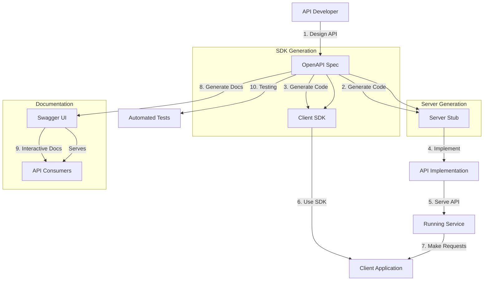

# OpenAPI Specification in Microservices

## Overview

The OpenAPI Specification (OAS) is a vendor-neutral, language-agnostic standard for describing RESTful APIs. Formerly known as Swagger Specification, OpenAPI provides a machine-readable and human-readable interface definition that enables developers, testers, and automated tools to understand and interact with API capabilities without access to source code.

In microservices architectures, OpenAPI specifications serve as contracts between services, documentation for consumers, and blueprints for code generation. They enable API discovery, automated testing, client SDK generation, and interactive documentation portals.

---

## 1. OpenAPI Fundamentals

### What is OpenAPI?

OpenAPI is a specification format that describes:

- All available endpoints and their URLs
- HTTP methods for each endpoint
- Request parameters and body formats
- Response structures and status codes
- Authentication requirements
- Contact information and licensing

### OpenAPI Versions

| Version | Release Date | Key Features |
|---------|--------------|---------------|
| 2.0 (Swagger) | 2014 | JSON Schema support |
| 3.0.0 | 2017 | Multiple examples, callbacks |
| 3.0.1 | 2018 | Clarifications |
| 3.0.2 | 2018 | Bug fixes |
| 3.0.3 | 2020 | Improved clarity |
| 3.1.0 | 2021 | Schema守法, nullable arrays |

### Basic Structure

```yaml
openapi: 3.0.3
info:
  title: User API
  description: API for managing users
  version: 1.0.0
servers:
  - url: https://api.example.com/v1
paths:
  /users:
    get:
      summary: List all users
      responses:
        '200':
          description: Successful response
components:
  schemas:
    User:
      type: object
      properties:
        id:
          type: string
        username:
          type: string
```

---

## 2. API Metadata and Documentation

### Info Object

```yaml
info:
  title: E-Commerce API
  description: |
    REST API for the E-Commerce platform.
    
    ## Features
    - User management
    - Product catalog
    - Order processing
    - Payment integration
  termsOfService: https://example.com/terms
  contact:
    name: API Support
    url: https://example.com/support
    email: support@example.com
  license:
    name: MIT
    url: https://opensource.org/licenses/MIT
  version: 1.0.0
```

### Server Object

```yaml
servers:
  - url: https://api.example.com/v1
    description: Production server
  - url: https://staging-api.example.com/v1
    description: Staging server
  - url: http://localhost:3000
    description: Local development server
```

### External Documentation

```yaml
externalDocs:
  description: API Documentation
  url: https://docs.example.com/api
```

---

## 3. Paths and Operations

### Basic Path Definition

```yaml
paths:
  /users:
    get:
      summary: Get all users
      description: Returns a paginated list of users
      operationId: getUsers
      tags:
        - Users
      parameters:
        - name: page
          in: query
          description: Page number
          schema:
            type: integer
            default: 1
        - name: limit
          in: query
          description: Items per page
          schema:
            type: integer
            default: 10
            maximum: 100
      responses:
        '200':
          description: Successful response
          content:
            application/json:
              schema:
                $ref: '#/components/schemas/UsersResponse'
```

### HTTP Methods

```yaml
paths:
  /users/{userId}:
    get:
      summary: Get user by ID
      operationId: getUserById
      parameters:
        - name: userId
          in: path
          required: true
          schema:
            type: string
      responses:
        '200':
          description: User found
          content:
            application/json:
              schema:
                $ref: '#/components/schemas/User'
        '404':
          description: User not found
    
    put:
      summary: Update user
      operationId: updateUser
      requestBody:
        content:
          application/json:
            schema:
              $ref: '#/components/schemas/UpdateUserRequest'
      responses:
        '200':
          description: User updated
        '400':
          description: Invalid input
    
    delete:
      summary: Delete user
      operationId: deleteUser
      responses:
        '204':
          description: User deleted
```

### Operation Objects

```yaml
post:
  summary: Create a new user
  operationId: createUser
  deprecated: false
  tags:
    - Users
  security:
    - BearerAuth: []
  requestBody:
    description: User to create
    required: true
    content:
      application/json:
        schema:
          $ref: '#/components/schemas/CreateUserRequest'
        example:
          username: johndoe
          email: john@example.com
  responses:
    '201':
      description: User created
      headers:
        Location:
          schema:
            type: string
          description: URL of created user
      content:
        application/json:
          schema:
            $ref: '#/components/schemas/User'
    '400':
      description: Validation error
      content:
        application/json:
          schema:
            $ref: '#/components/schemas/Error'
```

---

## 4. Request Bodies and Responses

### Schema Definitions

```yaml
components:
  schemas:
    User:
      type: object
      required:
        - username
        - email
      properties:
        id:
          type: string
          readOnly: true
        username:
          type: string
          minLength: 3
          maxLength: 50
          pattern: '^[a-zA-Z0-9_]+$'
        email:
          type: string
          format: email
        firstName:
          type: string
        lastName:
          type: string
        createdAt:
          type: string
          format: date-time
          readOnly: true
        updatedAt:
          type: string
          format: date-time
          readOnly: true
    
    CreateUserRequest:
      type: object
      required:
        - username
        - email
      properties:
        username:
          type: string
        email:
          type: string
        firstName:
          type: string
        lastName:
          type: string
    
    UsersResponse:
      type: object
      properties:
        data:
          type: array
          items:
            $ref: '#/components/schemas/User'
        page:
          type: integer
        limit:
          type: integer
        total:
          type: integer
    
    Error:
      type: object
      properties:
        code:
          type: string
        message:
          type: string
        details:
          type: array
          items:
            type: object
            properties:
              field:
                type: string
              message:
                type: string
```

### JSON Schema Compatibility

OpenAPI 3.0 uses JSON Schema Draft 5 for schema definitions:

```yaml
User:
  type: object
  additionalProperties: false
  properties:
    id:
      type: string
    metadata:
      type: object
      additionalProperties:
        type: string
```

### Array Responses

```yaml
responses:
  '200':
    description: List of users
    content:
      application/json:
        schema:
          type: array
          items:
            $ref: '#/components/schemas/User'
        example:
          - id: '1'
            username: johndoe
            email: john@example.com
```

---

## 5. Security Schemes

### Security Scheme Definition

```yaml
components:
  securitySchemes:
    BearerAuth:
      type: http
      scheme: bearer
      bearerFormat: JWT
    
    ApiKeyAuth:
      type: apiKey
      in: header
      name: X-API-Key
    
    BasicAuth:
      type: http
      scheme: basic
    
    OAuth2Password:
      type: oauth2
      flows:
        password:
          tokenUrl: /auth/token
          scopes:
            read: Read access
            write: Write access
```

### Applying Security

```yaml
paths:
  /users:
    get:
      summary: Get users
      security:
        - BearerAuth: []
        - ApiKeyAuth: []
    post:
      summary: Create user
      security:
        - BearerAuth:
            - write
```

---

## 6. Documentation with Swagger UI

### Enabling Swagger UI

Most frameworks provide automatic OpenAPI documentation:

### Python (Flask)

```python
from flask import Flask
from flasgger import Swagger

app = Flask(__name__)

swagger = Swagger(app)

@app.route('/api/users')
def get_users():
    """
    Get all users
    ---
    tags:
      - Users
    responses:
      200:
        description: List of users
    """
    return []
```

### Python (FastAPI)

```python
from fastapi import FastAPI
from fastapi.openapi.utils import get_openapi

app = FastAPI()

@app.get('/users')
def get_users():
    """
    Get all users
    """
    return []
```

### Java (Spring Boot)

```xml
<dependency>
    <groupId>org.springdoc</groupId>
    <artifactId>springdoc-openapi-ui</artifactId>
    <version>2.0.0</version>
</dependency>
```

---

## 7. Code Generation

### Generating Client SDKs

OpenAPI enables code generation for multiple languages:

### Using OpenAPI Generator

```bash
npm install -g @openapitools/openapi-generator-cli

openapi-generator-cli generate \
  -i openapi.yaml \
  -g python \
  -o ./client/python
```

### Supported Languages

| Generator | Language |
|------------|-----------|
| `python` | Python |
| `java` | Java |
| `csharp` | C# |
| `go` | Go |
| `nodejs` | Node.js |
| `ruby` | Ruby |
| `php` | PHP |
| `typescript-angular` | TypeScript/Angular |
| `swift5` | Swift |

### Generated Client Example

```python
import openapi_client
from openapi_client.rest import ApiException

configuration = openapi_client.Configuration()
configuration.host = "https://api.example.com/v1"
configuration.access_token = "Bearer xxx"

api_client = openapi_client.ApiClient(configuration)
users_api = openapi_client.UsersApi(api_client)

try:
    users = users_api.get_users()
    for user in users.data:
        print(user.username)
except ApiException as e:
    print(f"Exception: {e}")
```

---

## 8. Complete Example

### Full OpenAPI Specification

```yaml
openapi: 3.0.3
info:
  title: User Management API
  description: API for managing user accounts
  termsOfService: https://example.com/terms
  contact:
    name: API Support
    email: support@example.com
  license:
    name: MIT
    url: https://opensource.org/licenses/MIT
  version: 1.0.0

servers:
  - url: https://api.example.com/v1
    description: Production
  - url: https://staging-api.example.com/v1
    description: Staging

tags:
  - name: Users
    description: User management operations

paths:
  /users:
    get:
      summary: List all users
      description: Returns paginated list of users
      operationId: listUsers
      tags:
        - Users
      parameters:
        - name: page
          in: query
          schema:
            type: integer
            default: 1
        - name: limit
          in: query
          schema:
            type: integer
            default: 10
            maximum: 100
        - name: sortBy
          in: query
          schema:
            type: string
            enum: [username, created_at]
            default: created_at
        - name: order
          in: query
          schema:
            type: string
            enum: [asc, desc]
            default: desc
      security:
        - BearerAuth: [read]
      responses:
        '200':
          description: Paginated user list
          content:
            application/json:
              schema:
                $ref: '#/components/schemas/UsersListResponse'
        '401':
          $ref: '#/components/responses/Unauthorized'
        '429':
          $ref: '#/components/responses/RateLimited'

    post:
      summary: Create a new user
      operationId: createUser
      tags:
        - Users
      requestBody:
        description: User data
        required: true
        content:
          application/json:
            schema:
              $ref: '#/components/schemas/CreateUserRequest'
      security:
        - BearerAuth: [write]
      responses:
        '201':
          description: User created
          content:
            application/json:
              schema:
                $ref: '#/components/schemas/User'
        '400':
          $ref: '#/components/responses/BadRequest'
        '409':
          $ref: '#/components/responses/Conflict'

  /users/{userId}:
    parameters:
      - name: userId
        in: path
        required: true
        schema:
          type: string

    get:
      summary: Get user by ID
      operationId: getUser
      tags:
        - Users
      security:
        - BearerAuth: [read]
      responses:
        '200':
          description: User details
          content:
            application/json:
              schema:
                $ref: '#/components/schemas/User'
        '404':
          $ref: '#/components/responses/NotFound'

    put:
      summary: Update user
      operationId: updateUser
      tags:
        - Users
      requestBody:
        description: User data
        required: true
        content:
          application/json:
            schema:
              $ref: '#/components/schemas/UpdateUserRequest'
      security:
        - BearerAuth: [write]
      responses:
        '200':
          description: User updated
          content:
            application/json:
              schema:
                $ref: '#/components/schemas/User'
        '400':
          $ref: '#/components/responses/BadRequest'
        '404':
          $ref: '#/components/responses/NotFound'

    delete:
      summary: Delete user
      operationId: deleteUser
      tags:
        - Users
      security:
        - BearerAuth: [write]
      responses:
        '204':
          description: User deleted
        '404':
          $ref: '#/components/responses/NotFound'

components:
  schemas:
    User:
      type: object
      required:
        - username
        - email
      properties:
        id:
          type: string
          readOnly: true
        username:
          type: string
          minLength: 3
          maxLength: 50
        email:
          type: string
          format: email
        firstName:
          type: string
          maxLength: 100
        lastName:
          type: string
          maxLength: 100
        status:
          type: string
          enum: [active, inactive, suspended]
          default: active
        createdAt:
          type: string
          format: date-time
          readOnly: true
        updatedAt:
          type: string
          format: date-time
          readOnly: true

    CreateUserRequest:
      type: object
      required:
        - username
        - email
      properties:
        username:
          type: string
        email:
          type: string
        firstName:
          type: string
        lastName:
          type: string

    UpdateUserRequest:
      type: object
      properties:
        username:
          type: string
        email:
          type: string
        firstName:
          type: string
        lastName:
          type: string

    UsersListResponse:
      type: object
      properties:
        data:
          type: array
          items:
            $ref: '#/components/schemas/User'
        pagination:
          $ref: '#/components/schemas/Pagination'

    Pagination:
      type: object
      properties:
        page:
          type: integer
        limit:
          type: integer
        total:
          type: integer
        hasMore:
          type: boolean

    Error:
      type: object
      properties:
        code:
          type: string
        message:
          type: string
        details:
          type: array
          items:
            $ref: '#/components/schemas/FieldError'

    FieldError:
      type: object
      properties:
        field:
          type: string
        message:
          type: string

  securitySchemes:
    BearerAuth:
      type: http
      scheme: bearer
      bearerFormat: JWT

  responses:
    BadRequest:
      description: Bad request
      content:
        application/json:
          schema:
            $ref: '#/components/schemas/Error'
    Unauthorized:
      description: Unauthorized
      content:
        application/json:
          schema:
            $ref: '#/components/schemas/Error'
    NotFound:
      description: Not found
      content:
        application/json:
          schema:
            $ref: '#/components/schemas/Error'
    Conflict:
      description: Conflict
      content:
        application/json:
          schema:
            $ref: '#/components/schemas/Error'
    RateLimited:
      description: Too many requests
      headers:
        Retry-After:
          schema:
            type: integer
      content:
        application/json:
          schema:
            $ref: '#/components/schemas/Error'

externalDocs:
  description: User Guide
  url: https://docs.example.com/users
```

---

## 9. Flow Chart: OpenAPI Lifecycle



---

## 10. Real-World Examples

### Stripe API

Stripe provides comprehensive OpenAPI specification:

**Base URL**: `https://api.stripe.com/v1`

**Features**:
- Well-documented schemas
- Error handling definitions
- Pagination support

**Example Endpoints**:
```yaml
paths:
  /v1/customers:
    get:
      summary: List all customers
      responses:
        '200':
          description: List of customers
```

**OpenAPI Integration**:
- Stripe SDK generated from OpenAPI
- Interactive API explorer
- Type-safe client libraries

### Twilio

Twilio uses OpenAPI for their communication APIs:

**Features**:
- Voice, SMS, video APIs
- Code generation for multiple languages
- Interactive documentation

### Shopify

Shopify Admin API: https://shopify.dev/docs/admin-api

**Features**:
- REST Management API
- GraphQL API alongside REST
- Webhook event definitions

### Microsoft

Microsoft uses OpenAPI for Azure APIs:

**Examples**:
- Azure Compute API
- Azure Storage API
- Azure Network API

### Amazon

AWS provides OpenAPI definitions:

**Services**:
- API Gateway
- Lambda
- SAM CLI

---

## 11. Best Practices

### 1. Use OpenAPI 3.0+

```yaml
openapi: 3.0.3
```

### 2. Document Everything

```yaml
info:
  title: User API
  description: |
    Complete user management API.
    ## Authentication
    Use Bearer token for authentication.
```

### 3. Version Your API

```yaml
info:
  version: 1.0.0

paths:
  /v1/users:
    get:
      # ...
```

### 4. Use Semantic Tags

```yaml
tags:
  - name: Users
    description: User management operations
  - name: Products
    description: Product catalog operations
```

### 5. Define Error Responses

```yaml
components:
  responses:
    NotFound:
      description: Resource not found
      content:
        application/json:
          schema:
            $ref: '#/components/schemas/Error'
```

### 6. Use Proper HTTP Status Codes

| Code | Usage |
|------|-------|
| 200 | Successful GET, PUT, PATCH |
| 201 | Successful POST (created) |
| 204 | Successful DELETE |
| 400 | Invalid request |
| 401 | Unauthorized |
| 403 | Forbidden |
| 404 | Not found |
| 429 | Rate limited |

### 7. Provide Examples

```yaml
components:
  examples:
    User:
      summary: Example user
      value:
        id: '123'
        username: johndoe
        email: john@example.com
```

### 8. Use Reusable Components

```yaml
components:
  schemas:
    User:
      $ref: '#/components/schemas/User'
```

### 9. Secure Your API

```yaml
security:
  - BearerAuth: []
```

### 10. Host Documentation

```yaml
servers:
  - url: https://api.example.com/v1
```

---

## 12. Summary

OpenAPI Specification provides essential infrastructure for microservices:

- **Contract definition** - Machine-readable API contracts
- **Documentation** - Interactive, auto-generated docs
- **Code generation** - Type-safe clients and servers
- **Testing** - Automated API testing
- **Discovery** - API catalog and exploration

Key implementation considerations:

1. Use OpenAPI 3.0+ for best features
2. Document everything thoroughly
3. Define error responses
4. Version your API
5. Use semantic tags
6. Provide examples
7. Enable automatic generation
8. Host documentation

Stripe, Twilio, Microsoft, and other major platforms demonstrate OpenAPI at scale for production microservices.

---

## References

1. OpenAPI Specification - https://spec.openapis.org/
2. Swagger Tools - https://swagger.io/tools/
3. OpenAPI Generator - https://openapi-generator.tech/
4. Stripe OpenAPI - https://stripe.com/docs/openapi
5. Redoc Documentation - https://redocly.com/