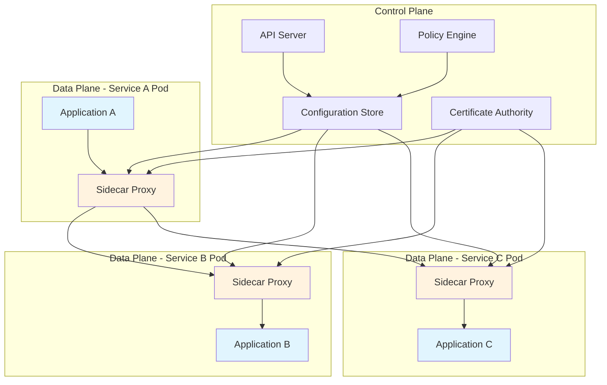

# Service Mesh Communication

## Overview

A service mesh is a dedicated infrastructure layer for handling service-to-service communication in microservices architectures. It provides a transparent, language-agnostic way to manage cross-cutting concerns like traffic management, security, and observability without modifying application code. The service mesh moves these concerns out of the application layer and into the infrastructure layer, allowing developers to focus on business logic while operators maintain control over network behavior.

The core components of a service mesh include data plane and control plane. The data plane consists of sidecar proxies (typically Envoy) deployed alongside each service instance, handling all network traffic between services. The control plane manages the configuration, certificates, and policies that govern how the data plane behaves. This separation allows for centralized management while maintaining distributed enforcement at the edge.

Service meshes solve many challenges inherent in microservices communication, including service discovery, load balancing, circuit breaking, retries, timeouts, and security. By abstracting these patterns into the infrastructure layer, applications become more portable and operators gain fine-grained control over traffic flow and security policies.

---

## Flow Chart: Service Mesh Architecture



---

## Standard Example

### Istio Service Mesh Implementation

This example demonstrates setting up Istio with sidecar injection, virtual services, and destination rules for traffic management.

**1. Namespace with Sidecar Injection Enabled:**

```yaml
apiVersion: v1
kind: Namespace
metadata:
  name: production
  labels:
    istio-injection: enabled
```

**2. Virtual Service for Traffic Routing:**

```yaml
apiVersion: networking.istio.io/v1beta1
kind: VirtualService
metadata:
  name: orders-service
  namespace: production
spec:
  hosts:
    - orders-service
  http:
    - match:
        - headers:
            X-Canary:
              exact: "true"
      route:
        - destination:
            host: orders-service
            subset: v2
          weight: 20
        - destination:
            host: orders-service
            subset: v1
          weight: 80
    - route:
        - destination:
            host: orders-service
            subset: v1
```

**3. Destination Rule for Load Balancing:**

```yaml
apiVersion: networking.istio.io/v1beta1
kind: DestinationRule
metadata:
  name: orders-service
  namespace: production
spec:
  host: orders-service
  trafficPolicy:
    connectionPool:
      tcp:
        maxConnections: 100
      http:
        h2UpgradePolicy: UPGRADE
        http1MaxPendingRequests: 100
        http2MaxRequests: 1000
    loadBalancer:
      simple: LEAST_REQUEST
    outlierDetection:
      consecutive5xxErrors: 5
      interval: 30s
      baseEjectionTime: 30s
  subsets:
    - name: v1
      labels:
        version: v1.0.0
    - name: v2
      labels:
        version: v2.0.0
```

**4. PeerAuthentication for mTLS:**

```yaml
apiVersion: security.istio.io/v1beta1
kind: PeerAuthentication
metadata:
  name: default
  namespace: production
spec:
  mtls:
    mode: STRICT
```

**5. AuthorizationPolicy:**

```yaml
apiVersion: security.istio.io/v1beta1
kind: AuthorizationPolicy
metadata:
  name: orders-viewer
  namespace: production
spec:
  selector:
    matchLabels:
      app: orders-service
  rules:
    - from:
        - source:
            principals:
              - cluster.local/ns/production/sa/frontend-service
      to:
        - operation:
            methods: ["GET"]
            paths: ["/api/orders/*"]
```

### Linkerd Service Mesh Example

**1. Deploy Linkerd:**

```bash
linkerd install | kubectl apply -f -
linkerd viz install | kubectl apply -f -
```

**2. Service Profile:**

```yaml
apiVersion: linkerd.io/v1alpha2
kind: ServiceProfile
metadata:
  name: orders-service.default.svc.cluster.local
  namespace: default
spec:
  routes:
    - name: GET /api/orders
      condition:
        path: /api/orders
        method: GET
      timeout: 500ms
      retryBudget:
        maxRetriesPerRequest: 3
        minRetriesPerSecond: 10
    - name: POST /api/orders
      condition:
        path: /api/orders
        method: POST
      timeout: 2s
```

---

## Real-World Examples

### E-Commerce Platform Service Mesh

A large e-commerce platform implements Istio to manage communication between 50+ microservices across multiple clusters. The architecture handles order processing, inventory management, payment processing, and user authentication services.

**Implementation Details:**

The platform uses Istio's ingress gateway for external traffic, with internal services communicating exclusively through mTLS-encrypted sidecar proxies. Traffic splitting allows gradual rollout of new versions, with 10% of traffic directed to canary releases before full deployment. Circuit breakers prevent cascading failures when dependent services become unresponsive.

Key configurations include destination rules with connection pooling for high-traffic services, retry policies with exponential backoff for transient failures, and rate limiting at the ingress to prevent service degradation during traffic spikes.

### Financial Services Microservices

A banking institution uses Linkerd for secure, compliant service communication across regulated microservices handling transactions, accounts, and customer data.

**Security Implementation:**

All inter-service communication requires mTLS with certificate rotation every 24 hours. Fine-grained authorization policies restrict service access based on service identity and operation type. Audit logging captures all service-to-service calls for compliance reporting.

The service mesh provides observability through distributed tracing, allowing investigators to trace transaction flows across multiple services. Custom metrics track service-level objectives (SLOs) like latency percentiles and error rates.

### Healthcare Data Platform

A healthcare provider implements a service mesh to secure PHI (Protected Health Information) transfers between microservices handling patient records, appointments, and billing.

**Compliance Features:**

Strict mTLS withSPIFFE certificate validation ensures only authorized services can access patient data. Network policies restrict pod-to-pod communication to only necessary paths. Traffic mirroring enables testing of new versions against production traffic without affecting live systems.

---

## Best Practices

### 1. Enable mTLS Everywhere

Configure strict mutual TLS for all service-to-service communication. Use auto-injection to ensure all pods receive sidecar proxies with certificates. Implement certificate rotation without service disruption. Consider using service mesh CA for automated certificate management.

```yaml
apiVersion: security.istio.io/v1beta1
kind: PeerAuthentication
metadata:
  name: default
spec:
  mtls:
    mode: STRICT
```

### 2. Implement Progressive Traffic Shifting

Use canary deployments to gradually shift traffic between versions. Start with small percentage (5-10%) and increase based on metrics. Monitor error rates and latency before full rollout. Always maintain rollback capability.

### 3. Configure Appropriate Timeouts

Set request timeouts based on service-level objectives. Configure connect, read, and write timeouts separately. Use circuit breakers to prevent resource exhaustion. Implement retry policies with exponential backoff.

### 4. Enable Observability Components

Deploy tracing, logging, and metrics collection from the start. Use service mesh telemetry for automatic metrics collection. Configure sampling rates to balance overhead and visibility. Create dashboards for key service metrics.

### 5. Apply Network Policies

Implement Kubernetes NetworkPolicies alongside service mesh policies. Restrict pod communication to necessary services only. Use namespace isolation for different environments. Apply egress controls for external service access.

### 6. Monitor Performance Overhead

Measure the latency and resource impact of sidecar proxies. Consider proxy resource limits based on service traffic patterns. Monitor proxy memory usage and connection counts. Tune connection pool settings for high-throughput services.

### 7. Plan for Failure Modes

Configure circuit breakers with appropriate thresholds. Define fallback behaviors for service unavailability. Test failure scenarios regularly. Document recovery procedures for common failure modes.

---

## Additional Considerations

### Service Mesh Comparison

**Istio** offers comprehensive features with extensive customization options. It integrates well with Kubernetes and provides powerful traffic management capabilities. The learning curve is steeper, and resource overhead is higher.

**Linkerd** prioritizes simplicity and operational ease. It has lighter resource requirements and faster deployment. Feature set is more focused, with excellent documentation and community support.

**Consul Connect** provides service mesh capabilities with strong HashiCorp ecosystem integration. It works well with both Kubernetes and VM-based deployments.

### Migration Strategy

Start by deploying the service mesh in non-production environments. Enable sidecar injection incrementally by namespace. Gradually move traffic management to mesh-controlled routing. Implement security policies after traffic management stabilizes.
