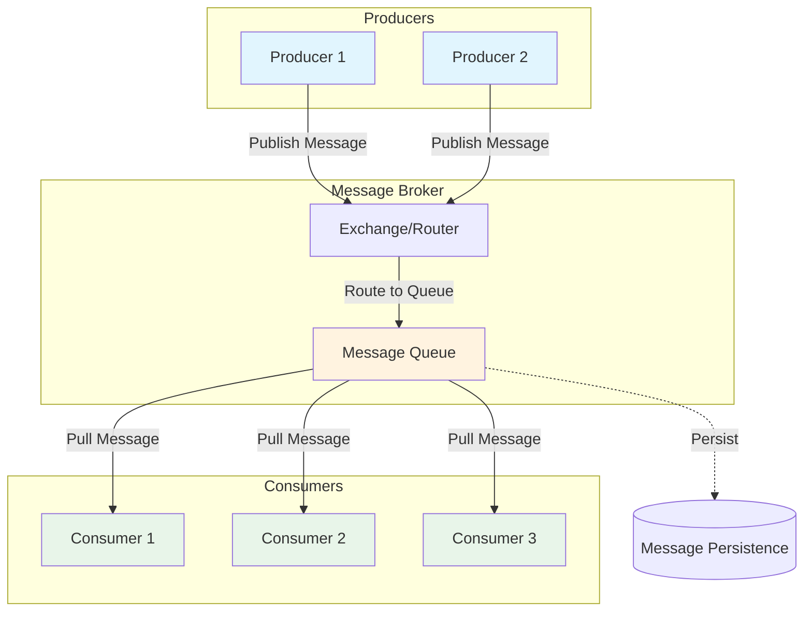

# Message Queue Pattern

## Overview

The message queue pattern is a fundamental asynchronous communication pattern in microservices architectures where messages are placed in a queue for later processing by consumer services. This pattern decouples producers from consumers, allowing them to operate independently and at different rates. The message queue acts as a temporary storage mechanism, holding messages until they are processed by authorized consumers.

Message queues provide several key capabilities that make them essential for scalable distributed systems. They enable load leveling by buffering traffic spikes during peak periods, ensuring that services are not overwhelmed by sudden requests. The pattern also provides reliability through message persistence, ensuring that messages are not lost during system failures or service restarts. Additionally, message queues support prioritized processing, allowing critical messages to be handled before less urgent ones.

The core components of the message queue pattern include producers that create and send messages, the message queue infrastructure that stores and routes messages, and consumers that retrieve and process messages. Producers and consumers communicate through a message broker that manages the queue, handles routing, and ensures delivery guarantees. This architecture allows producers to continue processing without waiting for consumers to complete their work, significantly improving system throughput and responsiveness.

Message queues support different delivery semantics that determine how messages are processed. At-most-once delivery ensures messages are delivered zero or one time but may be lost. At-least-once delivery guarantees messages are processed but may be duplicated. Exactly-once delivery, while more complex, ensures messages are processed exactly one time, eliminating both loss and duplication.

---

## Flow Chart: Message Queue Pattern



---

## Standard Example

### RabbitMQ Implementation

This example demonstrates setting up message queues with multiple producers and consumers, including dead letter handling.

**1. RabbitMQ Configuration with Spring Boot:**

```java
import org.springframework.amqp.core.*;
import org.springframework.amqp.rabbit.connection.CachingConnectionFactory;
import org.springframework.amqp.rabbit.connection.ConnectionFactory;
import org.springframework.amqp.rabbit.core.RabbitTemplate;
import org.springframework.amqp.support.converter.Jackson2JsonMessageConverter;
import org.springframework.amqp.support.converter.MessageConverter;
import org.springframework.context.annotation.Bean;
import org.springframework.context.annotation.Configuration;

@Configuration
public class RabbitMQConfig {

    @Bean
    public Queue orderQueue() {
        return QueueBuilder.durable("orders.queue")
                .withArgument("x-dead-letter-exchange", "dlx.exchange")
                .withArgument("x-dead-letter-routing-key", "dlq.routing.key")
                .build();
    }

    @Bean
    public Queue deadLetterQueue() {
        return QueueBuilder.durable("orders.dlq").build();
    }

    @Bean
    public DirectExchange orderExchange() {
        return new DirectExchange("orders.exchange");
    }

    @Bean
    public DirectExchange deadLetterExchange() {
        return new DirectExchange("dlx.exchange");
    }

    @Bean
    public Binding orderBinding(Queue orderQueue, DirectExchange orderExchange) {
        return BindingBuilder.bind(orderQueue)
                .to(orderExchange)
                .with("orders.routing.key");
    }

    @Bean
    public Binding dlqBinding(Queue deadLetterQueue, DirectExchange deadLetterExchange) {
        return BindingBuilder.bind(deadLetterQueue)
                .to(deadLetterExchange)
                .with("dlq.routing.key");
    }

    @Bean
    public MessageConverter jsonMessageConverter() {
        return new Jackson2JsonMessageConverter();
    }

    @Bean
    public RabbitTemplate rabbitTemplate(ConnectionFactory connectionFactory) {
        RabbitTemplate template = new RabbitTemplate(connectionFactory);
        template.setMessageConverter(jsonMessageConverter());
        return template;
    }
}
```

**2. Producer Service:**

```java
import org.springframework.amqp.rabbit.core.RabbitTemplate;
import org.springframework.stereotype.Service;

@Service
public class OrderProducerService {

    private final RabbitTemplate rabbitTemplate;

    public OrderProducerService(RabbitTemplate rabbitTemplate) {
        this.rabbitTemplate = rabbitTemplate;
    }

    public void sendOrder(Order order) {
        rabbitTemplate.convertAndSend(
            "orders.exchange",
            "orders.routing.key",
            order,
            message -> {
                message.getMessageProperties().setDeliveryMode(MessageDeliveryMode.PERSISTENT);
                message.getMessageProperties().setPriority(order.getPriority());
                return message;
            }
        );
    }

    public void sendOrderBatch(List<Order> orders) {
        orders.forEach(this::sendOrder);
    }
}
```

**3. Consumer Service with Acknowledgment:**

```java
import org.springframework.amqp.rabbit.annotation.RabbitListener;
import org.springframework.stereotype.Service;

@Service
public class OrderConsumerService {

    private final OrderProcessingService processingService;

    public OrderConsumerService(OrderProcessingService processingService) {
        this.processingService = processingService;
    }

    @RabbitListener(queues = "orders.queue")
    public void handleOrder(Order order, Message message, Channel channel) 
            throws IOException {
        long deliveryTag = message.getMessageProperties().getDeliveryTag();
        
        try {
            processingService.processOrder(order);
            channel.basicAck(deliveryTag, false);
        } catch (Exception e) {
            channel.basicNack(deliveryTag, false, true);
        }
    }
}
```

**4. Priority Queue Configuration:**

```java
@Bean
public Queue priorityQueue() {
    return QueueBuilder.durable("priority.orders.queue")
            .withArgument("x-max-priority", 10)
            .build();
}
```

### ActiveMQ Classic Implementation

```java
import org.apache.activemq.ActiveMQConnectionFactory;
import javax.jms.*;

public class OrderProducer implements Runnable {
    
    private final ConnectionFactory connectionFactory;
    private final String queueName;

    public OrderProducer(ConnectionFactory connectionFactory, String queueName) {
        this.connectionFactory = connectionFactory;
        this.queueName = queueName;
    }

    @Override
    public void run() {
        try (Connection connection = connectionFactory.createConnection()) {
            Session session = connection.createSession(false, Session.AUTO_ACKNOWLEDGE);
            Queue queue = session.createQueue(queueName);
            MessageProducer producer = session.createProducer(queue);
            producer.setDeliveryMode(DeliveryMode.PERSISTENT);

            Order order = new Order("ORD-001", "product-123", 2);
            ObjectMessage message = session.createObjectMessage(order);
            message.setIntProperty("priority", 1);
            message.setLongProperty("timestamp", System.currentTimeMillis());

            producer.send(message);
        } catch (JMSException e) {
            e.printStackTrace();
        }
    }
}
```

---

## Real-World Examples

### E-Commerce Order Processing System

A large e-commerce platform uses RabbitMQ to handle order processing across multiple services. Orders placed by customers enter a message queue where they are processed asynchronously by inventory, payment, and shipping services.

**Implementation Details:**

The system uses a priority queue for different order types, with premium customers' orders receiving higher priority. Failed processing attempts trigger dead letter queue handling, where messages are inspected and reprocessed after addressing issues. The message TTL ensures stale messages are automatically discarded, preventing queue buildup.

Processing involves checking inventory availability, authorizing payment, generating shipping labels, and sending confirmation emails. Each step publishes events to other queues for downstream processing, maintaining loose coupling between services.

### Financial Transaction Processing

A banking system implements message queues for processing transactions between accounts, handling deposits, withdrawals, and transfers with guaranteed delivery.

**Reliability Features:**

All transactions use persistent messages with publisher confirms to ensure no messages are lost. The system implements idempotency checks using correlation IDs to prevent duplicate processing. Transactions are processed in FIFO order to maintain consistency.

The architecture includes multiple consumer instances for high availability, with message acknowledgment only after successful database commits. Circuit breakers pause consumption during downstream service failures to prevent message accumulation.

### IoT Data Ingestion Platform

An IoT platform uses message queues to collect sensor data from millions of devices, with consumers processing data for real-time alerting and historical storage.

**Scale Considerations:**

The platform partitions data by device ID across multiple queues, allowing parallel processing. Consumer groups process partitions independently, enabling horizontal scaling. Large messages are compressed before queuing to reduce storage and transfer overhead.

Backpressure handling uses queue depth monitoring to throttle producers when consumers cannot keep pace. This prevents memory exhaustion and ensures system stability during traffic spikes.

---

## Best Practices

### 1. Use Persistent Messages for Critical Data

Configure message persistence for important data that cannot be lost. Set appropriate delivery modes based on data criticality. Consider using message durability with database-backed queues for critical transactions.

```java
MessageProperties props = new MessageProperties();
props.setDeliveryMode(MessageDeliveryMode.PERSISTENT);
props.setContentType(MessageProperties.CONTENT_TYPE_JSON);
```

### 2. Implement Dead Letter Queues

Configure dead letter exchanges for handling failed messages. Monitor dead letter queues for processing issues. Implement retry mechanisms with exponential backoff. Set appropriate TTL for messages in dead letter queues.

### 3. Design for Idempotency

Implement idempotent message processing to handle duplicate deliveries. Use correlation IDs or business keys for deduplication. Store processing state to detect and skip duplicate messages. Consider using transactions for multi-step processing.

### 4. Monitor Queue Metrics

Track queue depth, message rates, and processing latency. Set alerts for queue buildup indicating consumer failures. Monitor consumer lag and processing times. Use observability tools for detailed message flow visibility.

### 5. Configure Appropriate Prefetch Values

Set prefetch count based on consumer processing speed. Lower values for long-running processing, higher for quick operations. Consider using prefetch windows for batch processing. Tune based on memory constraints and throughput requirements.

### 6. Implement Message TTL

Set TTL for messages that should not persist indefinitely. Use TTL for temporary messages and cache invalidation. Configure per-message TTL for varying expiration times. Monitor expired message counts for issues.

### 7. Use Message Priorities Judiciously

Implement priority queues for time-sensitive messages. Avoid excessive priority levels that reduce ordering benefits. Consider using separate queues instead of priorities for critical workloads. Monitor priority inversion issues.

### 8. Handle Backpressure

Implement flow control to prevent producer overwhelming consumers. Use circuit breakers during downstream failures. Configure queue capacity limits and overflow policies. Monitor and scale consumers based on queue depth.