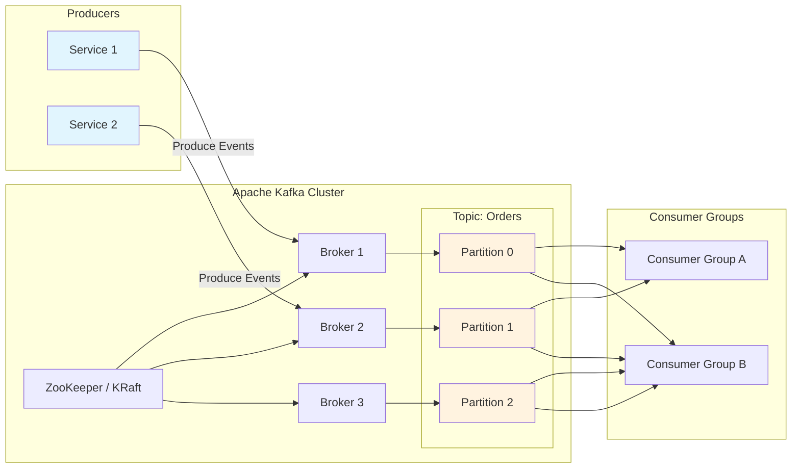

# Event Streaming Pattern

## Overview

The event streaming pattern enables continuous processing of event streams in real-time, allowing services to publish, store, and process events as they occur. Unlike traditional message queues that consume messages and delete them, event streaming systems persist events for configurable retention periods, enabling new consumers to read from any point in the stream and allowing replay of historical events. This pattern forms the backbone of event-driven architectures where services react to state changes in real-time.

Event streaming platforms like Apache Kafka provide durable, fault-tolerant message storage with high throughput capabilities. Events are organized into topics that can be partitioned across multiple brokers for horizontal scalability. Each partition maintains an ordered sequence of events, and consumers track their position within each partition, enabling exactly-once processing semantics when properly implemented. The retention period allows systems to process historical data while new events flow continuously through the stream.

This pattern excels at scenarios requiring event sourcing, where state changes are stored as an immutable sequence of events, audit trails that capture all system activities, and complex event processing where multiple streams must be combined or transformed. The ability to replay events supports debugging, testing, and recovering from failures by reprocessing historical data. Event streaming also enables micro-batch and streaming processing frameworks to consume events for real-time analytics and aggregations.

---

## Flow Chart: Event Streaming Architecture



---

## Standard Example

### Apache Kafka Implementation with Spring Kafka

This example demonstrates event streaming with producers, consumers, and exactly-once semantics.

**1. Kafka Configuration:**

```java
import org.apache.kafka.clients.admin.NewTopic;
import org.apache.kafka.clients.consumer.ConsumerConfig;
import org.apache.kafka.clients.producer.ProducerConfig;
import org.apache.kafka.common.serialization.StringDeserializer;
import org.apache.kafka.common.serialization.StringSerializer;
import org.springframework.beans.factory.annotation.Value;
import org.springframework.context.annotation.Bean;
import org.springframework.context.annotation.Configuration;
import org.springframework.kafka.annotation.EnableKafka;
import org.springframework.kafka.config.ConcurrentKafkaListenerContainerFactory;
import org.springframework.kafka.core.*;

import java.util.HashMap;
import java.util.Map;

@Configuration
@EnableKafka
public class KafkaConfig {

    @Value("${spring.kafka.bootstrap-servers}")
    private String bootstrapServers;

    @Value("${spring.kafka.consumer.group-id}")
    private String groupId;

    @Bean
    public ProducerFactory<String, OrderEvent> producerFactory() {
        Map<String, Object> configProps = new HashMap<>();
        configProps.put(ProducerConfig.BOOTSTRAP_SERVERS_CONFIG, bootstrapServers);
        configProps.put(ProducerConfig.KEY_SERIALIZER_CLASS_CONFIG, StringSerializer.class);
        configProps.put(ProducerConfig.VALUE_SERIALIZER_CLASS_CONFIG, JsonSerializer.class);
        configProps.put(ProducerConfig.ENABLE_IDEMPOTENCE_CONFIG, true);
        configProps.put(ProducerConfig.ACKS_CONFIG, "all");
        configProps.put(ProducerConfig.RETRIES_CONFIG, 3);
        configProps.put(ProducerConfig.TRANSACTIONAL_ID_CONFIG, "order-producer-tx");
        return new DefaultKafkaProducerFactory<>(configProps);
    }

    @Bean
    public KafkaTemplate<String, OrderEvent> kafkaTemplate() {
        return new KafkaTemplate<>(producerFactory());
    }

    @Bean
    public ConsumerFactory<String, OrderEvent> consumerFactory() {
        Map<String, Object> props = new HashMap<>();
        props.put(ConsumerConfig.BOOTSTRAP_SERVERS_CONFIG, bootstrapServers);
        props.put(ConsumerConfig.GROUP_ID_CONFIG, groupId);
        props.put(ConsumerConfig.KEY_DESERIALIZER_CLASS_CONFIG, StringDeserializer.class);
        props.put(ConsumerConfig.VALUE_DESERIALIZER_CLASS_CONFIG, JsonDeserializer.class);
        props.put(ConsumerConfig.AUTO_OFFSET_RESET_CONFIG, "earliest");
        props.put(ConsumerConfig.ENABLE_AUTO_COMMIT_CONFIG, false);
        props.put(ConsumerConfig.ISOLATION_LEVEL_CONFIG, "read_committed");
        return new DefaultKafkaConsumerFactory<>(props);
    }

    @Bean
    public ConcurrentKafkaListenerContainerFactory<String, OrderEvent> 
            kafkaListenerContainerFactory() {
        ConcurrentKafkaListenerContainerFactory<String, OrderEvent> factory =
                new ConcurrentKafkaListenerContainerFactory<>();
        factory.setConsumerFactory(consumerFactory());
        factory.getContainerProperties().setAckMode(ContainerProperties.AckMode.MANUAL);
        return factory;
    }

    @Bean
    public NewTopic ordersTopic() {
        return new NewTopic("orders-events", 6, (short) 3);
    }

    @Bean
    public NewTopic inventoryTopic() {
        return new NewTopic("inventory-events", 3, (short) 3);
    }
}
```

**2. Event Model:**

```java
import java.time.Instant;

public class OrderEvent {
    private String eventId;
    private String eventType;
    private String orderId;
    private String customerId;
    private String productId;
    private Integer quantity;
    private BigDecimal amount;
    private String status;
    private Instant timestamp;
    private Map<String, String> metadata;

    public enum EventType {
        ORDER_CREATED,
        ORDER_CONFIRMED,
        ORDER_SHIPPED,
        ORDER_DELIVERED,
        ORDER_CANCELLED
    }
}
```

**3. Producer Service with Transactions:**

```java
import org.springframework.kafka.core.KafkaTemplate;
import org.springframework.kafka.support.SendResult;
import org.springframework.stereotype.Service;
import org.springframework.transaction.annotation.Transactional;

import java.util.concurrent.CompletableFuture;

@Service
public class OrderEventProducer {

    private final KafkaTemplate<String, OrderEvent> kafkaTemplate;

    public OrderEventProducer(KafkaTemplate<String, OrderEvent> kafkaTemplate) {
        this.kafkaTemplate = kafkaTemplate;
    }

    @Transactional("kafkaTransactionManager")
    public void publishOrderEvent(OrderEvent event) {
        event.setTimestamp(Instant.now());
        event.setEventId(UUID.randomUUID().toString());

        kafkaTemplate.send("orders-events", event.getOrderId(), event);
        kafkaTemplate.flush();
    }

    public void publishOrderCreated(Order order) {
        OrderEvent event = new OrderEvent();
        event.setEventType(OrderEvent.EventType.ORDER_CREATED.name());
        event.setOrderId(order.getId());
        event.setCustomerId(order.getCustomerId());
        event.setProductId(order.getProductId());
        event.setQuantity(order.getQuantity());
        event.setAmount(order.getTotalAmount());
        event.setStatus("CREATED");

        publishOrderEvent(event);
    }

    public void publishOrderShipped(String orderId, String trackingNumber) {
        OrderEvent event = new OrderEvent();
        event.setEventType(OrderEvent.EventType.ORDER_SHIPPED.name());
        event.setOrderId(orderId);
        event.setStatus("SHIPPED");
        event.setMetadata(Map.of("trackingNumber", trackingNumber));

        CompletableFuture<SendResult<String, OrderEvent>> future = 
                kafkaTemplate.send("orders-events", orderId, event);
        
        future.whenComplete((result, ex) -> {
            if (ex != null) {
                System.out.println("Failed to send event: " + ex.getMessage());
            } else {
                System.out.println("Sent to partition: " + 
                    result.getRecordMetadata().partition());
            }
        });
    }
}
```

**4. Consumer Service with Manual Acknowledgment:**

```java
import org.apache.kafka.clients.consumer.ConsumerRecord;
import org.springframework.kafka.annotation.KafkaListener;
import org.springframework.kafka.support.Acknowledgment;
import org.springframework.stereotype.Service;

@Service
public class OrderEventConsumer {

    private final OrderProcessingService processingService;

    public OrderEventConsumer(OrderProcessingService processingService) {
        this.processingService = processingService;
    }

    @KafkaListener(
        topics = "orders-events",
        groupId = "order-processing-group",
        containerFactory = "kafkaListenerContainerFactory"
    )
    public void consumeOrderEvent(
            ConsumerRecord<String, OrderEvent> record,
            Acknowledgment ack) {
        
        String key = record.key();
        OrderEvent event = record.value();
        long offset = record.offset();
        int partition = record.partition();

        try {
            processingService.processOrderEvent(event);
            ack.acknowledge();
        } catch (Exception e) {
            handleProcessingError(event, e);
        }
    }

    private void handleProcessingError(OrderEvent event, Exception e) {
        if (isRetryableError(e)) {
            throw new RuntimeException("Retryable error", e);
        }
    }

    private boolean isRetryableError(Exception e) {
        return e instanceof ServiceUnavailableException ||
               e instanceof TimeoutException;
    }
}
```

**5. Stream Processing with Kafka Streams:**

```java
import org.apache.kafka.common.serialization.Serdes;
import org.apache.kafka.streams.KafkaStreams;
import org.apache.kafka.streams.StreamsBuilder;
import org.apache.kafka.streams.kstream.*;
import org.apache.kafka.streams.state.KeyValueStore;
import org.apache.kafka.streams.state.StoreBuilder;
import org.apache.kafka.streams.state.Stores;
import org.springframework.context.annotation.Bean;
import org.springframework.context.annotation.Configuration;

@Configuration
public class KafkaStreamsConfig {

    @Bean
    public KStream<String, OrderEvent> orderStream(StreamsBuilder streamsBuilder) {
        KStream<String, OrderEvent> ordersStream = streamsBuilder
                .stream("orders-events", Consumed.with(Serdes.String(), new OrderEventSerde()));

        KTable<String, Long> orderCountByCustomer = ordersStream
                .groupBy((key, event) -> event.getCustomerId())
                .count(Materialized.as("order-count-store"));

        orderCountByCustomer.toStream().to("customer-order-counts");

        KStream<String, OrderAggregation> revenueStream = ordersStream
                .filter((key, event) -> "ORDER_CONFIRMED".equals(event.getEventType()))
                .groupByKey()
                .reduce(
                    (agg, event) -> new OrderAggregation(
                        agg.getOrderCount() + 1,
                        agg.getTotalRevenue().add(event.getAmount())
                    ),
                    Materialized.as("revenue-aggregation")
                )
                .toStream();

        revenueStream.to("revenue-aggregations");

        return ordersStream;
    }
}
```

---

## Real-World Examples

### Real-Time Analytics Platform

A digital marketing platform uses Kafka to collect user behavior events from web and mobile applications, processing clicks, page views, and conversions in real-time.

**Architecture Details:**

User events are published to Kafka topics partitioned by user ID, ensuring all events for a single user go to the same partition for ordering. Multiple consumer groups process the same events for different purposes, including real-time dashboards, machine learning feature computation, and data warehouse loading.

Kafka Streams applications compute session-based metrics, detecting user sessions and calculating engagement scores. The retention period allows reprocessing for model retraining and A/B test analysis.

### Event Sourcing Banking System

A banking application implements event sourcing with Kafka, storing all account transactions as immutable events that can be replayed to reconstruct account state.

**Implementation Approach:**

Account balance is never updated in place; instead, deposit and withdrawal events are appended to the event stream. Current balance is computed by replaying all events, providing complete auditability. Checkpointing allows resuming from the last processed event after failures.

The system uses exactly-once semantics with transactional producers and consumers, ensuring no duplicate transactions or lost events. Database transactions coordinate with Kafka commits to maintain consistency.

### IoT Sensor Data Processing

An industrial IoT platform collects sensor readings from equipment across multiple facilities, using Kafka for real-time alerting and long-term storage.

**Data Pipeline:**

High-frequency sensor data flows through Kafka, with partitioning by equipment ID for ordered processing per device. Stream processors detect anomalous readings and publish alerts to a separate topic consumed by monitoring systems.

The warm path stores recent data in Kafka for real-time processing, while the cold path archives to object storage for historical analysis. This tiered storage approach balances query performance with cost efficiency.

---

## Best Practices

### 1. Design Topic Partitioning Strategy

Choose partition keys based on query patterns and ordering requirements. Use customer ID or order ID for event ordering within entities. Monitor partition distribution to avoid hot partitions. Rebalance partitions only when necessary to minimize disruptions.

```java
List<String> partitionKeys = Arrays.asList("customerId", "deviceId", "orderId");
String partitionKey = event.getCustomerId();
producer.send(new ProducerRecord("topic", partitionKey, event));
```

### 2. Implement Proper Error Handling

Handle deserialization errors gracefully, logging problematic messages. Implement retry logic with exponential backoff for transient failures. Configure dead letter topics for messages that cannot be processed. Monitor error rates and investigate recurring issues.

### 3. Manage Consumer Offsets Carefully

Choose offset reset policy based on data criticality. Use exactly-once semantics for critical processing. Commit offsets after successful processing to prevent data loss. Consider using transactional consumers for atomic offset commits.

### 4. Configure Appropriate Retention

Set retention based on replay requirements and storage costs. Consider time-based and size-based retention limits. Use compaction for key-value events requiring only latest value. Monitor storage usage and adjust retention as needed.

### 5. Monitor Consumer Lag

Track consumer lag to identify processing delays. Alert on lag exceeding thresholds. Scale consumers or optimize processing to reduce lag. Consider backpressure mechanisms for extreme lag.

### 6. Use Schema Registry for Evolution

Define schemas for event data using Avro or Protobuf. Register schemas in a schema registry. Configure serializers to include schema IDs. Plan schema evolution with backward compatibility.

### 7. Implement Idempotent Processing

Design consumers to handle duplicate events safely. Use event IDs or business keys for deduplication. Store processed event IDs to detect duplicates. Implement idempotent operations in downstream systems.

### 8. Secure the Kafka Cluster

Enable SSL/TLS for encrypted communication between clients and brokers. Use SASL for authentication. Implement ACLs for authorization. Configure firewall rules to restrict broker access.

---

## Additional Considerations

### Kafka vs. Other Streaming Platforms

**Apache Kafka** provides the most feature-complete streaming platform with high throughput, durability, and ecosystem integration. It requires significant operational expertise and resources.

**Amazon Kinesis** offers managed streaming with simpler operations but less control. Pricing based on shard hours and data volume can be cost-effective for variable workloads.

**Redpanda** is a modern Kafka-compatible streaming platform optimized for performance and simplicity, with lower resource requirements.

### Scaling Strategies

Horizontal scaling is achieved by adding partitions and consumers. Target one consumer per partition for optimal balancing. Monitor partition rebalancing during scaling events. Consider static membership for stable consumer groups.