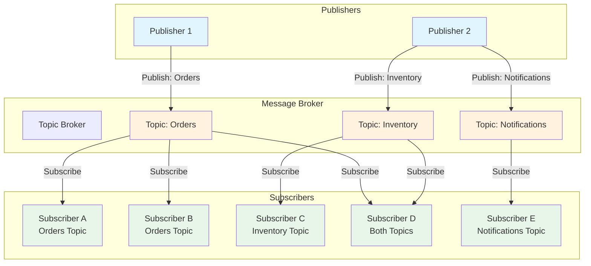

# Publish-Subscribe Pattern

## Overview

The publish-subscribe pattern is an asynchronous messaging pattern where message senders (publishers) do not send messages directly to specific receivers (subscribers) but instead categorize messages into topics. Subscribers express interest in one or more topics and only receive messages that are relevant to their subscriptions. This pattern completely decouples publishers from subscribers, allowing them to operate independently and scale independently.

The pub/sub pattern provides temporal decoupling, meaning publishers and subscribers do not need to be active simultaneously for communication to occur. Messages published when no subscribers are listening are stored by the messaging infrastructure and delivered when subscribers become available. This enables handling of traffic spikes and subscriber failures without message loss.

Message brokers implementing pub/sub patterns support multiple subscribers to the same topic, enabling one-to-many communication where a single message is delivered to all interested parties. This is essential for scenarios like notification systems, event propagation, and data replication across services. Topics can be hierarchical, allowing subscribers to choose between receiving all messages in a namespace or filtering more specifically.

The pattern includes several delivery models. Push-based delivery notifies subscribers immediately when messages arrive, while pull-based delivery allows subscribers to retrieve messages at their convenience. Some implementations support both models. The reliability model determines whether messages are persisted and whether delivery is guaranteed, ranging from fire-and-forget to guaranteed delivery with acknowledgment.

---

## Flow Chart: Publish-Subscribe Pattern



---

## Standard Example

### Redis Pub/Sub Implementation

This example demonstrates pub/sub with Redis for real-time messaging.

**1. Redis Pub/Sub Configuration:**

```java
import redis.clients.jedis.Jedis;
import redis.clients.jedis.JedisPubSub;
import org.springframework.context.annotation.Bean;
import org.springframework.context.annotation.Configuration;
import org.springframework.data.redis.connection.RedisConnectionFactory;
import org.springframework.data.redis.core.RedisTemplate;
import org.springframework.data.redis.listener.ChannelTopic;
import org.springframework.data.redis.listener.RedisMessageListenerContainer;
import org.springframework.data.redis.listener.adapter.MessageListenerAdapter;
import org.springframework.data.redis.serializer.StringRedisSerializer;

@Configuration
public class RedisPubSubConfig {

    @Bean
    public RedisTemplate<String, String> redisTemplate(RedisConnectionFactory connectionFactory) {
        RedisTemplate<String, String> template = new RedisTemplate<>();
        template.setConnectionFactory(connectionFactory);
        template.setKeySerializer(new StringRedisSerializer());
        template.setValueSerializer(new StringRedisSerializer());
        template.setHashKeySerializer(new StringRedisSerializer());
        template.setHashValueSerializer(new StringRedisSerializer());
        return template;
    }

    @Bean
    public JedisPool jedisPool() {
        return new JedisPool("localhost", 6379);
    }
}
```

**2. Message Publisher Service:**

```java
import org.springframework.data.redis.core.RedisTemplate;
import org.springframework.data.redis.listener.ChannelTopic;
import org.springframework.stereotype.Service;

@Service
public class EventPublisherService {

    private final RedisTemplate<String, String> redisTemplate;

    public EventPublisherService(RedisTemplate<String, String> redisTemplate) {
        this.redisTemplate = redisTemplate;
    }

    public void publishOrderEvent(OrderEvent event) {
        String channel = "orders:" + event.getEventType();
        String message = serializeEvent(event);
        redisTemplate.convertAndSend(channel, message);
    }

    public void publishToTopic(String topic, String message) {
        redisTemplate.convertAndSend(topic, message);
    }

    public void publishOrderCreated(Order order) {
        String channel = "orders:created";
        String message = String.format(
            "{\"orderId\":\"%s\",\"customerId\":\"%s\",\"total\":%.2f,\"timestamp\":%d}",
            order.getId(),
            order.getCustomerId(),
            order.getTotalAmount(),
            System.currentTimeMillis()
        );
        redisTemplate.convertAndSend(channel, message);
    }

    public void publishInventoryUpdate(InventoryUpdate update) {
        String channel = "inventory:updates";
        String message = serializeInventoryUpdate(update);
        redisTemplate.convertAndSend(channel, message);
    }

    private String serializeEvent(OrderEvent event) {
        // JSON serialization logic
        return new Gson().toJson(event);
    }
}
```

**3. Message Subscriber Service:**

```java
import org.springframework.data.redis.connection.Message;
import org.springframework.data.redis.connection.MessageListener;
import org.springframework.stereotype.Service;

@Service
public class OrderEventSubscriber implements MessageListener {

    private final OrderProcessingService processingService;

    public OrderEventSubscriber(OrderProcessingService processingService) {
        this.processingService = processingService;
    }

    @Override
    public void onMessage(Message message, byte[] pattern) {
        String channel = new String(message.getChannel());
        String payload = new String(message.getBody());

        try {
            if (channel.contains("created")) {
                handleOrderCreated(payload);
            } else if (channel.contains("updated")) {
                handleOrderUpdated(payload);
            } else if (channel.contains("cancelled")) {
                handleOrderCancelled(payload);
            }
        } catch (Exception e) {
            handleError(channel, payload, e);
        }
    }

    private void handleOrderCreated(String payload) {
        OrderEvent event = parseOrderEvent(payload);
        processingService.processNewOrder(event);
    }

    private void handleOrderUpdated(String payload) {
        OrderEvent event = parseOrderEvent(payload);
        processingService.updateOrderStatus(event);
    }

    private void handleOrderCancelled(String payload) {
        OrderEvent event = parseOrderEvent(payload);
        processingService.cancelOrder(event);
    }
}
```

**4. Redis Message Listener Container Configuration:**

```java
import org.springframework.context.annotation.Bean;
import org.springframework.context.annotation.Configuration;
import org.springframework.data.redis.listener.ChannelTopic;
import org.springframework.data.redis.listener.RedisMessageListenerContainer;
import org.springframework.data.redis.connection.RedisConnectionFactory;

@Configuration
public class RedisListenerConfig {

    @Bean
    public RedisMessageListenerContainer redisContainer(
            RedisConnectionFactory connectionFactory,
            OrderEventSubscriber subscriber) {
        
        RedisMessageListenerContainer container = new RedisMessageListenerContainer();
        container.setConnectionFactory(connectionFactory);
        
        container.addMessageListener(
            subscriber,
            new ChannelTopic("orders:created"),
            new ChannelTopic("orders:updated"),
            new ChannelTopic("orders:cancelled")
        );
        
        return container;
    }
}
```

### RabbitMQ Pub/Sub with Fanout Exchange

```java
import org.springframework.amqp.core.*;
import org.springframework.amqp.rabbit.core.RabbitTemplate;
import org.springframework.context.annotation.Bean;
import org.springframework.context.annotation.Configuration;

@Configuration
public class RabbitPubSubConfig {

    @Bean
    public FanoutExchange ordersExchange() {
        return new FanoutExchange("orders.events");
    }

    @Bean
    public Queue emailNotificationQueue() {
        return QueueBuilder.durable("email.notifications").build();
    }

    @Bean
    public Queue smsNotificationQueue() {
        return QueueBuilder.durable("sms.notifications").build();
    }

    @Bean
    public Queue analyticsQueue() {
        return QueueBuilder.durable("analytics.events").build();
    }

    @Bean
    public Binding emailBinding(Queue emailNotificationQueue, FanoutExchange ordersExchange) {
        return BindingBuilder.bind(emailNotificationQueue).to(ordersExchange);
    }

    @Bean
    public Binding smsBinding(Queue smsNotificationQueue, FanoutExchange ordersExchange) {
        return BindingBuilder.bind(smsNotificationQueue).to(ordersExchange);
    }

    @Bean
    public Binding analyticsBinding(Queue analyticsQueue, FanoutExchange ordersExchange) {
        return BindingBuilder.bind(analyticsQueue).to(ordersExchange);
    }

    @RabbitListener(queues = "email.notifications")
    public void handleEmailNotification(OrderEvent event) {
        emailService.sendOrderConfirmation(event);
    }

    @RabbitListener(queues = "sms.notifications")
    public void handleSmsNotification(OrderEvent event) {
        smsService.sendShippingNotification(event);
    }

    @RabbitListener(queues = "analytics.events")
    public void handleAnalyticsEvent(OrderEvent event) {
        analyticsService.recordOrderEvent(event);
    }
}
```

---

## Real-World Examples

### Multi-Channel Notification System

A notification service implements pub/sub to distribute messages across email, SMS, push notification, and webhook delivery channels.

**Architecture:**

When an order is placed, an event is published to the order-created topic. Subscribers for email, SMS, push notifications, and webhooks each independently process the event and deliver notifications through their respective channels. The publisher does not know or care about the notification channels; it simply publishes the event and moves on.

The system handles subscriber failures gracefully, with failed delivery attempts queued for retry. New notification channels can be added by implementing new subscribers without modifying the publisher or other subscribers.

### Distributed Logging and Monitoring

A microservices platform uses pub/sub to distribute log events and metrics to multiple consumers for different purposes.

**Use Cases:**

Log events are published to topics based on severity and service. Subscribers include a log aggregation service for persistent storage, a real-time alerting service for error detection, and a debugging service for development environments. Metrics are similarly distributed to time-series databases, visualization dashboards, and anomaly detection systems.

This decoupling allows adding new consumers without affecting existing infrastructure. The platform team can add a new analytics subscriber without coordinating with service teams.

### Event-Driven Data Replication

A financial system uses pub/sub to replicate transaction data across multiple data stores for different access patterns.

**Replication Strategy:**

Transaction events are published once to a central topic. Subscribers independently consume and transform events for their specific needs. A real-time analytics store receives events for dashboard queries. A search index receives processed events for full-text search. An archive store receives events for compliance retention.

Each subscriber maintains its own state and progress, allowing different retention periods and processing requirements per destination. Failed replications can be replayed from the topic without affecting other consumers.

---

## Best Practices

### 1. Design Topic Naming Conventions

Use hierarchical naming that reflects organizational structure. Include version indicators for schema evolution. Establish clear ownership for each topic. Document naming standards and enforce them.

```text
# Good examples
orders.created.v1
inventory.stock.updated.v1
customer.profile.changed.v1

# Avoid
topic1
my_queue
random_name
```

### 2. Implement Message Serialization

Use structured formats like JSON, Avro, or Protobuf. Include versioning in message schemas. Document message formats and share across teams. Implement schema evolution handling.

### 3. Handle Subscriber Failures

Implement retry logic with exponential backoff. Configure dead letter handling for failed messages. Monitor subscriber health and alert on failures. Design for graceful degradation when subscribers are unavailable.

### 4. Manage Message Ordering

Understand ordering guarantees per topic. Design for eventual consistency when strict ordering is not required. Use message keys for ordering within partitions. Avoid mixing ordering requirements in single topic.

### 5. Control Message Flow

Implement message TTL for time-sensitive events. Set message size limits to prevent large payloads. Use compression for high-volume topics. Monitor message rates and set alerts.

### 6. Secure the Pub/Sub System

Implement authentication for publishers and subscribers. Use encryption for message transport. Apply authorization to restrict topic access. Audit access and message flow.

### 7. Design for Scalability

Monitor subscriber lag and scale horizontally. Distribute partitions across consumers. Balance topic partitions for even load. Test with production-like volumes.

### 8. Document and Monitor

Maintain topic documentation with purpose and schema. Track subscriber registrations and dependencies. Monitor message rates, sizes, and errors. Establish SLAs for message delivery.

---

## Additional Considerations

### Pub/Sub vs. Message Queues

Pub/sub excels at one-to-many broadcasting where all subscribers need the same message. Message queues excel at work distribution where messages should go to one consumer. Many systems support both patterns.

**When to use pub/sub:**
- Event notifications that multiple services need
- Broadcasting state changes to all interested parties
- Decoupling producers from consumers entirely

**When to use queues:**
- Task distribution where each task needs one handler
- Load leveling with bounded processing capacity
- Priority processing with separate queues

### Broker Selection

**Redis Pub/Sub** offers extremely low latency for real-time messaging but lacks persistence, making it suitable for ephemeral messages.

**RabbitMQ** provides both pub/sub and queue patterns with flexible routing, making it a versatile choice for complex messaging scenarios.

**Amazon SNS** offers fully managed pub/sub with AWS integration, ideal for cloud-native applications seeking minimal operational overhead.

**Google Cloud Pub/Sub** provides global availability with automatic scaling, suitable for applications requiring high availability and geographic distribution.