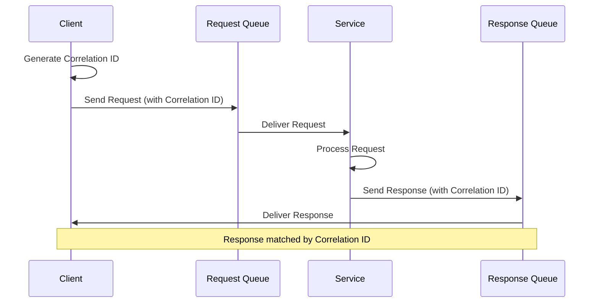
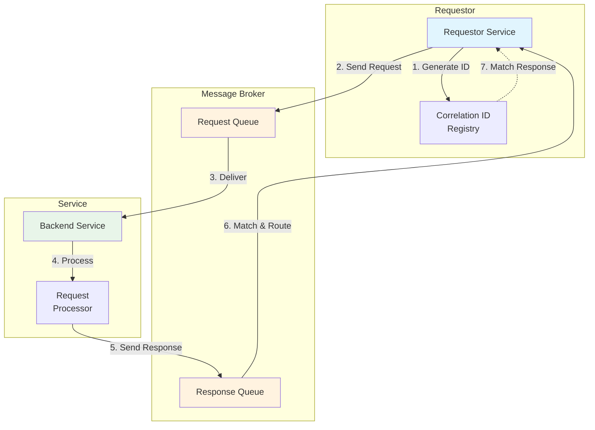

# Request-Reply Pattern

## Overview

The request-reply pattern combines asynchronous messaging with the familiar request-response paradigm used in synchronous communication. In this pattern, a requestor sends a message to a service and expects a correlated response message back. The correlation is achieved using unique identifiers called correlation IDs that link request and response messages together. This pattern enables non-blocking communication while maintaining the logical structure of request-response interactions.

The request-reply pattern addresses scenarios where asynchronous communication is preferred but the caller still needs a response. This is common in microservice architectures where services need to communicate but should not block on long-running operations. The pattern allows requestors to continue processing other work while waiting for responses, improving overall system throughput and responsiveness.

Several variations of this pattern exist to handle different scenarios. The blocking variant waits for a response with optional timeout, similar to synchronous calls but using message-based transport. The non-blocking variant uses callbacks or futures to handle responses when they arrive. The scatter-gather pattern sends a request to multiple services and aggregates responses. Each variation addresses specific use cases while maintaining the correlation ID mechanism.

The pattern requires careful design to handle failure scenarios. Timeouts must be configured to prevent indefinite waiting. Dead letter handling addresses lost responses. Idempotency ensures that duplicate requests do not cause duplicate processing. Circuit breakers prevent overwhelming services during failures.

---

## Flow Chart: Request-Reply Pattern





---

## Standard Example

### RabbitMQ Request-Reply Implementation

This example demonstrates request-reply with correlation IDs using RabbitMQ.

**1. Request-Reply Configuration:**

```java
import org.springframework.amqp.core.*;
import org.springframework.amqp.rabbit.connection.CachingConnectionFactory;
import org.springframework.amqp.rabbit.core.RabbitTemplate;
import org.springframework.amqp.support.converter.Jackson2JsonMessageConverter;
import org.springframework.context.annotation.Bean;
import org.springframework.context.annotation.Configuration;

@Configuration
public class RequestReplyConfig {

    @Bean
    public Queue requestQueue() {
        return QueueBuilder.durable("order.request.queue").build();
    }

    @Bean
    public Queue responseQueue() {
        return QueueBuilder.durable("order.response.queue")
                .withArgument("x-message-ttl", 30000)
                .build();
    }

    @Bean
    public DirectExchange requestExchange() {
        return new DirectExchange("request.exchange");
    }

    @Bean
    public DirectExchange responseExchange() {
        return new DirectExchange("response.exchange");
    }

    @Bean
    public Binding requestBinding(Queue requestQueue, DirectExchange requestExchange) {
        return BindingBuilder.bind(requestQueue)
                .to(requestExchange)
                .with("order.request");
    }

    @Bean
    public MessageConverter jsonMessageConverter() {
        return new Jackson2JsonMessageConverter();
    }
}
```

**2. Request Producer with Correlation ID:**

```java
import org.springframework.amqp.core.Message;
import org.springframework.amqp.core.MessageProperties;
import org.springframework.amqp.rabbit.core.RabbitTemplate;
import org.springframework.stereotype.Service;

import java.util.UUID;
import java.util.concurrent.CompletableFuture;
import java.util.concurrent.ConcurrentHashMap;

@Service
public class OrderRequestService {

    private final RabbitTemplate rabbitTemplate;
    private final ConcurrentHashMap<String, CompletableFuture<OrderResponse>> pendingRequests;

    public OrderRequestService(RabbitTemplate rabbitTemplate) {
        this.rabbitTemplate = rabbitTemplate;
        this.pendingRequests = new ConcurrentHashMap<>();
    }

    public CompletableFuture<OrderResponse> sendOrderRequest(OrderRequest request) {
        String correlationId = UUID.randomUUID().toString();
        CompletableFuture<OrderResponse> future = new CompletableFuture<>();
        pendingRequests.put(correlationId, future);

        MessageProperties props = new MessageProperties();
        props.setCorrelationId(correlationId);
        props.setReplyTo("order.response.queue");
        props.setDeliveryMode(MessageDeliveryMode.PERSISTENT);
        props.setExpiration("30000");

        Message message = new Message(
                serializeRequest(request),
                props
        );

        rabbitTemplate.send("request.exchange", "order.request", message);

        future.orTimeout(30, TimeUnit.SECONDS)
                .whenComplete((result, ex) -> pendingRequests.remove(correlationId));

        return future;
    }

    public void handleResponse(Message message) {
        String correlationId = message.getMessageProperties().getCorrelationId();
        CompletableFuture<OrderResponse> future = pendingRequests.get(correlationId);

        if (future != null) {
            OrderResponse response = deserializeResponse(message.getBody());
            future.complete(response);
        }
    }

    private byte[] serializeRequest(OrderRequest request) {
        return jsonConverter.toJson(request).getBytes();
    }

    private OrderResponse deserializeResponse(byte[] body) {
        return jsonConverter.fromJson(new String(body));
    }
}
```

**3. Response Consumer:**

```java
import org.springframework.amqp.rabbit.annotation.RabbitListener;
import org.springframework.stereotype.Service;

@Service
public class ResponseConsumerService {

    private final OrderRequestService requestService;

    public ResponseConsumerService(OrderRequestService requestService) {
        this.requestService = requestService;
    }

    @RabbitListener(queues = "order.response.queue")
    public void handleResponse(Message message) {
        requestService.handleResponse(message);
    }
}
```

**4. Service Handler Processing Requests:**

```java
import org.springframework.amqp.rabbit.annotation.RabbitListener;
import org.springframework.amqp.rabbit.core.RabbitTemplate;
import org.springframework.stereotype.Service;

@Service
public class OrderRequestHandler {

    private final RabbitTemplate rabbitTemplate;

    public OrderRequestHandler(RabbitTemplate rabbitTemplate) {
        this.rabbitTemplate = rabbitTemplate;
    }

    @RabbitListener(queues = "order.request.queue")
    public void handleOrderRequest(Message requestMessage) {
        String correlationId = requestMessage.getMessageProperties().getCorrelationId();
        String replyTo = requestMessage.getMessageProperties().getReplyTo();

        OrderRequest request = deserializeRequest(requestMessage.getBody());

        try {
            OrderResponse response = processOrderRequest(request);
            sendResponse(replyTo, correlationId, response);
        } catch (Exception e) {
            sendErrorResponse(replyTo, correlationId, e);
        }
    }

    private OrderResponse processOrderRequest(OrderRequest request) {
        // Business logic processing
        Order order = orderService.createOrder(request);
        
        OrderResponse response = new OrderResponse();
        response.setOrderId(order.getId());
        response.setStatus("CONFIRMED");
        response.setEstimatedDelivery(order.getDeliveryDate());
        return response;
    }

    private void sendResponse(String replyTo, String correlationId, OrderResponse response) {
        MessageProperties props = new MessageProperties();
        props.setCorrelationId(correlationId);
        
        Message responseMessage = new Message(
                serializeResponse(response),
                props
        );
        
        rabbitTemplate.send("response.exchange", replyTo, responseMessage);
    }

    private void sendErrorResponse(String replyTo, String correlationId, Exception e) {
        MessageProperties props = new MessageProperties();
        props.setCorrelationId(correlationId);
        
        ErrorResponse error = new ErrorResponse();
        error.setErrorCode("PROCESSING_ERROR");
        error.setMessage(e.getMessage());
        
        Message errorMessage = new Message(
                serializeError(error),
                props
        );
        
        rabbitTemplate.send("response.exchange", replyTo, errorMessage);
    }
}
```

### Kafka Request-Reply Implementation

```java
import org.apache.kafka.clients.consumer.ConsumerRecord;
import org.apache.kafka.clients.producer.ProducerRecord;
import org.springframework.kafka.annotation.KafkaListener;
import org.springframework.kafka.core.KafkaTemplate;
import org.springframework.stereotype.Service;

@Service
public class KafkaRequestReplyService {

    private final KafkaTemplate<String, String> kafkaTemplate;
    private final ConcurrentHashMap<String, CompletableFuture<String>> pendingRequests;

    public KafkaRequestReplyService(KafkaTemplate<String, String> kafkaTemplate) {
        this.kafkaTemplate = kafkaTemplate;
        this.pendingRequests = new ConcurrentHashMap<>();
    }

    public CompletableFuture<String> sendRequest(String topic, String request) {
        String correlationId = UUID.randomUUID().toString();
        CompletableFuture<String> future = new CompletableFuture<>();
        pendingRequests.put(correlationId, future);

        ProducerRecord<String, String> record = new ProducerRecord<>(
                topic,
                correlationId,
                request
        );
        record.headers().add("correlationId", correlationId.getBytes());
        record.headers().add("replyTopic", "responses".getBytes());

        kafkaTemplate.send(record);

        return future.orTimeout(30, TimeUnit.SECONDS)
                .whenComplete((result, ex) -> pendingRequests.remove(correlationId));
    }

    @KafkaListener(topics = "responses", groupId = "request-reply-group")
    public void handleResponse(ConsumerRecord<String, String> record) {
        String correlationId = new String(
                record.headers().lastHeader("correlationId").value()
        );
        
        CompletableFuture<String> future = pendingRequests.get(correlationId);
        if (future != null) {
            future.complete(record.value());
        }
    }

    @KafkaListener(topics = "order-requests", groupId = "order-handler-group")
    public void handleRequest(ConsumerRecord<String, String> record) {
        String correlationId = record.key();
        String replyTopic = new String(
                record.headers().lastHeader("replyTopic").value()
        );
        
        String response = processRequest(record.value());
        
        ProducerRecord<String, String> responseRecord = new ProducerRecord<>(
                replyTopic,
                correlationId,
                response
        );
        responseRecord.headers().add("correlationId", correlationId.getBytes());
        
        kafkaTemplate.send(responseRecord);
    }
}
```

---

## Real-World Examples

### Financial Transaction Processing

A banking system uses request-reply pattern for handling account balance queries and transfer requests. The pattern ensures that transaction requests are processed exactly once while maintaining response correlation.

**Implementation Details:**

Clients generate unique request IDs and specify response queue addresses. The banking service processes transactions and sends responses with the same correlation ID. Clients implement idempotency by tracking processed request IDs.

The system handles timeout scenarios, resending requests if responses are not received within the timeout window. Duplicate detection prevents double-processing of retried requests.

### Inventory Management System

An e-commerce inventory service implements request-reply for real-time stock queries, allowing product pages to display accurate availability information.

**Use Case:**

Product service sends stock check requests to inventory service, waiting for responses to display availability. The request includes product IDs and desired quantities. Responses indicate availability status and estimated shipping dates.

High-volume scenarios use batched requests, sending multiple product queries in a single request. The inventory service processes the batch and returns aggregated availability information.

### Long-Running Task Orchestration

A data processing platform uses request-reply for initiating long-running analysis jobs, with the initial request returning a job ID for polling status.

**Workflow:**

The client submits a processing request and receives a job ID in the response. The client polls a status endpoint using the job ID to check completion. When processing finishes, results are available at a specified location.

This hybrid approach combines request-reply for initiation with polling for status updates, balancing immediate feedback with handling long-running operations.

---

## Best Practices

### 1. Use UUID or Unique Identifiers for Correlation

Generate correlation IDs that are highly unlikely to collide. Include source identifiers in correlation IDs for distributed systems. Use structured correlation IDs that encode context. Store correlation IDs in message headers, not message bodies.

```java
String correlationId = UUID.randomUUID().toString();
message.getMessageProperties().setCorrelationId(correlationId);
```

### 2. Implement Proper Timeout Handling

Configure timeouts based on expected processing duration. Implement timeout callbacks to clean up pending requests. Consider progressive timeouts for different operation types. Document expected response times for service consumers.

### 3. Handle Failed Responses

Implement retry logic with exponential backoff. Configure dead letter queues for messages that cannot be processed. Log failed requests for investigation. Implement circuit breakers during service failures.

### 4. Design for Idempotency

Use request IDs to detect and handle duplicate submissions. Implement idempotent processing in service handlers. Return same response for retried requests. Document idempotency requirements for API consumers.

### 5. Manage Pending Request State

Use appropriate data structures for pending request tracking. Implement memory management for long-running requests. Consider persistence for critical request tracking. Monitor pending request counts for backpressure detection.

### 6. Implement Response Validation

Validate response format before processing. Check correlation ID matches expected request. Handle malformed responses gracefully. Log invalid responses for debugging.

### 7. Consider Message Size

Keep request and response messages appropriately sized. Use references for large data instead of embedding. Implement compression for high-volume scenarios. Set message size limits to prevent memory issues.

### 8. Design Response Queues

Use dedicated response queues per client or request type. Implement TTL for response queue messages. Consider response queue namespacing for multi-tenant systems. Monitor response queue depths.

---

## Additional Considerations

### Request-Reply vs. Fire-and-Forget

Request-reply should be used when the caller needs a response. Fire-and-forget works for notifications where no response is needed. Some systems use both patterns in combination, sending requests and publishing events for the same operation.

### Response Queue Strategies

**Per-client response queues** provide isolation but increase broker resources. **Shared response queues** are simpler but require correlation matching. **Temporary response queues** created per request minimize resource usage but add overhead.

### Alternative Approaches

**Async HTTP** with WebSocket or Server-Sent Events provides request-reply over HTTP. **gRPC streaming** enables bidirectional request-reply communication. **Temporal workflows** provide request-reply semantics with automatic retry and timeout handling.