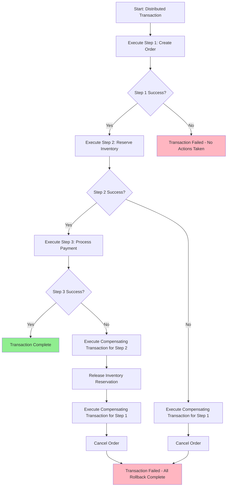

# Compensating Transactions

## Overview

Compensating transactions are a critical pattern in distributed systems that enable reliable rollback operations when a multi-step operation fails partway through. In microservices architectures, where each business operation may span multiple services, traditional ACID transactions are not feasible. Compensating transactions provide an alternative approach by explicitly defining reversal operations for each step in a distributed workflow.

The fundamental principle behind compensating transactions is simple: when a transaction fails at any step, all previously completed steps must be undone by executing their corresponding compensation actions. This is akin to the "undo" operation in a photo editing application—each action is recorded, and if something goes wrong, you can step backward through your history to return to the original state.

In modern microservice ecosystems, compensating transactions are essential because:

1. **Database Isolation**: Each microservice owns its own database, preventing distributed locks
2. **Availability**: Systems can remain available even during partial failures
3. **Scalability**: Operations can be processed across multiple services without blocking
4. ** autonomy**: Services can operate independently, improving overall system resilience

Compensating transactions are inherently related to the Saga pattern—in fact, they form the core mechanism by which Sagas achieve consistency. A Saga defines a sequence of local transactions, and when any local transaction fails, compensating transactions are invoked for all previously successful transactions to undo their effects.

## Flow Chart



This flow chart illustrates a three-step distributed transaction with compensating transactions at each stage. When any step fails, all previously completed steps are compensated in reverse order.

## Standard Example

### Basic Compensating Transaction Implementation

The following example demonstrates a typical implementation of compensating transactions using choreography-based Saga orchestration:

```java
// OrderService.java - Main orchestration service
public class OrderService {
    
    private final OrderRepository orderRepository;
    private final MessageBroker messageBroker;
    
    public Order createOrder(OrderRequest request) {
        // Step 1: Create order in pending state
        Order order = new Order();
        order.setStatus(OrderStatus.PENDING);
        order.setItems(request.getItems());
        order.setCustomerId(request.getCustomerId());
        order = orderRepository.save(order);
        
        // Step 2: Publish event for inventory reservation
        messageBroker.publish(new InventoryReserveEvent(order.getId(), order.getItems()));
        
        // Step 3: Publish event for payment processing
        messageBroker.publish(new PaymentProcessEvent(order.getId(), order.getTotal()));
        
        return order;
    }
    
    public void handleOrderCreatedFailure(Long orderId) {
        Order order = orderRepository.findById(orderId);
        if (order != null) {
            order.setStatus(OrderStatus.FAILED);
            orderRepository.save(order);
        }
    }
}
```

```java
// InventoryService.java - Handles inventory reservation
public class InventoryService {
    
    private final InventoryRepository inventoryRepository;
    private final MessageBroker messageBroker;
    
    @EventListener
    public void handleInventoryReserveEvent(InventoryReserveEvent event) {
        try {
            for (OrderItem item : event.getItems()) {
                Inventory inventory = inventoryRepository.findByProductId(item.getProductId());
                if (inventory.getAvailableQuantity() < item.getQuantity()) {
                    throw new InsufficientInventoryException(item.getProductId());
                }
                inventory.setReservedQuantity(inventory.getReservedQuantity() + item.getQuantity());
                inventoryRepository.save(inventory);
            }
            messageBroker.publish(new InventoryReservedEvent(event.getOrderId()));
        } catch (InsufficientInventoryException e) {
            messageBroker.publish(new InventoryReservationFailedEvent(event.getOrderId(), e.getMessage()));
        }
    }
    
    @EventListener
    public void handleInventoryReservationFailedEvent(InventoryReservationFailedEvent event) {
        // Compensating action
        List<InventoryReservation> reservations = inventoryReservationRepository
            .findByOrderId(event.getOrderId());
        
        for (InventoryReservation reservation : reservations) {
            Inventory inventory = inventoryRepository.findByProductId(reservation.getProductId());
            inventory.setReservedQuantity(inventory.getReservedQuantity() - reservation.getQuantity());
            inventoryRepository.save(inventory);
        }
        
        messageBroker.publish(new InventoryReservationCompensatedEvent(event.getOrderId()));
    }
}
```

```java
// PaymentService.java - Handles payment processing
public class PaymentService {
    
    private final PaymentRepository paymentRepository;
    private final MessageBroker messageBroker;
    
    @EventListener
    public void handlePaymentProcessEvent(PaymentProcessEvent event) {
        try {
            Payment payment = new Payment();
            payment.setOrderId(event.getOrderId());
            payment.setAmount(event.getAmount());
            payment.setStatus(PaymentStatus.PROCESSING);
            payment = paymentRepository.save(payment);
            
            // Process actual payment through payment gateway
            PaymentResult result = paymentGateway.process(payment);
            
            payment.setStatus(PaymentStatus.COMPLETED);
            payment.setTransactionId(result.getTransactionId());
            paymentRepository.save(payment);
            
            messageBroker.publish(new PaymentCompletedEvent(event.getOrderId()));
        } catch (PaymentException e) {
            messageBroker.publish(new PaymentFailedEvent(event.getOrderId(), e.getMessage()));
        }
    }
    
    @EventListener
    public void handlePaymentFailedEvent(PaymentFailedEvent event) {
        // Compensating action - refund if payment was captured
        Payment payment = paymentRepository.findByOrderId(event.getOrderId());
        if (payment != null && payment.getStatus() == PaymentStatus.COMPLETED) {
            paymentGateway.refund(payment.getTransactionId());
            payment.setStatus(PaymentStatus.REFUNDED);
            paymentRepository.save(payment);
        }
        
        messageBroker.publish(new PaymentCompensatedEvent(event.getOrderId()));
    }
}
```

### Orchestration-Based Saga with Compensating Transactions

```java
// OrderSagaOrchestrator.java - Centralized orchestration
public class OrderSagaOrchestrator {
    
    private final MessageBroker messageBroker;
    private final SagaStateRepository sagaStateRepository;
    
    public void startOrderSaga(OrderRequest request) {
        String sagaId = UUID.randomUUID().toString();
        
        SagaState sagaState = new SagaState();
        sagaState.setSagaId(sagaId);
        sagaState.setCurrentStep(0);
        sagaState.setState(SagaStateType.IN_PROGRESS);
        sagaStateRepository.save(sagaState);
        
        // Step 1: Create order
        messageBroker.publish(new CreateOrderCommand(sagaId, request));
    }
    
    @EventListener
    public void handleOrderCreatedEvent(OrderCreatedEvent event) {
        SagaState sagaState = sagaStateRepository.findBySagaId(event.getSagaId());
        sagaState.setCurrentStep(1);
        sagaStateRepository.save(sagaState);
        
        // Step 2: Reserve inventory
        messageBroker.publish(new ReserveInventoryCommand(event.getSagaId(), event.getOrderId()));
    }
    
    @EventListener
    public void handleInventoryReservationFailedEvent(InventoryFailedEvent event) {
        SagaState sagaState = sagaStateRepository.findBySagaId(event.getSagaId());
        sagaState.setState(SagaStateType.COMPENSATING);
        sagaStateRepository.save(sagaState);
        
        // Compensate step 1: Cancel order
        messageBroker.publish(new CancelOrderCommand(event.getSagaId(), event.getOrderId()));
    }
    
    @EventListener
    public void handlePaymentFailedEvent(PaymentFailedEvent event) {
        SagaState sagaState = sagaStateRepository.findBySagaId(event.getSagaId());
        sagaState.setState(SagaStateType.COMPENSATING);
        sagaStateRepository.save(sagaState);
        
        // Compensate step 1: Cancel order
        messageBroker.publish(new CancelOrderCommand(event.getSagaId(), event.getOrderId()));
        
        // Compensate step 2: Release inventory
        messageBroker.publish(new ReleaseInventoryCommand(event.getSagaId(), event.getOrderId()));
    }
}
```

## Real-World Examples

### Example 1: E-Commerce Order Processing System

In large e-commerce platforms like Amazon or eBay, when a customer places an order, numerous services must coordinate:

1. Order service creates the order
2. Inventory service reserves products
3. Payment service processes the payment
4. Shipping service schedules delivery
5. Notification service sends confirmation

If payment fails at step 3, the system must:
- Release inventory reservation (compensate step 2)
- Cancel the order (compensate step 1)

**Implementation Pattern:**

```java
// Choreography-based e-commerce Saga
@Component
public class ECommerceOrderSaga {
    
    private final KafkaTemplate<String, Object> kafkaTemplate;
    private final OrderRepository orderRepository;
    
    public void initiateOrder(CreateOrderCommand command) {
        // Step 1: Create order
        Order order = Order.builder()
            .customerId(command.getCustomerId())
            .items(command.getItems())
            .status(OrderStatus.CREATED)
            .build();
        orderRepository.save(order);
        
        kafkaTemplate.send("inventory.reserve", new InventoryReserveMessage(
            order.getId(),
            command.getItems()
        ));
    }
    
    @KafkaListener(topics = "inventory.reserved")
    public void onInventoryReserved(InventoryReservedMessage message) {
        // Step 2: Process payment
        Order order = orderRepository.findById(message.getOrderId());
        order.setStatus(OrderStatus.INVENTORY_RESERVED);
        orderRepository.save(order);
        
        kafkaTemplate.send("payment.process", new PaymentProcessMessage(
            order.getId(),
            order.getTotalAmount()
        ));
    }
    
    @KafkaListener(topics = "payment.failed")
    public void onPaymentFailed(PaymentFailedMessage message) {
        // Compensate: Release inventory
        Order order = orderRepository.findById(message.getOrderId());
        order.setStatus(OrderStatus.PAYMENT_FAILED);
        orderRepository.save(order);
        
        kafkaTemplate.send("inventory.release", new InventoryReleaseMessage(
            message.getOrderId()
        ));
    }
    
    @KafkaListener(topics = "inventory.released")
    public void onInventoryReleased(InventoryReleasedMessage message) {
        // Compensate: Cancel order
        Order order = orderRepository.findById(message.getOrderId());
        order.setStatus(OrderStatus.CANCELLED);
        orderRepository.save(order);
    }
}
```

### Example 2: Travel Booking System

Travel booking systems (like Expedia or Booking.com) coordinate multiple services:

1. Flight booking service reserves flights
2. Hotel booking service reserves rooms
3. Car rental service reserves vehicles
4. Payment service processes aggregate payment

If hotel availability fails, compensation must release the flight booking and reverse any payment.

```python
# Python-based travel booking Saga
class TravelBookingSaga:
    def __init__(self, message_queue):
        self.message_queue = message_queue
        self.bookings = {}
    
    def start_booking(self, request: TravelBookingRequest):
        saga_id = str(uuid.uuid4())
        self.bookings[saga_id] = {
            'request': request,
            'flights_reserved': False,
            'hotel_reserved': False,
            'car_reserved': False
        }
        
        # Step 1: Reserve flights
        self.message_queue.publish('flights.reserve', {
            'saga_id': saga_id,
            'flights': request.flights
        })
    
    def handle_flights_reserved(self, event):
        saga_id = event['saga_id']
        self.bookings[saga_id]['flights_reserved'] = True
        self.bookings[saga_id]['flight_confirmation'] = event['confirmation']
        
        # Step 2: Reserve hotel
        self.message_queue.publish('hotel.reserve', {
            'saga_id': saga_id,
            'hotel': self.bookings[saga_id]['request'].hotel
        })
    
    def handle_hotel_reservation_failed(self, event):
        saga_id = event['saga_id']
        saga = self.bookings[saga_id]
        
        # Compensate flights
        if saga['flights_reserved']:
            self.message_queue.publish('flights.cancel', {
                'saga_id': saga_id,
                'confirmation': saga['flight_confirmation']
            })
```

### Example 3: Financial Transaction Settlement

Banking systems use compensating transactions for cross-border payments:

1. Validate sender account
2. Deduct from sender account
3. Route to intermediary bank
4. Credit recipient account
5. Generate confirmation

If step 4 fails (recipient credit rejected), compensation must reverse the intermediary transfer and re-credit the sender.

```go
// Go-based financial settlement Saga
type FinancialSaga struct {
    messageQueue  kafka.MessageQueue
    repository   SagaRepository
}

func (s *FinancialSaga) StartSettlement(ctx context.Context, transfer Transfer) error {
    sagaID := uuid.New().String()
    
    // Step 1: Validate accounts
    validation := &AccountValidation{
        SagaID:     sagaID,
        FromAccount: transfer.FromAccount,
        ToAccount:  transfer.ToAccount,
        Amount:     transfer.Amount,
    }
    return s.messageQueue.Publish(ctx, "account.validate", validation)
}

func (s *FinancialSaga) HandleAccountValidated(ctx context.Context, event AccountValidatedEvent) error {
    // Step 2: Debit sender account
    debit := &AccountDebit{
        SagaID:     event.SagaID,
        AccountID: event.FromAccount,
        Amount:     event.Amount,
        Reference: event.TransferID,
    }
    return s.messageQueue.Publish(ctx, "account.debit", debit)
}

func (s *FinancialSaga) HandleCreditRejected(ctx context.Context, event CreditRejectedEvent) error {
    // Compensate: Reverse the debit
    compensation := &ReverseDebit{
        SagaID:     event.SagaID,
        AccountID: event.FromAccount,
        Amount:    event.Amount,
    }
    return s.messageQueue.Publish(ctx, "account.credit", compensation)
}
```

## Best Practices

### 1. Idempotent Operations

Always design compensating transactions to be idempotent. This means executing the same compensation multiple times should produce the same result without adverse effects. Idempotency is essential because:

- Network failures can cause duplicate messages
- Compensation may be triggered multiple times
- Partial compensation might have already executed

```java
// Idempotent compensation example
public void compensateInventoryRelease(Long orderId) {
    // Check if already released before releasing
    InventoryReservation reservation = reservationRepository.findByOrderId(orderId);
    
    if (reservation == null || reservation.isReleased()) {
        return; // Already compensated - idempotent operation
    }
    
    // Release inventory
    Inventory inventory = inventoryRepository.findByProductId(reservation.getProductId());
    inventory.setReservedQuantity(inventory.getReservedQuantity() - reservation.getQuantity());
    inventoryRepository.save(inventory);
    
    // Mark as released
    reservation.setReleased(true);
    reservationRepository.save(reservation);
}
```

### 2. Saga State Persistence

Persist saga state to enable recovery after failures. Store the saga state in a durable database:

- Current step in the saga
- Completed steps and their results
- Pending compensation actions
- Timeout configuration

```java
@Entity
public class SagaState {
    @Id
    private String sagaId;
    
    private int currentStep;
    
    @Enumerated(EnumType.STRING)
    private SagaStateType state;
    
    private String failedStep;
    
    private String补偿Action;
    
    @ElementCollection
    private Map<String, String> completedSteps;
    
    private LocalDateTime createdAt;
    
    private LocalDateTime lastUpdatedAt;
}
```

### 3. Timeout and Dead Letter Handling

Implement timeouts for each saga step to detect failures:

```java
public class SagaTimeoutScheduler {
    
    @Scheduled(fixedRate = 5000)
    public void checkSagaTimeouts() {
        List<SagaState> stuckSagas = sagaStateRepository
            .findByStateAndLastUpdatedBefore(
                SagaStateType.IN_PROGRESS,
                LocalDateTime.now().minusMinutes(5)
            );
        
        for (SagaState saga : stuckSagas) {
            initiateCompensation(saga);
        }
    }
}
```

### 4. Sequential Compensation Order

Always execute compensating transactions in reverse order of the original steps:

```
Original order: Step 1 → Step 2 → Step 3 → Step 4
Compensation order: Compensate Step 3 → Compensate Step 2 → Compensate Step 1
```

This ensures that dependencies are properly handled—if Step 3 depends on Step 2's effects, compensating Step 2 before Step 3 could leave the system in an inconsistent state.

### 5. Use Correlation IDs

Include correlation IDs in all messages to track distributed transactions:

```java
public class SagaContext {
    private String correlationId;
    private String sagaId;
    private String stepId;
    private Map<String, Object> metadata;
    
    public static SagaContext create(String sagaId) {
        return new SagaContext(
            UUID.randomUUID().toString(),
            sagaId,
            UUID.randomUUID().toString(),
            new HashMap<>()
        );
    }
}
```

### 6. Graceful Degradation

Design compensation to handle cases where compensation itself fails:

```java
public void executeCompensationWithRetry(SagaState saga) {
    int maxRetries = 3;
    int attempt = 0;
    
    while (attempt < maxRetries) {
        try {
            performCompensation(saga);
            return;
        } catch (CompensationException e) {
            attempt++;
            if (attempt == maxRetries) {
                // Move to dead letter queue for manual intervention
                moveToDeadLetterQueue(saga, e);
            } else {
                // Exponential backoff
                Thread.sleep((long) Math.pow(2, attempt) * 1000);
            }
        }
    }
}
```

### 7. Testing Compensating Transactions

Test compensation thoroughly:

```java
@Test
public void testCompensatingTransaction() {
    // Execute the saga
    orderService.createOrder(sampleOrder);
    
    // Simulate failure at step 2
    inventoryService.simulateFailure(orderId);
    
    // Verify compensation executed in order
    verify(orderRepository, times(1)).findById(orderId);
    
    // Verify compensation was executed for step 1
    verify(orderRepository, times(1)).updateStatus(orderId, OrderStatus.CANCELLED);
}
```

### 8. Monitoring and Observability

Implement comprehensive monitoring:

```java
public class SagaMetrics {
    private final Counter sagaStarted;
    private final Counter sagaCompleted;
    private final Counter sagaCompensated;
    private final Counter sagaFailed;
    private final Histogram sagaDuration;
    
    public void recordSagaStarted(String sagaType) {
        sagaStarted.labels(sagaType).inc();
    }
    
    public void recordCompensation(String sagaType, String failedStep) {
        sagaCompensated.labels(sagaType, failedStep).inc();
    }
}
```

## Summary

Compensating transactions provide a robust mechanism for maintaining consistency in distributed microservice architectures. By explicitly defining reversal operations for each step in a multi-service workflow, systems can recover gracefully from failures. Key takeaways include:

- Compensation should always execute in reverse order of the original steps
- Idempotency is essential for reliable compensation
- Saga state must be persisted for recovery
- Implement timeouts and dead letter handling for failed compensations
- Comprehensive testing and monitoring are critical for production systems

The compensating transactions pattern, combined with the Saga pattern, forms the foundation of reliable distributed transaction management in microservices architectures.