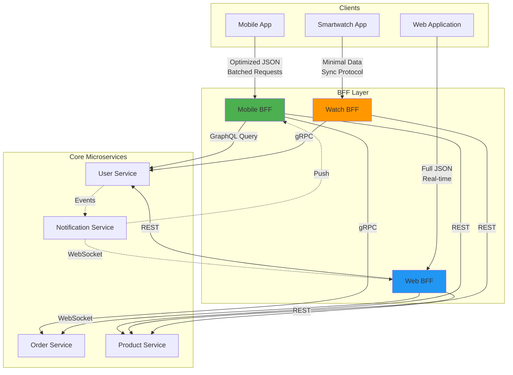

# Backend for Frontend (BFF) Pattern

## Overview

The Backend for Frontend (BFF) pattern is an architectural pattern that creates separate backend services for each frontend type. Rather than having a single monolithic backend API that serves all clients, the BFF pattern provides specialized API layers optimized for specific frontend platforms such as web, mobile, or third-party integrations.

The core principle behind the BFF pattern is simple: different frontend clients have different requirements, capabilities, and constraints. A mobile app might need batching of multiple API calls to reduce network overhead, while a web application can make more numerous but lighter HTTP requests. A smartwatch companion app might need a different data format than a phone app. The BFF pattern acknowledges these differences and creates tailored backend experiences.

This pattern emerged from real-world challenges in microservices architectures:

1. **Mobile vs. Web**: Mobile networks are often slower and less reliable than web connections, requiring optimized payloads and aggressive caching
2. **API Versioning**: Web applications can be updated instantly on the server side, while mobile apps require app store releases
3. **Data Formatting**: Different clients need different data shapes—web apps might need full HTML rendering while mobile apps prefer compact JSON
4. **Authentication Flow**: Native mobile apps can use biometric authentication while web apps use traditional session-based auth
5. **Offline Support**: Mobile apps often need offline-first capabilities that web apps don't require

The pattern was popularized by SoundCloud and Netflix, who needed to support multiple client types with different requirements while maintaining a unified backend.

## Flow Chart



The flow shows how each frontend client type connects to its dedicated BFF, which then aggregates data from core services in a format optimized for that specific client.

## Standard Example

### Basic BFF Implementation with Node.js

```javascript
// web-bff.js - Web-specific BFF
const express = require('express');
const axios = require('axios');
const app = express();

// Core service URLs
const SERVICE_URLS = {
    users: process.env.USER_SERVICE_URL || 'http://localhost:3001',
    products: process.env.PRODUCT_SERVICE_URL || 'http://localhost:3002',
    orders: process.env.ORDER_SERVICE_URL || 'http://localhost:3003',
    inventory: process.env.INVENTORY_SERVICE_URL || 'http://localhost:3004',
    notifications: process.env.NOTIFICATION_SERVICE_URL || 'http://localhost:3005'
};

// Authentication middleware
async function authenticate(req, res, next) {
    const sessionToken = req.cookies.session;
    
    if (!sessionToken) {
        return res.redirect('/login');
    }
    
    try {
        const response = await axios.post(`${SERVICE_URLS.users}/validate-session`, {
            token: sessionToken
        });
        
        req.user = response.data.user;
        next();
    } catch (error) {
        res.clearCookie('session');
        return res.redirect('/login');
    }
}

// Real-time data aggregation for web
app.get('/api/dashboard', authenticate, async (req, res) => {
    const userId = req.user.id;
    
    try {
        // Fetch data from multiple services in parallel
        const [user, orders, recommendations] = await Promise.all([
            axios.get(`${SERVICE_URLS.users}/users/${userId}`),
            axios.get(`${SERVICE_URLS.orders}/orders?userId=${userId}&limit=10`),
            axios.get(`${SERVICE_URLS.products}/recommendations?userId=${userId}`)
        ]);
        
        // Web-specific aggregation
        res.json({
            user: user.data,
            recentOrders: orders.data.orders,
            recommendations: recommendations.data,
            notifications: await fetchNotifications(userId),
            webSpecific: {
                theme: req.user.preferences?.theme || 'light',
                layout: 'full'
            }
        });
    } catch (error) {
        res.status(502).json({ error: 'Failed to load dashboard' });
    }
});

// Real-time order tracking via WebSocket
app.get('/api/orders/:orderId/track', authenticate, async (req, res) => {
    const { orderId } = req.params;
    
    const orderResponse = await axios.get(
        `${SERVICE_URLS.orders}/orders/${orderId}`
    );
    
    // Web clients get full real-time tracking
    res.json({
        ...orderResponse.data,
        tracking: {
            updates: orderResponse.data.tracking,
            estimatedDelivery: orderResponse.data.estimatedDelivery,
            liveLocation: orderResponse.data.currentLocation
        }
    });
});

app.listen(3000, () => console.log('Web BFF running on port 3000'));
```

```javascript
// mobile-bff.js - Mobile-specific BFF
const express = require('express');
const axios = require('axios');
const app = express();

const SERVICE_URLS = {
    users: process.env.USER_SERVICE_URL || 'http://localhost:3001',
    products: process.env.PRODUCT_SERVICE_URL || 'http://localhost:3002',
    orders: process.env.ORDER_SERVICE_URL || 'http://localhost:3003',
    inventory: process.env.INVENTORY_SERVICE_URL || 'http://localhost:3004',
    notifications: process.env.NOTIFICATION_SERVICE_URL || 'http://localhost:3005'
};

// Mobile token authentication
async function authenticate(req, res, next) {
    const authHeader = req.headers.authorization;
    
    if (!authHeader) {
        return res.status(401).json({ error: 'Authorization required' });
    }
    
    try {
        const response = await axios.post(`${SERVICE_URLS.users}/validate-mobile-token`, {
            token: authHeader.replace('Bearer ', '')
        });
        
        req.user = response.data.user;
        next();
    } catch (error) {
        return res.status(401).json({ error: 'Invalid token' });
    }
}

// Mobile-optimized batched API
app.post('/api/batch', authenticate, async (req, res) => {
    const { requests } = req.body;
    const results = [];
    
    // Batch multiple requests into single network call
    const batchedResponse = await axios.post(
        `${SERVICE_URLS.users}/batch`,
        {
            requests: requests.map(r => ({
                endpoint: r.endpoint,
                params: r.params
            }))
        }
    );
    
    // Transform to mobile-optimized format
    res.json({
        results: batchedResponse.data.results.map(transformForMobile)
    });
});

// Mobile-specific: Compact response format
app.get('/api/dashboard', authenticate, async (req, res) => {
    const userId = req.user.id;
    const fields = req.query.fields || 'basic';
    
    try {
        // Single optimized request for mobile
        const response = await axios.post(
            `${SERVICE_URLS.users}/mobile-dashboard`,
            {
                userId,
                fields,
                includeRecommendations: true,
                includeNotifications: true
            }
        );
        
        // Compact mobile format
        res.json(transformForMobile(response.data));
    } catch (error) {
        res.status(502).json({ error: 'Failed to load data' });
    }
});

// Mobile-specific: Offline-first caching hints
app.get('/api/products', authenticate, async (req, res) => {
    const { category, page = 1, limit = 20 } = req.query;
    
    const response = await axios.get(
        `${SERVICE_URLS.products}/products`,
        {
            params: { category, page, limit }
        }
    );
    
    // Include cache hints for mobile
    res.json({
        data: response.data.products.map(p => ({
            id: p.id,
            name: p.name,
            price: p.price,
            image: p.thumbnailUrl,
            cached: p.updatedAt
        })),
        pagination: {
            page,
            limit,
            total: response.data.total
        },
        cacheUntil: new Date(Date.now() + 300000).toISOString()
    });
});

function transformForMobile(data) {
    // Flatten and minimize data for mobile
    return {
        usr: data.user?.id,
        nm: data.user?.name,
        ord: data.orders?.map(o => ({
            id: o.id,
            st: o.status,
            dt: o.date
        })),
        rec: data.recommendations?.slice(0, 5).map(r => ({
            id: r.id,
            nm: r.name,
            pr: r.price
        }))
    };
}

app.listen(3001, () => console.log('Mobile BFF running on port 3001'));
```

### GraphQL-based BFF for Multiple Frontends

```javascript
// graphql-bff.js - Unified BFF using GraphQL
const { ApolloServer, gql } = require('apollo-server-express');
const express = require('express');
const axios = require('axios');

const typeDefs = gql`
    type User {
        id: ID!
        name: String!
        email: String!
        avatar: String
    }
    
    type Product {
        id: ID!
        name: String!
        price: Float!
        description: String
        inStock: Boolean!
    }
    
    type Order {
        id: ID!
        status: String!
        total: Float!
        items: [OrderItem!]!
        estimatedDelivery: String
    }
    
    type OrderItem {
        product: Product!
        quantity: Int!
        price: Float!
    }
    
    type Dashboard {
        user: User!
        recentOrders: [Order!]!
        recommendations: [Product!]!
        notifications: [Notification!]!
    }
    
    type MobileDashboard {
        u: UserBasic!
        o: [OrderBasic!]!
        r: [ProductBasic!]!
    }
    
    type UserBasic {
        id: ID!
        n: String!
    }
    
    type OrderBasic {
        id: ID!
        s: String!
        t: Float!
    }
    
    type ProductBasic {
        id: ID!
        n: String!
        p: Float!
        i: String
    }
    
    type Query {
        webDashboard(userId: ID!): Dashboard!
        mobileDashboard(userId: ID!): MobileDashboard!
    }
`;

const resolvers = {
    Query: {
        webDashboard: async (_, { userId }, { clientType }) => {
            // Fetch all data in parallel
            const [user, orders, recommendations] = await Promise.all([
                fetchUser(userId),
                fetchOrders(userId),
                fetchRecommendations(userId)
            ]);
            
            // Full format for web
            return {
                user,
                recentOrders: orders.slice(0, 10),
                recommendations,
                notifications: await fetchNotifications(userId)
            };
        },
        mobileDashboard: async (_, { userId }, { clientType }) => {
            // Optimized for mobile
            return await fetchMobileDashboard(userId);
        }
    }
};

async function fetchUser(userId) {
    const response = await axios.get(
        `http://user-service:3001/users/${userId}`
    );
    return response.data;
}

class ApolloServer extends ApolloServer {
    async graphQLExpressMiddleware(app, options) {
        // Add client type detection
        app.use(options.path, (req, res, next) => {
            const clientType = req.headers['x-client-type'];
            req.clientType = clientType || 'web';
            next();
        });
        
        return super.graphQLExpressMiddleware(app, options);
    }
}

const server = new ApolloServer({
    typeDefs,
    resolvers,
    context: ({ req }) => ({
        clientType: req.clientType
    })
});

server.start().then(() => {
    server.applyMiddleware({ app, path: '/graphql' });
    app.listen(3002, () => console.log('GraphQL BFF running'));
});
```

## Real-World Examples

### Example 1: E-Commerce Platform with BFF

Large e-commerce platforms like Amazon use BFF extensively:

```typescript
// typescript-ecommerce-bff.ts
interface WebProduct {
    id: string;
    name: string;
    fullDescription: string;
    images: ProductImage[];
    specifications: ProductSpec[];
    reviews: Review[];
    relatedProducts: WebProduct[];
    pricing: FullPricing;
    inventory: DetailedInventory;
}

interface MobileProduct {
    id: string;
    name: string;
    description: string;
    thumbnail: string;
    price: number;
    inStock: boolean;
}

interface WatchProduct {
    id: string;
    name: string;
    price: string;
}

// Product BFF for different clients
export class ProductBFF {
    async getProductForWeb(productId: string): Promise<WebProduct> {
        const product = await this.productService.getProduct(productId);
        const [reviews, related, inventory] = await Promise.all([
            this.reviewService.getReviews(productId),
            this.productService.getRelated(productId),
            this.inventoryService.getInventory(productId)
        ]);
        
        return {
            id: product.id,
            name: product.name,
            fullDescription: product.description,
            images: product.images,
            specifications: product.specifications,
            reviews: reviews,
            relatedProducts: related,
            pricing: product.pricing,
            inventory
        };
    }
    
    async getProductForMobile(productId: string): Promise<MobileProduct> {
        const product = await this.productService.getProduct(productId);
        const inventory = await this.inventoryService.getBasicInventory(productId);
        
        return {
            id: product.id,
            name: product.name,
            description: product.description.substring(0, 100),
            thumbnail: product.images[0]?.thumbnail,
            price: product.pricing.current,
            inStock: inventory.available > 0
        };
    }
    
    async getProductForWatch(productId: string): Promise<WatchProduct> {
        const product = await this.productService.getProduct(productId);
        
        return {
            id: product.id,
            name: product.name.substring(0, 20),
            price: `$${product.pricing.current}`
        };
    }
}
```

### Example 2: Social Media Platform BFF

Social media platforms need BFF for different client capabilities:

```java
// spring-boot-social-bff.java
@RestController
public class SocialBFFController {
    
    @GetMapping("/feed/web/{userId}")
    public ResponseEntity<WebFeedResponse> getWebFeed(@PathVariable String userId) {
        // Full web feed with all features
        WebFeedResponse response = new WebFeedResponse();
        
        List<Post> posts = postService.getFeed(userId, 50);
        List<Comment> comments = commentService.getRecentComments(userId, 100);
        List<Suggestion> suggestions = suggestionService.getSuggestions(userId);
        
        response.setPosts(posts);
        response.setComments(comments);
        response.setSuggestions(suggestions);
        response.setTrendingTopics(trendingService.getTrending());
        response.setActivityLog(activityService.getRecentActivity(userId));
        
        return ResponseEntity.ok(response);
    }
    
    @GetMapping("/feed/mobile/{userId}")
    public ResponseEntity<MobileFeedResponse> getMobileFeed(
            @PathVariable String userId,
            @RequestParam(defaultValue = "20") int limit) {
        // Optimized mobile feed
        MobileFeedResponse response = new MobileFeedResponse();
        
        List<MobilePost> posts = postService.getFeed(userId, limit)
            .stream()
            .map(this::toMobilePost)
            .collect(Collectors.toList());
        
        response.setPosts(posts);
        response.setNextCursor(getNextCursor(posts));
        
        return ResponseEntity.ok(response);
    }
    
    @GetMapping("/feed/watch/{userId}")
    public ResponseEntity<WatchFeedResponse> getWatchFeed(@PathVariable String userId) {
        // Minimal watch feed
        WatchFeedResponse response = new WatchFeedResponse();
        
        List<WatchPost> posts = postService.getFeed(userId, 5)
            .stream()
            .map(p -> WatchPost.builder()
                .author(p.getAuthor())
                .preview(p.getContent().substring(0, 50))
                .type(p.getType())
                .build())
            .collect(Collectors.toList());
        
        response.setPosts(posts);
        
        return ResponseEntity.ok(response);
    }
    
    private MobilePost toMobilePost(Post post) {
        return MobilePost.builder()
            .id(post.getId())
            .author(post.getAuthor())
            .content(post.getContent())
            .media(post.getMedia().stream()
                .map(m -> MobileMedia.builder()
                    .url(m.getThumbnail())
                    .type(m.getType())
                    .build())
                .collect(Collectors.toList()))
            .likes(post.getLikeCount())
            .comments(post.getCommentCount())
            .timestamp(post.getTimestamp())
            .build();
    }
}
```

### Example 3: IoT Companion App BFF

Smart home applications use BFF for various device types:

```python
# iot-bff.py
from dataclasses import dataclass
from typing import List, Optional
import asyncio

@dataclass
class WebDeviceStatus:
    device_id: str
    name: str
    type: str
    status: str
    settings: dict
    energy_usage: EnergyData
    history: List[HistoryPoint]
    automation_rules: List[AutomationRule]
    compatible_devices: List[Device]

@dataclass
class MobileDeviceStatus:
    device_id: str
    name: str
    status: str
    is_online: bool
    battery_level: Optional[int]
    last_seen: str

@dataclass
class WatchDeviceStatus:
    device_id: str
    name: str
    status: str

class IoTBFF:
    def __init__(self):
        self.device_service = DeviceService()
        self.energy_service = EnergyService()
        self.automation_service = AutomationService()
    
    async def get_device_status_web(self, device_id: str) -> WebDeviceStatus:
        device = await self.device_service.get_device(device_id)
        energy = await self.energy_service.get_usage(device_id, 'month')
        history = await self.device_service.get_history(device_id, 'week')
        automations = await self.automation_service.get_rules(device_id)
        compatible = await self.device_service.get_compatible(device_id)
        
        return WebDeviceStatus(
            device_id=device.id,
            name=device.name,
            type=device.type,
            status=device.status,
            settings=device.settings,
            energy_usage=energy,
            history=history,
            automation_rules=automations,
            compatible_devices=compatible
        )
    
    async def get_device_status_mobile(self, device_id: str) -> MobileDeviceStatus:
        device = await self.device_service.get_device(device_id)
        
        return MobileDeviceStatus(
            device_id=device.id,
            name=device.name,
            status=device.status,
            is_online=device.is_online,
            battery_level=device.battery,
            last_seen=device.last_seen
        )
    
    async def get_device_status_watch(self, device_id: str) -> WatchDeviceStatus:
        device = await self.device_service.get_device(device_id)
        
        return WatchDeviceStatus(
            device_id=device.id,
            name=device.name[:15],  # Truncate for watch
            status=device.status
        )
    
    async def control_device(self, device_id: str, command: str, client_type: str):
        # Different responses for different clients
        if client_type == 'web':
            return await self.web_control(device_id, command)
        elif client_type == 'mobile':
            return await self.mobile_control(device_id, command)
        elif client_type == 'watch':
            return await self.watch_control(device_id, command)
```

## Best Practices

### 1. Separate BFF per Client Type

Create dedicated BFF services for each frontend type:

```yaml
# docker-compose.yml
services:
  web-bff:
    build: ./web-bff
    ports:
      - "3000:3000"
    environment:
      CLIENT_TYPE: web
      USER_SERVICE_URL: http://user-service:3001
  
  mobile-bff:
    build: ./mobile-bff
    ports:
      - "3001:3001"
    environment:
      CLIENT_TYPE: mobile
      USER_SERVICE_URL: http://user-service:3001
      CACHE_TTL: 300
  
  watch-bff:
    build: ./watch-bff
    ports:
      - "3002:3002"
    environment:
      CLIENT_TYPE: watch
      USER_SERVICE_URL: http://user-service:3001
```

### 2. Client-Specific Data Transformation

Transform data before sending to clients:

```javascript
// data-transformer.js
class DataTransformer {
    transformForClient(data, clientType) {
        switch (clientType) {
            case 'web':
                return this.transformForWeb(data);
            case 'mobile':
                return this.transformForMobile(data);
            case 'watch':
                return this.transformForWatch(data);
            default:
                return data;
        }
    }
    
    transformForWeb(data) {
        // Full data for web
        return {
            ...data,
            enriched: true,
            formatted: this.formatForWeb(data)
        };
    }
    
    transformForMobile(data) {
        // Minified keys, compressed images
        return {
            id: data.id,
            nm: data.name,
            ds: data.description,
            im: data.images.map(i => i.thumbnail),
            pr: data.price
        };
    }
    
    transformForWatch(data) {
        // Minimal data for watch
        return {
            id: data.id,
            nm: data.name.substring(0, 20),
            st: data.status
        };
    }
}
```

### 3. Implement Health Checking

Monitor BFF health per client type:

```java
@Scheduled(fixedRate = 30000)
public void checkBFFHealth() {
    for (BFFType type : BFFType.values()) {
        Health health = healthIndicator.health(type);
        
        if (health.getStatus().equals(Status.DOWN)) {
            alertService.alert(
                String.format("%s BFF is down!", type),
                Priority.HIGH
            );
        }
    }
}
```

### 4. Handle Offline Scenarios

Implement offline support for mobile clients:

```swift
// Swift mobile offline support
class MobileBFFService {
    private let cache = NSCache<NSString, CachedData>()
    private let syncQueue = DispatchQueue(label: "sync.queue")
    
    func fetchWithOfflineSupport<T: Decodable>(
        endpoint: String,
        completion: @escaping (Result<T, Error>) -> Void
    ) {
        // First, try cache
        if let cached = cache.object(forKey: endpoint as NSString) {
            if !cached.isExpired {
                completion(.success(cached.data as! T))
                return
            }
        }
        
        // Then try network
        networkService.fetch(endpoint: endpoint) { [weak self] result in
            switch result {
            case .success(let data):
                // Cache successful response
                let cachedData = CachedData(data: data, expiresAt: Date().addingTimeInterval(300))
                self?.cache.setObject(cachedData, forKey: endpoint as NSString)
                completion(.success(data))
                
            case .failure(let error):
                // Return stale cache if available
                if let cached = self?.cache.object(forKey: endpoint as NSString) {
                    completion(.success(cached.data as! T))
                } else {
                    completion(.failure(error))
                }
            }
        }
    }
}
```

### 5. Version Client APIs

Manage API versions per client:

```java
@RestController
@RequestMapping("/api/v{version}")
public class VersionedBFFController {
    
    @GetMapping(path = "/dashboard", produces = "application/json")
    public ResponseEntity<?> getDashboard(
            @PathVariable String version,
            @RequestHeader(value = "X-Client-Type", defaultValue = "web") String clientType) {
        
        switch (version) {
            case "2":
                return getDashboardV2(clientType);
            case "1":
                return getDashboardV1(clientType);
            default:
                return ResponseEntity.badRequest().build();
        }
    }
    
    private ResponseEntity<?> getDashboardV2(String clientType) {
        // Latest version with new features
        return ResponseEntity.ok(new DashboardV2());
    }
    
    private ResponseEntity<?> getDashboardV1(String clientType) {
        // Legacy version for older clients
        return ResponseEntity.ok(new DashboardV1());
    }
}
```

### 6. Implement Feature Flags

Enable features per client type:

```python
# feature-flags.py
class FeatureFlagService:
    def __init__(self):
        self.flags = {
            'web': {
                'realtime_tracking': True,
                'advanced_analytics': True,
                'social_sharing': True
            },
            'mobile': {
                'realtime_tracking': True,
                'offline_support': True,
                'push_notifications': True
            },
            'watch': {
                'basic_notifications': True,
                'quick_reply': False
            }
        }
    
    def is_enabled(self, feature: str, client_type: str) -> bool:
        return self.flags.get(client_type, {}).get(feature, False)
    
    def get_enabled_features(self, client_type: str) -> List[str]:
        return [f for f, enabled in self.flags.get(client_type, {}).items() if enabled]
```

### 7. Optimize Network Requests

Minimize network overhead for mobile:

```javascript
// request-optimization.js
class MobileRequestOptimizer {
    async aggregateRequests(endpoints) {
        // Combine multiple API calls into batch
        const response = await axios.post('/api/batch', {
            requests: endpoints.map(e => ({
                method: 'GET',
                path: e,
                priority: this.getPriority(e)
            }))
        });
        
        return this.distribute(response.data.results);
    }
    
    prioritizeEndpoints(endpoints) {
        // Critical data first
        const critical = ['/user/profile', '/notifications'];
        const important = ['/orders/recent', '/recommendations'];
        const optional = ['/trending', '/suggestions'];
        
        return endpoints.sort((a, b) => {
            const priority = (endpoint) => {
                if (critical.includes(endpoint)) return 0;
                if (important.includes(endpoint)) return 1;
                return 2;
            };
            return priority(a) - priority(b);
        });
    }
}
```

### 8. Monitor Performance Per Client

Track metrics per client type:

```java
@Component
public class BFFMetrics {
    private final Counter webRequests;
    private final Counter mobileRequests;
    private final Counter watchRequests;
    private final Histogram webLatency;
    private final Histogram mobileLatency;
    
    public void recordRequest(String clientType, long latencyMs) {
        switch (clientType) {
            case "web":
                webRequests.increment();
                webLatency.record(latencyMs);
                break;
            case "mobile":
                mobileRequests.increment();
                mobileLatency.record(latencyMs);
                break;
            case "watch":
                watchRequests.increment();
                break;
        }
    }
}
```

## Summary

The Backend for Frontend (BFF) pattern addresses the challenge of serving diverse client types from a microservices architecture:

- **Client Optimization**: Each BFF is tailored for specific client capabilities and constraints
- **Data Shaping**: Responses are formatted appropriately for each client
- **Independent Deployment**: Client-specific changes don't affect other platforms
- **Fault Isolation**: Issues in one client type don't affect others

Key implementation considerations:

1. Create dedicated BFF services per client type (web, mobile, watch, third-party)
2. Implement client-specific data transformation
3. Handle offline scenarios and caching for mobile
4. Manage API versions per client
5. Monitor performance separately per client type

The BFF pattern is especially valuable for organizations with multiple client types requiring different optimizations and feature sets.