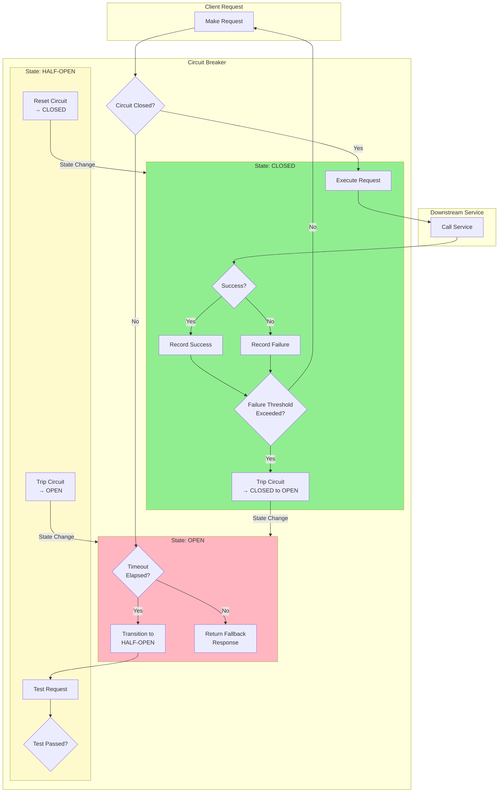

# Circuit Breaker Pattern

## Overview

The Circuit Breaker pattern is a resilience mechanism that prevents cascading failures in distributed systems. Inspired by electrical circuit breakers that prevent damage from power surges, the software pattern monitors for failures and "trips" when a failure threshold is exceeded, stopping further requests to failing services and allowing them time to recover.

In microservices architectures, the Circuit Breaker pattern serves several critical purposes:

1. **Failure Isolation**: Prevents failures from cascading across services
2. **Service Recovery**: Gives failing services time to recover
3. **Graceful Degradation**: Allows systems to function with reduced functionality
4. **Observable Failures**: Provides clear signals about service health
5. **Resource Conservation**: Prevents resource exhaustion from retry storms

The pattern operates in three states:

- **Closed**: Normal operation—requests pass through, failures are counted
- **Open**: Circuit is "tripped"—requests fail immediately without reaching the service
- **Half-Open**: Testing recovery—limited requests are allowed to test service health

This pattern became widely popular through Netflix's Hystrix library, and has been implemented in various languages and frameworks including Resilience4j (Java), Polly (.NET), Breaker (Go), and others.

## Flow Chart



The flow shows the three states of the Circuit Breaker pattern and how requests are handled in each state.

## Standard Example

### Basic Circuit Breaker Implementation

```java
// CircuitBreaker.java - Custom implementation
public class CircuitBreaker {
    
    private final String name;
    private final CircuitBreakerConfig config;
    private final AtomicReference<State> state;
    private final AtomicInteger failureCount;
    private final AtomicInteger successCount;
    private volatile Long lastFailureTime;
    
    public enum State {
        CLOSED, OPEN, HALF_OPEN
    }
    
    public CircuitBreaker(String name, CircuitBreakerConfig config) {
        this.name = name;
        this.config = config;
        this.state = new AtomicReference<>(State.CLOSED);
        this.failureCount = new AtomicInteger(0);
        this.successCount = new AtomicInteger(0);
    }
    
    public <T> T execute(Supplier<T> operation, Supplier<T> fallback) {
        if (!isAllowed()) {
            return fallback.get();
        }
        
        try {
            T result = operation.get();
            onSuccess();
            return result;
        } catch (Exception e) {
            onFailure();
            return fallback.get();
        }
    }
    
    private boolean isAllowed() {
        State currentState = state.get();
        
        switch (currentState) {
            case CLOSED:
                return true;
                
            case OPEN:
                if (isTimeoutElapsed()) {
                    if (state.compareAndSet(State.OPEN, State.HALF_OPEN)) {
                        return true;
                    }
                }
                return false;
                
            case HALF_OPEN:
                return true;
                
            default:
                return false;
        }
    }
    
    private void onSuccess() {
        State currentState = state.get();
        
        if (currentState == State.HALF_OPEN) {
            state.set(State.CLOSED);
            failureCount.set(0);
            successCount.set(0);
        } else if (currentState == State.CLOSED) {
            failureCount.set(0);
        }
    }
    
    private void onFailure() {
        lastFailureTime = System.currentTimeMillis();
        
        int failures = failureCount.incrementAndGet();
        
        if (state.get() == State.HALF_OPEN) {
            state.set(State.OPEN);
        } else if (failures >= config.getFailureThreshold()) {
            state.set(State.OPEN);
        }
    }
    
    private boolean isTimeoutElapsed() {
        return lastFailureTime != null &&
            System.currentTimeMillis() - lastFailureTime > config.getOpenToHalfOpenTimeout();
    }
}

// CircuitBreakerConfig.java
public class CircuitBreakerConfig {
    private int failureThreshold = 5;
    private long openToHalfOpenTimeout = 60000;
    private int requiredSuccessCalls = 3;
    
    // Getters and setters
}
```

### Resilience4j Implementation

Resilience4j is the modern circuit breaker library for Java:

```java
// resilience4j-example.java
public class ProductService {
    
    private final CircuitBreakerRegistry circuitBreakerRegistry;
    private final ProductRepository productRepository;
    
    public ProductService(ProductRepository productRepository) {
        this.productRepository = productRepository;
        
        // Configure circuit breaker
        CircuitBreakerConfig config = CircuitBreakerConfig.custom()
            .failureRateThreshold(50)
            .slowCallRateThreshold(100)
            .slowCallDurationThreshold(Duration.ofSeconds(2))
            .waitDurationInOpenState(Duration.ofSeconds(30))
            .permittedNumberOfCallsInHalfOpenState(3)
            .minimumNumberOfCalls(10)
            .slidingWindowType(SlidingWindowType.COUNT_BASED)
            .slidingWindowSize(10)
            .build();
        
        circuitBreakerRegistry = CircuitBreakerRegistry.of(config);
    }
    
    public Product getProduct(String productId) {
        CircuitBreaker circuitBreaker = circuitBreakerRegistry.circuitBreaker("productService");
        
        CheckedFunction0<Product> decoratedSupplier = Decorators
            .ofSupplier(() -> productRepository.findById(productId))
            .withCircuitBreaker(circuitBreaker)
            .withFallback(
                List.of(Exception.class),
                e -> getFallbackProduct(productId)
            )
            .decorate();
        
        return decoratedSupplier.apply();
    }
    
    private Product getFallbackProduct(String productId) {
        // Return cached product or default
        Product cached = productCache.get(productId);
        return cached != null ? cached : Product.getDefault(productId);
    }
}
```

```java
// Spring Boot with Resilience4j
@Configuration
public class Resilience4jConfig {
    
    @Bean
    public CircuitBreakerRegistry circuitBreakerRegistry(
            CircuitBreakerProperties properties) {
        return CircuitBreakerRegistry.of(properties);
    }
    
    @Bean
    public Customizer<Resilience4jConfigurer> resilience4jCustomizer() {
        return customizer -> customizer
            .circuitBreaker("productService", registry -> registry
                .failureRateThreshold(50)
                .waitDurationInOpenState(Duration.ofSeconds(30)))
            .circuitBreaker("orderService", registry -> registry
                .failureRateThreshold(30)
                .waitDurationInOpenState(Duration.ofSeconds(60)));
    }
}

@Service
public class ProductServiceWithCB {
    
    private final CircuitBreakerRegistry registry;
    
    @CircuitBreaker(name = "productService", fallbackMethod = "getProductFallback")
    public Product getProduct(String productId) {
        return productRepository.findById(productId);
    }
    
    private Product getProductFallback(String productId, Throwable t) {
        logger.warn("Circuit breaker fallback for product {}", productId, t);
        return Product.getDefault(productId);
    }
}
```

### Hystrix Implementation (Legacy)

Netflix Hystrix was the original popular circuit breaker library:

```java
// HystrixCommandExample.java
public class GetProductCommand extends HystrixCommand<Product> {
    
    private final String productId;
    private final ProductRepository repository;
    
    public GetProductCommand(String productId, ProductRepository repository) {
        super(Setter
            .withGroupKey(HystrixCommandGroupKey.Factory.asKey("ProductGroup"))
            .andCommandKey(HystrixCommandKey.Factory.asKey("GetProductCommand"))
            .andThreadPoolKey(HystrixThreadPoolKey.Factory.asKey("ProductPool"))
            .andCommandPropertiesDefaults(HystrixCommandProperties.Setter()
                .withExecutionIsolationStrategy(ExecutionIsolationStrategy.SEMAPHORE)
                .withExecutionTimeoutInMilliseconds(5000)
                .withCircuitBreakerRequestVolumeThreshold(10)
                .withCircuitBreakerSleepWindowInMilliseconds(5000)
                .withCircuitBreakerErrorThresholdPercentage(50))
            .andThreadPoolPropertiesDefaults(HystrixThreadPoolProperties.Setter()
                .withCoreSize(10)
                .withMaxQueueSize(100)
                .withQueueSizeRejectionThreshold(80)));
        
        this.productId = productId;
        this.repository = repository;
    }
    
    @Override
    protected Product run() throws Exception {
        return repository.findById(productId);
    }
    
    @Override
    protected Product getFallback() {
        return Product.getDefault(productId);
    }
}

// Using the command
public class ProductService {
    
    public Product getProduct(String productId) {
        return new GetProductCommand(productId, productRepository)
            .execute();
    }
    
    public CompletableFuture<Product> getProductAsync(String productId) {
        return new GetProductCommand(productId, productRepository)
            .toObservable()
            .toFuture();
    }
}
```

## Real-World Examples

### Example 1: E-Commerce Order Service

Online stores use circuit breakers to handle service failures gracefully:

```java
// OrderService with CircuitBreaker
@Service
public class OrderService {
    
    private final CircuitBreakerRegistry registry;
    private final OrderRepository orderRepository;
    private final PaymentService paymentService;
    private final InventoryService inventoryService;
    
    public Order createOrder(OrderRequest request) {
        CircuitBreaker paymentCB = registry.circuitBreaker("paymentService");
        CircuitBreaker inventoryCB = registry.circuitBreaker("inventoryService");
        
        // Check inventory with circuit breaker
        InventoryCheckResult inventoryCheck = Try.ofSupplier(
            Decorators.ofSupplier(() -> inventoryService.checkAvailability(request.getItems()))
                .withCircuitBreaker(inventoryCB)
                .decorate()
        ).getOrElse(InventoryCheckResult.unavailable());
        
        if (!inventoryCheck.isAvailable()) {
            throw new InventoryException("Items not available");
        }
        
        // Process payment with circuit breaker
        PaymentResult paymentResult = Try.ofSupplier(
            Decorators.ofSupplier(() -> paymentService.process(request.getPayment()))
                .withCircuitBreaker(paymentCB)
                .decorate()
        ).getOrElse(PaymentResult.declined());
        
        if (!paymentResult.isSuccess()) {
            throw new PaymentException("Payment failed");
        }
        
        return orderRepository.save(new Order(request));
    }
    
    public List<Order> getRecentOrders(String userId) {
        return orderRepository.findByUserId(userId);
    }
}
```

### Example 2: Payment Gateway Circuit Breaker

Financial services implement circuit breakers for external payment processors:

```java
// PaymentGatewayCircuitBreaker
public class PaymentGatewayWithCircuitBreaker {
    
    private final CircuitBreaker stripeCB;
    private final CircuitBreaker paypalCB;
    private final CircuitBreaker squareCB;
    
    public PaymentGatewayWithCircuitBreaker() {
        CircuitBreakerConfig stripeConfig = CircuitBreakerConfig.custom()
            .failureRateThreshold(10)  // Very low threshold for financial services
            .waitDurationInOpenState(Duration.ofMinutes(1))
            .permittedNumberOfCallsInHalfOpenState(2)
            .minimumNumberOfCalls(5)
            .build();
        
        stripeCB = CircuitBreakerRegistry.of(stripeConfig).circuitBreaker("stripe");
        paypalCB = CircuitBreakerRegistry.of(stripeConfig).circuitBreaker("paypal");
        squareCB = CircuitBreakerRegistry.of(stripeConfig).circuitBreaker("square");
    }
    
    public PaymentResult processPayment(PaymentRequest request) {
        // Try primary gateway (Stripe)
        Try<PaymentResult> result = Try.ofSupplier(
            Decorators.ofSupplier(() -> processWithStripe(request))
                .withCircuitBreaker(stripeCB)
                .decorate()
        );
        
        if (result.isFailure()) {
            // Try backup gateway (PayPal)
            result = Try.ofSupplier(
                Decorators.ofSupplier(() -> processWithPaypal(request))
                    .withCircuitBreaker(paypalCB)
                    .decorate()
            );
        }
        
        if (result.isFailure()) {
            // Try final backup (Square)
            result = Try.ofSupplier(
                Decorators.ofSupplier(() -> processWithSquare(request))
                    .withCircuitBreaker(squareCB)
                    .decorate()
            );
        }
        
        return result.getOrElse(PaymentResult.systemError());
    }
    
    public CircuitBreakerMetrics getMetrics() {
        return CircuitBreakerMetrics.of(stripeCB, paypalCB, squareCB);
    }
}
```

### Example 3: Fallback Strategies

Implementation of various fallback strategies:

```python
# python-circuit-breaker.py
from functools import wraps
import time
import threading
from typing import Callable, Any, List

class CircuitBreaker:
    def __init__(self, failure_threshold: int = 5, 
                 recovery_timeout: int = 60,
                 expected_exception: type = Exception):
        self.failure_threshold = failure_threshold
        self.recovery_timeout = recovery_timeout
        self.expected_exception = expected_exception
        
        self._failure_count = 0
        self._last_failure_time = None
        self._state = "closed"
        self._lock = threading.Lock()
    
    @property
    def state(self) -> str:
        with self._lock:
            if self._state == "open":
                if time.time() - self._last_failure_time > self.recovery_timeout:
                    self._state = "half-open"
            return self._state
    
    def call(self, func: Callable, *args, fallback: Callable = None, 
            **kwargs) -> Any:
        if self.state == "open":
            if fallback:
                return fallback(*args, **kwargs)
            raise CircuitBreakerOpen("Circuit is open")
        
        try:
            result = func(*args, **kwargs)
            self._reset()
            return result
        except self.expected_exception as e:
            self._record_failure()
            if fallback:
                return fallback(*args, **kwargs)
            raise
    
    def _record_failure(self):
        with self._lock:
            self._failure_count += 1
            self._last_failure_time = time.time()
            if self._failure_count >= self.failure_threshold:
                self._state = "open"
    
    def _reset(self):
        with self._lock:
            self._failure_count = 0
            self._state = "closed"

# Usage with different fallback strategies
class ProductService:
    def __init__(self):
        self.cb = CircuitBreaker(failure_threshold=5, recovery_timeout=60)
        self.cache = {}
    
    def get_product(self, product_id: str) -> dict:
        # Cache fallback
        def cache_fallback(product_id):
            return self.cache.get(product_id, {
                "id": product_id,
                "name": "Unknown Product",
                "price": 0.0,
                "source": "fallback"
            })
        
        return self.cb.call(
            self._fetch_product,
            product_id,
            fallback=cache_fallback
        )
    
    def _fetch_product(self, product_id: str) -> dict:
        if random.random() < 0.3:  # Simulate 30% failure rate
            raise ExternalServiceError("Service unavailable")
        
        return {"id": product_id, "name": "Test Product", "price": 9.99}
```

## Best Practices

### 1. Configure Appropriate Thresholds

Set thresholds based on service criticality:

```java
// Threshold configuration examples
CircuitBreakerConfig criticalService = CircuitBreakerConfig.custom()
    .failureRateThreshold(30)  // Lower threshold for critical services
    .waitDurationInOpenState(Duration.ofSeconds(30))
    .minimumNumberOfCalls(5)
    .build();

CircuitBreakerConfig nonCriticalService = CircuitBreakerConfig.custom()
    .failureRateThreshold(70)  // Higher threshold for non-critical services
    .waitDurationInOpenState(Duration.ofMinutes(2))
    .minimumNumberOfCalls(20)
    .build();
```

### 2. Implement Proper Fallbacks

Design meaningful fallback responses:

```java
public interface ProductService {
    
    @CircuitBreaker(name = "productService", fallbackMethod = "getProductFallback")
    Product getProduct(String productId);
    
    default Product getProductFallback(String productId, Throwable t) {
        // Strategy 1: Return cached data
        Product cached = productCache.get(productId);
        if (cached != null) {
            return cached;
        }
        
        // Strategy 2: Return default product with warning
        Product defaultProduct = Product.default(productId);
        defaultProduct.setWarning("Fallback response - service degraded");
        return defaultProduct;
    }
}
```

### 3. Monitor Circuit Breaker State

Expose circuit breaker metrics:

```java
@RestController
public class CircuitBreakerHealthController {
    
    @GetMapping("/health/circuit-breakers")
    public Map<String, CircuitBreakerHealth> getCircuitBreakerHealth() {
        Map<String, CircuitBreakerHealth> health = new HashMap<>();
        
        for (String name : registry.getAllCircuitBreakerNames()) {
            CircuitBreaker cb = registry.circuitBreaker(name);
            CircuitBreaker.Metrics metrics = cb.getMetrics();
            
            health.put(name, new CircuitBreakerHealth(
                cb.getState().toString(),
                metrics.getFailureRate(),
                metrics.getSlowCallRate(),
                metrics.getNumberOfSuccessfulCalls(),
                metrics.getNumberOfFailedCalls()
            ));
        }
        
        return health;
    }
}
```

### 4. Use Bulkhead with Circuit Breaker

Combine bulkhead pattern for better resilience:

```java
public class ServiceWithBulkheadAndCB {
    
    public void serviceCall() {
        Decorators.ofRunnable(() -> service.process())
            .withBulkhead(bulkhead)
            .withCircuitBreaker(circuitBreaker)
            .withRetry(Retry.ofDefaults())
            .decorate()
            .run();
    }
}
```

### 5. Handle Partial Failures

Implement partial failure handling for batch operations:

```java
public class BatchService {
    
    public BatchResult processBatch(List<Item> items) {
        List<Result> results = new ArrayList<>();
        int successCount = 0;
        int fallbackCount = 0;
        
        for (Item item : items) {
            try {
                results.add(processItem(item));
                successCount++;
            } catch (Exception e) {
                results.add(Result.fallback(item));
                fallbackCount++;
            }
        }
        
        return new BatchResult(results, successCount, fallbackCount);
    }
}
```

### 6. Test Circuit Breaker Behavior

Test circuit breaker in various scenarios:

```java
@Test
public void testCircuitBreakerOpens() {
    CircuitBreakerConfig config = CircuitBreakerConfig.custom()
        .failureRateThreshold(50)
        .minimumNumberOfCalls(5)
        .build();
    
    CircuitBreaker cb = new CircuitBreaker("test", config);
    
    // Fail more than threshold
    for (int i = 0; i < 10; i++) {
        try {
            cb.execute(() -> { throw new Exception("fail"); }, () -> "fallback");
        } catch (Exception e) {
            // Expected
        }
    }
    
    // Circuit should be open now
    assertEquals(CircuitBreaker.State.OPEN, cb.getState());
}
```

### 7. Implement Graceful Recovery

Ensure services can recover properly:

```java
public class RecoverableService {
    
    public void onRecovery() {
        // Reset caches
        resetLocalCache();
        
        // Re-establish connections
        reconnectServices();
        
        // Notify monitoring
        alertservice.sendRecoveryNotification();
    }
}
```

### 8. Log Circuit Breaker Events

Implement comprehensive logging:

```java
public class CircuitBreakerWithLogging {
    
    private void onStateTransition(State from, State to) {
        logger.info("Circuit breaker {} transitioned from {} to {}", 
            name, from, to);
        
        if (to == State.OPEN) {
            alertService.alert(name + " circuit opened", Priority.HIGH);
        } else if (to == State.CLOSED) {
            alertService.alert(name + " circuit closed", Priority.INFO);
        }
    }
}
```

## Summary

The Circuit Breaker pattern provides critical resilience for distributed systems:

- **Failure Prevention**: Stops cascading failures from propagating
- **Graceful Degradation**: Allows systems to function with reduced capability
- **Service Recovery**: Gives failing services time to recover
- **Observability**: Provides clear visibility into service health

Key implementation considerations:

1. Set appropriate failure thresholds based on service criticality
2. Implement meaningful fallback responses
3. Monitor and expose circuit breaker metrics
4. Consider combining with other resilience patterns (bulkhead, retry)
5. Test circuit breaker behavior in various failure scenarios

The Circuit Breaker pattern is essential for building robust microservices that can handle partial failures gracefully while maintaining overall system availability.