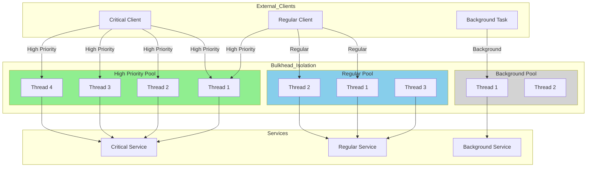

# Bulkhead Pattern

## Overview

The Bulkhead pattern is a resilience mechanism that isolates resources to prevent failures from spreading across the system. Named after the watertight compartments in naval vessels—where a breach in one compartment doesn't cause the entire ship to sink—this pattern ensures that when one part of the system fails, other parts can continue functioning.

In microservices architectures, the Bulkhead pattern addresses critical challenges:

1. **Resource Isolation**: Prevents one failing service from consuming all available resources
2. **Failure Containment**: Limits the blast radius of failures
3. **Graceful Degradation**: Allows partial system functionality during failures
4. **Predictable Performance**: Provides predictable resource availability per component
5. **Priority-Based Allocation**: Ensures critical functions get resources first

The pattern can be implemented in several ways:

- **Thread Pool Isolation**: Each service gets its own thread pool
- **Process Isolation**: Critical services run in separate processes
- **Connection Pool Isolation**: Database connections are pool-specific
- **Semaphore Isolation**: Uses semaphores to limit concurrent executions

Netflix's Hystrix library pioneered this pattern, and it's now implemented in Resilience4j, Polly, and other resilience frameworks.

## Flow Chart



This diagram shows how different clients are isolated into separate thread pools, ensuring that one pool's saturation doesn't affect others.

## Standard Example

### Basic Thread Pool Bulkhead Implementation

```java
// BulkheadRegistry.java - Custom bulkhead implementation
public class BulkheadRegistry {
    
    private final Map<String, Bulkhead> bulkheads = new ConcurrentHashMap<>();
    
    public Bulkhead getOrCreate(String name, BulkheadConfig config) {
        return bulkheads.computeIfAbsent(name, n -> new Bulkhead(config));
    }
    
    public static class Bulkhead {
        
        private final String name;
        private final Semaphore semaphore;
        private final AtomicInteger activeCalls;
        private final int maxConcurrentCalls;
        private final int maxWaitDuration;
        
        public Bulkhead(BulkheadConfig config) {
            this.name = config.getName();
            this.maxConcurrentCalls = config.getMaxConcurrentCalls();
            this.maxWaitDuration = config.getMaxWaitDuration();
            this.semaphore = new Semaphore(maxConcurrentCalls);
            this.activeCalls = new AtomicInteger(0);
        }
        
        public <T> T execute(Callable<T> operation, Callable<T> fallback) 
                throws Exception {
            if (!semaphore.tryAcquire(maxWaitDuration, TimeUnit.MILLISECONDS)) {
                return fallback.call();
            }
            
            try {
                activeCalls.incrementAndGet();
                return operation.call();
            } finally {
                activeCalls.decrementAndGet();
                semaphore.release();
            }
        }
        
        public boolean isFull() {
            return activeCalls.get() >= maxConcurrentCalls;
        }
        
        public int getAvailableSlots() {
            return maxConcurrentCalls - activeCalls.get();
        }
    }
}
```

### Resilience4j Bulkhead Implementation

Resilience4j provides a robust bulkhead implementation:

```java
// resilience4j-bulkhead-example.java
public class ProductService {
    
    private final BulkheadRegistry bulkheadRegistry;
    
    public ProductService() {
        BulkheadConfig config = BulkheadConfig.custom()
            .maxConcurrentCalls(20)
            .maxWaitDuration(Duration.ofMillis(500))
            .build();
        
        bulkheadRegistry = BulkheadRegistry.of(config);
    }
    
    public Product getProduct(String productId) {
        Bulkhead bulkhead = bulkheadRegistry.bulkhead("productService");
        
        CheckedFunction0<Product> decorated = Decorators
            .ofSupplier(() -> fetchProduct(productId))
            .withBulkhead(bulkhead)
            .withFallback(
                List.of(BulkheadFullException.class),
                e -> Product.getDefault()
            )
            .decorate();
        
        return decorated.apply();
    }
    
    public List<Product> searchProducts(String query) {
        Bulkhead bulkhead = bulkheadRegistry.bulkhead("searchService");
        
        CheckedFunction0<List<Product>> decorated = Decorators
            .ofSupplier(() -> doSearch(query))
            .withBulkhead(bulkhead)
            .decorate();
        
        return decorated.apply();
    }
}
```

```java
// Spring Boot with Resilience4j Bulkhead
@Configuration
public class BulkheadConfiguration {
    
    @Bean
    public BulkheadRegistry bulkheadRegistry(BulkheadProperties properties) {
        return BulkheadRegistry.of(properties);
    }
}

@Service
public class OrderService {
    
    private final BulkheadRegistry bulkheadRegistry;
    
    @Bulkhead(name = "orderBulkhead", fallbackMethod = "orderFallback")
    public Order createOrder(OrderRequest request) {
        // Create order logic
    }
    
    private Order orderFallback(OrderRequest request, Throwable t) {
        // Return queued order
        return Order.queued(request);
    }
}
```

### Semaphore-Based Bulkhead

```java
// SemaphoreBulkhead.java
public class SemaphoreBulkhead {
    
    private final String name;
    private final Semaphore semaphore;
    private final AtomicInteger available;
    private final int maxConcurrentCalls;
    
    public SemaphoreBulkhead(String name, int maxConcurrentCalls) {
        this.name = name;
        this.maxConcurrentCalls = maxConcurrentCalls;
        this.semaphore = new Semaphore(maxConcurrentCalls);
        this.available = new AtomicInteger(maxConcurrentCalls);
    }
    
    public void enter() throws BulkheadException {
        if (!semaphore.tryAcquire()) {
            throw new BulkheadException(
                "Bulkhead " + name + " is full. " +
                available.get() + " slots available of " + maxConcurrentCalls
            );
        }
        available.decrementAndGet();
    }
    
    public void exit() {
        semaphore.release();
        available.incrementAndGet();
    }
    
    public <T> T execute(Callable<T> operation) throws Exception {
        enter();
        try {
            return operation.call();
        } finally {
            exit();
        }
    }
}

// Usage
public class ServiceWithSemaphoreBulkhead {
    
    private final Map<String, SemaphoreBulkhead> bulkheads = new HashMap<>();
    
    public ServiceWithSemaphoreBulkhead() {
        bulkheads.put("critical", new SemaphoreBulkhead("critical", 5));
        bulkheads.put("regular", new SemaphoreBulkhead("regular", 10));
        bulkheads.put("background", new SemaphoreBulkhead("background", 3));
    }
    
    public <T> T executeWithBulkhead(String name, Callable<T> operation) {
        SemaphoreBulkhead bulkhead = bulkheads.get(name);
        return bulkhead.execute(operation);
    }
}
```

## Real-World Examples

### Example 1: Database Connection Pool Isolation

Different services use separate database connection pools:

```java
// DatabaseBulkheadConfig.java
@Configuration
public class DatabaseBulkheadConfig {
    
    @Bean
    @Primary
    public DataSource criticalDataSource() {
        return createDataSource(
            "jdbc:postgresql://critical-db:5432/critical",
            "critical-pool",
            10,  // Core connections
            20,  // Max connections
            30   // Queue timeout
        );
    }
    
    @Bean
    @Qualifier("reportingDataSource")
    public DataSource reportingDataSource() {
        return createDataSource(
            "jdbc:postgresql://reporting-db:5432/reporting",
            "reporting-pool",
            5,
            10,
            60
        );
    }
    
    @Bean
    @Qualifier("analyticsDataSource")
    public DataSource analyticsDataSource() {
        return createDataSource(
            "jdbc:postgresql://analytics-db:5432/analytics",
            "analytics-pool",
            2,
            5,
            120
        );
    }
    
    private DataSource createDataSource(String url, String poolName,
            int coreSize, int maxSize, int queueTimeout) {
        return new HikariDataSource(new HikariConfig() {{
            setJdbcUrl(url);
            setPoolName(poolName);
            setMinimumIdle(coreSize);
            setMaximumPoolSize(maxSize);
            setConnectionTimeout(queueTimeout);
            setLeakDetectionThreshold(60000);
        }});
    }
}

// Service using specific pool
@Service
public class CriticalOrderService {
    
    @Autowired
    @Qualifier("criticalDataSource")
    private DataSource dataSource;
    
    @Transactional
    public Order createOrder(OrderRequest request) {
        try (Connection conn = dataSource.getConnection()) {
            // Process order
        }
    }
}
```

### Example 2: HTTP Client Isolation

Different HTTP clients with separate connection pools:

```java
// HttpClientIsolation.java
public class HttpClientRegistry {
    
    private static final int TIMEOUT = 5000;
    private static final int MAX_CONNECTIONS = 50;
    
    private final OkHttpClient criticalClient;
    private final OkHttpClient regularClient;
    private final OkHttpClient backgroundClient;
    
    public HttpClientRegistry() {
        this.criticalClient = createClient(
            "critical", 20, 50, 10000
        );
        this.regularClient = createClient(
            "regular", 10, 30, 5000
        );
        this.backgroundClient = createClient(
            "background", 2, 10, 30000
        );
    }
    
    private OkHttpClient createClient(String name, int connectPoolSize,
            int maxRequests, int timeout) {
        ConnectionPool pool = new ConnectionPool(
            connectPoolSize, 
            5, 
            TimeUnit.MINUTES
        );
        
        return new OkHttpClient.Builder()
            .connectionPool(pool)
            .dispatcher(new Dispatcher(new ExecutorService[]{
                Executors.newFixedThreadPool(connectPoolSize),
                Executors.newFixedThreadPool(maxRequests)
            }))
            .connectTimeout(timeout, TimeUnit.MILLISECONDS)
            .readTimeout(timeout, TimeUnit.MILLISECONDS)
            .writeTimeout(timeout, TimeUnit.MILLISECONDS)
            .retryOnConnectionFailure(true)
            .build();
    }
    
    public OkHttpClient getClient(String priority) {
        switch (priority) {
            case "critical": return criticalClient;
            case "regular": return regularClient;
            case "background": return backgroundClient;
            default: return regularClient;
        }
    }
}

// Service using priority client
public class ProductService {
    
    private final HttpClientRegistry clientRegistry;
    
    public Product getProduct(String productId, String priority) {
        OkHttpClient client = clientRegistry.getClient(priority);
        
        Request request = new Request.Builder()
            .url("https://api.example.com/products/" + productId)
            .build();
        
        try (Response response = client.newCall(request).execute()) {
            return parseProduct(response.body());
        }
    }
}
```

### Example 3: Priority-Based Task Execution

Task execution with priority-based bulkhead:

```java
// PriorityBulkheadExecutor.java
public class PriorityBulkheadExecutor {
    
    private final ExecutorService criticalExecutor;
    private final ExecutorService regularExecutor;
    private final ExecutorService backgroundExecutor;
    
    public PriorityBulkheadExecutor() {
        this.criticalExecutor = Executors.newFixedThreadPool(10);
        this.regularExecutor = Executors.newFixedThreadPool(5);
        this.backgroundExecutor = Executors.newFixedThreadPool(2);
    }
    
    public <T> Future<T> submit(Task<T> task) {
        switch (task.getPriority()) {
            case CRITICAL:
                return criticalExecutor.submit(task::execute);
            case REGULAR:
                return regularExecutor.submit(task::execute);
            case BACKGROUND:
                return backgroundExecutor.submit(task::execute);
            default:
                return regularExecutor.submit(task::execute);
        }
    }
    
    public void shutdown() {
        criticalExecutor.shutdown();
        regularExecutor.shutdown();
        backgroundExecutor.shutdown();
    }
}

// Usage in service
@Service
public class OrderProcessingService {
    
    private final PriorityBulkheadExecutor executor;
    
    public CompletableFuture<OrderResult> processOrder(Order order) {
        Task<OrderResult> task = new Task<>(() -> {
            // Process order
            return new OrderResult(order.getId(), OrderStatus.PROCESSED);
        }, Priority.CRITICAL);
        
        return CompletableFuture.supplyAsync(
            () -> executor.submit(task).get(),
            executor.criticalExecutor()
        );
    }
}
```

## Best Practices

### 1. Right-Size Thread Pools

Configure pool sizes based on service characteristics:

```java
// Pool size configuration guidelines
@Configuration
public class ThreadPoolConfiguration {
    
    @Bean
    public ExecutorService criticalServiceExecutor() {
        return new ThreadPoolExecutor(
            10,  // Core size: CPU-intensive
            20,  // Max size
            60, TimeUnit.SECONDS,
            new LinkedBlockingQueue<>(100),
            new ThreadFactory() {
                @Override
                public Thread newThread(Runnable r) {
                    Thread t = new Thread(r);
                    t.setName("critical-" + t.getId());
                    return t;
                }
            },
            new ThreadPoolExecutor.CallerRunsPolicy()
        );
    }
    
    @Bean
    public ExecutorService ioServiceExecutor() {
        return new ThreadPoolExecutor(
            20,  // More threads for I/O-bound
            50,
            60, TimeUnit.SECONDS,
            new LinkedBlockingQueue<>(200)
        );
    }
}
```

### 2. Implement Backpressure

Handle scenarios when bulkhead is full:

```java
public class BackpressureHandler {
    
    public <T> T executeWithBackpressure(
            Bulkhead bulkhead, 
            Callable<T> operation,
            Callable<T> fallback) {
        
        try {
            return bulkhead.execute(operation);
        } catch (BulkheadFullException e) {
            // Apply backpressure: queue the request
            return queueWithBackpressure(operation);
        }
    }
    
    private <T> T queueWithBackpressure(Callable<T> operation) {
        // Queue with timeout
        Future<T> queued = waitQueue.submit(operation);
        
        try {
            return queued.get(30, TimeUnit.SECONDS);
        } catch (TimeoutException e) {
            throw new BackpressureException("Request timeout due to load");
        }
    }
}
```

### 3. Monitor Bulkhead Metrics

Track bulkhead health:

```java
@Component
public class BulkheadMetrics {
    
    private final MeterRegistry meterRegistry;
    
    public void recordMetrics(Bulkhead bulkhead) {
        Gauge.builder("bulkhead.available", bulkhead, b -> b.getAvailableSlots())
            .tag("name", bulkhead.getName())
            .register(meterRegistry);
        
        Gauge.builder("bulkhead.active", bulkhead, b -> b.getActiveCalls())
            .tag("name", bulkhead.getName())
            .register(meterRegistry);
        
        Counter.builder("bulkhead.rejected")
            .tag("name", bulkhead.getName())
            .register(meterRegistry);
    }
}
```

### 4. Use Circuit Breaker with Bulkhead

Combine patterns for better resilience:

```java
public class CombinedResilience {
    
    public void execute() {
        Decorators.ofRunnable(() -> doWork())
            .withBulkhead(bulkhead)           // Limit concurrent calls
            .withCircuitBreaker(circuitBreaker) // Stop on failures
            .withRetry(Retry.ofDefaults())    // Retry transient failures
            .decorate()
            .run();
    }
}
```

### 5. Implement Graceful Shutdown

Handle shutdown properly:

```java
public class GracefulShutdown {
    
    public void shutdown(ExecutorService executor) {
        executor.shutdown();
        
        try {
            if (!executor.awaitTermination(60, TimeUnit.SECONDS)) {
                executor.shutdownNow();
                
                if (!executor.awaitTermination(60, TimeUnit.SECONDS)) {
                    executor.shutdownNow();
                }
            }
        } catch (InterruptedException e) {
            executor.shutdownNow();
            Thread.currentThread().interrupt();
        }
    }
}
```

### 6. Prioritize Critical Requests

Implement priority-based bulkhead:

```java
public class PriorityBulkhead {
    
    private final Map<Priority, Semaphore> semaphores = new EnumMap<>(Priority.class);
    
    public PriorityBulkhead() {
        semaphores.put(Priority.CRITICAL, new Semaphore(10));
        semaphores.put(Priority.REGULAR, new Semaphore(5));
        semaphores.put(Priority.BACKGROUND, new Semaphore(2));
    }
    
    public <T> T execute(Callable<T> operation, Priority priority) throws Exception {
        Semaphore semaphore = semaphores.get(priority);
        
        if (!semaphore.tryAcquire(5000, TimeUnit.MILLISECONDS)) {
            throw new BulkheadFullException("No slots available for " + priority);
        }
        
        try {
            return operation.call();
        } finally {
            semaphore.release();
        }
    }
}
```

### 7. Configure Timeouts

Always configure timeouts:

```java
BulkheadConfig config = BulkheadConfig.custom()
    .maxConcurrentCalls(20)
    .maxWaitDuration(Duration.ofMillis(500))  // Wait max 500ms
    .build();
```

### 8. Test Bulkhead Behavior

Test bulkhead in various scenarios:

```java
@Test
public void testBulkheadBlocksWhenFull() throws Exception {
    SemaphoreBulkhead bulkhead = new SemaphoreBulkhead("test", 2);
    CountDownLatch latch = new CountDownLatch(2);
    CompletableFuture<Void> extraCall = CompletableFuture.runAsync(() -> {
        try {
            bulkhead.execute(() -> Thread.sleep(1000));
        } catch (Exception e) {
            // Expected
        }
    });
    
    // Wait for first two calls to start
    Thread.sleep(100);
    
    // Third call should fail
    assertThrows(BulkheadException.class, () -> 
        bulkhead.execute(() -> "test")
    );
}
```

## Summary

The Bulkhead pattern provides critical isolation for microservices:

- **Resource Protection**: Prevents resource exhaustion from affecting other services
- **Failure Isolation**: Contains failures within their blast radius
- **Predictable Performance**: Ensures resources are available for critical functions
- **Priority Handling**: Allows critical work to proceed under load

Key implementation considerations:

1. Right-size pools based on service characteristics (CPU vs I/O bound)
2. Implement backpressure when bulkhead is full
3. Monitor bulkhead metrics and set up alerts
4. Combine with circuit breaker for comprehensive resilience
5. Prioritize critical requests over background tasks
6. Test bulkhead behavior under load

The Bulkhead pattern is particularly valuable in systems with varying criticalities, where critical functions must continue functioning even when non-critical functions are experiencing high load.