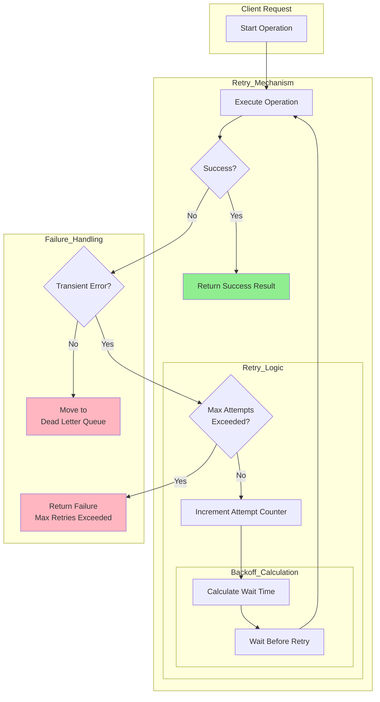

# Retry Pattern

## Overview

The Retry pattern is a resilience mechanism that automatically repeats failed operations, based on the assumption that transient failures often succeed when attempted again. In distributed systems, network issues, temporary resource unavailability, and transient errors are common, making retry logic essential for reliable operations.

The pattern addresses several challenges:

1. **Transient Failures**: Network hiccups, temporary unavailability, and timeouts are often temporary
2. **User Experience**: Users shouldn't need to manually retry operations
3. **Reliability**: Systems should be resilient to temporary failures
4. **Asynchronous Processing**: Background jobs can tolerate delayed processing
5. **Cost Optimization**: Retries can be cheaper than building redundant infrastructure

Key retry strategies include:

- **Immediate Retry**: Retry immediately without delay
- **Fixed Delay**: Wait between attempts
- **Exponential Backoff**: Wait times increase exponentially
- **Fibonacci Backoff**: Similar to exponential but increases more gradually
- **Decorrelated Jitter**: Randomized interval to prevent thundering herd

Important considerations:

- **Idempotency**: Operations must be safe to retry
- **Max Attempts**: Limit total retries to prevent infinite loops
- **Timeout**: Set overall timeout for the operation
- **Circuit Breaker**: Stop retrying after repeated failures

## Flow Chart



This flow shows the retry mechanism with backoff calculation, attempt tracking, and dead letter queue handling for persistent failures.

## Standard Example

### Basic Retry Implementation with Exponential Backoff

```java
// RetryTemplate.java - Custom retry implementation
public class RetryTemplate {
    
    private final int maxAttempts;
    private final long initialInterval;
    private final double multiplier;
    private final long maxInterval;
    
    public RetryTemplate(int maxAttempts, long initialInterval, 
                    double multiplier, long maxInterval) {
        this.maxAttempts = maxAttempts;
        this.initialInterval = initialInterval;
        this.multiplier = multiplier;
        this.maxInterval = maxInterval;
    }
    
    public <T> T execute(Callable<T> operation) throws Exception {
        Exception lastException = null;
        
        for (int attempt = 1; attempt <= maxAttempts; attempt++) {
            try {
                return operation.call();
            } catch (Exception e) {
                lastException = e;
                
                if (!isRetryable(e)) {
                    throw e;
                }
                
                if (attempt < maxAttempts) {
                    long waitTime = calculateBackoff(attempt);
                    Thread.sleep(waitTime);
                }
            }
        }
        
        throw new RetryException("Max attempts exceeded", lastException);
    }
    
    private long calculateBackoff(int attempt) {
        long interval = (long) (initialInterval * Math.pow(multiplier, attempt - 1));
        return Math.min(interval, maxInterval);
    }
    
    private boolean isRetryable(Exception e) {
        // Only retry transient errors
        return e instanceof TimeoutException ||
               e instanceof ConnectionException ||
               e instanceof ServiceUnavailableException;
    }
}
```

### Resilience4j Retry Implementation

Resilience4j provides a comprehensive retry framework:

```java
// resilience4j-retry-example.java
public class CustomerService {
    
    private final RetryRegistry retryRegistry;
    private final CustomerRepository repository;
    
    public CustomerService(CustomerRepository repository) {
        this.repository = repository;
        
        RetryConfig config = RetryConfig.custom()
            .maxAttempts(3)
            .waitDuration(Duration.ofMillis(500))
            .retryExceptions(IOException.class, TimeoutException.class)
            .ignoreExceptions(BusinessException.class)
            .intervalFunction(IntervalFunction.ofExponentialBackoff(
                500, 2, 2000, true))
            .retryOnResult(response -> !response.isSuccess())
            .build();
        
        retryRegistry = RetryRegistry.of(config);
    }
    
    public Customer getCustomer(String customerId) {
        Retry retry = retryRegistry.retry("customerService");
        
        CheckedFunction0<Customer> decorated = Decorators
            .ofSupplier(() -> repository.findById(customerId))
            .withRetry(retry)
            .decorate();
        
        return decorated.apply();
    }
    
    public void updateCustomer(Customer customer) {
        Retry retry = retryRegistry.retry("customerUpdate");
        
        CheckedRunnable decorated = Decorators
            .ofRunnable(() -> repository.save(customer))
            .withRetry(retry)
            .decorate();
        
        decorated.run();
    }
}
```

```java
// Spring Boot with Resilience4j Retry
@Service
public class ProductService {
    
    @Retry(name = "productService", fallbackMethod = "productFallback")
    public Product getProduct(String productId) {
        return productRepository.findById(productId);
    }
    
    private Product productFallback(String productId, Throwable t) {
        logger.error("Failed to get product after retries", t);
        return Product.getDefault(productId);
    }
    
    @Retry(name = "productService", maxAttempts = 5)
    public List<Product> searchProducts(String query) {
        return productRepository.search(query);
    }
}

@Configuration
public class RetryConfig {
    
    @Bean
    public RetryRegistry retryRegistry(RetryProperties properties) {
        return RetryRegistry.of(properties);
    }
}
```

### Spring Retry Framework

Spring provides another retry implementation:

```java
// SpringRetryExample.java
@Service
public class PaymentService {
    
    @Retryable(
        value = {RetryableException.class},
        maxAttempts = 3,
        backoff = @Backoff(delay = 1000, multiplier = 2.0)
    )
    public PaymentResult processPayment(PaymentRequest request) {
        return paymentGateway.process(request);
    }
    
    @Recover
    public PaymentResult recover(RetryableException e, PaymentRequest request) {
        logger.error("Payment failed after retries: {}", request, e);
        return PaymentResult.failure("Payment service unavailable");
    }
}

@Configuration
@EnableRetry
public class RetryConfiguration {
    
    @Bean
    public RetryTemplate retryTemplate() {
        RetryTemplate template = new RetryTemplate();
        
        SimpleRetryPolicy retryPolicy = new SimpleRetryPolicy();
        retryPolicy.setMaxAttempts(3);
        
        ExponentialBackOffPolicy backOffPolicy = new ExponentialBackOffPolicy();
        backOffPolicy.setInitialInterval(1000);
        backOffPolicy.setMultiplier(2.0);
        backOffPolicy.setMaxInterval(10000);
        
        template.setRetryPolicy(retryPolicy);
        template.setBackOffPolicy(backOffPolicy);
        
        return template;
    }
}
```

## Real-World Examples

### Example 1: Database Operation Retry

Database operations can benefit from retry logic:

```python
# python-database-retry.py
import time
import psycopg2
from functools import wraps
import logging

logger = logging.getLogger(__name__)

class DatabaseRetry:
    def __init__(self, max_attempts=3, base_delay=0.1, max_delay=30):
        self.max_attempts = max_attempts
        self.base_delay = base_delay
        self.max_delay = max_delay
    
    def execute_with_retry(self, operation, *args, **kwargs):
        last_exception = None
        
        for attempt in range(1, self.max_attempts + 1):
            try:
                return operation(*args, **kwargs)
            except psycopg2.OperationalError as e:
                last_exception = e
                
                if self._is_retryable(e):
                    delay = min(self.base_delay * (2 ** (attempt - 1)), self.max_delay)
                    logger.warning(
                        f"Attempt {attempt} failed, retrying in {delay}s: {e}"
                    )
                    time.sleep(delay)
                else:
                    raise
        
        raise last_exception
    
    def _is_retryable(self, error):
        retryable_errors = [
            'connection timeout',
            'connection refused',
            'too many clients',
            'remaining connection slots'
        ]
        
        error_msg = str(error).lower()
        return any(err in error_msg for err in retryable_errors)

# Usage
def save_customer(customer):
    db = DatabaseRetry()
    return db.execute_with_retry(lambda: customer_repo.save(customer))
```

### Example 2: Payment Gateway Retry

Financial operations need careful retry handling:

```java
// PaymentRetryService.java
public class PaymentRetryService {
    
    private final RetryExecutor retryExecutor;
    private final PaymentRepository repository;
    
    public PaymentRetryService() {
        retryExecutor = RetryExecutor.builder()
            .maxAttempts(3)
            .waitDuration(Duration.ofSeconds(1))
            .intervalFunction(IntervalFunction.ofExponentialBackoff(
                1000, 2, 10000, true))
            .retryOnException(e -> isRetryablePaymentError(e))
            .build();
    }
    
    public PaymentResult processWithRetry(PaymentRequest request) {
        return retryExecutor.execute(
            () -> processPayment(request),
            () -> handlePaymentFailure(request)
        );
    }
    
    private PaymentResult processPayment(PaymentRequest request) {
        // Process payment via gateway
        PaymentResult result = paymentGateway.process(request);
        
        if (!result.isSuccess() && isRetryable(result)) {
            throw new PaymentRetryableException(result.getError());
        }
        
        return result;
    }
    
    private PaymentResult handlePaymentFailure(PaymentRequest request) {
        // Queue for manual review
        repository.saveFailedPayment(request);
        paymentAlertService.alert("Payment requires manual intervention");
        
        return PaymentResult.queued(request.getId());
    }
    
    private boolean isRetryablePaymentError(Exception e) {
        return e instanceof TimeoutException ||
               e instanceof ConnectionException;
    }
    
    private boolean isRetryable(PaymentResult result) {
        return result.getErrorCode() == ErrorCode.TIMEOUT ||
               result.getErrorCode() == ErrorCode.GATEWAY_UNAVAILABLE;
    }
}
```

### Example 3: Dead Letter Queue for Failed Messages

Persistent failures should go to a dead letter queue:

```java
// DeadLetterQueueService.java
public class DeadLetterQueueService {
    
    private final MessageQueue messageQueue;
    private final DeadLetterRepository deadLetterRepository;
    
    public void processWithRetry(String queueName, Message message) {
        int maxAttempts = 3;
        int attempt = 0;
        
        while (attempt < maxAttempts) {
            try {
                processMessage(message);
                return;
            } catch (Exception e) {
                attempt++;
                
                if (attempt >= maxAttempts) {
                    // Move to dead letter queue
                    moveToDeadLetterQueue(message, e);
                    throw e;
                }
                
                // Exponential backoff
                long delay = (long) (1000 * Math.pow(2, attempt - 1));
                try {
                    Thread.sleep(delay);
                } catch (InterruptedException ie) {
                    Thread.currentThread().interrupt();
                }
            }
        }
    }
    
    private void moveToDeadLetterQueue(Message message, Exception error) {
        DeadLetter deadLetter = DeadLetter.builder()
            .originalMessage(message)
            .errorMessage(error.getMessage())
            .errorStackTrace(getStackTrace(error))
            .attemptCount(3)
            .failedAt(LocalDateTime.now())
            .build();
        
        deadLetterRepository.save(deadLetter);
    }
    
    public void reprocessDeadLetter(String deadLetterId) {
        DeadLetter deadLetter = deadLetterRepository.findById(deadLetterId);
        
        try {
            processMessage(deadLetter.getOriginalMessage());
            deadLetterRepository.delete(deadLetter);
        } catch (Exception e) {
            deadLetter.setAttemptCount(deadLetter.getAttemptCount() + 1);
            deadLetter.setLastError(e.getMessage());
            deadLetterRepository.save(deadLetter);
        }
    }
}
```

### Example 4: HTTP Client with Retry

```typescript
// typescript-http-retry.ts
import axios, { AxiosRequestConfig, AxiosError } from 'axios';

interface RetryConfig extends AxiosRequestConfig {
  retryAttempts?: number;
  retryDelay?: number;
}

const defaultRetryConfig = {
  retryAttempts: 3,
  retryDelay: 1000,
};

export const createHttpClient = (config: RetryConfig = {}) => {
  const mergedConfig = { ...defaultRetryConfig, ...config };
  
  const client = axios.create(mergedConfig);
  
  client.interceptors.response.use(
    (response) => response,
    async (error: AxiosError) => {
      const originalRequest = error.config as RetryConfig & AxiosRequestConfig;
      
      if (!originalRequest) {
        return Promise.reject(error);
      }
      
      // Check if should retry
      if (!shouldRetry(error)) {
        return Promise.reject(error);
      }
      
      // Retry with exponential backoff
      for (let attempt = 1; attempt <= mergedConfig.retryAttempts; attempt++) {
        const delay = mergedConfig.retryDelay * Math.pow(2, attempt - 1);
        
        await new Promise((resolve) => setTimeout(resolve, delay));
        
        try {
          const response = await axios(originalRequest);
          return response;
        } catch (retryError) {
          if (attempt === mergedConfig.retryAttempts) {
            return Promise.reject(retryError);
          }
        }
      }
    }
  );
  
  const shouldRetry = (error: AxiosError) => {
    if (!error.response) {
      return true;
    }
    
    const retryableStatusCodes = [408, 429, 500, 502, 503, 504];
    return retryableStatusCodes.includes(error.response.status);
  };
  
  return client;
};
```

## Best Practices

### 1. Identify Retryable Errors

Clearly identify which errors should trigger retries:

```java
// Identify retryable errors
public class RetryableErrorClassifier {
    
    private final Set<Class<? extends Exception>> retryableExceptions = 
        new HashSet<>(Arrays.asList(
            TimeoutException.class,
            ConnectionException.class,
            ServiceUnavailableException.class,
            TemporaryFailureException.class
        ));
    
    private final Set<String> retryableErrorCodes = new HashSet<>(Arrays.asList(
        "TIMEOUT",
        "CONNECTION_ERROR",
        "SERVICE_UNAVAILABLE",
        "RATE_LIMITED"
    ));
    
    public boolean isRetryable(Exception e) {
        if (retryableExceptions.contains(e.getClass())) {
            return true;
        }
        
        if (e instanceof ServiceErrorException) {
            ServiceErrorException see = (ServiceErrorException) e;
            return retryableErrorCodes.contains(see.getErrorCode());
        }
        
        return false;
    }
}
```

### 2. Implement Idempotent Operations

Ensure retry-safe operations:

```java
// Idempotent operation wrapper
public class IdempotentOperation {
    
    private final Map<String, String> operationIds = new ConcurrentHashMap<>();
    
    public <T> T executeWithIdempotency(
            String operationKey, 
            Callable<T> operation) {
        
        String operationId = operationIds.get(operationKey);
        
        if (operationId != null) {
            return checkExistingOperation(operationId);
        }
        
        operationId = UUID.randomUUID().toString();
        operationIds.put(operationKey, operationId);
        
        try {
            return operation.call();
        } finally {
            operationIds.remove(operationKey);
        }
    }
    
    private <T> T checkExistingOperation(String operationId) {
        // Check if operation already completed
        return null;
    }
}
```

### 3. Configure Proper Backoff

Use exponential backoff with jitter:

```java
// Backoff with jitter
public class ExponentialBackOff {
    
    private final long initialInterval;
    private final double multiplier;
    private final long maxInterval;
    private final Random random;
    
    public ExponentialBackOff(long initialInterval, double multiplier, long maxInterval) {
        this.initialInterval = initialInterval;
        this.multiplier = multiplier;
        this.maxInterval = maxInterval;
        this.random = new Random();
    }
    
    public long getWaitTime(int attempt) {
        long interval = (long) (initialInterval * Math.pow(multiplier, attempt - 1));
        
        // Add jitter (0.5 to 1.5 of calculated delay)
        long jitter = (long) (interval * (0.5 + random.nextDouble()));
        
        return Math.min(interval + jitter, maxInterval);
    }
}
```

### 4. Add Monitoring and Alerting

Monitor retry operations:

```java
// Retry metrics
@Component
public class RetryMetrics {
    
    private final Counter retrySuccess;
    private final Counter retryFailure;
    private final Histogram retryDelay;
    
    public void recordRetryAttempt(String operation, boolean success, long delayMs) {
        if (success) {
            retrySuccess.labels(operation).inc();
        } else {
            retryFailure.labels(operation).inc();
        }
        
        retryDelay.labels(operation).record(delayMs);
    }
}
```

### 5. Set Appropriate Timeouts

Configure timeouts properly:

```java
// Timeout configuration
RetryConfig config = RetryConfig.custom()
    .maxAttempts(3)
    .waitDuration(Duration.ofSeconds(30))
    .timeout(Duration.ofSeconds(60))
    .build();
```

### 6. Handle Circuit Breaker Integration

Integrate with circuit breaker:

```java
// Combined retry and circuit breaker
Decorators.ofRunnable(() -> operation())
    .withRetry(retry)
    .withCircuitBreaker(circuitBreaker)
    .decorate()
    .run();
```

### 7. Test Retry Behavior

Test retry scenarios:

```java
// Retry tests
@Test
public void testRetryOnTransientFailure() {
    AtomicInteger attempts = new AtomicInteger(0);
    
    RetryTemplate retry = new RetryTemplate(3, 100, 2.0, 5000);
    
    assertThrows(Exception.class, () -> retry.execute(() -> {
        attempts.incrementAndGet();
        throw new TemporaryFailureException();
    }));
    
    assertEquals(3, attempts.get());
}
```

### 8. Handle Partial Failures in Batches

Handle retries for batch operations:

```java
// Batch retry handling
public class BatchRetryService {
    
    public BatchResult processBatch(List<Item> items) {
        List<Result> results = new ArrayList<>();
        
        for (Item item : items) {
            try {
                results.add(processWithRetry(item));
            } catch (Exception e) {
                results.add(Result.failure(item.getId(), e.getMessage()));
            }
        }
        
        return new BatchResult(results);
    }
}
```

## Summary

The Retry pattern provides essential resilience for distributed systems:

- **Automatic Recovery**: Transient failures are handled automatically
- **Improved Reliability**: Systems recover from temporary issues
- **User Experience**: Users don't need to manually retry
- **Dead Letter Handling**: Persistent failures get proper handling

Key implementation considerations:

1. Identify which errors are retryable
2. Use exponential backoff with jitter to prevent thundering herd
3. Implement idempotent operations
4. Set appropriate max attempts and timeouts
5. Monitor retry metrics and alert on excessive retries
6. Implement dead letter queue for persistent failures
7. Test retry behavior under various failure scenarios
8. Integrate with circuit breaker for comprehensive resilience

The Retry pattern, combined with circuit breaker and bulkhead patterns, provides comprehensive resilience for microservices architectures.