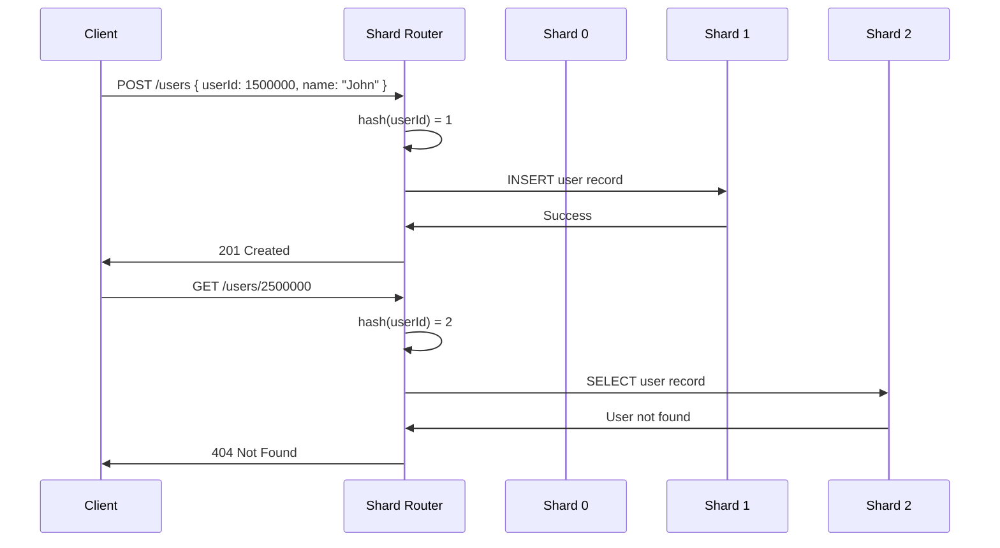

# Database Shard Pattern

## Overview

Database sharding is a horizontal partitioning strategy that splits a large database into smaller, more manageable pieces called shards. Each shard contains a subset of the total data, typically organized by a sharding key such as user ID, geographic region, or time period. This pattern enables horizontal scaling of database capacity beyond the limits of a single database instance.

The fundamental challenge that sharding addresses is the performance degradation that occurs when a database grows too large. As tables exceed millions or billions of rows, query performance degrades, indexes become too large to fit in memory, and write throughput becomes constrained. Sharding solves these problems by distributing data across multiple database instances, each handling a fraction of the total load.

In microservices architectures, sharding becomes particularly relevant when individual services need to handle massive data volumes. A service that manages user data for an application with hundreds of millions of users cannot realistically store all that data in a single database. Sharding allows such services to scale horizontally by adding more database nodes, each serving a portion of the data.

The sharding key selection is critical to the success of this pattern. A well-chosen sharding key ensures even data distribution across shards, minimizes cross-shard queries, and aligns with the most common access patterns. Poor sharding key selection can lead to hot spots (where one shard receives disproportionate traffic), skewed data distribution, and performance degradation.

Sharding introduces complexity that must be carefully managed. Cross-shard transactions, joins across shards, and data rebalancing when adding or removing shards require sophisticated handling. Many organizations start with a single database and only implement sharding when necessary, using the database-per-service pattern as a foundation.

The relationship between database-per-service and sharding is important to understand. A service may use database-per-service (having its own database separate from other services) but still need to shard its own database because of data volume. These patterns complement each other rather than replace one another.

### Why Sharding Matters

Traditional vertical scaling (adding more CPU, RAM, and storage to a single database server) has hard limits. Even the most powerful database servers have ceilings - you cannot add infinite resources. Sharding provides a path to essentially unlimited horizontal scaling by adding more commodity servers.

Cost efficiency is another factor. Large dedicated database servers are expensive. Sharding allows you to use smaller, commodity database instances that cost far less while providing equivalent or better aggregate performance. Cloud databases particularly benefit from this approach, as you can provision exactly the capacity you need for each shard.

## Flow Diagram

```mermaid
graph TB
    subgraph "Application Layer"
        A[Service Application]
        B[Shard Router]
    end
    
    subgraph "Shard Cluster"
        C[Shard 0<br/>Users 0-999999]
        D[Shard 1<br/>Users 1000000-1999999]
        E[Shard 2<br/>Users 2000000-2999999]
        F[Shard N<br/>Users N*1000000 to (N+1)*1000000-1]
    end
    
    A --> B
    B -->|userId 0-999999| C
    B -->|userId 1000000-1999999| D
    B -->|userId 2000000-2999999| E
    B -->|userId N*1000000+| F
    
    style C fill:#f9f,color:#000
    style D fill:#f9f,color:#000
    style E fill:#f9f,color:#000
    style F fill:#f9f,color:#000
```

This diagram shows how incoming requests are routed to the appropriate shard based on the sharding key. The shard router acts as a middleware that determines which database instance should handle each request.



This sequence diagram shows how read and write operations are routed to specific shards based on the sharding key hash.

## Standard Example

### Shard Router Implementation

```javascript
// lib/shard-router.js

class ShardRouter {
    constructor(shardConfigs) {
        this.shards = shardConfigs;
        this.numShards = shardConfigs.length;
    }

    getShardForKey(key) {
        const hash = this.hashKey(key);
        const shardIndex = hash % this.numShards;
        return this.shards[shardIndex];
    }

    hashKey(key) {
        let hash = 0;
        const keyStr = String(key);
        for (let i = 0; i < keyStr.length; i++) {
            const char = keyStr.charCodeAt(i);
            hash = ((hash << 5) - hash) + char;
            hash = hash & hash;
        }
        return Math.abs(hash);
    }

    getAllShards() {
        return this.shards;
    }
}

class ShardedUserService {
    constructor(router) {
        this.router = router;
    }

    async createUser(userData) {
        const shard = this.router.getShardForKey(userData.userId);
        const db = await this.getDatabaseConnection(shard);
        
        const result = await db.query(
            `INSERT INTO users (user_id, email, name, created_at)
             VALUES ($1, $2, $3, NOW())
             RETURNING *`,
            [userData.userId, userData.email, userData.name]
        );
        
        return {
            data: result.rows[0],
            shard: shard.name
        };
    }

    async getUserById(userId) {
        const shard = this.router.getShardForKey(userId);
        const db = await this.getDatabaseConnection(shard);
        
        const result = await db.query(
            `SELECT * FROM users WHERE user_id = $1`,
            [userId]
        );
        
        return result.rows[0] || null;
    }

    async getUserByEmail(email) {
        // Email-based lookup requires scanning all shards
        // This is an expensive operation in sharded systems
        const results = [];
        
        for (const shard of this.router.getAllShards()) {
            const db = await this.getDatabaseConnection(shard);
            const result = await db.query(
                `SELECT * FROM users WHERE email = $1`,
                [email]
            );
            
            if (result.rows.length > 0) {
                results.push(...result.rows);
            }
        }
        
        return results[0] || null;
    }

    async getUsersByRegion(region) {
        // For range-based queries, we might need to query multiple shards
        const regionToShards = this.getShardsForRegion(region);
        const results = [];
        
        for (const shard of regionToShards) {
            const db = await this.getDatabaseConnection(shard);
            const result = await db.query(
                `SELECT * FROM users WHERE region = $1`,
                [region]
            );
            results.push(...result.rows);
        }
        
        return results;
    }

    getShardsForRegion(region) {
        // Some sharding strategies allow targeting specific shards for certain queries
        // This assumes a geographic sharding strategy
        const regionMap = {
            'NA': ['shard-0', 'shard-1'],
            'EU': ['shard-2', 'shard-3'],
            'APAC': ['shard-4', 'shard-5']
        };
        
        const shardNames = regionMap[region] || this.router.getAllShards().map(s => s.name);
        return this.router.getAllShards().filter(s => shardNames.includes(s.name));
    }

    async getDatabaseConnection(shardConfig) {
        // In production, this would use a connection pool
        // For now, return a mock or create actual connections
        return {
            query: async (sql, params) => {
                console.log(`[${shardConfig.name}] Executing: ${sql}`);
                return { rows: [] };
            }
        };
    }
}

module.exports = { ShardRouter, ShardedUserService };
```

### Shard Configuration and Initialization

```javascript
// config/shards.js

const shardConfigs = [
    {
        name: 'shard-0',
        host: '10.0.0.10',
        port: 5432,
        database: 'users_shard_0',
        user: 'postgres',
        password: process.env.DB_PASSWORD
    },
    {
        name: 'shard-1',
        host: '10.0.0.11',
        port: 5432,
        database: 'users_shard_1',
        user: 'postgres',
        password: process.env.DB_PASSWORD
    },
    {
        name: 'shard-2',
        host: '10.0.0.12',
        port: 5432,
        database: 'users_shard_2',
        user: 'postgres',
        password: process.env.DB_PASSWORD
    },
    {
        name: 'shard-3',
        host: '10.0.0.13',
        port: 5432,
        database: 'users_shard_3',
        user: 'postgres',
        password: process.env.DB_PASSWORD
    }
];

// Initialize all shard databases with the same schema
async function initializeShards() {
    const { Client } = require('pg');
    
    for (const config of shardConfigs) {
        const client = new Client({
            host: config.host,
            port: config.port,
            database: 'postgres',
            user: config.user,
            password: config.password
        });
        
        try {
            await client.connect();
            
            // Create database if not exists
            await client.query(
                `SELECT pg_terminate_backend(pg_stat_activity.pid)
                 FROM pg_stat_activity
                 WHERE pg_stat_activity.datname = '${config.database}'
                 AND pid <> pg_backend_pid()`
            );
            
            await client.query(
                `DROP DATABASE IF EXISTS ${config.database}`
            );
            await client.query(
                `CREATE DATABASE ${config.database}`
            );
            
            // Connect to new database and create tables
            await client.end();
            
            const dbClient = new Client({
                host: config.host,
                port: config.port,
                database: config.database,
                user: config.user,
                password: config.password
            });
            
            await dbClient.connect();
            
            // User table schema
            await dbClient.query(`
                CREATE TABLE IF NOT EXISTS users (
                    id SERIAL PRIMARY KEY,
                    user_id VARCHAR(50) UNIQUE NOT NULL,
                    email VARCHAR(255) UNIQUE NOT NULL,
                    name VARCHAR(255) NOT NULL,
                    region VARCHAR(50),
                    created_at TIMESTAMP DEFAULT NOW(),
                    updated_at TIMESTAMP DEFAULT NOW()
                );
                
                CREATE INDEX idx_users_user_id ON users(user_id);
                CREATE INDEX idx_users_email ON users(email);
                CREATE INDEX idx_users_region ON users(region);
            `);
            
            console.log(`Initialized ${config.name}`);
            await dbClient.end();
        } catch (error) {
            console.error(`Error initializing ${config.name}:`, error.message);
        }
    }
}

module.exports = { shardConfigs, initializeShards };
```

### Application Service Using Sharding

```javascript
// user-service/index.js

const express = require('express');
const { Pool } = require('pg');
const { ShardRouter, ShardedUserService } = require('../lib/shard-router');
const { shardConfigs, initializeShards } = require('../config/shards');

const app = express();
app.use(express.json());

// Initialize router and service
const router = new ShardRouter(shardConfigs);
const userService = new ShardedUserService(router);

// Create user endpoint
app.post('/api/users', async (req, res) => {
    try {
        const { userId, email, name, region } = req.body;
        
        if (!userId || !email || !name) {
            return res.status(400).json({ 
                error: 'Missing required fields: userId, email, name' 
            });
        }
        
        const result = await userService.createUser({ 
            userId, 
            email, 
            name,
            region 
        });
        
        res.status(201).json({
            message: 'User created successfully',
            data: result.data,
            shard: result.shard
        });
    } catch (error) {
        console.error('Error creating user:', error);
        res.status(500).json({ error: 'Failed to create user' });
    }
});

// Get user by ID
app.get('/api/users/:userId', async (req, res) => {
    try {
        const { userId } = req.params;
        const user = await userService.getUserById(userId);
        
        if (!user) {
            return res.status(404).json({ error: 'User not found' });
        }
        
        const shard = router.getShardForKey(userId);
        res.json({ user, shard: shard.name });
    } catch (error) {
        console.error('Error fetching user:', error);
        res.status(500).json({ error: 'Failed to fetch user' });
    }
});

// Get user by email (scans all shards - expensive!)
app.get('/api/users/email/:email', async (req, res) => {
    try {
        const { email } = req.params;
        const startTime = Date.now();
        
        const user = await userService.getUserByEmail(email);
        
        console.log(`Email lookup took ${Date.now() - startTime}ms`);
        
        if (!user) {
            return res.status(404).json({ error: 'User not found' });
        }
        
        res.json({ user });
    } catch (error) {
        console.error('Error fetching user by email:', error);
        res.status(500).json({ error: 'Failed to fetch user' });
    }
});

// Get users by region (targets specific shards)
app.get('/api/users/region/:region', async (req, res) => {
    try {
        const { region } = req.params;
        const users = await userService.getUsersByRegion(region);
        res.json({ users, count: users.length });
    } catch (error) {
        console.error('Error fetching users by region:', error);
        res.status(500).json({ error: 'Failed to fetch users' });
    }
});

// Health check with shard status
app.get('/health', async (req, res) => {
    const shardStatus = [];
    
    for (const config of shardConfigs) {
        try {
            const pool = new Pool({
                host: config.host,
                port: config.port,
                database: config.database,
                user: config.user,
                password: config.password,
                connectionTimeoutMillis: 2000
            });
            
            const result = await pool.query('SELECT COUNT(*) FROM users');
            await pool.end();
            
            shardStatus.push({
                name: config.name,
                status: 'healthy',
                userCount: parseInt(result.rows[0].count)
            });
        } catch (error) {
            shardStatus.push({
                name: config.name,
                status: 'unhealthy',
                error: error.message
            });
        }
    }
    
    res.json({
        status: 'ok',
        shards: shardStatus
    });
});

const PORT = process.env.PORT || 3000;
app.listen(PORT, async () => {
    console.log(`User service running on port ${PORT}`);
});

module.exports = app;
```

### Consistent Hashing Implementation

```javascript
// lib/consistent-hash.js

const crypto = require('crypto');

class ConsistentHashRing {
    constructor(replicas = 150) {
        this.ring = new Map();
        this.sortedKeys = [];
        this.replicas = replicas;
    }

    addNode(node) {
        for (let i = 0; i < this.replicas; i++) {
            const key = this.hash(`${node.name}:${i}`);
            this.ring.set(key, node);
        }
        this.sortedKeys = Array.from(this.ring.keys()).sort((a, b) => a - b);
    }

    removeNode(node) {
        for (let i = 0; i < this.replicas; i++) {
            const key = this.hash(`${node.name}:${i}`);
            this.ring.delete(key);
        }
        this.sortedKeys = Array.from(this.ring.keys()).sort((a, b) => a - b);
    }

    getNode(key) {
        if (this.ring.size === 0) {
            return null;
        }

        const hash = this.hash(key);
        const pos = this.binarySearch(hash);
        
        // If hash is greater than the last key, wrap around to first
        if (pos >= this.sortedKeys.length) {
            return this.ring.get(this.sortedKeys[0]);
        }
        
        return this.ring.get(this.sortedKeys[pos]);
    }

    hash(key) {
        const hash = crypto.createHash('md5').update(key).digest('hex');
        return parseInt(hash.substring(0, 8), 16);
    }

    binarySearch(hash) {
        let low = 0;
        let high = this.sortedKeys.length;
        
        while (low < high) {
            const mid = Math.floor((low + high) / 2);
            if (this.sortedKeys[mid] < hash) {
                low = mid + 1;
            } else {
                high = mid;
            }
        }
        
        return low;
    }

    // Get multiple nodes for data replication
    getNodes(key, count) {
        if (this.ring.size === 0) return [];
        
        const nodes = [];
        const hash = this.hash(key);
        const startPos = this.binarySearch(hash);
        
        for (let i = 0; i < count; i++) {
            const pos = (startPos + i) % this.sortedKeys.length;
            const node = this.ring.get(this.sortedKeys[pos]);
            
            if (node && !nodes.includes(node)) {
                nodes.push(node);
            }
        }
        
        return nodes;
    }
}

// Example: Using consistent hashing for a distributed cache
function createDistributedCache(nodes) {
    const ring = new ConsistentHashRing();
    
    nodes.forEach(node => ring.addNode(node));
    
    return {
        get(key) {
            const node = ring.getNode(key);
            console.log(`Key ${key} maps to ${node.name}`);
            return node;
        },
        
        set(key, value) {
            const node = ring.getNode(key);
            console.log(`Storing key ${key} on ${node.name}`);
            return node;
        },
        
        addNode(node) {
            ring.addNode(node);
        },
        
        removeNode(node) {
            ring.removeNode(node);
        }
    };
}

module.exports = { ConsistentHashRing, createDistributedCache };
```

## Real-World Examples

### Twitter

Twitter handles massive amounts of data daily, with billions of tweets and trillions of timeline computations. They use sharding extensively for their user data and tweet storage. Twitter's sharding strategy is based on user ID, ensuring that all data for a particular user resides on the same shard. This co-location enables efficient retrieval of a user's tweets, followers, and timeline without cross-shard queries.

Twitter's architecture includes a concept called "Early Bird" which is a search cluster using Cassandra for real-time search indexing. The system is sharded by tweet ID, allowing efficient retrieval of tweets for search results. Their timeline service is also sharded, enabling the generation of billions of timelines efficiently.

### Facebook

Facebook stores enormous amounts of user data, photos, and social graph information. Their TAO system (The Anatomy of a System) is a distributed data store that uses sharding to manage the social graph. TAO is organized into multiple tiers of storage, with sharding at the database level to distribute load across thousands of MySQL instances.

Facebook's messages system uses sharding by user ID to distribute message data across their infrastructure. This approach ensures that conversations between two users are stored on the same shard, enabling efficient retrieval and storage of messages. Their photo storage system also uses sharding based on user ID and photo ID to distribute the billions of photos across their storage infrastructure.

### Instagram

Instagram stores billions of photos and interactions using sharded MySQL databases. Their sharding strategy is based on user ID, with each user's data stored on a specific shard. The system can efficiently retrieve a user's photos, comments, and likes because all this data co-locates on the same shard.

When Instagram needs to look up a photo by tag or location, they use secondary indexes that span multiple shards. These indexes are maintained asynchronously and provide efficient access patterns for non-key-based queries. This hybrid approach allows them to optimize for the common access pattern (user-centric) while still supporting other query patterns.

### Elasticsearch

Elasticsearch is a distributed search engine that inherently uses sharding. Documents are distributed across shards, and each shard can be replicated for high availability. Users can specify the number of primary shards and replica shards when creating an index. Elasticsearch handles the distribution of documents across shards automatically based on a hash of the document ID.

Elasticsearch's sharding is transparent to the user - queries are automatically routed to the appropriate shards, and results are aggregated. This makes it an excellent example of how sharding can be implemented transparently, allowing developers to focus on building applications rather than managing shard distribution.

## Best Practices

### 1. Choose Your Sharding Key Carefully

The sharding key is the most important decision in implementing database sharding. A good sharding key evenly distributes data across shards, ensures related data is co-located on the same shard, and aligns with the most frequent query patterns. Common choices include user ID, customer ID, geographic region, or time-based ranges.

Avoid keys with low cardinality (few unique values) as they lead to unbalanced distributions. For example, sharding by country would create very uneven distributions since most users might be in a few countries. Test your key choice with realistic data volumes before committing to a sharding strategy.

Consider compound keys when single keys don't provide good distribution. For example, combining user ID with order ID might provide better distribution for an e-commerce application than using either key alone.

### 2. Design for Cross-Shard Operations

Design your data model to minimize cross-shard operations. If most queries require joining data across shards, your sharding strategy needs adjustment. Accept that some operations will be more expensive - queries spanning multiple shards will take longer and require more resources.

Implement pagination carefully when data spans multiple shards. You cannot simply use LIMIT and OFFSET because results might be on different shards. Consider implementing cursor-based pagination or maintaining secondary indexes.

For operations that must touch multiple shards, implement them asynchronously or in batches. Don't block user requests waiting for results from all shards. Instead, return partial results or implement a background job pattern.

### 3. Handle Shard Rebalancing

Plan for adding and removing shards as your data grows. Consistent hashing makes this easier by minimizing data movement when adding or removing nodes. However, some data movement is inevitable.

Implement a background rebalancing process that moves data gradually without impacting performance. Many production systems use a "dual-write" approach during rebalancing, writing to both old and new locations, then switching over gradually.

Test your rebalancing process in a staging environment. Understand how long it takes and what impact it has on performance. Document the exact steps needed to add or remove shards.

### 4. Implement Proper Monitoring

Monitor each shard individually. Track query latency, connection pool usage, storage utilization, and replication lag per shard. Identify hot spots early - one shard receiving significantly more traffic than others indicates a problem with your sharding key.

Set up alerts for shard-specific issues. If one shard is down, the impact might be limited to a portion of your users, but it's still critical to know about it quickly. Implement health checks that verify each shard is accessible and responsive.

Create dashboards that show the distribution of data and load across shards. Visualizing this information helps you understand if your sharding strategy is working as intended and where you might need to make adjustments.

### 5. Keep Backups and Recovery Plans

Each shard should have independent backup and recovery procedures. Test restoring individual shards to ensure your backups work correctly. Understand the implications of losing a single shard - which users are affected and what data is lost.

Implement point-in-time recovery capabilities for each shard. This allows you to recover from data corruption or accidental deletions without losing all your data. Document the recovery time objectives for each shard.

Consider geographic distribution of shards. If all shards are in one data center, a regional outage affects your entire application. Distribute shards across availability zones or regions for better resilience.

### 6. Use Connection Pooling Wisely

Each shard requires its own connection pool. If you have 10 shards, you need 10 separate pools. This multiplies your connection requirements - make sure your database server can handle the total number of connections across all shards.

Implement smart routing that reuses connections when possible. Opening a new database connection is expensive. Maintain long-lived connections and use connection poolers like PgBouncer or ProxySQL.

Monitor connection usage per shard. A hot spot might manifest as a particular shard running out of connections while others are underutilized. This indicates you need to adjust your sharding strategy or add more capacity to that shard.

### 7. Plan for Schema Changes

Schema changes across sharded databases require coordination. Adding a column to a table means updating every shard. Plan these changes carefully and implement them during low-traffic periods.

Use online schema migration tools when available. Tools like gh-ost or pt-online-schema-change for MySQL allow schema changes without locking tables. Understand how these tools work with sharded databases.

Test schema changes on a single shard first. Verify the change works correctly and doesn't cause issues before rolling out to all shards. Maintain rollback procedures in case something goes wrong.

### 8. Document Your Sharding Strategy

Maintain comprehensive documentation of your sharding implementation. Include the sharding key, how data is distributed, what queries work well and which are expensive, and procedures for adding or removing shards.

Create runbooks for common operational tasks. How do you add a new shard? How do you handle a shard that's running out of space? What do you do when a shard is down? Document the answers to these questions.

Make sure your entire team understands the sharding strategy. New team members should be able to understand how data flows through your system and why certain design decisions were made.