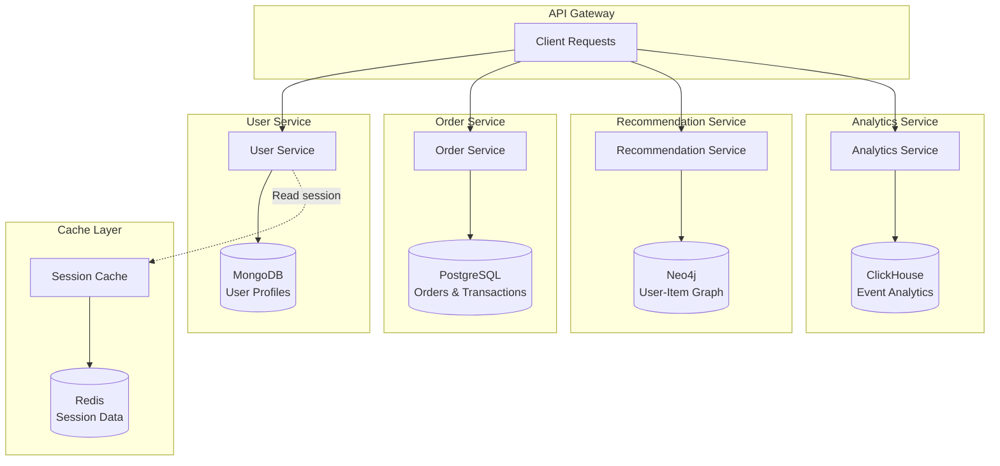
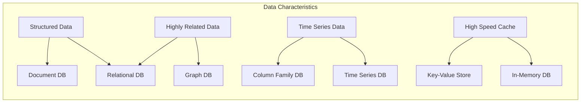

# Polyglot Persistence

## Overview

Polyglot persistence is the practice of using different database technologies to handle different data storage needs within an application. The term "polyglot" refers to using multiple programming languages, and in the context of databases, it means using multiple database systems optimized for different types of data and access patterns.

In microservices architectures, polyglot persistence becomes a natural extension of the database-per-service pattern. Each service can choose the database technology that best fits its specific requirements without being constrained by what works for other services. This flexibility allows teams to optimize for performance, scalability, and development velocity.

The traditional approach of using a single database technology for all data needs often leads to compromises. Relational databases excel at structured data and complex queries but may not be ideal for semi-structured data or high-velocity writes. Document databases provide schema flexibility but may lack transaction support. Graph databases excel at relationship traversal but are overkill for simple data.

Polyglot persistence acknowledges that different data types have different characteristics and access patterns. User profile information might be stored in a document database for flexibility. The social graph between users is ideal for a graph database. Time-series data from sensor readings benefits from a time-series database. Caching frequently accessed data works best with an in-memory database like Redis.

This approach does introduce complexity that must be managed. Each database technology has its own operational requirements, backup procedures, and scaling characteristics. Teams need expertise in multiple technologies. Data that spans multiple databases requires careful synchronization. Despite these challenges, the benefits often outweigh the costs for complex applications.

### Evolution of Persistence Technologies

The rise of polyglot persistence was driven by several factors. The explosion of unstructured and semi-structured data from web and mobile applications made relational databases insufficient for many use cases. The need for massive scale led to distributed databases designed for specific workloads. The open-source movement produced excellent specialized databases that could be used freely.

Cloud computing made it easier to provision and manage different database technologies. Rather than maintaining a single database technology, teams can now deploy purpose-built databases for each service. This shift has been accelerated by containerization and Kubernetes, which make it straightforward to run different database types alongside application services.

The NoSQL movement was a major catalyst for polyglot persistence. NoSQL databases emerged to address specific limitations of relational databases: the need for horizontal scaling, schema flexibility, and handling of massive data volumes. While NoSQL databases solved some problems, they introduced others, leading to the realization that different databases are better suited for different tasks.

## Flow Diagram



This diagram illustrates how different services use different database technologies based on their specific needs. Each service owns its data and chooses the database that best fits its access patterns.



This diagram shows how different data characteristics suggest different database technologies.

## Standard Example

### Service-Specific Database Selection

```javascript
// user-service/index.js - Uses MongoDB for flexible user profiles
const express = require('express');
const mongoose = require('mongoose');

const app = express();
app.use(express.json());

// Connect to MongoDB
mongoose.connect(process.env.MONGODB_URI || 'mongodb://localhost:27017/users')
    .then(() => console.log('Connected to MongoDB'))
    .catch(err => console.error('MongoDB connection error:', err));

// User Schema - flexible for varying profile attributes
const userSchema = new mongoose.Schema({
    userId: { type: String, required: true, unique: true },
    email: { type: String, required: true, unique: true },
    basicInfo: {
        firstName: String,
        lastName: String,
        dateOfBirth: Date,
        avatar: String
    },
    // Flexible attributes that vary per user type
    attributes: {
        type: Map,
        of: mongoose.Schema.Types.Mixed
    },
    preferences: {
        notifications: { type: Boolean, default: true },
        language: { type: String, default: 'en' },
        theme: { type: String, default: 'light' }
    },
    createdAt: { type: Date, default: Date.now },
    updatedAt: { type: Date, default: Date.now }
});

userSchema.index({ email: 1 });
userSchema.index({ 'basicInfo.firstName': 1, 'basicInfo.lastName': 1 });

const User = mongoose.model('User', userSchema);

// Create user with flexible attributes
app.post('/api/users', async (req, res) => {
    try {
        const { userId, email, firstName, lastName, attributes } = req.body;
        
        const user = new User({
            userId,
            email,
            basicInfo: { firstName, lastName },
            attributes: attributes || {}
        });
        
        await user.save();
        
        res.status(201).json({
            id: user._id,
            userId: user.userId,
            email: user.email
        });
    } catch (error) {
        if (error.code === 11000) {
            return res.status(409).json({ error: 'User already exists' });
        }
        console.error('Error creating user:', error);
        res.status(500).json({ error: 'Failed to create user' });
    }
});

// Get user with dynamic attributes
app.get('/api/users/:userId', async (req, res) => {
    try {
        const user = await User.findOne({ userId: req.params.userId });
        
        if (!user) {
            return res.status(404).json({ error: 'User not found' });
        }
        
        res.json(user);
    } catch (error) {
        console.error('Error fetching user:', error);
        res.status(500).json({ error: 'Failed to fetch user' });
    }
});

// Update user with dynamic attributes
app.patch('/api/users/:userId', async (req, res) => {
    try {
        const updates = req.body;
        
        // Handle nested updates
        if (updates.basicInfo) {
            updates['basicInfo'] = { ...updates.basicInfo };
        }
        if (updates.preferences) {
            updates['preferences'] = { ...updates.preferences };
        }
        
        updates.updatedAt = new Date();
        
        const user = await User.findOneAndUpdate(
            { userId: req.params.userId },
            { $set: updates },
            { new: true }
        );
        
        if (!user) {
            return res.status(404).json({ error: 'User not found' });
        }
        
        res.json(user);
    } catch (error) {
        console.error('Error updating user:', error);
        res.status(500).json({ error: 'Failed to update user' });
    }
});

const PORT = process.env.PORT || 3001;
app.listen(PORT, () => console.log(`User service on port ${PORT}`));

module.exports = app;
```

```javascript
// order-service/index.js - Uses PostgreSQL for transactional integrity
const express = require('express');
const { Pool } = require('pg');

const app = express();
app.use(express.json());

const pool = new Pool({
    connectionString: process.env.DATABASE_URL || 'postgresql://localhost:5432/orders'
});

// Initialize schema
async function initSchema() {
    await pool.query(`
        CREATE TABLE IF NOT EXISTS orders (
            id SERIAL PRIMARY KEY,
            order_id VARCHAR(50) UNIQUE NOT NULL,
            customer_id VARCHAR(50) NOT NULL,
            total_amount DECIMAL(10, 2) NOT NULL,
            status VARCHAR(20) NOT NULL DEFAULT 'PENDING',
            shipping_address JSONB NOT NULL,
            payment_info JSONB,
            created_at TIMESTAMP DEFAULT NOW(),
            updated_at TIMESTAMP DEFAULT NOW()
        );
        
        CREATE TABLE IF NOT EXISTS order_items (
            id SERIAL PRIMARY KEY,
            order_id VARCHAR(50) REFERENCES orders(order_id),
            product_id VARCHAR(50) NOT NULL,
            product_name VARCHAR(255) NOT NULL,
            quantity INTEGER NOT NULL,
            unit_price DECIMAL(10, 2) NOT NULL,
            subtotal DECIMAL(10, 2) NOT NULL
        );
        
        CREATE INDEX idx_orders_customer ON orders(customer_id);
        CREATE INDEX idx_orders_status ON orders(status);
        CREATE INDEX idx_order_items_order ON order_items(order_id);
    `);
    console.log('Order schema initialized');
}

// Create order with transaction support
app.post('/api/orders', async (req, res) => {
    const client = await pool.connect();
    
    try {
        await client.query('BEGIN');
        
        const { orderId, customerId, items, shippingAddress, paymentInfo } = req.body;
        
        const totalAmount = items.reduce((sum, item) => 
            sum + (item.quantity * item.unitPrice), 0
        );
        
        const orderResult = await client.query(
            `INSERT INTO orders (order_id, customer_id, total_amount, status, shipping_address, payment_info)
             VALUES ($1, $2, $3, $4, $5, $6)
             RETURNING *`,
            [orderId, customerId, totalAmount, 'PENDING', 
             JSON.stringify(shippingAddress), JSON.stringify(paymentInfo)]
        );
        
        for (const item of items) {
            await client.query(
                `INSERT INTO order_items (order_id, product_id, product_name, quantity, unit_price, subtotal)
                 VALUES ($1, $2, $3, $4, $5, $6)`,
                [orderId, item.productId, item.productName, item.quantity, 
                 item.unitPrice, item.quantity * item.unitPrice]
            );
        }
        
        await client.query('COMMIT');
        
        res.status(201).json({
            orderId: orderResult.rows[0].order_id,
            status: orderResult.rows[0].status,
            totalAmount: orderResult.rows[0].total_amount
        });
    } catch (error) {
        await client.query('ROLLBACK');
        console.error('Error creating order:', error);
        res.status(500).json({ error: 'Failed to create order' });
    } finally {
        client.release();
    }
});

// Get order with items
app.get('/api/orders/:orderId', async (req, res) => {
    try {
        const orderResult = await pool.query(
            'SELECT * FROM orders WHERE order_id = $1',
            [req.params.orderId]
        );
        
        if (orderResult.rows.length === 0) {
            return res.status(404).json({ error: 'Order not found' });
        }
        
        const itemsResult = await pool.query(
            'SELECT * FROM order_items WHERE order_id = $1',
            [req.params.orderId]
        );
        
        res.json({
            ...orderResult.rows[0],
            items: itemsResult.rows
        });
    } catch (error) {
        console.error('Error fetching order:', error);
        res.status(500).json({ error: 'Failed to fetch order' });
    }
});

const PORT = process.env.PORT || 3002;
app.listen(PORT, async () => {
    await initSchema();
    console.log(`Order service on port ${PORT}`);
});

module.exports = app;
```

```javascript
// recommendation-service/index.js - Uses Neo4j for graph relationships
const express = require('express');
const neo4j = require('neo4j-driver');

const app = express();
app.use(express.json());

const driver = neo4j.driver(
    process.env.NEO4J_URI || 'bolt://localhost:7687',
    neo4j.auth.basic(process.env.NEO4J_USER || 'neo4j', 
                     process.env.NEO4J_PASSWORD || 'password')
);

// User-Product interaction schema
// Nodes: User, Product, Category
// Relationships: VIEWED, PURCHASED, RATED, SIMILAR_TO, BELONGS_TO

async function initializeGraphSchema(session) {
    await session.run(`
        CREATE CONSTRAINT IF NOT EXISTS FOR (u:User) REQUIRE u.userId IS UNIQUE
    `);
    await session.run(`
        CREATE CONSTRAINT IF NOT EXISTS FOR (p:Product) REQUIRE p.productId IS UNIQUE
    `);
    console.log('Graph schema initialized');
}

// Record user product interaction
app.post('/api/recommendations/interaction', async (req, res) => {
    const session = driver.session();
    
    try {
        const { userId, productId, interactionType, rating, metadata } = req.body;
        
        const result = await session.run(
            `MERGE (u:User {userId: $userId})
             MERGE (p:Product {productId: $productId})
             MERGE (u)-[r:${interactionType}]->(p)
             SET r.timestamp = timestamp(),
                 r.count = coalesce(r.count, 0) + 1
             ` + (rating ? ', r.rating = $rating' : '') + `
             RETURN u.userId, p.productId, type(r) as interaction`,
            { userId, productId, interactionType, rating }
        );
        
        res.json({
            success: true,
            userId,
            productId,
            interactionType
        });
    } catch (error) {
        console.error('Error recording interaction:', error);
        res.status(500).json({ error: 'Failed to record interaction' });
    } finally {
        await session.close();
    }
});

// Get personalized recommendations
app.get('/api/recommendations/user/:userId', async (req, res) => {
    const session = driver.session();
    
    try {
        const { userId } = req.params;
        const limit = parseInt(req.query.limit) || 10;
        
        // Find products viewed/purchased by similar users
        const result = await session.run(
            `MATCH (u:User {userId: $userId})-[:PURCHASED]->(p:Product)<-[:PURCHASED]-(similar:User)
             MATCH (similar)-[:VIEWED]->(rec:Product)
             WHERE NOT (u)-[:VIEWED|PURCHASED]->(rec)
             WITH rec, count(similar) as similarityScore
             ORDER BY similarityScore DESC
             LIMIT $limit
             RETURN rec.productId as productId, rec.name as name, similarityScore`,
            { userId, limit }
        );
        
        const recommendations = result.records.map(record => ({
            productId: record.get('productId'),
            name: record.get('name'),
            score: record.get('similarityScore').toNumber()
        }));
        
        res.json({ recommendations });
    } catch (error) {
        console.error('Error getting recommendations:', error);
        res.status(500).json({ error: 'Failed to get recommendations' });
    } finally {
        await session.close();
    }
});

// Get "customers also bought" recommendations
app.get('/api/recommendations/also-bought/:productId', async (req, res) => {
    const session = driver.session();
    
    try {
        const { productId } = req.params;
        const limit = parseInt(req.query.limit) || 5;
        
        const result = await session.run(
            `MATCH (p1:Product {productId: $productId})<-[:PURCHASED]-(u:User)-[:PURCHASED]->(p2:Product)
             WHERE p1 <> p2
             WITH p2, count(u) as purchaseCount
             ORDER BY purchaseCount DESC
             LIMIT $limit
             RETURN p2.productId as productId, p2.name as name, purchaseCount`,
            { productId, limit }
        );
        
        const recommendations = result.records.map(record => ({
            productId: record.get('productId'),
            name: record.get('name'),
            purchaseCount: record.get('purchaseCount').toNumber()
        }));
        
        res.json({ recommendations });
    } catch (error) {
        console.error('Error getting also-bought:', error);
        res.status(500).json({ error: 'Failed to get recommendations' });
    } finally {
        await session.close();
    }
});

const PORT = process.env.PORT || 3003;
app.listen(PORT, async () => {
    const session = driver.session();
    await initializeGraphSchema(session);
    await session.close();
    console.log(`Recommendation service on port ${PORT}`);
});

module.exports = app;
```

```javascript
// analytics-service/index.js - Uses ClickHouse for time-series analytics
const express = require('express');
const { ClickHouse } = require('@clickhouse/client');

const app = express();
app.use(express.json());

const clickhouse = new ClickHouse({
    url: process.env.CLICKHOUSE_URL || 'http://localhost:8123',
    database: process.env.CLICKHOUSE_DB || 'analytics'
});

// Initialize analytics tables
async function initAnalytics() {
    await clickhouse.exec(`
        CREATE TABLE IF NOT EXISTS user_events (
            event_time DateTime DEFAULT now(),
            event_type String,
            user_id String,
            session_id String,
            product_id String,
            properties JSON,
            version String DEFAULT '1.0'
        ) ENGINE = MergeTree()
        ORDER BY (event_type, user_id, event_time)
    `);
    
    await clickhouse.exec(`
        CREATE TABLE IF NOT EXISTS product_views (
            event_time DateTime DEFAULT now(),
            user_id String,
            product_id String,
            referrer String,
            duration_seconds UInt32
        ) ENGINE = MergeTree()
        ORDER BY (product_id, event_time)
    `);
    
    console.log('Analytics tables initialized');
}

// Record event
app.post('/api/analytics/events', async (req, res) => {
    try {
        const { eventType, userId, sessionId, productId, properties } = req.body;
        
        await clickhouse.insert({
            table: 'user_events',
            values: [{
                event_type: eventType,
                user_id: userId,
                session_id: sessionId,
                product_id: productId || '',
                properties: JSON.stringify(properties || {})
            }],
            format: 'JSONEachRow'
        });
        
        res.json({ success: true });
    } catch (error) {
        console.error('Error recording event:', error);
        res.status(500).json({ error: 'Failed to record event' });
    }
});

// Get event counts by type
app.get('/api/analytics/events/count', async (req, res) => {
    try {
        const { startDate, endDate, eventType } = req.query;
        
        let query = `
            SELECT event_type, count() as count
            FROM user_events
            WHERE event_time BETWEEN '${startDate}' AND '${endDate}'
        `;
        
        if (eventType) {
            query += ` AND event_type = '${eventType}'`;
        }
        
        query += ' GROUP BY event_type ORDER BY count DESC';
        
        const result = await clickhouse.query(query);
        const rows = await result.json();
        
        res.json({ events: rows });
    } catch (error) {
        console.error('Error getting event counts:', error);
        res.status(500).json({ error: 'Failed to get event counts' });
    }
});

// Get popular products
app.get('/api/analytics/popular-products', async (req, res) => {
    try {
        const { startDate, endDate, limit } = req.query;
        
        const result = await clickhouse.query(`
            SELECT product_id, count() as view_count
            FROM product_views
            WHERE event_time BETWEEN '${startDate}' AND '${endDate}'
            GROUP BY product_id
            ORDER BY view_count DESC
            LIMIT ${limit || 20}
        `);
        
        const rows = await result.json();
        
        res.json({ products: rows });
    } catch (error) {
        console.error('Error getting popular products:', error);
        res.status(500).json({ error: 'Failed to get popular products' });
    }
});

const PORT = process.env.PORT || 3004;
app.listen(PORT, async () => {
    await initAnalytics();
    console.log(`Analytics service on port ${PORT}`);
});

module.exports = app;
```

```javascript
// session-service/index.js - Uses Redis for fast in-memory caching
const express = require('express');
const redis = require('redis');

const app = express();
app.use(express.json());

const redisClient = redis.createClient({
    url: process.env.REDIS_URL || 'redis://localhost:6379'
});

redisClient.on('error', err => console.error('Redis error:', err));

async function connectRedis() {
    await redisClient.connect();
    console.log('Connected to Redis');
}

// Session operations
app.post('/api/sessions', async (req, res) => {
    try {
        const { userId, data, ttl } = req.body;
        
        const sessionId = `session:${require('crypto').randomUUID()}`;
        const sessionData = JSON.stringify({
            userId,
            ...data,
            createdAt: Date.now()
        });
        
        const expirySeconds = ttl || 3600; // Default 1 hour
        
        await redisClient.set(sessionId, sessionData, {
            EX: expirySeconds
        });
        
        res.status(201).json({ sessionId, expiresIn: expirySeconds });
    } catch (error) {
        console.error('Error creating session:', error);
        res.status(500).json({ error: 'Failed to create session' });
    }
});

app.get('/api/sessions/:sessionId', async (req, res) => {
    try {
        const { sessionId } = req.params;
        
        const data = await redisClient.get(sessionId);
        
        if (!data) {
            return res.status(404).json({ error: 'Session not found or expired' });
        }
        
        res.json({ sessionId, data: JSON.parse(data) });
    } catch (error) {
        console.error('Error fetching session:', error);
        res.status(500).json({ error: 'Failed to fetch session' });
    }
});

app.patch('/api/sessions/:sessionId', async (req, res) => {
    try {
        const { sessionId } = req.params;
        const { data, extendTTL } = req.body;
        
        const existing = await redisClient.get(sessionId);
        
        if (!existing) {
            return res.status(404).json({ error: 'Session not found' });
        }
        
        const sessionData = JSON.parse(existing);
        const updatedData = { ...sessionData, ...data, updatedAt: Date.now() };
        
        const ttl = extendTTL ? 3600 : await redisClient.ttl(sessionId);
        
        await redisClient.set(sessionId, JSON.stringify(updatedData), {
            EX: ttl
        });
        
        res.json({ success: true });
    } catch (error) {
        console.error('Error updating session:', error);
        res.status(500).json({ error: 'Failed to update session' });
    }
});

app.delete('/api/sessions/:sessionId', async (req, res) => {
    try {
        const { sessionId } = req.params;
        
        const deleted = await redisClient.del(sessionId);
        
        if (deleted === 0) {
            return res.status(404).json({ error: 'Session not found' });
        }
        
        res.json({ success: true });
    } catch (error) {
        console.error('Error deleting session:', error);
        res.status(500).json({ error: 'Failed to delete session' });
    }
});

const PORT = process.env.PORT || 3005;
app.listen(PORT, async () => {
    await connectRedis();
    console.log(`Session service on port ${PORT}`);
});

module.exports = app;
```

## Real-World Examples

### Amazon

Amazon is a pioneer in polyglot persistence. Their architecture uses dozens of different database technologies for different purposes. DynamoDB handles product catalog and shopping cart data with its high availability and scalability. Amazon Aurora serves financial transactions requiring strong consistency. Redshift powers their data warehouse for analytics. Each team chooses the best database for their specific workload.

Amazon's product recommendation system uses graph databases to model user-product relationships and generate personalized recommendations. Their inventory system uses time-series databases to track stock levels over time. This polyglot approach has enabled Amazon to handle massive scale while maintaining performance for diverse workloads.

### Netflix

Netflix uses multiple databases across their streaming platform. Their metadata service uses Cassandra for handling the massive catalog of movies and TV shows. Their viewer history uses DynamoDB for low-latency writes and reads. Their recommendation engine uses Apache Cassandra and custom stores optimized for machine learning feature retrieval.

Netflix's content delivery system uses different data stores for different purposes. The data that determines which movies are available in which regions might use a relational database for complex queries, while the data tracking which users have watched what content uses a distributed key-value store for speed.

### Uber

Uber's architecture uses polyglot persistence extensively. MySQL serves their core trip and user data with strong transactional guarantees. They use Schemaless (a NoSQL database inspired by Google's Bigtable) for historical trip data. Their pricing system uses different databases optimized for the specific calculations involved.

Uber's geospatial data (matching riders to nearby drivers) uses specialized spatial databases. The system must find drivers within a specific radius of a location very quickly, which requires different data structures than traditional relational databases provide.

### eBay

eBay uses different databases for different parts of their marketplace. They use Oracle for core transaction data requiring ACID compliance. They use Cassandra for high-volume data like messages and notifications. Their search infrastructure uses ElasticSearch for full-text search capabilities.

eBay's imaging platform uses object stores for the billions of product images. Their recommendation engine uses Graph databases to model user-product relationships. This diversity enables eBay to optimize each part of their platform for its specific requirements.

## Best Practices

### 1. Choose Based on Data Characteristics, Not Fancy Technology

Select databases based on the actual characteristics of your data and access patterns. Don't choose a graph database because it's trendy if your data doesn't have complex relationships. Don't choose MongoDB if you need strong transactional guarantees. Match the database to the problem, not the other way around.

Evaluate databases based on concrete requirements: Do you need ACID transactions? What's your data structure? How large is your data? What's your access pattern (point lookups, range queries, full-text search)? What are your latency requirements? The answers to these questions should guide your choices.

Document the rationale for each database choice. This documentation helps future developers understand why certain technologies were chosen and prevents misguided attempts to replace "boring" databases with newer alternatives.

### 2. Standardize Operational Patterns

While you might use different databases, standardize operational practices across them. Use consistent monitoring approaches, backup strategies, and deployment patterns. This standardization reduces cognitive load and prevents operational mistakes.

Implement a service mesh or统一的API gateway layer that handles database connections uniformly. This layer can abstract differences between databases and provide consistent observability. Tools like Prometheus can monitor different databases, and centralized logging can aggregate logs from all database technologies.

Create runbooks for each database type. The steps for handling a Redis outage should be similar to handling a PostgreSQL outage in terms of escalation and initial diagnosis, even if the technical steps differ.

### 3. Plan for Data Migration

Technology choices evolve. You might start with MongoDB but later discover PostgreSQL is better for your use case. Plan for data migration from the beginning. Use data formats that can be exported and imported. Avoid database-specific features that lock you in.

Implement the strangler fig pattern for migrations: write to both databases during the transition, verify consistency, then switch reads to the new database, and finally stop writing to the old database. This pattern works regardless of which databases you're migrating between.

Test your migration procedures before you need them. A migration that's never been tested is likely to fail when you need it most. Document the time required for migrations so you can plan accordingly.

### 4. Manage Complexity with Abstraction

Create abstraction layers that hide database-specific details from your application code. This allows you to change database implementations without affecting business logic. Use repository patterns or data mapper patterns to isolate database access.

Keep your abstraction layers thin - they should handle database-specific quirks but not implement complex business logic. The goal is to be able to swap one database for another without rewriting application code, not to hide all differences between databases.

Test your abstractions. Mock the database layer when testing business logic. This makes tests faster and ensures your code doesn't directly depend on database-specific features.

### 5. Balance Specialization with Team Expertise

Choose databases that your team has expertise in or can realistically learn. A brilliant database choice that's beyond your team's capabilities will fail. Consider the learning curve when making technology decisions.

Don't let polyglot become chaos. Limit the number of different database technologies you use. Each additional technology adds operational complexity and requires specialized knowledge. A good rule is to have a small number of "approved" databases for each category (relational, document, key-value, etc.).

Establish centers of excellence for each database technology. Not everyone needs to be an expert in all databases, but each database should have at least one person who deeply understands its operation and can help others.

### 6. Implement Data Synchronization Patterns

When data needs to exist in multiple databases, implement synchronization carefully. Use events to propagate changes between systems. Handle the eventual consistency that results from asynchronous propagation.

Implement idempotency in synchronization systems. The same event might be processed multiple times due to failures or retries. Your handlers should handle duplicate events gracefully.

Monitor data consistency between databases. Set up alerts for divergence. Implement reconciliation jobs that can fix inconsistencies when they occur. Don't assume your synchronization is working perfectly - verify it.

### 7. Plan for Cost Management

Different databases have different cost structures. Cloud databases might charge based on I/O operations, storage, or throughput. Some databases require more expensive instance types. Factor these costs into your technology decisions.

Right-size your databases. Don't provision production-level resources for development environments. Use auto-scaling where available to match capacity to demand. Consider spot instances for non-critical workloads.

Track costs per database and per service. Understanding where your money goes helps you make better technology decisions and identify optimization opportunities.