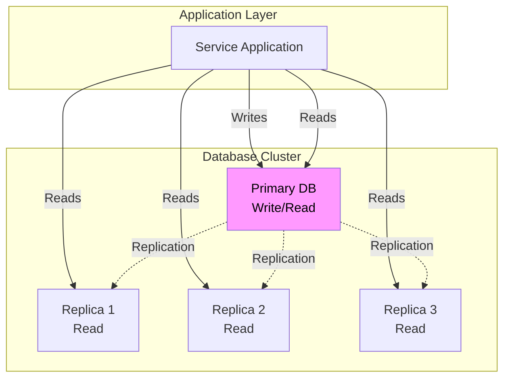
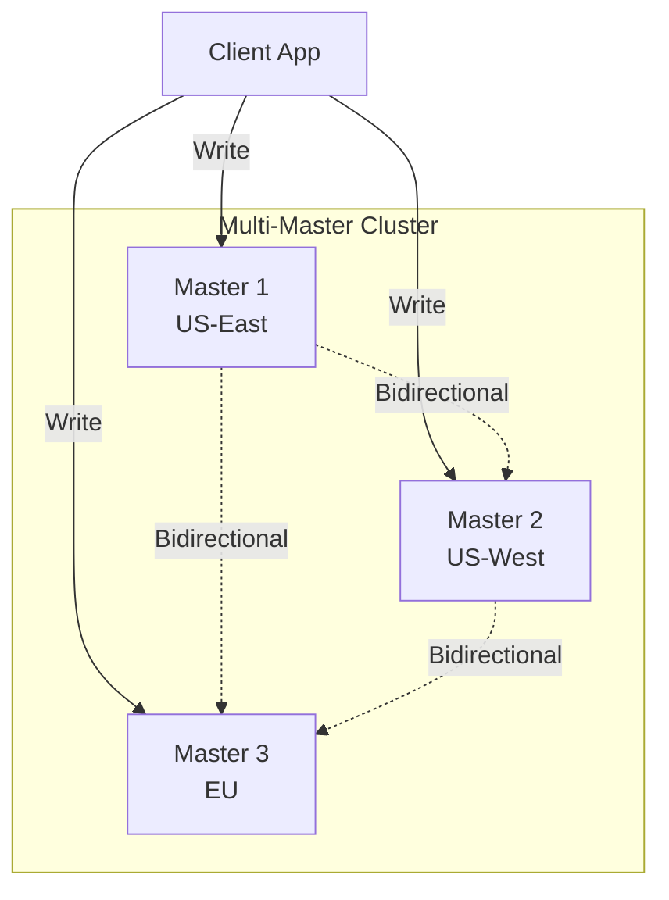

# Data Replication

## Overview

Data replication is the process of copying data from one database to another to ensure high availability, improve performance, and provide disaster recovery capabilities. In microservices architectures, replication becomes essential as services need to handle failures gracefully while maintaining data durability and accessibility.

Replication serves multiple purposes in distributed systems. First, it provides high availability - if one database node fails, replicas can continue serving requests. Second, it improves read performance - read queries can be distributed across replicas, reducing load on the primary. Third, it enables geographic distribution - data can be replicated to data centers closer to users, reducing latency.

There are several replication topologies, each with different trade-offs. Master-slave replication has one primary database that accepts writes and one or more read-only replicas. Multi-master replication allows writes to multiple nodes, providing better write availability but requiring conflict resolution. Circular replication passes changes around a ring of databases. Chain replication connects databases in a chain where each receives changes from the previous.

The CAP theorem influences replication strategy decisions. The theorem states that a distributed system can provide only two of three guarantees: consistency, availability, and partition tolerance. In practice, networks partition occasionally, so you must choose between a system that remains available during partitions or one that remains consistent. Most database systems allow you to tune this trade-off based on your requirements.

Replication adds complexity that must be managed carefully. Replicas can fall behind the primary due to network issues or high load, creating replication lag. Conflicts can arise in multi-master setups when the same data is modified on multiple nodes simultaneously. Monitoring replication health and understanding the implications of lag is crucial for maintaining data integrity.

### Replication in Microservices Context

In microservices architectures, each service manages its own data and often implements its own replication strategy. The database-per-service pattern means replication happens at the service level, with each service choosing the replication approach that fits its availability and performance requirements.

Services with strict consistency requirements might use synchronous replication, ensuring writes are confirmed on replicas before returning success to clients. Services that can tolerate eventual consistency might use asynchronous replication, accepting writes on the primary and propagating them in the background. The choice depends on the specific use case.

Replication also enables other patterns like CQRS, where the command side uses strong consistency and the query side uses replicated read models. Understanding replication is fundamental to implementing these advanced patterns effectively.

## Flow Diagram



This diagram shows a master-slave configuration where writes go to the primary and reads are distributed across replicas.



This diagram shows a multi-master configuration where any node can accept writes and changes are propagated bidirectionally.

## Standard Example

### PostgreSQL Master-Slave Replication

```javascript
// Primary database configuration (postgresql.conf)
const primaryConfig = `
# Replication settings on primary
wal_level = replica
max_wal_senders = 10
max_replication_slots = 10
wal_keep_size = 1GB

# Connection settings
listen_addresses = '*'

# Performance tuning for replication
shared_buffers = 4GB
effective_cache_size = 12GB
`;

const replicaConfig = `
# Replica configuration
primary_conninfo = 'host=primary-db port=5432 user=repl password=secret'

# Read-only mode
hot_standby = on

# Replication slot
hot_standby_feedback = on
`;
```

```javascript
// replication-manager.js - Manages PostgreSQL replication
const { Pool } = require('pg');

class ReplicationManager {
    constructor(primaryConfig, replicaConfigs) {
        this.primaryPool = new Pool({
            host: primaryConfig.host,
            port: primaryConfig.port,
            database: primaryConfig.database,
            user: primaryConfig.user,
            password: primaryConfig.password
        });
        
        this.replicaPools = replicaConfigs.map(config => ({
            pool: new Pool({
                host: config.host,
                port: config.port,
                database: config.database,
                user: config.user,
                password: config.password
            }),
            name: config.name,
            lag: 0
        }));
    }

    // Execute write on primary, optionally wait for replicas
    async writeWithReplication(sql, params, minReplicas = 0) {
        const client = await this.primaryPool.connect();
        
        try {
            await client.query('BEGIN');
            
            // Execute write on primary
            const result = await client.query(sql, params);
            
            // Check replication lag
            if (minReplicas > 0) {
                const lagResult = await client.query(`
                    SELECT count(*) as replication_count
                    FROM pg_stat_replication
                    WHERE state = 'streaming' 
                    AND pg_current_wal_lsn() - flush_lsn <= '16MB'::pg_lsn
                `);
                
                const syncedReplicas = parseInt(lagResult.rows[0].replication_count);
                
                if (syncedReplicas < minReplicas) {
                    throw new Error(
                        `Insufficient synchronized replicas: ${syncedReplicas}/${minReplicas}`
                    );
                }
            }
            
            await client.query('COMMIT');
            return result;
        } catch (error) {
            await client.query('ROLLBACK');
            throw error;
        } finally {
            client.release();
        }
    }

    // Read from replica with lag check
    async readFromReplica(sql, params, maxLagMs = 1000) {
        // Find replica with lowest lag
        let bestReplica = null;
        let lowestLag = Infinity;
        
        for (const replica of this.replicaPools) {
            try {
                const client = await replica.pool.connect();
                
                try {
                    const lagResult = await client.query(`
                        SELECT now() - pg_last_xact_replay_timestamp() as lag
                    `);
                    
                    const lagMs = lagResult.rows[0].lag?.ms || 0;
                    
                    if (lagMs < lowestLag) {
                        lowestLag = lagMs;
                        bestReplica = replica;
                    }
                } finally {
                    client.release();
                }
            } catch (error) {
                console.error(`Error checking replica ${replica.name}:`, error.message);
            }
        }
        
        if (maxLagMs > 0 && lowestLag > maxLagMs) {
            console.warn(
                `All replicas lag exceeds threshold (${lowestLag}ms > ${maxLagMs}ms), ` +
                `falling back to primary`
            );
            return this.primaryPool.query(sql, params);
        }
        
        if (bestReplica) {
            return bestReplica.pool.query(sql, params);
        }
        
        // Fallback to primary if no healthy replicas
        console.warn('No healthy replicas available, using primary');
        return this.primaryPool.query(sql, params);
    }

    // Monitor replication health
    async checkReplicationHealth() {
        const health = {
            primary: { healthy: false, connections: 0 },
            replicas: []
        };
        
        try {
            const primaryResult = await this.primaryPool.query(`
                SELECT count(*) as connections 
                FROM pg_stat_activity 
                WHERE datname = current_database()
            `);
            
            health.primary.healthy = true;
            health.primary.connections = parseInt(primaryResult.rows[0].connections);
        } catch (error) {
            health.primary.error = error.message;
        }
        
        for (const replica of this.replicaPools) {
            const replicaHealth = { name: replica.name, healthy: false, lag: null };
            
            try {
                const client = await replica.pool.connect();
                
                try {
                    const lagResult = await client.query(`
                        SELECT 
                            now() - pg_last_xact_replay_timestamp() as lag,
                            pg_is_in_recovery() as is_replica
                    `);
                    
                    replicaHealth.healthy = true;
                    replicaHealth.lag = lagResult.rows[0].lag?.ms || 0;
                    replicaHealth.isReplica = lagResult.rows[0].is_replica;
                } finally {
                    client.release();
                }
            } catch (error) {
                replicaHealth.error = error.message;
            }
            
            health.replicas.push(replicaHealth);
        }
        
        return health;
    }

    // Promote replica to primary
    async promoteReplica(replicaName) {
        const replica = this.replicaPools.find(r => r.name === replicaName);
        
        if (!replica) {
            throw new Error(`Replica ${replicaName} not found`);
        }
        
        const client = await replica.pool.connect();
        
        try {
            // Trigger failover on replica
            await client.query('SELECT pg_promote()');
            
            console.log(`Promoted ${replicaName} to primary`);
            
            // Reconfigure old primary as replica
            // This would involve updating pg_hba.conf and restarting
            // In practice, you'd use a tool like Patroni for this
        } finally {
            client.release();
        }
    }
}

module.exports = { ReplicationManager };
```

### MySQL Multi-Master Replication

```javascript
// mysql-multimaster.js - MySQL multi-master configuration
const mysql = require('mysql2/promise');

class MultiMasterReplication {
    constructor(configs) {
        this.nodes = configs.map(config => ({
            pool: mysql.createPool({
                host: config.host,
                port: config.port,
                user: config.user,
                password: config.password,
                database: config.database,
                connectionLimit: 10
            }),
            name: config.name,
            isPrimary: config.isPrimary || false
        }));
        
        this.currentPrimaryIndex = 0;
    }

    // Find available node for writes
    async getWriteNode() {
        for (let i = 0; i < this.nodes.length; i++) {
            const nodeIndex = (this.currentPrimaryIndex + i) % this.nodes.length;
            const node = this.nodes[nodeIndex];
            
            try {
                const connection = await node.pool.getConnection();
                
                try {
                    await connection.query('SELECT 1');
                    this.currentPrimaryIndex = nodeIndex;
                    return node;
                } finally {
                    connection.release();
                }
            } catch (error) {
                console.error(`Node ${node.name} unavailable:`, error.message);
            }
        }
        
        throw new Error('No available write nodes');
    }

    // Execute write with conflict handling
    async executeWrite(sql, params, options = {}) {
        const node = await this.getWriteNode();
        const connection = await node.pool.getConnection();
        
        try {
            await connection.beginTransaction();
            
            const result = await connection.query(sql, params);
            
            if (options.conflictResolution === 'last-write-wins') {
                // Last write wins - just commit
                await connection.commit();
            } else if (options.conflictResolution === 'abort') {
                // Check for conflicts
                await connection.commit();
            }
            
            return { result, node: node.name };
        } catch (error) {
            await connection.rollback();
            throw error;
        } finally {
            connection.release();
        }
    }

    // Read from any available node
    async executeRead(sql, params) {
        const errors = [];
        
        // Try each node
        for (const node of this.nodes) {
            try {
                const connection = await node.pool.getConnection();
                
                try {
                    const [rows] = await connection.query(sql, params);
                    return { rows, node: node.name };
                } finally {
                    connection.release();
                }
            } catch (error) {
                errors.push({ node: node.name, error: error.message });
            }
        }
        
        throw new Error(`All read nodes failed: ${JSON.stringify(errors)}`);
    }

    // Resolve conflicts using timestamps
    async resolveConflict(table, keyColumn, keyValue, newData) {
        for (const node of this.nodes) {
            const connection = await node.pool.getConnection();
            
            try {
                await connection.beginTransaction();
                
                // Get current value
                const [rows] = await connection.query(
                    `SELECT * FROM ${table} WHERE ${keyColumn} = ?`,
                    [keyValue]
                );
                
                if (rows.length > 0) {
                    const current = rows[0];
                    const currentTs = new Date(current.updated_at).getTime();
                    const newTs = new Date(newData.updated_at).getTime();
                    
                    // Only update if new data is newer
                    if (newTs > currentTs) {
                        await connection.query(
                            `UPDATE ${table} SET ? WHERE ${keyColumn} = ?`,
                            [newData, keyValue]
                        );
                    }
                } else {
                    await connection.query(
                        `INSERT INTO ${table} SET ?`,
                        newData
                    );
                }
                
                await connection.commit();
            } catch (error) {
                await connection.rollback();
                console.error(`Conflict resolution failed on ${node.name}:`, error.message);
            } finally {
                connection.release();
            }
        }
    }

    // Health check all nodes
    async healthCheck() {
        const results = [];
        
        for (const node of this.nodes) {
            try {
                const connection = await node.pool.getConnection();
                
                try {
                    const [rows] = await connection.query('SHOW MASTER STATUS');
                    const [replStatus] = await connection.query('SHOW SLAVE STATUS');
                    
                    results.push({
                        name: node.name,
                        healthy: true,
                        binlogFile: rows[0]?.File,
                        binlogPosition: rows[0]?.Position,
                        secondsBehindMaster: replStatus[0]?.Seconds_Behind_Master
                    });
                } finally {
                    connection.release();
                }
            } catch (error) {
                results.push({
                    name: node.name,
                    healthy: false,
                    error: error.message
                });
            }
        }
        
        return results;
    }
}

module.exports = { MultiMasterReplication };
```

### Redis Replication

```javascript
// redis-replication.js - Redis replication for caching
const redis = require('redis');

class RedisReplicationManager {
    constructor(options) {
        this.primaryUrl = options.primaryUrl;
        this.replicaUrls = options.replicaUrls || [];
        this.sentinelUrls = options.sentinelUrls;
        
        this.primaryClient = null;
        this.replicaClients = [];
    }

    async initialize() {
        // Create primary client
        this.primaryClient = redis.createClient({
            url: this.primaryUrl
        });
        
        this.primaryClient.on('error', (err) => {
            console.error('Primary Redis error:', err.message);
        });
        
        await this.primaryClient.connect();
        
        // Create replica clients for read distribution
        for (const url of this.replicaUrls) {
            const replicaClient = redis.createClient({ url });
            
            replicaClient.on('error', (err) => {
                console.error('Replica Redis error:', err.message);
            });
            
            await replicaClient.connect();
            this.replicaClients.push(replicaClient);
        }
        
        console.log('Redis replication initialized');
    }

    // Write always goes to primary
    async set(key, value, options = {}) {
        if (options.expire) {
            return this.primaryClient.setEx(key, options.expire, JSON.stringify(value));
        }
        
        return this.primaryClient.set(key, JSON.stringify(value));
    }

    // Read from replica (with fallback to primary)
    async get(key) {
        if (this.replicaClients.length === 0) {
            const value = await this.primaryClient.get(key);
            return value ? JSON.parse(value) : null;
        }
        
        // Try replicas first
        const randomReplica = this.replicaClients[
            Math.floor(Math.random() * this.replicaClients.length)
        ];
        
        try {
            const value = await randomReplica.get(key);
            
            if (value) {
                return JSON.parse(value);
            }
        } catch (error) {
            console.error('Replica read failed, trying primary:', error.message);
        }
        
        // Fallback to primary
        const value = await this.primaryClient.get(key);
        return value ? JSON.parse(value) : null;
    }

    // Pub/Sub for cache invalidation
    async subscribe(channel, callback) {
        const subscriber = this.primaryClient.duplicate();
        await subscriber.connect();
        
        await subscriber.subscribe(channel, (message) => {
            callback(JSON.parse(message));
        });
        
        return subscriber;
    }

    // Publish cache invalidation events
    async publish(channel, message) {
        return this.primaryClient.publish(channel, JSON.stringify(message));
    }

    // Increment operations (must go to primary)
    async increment(key, amount = 1) {
        return this.primaryClient.incrBy(key, amount);
    }

    // Sorted sets for leaderboards
    async addToLeaderboard(leaderboard, member, score) {
        return this.primaryClient.zAdd(leaderboard, { score, value: member });
    }

    async getLeaderboard(leaderboard, options = {}) {
        const { start = 0, end = 10, withScores = true } = options;
        
        return this.primaryClient.zRangeWithScores(leaderboard, start, end, {
            REV: true
        });
    }

    // Health check
    async healthCheck() {
        const results = {
            primary: { healthy: false },
            replicas: []
        };
        
        try {
            await this.primaryClient.ping();
            results.primary.healthy = true;
        } catch (error) {
            results.primary.error = error.message;
        }
        
        for (let i = 0; i < this.replicaClients.length; i++) {
            const replica = { name: `replica-${i}`, healthy: false };
            
            try {
                await replica.ping();
                replica.healthy = true;
            } catch (error) {
                replica.error = error.message;
            }
            
            results.replicas.push(replica);
        }
        
        return results;
    }

    async close() {
        await this.primaryClient.quit();
        
        for (const replica of this.replicaClients) {
            await replica.quit();
        }
    }
}

module.exports = { RedisReplicationManager };
```

### Cassandra Replication

```javascript
// cassandra-replication.js - Cassandra replication for high write throughput
const cassandra = require('cassandra-driver');

class CassandraReplicationManager {
    constructor(contactPoints, localDataCenter) {
        this.client = new cassandra.Client({
            contactPoints,
            localDataCenter,
            keyspace: 'orders',
            pooling: {
                coreConnectionsPerHost: {
                    [cassandra.distance.local]: 2,
                    [cassandra.distance.remote]: 1
                }
            }
        });
        
        this.replicationStrategy = 'NetworkTopologyStrategy';
    }

    async initialize() {
        // Create keyspace with replication strategy
        await this.client.execute(`
            CREATE KEYSPACE IF NOT EXISTS orders
            WITH REPLICATION = {
                'class': 'NetworkTopologyStrategy',
                'dc1': 3,
                'dc2': 3
            }
        `);
        
        // Create orders table
        await this.client.execute(`
            CREATE TABLE IF NOT EXISTS orders (
                order_id text PRIMARY KEY,
                customer_id text,
                total_amount decimal,
                status text,
                items list<frozen<order_item>>,
                created_at timestamp,
                updated_at timestamp
            )
            WITH comment = 'Orders table with geographic replication'
        `);
        
        // Create materialized view for customer orders
        await this.client.execute(`
            CREATE MATERIALIZED VIEW IF NOT EXISTS orders_by_customer
            AS SELECT order_id, customer_id, total_amount, status, created_at
            FROM orders
            WHERE customer_id IS NOT NULL
            PRIMARY KEY (customer_id, order_id)
            WITH CLUSTERING ORDER BY (order_id DESC)
        `);
        
        console.log('Cassandra keyspace initialized');
    }

    // Write with configurable consistency level
    async createOrder(order, options = {}) {
        const consistency = options.consistency || cassandra.consistencies.quorum;
        
        const query = `
            INSERT INTO orders (order_id, customer_id, total_amount, status, items, created_at, updated_at)
            VALUES (?, ?, ?, ?, ?, ?, ?)
        `;
        
        const params = [
            order.orderId,
            order.customerId,
            order.totalAmount,
            order.status,
            order.items,
            new Date(order.createdAt),
            new Date()
        ];
        
        await this.client.execute(query, params, { consistency });
        
        return order.orderId;
    }

    // Read with configurable consistency
    async getOrder(orderId, options = {}) {
        const consistency = options.consistency || cassandra.consistencies.one;
        
        const result = await this.client.execute(
            'SELECT * FROM orders WHERE order_id = ?',
            [orderId],
            { consistency }
        );
        
        return result.rows[0] || null;
    }

    // Batch write for multiple related changes
    async createOrderWithHistory(order, events) {
        const queries = [
            {
                query: `INSERT INTO orders (order_id, customer_id, total_amount, status, items, created_at, updated_at)
                        VALUES (?, ?, ?, ?, ?, ?, ?)`,
                params: [
                    order.orderId,
                    order.customerId,
                    order.totalAmount,
                    order.status,
                    order.items,
                    new Date(order.createdAt),
                    new Date()
                ]
            },
            ...events.map(event => ({
                query: `INSERT INTO order_events (order_id, event_type, event_data, created_at)
                        VALUES (?, ?, ?, ?)`,
                params: [
                    order.orderId,
                    event.type,
                    JSON.stringify(event.data),
                    new Date(event.timestamp)
                ]
            }))
        ];
        
        const batch = new cassandra.Batch(queries, { consistency: cassandra.consistencies.quorum });
        
        await this.client.batch(batch);
    }

    // Query by partition key (fast)
    async getOrdersByCustomer(customerId) {
        const result = await this.client.execute(
            'SELECT * FROM orders_by_customer WHERE customer_id = ?',
            [customerId]
        );
        
        return result.rows;
    }

    // Range query within partition
    async getOrdersByStatus(customerId, status) {
        const result = await this.client.execute(
            `SELECT * FROM orders_by_customer 
             WHERE customer_id = ? AND order_id >= ? 
             AND order_id <= ?`,
            [customerId, `${status}_`, `${status}_`]
        );
        
        return result.rows;
    }

    // Get replication status
    async getReplicationStatus() {
        const result = await this.client.execute(
            "SELECT * FROM system.local"
        );
        
        const clusterInfo = await this.client.execute(
            "SELECT * FROM system.peers"
        );
        
        return {
            local: result.rows[0],
            peers: clusterInfo.rows
        };
    }

    async close() {
        await this.client.shutdown();
    }
}

module.exports = { CassandraReplicationManager };
```

## Real-World Examples

### Netflix

Netflix uses Cassandra for its massive write workloads, storing billions of viewing records, user preferences, and metadata. Their Cassandra clusters are replicated across multiple data centers for high availability. They use a quorum consistency level to ensure data is written to multiple nodes before acknowledging success, providing durability guarantees while maintaining acceptable latency.

Netflix's implementation includes custom tooling for managing Cassandra clusters at scale. They open-sourced tools like Cass-operator for Kubernetes-based Cassandra deployment and contribute significantly to the Cassandra project.

### Google Cloud Spanner

Google Cloud Spanner provides globally distributed relational databases with strong consistency and horizontal scaling. It uses TrueTime (based on atomic clocks and GPS clocks) to provide globally consistent timestamps, enabling distributed transactions across regions. Data is automatically replicated across zones and regions with configurable replication factors.

Spanner is an example of a NewSQL database that provides the relational model and SQL of traditional databases while offering the horizontal scaling and global distribution of NoSQL systems.

### Amazon DynamoDB

Amazon DynamoDB uses replication across multiple availability zones within a region. For global tables, it replicates across multiple regions. DynamoDB offers eventual consistency by default but allows strongly consistent reads when needed. Its replication uses a variant of the Paxos consensus algorithm for leader election and state machine replication.

DynamoDB's replication is transparent to users - the service handles all the complexity of keeping replicas in sync. This makes it an excellent choice for applications that need the benefits of replication without the operational complexity.

### CockroachDB

CockroachDB is a distributed SQL database that provides strong consistency and automatic sharding. It uses the Raft consensus algorithm for replication and implements distributed transactions using a variation of two-phase commit. Data is automatically replicated according to zone configurations, and the database can survive zone failures without data loss or unavailability.

CockroachDB is designed for globally distributed applications, allowing you to place data close to users while maintaining strong consistency.

## Best Practices

### 1. Choose Replication Strategy Based on Requirements

Understand your requirements before choosing a replication strategy. If you need high read throughput with moderate consistency requirements, async master-slave replication works well. If you need high write availability, consider multi-master. If you need strong consistency across regions, use consensus-based replication like Raft.

Document your consistency guarantees. Users of your services need to understand whether reads might return stale data. Make this configurable when possible so different parts of your application can have different consistency guarantees.

Test your replication under realistic failure conditions. Don't wait until a real outage to discover that your failover process doesn't work or that replication lag causes data loss.

### 2. Monitor Replication Lag

Set up comprehensive monitoring of replication lag. Track how far replicas are behind the primary in terms of both time and transaction count. Create alerts for when lag exceeds acceptable thresholds for your application.

Understand what happens when lag increases. Can your application continue operating with stale data, or does it need current data? Design your application to handle lag gracefully, and make lag visible to users when it affects their experience.

Consider the relationship between replication lag and data durability. Asynchronous replication provides better performance but risks data loss if the primary fails before changes are replicated.

### 3. Plan for Failover

Document and test your failover procedures. When a primary fails, how do you promote a replica? How do you update clients to point to the new primary? How do you handle the old primary when it comes back online?

Automate failover where possible, but ensure there's a human check for critical systems. Consider using tools like Patroni for PostgreSQL or Orchestrator for MySQL that provide automated failover with health checking.

After failover, understand what data might have been lost. Replicas might have unpropagated writes from the failed primary. Have a process for reconciling this data.

### 4. Handle Conflicts in Multi-Master Setups

Multi-master replication introduces the possibility of conflicts. Two users on different masters might update the same record simultaneously. You need a strategy for handling these conflicts.

Common approaches include last-write-wins (using timestamps or vector clocks), application-level conflict resolution (e.g., merging changes), and preventing concurrent updates to the same record (pessimistic locking). Choose the approach that makes sense for your data.

Implement conflict detection and reporting. Let users know when conflicts occur and how they were resolved. This visibility helps build trust in the system and can reveal design issues.

### 5. Implement Proper Security

Secure replication connections with TLS encryption. Don't allow unencrypted replication traffic, as it could expose sensitive data. Use certificate-based authentication between database nodes.

Limit network access for database nodes. Replication should only be possible from known database nodes, not from arbitrary network locations. Use firewall rules and database configuration to restrict access.

Rotate replication credentials regularly. Don't use the same credentials for replication as for application access. Replication credentials should be separate and have only the permissions needed for replication.

### 6. Test Recovery Procedures

Regularly test your ability to recover from database failures. Can you bring up a new replica from backups? How long does it take? What data might be lost? These questions need answers before you need them.

Test failover procedures in staging environments. Simulate primary failures and verify that your applications continue operating correctly. Document the steps and make them reproducible.

Document recovery time objectives and recovery point objectives. How long can the database be down? How much data loss is acceptable? Use these targets to guide your replication and backup strategies.

### 7. Consider Data Locality

Think about where your users are and where your data should be. If users are globally distributed, consider multi-region replication. If users are concentrated, having data close to them matters more than global distribution.

Understand the latency implications of replication. Cross-region replication adds latency. Synchronous replication across regions might be too slow for many applications. Asynchronous replication is common but means regions have slightly stale data.

Use read replicas in regions close to users. This improves read latency significantly while keeping writes in a primary region. Many databases support this pattern directly.