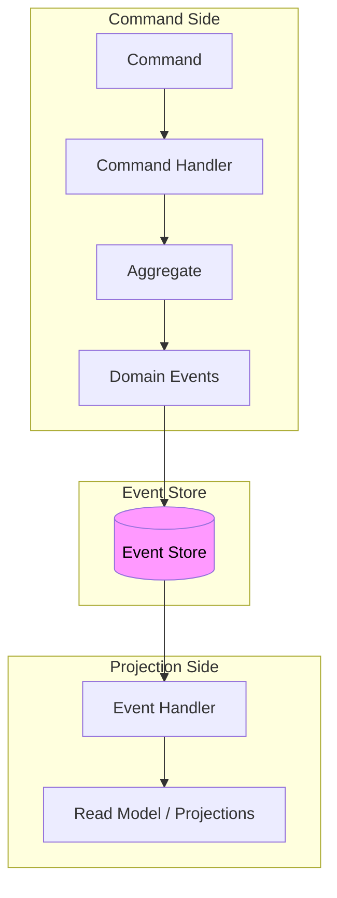
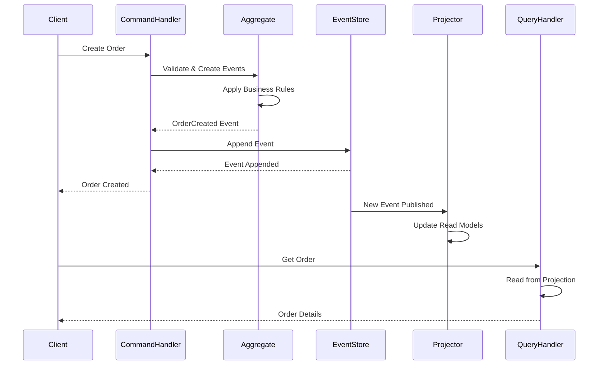

# Event Sourcing

## Overview

Event sourcing is a pattern where changes to application state are captured as a sequence of immutable events. Instead of storing the current state of entities, you store a log of all state-changing events that have occurred over time. The current state is derived by replaying these events from the beginning.

This pattern fundamentally changes how we think about data persistence. Traditional approaches store the current state (the "what"), while event sourcing stores the history of changes (the "how"). This distinction has profound implications for debugging, auditing, temporal queries, and system evolution.

In microservices architectures, event sourcing provides a natural way to maintain consistency across services without distributed transactions. Since events are immutable and append-only, they can be reliably published to multiple consumers. Each service can maintain its own event store and rebuild its state by consuming relevant events from other services.

The event store becomes the source of truth. Unlike traditional databases where the current state might be accidentally overwritten or lost, events are never deleted. They provide a complete audit trail of what happened in the system and when. This makes event-sourced systems excellent for domains with strict compliance requirements.

Event sourcing enables powerful capabilities that are difficult or impossible with traditional persistence. You can reconstruct the state of the system at any point in time by replaying events up to that point. You can have multiple read models optimized for different query patterns, all derived from the same event log. You can implement complex business rules that depend on the full history of an entity.

The pattern is not without challenges. Rebuilding state from events can be slow for entities with many events. Event schemas evolve over time, requiring migration strategies. The eventual consistency model can be confusing for developers accustomed to strong consistency. These challenges are manageable with proper design and tooling.

### Relationship to Other Patterns

Event sourcing is closely related to CQRS (Command Query Responsibility Segregation). In fact, they're often used together. While event sourcing is about how to store data (as events), CQRS is about how to organize read and write operations (separating them). The event log is the write model in CQRS, and read models are built by projecting events.

Saga patterns in microservices are often implemented using event sourcing. Each step in a saga publishes an event that triggers the next step. The events provide visibility into the saga's progress and enable compensation when steps fail.

## Flow Diagram



This diagram shows the core event sourcing flow: commands create events that are stored in the event store, then projections update read models based on those events.



This sequence diagram shows how commands flow to create events, events are stored, projections update read models, and queries read from those projections.

## Standard Example

### Event Store Implementation

```javascript
// event-store/index.js - Core event store implementation
const { Pool } = require('pg');
const { v4: uuidv4 } = require('uuid');

class EventStore {
    constructor(connectionString) {
        this.pool = new Pool({
            connectionString
        });
    }

    async initialize() {
        await this.pool.query(`
            CREATE TABLE IF NOT EXISTS events (
                id UUID PRIMARY KEY,
                aggregate_id UUID NOT NULL,
                aggregate_type VARCHAR(100) NOT NULL,
                event_type VARCHAR(100) NOT NULL,
                event_data JSONB NOT NULL,
                metadata JSONB,
                version INTEGER NOT NULL,
                created_at TIMESTAMP DEFAULT NOW(),
                CHECK (version > 0)
            );
            
            CREATE INDEX idx_events_aggregate_id ON events(aggregate_id);
            CREATE INDEX idx_events_aggregate_type ON events(aggregate_type);
            CREATE INDEX idx_events_created_at ON events(created_at);
            
            CREATE TABLE IF NOT EXISTS snapshots (
                aggregate_id UUID PRIMARY KEY,
                aggregate_type VARCHAR(100) NOT NULL,
                version INTEGER NOT NULL,
                state JSONB NOT NULL,
                created_at TIMESTAMP DEFAULT NOW()
            );
            
            CREATE TABLE IF NOT EXISTS subscriptions (
                id SERIAL PRIMARY KEY,
                subscriber_name VARCHAR(100) NOT NULL,
                last_event_id UUID,
                last_position BIGINT DEFAULT 0,
                created_at TIMESTAMP DEFAULT NOW()
            );
        `);
        
        console.log('Event store initialized');
    }

    async appendEvents(aggregateId, aggregateType, events, expectedVersion) {
        const client = await this.pool.connect();
        
        try {
            await client.query('BEGIN');
            
            // Check current version
            const currentVersionResult = await client.query(
                `SELECT COALESCE(MAX(version), 0) as version 
                 FROM events 
                 WHERE aggregate_id = $1`,
                [aggregateId]
            );
            
            const currentVersion = parseInt(currentVersionResult.rows[0].version);
            
            if (expectedVersion !== undefined && currentVersion !== expectedVersion) {
                throw new Error(
                    `Optimistic concurrency conflict: expected version ${expectedVersion}, ` +
                    `but current version is ${currentVersion}`
                );
            }
            
            // Append events
            const appendedEvents = [];
            for (const event of events) {
                const eventId = uuidv4();
                const newVersion = currentVersion + appendedEvents.length + 1;
                
                await client.query(
                    `INSERT INTO events (id, aggregate_id, aggregate_type, event_type, event_data, version)
                     VALUES ($1, $2, $3, $4, $5, $6)`,
                    [
                        eventId,
                        aggregateId,
                        aggregateType,
                        event.type,
                        JSON.stringify(event.data),
                        newVersion
                    ]
                );
                
                appendedEvents.push({
                    id: eventId,
                    ...event,
                    version: newVersion
                });
            }
            
            await client.query('COMMIT');
            
            return appendedEvents;
        } catch (error) {
            await client.query('ROLLBACK');
            throw error;
        } finally {
            client.release();
        }
    }

    async getEventsForAggregate(aggregateId) {
        const result = await this.pool.query(
            `SELECT * FROM events 
             WHERE aggregate_id = $1 
             ORDER BY version ASC`,
            [aggregateId]
        );
        
        return result.rows.map(row => ({
            id: row.id,
            aggregateId: row.aggregate_id,
            aggregateType: row.aggregate_type,
            type: row.event_type,
            data: row.event_data,
            version: row.version,
            createdAt: row.created_at
        }));
    }

    async getEventsSince(position, limit = 100) {
        const offset = position || 0;
        
        const result = await this.pool.query(
            `SELECT * FROM events 
             WHERE id NOT IN (
                 SELECT id FROM events ORDER BY created_at LIMIT $1
             )
             ORDER BY created_at ASC
             LIMIT $2`,
            [offset, limit]
        );
        
        return result.rows.map(row => ({
            id: row.id,
            aggregateId: row.aggregate_id,
            aggregateType: row.aggregate_type,
            type: row.event_type,
            data: row.event_data,
            version: row.version,
            createdAt: row.created_at
        }));
    }

    async saveSnapshot(aggregateId, aggregateType, version, state) {
        await this.pool.query(
            `INSERT INTO snapshots (aggregate_id, aggregate_type, version, state)
             VALUES ($1, $2, $3, $4)
             ON CONFLICT (aggregate_id) DO UPDATE
             SET version = $3, state = $4, created_at = NOW()`,
            [aggregateId, aggregateType, version, JSON.stringify(state)]
        );
    }

    async getSnapshot(aggregateId) {
        const result = await this.pool.query(
            `SELECT * FROM snapshots WHERE aggregate_id = $1`,
            [aggregateId]
        );
        
        if (result.rows.length === 0) {
            return null;
        }
        
        return {
            aggregateId: result.rows[0].aggregate_id,
            aggregateType: result.rows[0].aggregate_type,
            version: result.rows[0].version,
            state: result.rows[0].state
        };
    }
}

module.exports = { EventStore };
```

### Domain Aggregate with Event Sourcing

```javascript
// domain/order-aggregate.js - Order aggregate with event sourcing
class OrderAggregate {
    constructor(aggregateId) {
        this.aggregateId = aggregateId;
        this.items = [];
        this.status = 'DRAFT';
        this.customerId = null;
        this.version = 0;
    }

    // Reconstitute from events
    static fromEvents(events) {
        const aggregate = new OrderAggregate(events[0]?.aggregateId);
        
        for (const event of events) {
            aggregate.applyEvent(event);
        }
        
        return aggregate;
    }

    applyEvent(event) {
        switch (event.type) {
            case 'OrderCreated':
                this.customerId = event.data.customerId;
                this.status = 'CREATED';
                break;
                
            case 'ItemAdded':
                this.items.push({
                    productId: event.data.productId,
                    productName: event.data.productName,
                    quantity: event.data.quantity,
                    unitPrice: event.data.unitPrice
                });
                break;
                
            case 'ItemRemoved':
                this.items = this.items.filter(
                    item => item.productId !== event.data.productId
                );
                break;
                
            case 'OrderConfirmed':
                this.status = 'CONFIRMED';
                break;
                
            case 'OrderShipped':
                this.status = 'SHIPPED';
                break;
                
            case 'OrderCancelled':
                this.status = 'CANCELLED';
                break;
        }
        
        this.version = event.version;
    }

    // Commands - return events
    create(customerId) {
        if (this.status !== 'DRAFT') {
            throw new Error('Order already created');
        }
        
        return [{
            type: 'OrderCreated',
            data: { customerId }
        }];
    }

    addItem(productId, productName, quantity, unitPrice) {
        if (this.status !== 'DRAFT' && this.status !== 'CREATED') {
            throw new Error('Cannot add items to order in current status');
        }
        
        const existingItem = this.items.find(item => item.productId === productId);
        
        if (existingItem) {
            return [{
                type: 'ItemQuantityUpdated',
                data: {
                    productId,
                    quantity: existingItem.quantity + quantity
                }
            }];
        }
        
        return [{
            type: 'ItemAdded',
            data: { productId, productName, quantity, unitPrice }
        }];
    }

    removeItem(productId) {
        const existingItem = this.items.find(item => item.productId === productId);
        
        if (!existingItem) {
            throw new Error('Item not found in order');
        }
        
        return [{
            type: 'ItemRemoved',
            data: { productId }
        }];
    }

    confirm() {
        if (this.status !== 'CREATED') {
            throw new Error('Order cannot be confirmed in current status');
        }
        
        if (this.items.length === 0) {
            throw new Error('Cannot confirm empty order');
        }
        
        return [{
            type: 'OrderConfirmed',
            data: { confirmedAt: new Date().toISOString() }
        }];
    }

    ship() {
        if (this.status !== 'CONFIRMED') {
            throw new Error('Order cannot be shipped in current status');
        }
        
        return [{
            type: 'OrderShipped',
            data: { shippedAt: new Date().toISOString() }
        }];
    }

    cancel() {
        if (this.status === 'SHIPPED' || this.status === 'DELIVERED') {
            throw new Error('Cannot cancel shipped or delivered order');
        }
        
        return [{
            type: 'OrderCancelled',
            data: { cancelledAt: new Date().toISOString() }
        }];
    }

    getTotalAmount() {
        return this.items.reduce(
            (total, item) => total + (item.quantity * item.unitPrice),
            0
        );
    }

    toSnapshot() {
        return {
            aggregateId: this.aggregateId,
            customerId: this.customerId,
            items: this.items,
            status: this.status,
            version: this.version
        };
    }
}

module.exports = { OrderAggregate };
```

### Command Handler

```javascript
// handlers/order-command-handler.js - Command handling for orders
const { EventStore } = require('../event-store');
const { OrderAggregate } = require('../domain/order-aggregate');

class OrderCommandHandler {
    constructor(eventStore) {
        this.eventStore = eventStore;
    }

    async handleCreateOrder(command) {
        const { orderId, customerId } = command;
        
        // Create new aggregate
        const aggregate = new OrderAggregate(orderId);
        
        // Generate events
        const events = aggregate.create(customerId);
        
        // Persist events
        const appendedEvents = await this.eventStore.appendEvents(
            orderId,
            'Order',
            events,
            0 // Expected version for new aggregate
        );
        
        return appendedEvents;
    }

    async handleAddItem(command) {
        const { orderId, productId, productName, quantity, unitPrice } = command;
        
        // Load aggregate from events
        const events = await this.eventStore.getEventsForAggregate(orderId);
        
        if (events.length === 0) {
            throw new Error(`Order ${orderId} not found`);
        }
        
        const aggregate = OrderAggregate.fromEvents(events);
        
        // Generate new events
        const newEvents = aggregate.addItem(productId, productName, quantity, unitPrice);
        
        // Persist
        const appendedEvents = await this.eventStore.appendEvents(
            orderId,
            'Order',
            newEvents,
            aggregate.version
        );
        
        return appendedEvents;
    }

    async handleConfirmOrder(command) {
        const { orderId } = command;
        
        const events = await this.eventStore.getEventsForAggregate(orderId);
        
        if (events.length === 0) {
            throw new Error(`Order ${orderId} not found`);
        }
        
        const aggregate = OrderAggregate.fromEvents(events);
        const newEvents = aggregate.confirm();
        
        const appendedEvents = await this.eventStore.appendEvents(
            orderId,
            'Order',
            newEvents,
            aggregate.version
        );
        
        return appendedEvents;
    }

    async handleCancelOrder(command) {
        const { orderId, reason } = command;
        
        const events = await this.eventStore.getEventsForAggregate(orderId);
        const aggregate = OrderAggregate.fromEvents(events);
        
        const newEvents = aggregate.cancel();
        newEvents[0].data.reason = reason;
        
        const appendedEvents = await this.eventStore.appendEvents(
            orderId,
            'Order',
            newEvents,
            aggregate.version
        );
        
        return appendedEvents;
    }

    async handleShipOrder(command) {
        const { orderId } = command;
        
        const events = await this.eventStore.getEventsForAggregate(orderId);
        const aggregate = OrderAggregate.fromEvents(events);
        
        const newEvents = aggregate.ship();
        
        const appendedEvents = await this.eventStore.appendEvents(
            orderId,
            'Order',
            newEvents,
            aggregate.version
        );
        
        return appendedEvents;
    }
}

module.exports = { OrderCommandHandler };
```

### Projections for Read Models

```javascript
// projections/order-projections.js - Build read models from events
const { Pool } = require('pg');

class OrderProjections {
    constructor(eventStore, readDbPool) {
        this.eventStore = eventStore;
        this.readDb = readDbPool;
        this.snapshotInterval = 100;
    }

    async initialize() {
        await this.readDb.query(`
            CREATE TABLE IF NOT EXISTS order_read_model (
                order_id VARCHAR(50) PRIMARY KEY,
                customer_id VARCHAR(50),
                status VARCHAR(20),
                total_amount DECIMAL(10, 2),
                item_count INTEGER,
                created_at TIMESTAMP,
                updated_at TIMESTAMP,
                version INTEGER
            );
            
            CREATE TABLE IF NOT EXISTS order_items_read_model (
                id SERIAL PRIMARY KEY,
                order_id VARCHAR(50) REFERENCES order_read_model(order_id),
                product_id VARCHAR(50),
                product_name VARCHAR(255),
                quantity INTEGER,
                unit_price DECIMAL(10, 2),
                subtotal DECIMAL(10, 2)
            );
            
            CREATE INDEX idx_order_items_order_id ON order_items_read_model(order_id);
        `);
        
        console.log('Order projections initialized');
    }

    async projectOrderCreated(event) {
        await this.readDb.query(
            `INSERT INTO order_read_model (order_id, customer_id, status, total_amount, item_count, created_at, updated_at, version)
             VALUES ($1, $2, $3, $4, $5, $6, $6, $7)`,
            [
                event.aggregateId,
                event.data.customerId,
                'CREATED',
                0,
                0,
                event.createdAt,
                event.version
            ]
        );
    }

    async projectItemAdded(event) {
        const client = await this.readDb.connect();
        
        try {
            await client.query('BEGIN');
            
            // Add item
            await client.query(
                `INSERT INTO order_items_read_model (order_id, product_id, product_name, quantity, unit_price, subtotal)
                 VALUES ($1, $2, $3, $4, $5, $6)`,
                [
                    event.aggregateId,
                    event.data.productId,
                    event.data.productName,
                    event.data.quantity,
                    event.data.unitPrice,
                    event.data.quantity * event.data.unitPrice
                ]
            );
            
            // Update order totals
            await client.query(
                `UPDATE order_read_model 
                 SET item_count = item_count + 1,
                     total_amount = total_amount + $2,
                     version = $3,
                     updated_at = NOW()
                 WHERE order_id = $1`,
                [event.aggregateId, event.data.quantity * event.data.unitPrice, event.version]
            );
            
            await client.query('COMMIT');
        } catch (error) {
            await client.query('ROLLBACK');
            throw error;
        } finally {
            client.release();
        }
    }

    async projectOrderStatusChanged(event) {
        let newStatus;
        
        switch (event.type) {
            case 'OrderConfirmed':
                newStatus = 'CONFIRMED';
                break;
            case 'OrderShipped':
                newStatus = 'SHIPPED';
                break;
            case 'OrderCancelled':
                newStatus = 'CANCELLED';
                break;
            default:
                return;
        }
        
        await this.readDb.query(
            `UPDATE order_read_model 
             SET status = $2, version = $3, updated_at = NOW()
             WHERE order_id = $1`,
            [event.aggregateId, newStatus, event.version]
        );
    }

    async projectEvent(event) {
        switch (event.type) {
            case 'OrderCreated':
                await this.projectOrderCreated(event);
                break;
            case 'ItemAdded':
                await this.projectItemAdded(event);
                break;
            case 'ItemRemoved':
                // Handle item removal
                break;
            case 'OrderConfirmed':
            case 'OrderShipped':
            case 'OrderCancelled':
                await this.projectOrderStatusChanged(event);
                break;
        }
    }

    // Rebuild entire projection from all events
    async rebuildProjection() {
        console.log('Rebuilding order projection...');
        
        // Clear existing read model
        await this.readDb.query('TRUNCATE TABLE order_items_read_model CASCADE');
        await this.readDb.query('TRUNCATE TABLE order_read_model CASCADE');
        
        // Get all events in order
        const result = await this.eventStore.getEventsSince(0, 100000);
        
        // Project each event
        for (const event of result) {
            await this.projectEvent(event);
        }
        
        console.log(`Projection rebuilt with ${result.length} events`);
    }

    // Get order from read model
    async getOrder(orderId) {
        const orderResult = await this.readDb.query(
            'SELECT * FROM order_read_model WHERE order_id = $1',
            [orderId]
        );
        
        if (orderResult.rows.length === 0) {
            return null;
        }
        
        const itemsResult = await this.readDb.query(
            'SELECT * FROM order_items_read_model WHERE order_id = $1',
            [orderId]
        );
        
        return {
            ...orderResult.rows[0],
            items: itemsResult.rows
        };
    }

    // Get orders by customer
    async getOrdersByCustomer(customerId) {
        const result = await this.readDb.query(
            'SELECT * FROM order_read_model WHERE customer_id = $1 ORDER BY created_at DESC',
            [customerId]
        );
        
        return result.rows;
    }

    // Get orders by status
    async getOrdersByStatus(status) {
        const result = await this.readDb.query(
            'SELECT * FROM order_read_model WHERE status = $1 ORDER BY created_at DESC',
            [status]
        );
        
        return result.rows;
    }
}

module.exports = { OrderProjections };
```

### Event Bus for Publishing Events

```javascript
// infrastructure/event-bus.js - Event publishing infrastructure
const EventEmitter = require('events');

class EventBus extends EventEmitter {
    constructor() {
        super();
        this.subscribers = new Map();
    }

    async publish(event) {
        console.log(`Publishing event: ${event.type}`, event.aggregateId);
        
        // Emit for local subscribers
        this.emit(event.type, event);
        this.emit('*', event); // Wildcard for all events
        
        // Store in outbox for reliable delivery
        await this.storeInOutbox(event);
        
        return event;
    }

    async storeInOutbox(event) {
        // In production, this would write to an outbox table
        // that gets processed by a background job
        console.log('Event stored in outbox for delivery');
    }

    subscribe(eventType, handler) {
        const subscriptionId = `${eventType}-${Date.now()}`;
        
        if (eventType === '*') {
            this.on('*', handler);
        } else {
            this.on(eventType, handler);
        }
        
        this.subscribers.set(subscriptionId, { eventType, handler });
        
        return {
            unsubscribe: () => {
                if (eventType === '*') {
                    this.off('*', handler);
                } else {
                    this.off(eventType, handler);
                }
                this.subscribers.delete(subscriptionId);
            }
        };
    }
}

// Example event handlers that react to events
function setupEventHandlers(eventBus, projections) {
    // Update read model on any event
    eventBus.subscribe('*', async (event) => {
        try {
            await projections.projectEvent(event);
        } catch (error) {
            console.error('Error projecting event:', error.message);
        }
    });

    // Special handling for order confirmation
    eventBus.subscribe('OrderConfirmed', async (event) => {
        // Could trigger external systems like notification service
        console.log(`Order ${event.aggregateId} confirmed - trigger notifications`);
    });

    // Handle shipping
    eventBus.subscribe('OrderShipped', async (event) => {
        console.log(`Order ${event.aggregateId} shipped - update inventory`);
    });

    // Handle cancellation
    eventBus.subscribe('OrderCancelled', async (event) => {
        console.log(`Order ${event.aggregateId} cancelled - release inventory`);
    });
}

module.exports = { EventBus, setupEventHandlers };
```

### API Endpoints

```javascript
// api/order-api.js - REST API for orders
const express = require('express');
const { OrderCommandHandler } = require('../handlers/order-command-handler');
const { OrderProjections } = require('../projections/order-projections');
const { EventBus } = require('../infrastructure/event-bus');
const { v4: uuidv4 } = require('uuid');

function createOrderRouter(eventStore, readDb, eventBus) {
    const router = express.Router();
    
    const commandHandler = new OrderCommandHandler(eventStore);
    const projections = new OrderProjections(eventStore, readDb);
    
    setupEventHandlers(eventBus, projections);
    
    // Create order
    router.post('/orders', async (req, res) => {
        try {
            const { customerId, items } = req.body;
            const orderId = uuidv4();
            
            const events = await commandHandler.handleCreateOrder({
                orderId,
                customerId
            });
            
            // Add items
            for (const item of items || []) {
                await commandHandler.handleAddItem({
                    orderId,
                    productId: item.productId,
                    productName: item.productName,
                    quantity: item.quantity,
                    unitPrice: item.unitPrice
                });
            }
            
            // Publish events
            const allEvents = await eventStore.getEventsForAggregate(orderId);
            for (const event of allEvents.slice(events.length)) {
                await eventBus.publish(event);
            }
            
            res.status(201).json({ orderId, status: 'CREATED' });
        } catch (error) {
            console.error('Error creating order:', error);
            res.status(500).json({ error: error.message });
        }
    });

    // Get order (from read model)
    router.get('/orders/:orderId', async (req, res) => {
        try {
            const order = await projections.getOrder(req.params.orderId);
            
            if (!order) {
                return res.status(404).json({ error: 'Order not found' });
            }
            
            res.json(order);
        } catch (error) {
            console.error('Error fetching order:', error);
            res.status(500).json({ error: error.message });
        }
    });

    // Get customer orders
    router.get('/customers/:customerId/orders', async (req, res) => {
        try {
            const orders = await projections.getOrdersByCustomer(req.params.customerId);
            res.json({ orders });
        } catch (error) {
            console.error('Error fetching customer orders:', error);
            res.status(500).json({ error: error.message });
        }
    });

    // Confirm order
    router.post('/orders/:orderId/confirm', async (req, res) => {
        try {
            const events = await commandHandler.handleConfirmOrder({
                orderId: req.params.orderId
            });
            
            // Publish events
            const allEvents = await eventStore.getEventsForAggregate(req.params.orderId);
            const newEvents = allEvents.filter(e => 
                events.some(he => he.id === e.id)
            );
            
            for (const event of newEvents) {
                await eventBus.publish(event);
            }
            
            res.json({ orderId: req.params.orderId, status: 'CONFIRMED' });
        } catch (error) {
            console.error('Error confirming order:', error);
            res.status(500).json({ error: error.message });
        }
    });

    // Cancel order
    router.post('/orders/:orderId/cancel', async (req, res) => {
        try {
            const { reason } = req.body;
            
            const events = await commandHandler.handleCancelOrder({
                orderId: req.params.orderId,
                reason
            });
            
            res.json({ orderId: req.params.orderId, status: 'CANCELLED' });
        } catch (error) {
            console.error('Error cancelling order:', error);
            res.status(500).json({ error: error.message });
        }
    });

    return router;
}

module.exports = { createOrderRouter };
```

## Real-World Examples

### Event Store at EventStoreDB

EventStoreDB is a purpose-built database for event sourcing. It provides exactly what an event-sourced system needs: append-only storage of events, efficient replay capabilities, and subscriptions for building projections. Many companies use EventStoreDB as the foundation for event-sourced systems.

EventStoreDB supports projections that can transform events into different shapes, implement complex event transformations, and even create entirely new event streams. This makes it a powerful platform for building event-sourced applications.

### Axon Framework

Axon Framework is a popular framework for building event-sourced applications in Java. It provides annotations for defining aggregates, command handlers, and event handlers. Axon handles the mechanics of storing events, replaying them, and building projections.

Axon integrates with various event stores including EventStoreDB and relational databases. It also provides support for sagas, which are essential for coordinating multi-step business processes in microservices.

### Laravel Event Projections

PHP's Laravel framework has strong support for event sourcing through packages like laravel-event-projections. This allows PHP developers to build event-sourced systems with the same tools they use for traditional Laravel applications.

The package provides mechanisms for defining aggregates, storing events, and building read models. It integrates with Laravel's existing infrastructure for testing and dependency injection.

### Greg Young's CQRS/ES Example

Greg Young, who popularized event sourcing and CQRS, has created several example applications demonstrating these patterns. His "Simplified DB" example shows how to build a complete event-sourced system without a purpose-built event store, using relational databases as the underlying storage.

## Best Practices

### 1. Design Events Carefully

Events should represent something that happened in the domain, not what the system should do. Use past tense: OrderCreated, ItemAdded, PaymentProcessed. Events should be immutable once created.

Include all necessary data in events, but don't include derived data. If the current total can be calculated from items, don't store it separately in the event. The event should contain the source data, not the derived values.

Version your events to handle schema evolution. Include a version number in each event and handle migration in your aggregate's apply method.

### 2. Use Snapshots for Performance

If aggregates have many events, rebuilding their state from the beginning becomes slow. Implement snapshots that store the aggregate's state at regular intervals. When loading an aggregate, start from the most recent snapshot and only replay events after that point.

Choose snapshot frequency based on your performance requirements. A snapshot every 100 events is a good starting point for many applications. Test rebuild times with your actual event volume to find the optimal interval.

### 3. Handle Idempotency

Network failures can cause commands to be submitted multiple times. Design your command handlers to be idempotent - processing the same command twice should have the same result as processing it once.

One approach is to include a unique command ID with each command and track which IDs have been processed. Another approach is to design events so that applying them multiple times has the same effect as applying them once (idempotent event handlers).

### 4. Design for Failure

Event sourcing introduces eventual consistency between the write model and read models. Design your application to handle the delay between writing an event and seeing it in read models.

Consider what happens when event processing fails. Events should be retried until successful, but the system should still accept new commands. This requires careful error handling and potentially storing failed events for later processing.

### 5. Test Event Sourcing Logic

Write unit tests that verify your aggregate's event generation. Test the aggregate with specific commands and verify it produces the expected events. Also test that invalid commands are rejected.

Test your projections by feeding them events and verifying the resulting read model state. This helps ensure that your read models correctly reflect the event stream.

### 6. Plan for Schema Evolution

Events persist forever, so you need a strategy for handling schema changes. When you need to add fields, do so in a backward-compatible way. When you need to remove fields, keep them in the event but ignore them in processing.

Document your event schemas and versions. Create migration functions that can transform old event formats to new ones. Test these migrations thoroughly.

### 7. Monitor Event Processing

Track the lag between events being written and events being processed by projections. If lag grows, you need to investigate - it could indicate a problem in your event processing pipeline.

Monitor the size of event stores. Large aggregates might indicate that you need to split aggregates or implement snapshots. Monitor projection rebuild times to ensure they complete within acceptable windows.