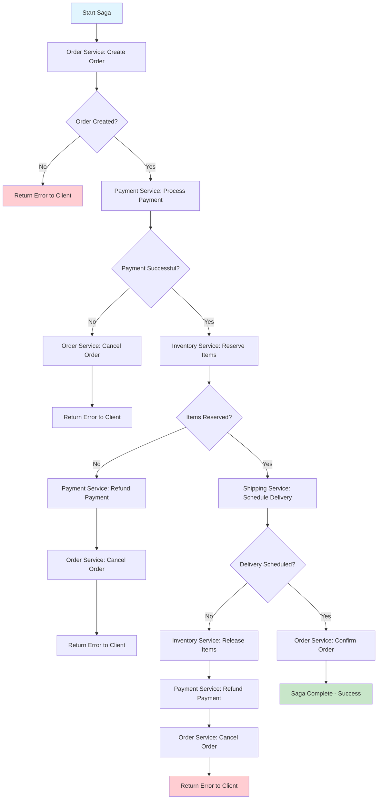

# Saga Pattern

## Overview

The Saga Pattern is a design pattern used to manage distributed transactions across multiple microservices in a distributed system. In a monolithic architecture, transactions are managed by a single database using ACID (Atomicity, Consistency, Isolation, Durability) properties. However, in a microservices architecture, each service has its own database, making traditional distributed transactions like the Two-Phase Commit (2PC) protocol impractical due to latency issues, coupling, and scalability constraints.

The Saga pattern provides an alternative approach by breaking a large transaction into a sequence of local transactions. Each local transaction updates the database and publishes an event or message that triggers the next local transaction in the saga. If any local transaction fails, the saga executes compensating transactions to undo the effects of the previously completed transactions, ensuring data consistency across services.

The pattern was introduced by Hector Garcia-Molina and Kenneth Salem in their 1987 paper "Sagas" as a way to handle long-running transactions in database systems. Since then, it has become a foundational pattern in microservices architecture for managing complex business workflows that span multiple services.

The key difference between traditional distributed transactions and the Saga pattern is that Saga ensures consistency through a sequence of local transactions with compensating actions, rather than using locking mechanisms that can cause blocking and reduced concurrency. This approach is particularly well-suited for systems where high availability and responsiveness are critical requirements.

## Core Concepts

### Choreography-Based Saga

In a choreography-based saga, each service involved in the transaction publishes events to inform other services about the progress of the workflow. There is no central coordinator; instead, each service listens for events from other services and responds accordingly by performing its local transaction and publishing new events.

The choreography approach works as follows:
1. The first service executes its local transaction and publishes an event
2. Other services listen for this event and execute their local transactions
3. Each service publishes events indicating success or failure
4. If any service fails, compensating events are published to rollback previous transactions

Advantages of choreography:
- Simpler implementation with no central point of failure
- Services are loosely coupled through event messages
- Easy to add new participants without modifying existing services
- Better suited for simple workflows with few participants

Disadvantages of choreography:
- Can become complex as the number of services grows
- Difficult to track and monitor the overall state of the saga
- Cyclic dependencies may emerge between services
- Testing and debugging can be challenging due to distributed nature

### Orchestration-Based Saga

In an orchestration-based saga, a central coordinator (often called the Saga Orchestrator) manages the entire transaction flow. The orchestrator is responsible for executing each step of the saga, handling success/failure responses, and triggering compensating transactions when needed. Unlike choreography, the orchestrator has complete visibility into the saga's progress and can make decisions based on the overall state.

The orchestration approach works as follows:
1. The orchestrator receives a request to start the saga
2. The orchestrator calls each service sequentially or in parallel
3. Each service executes its local transaction and reports back to the orchestrator
4. On success, the orchestrator proceeds to the next step
5. On failure, the orchestrator triggers compensating transactions for completed steps

Advantages of orchestration:
- Centralized control makes it easier to manage complex workflows
- Better observability - the orchestrator knows the current state of the saga
- Easier to implement retry logic and failure handling
- Services remain simple and focused on business logic

Disadvantages of orchestration:
- The orchestrator becomes a single point of failure
- Additional complexity in implementing the orchestrator itself
- Potential coupling between services and the orchestrator
- May become a bottleneck in high-throughput scenarios

### Local Transactions and Compensating Transactions

A local transaction is a single database operation executed by one service within a saga. Each local transaction must be:
- Self-contained: The service has full control over the operation
- Reversible: There must be a way to undo the operation if needed
- Observable: The service should publish events or update state that other services can react to

Compensating transactions are the mechanism used to rollback the effects of previously completed local transactions when a later step fails. Unlike traditional database rollbacks that use transaction logs, compensating transactions are explicit operations that undo the business effects of the original transaction.

For example:
- If a local transaction debits one account, the compensating transaction credits it back
- If a local transaction creates a database record, the compensating transaction deletes it
- If a local transaction sends an email, the compensating transaction sends a follow-up cancellation

The key principle is that compensating transactions should restore the system to the state it would have been in had the saga never started. This requires careful design of both forward and compensating transactions.

### Failure Handling and Recovery

Failure handling is a critical aspect of the Saga pattern. When a local transaction fails, the system must respond appropriately to maintain data consistency. There are several strategies for handling failures:

**Automatic Retry**: For transient failures (network issues, temporary unavailability), the failed transaction can be automatically retried. This requires implementing idempotent operations so that retrying doesn't cause duplicate effects.

**Compensating Transactions**: When a failure cannot be resolved by retry, the saga must execute compensating transactions to rollback all previously completed steps. This is done in reverse order of execution.

**Saga State Management**: The saga orchestrator or event log maintains the state of each saga, including which steps have completed and which are pending. This state is used to determine what compensating actions are needed when failures occur.

**Timeout Handling**: Each step in a saga should have a timeout. If a step doesn't complete within the expected time, the saga should treat it as a failure and initiate compensating actions.

**Manual Intervention**: In some cases, automatic compensation may not be possible or sufficient. The system should support manual intervention or escalation for complex failure scenarios.

**Saga Log**: Maintaining a persistent log of saga events is essential for recovery after system failures. The log should record each step's start, completion, and compensation events so the saga can be reconstructed after a crash.

## Flow Chart



## Standard Example

```java
import java.util.ArrayList;
import java.util.List;
import java.util.UUID;

/**
 * Saga Pattern Implementation in Java
 * 
 * This example demonstrates an orchestration-based saga for order processing
 * involving multiple services: Order, Payment, Inventory, and Shipping.
 */

// Base class for all saga steps
abstract class SagaStep<T> {
    protected String stepName;
    protected T result;
    
    public SagaStep(String stepName) {
        this.stepName = stepName;
    }
    
    public abstract boolean execute();
    public abstract boolean compensate();
    
    public String getStepName() {
        return stepName;
    }
    
    public T getResult() {
        return result;
    }
}

// Result class to hold execution results
class SagaResult<T> {
    private final boolean success;
    private final T data;
    private final String errorMessage;
    
    private SagaResult(boolean success, T data, String errorMessage) {
        this.success = success;
        this.data = data;
        this.errorMessage = errorMessage;
    }
    
    public static <T> SagaResult<T> success(T data) {
        return new SagaResult<>(true, data, null);
    }
    
    public static <T> SagaResult<T> failure(String errorMessage) {
        return new SagaResult<>(false, null, errorMessage);
    }
    
    public boolean isSuccess() {
        return success;
    }
    
    public T getData() {
        return data;
    }
    
    public String getErrorMessage() {
        return errorMessage;
    }
}

// Order service - handles order creation and management
class OrderService {
    private final List<String> orders = new ArrayList<>();
    
    public SagaResult<String> createOrder(String orderId, String customerId) {
        // Simulate order creation logic
        String orderRecord = "ORDER:" + orderId + ":CUSTOMER:" + customerId + ":STATUS:CREATED";
        orders.add(orderRecord);
        System.out.println("[OrderService] Created order: " + orderId);
        return SagaResult.success(orderId);
    }
    
    public boolean cancelOrder(String orderId) {
        // Simulate order cancellation
        System.out.println("[OrderService] Cancelled order: " + orderId);
        return true;
    }
    
    public boolean confirmOrder(String orderId) {
        System.out.println("[OrderService] Confirmed order: " + orderId);
        return true;
    }
}

// Payment service - handles payment processing
class PaymentService {
    private final List<String> payments = new ArrayList<>();
    
    public SagaResult<String> processPayment(String paymentId, String orderId, double amount) {
        // Simulate payment processing
        String paymentRecord = "PAYMENT:" + paymentId + ":ORDER:" + orderId + ":AMOUNT:" + amount + ":STATUS:SUCCESS";
        payments.add(paymentRecord);
        System.out.println("[PaymentService] Processed payment: " + paymentId + " amount: " + amount);
        return SagaResult.success(paymentId);
    }
    
    public boolean refundPayment(String paymentId) {
        // Simulate refund processing
        System.out.println("[PaymentService] Refunded payment: " + paymentId);
        return true;
    }
}

// Inventory service - handles item reservation
class InventoryService {
    private final List<String> reservations = new ArrayList<>();
    
    public SagaResult<String> reserveItems(String reservationId, List<String> itemIds) {
        // Simulate inventory reservation
        String reservationRecord = "RESERVATION:" + reservationId + ":ITEMS:" + String.join(",", itemIds) + ":STATUS:RESERVED";
        reservations.add(reservationRecord);
        System.out.println("[InventoryService] Reserved items: " + String.join(", ", itemIds));
        return SagaResult.success(reservationId);
    }
    
    public boolean releaseItems(String reservationId) {
        // Simulate releasing inventory
        System.out.println("[InventoryService] Released reservation: " + reservationId);
        return true;
    }
}

// Shipping service - handles delivery scheduling
class ShippingService {
    private final List<String> deliveries = new ArrayList<>();
    
    public SagaResult<String> scheduleDelivery(String deliveryId, String orderId, String address) {
        // Simulate delivery scheduling
        String deliveryRecord = "DELIVERY:" + deliveryId + ":ORDER:" + orderId + ":ADDRESS:" + address + ":STATUS:SCHEDULED";
        deliveries.add(deliveryRecord);
        System.out.println("[ShippingService] Scheduled delivery: " + deliveryId + " to address: " + address);
        return SagaResult.success(deliveryId);
    }
    
    public boolean cancelDelivery(String deliveryId) {
        // Simulate delivery cancellation
        System.out.println("[ShippingService] Cancelled delivery: " + deliveryId);
        return true;
    }
}

// Individual saga steps for each service
class CreateOrderStep extends SagaStep<String> {
    private final OrderService orderService;
    private final String orderId;
    private final String customerId;
    
    public CreateOrderStep(OrderService orderService, String orderId, String customerId) {
        super("CreateOrder");
        this.orderService = orderService;
        this.orderId = orderId;
        this.customerId = customerId;
    }
    
    @Override
    public boolean execute() {
        SagaResult<String> result = orderService.createOrder(orderId, customerId);
        if (result.isSuccess()) {
            this.result = result.getData();
            return true;
        }
        return false;
    }
    
    @Override
    public boolean compensate() {
        return orderService.cancelOrder(orderId);
    }
}

class ProcessPaymentStep extends SagaStep<String> {
    private final PaymentService paymentService;
    private final String paymentId;
    private final String orderId;
    private final double amount;
    
    public ProcessPaymentStep(PaymentService paymentService, String paymentId, String orderId, double amount) {
        super("ProcessPayment");
        this.paymentService = paymentService;
        this.paymentId = paymentId;
        this.orderId = orderId;
        this.amount = amount;
    }
    
    @Override
    public boolean execute() {
        SagaResult<String> result = paymentService.processPayment(paymentId, orderId, amount);
        if (result.isSuccess()) {
            this.result = result.getData();
            return true;
        }
        return false;
    }
    
    @Override
    public boolean compensate() {
        return paymentService.refundPayment(paymentId);
    }
}

class ReserveInventoryStep extends SagaStep<String> {
    private final InventoryService inventoryService;
    private final String reservationId;
    private final List<String> itemIds;
    
    public ReserveInventoryStep(InventoryService inventoryService, String reservationId, List<String> itemIds) {
        super("ReserveInventory");
        this.inventoryService = inventoryService;
        this.reservationId = reservationId;
        this.itemIds = itemIds;
    }
    
    @Override
    public boolean execute() {
        SagaResult<String> result = inventoryService.reserveItems(reservationId, itemIds);
        if (result.isSuccess()) {
            this.result = result.getData();
            return true;
        }
        return false;
    }
    
    @Override
    public boolean compensate() {
        return inventoryService.releaseItems(reservationId);
    }
}

class ScheduleDeliveryStep extends SagaStep<String> {
    private final ShippingService shippingService;
    private final String deliveryId;
    private final String orderId;
    private final String address;
    
    public ScheduleDeliveryStep(ShippingService shippingService, String deliveryId, String orderId, String address) {
        super("ScheduleDelivery");
        this.shippingService = shippingService;
        this.deliveryId = deliveryId;
        this.orderId = orderId;
        this.address = address;
    }
    
    @Override
    public boolean execute() {
        SagaResult<String> result = shippingService.scheduleDelivery(deliveryId, orderId, address);
        if (result.isSuccess()) {
            this.result = result.getData();
            return true;
        }
        return false;
    }
    
    @Override
    public boolean compensate() {
        return shippingService.cancelDelivery(deliveryId);
    }
}

class ConfirmOrderStep extends SagaStep<String> {
    private final OrderService orderService;
    private final String orderId;
    
    public ConfirmOrderStep(OrderService orderService, String orderId) {
        super("ConfirmOrder");
        this.orderService = orderService;
        this.orderId = orderId;
    }
    
    @Override
    public boolean execute() {
        return orderService.confirmOrder(orderId);
    }
    
    @Override
    public boolean compensate() {
        return orderService.cancelOrder(orderId);
    }
}

// Saga orchestrator that manages the execution flow
class OrderSagaOrchestrator {
    private final List<SagaStep<?>> executedSteps = new ArrayList<>();
    private String sagaId;
    
    public void execute(OrderSagaData data) {
        sagaId = UUID.randomUUID().toString();
        System.out.println("\n========== Starting Saga: " + sagaId + " ==========\n");
        
        try {
            // Step 1: Create Order
            SagaStep<String> createOrderStep = new CreateOrderStep(
                data.getOrderService(), data.getOrderId(), data.getCustomerId()
            );
            executeStep(createOrderStep);
            
            // Step 2: Process Payment
            SagaStep<String> processPaymentStep = new ProcessPaymentStep(
                data.getPaymentService(), data.getPaymentId(), data.getOrderId(), data.getAmount()
            );
            executeStep(processPaymentStep);
            
            // Step 3: Reserve Inventory
            SagaStep<String> reserveInventoryStep = new ReserveInventoryStep(
                data.getInventoryService(), data.getReservationId(), data.getItemIds()
            );
            executeStep(reserveInventoryStep);
            
            // Step 4: Schedule Delivery
            SagaStep<String> scheduleDeliveryStep = new ScheduleDeliveryStep(
                data.getShippingService(), data.getDeliveryId(), data.getOrderId(), data.getAddress()
            );
            executeStep(scheduleDeliveryStep);
            
            // Step 5: Confirm Order
            SagaStep<String> confirmOrderStep = new ConfirmOrderStep(
                data.getOrderService(), data.getOrderId()
            );
            executeStep(confirmOrderStep);
            
            System.out.println("\n========== Saga Completed Successfully: " + sagaId + " ==========\n");
            
        } catch (Exception e) {
            System.out.println("\n========== Saga Failed: " + e.getMessage() + " ==========\n");
            compensate();
        }
    }
    
    private void executeStep(SagaStep<?> step) {
        System.out.println("Executing step: " + step.getStepName());
        if (!step.execute()) {
            throw new RuntimeException("Step " + step.getStepName() + " failed");
        }
        executedSteps.add(step);
    }
    
    private void compensate() {
        System.out.println("\n========== Starting Compensation ==========\n");
        
        // Execute compensating transactions in reverse order
        for (int i = executedSteps.size() - 1; i >= 0; i--) {
            SagaStep<?> step = executedSteps.get(i);
            System.out.println("Compensating step: " + step.getStepName());
            step.compensate();
        }
        
        System.out.println("\n========== Compensation Complete ==========\n");
    }
}

// Data class to hold saga input data
class OrderSagaData {
    private final OrderService orderService;
    private final PaymentService paymentService;
    private final InventoryService inventoryService;
    private final ShippingService shippingService;
    private final String orderId;
    private final String paymentId;
    private final String reservationId;
    private final String deliveryId;
    private final String customerId;
    private final String address;
    private final double amount;
    private final List<String> itemIds;
    
    public OrderSagaData(
            OrderService orderService, PaymentService paymentService,
            InventoryService inventoryService, ShippingService shippingService,
            String orderId, String paymentId, String reservationId, String deliveryId,
            String customerId, String address, double amount, List<String> itemIds) {
        this.orderService = orderService;
        this.paymentService = paymentService;
        this.inventoryService = inventoryService;
        this.shippingService = shippingService;
        this.orderId = orderId;
        this.paymentId = paymentId;
        this.reservationId = reservationId;
        this.deliveryId = deliveryId;
        this.customerId = customerId;
        this.address = address;
        this.amount = amount;
        this.itemIds = itemIds;
    }
    
    public OrderService getOrderService() { return orderService; }
    public PaymentService getPaymentService() { return paymentService; }
    public InventoryService getInventoryService() { return inventoryService; }
    public ShippingService getShippingService() { return shippingService; }
    public String getOrderId() { return orderId; }
    public String getPaymentId() { return paymentId; }
    public String getReservationId() { return reservationId; }
    public String getDeliveryId() { return deliveryId; }
    public String getCustomerId() { return customerId; }
    public String getAddress() { return address; }
    public double getAmount() { return amount; }
    public List<String> getItemIds() { return itemIds; }
}

// Main class to demonstrate the saga pattern
public class SagaPatternExample {
    public static void main(String[] args) {
        // Initialize services
        OrderService orderService = new OrderService();
        PaymentService paymentService = new PaymentService();
        InventoryService inventoryService = new InventoryService();
        ShippingService shippingService = new ShippingService();
        
        // Create saga data
        List<String> itemIds = List.of("ITEM-001", "ITEM-002", "ITEM-003");
        
        OrderSagaData sagaData = new OrderSagaData(
            orderService, paymentService, inventoryService, shippingService,
            "ORD-" + UUID.randomUUID().toString().substring(0, 8).toUpperCase(),
            "PAY-" + UUID.randomUUID().toString().substring(0, 8).toUpperCase(),
            "RES-" + UUID.randomUUID().toString().substring(0, 8).toUpperCase(),
            "DEL-" + UUID.randomUUID().toString().substring(0, 8).toUpperCase(),
            "CUST-12345",
            "123 Main Street, City, Country",
            299.99,
            itemIds
        );
        
        // Execute saga
        OrderSagaOrchestrator orchestrator = new OrderSagaOrchestrator();
        orchestrator.execute(sagaData);
    }
}
```

## Real-World Example 1: Amazon Order Processing

Amazon is one of the largest e-commerce platforms in the world, handling millions of orders daily through its distributed microservices architecture. The company extensively uses the Saga pattern to manage complex order processing workflows that involve multiple internal services.

Amazon's order processing saga involves numerous microservices working together: Customer Service handles customer authentication and profile information; Order Service creates and manages orders; Inventory Service tracks product availability across multiple warehouses; Payment Service processes various payment methods including credit cards, debit cards, and gift cards; Fulfillment Service determines the best warehouse and shipping method; Notification Service sends confirmations and updates to customers; and Accounting Service handles financial reconciliation.

When a customer places an order on Amazon, the saga begins with the Order Service creating a preliminary order record. This triggers the Inventory Service to check and reserve items in nearby warehouses. The Payment Service then processes the transaction, either charging the customer's card or applying gift card balances. Once payment is confirmed, the Fulfillment Service determines the optimal shipping method and warehouse based on item availability, customer location, and delivery speed preferences. The Shipping Service schedules the delivery and provides tracking information. Finally, the Notification Service sends order confirmation emails and SMS updates to the customer.

If any step fails, Amazon's sophisticated Saga orchestrator triggers compensating transactions. If payment fails after inventory reservation, the system automatically releases the reserved items back to available inventory. If fulfillment cannot be completed from the primary warehouse, the system attempts alternative fulfillment options while maintaining order integrity. The system also handles partial failures where some items may be available while others are not, allowing customers to either wait for backordered items or modify their order.

Amazon's implementation includes advanced features like idempotency keys to prevent duplicate charges during retries, distributed tracing to monitor saga progress across services, and automated escalation for orders that require human intervention. The company reportedly processes billions of saga transactions annually with high reliability.

## Real-World Example 2: Travel Booking Systems

Travel booking systems like those used by Expedia, Booking.com, and airline reservation systems represent another excellent example of Saga pattern implementation. These systems must coordinate multiple independent services to complete a single travel booking while ensuring data consistency across all components.

A typical flight and hotel booking saga involves several distinct services working in coordination. The Flight Search Service searches available flights across multiple airlines. The Hotel Search Service searches hotel availability. The Booking Service creates the reservation record. The Payment Service processes payment. The Airline Service confirms the flight booking with the airline. The Hotel Service confirms the room reservation with the hotel. The Loyalty Service awards points or miles to the customer's account. The Notification Service sends confirmation emails, boarding passes, and hotel vouchers.

The complexity of travel booking sagas arises from several factors. Multiple suppliers must be contacted independently, and each may respond differently to booking requests. Pricing can change between searches and bookings, requiring careful price validation. Inventory is distributed across different systems with different availability states. Partial availability is common, where flights may be available but hotels are not. Cancellation and modification policies vary by supplier.

When a customer books a flight and hotel package, the system initiates a saga that attempts to reserve both components. If the flight is confirmed but the hotel fails, the system must cancel the flight reservation and refund the customer. Similarly, if payment fails after both reservations are confirmed, the system must cancel both the flight and hotel reservations.

Modern travel booking systems have evolved to include sophisticated features like shopping carts that hold prices for limited periods, split bookings that allow some components to fail independently, and price alerts that notify customers of price changes. These systems also implement extensive logging and audit trails to support dispute resolution and regulatory compliance.

## Output Statement

When executing the standard Saga example provided above, the expected output demonstrates a successful end-to-end saga execution:

```
========== Starting Saga: [UUID] ==========

Executing step: CreateOrder
[OrderService] Created order: ORD-XXXXXXXX

Executing step: ProcessPayment
[PaymentService] Processed payment: PAY-XXXXXXXX amount: 299.99

Executing step: ReserveInventory
[InventoryService] Reserved items: ITEM-001, ITEM-002, ITEM-003

Executing step: ScheduleDelivery
[ShippingService] Scheduled delivery: DEL-XXXXXXXX to address: 123 Main Street, City, Country

Executing step: ConfirmOrder
[OrderService] Confirmed order: ORD-XXXXXXXX

========== Saga Completed Successfully: [UUID] ==========
```

If any step fails during execution, the compensation process will execute in reverse order, undoing all previously completed steps. For example, if payment processing fails after order creation, the compensation will first cancel the order:

```
Executing step: CreateOrder
[OrderService] Created order: ORD-XXXXXXXX

Executing step: ProcessPayment
[PaymentService] Payment failed: insufficient funds

========== Saga Failed: Step ProcessPayment failed ==========

========== Starting Compensation ==========

Compensating step: CreateOrder
[OrderService] Cancelled order: ORD-XXXXXXXX

========== Compensation Complete ==========
```

This demonstrates that the Saga pattern successfully maintains data consistency by ensuring all completed steps are properly compensated when a failure occurs.

## Best Practices

**Design Idempotent Operations**: Every operation in a saga should be idempotent, meaning that executing the same operation multiple times produces the same result. This is critical for implementing safe retries. Use unique identifiers for each request and check for duplicates before processing.

**Keep Transactions Short**: Each local transaction should complete quickly to minimize the window for failures. Long-running transactions increase the likelihood of timeouts and make debugging more difficult. If a business operation takes significant time, consider breaking it into smaller steps.

**Design Effective Compensation**: Compensating transactions should be designed as first-class citizens, not afterthoughts. They must completely undo the business effects of the original transaction. Test compensation logic as thoroughly as forward logic.

**Implement Proper Logging**: Maintain a persistent log of all saga events, including step starts, completions, failures, and compensation events. This log is essential for recovery after system failures and for debugging production issues.

**Use Appropriate Timeout Values**: Set appropriate timeout values for each step based on expected processing time. Include reasonable margins for variability. Monitor timeout occurrences to identify performance issues or failures.

**Implement Observability**: Use distributed tracing tools to track saga execution across services. This helps identify bottlenecks, failures, and performance issues in production systems. Include correlation IDs in all saga-related messages.

**Handle Partial Failures Gracefully**: Design sagas to handle scenarios where some steps succeed while others fail. Consider whether the saga should continue with partial success or rollback completely. This affects user experience significantly.

**Consider Retry Strategies**: Implement exponential backoff for transient failures to avoid overwhelming downstream services. Set maximum retry limits and move to compensation after retries are exhausted.

**Use Asynchronous Communication When Possible**: Asynchronous communication between saga steps improves scalability and resilience. Use message queues or event-driven architectures to decouple services and handle load spikes.

**Document Saga Flows**: Maintain clear documentation of each saga's flow, including the order of steps, expected inputs and outputs, failure scenarios, and compensation procedures. This helps onboard new team members and supports incident response.

**Avoid Cyclic Dependencies**: In choreography-based sagas, ensure services do not create cyclic dependencies through event subscriptions. This can lead to deadlocks and make the system difficult to understand and maintain.

**Implement Monitoring and Alerts**: Set up monitoring for saga success rates, average completion times, and compensation frequency. Alert on abnormal patterns to catch issues before they impact users significantly.

**Test Thoroughly**: Test saga behavior under various failure scenarios including network failures, service timeouts, partial failures, and concurrent executions. Include chaos engineering practices to validate resilience.

**Consider Saga Choreography vs Orchestration Trade-offs**: Choose between choreography and orchestration based on the specific requirements of each saga. Simple workflows with few participants may benefit from choreography, while complex workflows with many steps often benefit from orchestration's centralized control.
