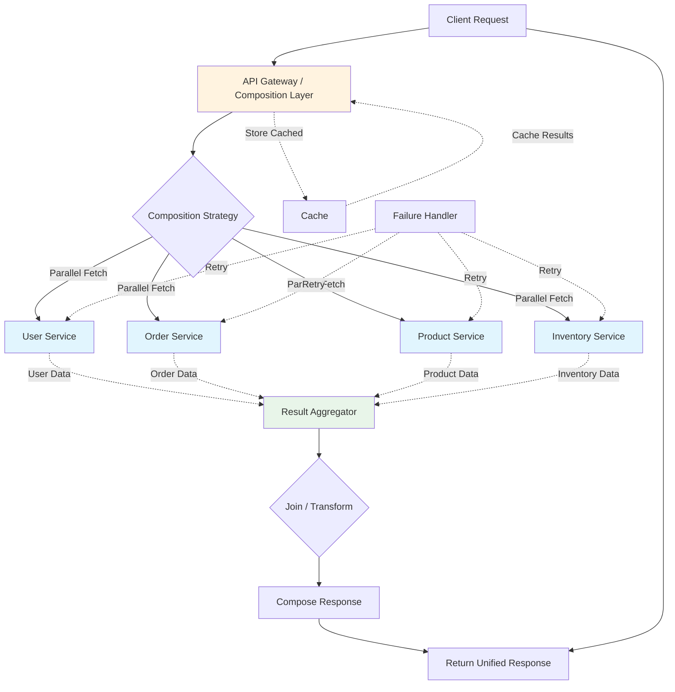

# API Composition

## Overview

API composition is a pattern that aggregates data from multiple service endpoints into a unified response for clients. Rather than requiring clients to make multiple requests and correlate results, the composition layer handles the complexity of gathering data from multiple backends, performing necessary joins or transformations, and returning a cohesive result. This pattern addresses the challenge of building APIs that span multiple microservices or external services while maintaining a simple interface for consumers.

The composition layer acts as an aggregator that accepts client requests and decomposes them into backend-specific calls. Each backend call is made in parallel when possible to minimize latency, and results are combined according to the composition strategy. Common strategies include concatenation (combining results), join (correlating related entities), and merge (combining overlapping fields). The composition logic must handle partial failures, deciding whether to return partial results or fail the entire request when some backends are unavailable.

This pattern is essential for building facades over microservices architectures. Each microservice owns its domain, but client applications often need data from multiple domains. Rather than having clients manage multiple API calls, the composition layer provides a unified API that abstracts backend complexity. This simplifies client development and enables backend services to evolve independently without impacting consumers. The composition layer can also aggregate responses from external APIs, providing a stable interface even when external services change their interfaces.

API composition supports various deployment patterns: as a standalone API gateway, as part of a GraphQL server, as a backend-for-frontend service, or embedded within API clients. GraphQL is particularly well-suited for composition as its query language naturally expresses the data requirements, and the GraphQL engine handles resolution across multiple sources. REST-based composition typically uses API gateways or dedicated aggregator services. The pattern often works in conjunction with data virtualization, using data virtualization to federate queries across databases while using API composition to aggregate service-level responses.

## Flow Chart



## Standard Example

### Java Implementation with Parallel API Calls

```java
import java.util.*;
import java.util.concurrent.*;
import java.util.stream.Collectors;

public class APICompositionExample {
    
    public static class CompletableFuture<T> {
        private T result;
        private Exception error;
        private boolean complete = false;
        
        public static <T> CompletableFuture<T> supplyAsync(Supplier<T> supplier) {
            CompletableFuture<T> future = new CompletableFuture<>();
            new Thread(() -> {
                try {
                    future.result = supplier.get();
                } catch (Exception e) {
                    future.error = e;
                }
                future.complete = true;
            }).start();
            return future;
        }
        
        public T join() {
            while (!complete) {
                try {
                    Thread.sleep(10);
                } catch (InterruptedException e) {
                    break;
                }
            }
            if (error != null) {
                throw new RuntimeException(error);
            }
            return result;
        }
        
        public boolean isDone() {
            return complete;
        }
    }
    
    @FunctionalInterface
    interface Supplier<T> {
        T get() throws Exception;
    }
    
    public static class APIClient {
        
        private final String baseUrl;
        private final HttpClient httpClient;
        
        public APIClient(String baseUrl) {
            this.baseUrl = baseUrl;
            this.httpClient = HttpClient.newBuilder()
                .connectTimeout(Duration.ofSeconds(30))
                .build();
        }
        
        public String get(String endpoint) {
            try {
                HttpRequest request = HttpRequest.newBuilder()
                    .uri(URI.create(baseUrl + endpoint))
                    .GET()
                    .build();
                
                HttpResponse<String> response = httpClient.send(request, 
                    HttpResponse.BodyHandlers.ofString());
                
                if (response.statusCode() >= 400) {
                    throw new APIException("API error: " + response.statusCode());
                }
                
                return response.body();
            } catch (Exception e) {
                throw new APIException("Request failed: " + e.getMessage(), e);
            }
        }
        
        public <T> T get(String endpoint, Class<T> responseType) {
            String body = get(endpoint);
            return new ObjectMapper().readValue(body, responseType);
        }
    }
    
    public static class APIException extends RuntimeException {
        public APIException(String message) {
            super(message);
        }
        
        public APIException(String message, Throwable cause) {
            super(message, cause);
        }
    }
    
    public static class User {
        public String id;
        public String name;
        public String email;
    }
    
    public static class Order {
        public String id;
        public String userId;
        public List<OrderItem> items;
        public double total;
        
        public static class OrderItem {
            public String productId;
            public int quantity;
            public double price;
        }
    }
    
    public static class Product {
        public String id;
        public String name;
        public double price;
    }
    
    public static class Inventory {
        public String productId;
        public int availableQuantity;
    }
    
    public static class UserOrderSummary {
        public String userId;
        public String userName;
        public String userEmail;
        public List<OrderDetail> orders;
        
        public static class OrderDetail {
            public String orderId;
            public List<ProductInfo> products;
            public double total;
            
            public static class ProductInfo {
                public String productId;
                public String productName;
                public int quantity;
                public double price;
                public int availableQuantity;
            }
        }
    }
    
    public static class UserOrderComposer {
        
        private final APIClient userClient;
        private final APIClient orderClient;
        private final APIClient productClient;
        private final APIClient inventoryClient;
        
        public UserOrderComposer() {
            this.userClient = new APIClient("http://user-service:8080/api");
            this.orderClient = new APIClient("http://order-service:8080/api");
            this.productClient = new APIClient("http://product-service:8080/api");
            this.inventoryClient = new APIClient("http://inventory-service:8080/api");
        }
        
        public UserOrderSummary getUserOrderSummary(String userId) {
            List<User> users = userClient.get("/users/" + userId, List.class);
            List<Order> orders = orderClient.get("/orders?userId=" + userId, List.class);
            
            User user = users.isEmpty() ? null : users.get(0);
            if (user == null) {
                throw new APIException("User not found: " + userId);
            }
            
            Set<String> productIds = orders.stream()
                .flatMap(o -> o.items.stream())
                .map(i -> i.productId)
                .collect(Collectors.toSet());
            
            Map<String, Product> productMap = fetchProducts(productIds);
            Map<String, Inventory> inventoryMap = fetchInventory(productIds);
            
            List<UserOrderSummary.OrderDetail> orderSummaries = orders.stream()
                .map(order -> {
                    UserOrderSummary.OrderDetail detail = new UserOrderSummary.OrderDetail();
                    detail.orderId = order.id;
                    detail.total = order.total;
                    
                    detail.products = order.items.stream()
                        .map(item -> {
                            UserOrderSummary.OrderDetail.ProductInfo info = 
                                new UserOrderSummary.OrderDetail.ProductInfo();
                            info.productId = item.productId;
                            info.quantity = item.quantity;
                            info.price = item.price;
                            
                            Product product = productMap.get(item.productId);
                            if (product != null) {
                                info.productName = product.name;
                            }
                            
                            Inventory inventory = inventoryMap.get(item.productId);
                            if (inventory != null) {
                                info.availableQuantity = inventory.availableQuantity;
                            }
                            
                            return info;
                        })
                        .collect(Collectors.toList());
                    
                    return detail;
                })
                .collect(Collectors.toList());
            
            UserOrderSummary summary = new UserOrderSummary();
            summary.userId = user.id;
            summary.userName = user.name;
            summary.userEmail = user.email;
            summary.orders = orderSummaries;
            
            return summary;
        }
        
        private Map<String, Product> fetchProducts(Set<String> productIds) {
            if (productIds.isEmpty()) {
                return Map.of();
            }
            
            String ids = String.join(",", productIds);
            List<Product> products = productClient.get("/products?ids=" + ids, List.class);
            
            return products.stream()
                .collect(Collectors.toMap(p -> p.id, p -> p));
        }
        
        private Map<String, Inventory> fetchInventory(Set<String> productIds) {
            if (productIds.isEmpty()) {
                return Map.of();
            }
            
            String ids = String.join(",", productIds);
            List<Inventory> inventories = inventoryClient.get(
                "/inventory?productIds=" + ids, List.class);
            
            return inventories.stream()
                .collect(Collectors.toMap(i -> i.productId, i -> i));
        }
    }
    
    public static class ParallelUserOrderComposer {
        
        private final APIClient userClient;
        private final APIClient orderClient;
        private final APIClient productClient;
        private final APIClient inventoryClient;
        
        public ParallelUserOrderComposer() {
            this.userClient = new APIClient("http://user-service:8080/api");
            this.orderClient = new APIClient("http://order-service:8080/api");
            this.productClient = new APIClient("http://product-service:8080/api");
            this.inventoryClient = new APIClient("http://inventory-service:8080/api");
        }
        
        public UserOrderSummary getUserOrderSummary(String userId) 
                throws InterruptedException {
            ExecutorService executor = Executors.newFixedThreadPool(4);
            
            CompletableFuture<User> userFuture = CompletableFuture.supplyAsync(
                () -> {
                    List<User> users = userClient.get("/users/" + userId, List.class);
                    return users.isEmpty() ? null : users.get(0);
                }
            );
            
            CompletableFuture<List<Order>> ordersFuture = CompletableFuture.supplyAsync(
                () -> orderClient.get("/orders?userId=" + userId, List.class)
            );
            
            User user = userFuture.join();
            List<Order> orders = ordersFuture.join();
            
            if (user == null) {
                throw new APIException("User not found: " + userId);
            }
            
            Set<String> productIds = orders.stream()
                .flatMap(o -> o.items.stream())
                .map(i -> i.productId)
                .collect(Collectors.toSet());
            
            CompletableFuture<Map<String, Product>> productsFuture = 
                CompletableFuture.supplyAsync(() -> fetchProducts(productIds));
            CompletableFuture<Map<String, Inventory>> inventoryFuture = 
                CompletableFuture.supplyAsync(() -> fetchInventory(productIds));
            
            Map<String, Product> productMap = productsFuture.join();
            Map<String, Inventory> inventoryMap = inventoryFuture.join();
            
            List<UserOrderSummary.OrderDetail> orderSummaries = orders.stream()
                .map(order -> composeOrderDetail(order, productMap, inventoryMap))
                .collect(Collectors.toList());
            
            executor.shutdown();
            
            UserOrderSummary summary = new UserOrderSummary();
            summary.userId = user.id;
            summary.userName = user.name;
            summary.userEmail = user.email;
            summary.orders = orderSummaries;
            
            return summary;
        }
        
        private Map<String, Product> fetchProducts(Set<String> productIds) {
            if (productIds.isEmpty()) {
                return Map.of();
            }
            String ids = String.join(",", productIds);
            List<Product> products = productClient.get("/products?ids=" + ids, List.class);
            return products.stream()
                .collect(Collectors.toMap(p -> p.id, p -> p));
        }
        
        private Map<String, Inventory> fetchInventory(Set<String> productIds) {
            if (productIds.isEmpty()) {
                return Map.of();
            }
            String ids = String.join(",", productIds);
            List<Inventory> inventories = inventoryClient.get(
                "/inventory?productIds=" + ids, List.class);
            return inventories.stream()
                .collect(Collectors.toMap(i -> i.productId, i -> i));
        }
        
        private UserOrderSummary.OrderDetail composeOrderDetail(
                Order order, 
                Map<String, Product> products,
                Map<String, Inventory> inventories) {
            UserOrderSummary.OrderDetail detail = new UserOrderSummary.OrderDetail();
            detail.orderId = order.id;
            detail.total = order.total;
            
            detail.products = order.items.stream()
                .map(item -> composeProductInfo(item, products, inventories))
                .collect(Collectors.toList());
            
            return detail;
        }
        
        private UserOrderSummary.OrderDetail.ProductInfo composeProductInfo(
                Order.OrderItem item,
                Map<String, Product> products,
                Map<String, Inventory> inventories) {
            UserOrderSummary.OrderDetail.ProductInfo info = 
                new UserOrderSummary.OrderDetail.ProductInfo();
            info.productId = item.productId;
            info.quantity = item.quantity;
            info.price = item.price;
            
            Product product = products.get(item.productId);
            if (product != null) {
                info.productName = product.name;
            }
            
            Inventory inventory = inventories.get(item.productId);
            if (inventory != null) {
                info.availableQuantity = inventory.availableQuantity;
            }
            
            return info;
        }
    }
    
    public static class CompositionResult<T> {
        private final T data;
        private final List<CompositionError> errors;
        
        public CompositionResult(T data, List<CompositionError> errors) {
            this.data = data;
            this.errors = errors;
        }
        
        public T getData() {
            return data;
        }
        
        public List<CompositionError> getErrors() {
            return errors;
        }
        
        public boolean hasErrors() {
            return !errors.isEmpty();
        }
    }
    
    public static class CompositionError {
        private final String service;
        private final String message;
        private final boolean recoverable;
        
        public CompositionError(String service, String message, 
                               boolean recoverable) {
            this.service = service;
            this.message = message;
            this.recoverable = recoverable;
        }
        
        public String getService() {
            return service;
        }
        
        public String getMessage() {
            return message;
        }
        
        public boolean isRecoverable() {
            return recoverable;
        }
    }
    
    public static class GracefulUserOrderComposer {
        
        public CompositionResult<UserOrderSummary> getUserOrderSummary(
                String userId, boolean partialFailureAllowed) {
            User user = null;
            List<Order> orders = List.of();
            Map<String, Product> products = Map.of();
            Map<String, Inventory> inventories = Map.of();
            List<CompositionError> errors = new ArrayList<>();
            
            try {
                List<User> users = fetchUser(userId);
                user = users.isEmpty() ? null : users.get(0);
            } catch (Exception e) {
                errors.add(new CompositionError("user-service", 
                    e.getMessage(), !partialFailureAllowed));
                if (!partialFailureAllowed && user == null) {
                    return new CompositionResult<>(null, errors);
                }
            }
            
            try {
                orders = fetchOrders(userId);
            } catch (Exception e) {
                errors.add(new CompositionError("order-service", 
                    e.getMessage(), true));
            }
            
            Set<String> productIds = extractProductIds(orders);
            
            try {
                products = fetchProducts(productIds);
            } catch (Exception e) {
                errors.add(new CompositionError("product-service", 
                    e.getMessage(), true));
            }
            
            try {
                inventories = fetchInventory(productIds);
            } catch (Exception e) {
                errors.add(new CompositionError("inventory-service", 
                    e.getMessage(), true));
            }
            
            if (user != null) {
                UserOrderSummary summary = composeSummary(user, orders, 
                    products, inventories);
                return new CompositionResult<>(summary, errors);
            }
            
            return new CompositionResult<>(null, errors);
        }
        
        private List<User> fetchUser(String userId) {
            return List.of();
        }
        
        private List<Order> fetchOrders(String userId) {
            return List.of();
        }
        
        private Set<String> extractProductIds(List<Order> orders) {
            return Set.of();
        }
        
        private Map<String, Product> fetchProducts(Set<String> productIds) {
            return Map.of();
        }
        
        private Map<String, Inventory> fetchInventory(Set<String> productIds) {
            return Map.of();
        }
        
        private UserOrderSummary composeSummary(User user, List<Order> orders,
                Map<String, Product> products, Map<String, Inventory> inventories) {
            return new UserOrderSummary();
        }
    }
    
    public static void main(String[] args) {
        UserOrderComposer composer = new UserOrderComposer();
        
        try {
            UserOrderSummary summary = composer.getUserOrderSummary("user-123");
            System.out.println("User: " + summary.userName);
            System.out.println("Orders: " + summary.orders.size());
        } catch (Exception e) {
            System.err.println("Error: " + e.getMessage());
        }
    }
}
```

### Spring Boot API Composition with WebClient

```java
import org.springframework.web.reactive.function.client.WebClient;
import org.springframework.stereotype.Service;
import reactor.core.publisher.Mono;
import reactor.core.publisher.Flux;
import reactor.util.function.Tuple2;
import reactor.util.function.Tuples;

import java.time.Duration;
import java.util.List;
import java.util.Map;
import java.util.stream.Collectors;

@Service
public class OrderAggregationService {
    
    private final WebClient userClient;
    private final WebClient orderClient;
    private final WebClient productClient;
    
    public OrderAggregationService() {
        this.userClient = WebClient.builder()
            .baseUrl("http://user-service:8080/api")
            .build();
        
        this.orderClient = WebClient.builder()
            .baseUrl("http://order-service:8080/api")
            .build();
        
        this.productClient = WebClient.builder()
            .baseUrl("http://product-service:8080/api")
            .build();
    }
    
    public Mono<UserOrderResponse> aggregateUserOrders(String userId) {
        Mono<UserDTO> userMono = fetchUser(userId);
        Mono<List<OrderDTO>> ordersMono = fetchOrders(userId);
        
        return Mono.zip(userMono, ordersMono)
            .flatMap(tuple -> {
                UserDTO user = tuple.getT1();
                List<OrderDTO> orders = tuple.getT2();
                
                if (user == null) {
                    return Mono.error(new ApiCompositionException(
                        "User not found: " + userId));
                }
                
                List<String> productIds = orders.stream()
                    .flatMap(o -> o.getItems().stream())
                    .map(OrderItemDTO::getProductId)
                    .distinct()
                    .collect(Collectors.toList());
                
                return fetchProductDetails(productIds)
                    .map(products -> composeResponse(user, orders, products));
            });
    }
    
    private Mono<UserDTO> fetchUser(String userId) {
        return userClient.get()
            .uri("/users/{userId}", userId)
            .retrieve()
            .bodyToMono(UserDTO.class)
            .timeout(Duration.ofSeconds(5))
            .onErrorResume(Exception.class, e -> Mono.empty());
    }
    
    private Mono<List<OrderDTO>> fetchOrders(String userId) {
        return orderClient.get()
            .uri(uriBuilder -> uriBuilder
                .path("/orders")
                .queryParam("userId", userId)
                .build())
            .retrieve()
            .bodyToMono(new org.springframework.core.ParameterizedTypeReference<List<OrderDTO>>() {})
            .timeout(Duration.ofSeconds(5))
            .onErrorResume(Exception.class, e -> Mono.just(List.of()));
    }
    
    private Mono<Map<String, ProductDTO>> fetchProductDetails(List<String> productIds) {
        if (productIds.isEmpty()) {
            return Mono.just(Map.of());
        }
        
        String ids = String.join(",", productIds);
        
        return productClient.get()
            .uri(uriBuilder -> uriBuilder
                .path("/products/batch")
                .queryParam("ids", ids)
                .build())
            .retrieve()
            .bodyToMono(new org.springframework.core.ParameterizedTypeReference<List<ProductDTO>>() {})
            .map(list -> list.stream()
                .collect(Collectors.toMap(ProductDTO::getId, p -> p)))
            .timeout(Duration.ofSeconds(5))
            .onErrorResume(Exception.class, e -> Mono.just(Map.of()));
    }
    
    private UserOrderResponse composeResponse(UserDTO user, List<OrderDTO> orders,
            Map<String, ProductDTO> products) {
        UserOrderResponse response = new UserOrderResponse();
        response.setUserId(user.getId());
        response.setUserName(user.getName());
        response.setEmail(user.getEmail());
        
        List<OrderResponse> orderResponses = orders.stream()
            .map(order -> {
                OrderResponse orderResponse = new OrderResponse();
                orderResponse.setOrderId(order.getId());
                orderResponse.setTotal(order.getTotal());
                
                List<ProductInfo> productInfos = order.getItems().stream()
                    .map(item -> {
                        ProductInfo info = new ProductInfo();
                        info.setProductId(item.getProductId());
                        info.setQuantity(item.getQuantity());
                        info.setPrice(item.getPrice());
                        
                        ProductDTO product = products.get(item.getProductId());
                        if (product != null) {
                            info.setProductName(product.getName());
                        }
                        
                        return info;
                    })
                    .collect(Collectors.toList());
                
                orderResponse.setProducts(productInfos);
                return orderResponse;
            })
            .collect(Collectors.toList());
        
        response.setOrders(orderResponses);
        return response;
    }
    
    @Service
    public static class ProductService {
        
        public Mono<List<ProductDTO>> getProductsInParallel(List<String> ids) {
            List<Mono<ProductDTO>> requests = ids.stream()
                .map(this::fetchProduct)
                .collect(Collectors.toList());
            
            return Mono.zip(requests, values -> {
                List<ProductDTO> results = new ArrayList<>();
                for (Object value : values) {
                    if (value instanceof ProductDTO) {
                        results.add((ProductDTO) value);
                    }
                }
                return results;
            });
        }
        
        private Mono<ProductDTO> fetchProduct(String productId) {
            return WebClient.builder()
                .baseUrl("http://product-service:8080/api")
                .build()
                .get()
                .uri("/products/{productId}", productId)
                .retrieve()
                .bodyToMono(ProductDTO.class);
        }
    }
}
```

## Real-World Examples

### Amazon

Amazon uses API composition extensively in their e-commerce platform. When a customer views a product page, the composition layer aggregates data from numerous services: product catalog service provides item details, pricing service shows current prices and discounts, inventory service indicates availability, review service displays customer reviews, seller service shows seller information, and recommendation service provides related products. Rather than having the web application make dozens of individual API calls, Amazon's API composition layer fetches data from all required services in parallel and composes a unified product page response. This approach enables Amazon to maintain their micro-service architecture while delivering responsive product pages that combine information from dozens of backend systems.

### Uber

Uber employs API composition to build their rider application experiences. When a rider requests a ride, the composition layer aggregates data from mapping services for pickup locations, pricing services for fare estimates, driver location services for nearest available drivers, surge pricing services for current pricing multipliers, and ETA services for predicted pickup times. The unified API response enables the rider application to display all relevant information in a single screen without requiring multiple API calls that would introduce latency. Uber's composition layer also handles the complexity of rider and driver matching, combining data from multiple services to present the optimal rides to riders and requests to drivers.

## Output Statement

API composition aggregates data from multiple service endpoints into unified API responses, simplifying client development and enabling microservices architectures. The composition layer handles parallel backend calls, joins correlated data, and manages partial failures. Parallel execution of independent backend calls minimizes latency, while appropriate caching reduces backend load. Composition strategies should match the data requirements: concatenation for lists from different sources, joins for related entities, and merges for overlapping fields. Handle partial failures gracefully by defining which backend failures are fatal versus recoverable. This pattern enables backend services to evolve independently while providing stable, unified interfaces to clients.

## Best Practices

1. **Execute Independent Calls in Parallel**: When backend calls have no dependencies, execute them simultaneously rather than sequentially to minimize latency. Use thread pools or async frameworks to manage parallel execution efficiently.

2. **Define Failure Strategies**: Explicitly define how to handle failures for each backend. Distinguish between fatal failures (required data) and recoverable failures (supplementary data). Consider returning partial results when appropriate.

3. **Implement Caching**: Cache responses from stable backends to reduce latency and backend load. Use cache headers to respect source caching directives. Implement cache invalidation for data that changes frequently.

4. **Use Appropriate Data Structures**: Design composition responses that match client requirements. Consider GraphQL or similar flexible query languages that allow clients to specify exactly what data they need.

5. **Handle Data Consistency**: When composing related data, consider consistency requirements. Use appropriate join strategies and document staleness expectations for combined data from sources with different update frequencies.

6. **Implement Circuit Breakers**: Protect backend services from cascade failures when they become unavailable. Track failure rates and temporarily stop calling failing services.

7. **Monitor Composition Performance**: Track overall request latency and identify slow backend calls. Set performance baselines and alert on degradation to identify optimization opportunities.

8. **Design for Scale**: Implement rate limiting to protect backend services from composition layer overload. Use multiple composition instances to handle load and distribute requests appropriately.