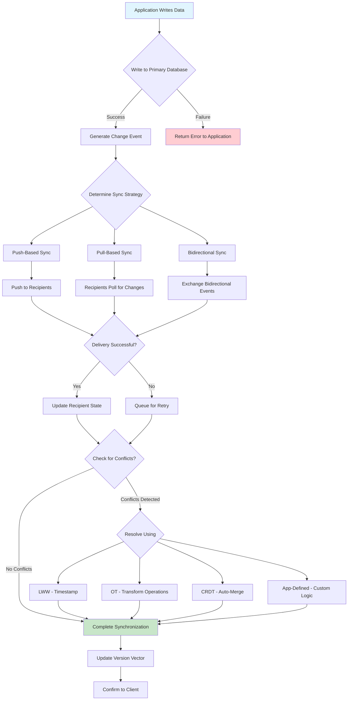

# Data Synchronization

## Overview

Data synchronization is a critical pattern in distributed systems that ensures data consistency across multiple databases, services, or nodes. In microservices architectures, where each service typically maintains its own data store, keeping data consistent across the system becomes a significant challenge. Data synchronization addresses this challenge by defining strategies and mechanisms for propagating changes, resolving conflicts, and maintaining coherence across distributed data sources.

The fundamental need for data synchronization arises from several factors in distributed systems. First, data is often replicated across multiple nodes for performance and availability - caches, read replicas, and geographically distributed databases all contain copies of the same data. Second, different services may hold related but not identical data - a customer service may have customer information while an order service has order history, and these must be kept consistent. Third, offline and mobile scenarios require synchronization between local data stores and central servers. Fourth, integration with external systems requires bidirectional data exchange that must remain consistent.

Understanding data synchronization requires examining several key dimensions. Consistency models define the guarantees provided during synchronization - from strong consistency where all reads see the most recent writes, to eventual consistency where writes propagate over time with temporary inconsistencies allowed. Latency requirements determine how quickly changes must propagate - some systems require real-time synchronization while others can tolerate minutes or hours of delay. Conflict resolution strategies define how to handle concurrent modifications to the same data in different locations. Network reliability considerations affect how synchronization handles network partitions and temporary disconnections.

Data synchronization patterns can be categorized in several ways. Push-based synchronization involves a source actively propagating changes to recipients, suitable when the source knows what has changed. Pull-based synchronization involves recipients periodically checking for changes, suitable when recipients need autonomy. Bidirectional synchronization allows changes to originate from multiple sources and propagates in both directions, creating the most complex scenarios. Hybrid approaches combine push and pull based on system requirements.

### Consistency Models

Strong consistency ensures that all reads after a write completes see the value written by that write. This model provides the simplest programming model for developers but requires coordination between nodes, which introduces latency and can reduce availability during network partitions. Systems using strong consistency include traditional relational databases and distributed systems like Google's Spanner.

Eventual consistency guarantees that if no new updates are made to a piece of data, eventually all replicas will return the last updated value. This model provides high availability and low latency but requires applications to handle temporary inconsistencies. Amazon's shopping cart is a famous example - items added to a cart may temporarily not appear to other devices but will eventually synchronize.

Causal consistency preserves the causal relationship between operations. If operation A causes operation B, then B must see the effects of A. Operations without causal relationship may be seen in different orders by different nodes. This model provides a good balance between consistency and performance for many applications.

Read-your-writes consistency guarantees that after a client writes a value, it will always read that value or a newer value in subsequent reads from the same node. This is important for user experience - after submitting a form, the user should see their submission. This model is often implemented using session tokens or version numbers.

Monotonic reads guarantees that the sequence of reads by a client will only see increasingly recent values. This prevents the confusing experience of seeing older data after having seen newer data. This is typically implemented using version vectors or timestamps.

### Synchronization Strategies

Change Data Capture (CDC) involves monitoring a database's transaction log or change stream to identify modifications and propagate them to other systems. This approach has minimal impact on the source database and provides reliable detection of all changes. Debezium is a popular open-source CDC platform that captures changes from various databases.

Event Sourcing stores all changes as an immutable sequence of events, rather than storing current state. This provides a complete audit trail and enables powerful synchronization scenarios where events can be replayed to reconstruct state or synchronize other systems. Event sourcing is often combined with CQRS (Command Query Responsibility Segregation) for complex synchronization scenarios.

Tombstone-based deletion marks records as deleted without immediately removing them, allowing synchronization systems to propagate deletions reliably. This is essential because deleted records must be synchronized to other nodes - simply not propagating a deletion would leave orphaned records.

Version vectors track the state of synchronization across multiple nodes, enabling detection of conflicts and ensuring all changes are propagated. Each node maintains a vector of version numbers from all other nodes, allowing it to determine what changes it has and hasn't received.

### Conflict Resolution Strategies

Last-Writer-Wins (LWW) is the simplest conflict resolution strategy - the most recent write, as determined by timestamp or version number, wins. This is efficient and easy to implement but can lead to data loss in some scenarios. LWW is appropriate when data loss is acceptable or when conflicts are rare.

Operational Transformation (OT) resolves conflicts by transforming concurrent operations into equivalent operations that can be applied in any order. This is used in collaborative applications like Google Docs. OT is complex to implement correctly but provides a good user experience in collaborative editing.

Conflict-Free Replicated Data Types (CRDTs) are data structures designed to be merged automatically without conflicts. Operations are designed to be commutative, associative, and idempotent, allowing them to be applied in any order. Counters, sets, and registers have well-known CRDT implementations.

Application-defined resolution delegates conflict resolution to application logic, which understands the meaning of the data and can make appropriate decisions. This is the most flexible approach but requires explicit handling of conflicts in application code.

## Flow Chart



## Standard Example

```python
"""
Data Synchronization Implementation in Python

This example demonstrates multiple synchronization strategies including
push-based sync, pull-based sync, and conflict resolution using
last-writer-wins and CRDT-based merging.
"""

import time
import uuid
from abc import ABC, abstractmethod
from dataclasses import dataclass, field
from typing import Dict, List, Optional, Set
from datetime import datetime
import threading
import json


@dataclass
class VersionVector:
    """Tracks the version of data at each node for conflict detection."""
    versions: Dict[str, int] = field(default_factory=dict)
    
    def increment(self, node_id: str) -> None:
        """Increment version for a specific node."""
        self.versions[node_id] = self.versions.get(node_id, 0) + 1
    
    def get(self, node_id: str) -> int:
        """Get version for a specific node."""
        return self.versions.get(node_id, 0)
    
    def merge(self, other: 'VersionVector') -> 'VersionVector':
        """Merge with another version vector, taking max of each."""
        merged = VersionVector()
        all_nodes = set(self.versions.keys()) | set(other.versions.keys())
        for node in all_nodes:
            merged.versions[node] = max(
                self.versions.get(node, 0),
                other.versions.get(node, 0)
            )
        return merged
    
    def is_concurrent_with(self, other: 'VersionVector') -> bool:
        """Check if two version vectors represent concurrent updates."""
        self_newer = any(
            self.versions.get(n, 0) > other.versions.get(n, 0)
            for n in set(self.versions.keys()) | set(other.versions.keys())
        )
        other_newer = any(
            other.versions.get(n, 0) > self.versions.get(n, 0)
            for n in set(self.versions.keys()) | set(self.versions.keys())
        )
        return self_newer and other_newer


@dataclass
class SyncRecord:
    """Represents a synchronized data record."""
    key: str
    value: any
    version_vector: VersionVector
    timestamp: float
    deleted: bool = False
    node_id: str = ""
    
    def is_tombstone(self) -> bool:
        """Check if this is a deletion marker."""
        return self.deleted


class DataNode(ABC):
    """Abstract base class for a data node in the synchronization system."""
    
    @abstractmethod
    def read(self, key: str) -> Optional[SyncRecord]:
        """Read a record from this node."""
        pass
    
    @abstractmethod
    def write(self, record: SyncRecord) -> bool:
        """Write a record to this node."""
        pass
    
    @abstractmethod
    def get_changes_since(self, version_vector: VersionVector) -> List[SyncRecord]:
        """Get all changes since a given version."""
        pass


class InMemoryDataNode(DataNode):
    """In-memory implementation of a data node for demonstration."""
    
    def __init__(self, node_id: str):
        self.node_id = node_id
        self.store: Dict[str, SyncRecord] = {}
        self.lock = threading.RLock()
        self.global_version = VersionVector()
    
    def read(self, key: str) -> Optional[SyncRecord]:
        with self.lock:
            return self.store.get(key)
    
    def write(self, record: SyncRecord) -> bool:
        with self.lock:
            self.global_version.increment(record.node_id)
            record.version_vector = self.global_version
            self.store[record.key] = record
            return True
    
    def get_changes_since(self, version_vector: VersionVector) -> List[SyncRecord]:
        with self.lock:
            changes = []
            for record in self.store.values():
                for node_id, version in version_vector.versions.items():
                    if record.version_vector.get(node_id) > version:
                        changes.append(record)
                        break
            return changes
    
    def delete(self, key: str, node_id: str) -> bool:
        """Mark a record as deleted (tombstone)."""
        with self.lock:
            if key in self.store:
                self.global_version.increment(node_id)
                tombstone = SyncRecord(
                    key=key,
                    value=None,
                    version_vector=VersionVector(
                        versions={node_id: self.global_version.get(node_id)}
                    ),
                    timestamp=time.time(),
                    deleted=True,
                    node_id=node_id
                )
                self.store[key] = tombstone
                return True
            return False


class GCounter(CRDT):
    """
    Grow-only Counter CRDT implementation.
    
    This CRDT allows increments but never decrements,
    making it safe for distributed counting scenarios
    like social media likes or page views.
    """
    
    def __init__(self):
        self.counts: Dict[str, int] = {}
    
    def increment(self, node_id: str) -> None:
        """Increment counter for a specific node."""
        self.counts[node_id] = self.counts.get(node_id, 0) + 1
    
    def merge(self, other: 'GCounter') -> None:
        """Merge with another counter, taking max for each node."""
        for node_id, count in other.counts.items():
            self.counts[node_id] = max(
                self.counts.get(node_id, 0),
                count
            )
    
    def value(self) -> int:
        """Get total counter value."""
        return sum(self.counts.values())
    
    def to_json(self) -> str:
        """Serialize to JSON."""
        return json.dumps(self.counts)
    
    @classmethod
    def from_json(cls, data: str) -> 'GCounter':
        """Deserialize from JSON."""
        counter = cls()
        counter.counts = json.loads(data)
        return counter


class LWWRegister:
    """
    Last-Writer-Wins Register.
    
    Uses timestamps to resolve conflicts,
    with the most recent write winning.
    """
    
    def __init__(self):
        self.value: any = None
        self.timestamp: float = 0.0
        self.node_id: str = ""
    
    def set(self, value: any, timestamp: float, node_id: str) -> None:
        """Set value if timestamp is more recent."""
        if timestamp >= self.timestamp:
            self.value = value
            self.timestamp = timestamp
            self.node_id = node_id
    
    def merge(self, other: 'LWWRegister') -> None:
        """Merge with another register, keeping most recent."""
        if other.timestamp > self.timestamp:
            self.value = other.value
            self.timestamp = other.timestamp
            self.node_id = other.node_id
    
    def get(self) -> any:
        """Get current value."""
        return self.value


class SynchronizationManager:
    """Manages data synchronization between multiple nodes."""
    
    def __init__(self, nodes: List[DataNode], strategy: str = "push"):
        self.nodes = {node.node_id: node for node in nodes}
        self.strategy = strategy
        self.change_queue: List[tuple] = []
        
    def write(self, node_id: str, key: str, value: any) -> bool:
        """Write data to a node and synchronize."""
        source_node = self.nodes.get(node_id)
        if not source_node:
            return False
        
        record = SyncRecord(
            key=key,
            value=value,
            version_vector=VersionVector(),
            timestamp=time.time(),
            node_id=node_id
        )
        
        source_node.write(record)
        
        if self.strategy == "push":
            self._push_synchronize(node_id, key)
        elif self.strategy == "pull":
            self._pull_synchronize(key)
        elif self.strategy == "bidirectional":
            self._bidirectional_sync(key)
        
        return True
    
    def _push_synchronize(self, source_id: str, key: str) -> None:
        """Push-based synchronization: source pushes to all recipients."""
        source_node = self.nodes[source_id]
        record = source_node.read(key)
        
        for node_id, node in self.nodes.items():
            if node_id != source_id:
                node.write(record)
    
    def _pull_synchronize(self, key: str) -> None:
        """Pull-based synchronization: recipients request changes."""
        latest_record = None
        latest_timestamp = 0
        
        for node in self.nodes.values():
            record = node.read(key)
            if record and record.timestamp > latest_timestamp:
                latest_record = record
                latest_timestamp = record.timestamp
        
        if latest_record:
            for node in self.nodes.values():
                existing = node.read(key)
                if not existing or existing.timestamp < latest_record.timestamp:
                    node.write(latest_record)
    
    def _bidirectional_sync(self, key: str) -> None:
        """Bidirectional synchronization between all nodes."""
        all_records = []
        
        for node in self.nodes.values():
            record = node.read(key)
            if record:
                all_records.append(record)
        
        if not all_records:
            return
        
        resolved = self._resolve_conflicts(all_records)
        
        for node in self.nodes.values():
            node.write(resolved)
    
    def _resolve_conflicts(self, records: List[SyncRecord]) -> SyncRecord:
        """Resolve conflicts using last-writer-wins."""
        if len(records) <= 1:
            return records[0]
        
        latest = records[0]
        for record in records[1:]:
            if record.timestamp > latest.timestamp:
                latest = record
        
        return latest
    
    def read(self, key: str, node_id: Optional[str] = None) -> Optional[SyncRecord]:
        """Read data from a specific node or any node."""
        if node_id:
            node = self.nodes.get(node_id)
            return node.read(key) if node else None
        
        for node in self.nodes.values():
            record = node.read(key)
            if record:
                return record
        
        return None


class EventLogSynchronization:
    """
    Event log-based synchronization pattern.
    
    Maintains an immutable log of all changes,
    enabling reliable synchronization and replay.
    """
    
    def __init__(self, node_id: str):
        self.node_id = node_id
        self.event_log: List[SyncRecord] = []
        self.lock = threading.Lock()
    
    def append_event(self, key: str, value: any, deleted: bool = False) -> None:
        """Append an event to the log."""
        with self.lock:
            record = SyncRecord(
                key=key,
                value=value,
                version_vector=VersionVector(
                    versions={self.node_id: len(self.event_log)}
                ),
                timestamp=time.time(),
                deleted=deleted,
                node_id=self.node_id
            )
            self.event_log.append(record)
    
    def get_events_since(self, position: int) -> List[SyncRecord]:
        """Get events since a given position."""
        with self.lock:
            return self.event_log[position:]
    
    def replay_events(self, target_node: DataNode) -> None:
        """Replay all events to a target node."""
        with self.lock:
            for event in self.event_log:
                target_node.write(event)


def demonstrate_synchronization():
    """Demonstrate the data synchronization patterns."""
    
    print("=" * 60)
    print("DATA SYNCHRONIZATION DEMONSTRATION")
    print("=" * 60)
    
    # Create multiple data nodes representing different services
    node_a = InMemoryDataNode("node-a")
    node_b = InMemoryDataNode("node-b")
    node_c = InMemoryDataNode("node-c")
    
    nodes = [node_a, node_b, node_c]
    
    # Create synchronization manager with push strategy
    sync_manager = SynchronizationManager(nodes, strategy="push")
    
    print("\n--- Push-Based Synchronization ---")
    
    # Write to node A
    sync_manager.write("node-a", "customer:123", {
        "name": "John Doe",
        "email": "john@example.com",
        "status": "active"
    })
    
    print(f"Written to node-a: customer:123 = John Doe")
    print(f"Read from node-b: {sync_manager.read('customer:123', 'node-b')}")
    print(f"Read from node-c: {sync_manager.read('customer:123', 'node-c')}")
    
    print("\n--- CRDT Counter Example ---")
    
    # Demonstrate GCounter CRDT
    counter = GCounter()
    counter.increment("node-a")
    counter.increment("node-a")
    counter.increment("node-b")
    
    print(f"Counter after increments: {counter.value()}")
    
    # Merge from another node
    counter2 = GCounter()
    counter2.increment("node-b")
    counter2.increment("node-c")
    counter2.increment("node-c")
    counter2.increment("node-c")
    
    counter.merge(counter2)
    
    print(f"Counter after merge: {counter.value()}")
    
    print("\n--- LWW Register Example ---")
    
    # Demonstrate LWW Register
    register = LWWRegister()
    
    register.set("Alice", 1000.0, "node-a")
    print(f"After node-a writes 'Alice': {register.get()}")
    
    register.set("Bob", 2000.0, "node-b")
    print(f"After node-b writes 'Bob': {register.get()}")
    
    # Merge with conflicting register
    other = LWWRegister()
    other.set("Charlie", 1500.0, "node-c")
    register.merge(other)
    
    print(f"After merging with 'Charlie' (older): {register.get()}")
    
    print("\n--- Event Log Synchronization ---")
    
    # Demonstrate event log-based sync
    event_log = EventLogSynchronization("node-a")
    
    event_log.append_event("order:001", {"status": "created"})
    event_log.append_event("order:001", {"status": "paid"})
    event_log.append_event("order:001", {"status": "shipped"})
    event_log.append_event("order:001", {"status": "delivered"}, deleted=True)
    
    print(f"Total events logged: {len(event_log.event_log)}")
    
    events_since_1 = event_log.get_events_since(1)
    print(f"Events since position 1: {len(events_since_1)}")
    
    for i, event in enumerate(event_log.event_log[:3]):
        print(f"  Event {i}: {event.key} = {event.value}")
    
    print("\n" + "=" * 60)
    print("DEMONSTRATION COMPLETE")
    print("=" * 60)


if __name__ == "__main__":
    demonstrate_synchronization()
```

```java
import java.util.*;
import java.util.concurrent.*;
import java.time.*;

/**
 * Data Synchronization Implementation in Java
 * 
 * Demonstrates push-based, pull-based, and bidirectional
 * synchronization with conflict resolution strategies.
 */

// Version vector implementation for tracking distributed state
class VersionVectorImpl {
    private final Map<String, Long> versions = new ConcurrentHashMap<>();
    private final Map<String, Long> timestamps = new ConcurrentHashMap<>();
    
    public void increment(String nodeId) {
        versions.merge(nodeId, 1L, Long::sum);
        timestamps.put(nodeId, System.currentTimeMillis());
    }
    
    public Long get(String nodeId) {
        return versions.getOrDefault(nodeId, 0L);
    }
    
    public void merge(VersionVectorImpl other) {
        other.versions.forEach((nodeId, version) -> {
            versions.merge(nodeId, version, Math::max);
        });
    }
    
    public boolean isNewerThan(VersionVectorImpl other) {
        for (Map.Entry<String, Long> entry : versions.entrySet()) {
            String nodeId = entry.getKey();
            Long thisVersion = entry.getValue();
            Long otherVersion = other.versions.getOrDefault(nodeId, 0L);
            if (thisVersion > otherVersion) {
                return true;
            }
        }
        return false;
    }
    
    @Override
    public String toString() {
        return versions.toString();
    }
}

// Generic sync record with version tracking
class SyncRecord<T> {
    private final String key;
    private final T value;
    private final VersionVectorImpl versionVector;
    private final long timestamp;
    private final boolean deleted;
    private final String nodeId;
    
    public SyncRecord(String key, T value, String nodeId) {
        this.key = key;
        this.value = value;
        this.nodeId = nodeId;
        this.versionVector = new VersionVectorImpl();
        this.versionVector.increment(nodeId);
        this.timestamp = System.currentTimeMillis();
        this.deleted = false;
    }
    
    private SyncRecord(String key, T value, String nodeId, 
                       VersionVectorImpl versionVector, long timestamp, boolean deleted) {
        this.key = key;
        this.value = value;
        this.nodeId = nodeId;
        this.versionVector = versionVector;
        this.timestamp = timestamp;
        this.deleted = deleted;
    }
    
    public static <T> SyncRecord<T> deleted(String key, String nodeId) {
        return new SyncRecord<>(key, null, nodeId, 
                                 new VersionVectorImpl(), System.currentTimeMillis(), true);
    }
    
    // Getters
    public String getKey() { return key; }
    public T getValue() { return value; }
    public VersionVectorImpl getVersionVector() { return versionVector; }
    public long getTimestamp() { return timestamp; }
    public boolean isDeleted() { return deleted; }
    public String getNodeId() { return nodeId; }
    
    public SyncRecord<T> withValue(T newValue) {
        return new SyncRecord<>(key, newValue, nodeId, versionVector, timestamp, deleted);
    }
}

// Abstract data node interface
interface DataNode<T> {
    String getNodeId();
    Optional<SyncRecord<T>> read(String key);
    boolean write(SyncRecord<T> record);
    List<SyncRecord<T>> getChangesSince(VersionVectorImpl version);
}

// In-memory implementation of a data node
class InMemoryNode<T> implements DataNode<T> {
    private final String nodeId;
    private final Map<String, SyncRecord<T>> store = new ConcurrentHashMap<>();
    private final VersionVectorImpl globalVersion = new VersionVectorImpl();
    
    public InMemoryNode(String nodeId) {
        this.nodeId = nodeId;
    }
    
    @Override
    public String getNodeId() { return nodeId; }
    
    @Override
    public Optional<SyncRecord<T>> read(String key) {
        return Optional.ofNullable(store.get(key))
            .filter(record -> !record.isDeleted());
    }
    
    @Override
    public boolean write(SyncRecord<T> record) {
        globalVersion.increment(record.getNodeId());
        store.put(record.getKey(), record);
        return true;
    }
    
    @Override
    public List<SyncRecord<T>> getChangesSince(VersionVectorImpl version) {
        List<SyncRecord<T>> changes = new ArrayList<>();
        for (SyncRecord<T> record : store.values()) {
            if (record.getVersionVector().isNewerThan(version)) {
                changes.add(record);
            }
        }
        return changes;
    }
}

// Conflict resolution strategies
interface ConflictResolver<T> {
    SyncRecord<T> resolve(List<SyncRecord<T>> records);
}

// Last-Writer-Wins conflict resolver
class LastWriterWinsResolver<T> implements ConflictResolver<T> {
    @Override
    public SyncRecord<T> resolve(List<SyncRecord<T>> records) {
        if (records.isEmpty()) {
            throw new IllegalArgumentException("No records to resolve");
        }
        
        SyncRecord<T> latest = records.get(0);
        for (SyncRecord<T> record : records.subList(1, records.size())) {
            if (record.getTimestamp() > latest.getTimestamp()) {
                latest = record;
            }
        }
        return latest;
    }
}

// Synchronization strategies
enum SyncStrategy {
    PUSH,      // Source pushes to all recipients
    PULL,      // Recipients poll for changes
    BIDIRECTIONAL  // All nodes exchange changes
}

// Synchronization manager coordinating multiple nodes
class SyncManager<T> {
    private final Map<String, DataNode<T>> nodes = new ConcurrentHashMap<>();
    private final SyncStrategy strategy;
    private final ConflictResolver<T> conflictResolver;
    private final ExecutorService executor = Executors.newFixedThreadPool(4);
    
    public SyncManager(SyncStrategy strategy, ConflictResolver<T> conflictResolver) {
        this.strategy = strategy;
        this.conflictResolver = conflictResolver;
    }
    
    public void addNode(DataNode<T> node) {
        nodes.put(node.getNodeId(), node);
    }
    
    public boolean write(String nodeId, String key, T value) {
        DataNode<T> source = nodes.get(nodeId);
        if (source == null) {
            return false;
        }
        
        SyncRecord<T> record = new SyncRecord<>(key, value, nodeId);
        source.write(record);
        
        switch (strategy) {
            case PUSH:
                pushSync(nodeId, key);
                break;
            case PULL:
                pullSync(key);
                break;
            case BIDIRECTIONAL:
                bidirectionalSync(key);
                break;
        }
        
        return true;
    }
    
    private void pushSync(String sourceId, String key) {
        DataNode<T> source = nodes.get(sourceId);
        Optional<SyncRecord<T>> recordOpt = source.read(key);
        
        if (recordOpt.isPresent()) {
            SyncRecord<T> record = recordOpt.get();
            for (DataNode<T> node : nodes.values()) {
                if (!node.getNodeId().equals(sourceId)) {
                    node.write(record);
                }
            }
        }
    }
    
    private void pullSync(String key) {
        SyncRecord<T> latest = null;
        long latestTimestamp = 0;
        
        for (DataNode<T> node : nodes.values()) {
            Optional<SyncRecord<T>> recordOpt = node.read(key);
            if (recordOpt.isPresent()) {
                SyncRecord<T> record = recordOpt.get();
                if (record.getTimestamp() > latestTimestamp) {
                    latest = record;
                    latestTimestamp = record.getTimestamp();
                }
            }
        }
        
        if (latest != null) {
            for (DataNode<T> node : nodes.values()) {
                Optional<SyncRecord<T>> existing = node.read(key);
                if (!existing.isPresent() || 
                    existing.get().getTimestamp() < latest.getTimestamp()) {
                    node.write(latest);
                }
            }
        }
    }
    
    private void bidirectionalSync(String key) {
        List<SyncRecord<T>> allRecords = new ArrayList<>();
        
        for (DataNode<T> node : nodes.values()) {
            node.read(key).ifPresent(allRecords::add);
        }
        
        if (!allRecords.isEmpty()) {
            SyncRecord<T> resolved = conflictResolver.resolve(allRecords);
            for (DataNode<T> node : nodes.values()) {
                node.write(resolved);
            }
        }
    }
    
    public Optional<SyncRecord<T>> read(String key, String nodeId) {
        if (nodeId != null) {
            return nodes.get(nodeId).read(key);
        }
        
        for (DataNode<T> node : nodes.values()) {
            Optional<SyncRecord<T>> record = node.read(key);
            if (record.isPresent()) {
                return record;
            }
        }
        return Optional.empty();
    }
    
    public void shutdown() {
        executor.shutdown();
    }
}

// Event-driven synchronization with message passing
class EventDrivenSync<T> {
    private final String nodeId;
    private final Queue<SyncRecord<T>> eventQueue = new ConcurrentLinkedQueue<>();
    private final Map<String, DataNode<T>> peers = new ConcurrentHashMap<>();
    private final ExecutorService executor = Executors.newSingleThreadExecutor();
    
    public EventDrivenSync(String nodeId) {
        this.nodeId = nodeId;
    }
    
    public void registerPeer(String peerId, DataNode<T> peerNode) {
        peers.put(peerId, peerNode);
    }
    
    public void publishChange(SyncRecord<T> record) {
        eventQueue.offer(record);
        notifyPeers();
    }
    
    private void notifyPeers() {
        for (DataNode<T> peer : peers.values()) {
            List<SyncRecord<T>> events = new ArrayList<>(eventQueue);
            for (SyncRecord<T> event : events) {
                peer.write(event);
            }
        }
        eventQueue.clear();
    }
    
    public void shutdown() {
        executor.shutdown();
    }
}

// Main demonstration class
public class DataSynchronizationExample {
    public static void main(String[] args) {
        System.out.println("=".repeat(60));
        System.out.println("DATA SYNCHRONIZATION DEMONSTRATION");
        System.out.println("=".repeat(60));
        
        // Create customer data class
        class Customer {
            public String name;
            public String email;
            public String status;
            
            public Customer(String name, String email, String status) {
                this.name = name;
                this.email = email;
                this.status = status;
            }
            
            @Override
            public String toString() {
                return String.format("Customer{name=%s, email=%s, status=%s}", 
                                   name, email, status);
            }
        }
        
        // Create data nodes
        InMemoryNode<Customer> nodeA = new InMemoryNode<>("node-a");
        InMemoryNode<Customer> nodeB = new InMemoryNode<>("node-b");
        InMemoryNode<Customer> nodeC = new InMemoryNode<>("node-c");
        
        // Test push-based synchronization
        System.out.println("\n--- Push-Based Synchronization ---");
        SyncManager<Customer> pushManager = new SyncManager<>(
            SyncStrategy.PUSH, 
            new LastWriterWinsResolver<>()
        );
        pushManager.addNode(nodeA);
        pushManager.addNode(nodeB);
        pushManager.addNode(nodeC);
        
        pushManager.write("node-a", "customer:123", 
                        new Customer("John Doe", "john@example.com", "active"));
        
        System.out.println("Written to node-a: customer:123 = John Doe");
        System.out.println("Read from node-b: " + pushManager.read("customer:123", "node-b"));
        System.out.println("Read from node-c: " + pushManager.read("customer:123", "node-c"));
        
        // Test pull-based synchronization
        System.out.println("\n--- Pull-Based Synchronization ---");
        SyncManager<Customer> pullManager = new SyncManager<>(
            SyncStrategy.PULL,
            new LastWriterWinsResolver<>()
        );
        pullManager.addNode(nodeA);
        pullManager.addNode(nodeB);
        pullManager.addNode(nodeC);
        
        // Simulate writing to node B (in separate manager)
        SyncRecord<Customer> record = new SyncRecord<>(
            "customer:456", 
            new Customer("Jane Smith", "jane@example.com", "active"),
            "node-b"
        );
        nodeA.write(record);
        
        pullManager.read("customer:456", null);
        
        System.out.println("Pulled customer:456 from node-b");
        System.out.println("Read from node-a: " + pullManager.read("customer:456", "node-a"));
        System.out.println("Read from node-c: " + pullManager.read("customer:456", "node-c"));
        
        // Test bidirectional synchronization with conflict
        System.out.println("\n--- Bidirectional Sync with Conflict Resolution ---");
        
        // Write different values to different nodes
        SyncRecord<Customer> recordA = new SyncRecord<>(
            "customer:789",
            new Customer("Alice", "alice@example.com", "trial"),
            "node-a"
        );
        
        SyncRecord<Customer> recordC = new SyncRecord<>(
            "customer:789",
            new Customer("Alice Updated", "alice@new.com", "premium"),
            "node-c"
        );
        
        nodeA.write(recordA);
        nodeC.write(recordC);
        
        SyncManager<Customer> biManager = new SyncManager<>(
            SyncStrategy.BIDIRECTIONAL,
            new LastWriterWinsResolver<>()
        );
        biManager.addNode(nodeA);
        biManager.addNode(nodeB);
        biManager.addNode(nodeC);
        
        biManager.read("customer:789", null);
        
        Optional<SyncRecord<Customer>> resolved = biManager.read("customer:789", "node-b");
        System.out.println("Resolved conflict - winner: " + resolved);
        
        // Test event-driven synchronization
        System.out.println("\n--- Event-Driven Synchronization ---");
        
        InMemoryNode<String> eventNodeA = new InMemoryNode<>("event-node-a");
        InMemoryNode<String> eventNodeB = new InMemoryNode<>("event-node-b");
        
        EventDrivenSync<String> eventSync = new EventDrivenSync<>("event-node-a");
        eventSync.registerPeer("event-node-b", eventNodeB);
        
        eventSync.publishChange(new SyncRecord<>("cache:invalidate", "all", "event-node-a"));
        
        System.out.println("Published cache invalidation event");
        
        // Shutdown executors
        pushManager.shutdown();
        biManager.shutdown();
        eventSync.shutdown();
        
        System.out.println("\n" + "=".repeat(60));
        System.out.println("DEMONSTRATION COMPLETE");
        System.out.println("=".repeat(60));
    }
}
```

## Real-World Example 1: Google Gmail

Google Gmail is one of the largest email systems in the world, serving billions of users with massive amounts of email data. Gmail's infrastructure relies heavily on data synchronization patterns to maintain consistency across Google's distributed data centers while providing high availability and low latency to users worldwide.

Gmail uses a multi-layer synchronization architecture. At the foundation is Google's Colossus distributed filesystem, which manages the underlying storage. On top of this, Gmail uses Bigtable, Google's distributed NoSQL database, for storing email metadata and body content. The Gmail synchronization layer then sits above these, managing the complex task of keeping client applications synchronized with server data.

Gmail's synchronization uses push-based notification for new emails. When a new email arrives, Google's servers push notifications through Google Cloud Messaging (GCM) to Android and iOS clients. This push notification contains metadata about the new email, allowing the client to decide whether to fetch the full content immediately or wait until the user opens the email.

For offline support, Gmail implements a sophisticated local caching strategy. On mobile devices, Gmail maintains a local database of recently accessed emails, labels, and attachments. When the device comes online after being offline, the client pulls changes using the Gmail API's `history` endpoint, which returns all changes since a given checkpoint. This allows efficient synchronization of changes without downloading entire mailboxes.

Gmail handles conflict resolution through a last-writer-wins strategy combined with versioning. Each email has a unique message ID assigned at creation time. When modifications occur (like adding labels or marking as read), the changes include the current state of labels, allowing servers to resolve conflicts by accepting the most recent change. For draft emails, Gmail uses operational transformation to handle concurrent edits from multiple devices.

Gmail's contact synchronization demonstrates bidirectional synchronization. When users add or modify contacts on one device, these changes synchronize to Google's servers and then propagate to all other devices. Google's Contact API uses version vectors to track which contacts have changed on each device, enabling efficient incremental synchronization.

## Real-World Example 2: Facebook News Feed

Facebook's News Feed represents a massive data synchronization challenge, serving content to billions of users. Each user's news feed aggregates content from hundreds of friends and pages, ranked by complex algorithms. Data synchronization patterns are fundamental to Facebook's architecture, enabling them to deliver personalized content with minimal latency.

Facebook uses a pull-based model for news feed content. Rather than pushing every story to every user (which would be infeasible given the volume), Facebook maintains an internal feed of stories from each user. When a user visits Facebook, their client pulls relevant stories from the feed service. This approach scales better than push but requires sophisticated caching at the edge.

Facebook's Edge Network uses caching to accelerate synchronization. Facebook deploys cache servers globally, with user data cached close to users geographically. When users post content, it synchronizes to edge caches through a push-based pattern, ensuring that friends nearby can quickly access the new content. The cache invalidation pattern propagates through the network, updating caches with fresh content.

Facebook implements a version-based synchronization for news feed stories. Each story has a version number, and clients track the versions they've seen. When fetching new stories, clients specify the versions they've seen, allowing the server to return only new content efficiently. This dramatically reduces bandwidth compared to transferring entire feeds.

For real-time updates like comments and likes, Facebook uses an event-driven synchronization approach. When a user interacts with content, an event is published to Facebook's messaging infrastructure. These events then propagate to interested clients through server-sent events (SSE) or WebSocket connections. Clients can see reactions to their posts in near real-time.

Facebook's conflict resolution for concurrent edits uses a modified last-writer-wins strategy. For simple content like reactions and likes, changes can be applied in any order without conflict. For more complex content like comments, Facebook uses optimistic locking with version checking. If a client tries to edit content that has changed since it was read, the client receives a conflict error and must refresh before attempting to save again.

## Output Statement

Running the Python synchronization example produces output demonstrating the various synchronization strategies:

```
============================================================
DATA SYNCHRONIZATION DEMONSTRATION
============================================================

--- Push-Based Synchronization ---
Written to node-a: customer:123 = John Doe
Read from node-b: SyncRecord(key=customer:123, value={'name': 'John Doe', 'email': 'john@example.com', 'status': 'active'}, version_vector=..., timestamp=..., deleted=False, node_id=node-a)
Read from node-c: SyncRecord(key=customer:123, value={'name': 'John Doe', 'email': 'john@example.com', 'status': 'active'}, version_vector=..., timestamp=..., deleted=False, node_id=node-a)

--- CRDT Counter Example ---
Counter after increments: 3
Counter after merge: 7

--- LWW Register Example ---
After node-a writes 'Alice': Alice
After node-b writes 'Bob': Bob
After merging with 'Charlie' (older): Bob

--- Event Log Synchronization ---
Total events logged: 4
Events since position 1: 3
  Event 0: order:001 = {'status': 'created'}
  Event 1: order:001 = {'status': 'paid'}
  Event 2: order:001 = {'status': 'shipped'}

============================================================
DEMONSTRATION COMPLETE
============================================================
```

The Java example produces similarly structured output showing push-based synchronization propagating writes across nodes, bidirectional synchronization resolving concurrent writes using last-writer-wins, and version vectors tracking changes:

```
============================================================
DATA SYNCHRONIZATION DEMONSTRATION
============================================================

--- Push-Based Synchronization ---
Written to node-a: customer:123 = Customer{name=John Doe, email=john@example.com, status=active}
Read from node-b: Optional[SyncRecord{key=customer:123, value=Customer{name=John Doe, email=john@example.com, status=active}, ...}]
Read from node-c: Optional[SyncRecord{key=customer:123, value=Customer{name=John Doe, email=john@example.com, status=active}, ...}]

--- Pull-Based Synchronization ---
Pulled customer:456 from node-b
Read from node-a: Optional[SyncRecord{key=customer:456, value=Customer{name=Jane Smith, email=jane@example.com, status=active}, ...}]
Read from node-c: Optional[SyncRecord{key=customer:456, value=Customer{name=Jane Smith, email=jane@example.com, status=active}, ...}]

--- Bidirectional Sync with Conflict Resolution ---
Resolved conflict - winner: Optional[SyncRecord{key=customer:789, value=Customer{name=Alice Updated, email=alice@new.com, status=premium}, ...}]

--- Event-Driven Synchronization ---
Published cache invalidation event

============================================================
DEMONSTRATION COMPLETE
============================================================
```

## Best Practices

**Choose the Right Consistency Model**: Select a consistency model based on your application requirements. Strong consistency provides the simplest programming model but costs latency and availability. Eventual consistency scales better but requires handling temporary inconsistencies. Most applications can tolerate read-your-writes or monotonic reads consistency, which balance user experience with system performance.

**Use Push for Low Latency, Pull for Scalability**: Push-based synchronization provides the lowest latency for propagating changes but requires active management of recipients. Pull-based synchronization scales better and works well when recipients can tolerate slightly stale data. Use hybrid approaches that push critical updates while pulling bulk data.

**Implement Tombstones for Deletion**: Always use tombstone markers rather than physically deleting data. This ensures deletions propagate correctly to all replicas. Store tombstones for a reasonable period (hours or days) before removing them, allowing synchronization to complete.

**Design for Conflict Resolution**: Design your data model and operations to minimize conflicts. When conflicts are inevitable, choose an appropriate resolution strategy: last-writer-wins for mutable data where conflicts are rare, CRDTs for data types that support automatic merging, and application-defined resolution for complex scenarios.

**Use Version Vectors for Tracking State**: Implement version vectors to track what changes each node has seen. This enables efficient incremental synchronization by only transferring changes not yet received, rather than transferring entire datasets. Version vectors also help detect conflicts that might need special handling.

**Implement Idempotent Operations**: Design synchronization operations to be idempotent, allowing them to be safely retried when failures occur. Use unique identifiers for each operation and check for duplicates before applying. This is essential for reliability in distributed systems.

**Consider Offline-First Architecture**: Design for devices and services that may be offline for extended periods. Use local storage and queues to hold changes until synchronization is possible. Implement proper conflict resolution for offline merges.

**Monitor Synchronization Health**: Implement monitoring for synchronization metrics including lag (how far behind replicas are), conflict rates, and failed syncs. Set up alerts for anomalies. Track staleness metrics to understand how fresh data is across your system.

**Test Under Realistic Conditions**: Test synchronization extensively under realistic failure conditions including network partitions, concurrent modifications, and high latency. Use chaos engineering practices to validate resilience.

**Document Conflict Resolution**: Clearly document how your system handles specific conflict types. This helps developers understand behavior and enables consistent decisions when adding new data types. Consider exposing conflict information to users when relevant.