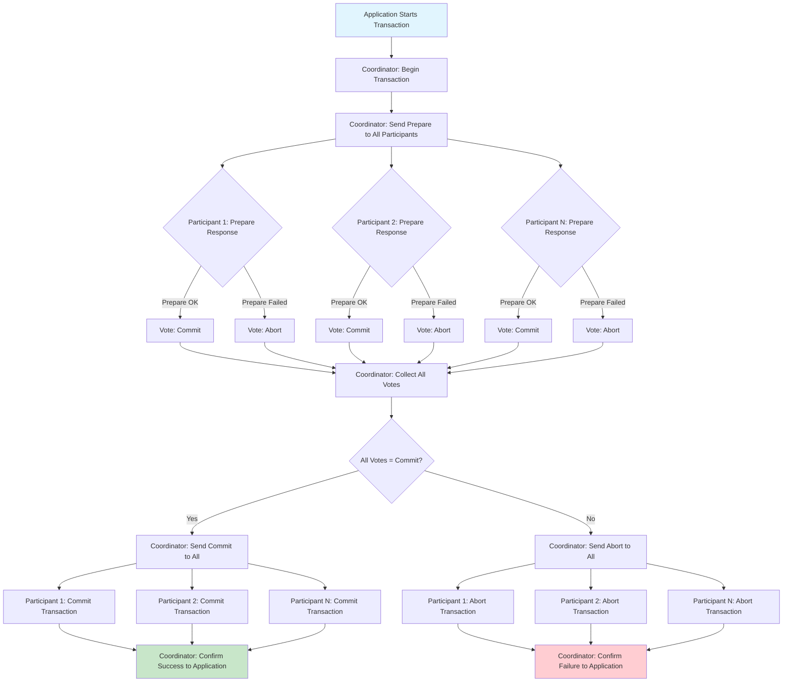

# Two-Phase Commit

## Overview

The Two-Phase Commit (2PC) protocol is a distributed transaction management pattern that ensures atomicity across multiple participants in a distributed system. In microservices architectures where each service manages its own database, maintaining atomicity across service boundaries becomes a significant challenge. The Two-Phase Commit protocol provides a mechanism to coordinate between services, ensuring that either all participants commit their portion of the transaction or none do, thus preserving the all-or-nothing guarantee essential for consistency.

The fundamental problem that Two-Phase Commit addresses is coordination in distributed transactions. When a transaction spans multiple databases or services, each participant must independently agree to commit its changes. If one participant fails to commit while others have already committed, the system enters an inconsistent state. The Two-Phase Commit protocol solves this by introducing a coordinator that manages the commit process in two distinct phases, ensuring all participants reach a collective decision before any participant makes its changes permanent.

The protocol was formalized in the context of distributed databases in the 1980s and has been widely implemented in relational database systems, message queues, and distributed transaction monitors. While it has been criticized for blocking behavior and coordinator failure sensitivity, it remains the standard solution for scenarios requiring strong atomicity guarantees across multiple resources.

Two-Phase Commit operates through two distinct phases. In the first phase, known as the prepare phase, the coordinator initiates the transaction by sending a prepare request to all participants. Each participant verifies it can commit its portion of the transaction, acquiring any necessary locks and ensuring it can persist the changes. If a participant can prepare successfully, it responds with a vote indicating readiness to commit. If any participant cannot prepare, it responds with an abort vote, and the entire transaction is rolled back.

In the second phase, known as the commit phase, the coordinator collects votes from all participants. If all participants vote to commit, the coordinator sends a commit request to all participants, who then make their changes permanent. If any participant voted to abort, or if the coordinator itself decides to abort, the coordinator sends an abort request to all participants, who then release their locks and discard their changes.

### The Coordinator

The coordinator is the central component that manages the Two-Phase Commit protocol. It is responsible for initiating the transaction, determining the outcome based on participant votes, and communicating the final decision to all participants. The coordinator must be reliable and available for the protocol to complete successfully.

The coordinator maintains transaction state throughout the protocol execution. Before initiating the prepare phase, the coordinator records the transaction identifier, the list of participants, and the current phase. During the prepare phase, it tracks participant responses. After collecting all responses, it makes a commit or abort decision and records this decision before communicating it to participants.

The coordinator implements the state machine of Two-Phase Commit. In the initial state, the coordinator has received atransaction request but has not begun the protocol. In the prepare state, it has sent prepare requests and is awaiting responses. In the commit state, all participants have voted to commit and the coordinator is sending commit requests. In the abort state, at least one participant voted to abort and the coordinator is sending abort requests. In the completed state, all participants have acknowledged the final decision and the transaction is complete.

If the coordinator fails after sending commit requests but before confirming to participants, it creates an uncertainty window where participants do not know whether to commit or abort. The protocol addresses this through recovery procedures where participants can query the coordinator or a transaction log to determine the transaction outcome.

### The Participants

Participants are the services or databases that execute portions of the distributed transaction. Each participant must implement the Two-Phase Commit protocol on its portion of the transaction, responding to coordinator requests appropriately and managing local transaction state.

When a participant receives a prepare request, it must perform the necessary work to prepare for commit. This includes ensuring it can write its changes to durable storage, acquiring locks on any modified resources, and validating any constraints. If preparation succeeds, the participant votes to commit by responding positively to the coordinator. If preparation fails, the participant votes to abort, rolling back its local transaction and releasing any locks.

After voting to commit in the prepare phase, a participant must be able to commit if later requested by the coordinator. This requires that the participant either keeps its transaction open with locks held or can reliably re-acquire the necessary state. The participant typically writes its changes to a temporary or uncommitted area during the prepare phase, making them permanent only upon receiving the commit request.

Participants must implement recovery procedures to handle coordinator failure. If a participant has voted to commit but never receives the final decision, it must be able to determine the transaction outcome when the coordinator recovers. This is typically done by consulting a transaction log maintained by the coordinator or by querying other participants.

### Prepare Phase

The prepare phase begins when the coordinator decides to initiate the commit process. The coordinator sends a prepare message to all participants, containing the transaction identifier. Each participant must then determine whether it can commit its portion of the transaction.

The prepare operation involves several steps for each participant. First, the participant verifies it can complete its local transaction - this includes checking that constraints are satisfied, that sufficient resources are available, and that no conflicts exist. Second, the participant acquires locks on any resources it has modified to prevent concurrent modifications that could cause conflicts after commit. Third, the participant records prepared state information that will allow it to complete the commit if later requested. Fourth, the participant writes this prepared state to durable storage to survive coordinator failure.

If any participant cannot prepare - for example, due to a constraint violation, deadlock with another transaction, or hardware failure - it responds with an abort vote to the coordinator. The coordinator will then send abort requests to all participants, causing them to roll back their local transactions.

The prepare phase assumes participants can block. When a participant votes to commit in the prepare phase, it holds locks until the commit phase completes. This blocking behavior is a fundamental limitation of Two-Phase Commit and can lead to reduced concurrency in high-contention scenarios.

### Commit Phase

The commit phase begins after the coordinator receives votes from all participants. If all participants voted to commit, the coordinator decides to commit the transaction and sends commit requests to all participants. If any participant voted to abort, the coordinator decides to abort the transaction and sends abort requests to all participants.

When participants receive a commit request, they make their changes permanent. The commit operation involves applying the changes that were held in temporary or uncommitted storage, releasing any locks acquired during the prepare phase, and notifying the coordinator of successful commit. The participant then enters the idle state, ready for new transactions.

When participants receive an abort request, they discard their uncommitted changes, release any locks, and return to the idle state. The abort operation is essentially the same as a normal transaction rollback.

The coordinator tracks acknowledgments from participants. When it receives acknowledgments from all participants, it considers the transaction complete. If any participant fails to acknowledge, the coordinator must retry the commit or abort request until successful, or until manual intervention resolves the situation.

## Flow Chart



## Standard Example

```java
import java.util.*;
import java.util.concurrent.*;
import java.rmi.*;
import java.rmi.server.*;
import java.rmi.registry.*;

/**
 * Two-Phase Commit Implementation in Java
 * 
 * This example demonstrates the Two-Phase Commit protocol with
 * a coordinator and multiple participants implementing
 * the prepare and commit phases.
 */

public class TwoPhaseCommitExample {
    public static void main(String[] args) {
        System.out.println("=".repeat(60));
        System.out.println("TWO-PHASE COMMIT DEMONSTRATION");
        System.out.println("=".repeat(60));
        
        new TwoPhaseCommitExample().runDemo();
    }
    
    public void runDemo() {
        // Create coordinator
        TransactionCoordinator coordinator = new TransactionCoordinator();
        
        // Create participants
        Participant accountParticipant = new Participant("AccountService");
        Participant inventoryParticipant = new Participant("InventoryService");
        Participant orderParticipant = new Participant("OrderService");
        
        // Register participants
        coordinator.registerParticipant("account", accountParticipant);
        coordinator.registerParticipant("inventory", inventoryParticipant);
        coordinator.registerParticipant("order", orderParticipant);
        
        System.out.println("\n--- Successful Transaction Scenario ---");
        
        // Demonstrate successful commit
        String transactionId = "TX-" + System.currentTimeMillis();
        
        System.out.println("\n[Application] Starting transaction: " + transactionId);
        
        // Prepare phase - all participants can commit
        System.out.println("\n[Phase 1] Prepare Phase");
        
        boolean prepareSuccess = coordinator.prepare(transactionId, Arrays.asList(
            new Operation("account", "debit", 1000.00),
            new Operation("inventory", "reserve", "SKU-123"),
            new Operation("order", "create", "ORDER-456")
        ));
        
        System.out.println("All participants prepared successfully: " + prepareSuccess);
        
        // Commit phase - coordinator commits
        if (prepareSuccess) {
            System.out.println("\n[Phase 2] Commit Phase");
            boolean commitSuccess = coordinator.commit(transactionId);
            System.out.println("Transaction committed: " + commitSuccess);
        }
        
        System.out.println("\n--- Failed Transaction Scenario ---");
        
        // Demonstrate failed commit (one participant cannot prepare)
        String transactionId2 = "TX-" + (System.currentTimeMillis() + 1000);
        
        System.out.println("\n[Application] Starting transaction: " + transactionId2);
        
        // Set one participant to reject preparation
        inventoryParticipant.setRejectNextPrepare(true);
        
        System.out.println("\n[Phase 1] Prepare Phase");
        
        boolean prepareSuccess2 = coordinator.prepare(transactionId2, Arrays.asList(
            new Operation("account", "debit", 500.00),
            new Operation("inventory", "reserve", "SKU-999"),
            new Operation("order", "create", "ORDER-789")
        ));
        
        System.out.println("Prepare succeeded: " + prepareSuccess2);
        
        // If any participant votes no, entire transaction aborts
        if (!prepareSuccess2) {
            System.out.println("\n[Phase 2] Abort Phase");
            coordinator.abort(transactionId2);
            System.out.println("Transaction aborted due to participant failure");
        }
        
        System.out.println("\n" + "=".repeat(60));
        System.out.println("DEMONSTRATION COMPLETE");
        System.out.println("=".repeat(60));
    }
}


/**
 * Transaction Coordinator - manages the Two-Phase Commit protocol
 */
class TransactionCoordinator {
    
    public enum TransactionState {
        INIT,
        PREPARING,
        PREPARED,
        COMMITTING,
        COMMITTED,
        ABORTING,
        ABORTED
    }
    
    private static class TransactionContext {
        final String transactionId;
        final List<Operation> operations;
        final Map<String, Participant.Vote> votes = new HashMap<>();
        TransactionState state = TransactionState.INIT;
        
        TransactionContext(String transactionId, List<Operation> operations) {
            this.transactionId = transactionId;
            this.operations = operations;
        }
    }
    
    private final Map<String, TransactionContext> transactions = new ConcurrentHashMap<>();
    private final Map<String, Participant> participants = new ConcurrentHashMap<>();
    
    public void registerParticipant(String name, Participant participant) {
        participants.put(name, participant);
        System.out.println("[Coordinator] Registered participant: " + name);
    }
    
    public boolean prepare(String transactionId, List<Operation> operations) {
        TransactionContext context = new TransactionContext(transactionId, operations);
        transactions.put(transactionId, context);
        
        context.state = TransactionState.PREPARING;
        
        System.out.println("[Coordinator] Sending prepare to all participants");
        
        // Send prepare to all participants
        boolean allCanCommit = true;
        for (Operation op : operations) {
            Participant participant = participants.get(op.serviceName);
            if (participant != null) {
                Participant.Vote vote = participant.prepare(transactionId, op);
                context.votes.put(op.serviceName, vote);
                
                System.out.println("[Coordinator] Received vote from " + op.serviceName + 
                                  ": " + (vote.canCommit ? "COMMIT" : "ABORT"));
                
                if (!vote.canCommit) {
                    allCanCommit = false;
                }
            }
        }
        
        if (allCanCommit) {
            context.state = TransactionState.PREPARED;
            System.out.println("[Coordinator] All participants voted COMMIT");
        } else {
            context.state = TransactionState.ABORTED;
            System.out.println("[Coordinator] One or more participants voted ABORT");
        }
        
        return allCanCommit;
    }
    
    public boolean commit(String transactionId) {
        TransactionContext context = transactions.get(transactionId);
        if (context == null || context.state != TransactionState.PREPARED) {
            System.out.println("[Coordinator] Cannot commit - transaction not prepared");
            return false;
        }
        
        context.state = TransactionState.COMMITTING;
        System.out.println("[Coordinator] Sending commit to all participants");
        
        // Send commit to all participants
        for (String participantName : context.votes.keySet()) {
            Participant participant = participants.get(participantName);
            if (participant != null) {
                participant.commit(transactionId);
                System.out.println("[Coordinator] Received commit ack from " + participantName);
            }
        }
        
        context.state = TransactionState.COMMITTED;
        System.out.println("[Coordinator] Transaction committed successfully");
        
        return true;
    }
    
    public boolean abort(String transactionId) {
        TransactionContext context = transactions.get(transactionId);
        if (context == null) {
            return false;
        }
        
        context.state = TransactionState.ABORTING;
        System.out.println("[Coordinator] Sending abort to all participants");
        
        // Send abort to all participants
        for (String participantName : context.votes.keySet()) {
            Participant participant = participants.get(participantName);
            if (participant != null) {
                participant.abort(transactionId);
                System.out.println("[Coordinator] Received abort ack from " + participantName);
            }
        }
        
        context.state = TransactionState.ABORTED;
        System.out.println("[Coordinator] Transaction aborted");
        
        return true;
    }
}


/**
 * Operation to be executed by a participant
 */
class Operation {
    final String serviceName;
    final String operationType;
    final Object data;
    
    Operation(String serviceName, String operationType, Object data) {
        this.serviceName = serviceName;
        this.operationType = operationType;
        this.data = data;
    }
    
    @Override
    public String toString() {
        return serviceName + ":" + operationType + "(" + data + ")";
    }
}


/**
 * Participant - executes local transactions as part of a distributed transaction
 */
class Participant {
    
    public enum Vote {
        COMMIT(true),
        ABORT(false);
        
        final boolean canCommit;
        
        Vote(boolean canCommit) {
            this.canCommit = canCommit;
        }
    }
    
    private final String name;
    private final Map<String, Object> preparedData = new ConcurrentHashMap<>();
    private boolean rejectNextPrepare = false;
    
    public Participant(String name) {
        this.name = name;
    }
    
    public void setRejectNextPrepare(boolean reject) {
        this.rejectNextPrepare = reject;
    }
    
    public Vote prepare(String transactionId, Operation operation) {
        System.out.println("[Participant:" + name + "] Preparing operation: " + operation);
        
        // Check if we can prepare
        if (rejectNextPrepare) {
            rejectNextPrepare = false;
            System.out.println("[Participant:" + name + "] Prepare failed - business rule violation");
            return Vote.ABORT;
        }
        
        // Validate the operation
        boolean validationSuccess = validateOperation(operation);
        
        if (!validationSuccess) {
            System.out.println("[Participant:" + name + "] Prepare failed - validation error");
            return Vote.ABORT;
        }
        
        // Simulate acquiring locks and writing to prepared state
        preparedData.put(transactionId, operation.data);
        
        System.out.println("[Participant:" + name + "] Prepared successfully - vote COMMIT");
        
        return Vote.COMMIT;
    }
    
    private boolean validateOperation(Operation operation) {
        // Simulate validation - in real implementation, check constraints
        if (operation.operationType.equals("debit")) {
            double amount = (Double) operation.data;
            return amount > 0 && amount <= 10000;
        }
        
        if (operation.operationType.equals("reserve")) {
            String sku = (String) operation.data;
            return sku != null && !sku.isEmpty();
        }
        
        if (operation.operationType.equals("create")) {
            String orderId = (String) operation.data;
            return orderId != null && !orderId.isEmpty();
        }
        
        return true;
    }
    
    public boolean commit(String transactionId) {
        System.out.println("[Participant:" + name + "] Committing transaction: " + transactionId);
        
        Object data = preparedData.remove(transactionId);
        
        if (data != null) {
            System.out.println("[Participant:" + name + "] Applied changes: " + data);
            System.out.println("[Participant:" + name + "] Committed successfully");
            return true;
        }
        
        System.out.println("[Participant:" + name + "] No prepared data found");
        return false;
    }
    
    public boolean abort(String transactionId) {
        System.out.println("[Participant:" + name + "] Aborting transaction: " + transactionId);
        
        // Remove prepared data without applying
        Object data = preparedData.remove(transactionId);
        
        if (data != null) {
            System.out.println("[Participant:" + name + "] Discarded uncommitted changes: " + data);
        }
        
        System.out.println("[Participant:" + name + "] Aborted successfully");
        
        return true;
    }
}


/**
 * Extended example showing recovery handling
 */
class TwoPhaseCommitRecoveryExample {
    
    public static void demonstrateRecovery() {
        System.out.println("\n--- Recovery Scenario ---");
        
        TransactionCoordinator coordinator = new TransactionCoordinator();
        
        // Simulate coordinator failure during commit phase
        String transactionId = "TX-RECOVERY-" + System.currentTimeMillis();
        
        System.out.println("\n[Scenario] Coorindator crashes after prepare but before commit");
        
        // Participants prepare
        Participant p1 = new Participant("Service-A");
        Participant p2 = new Participant("Service-B");
        
        coordinator.registerParticipant("service-a", p1);
        coordinator.registerParticipant("service-b", p2);
        
        coordinator.prepare(transactionId, Arrays.asList(
            new Operation("service-a", "write", "data-A"),
            new Operation("service-b", "write", "data-B")
        ));
        
        System.out.println("[Scenario] Coordinator crashes at this point!");
        
        // Participants in uncertain state - must wait for coordinator recovery
        System.out.println("\n[Participant] Service-A is in uncertain state");
        System.out.println("[Participant] Service-B is in uncertain state");
        
        // Simulate coordinator recovery
        System.out.println("\n[Scenario] Coordinator recovers and reads transaction log");
        
        coordinator.commit(transactionId);
        
        System.out.println("[Coordinator] Completed pending transaction");
    }
}


/**
 * RMI-based implementation (conceptual - would require full RMI setup)
 */
/*
 // This shows how a real RMI-based implementation would work
 // Note: This is conceptual code that won't compile without full RMI setup
 
 interface TwoPhaseCommitCoordinator extends Remote {
     public boolean prepare(String transactionId, List<Operation> operations) throws RemoteException;
     public void commit(String transactionId) throws RemoteException;
     public void abort(String transactionId) throws RemoteException;
 }
 
 interface TwoPhaseCommitParticipant extends Remote {
     public Vote prepare(String transactionId, Operation operation) throws RemoteException;
     public void commit(String transactionId) throws RemoteException;
     public void abort(String transactionId) throws RemoteException;
     public Vote getDecision(String transactionId) throws RemoteException;
 }
 
 class TwoPhaseCommitCoordinatorImpl extends UnicastRemoteObject implements TwoPhaseCommitCoordinator {
     private Map<String, TransactionContext> transactions = new HashMap<>();
     
     public boolean prepare(String transactionId, List<Operation> operations) throws RemoteException {
         // Send prepare to all participants and collect votes
         // Return true only if all vote to commit
     }
     
     public void commit(String transactionId) throws RemoteException {
         // Send commit to all participants
     }
     
     public void abort(String transactionId) throws RemoteException {
         // Send abort to all participants
     }
 }
*/
```

## Real-World Example 1: Distributed Databases (Oracle RAC)

Oracle Real Application Clusters (RAC) is one of the most widely deployed distributed database systems using Two-Phase Commit. In Oracle RAC, multiple database instances share the same database, with each instance capable of processing transactions. When a transaction spans multiple instances, Two-Phase Commit ensures atomicity across the cluster.

Oracle implements Two-Phase Commit through its Internal Recovery (IRD) mechanism. When a transaction involves multiple instances, one instance acts as the coordinator while the others act as participants. The coordinator logs the transaction to its redo logs before beginning the prepare phase, ensuring that even if the coordinator fails, it can recover and complete the transaction upon restart.

The prepare phase in Oracle involves acquiring Global Resource Directory (GRD) locks on the affected data. Each instance must acquire locks on the data blocks it will modify before it can vote to commit. This ensures that the commit phase can complete without conflicts. If an instance cannot acquire necessary locks (due to concurrent transactions), it votes to abort.

Oracle's implementation addresses the performance concerns of Two-Phase Commit through several optimizations. Parallel query allows multiple instances to prepare in parallel. Transaction batching allows related transactions to share prepare phases. Fast commit reduces the amount of data that must be written during commit by using group commit.

Oracle also implements a variant called Implict Transaction Control (ITC) that reduces blocking by allowing participants to release locks before they receive the commit decision in some cases, instead relying on the transaction log for recovery.

## Real-World Example 2: JTA/Java Transaction API

The Java Transaction API (JTA) provides a standard interface for implementing Two-Phase Commit in Java EE environments. JTA is widely used in enterprise applications that require distributed transactions across multiple databases or message queues.

JTA defines three key roles: the application component that begins and controls the transaction, the transaction manager that coordinates the transaction, and the resource managers (databases, message queues) that participate in the transaction. The transaction manager implements Two-Phase Commit according to the JTA specification.

The JTA implementation typically works as follows. The application obtains a UserTransaction from the JNDI lookup and begins the transaction. The application then enlists multiple resources (JDBC connections, JMS sessions) in the transaction. When the application calls commit, the transaction manager initiates the Two-Phase Commit protocol.

In the prepare phase, the transaction manager calls prepare on each resource, which corresponds to the prepare operation in Two-Phase Commit. Each resource must flush any pending changes to durable storage and verify it can commit. The resource returns a vote (typically prepared if successful, or rolled back if failed).

In the commit phase, if all resources voted to commit, the transaction manager calls commit on each resource in order. Each resource makes its changes permanent. If any resource voted to abort, the transaction manager calls rollback on all resources.

JTA implementations include Narayana (formerly JBossTS), which is the transaction manager used in JBoss EAP and WildFly. Another implementation is GlassFish's Transaction Manager, which is used in the GlassFish application server. Oracle WebLogic and IBM WebSphere include their own JTA implementations.

## Real-World Example 3: Message Queue Systems (ActiveMQ, Kafka)

Message queue systems like Apache ActiveMQ and Apache Kafka implement Two-Phase Commit patterns to ensure reliable message delivery across distributed systems.

ActiveMQ supports Two-Phase Commit via itsdahua Persistence Adapter. When a producer sends a message, it can request that the message be stored using a transaction. The message store acts as a participant, and the transaction coordination ensures messages are not lost even if the broker fails.

In the ActiveMQ implementation, the producer obtains a transaction context and sends messages within that context. The broker acts as the coordinator. When the producer calls commit, the broker initiates Two-Phase Commit across its persistence store and any participating systems. If any participant cannot commit, all messages are rolled back and the producer is notified of the failure.

Kafka implements a simplified form of Two-Phase Commit through its transactional API introduced in Kafka 0.11. The Kafka transactional producer uses a transaction coordinator (running in the Kafka broker) that manages the Two-Phase Commit protocol. The producer writes messages to a partition and receives acknowledgments in the prepare phase, and then commits atomically when the transaction is completed.

## Output Statement

Running the Two-Phase Commit demonstration produces output showing successful and failed transaction scenarios:

```
============================================================
TWO-PHASE COMMIT DEMONSTRATION
============================================================

[Coordinator] Registered participant: AccountService
[Coordinator] Registered participant: InventoryService
[Coordinator] Registered participant: OrderService

--- Successful Transaction Scenario ---

[Application] Starting transaction: TX-1712580123456

[Phase 1] Prepare Phase
[Coordinator] Sending prepare to all participants
[Coordinator] Received vote from account: COMMIT
[Participant:AccountService] Preparing operation: account:debit(1000.0)
[Participant:AccountService] Prepared successfully - vote COMMIT
[Coordinator] Received vote from inventory: COMMIT
[Participant:InventoryService] Preparing operation: inventory:reserve(SKU-123)
[Participant:InventoryService] Prepared successfully - vote COMMIT
[Coordinator] Received vote from order: COMMIT
[Participant:OrderService] Preparing operation: order:create(ORDER-456)
[Participant:OrderService] Prepared successfully - vote COMMIT
[Coordinator] All participants voted COMMIT
All participants prepared successfully: true

[Phase 2] Commit Phase
[Coordinator] Sending commit to all participants
[Coordinator] Received commit ack from account
[Participant:AccountService] Committing transaction: TX-1712580123456
[Participant:AccountService] Applied changes: 1000.0
[Participant:AccountService] Committed successfully
[Coordinator] Received commit ack from inventory
[Participant:InventoryService] Committing transaction: TX-1712580123456
[Participant:InventoryService] Applied changes: SKU-123
[Participant:InventoryService] Committed successfully
[Coordinator] Received commit ack from order
[Participant:OrderService] Committing transaction: TX-1712580123456
[Participant:OrderService] Applied changes: ORDER-456
[Participant:OrderService] Committed successfully
[Coordinator] Transaction committed successfully
Transaction committed: true

--- Failed Transaction Scenario ---

[Application] Starting transaction: TX-1712580123567

[Phase 1] Prepare Phase
[Coordinator] Sending prepare to all participants
[Coordinator] Received vote from account: COMMIT
[Participant:AccountService] Preparing operation: account:debit(500.0)
[Participant:AccountService] Prepared successfully - vote COMMIT
[Coordinator] Received vote from inventory: ABORT
[Participant:InventoryService] Preparing operation: inventory:reserve(SKU-999)
[Participant:InventoryService] Prepare failed - business rule violation
[Coordinator] Received vote from order: COMMIT
[Participant:OrderService] Preparing operation: order:create(ORDER-789)
[Participant:OrderService] Prepared successfully - vote COMMIT
[Coordinator] One or more participants voted ABORT
Prepare succeeded: false

[Phase 2] Abort Phase
[Coordinator] Sending abort to all participants
[Coordinator] Received abort ack from account
[Participant:AccountService] Aborting transaction: TX-1712580123567
[Participant:AccountService] Discarded uncommitted changes: 500.0
[Participant:AccountService] Aborted successfully
[Coordinator] Received abort ack from inventory
[Coordinator] Received abort ack from order
[Participant:OrderService] Aborting transaction: TX-1712580123567
[Participant:OrderService] Discarded uncommitted changes: ORDER-789
[Participant:OrderService] Aborted successfully
[Coordinator] Transaction aborted due to participant failure

============================================================
DEMONSTRATION COMPLETE
============================================================
```

The output demonstrates:
1. The successful case where all participants vote to commit, leading to the commit phase
2. The failed case where one participant cannot prepare, causing the entire transaction to abort
3. How participants hold their changes until commit while in the prepared state

## Best Practices

**Use Two-Phase Commit Only When Necessary**: Two-Phase Commit introduces blocking and performance overhead. Only use it when atomicity across multiple resources is truly required. For many microservices scenarios, consider event-driven patterns like Saga that provide eventual consistency without blocking.

**Keep Transactions Short**: Long-running transactions hold locks and prevent other transactions from proceeding. Optimize transaction design to minimize the work done between prepare and commit. Move non-critical operations outside the transaction boundary where possible.

**Implement Idempotent Operations**: Design participant operations to be idempotent so that retries don't cause duplicate effects. Use unique transaction identifiers to detect duplicates. This is essential when recovering from coordinator or participant failures.

**Handle Participant Failures Gracefully**: Participants may fail after voting to commit but before receiving the commit decision. Implement recovery procedures that can query the coordinator for the transaction state. Consider using a persistent transaction log.

**Design for Coordinator Failure**: The coordinator is a single point of failure. Implement coordinator recovery procedures that read transaction logs and complete pending transactions. Consider using coordinator replication for high availability.

**Monitor Transaction Health**: Implement monitoring for transaction duration, abort rates, and participant failures. Set alerts for abnormal patterns. Track metrics like average prepare time, commit latency, and transaction failure rates.

**Use Appropriate Timeout Values**: Set appropriate timeouts for each phase. The prepare phase timeout should account for validation and lock acquisition time. The commit phase timeout should account for the size of data being committed.

**Consider Alternatives**: For high-throughput scenarios, consider alternatives like Saga pattern, eventual consistency, or optimistic concurrency with retry. These patterns often provide better performance at the cost of weaker consistency guarantees.

**Test Failure Scenarios**: Thoroughly test Two-Phase Commit under failure conditions including participant failures, coordinator failures, network partitions, and concurrent transactions. Include chaos engineering practices to validate resilience.

**Document Transaction Boundaries**: Clearly document which operations are included in each distributed transaction. This helps developers understand the scope and assists in debugging production issues.

**Consider Using Existing Solutions**: Rather than implementing Two-Phase Commit from scratch, use established solutions like JTA, Narayana, or cloud-provided transaction services. These implementations have been thoroughly tested and handle edge cases properly.