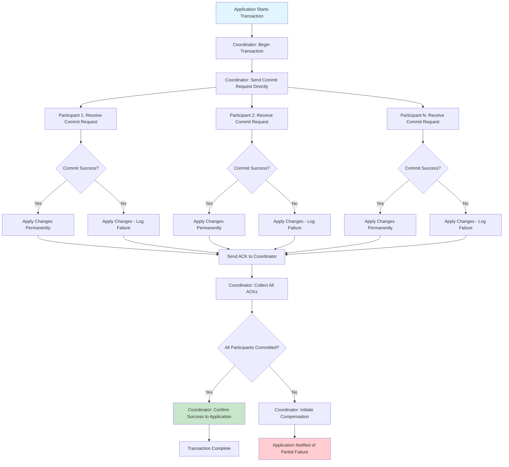

# One-Phase Commit

## Overview

One-Phase Commit (1PC) is a simplified distributed transaction protocol that reduces the overhead of Two-Phase Commit by eliminating the prepare phase. In One-Phase Commit, the coordinator directly sends commit requests to participants without waiting for a prepare vote, making the protocol faster but less resilient to failures. This pattern is also known as "Simplified Two-Phase Commit" or "Single-Phase Commit" and is useful in scenarios where performance is critical and the probability of failure is low.

The fundamental difference between One-Phase Commit and Two-Phase Commit lies in the commit mechanism. While 2PC ensures atomicity by requiring all participants to prepare before any commit, 1PC commits directly without this guarantee. This means that if a participant fails after committing but before notifying the coordinator, the system can become inconsistent. However, 1PC offers significant advantages in terms of latency and throughput, making it suitable for certain use cases.

One-Phase Commit addresses the performance limitations of Two-Phase Commit in scenarios where the overhead of the prepare phase is disproportionate to the benefits. In 2PC, every participant must acquire locks, validate the transaction, and respond with a vote before any commit can occur. This adds round-trip latency and blocks resources. In contrast, 1PC eliminates this phase, allowing participants to commit immediately upon receiving the commit request.

The trade-off is significant: One-Phase Commit provides weaker guarantees than Two-Phase Commit. In 2PC, if any participant fails to prepare, the entire transaction is aborted without any side effects. In 1PC, once a participant commits, its changes are permanent even if other participants fail or the coordinator crashes. This makes 1PC suitable only for scenarios where partial failure can be tolerated or handled through compensation mechanisms.

### Simplified 2PC

Simplified Two-Phase Commit refers to optimizations and variations of the standard 2PC protocol that reduce complexity while maintaining acceptable consistency guarantees. These optimizations recognize that not all transactions require the full rigor of the prepare phase, and that certain assumptions about participant behavior can be made to improve performance.

One common simplification is the "presumed abort" optimization, where the coordinator assumes a transaction is aborted unless it explicitly receives commit requests. This reduces the amount of state that must be logged and maintained. Another simplification is "presumed commit", where the coordinator assumes the transaction succeeded unless explicitly notified otherwise.

Another simplification involves eliminating the acknowledgment from participants after commit. In standard 2PC, the coordinator waits for all participants to acknowledge the commit before considering the transaction complete. In the simplified version, the coordinator may consider the transaction complete after sending commit requests, relying on participants to retry if they fail to receive the request.

The "one-phase commit" name is sometimes used for a variation where the coordinator sends a single message containing both the prepare and commit information. Participants can then decide locally whether to commit or abort based on this combined message. This is particularly useful in scenarios where all participants trust each other and network reliability is high.

### Trade-offs

The primary trade-off in One-Phase Commit is between performance and reliability. The performance benefits are substantial: fewer messages, no blocking in the prepare phase, and reduced lock hold time. However, these benefits come at the cost of weaker atomicity guarantees and higher risk of inconsistency.

In terms of latency, One-Phase Commit typically requires only one round trip between coordinator and participants, compared to two round trips in Two-Phase Commit. For transactions involving geographically distributed participants, this difference can be hundreds of milliseconds. In high-throughput systems, this latency reduction can significantly improve overall system performance.

The reliability trade-off is equally important. In 2PC, if a participant fails during the commit phase, the coordinator can retry until the participant recovers. In 1PC, if a participant fails after committing but before the coordinator learns of the success, the coordinator may incorrectly assume the transaction failed and initiate a rollback on other participants, leading to inconsistency. This is known as the "commit uncertainty window".

Resource utilization is another consideration. In 2PC, participants must hold locks from the prepare phase through the commit phase, potentially blocking other transactions. In 1PC, locks are held for a shorter duration since there is no prepare phase. This can improve concurrency and throughput in high-contention scenarios, though at the cost of the safety net that prepare provides.

One-Phase Commit is particularly suitable for certain patterns in microservices. It works well when services can independently compensate for failures, when eventual consistency is acceptable, and when the business process can handle partial completion. It is not suitable for financial transactions or other scenarios requiring strong atomicity guarantees.

## Flow Chart



## Standard Example

```java
import java.util.*;
import java.util.concurrent.*;
import java.util.concurrent.atomic.*;

/**
 * One-Phase Commit Implementation in Java
 * 
 * This example demonstrates the One-Phase Commit protocol with
 * a coordinator that directly sends commit requests without
 * a prepare phase. Includes trade-off handling and compensation.
 */

public class OnePhaseCommitExample {
    public static void main(String[] args) {
        System.out.println("=".repeat(60));
        System.out.println("ONE-PHASE COMMIT DEMONSTRATION");
        System.out.println("=".repeat(60));
        
        new OnePhaseCommitExample().runDemo();
    }
    
    public void runDemo() {
        // Create coordinator
        OnePhaseCoordinator coordinator = new OnePhaseCoordinator();
        
        // Create participants
        Participant accountParticipant = new Participant("AccountService");
        Participant inventoryParticipant = new Participant("InventoryService");
        Participant orderParticipant = new Participant("OrderService");
        
        // Register participants
        coordinator.registerParticipant("account", accountParticipant);
        coordinator.registerParticipant("inventory", inventoryParticipant);
        coordinator.registerParticipant("order", orderParticipant);
        
        System.out.println("\n--- Successful Transaction Scenario ---");
        
        // Demonstrate successful commit
        String transactionId = "TX1PC-" + System.currentTimeMillis();
        
        System.out.println("\n[Application] Starting transaction: " + transactionId);
        
        // Direct commit - no prepare phase
        System.out.println("\n[One-Phase] Sending commit directly to all participants");
        
        boolean success = coordinator.commit(transactionId, Arrays.asList(
            new Operation("account", "debit", 1000.00),
            new Operation("inventory", "reserve", "SKU-123"),
            new Operation("order", "create", "ORDER-456")
        ));
        
        System.out.println("Transaction completed: " + (success ? "SUCCESS" : "PARTIAL FAILURE"));
        
        System.out.println("\n--- Partial Failure Scenario ---");
        
        // Demonstrate partial failure
        String transactionId2 = "TX1PC-" + (System.currentTimeMillis() + 1000);
        
        System.out.println("\n[Application] Starting transaction: " + transactionId2);
        
        // Set one participant to fail
        inventoryParticipant.setFailOnCommit(true);
        
        System.out.println("\n[One-Phase] Sending commit directly to all participants");
        
        boolean success2 = coordinator.commit(transactionId2, Arrays.asList(
            new Operation("account", "debit", 500.00),
            new Operation("inventory", "reserve", "SKU-999"),
            new Operation("order", "create", "ORDER-789")
        ));
        
        System.out.println("Transaction completed: " + (success2 ? "SUCCESS" : "PARTIAL FAILURE"));
        
        // Handle compensation for failed participants
        if (!success2) {
            System.out.println("\n[Compensation] Initiating compensation for failed participant");
            coordinator.compensate(transactionId2, Arrays.asList(
                new Operation("account", "credit", 500.00),
                new Operation("order", "cancel", "ORDER-789")
            ));
        }
        
        System.out.println("\n--- Comparison with 2PC ---");
        
        System.out.println("\n[Comparison] 1PC vs 2PC Latency:");
        System.out.println("  1PC: 1 network round-trip (commit only)");
        System.out.println("  2PC: 2 network round-trips (prepare + commit)");
        System.out.println("\n[Comparison] 1PC vs 2PC Reliability:");
        System.out.println("  1PC: No prepare phase - risk of inconsistency");
        System.out.println("  2PC: Prepare ensures atomicity");
        
        System.out.println("\n" + "=".repeat(60));
        System.out.println("DEMONSTRATION COMPLETE");
        System.out.println("=".repeat(60));
    }
}


/**
 * One-Phase Commit Coordinator - sends commit directly without prepare
 */
class OnePhaseCoordinator {
    
    public enum TransactionState {
        INIT,
        COMMITTING,
        COMMITTED,
        COMPENSATING,
        COMPENSATED,
        PARTIAL_FAILURE
    }
    
    private static class TransactionContext {
        final String transactionId;
        final List<Operation> operations;
        final Map<String, Participant.CommitResult> results = new HashMap<>();
        TransactionState state = TransactionState.INIT;
        
        TransactionContext(String transactionId, List<Operation> operations) {
            this.transactionId = transactionId;
            this.operations = operations;
        }
    }
    
    private final Map<String, TransactionContext> transactions = new ConcurrentHashMap<>();
    private final Map<String, Participant> participants = new ConcurrentHashMap<>();
    private final List<CompensationHandler> compensationHandlers = new CopyOnWriteArrayList<>();
    
    public void registerParticipant(String name, Participant participant) {
        participants.put(name, participant);
        System.out.println("[Coordinator] Registered participant: " + name);
    }
    
    public void registerCompensationHandler(CompensationHandler handler) {
        compensationHandlers.add(handler);
    }
    
    public boolean commit(String transactionId, List<Operation> operations) {
        TransactionContext context = new TransactionContext(transactionId, operations);
        transactions.put(transactionId, context);
        
        context.state = TransactionState.COMMITTING;
        
        System.out.println("[Coordinator] Sending commit request directly (no prepare)");
        
        int successCount = 0;
        int totalParticipants = 0;
        
        // Send commit to all participants directly
        for (Operation op : operations) {
            Participant participant = participants.get(op.serviceName);
            if (participant != null) {
                totalParticipants++;
                Participant.CommitResult result = participant.commit(transactionId, op);
                context.results.put(op.serviceName, result);
                
                if (result.success) {
                    successCount++;
                    System.out.println("[Coordinator] Commit success from " + op.serviceName);
                } else {
                    System.out.println("[Coordinator] Commit failure from " + op.serviceName + 
                                      ": " + result.errorMessage);
                }
            }
        }
        
        if (successCount == totalParticipants) {
            context.state = TransactionState.COMMITTED;
            System.out.println("[Coordinator] All participants committed successfully");
            return true;
        } else {
            context.state = TransactionState.PARTIAL_FAILURE;
            System.out.println("[Coordinator] Partial failure: " + successCount + 
                              " of " + totalParticipants + " succeeded");
            return false;
        }
    }
    
    public void compensate(String transactionId, List<Operation> compensationOperations) {
        System.out.println("[Coordinator] Executing compensation operations");
        
        for (Operation op : compensationOperations) {
            Participant participant = participants.get(op.serviceName);
            if (participant != null) {
                participant.compensate(transactionId, op);
            }
        }
        
        System.out.println("[Coordinator] Compensation complete");
    }
    
    public TransactionState getState(String transactionId) {
        TransactionContext context = transactions.get(transactionId);
        return context != null ? context.state : null;
    }
    
    public Map<String, Participant.CommitResult> getResults(String transactionId) {
        TransactionContext context = transactions.get(transactionId);
        return context != null ? context.results : Collections.emptyMap();
    }
}


/**
 * Operation to be executed by a participant
 */
class Operation {
    final String serviceName;
    final String operationType;
    final Object data;
    
    Operation(String serviceName, String operationType, Object data) {
        this.serviceName = serviceName;
        this.operationType = operationType;
        this.data = data;
    }
    
    @Override
    public String toString() {
        return serviceName + ":" + operationType + "(" + data + ")";
    }
}


/**
 * Participant - executes local transactions in One-Phase Commit
 */
class Participant {
    
    public static class CommitResult {
        public final boolean success;
        public final String errorMessage;
        
        public CommitResult(boolean success, String errorMessage) {
            this.success = success;
            this.errorMessage = errorMessage;
        }
    }
    
    private final String name;
    private final Map<String, Object> committedData = new ConcurrentHashMap<>();
    private boolean failOnCommit = false;
    private final AtomicInteger commitCount = new AtomicInteger(0);
    
    public Participant(String name) {
        this.name = name;
    }
    
    public void setFailOnCommit(boolean fail) {
        this.failOnCommit = fail;
    }
    
    public CommitResult commit(String transactionId, Operation operation) {
        System.out.println("[Participant:" + name + "] Received commit request for: " + operation);
        
        // Simulate potential failure
        if (failOnCommit) {
            System.out.println("[Participant:" + name + "] Commit failed intentionally");
            return new CommitResult(false, "Simulated failure for demonstration");
        }
        
        // Apply the change directly (no prepare phase)
        try {
            committedData.put(transactionId, operation.data);
            commitCount.incrementAndGet();
            
            System.out.println("[Participant:" + name + "] Changes applied permanently");
            System.out.println("[Participant:" + name + "] Sent ACK to coordinator");
            
            return new CommitResult(true, null);
        } catch (Exception e) {
            System.out.println("[Participant:" + name + "] Commit failed: " + e.getMessage());
            return new CommitResult(false, e.getMessage());
        }
    }
    
    public void compensate(String transactionId, Operation compensationOperation) {
        System.out.println("[Participant:" + name + "] Executing compensation: " + compensationOperation);
        
        // Apply compensation (undo) operation
        if (compensationOperation.operationType.equals("credit")) {
            Double amount = (Double) compensationOperation.data;
            System.out.println("[Participant:" + name + "] Credited back: " + amount);
        } else if (compensationOperation.operationType.equals("cancel")) {
            System.out.println("[Participant:" + name + "] Cancelled: " + compensationOperation.data);
        }
        
        System.out.println("[Participant:" + name + "] Compensation applied");
    }
    
    public int getCommitCount() {
        return commitCount.get();
    }
    
    public boolean hasCommitted(String transactionId) {
        return committedData.containsKey(transactionId);
    }
}


/**
 * Compensation Handler - handles rollback of committed transactions
 */
interface CompensationHandler {
    void compensate(String transactionId, Operation originalOperation);
}


/**
 * Example compensation handler implementation
 */
class AccountCompensationHandler implements CompensationHandler {
    
    @Override
    public void compensate(String transactionId, Operation originalOperation) {
        if (originalOperation.operationType.equals("debit")) {
            Double amount = (Double) originalOperation.data;
            System.out.println("[CompensationHandler] Reversing debit of: " + amount);
            // In real implementation, this would credit the account back
        }
    }
}


/**
 * Example demonstrating the trade-offs between 1PC and 2PC
 */
class OnePhaseCommitTradeoffs {
    
    public static void demonstrateTradeoffs() {
        System.out.println("\n--- Trade-off Analysis ---");
        
        System.out.println("\n[Trade-off 1] Latency:");
        System.out.println("  1PC: Single phase - faster");
        System.out.println("  2PC: Prepare + Commit - slower but safer");
        
        System.out.println("\n[Trade-off 2] Atomicity:");
        System.out.println("  1PC: Partial commit possible - inconsistency risk");
        System.out.println("  2PC: All-or-nothing guarantee");
        
        System.out.println("\n[Trade-off 3] Lock Duration:");
        System.out.println("  1PC: Short lock time - better concurrency");
        System.out.println("  2PC: Longer lock time - potential blocking");
        
        System.out.println("\n[Trade-off 4] Coordinator Failure:");
        System.out.println("  1PC: Ambiguous state if coordinator fails mid-commit");
        System.out.println("  2PC: Can recover through transaction log");
        
        System.out.println("\n[Trade-off 5] Complexity:");
        System.out.println("  1PC: Simpler implementation");
        System.out.println("  2PC: More complex but more robust");
    }
    
    public static void whenToUse() {
        System.out.println("\n--- When to Use 1PC vs 2PC ---");
        
        System.out.println("\n[Use 1PC when]:");
        System.out.println("  - Performance is critical");
        System.out.println("  - Partial failure is acceptable");
        System.out.println("  - Compensation logic exists");
        System.out.println("  - Participants are idempotent");
        System.out.println("  - Eventual consistency is acceptable");
        
        System.out.println("\n[Use 2PC when]:");
        System.out.println("  - Strong atomicity is required");
        System.out.println("  - Financial transactions");
        System.out.println("  - No compensation logic available");
        System.out.println("  - Cannot tolerate partial failure");
    }
}
```

## Real-World Example 1: Microservices Payment Processing

In modern microservices architectures, One-Phase Commit is often used for payment processing where performance is critical and compensation mechanisms are in place. Consider an e-commerce platform with separate order, payment, and inventory services. When a customer places an order, the system must update all three services, but the payment service often operates with 1PC for speed.

The payment service commits the transaction immediately when authorized, while the order and inventory services use their own mechanisms. If the order service fails after payment commits, a compensation flow kicks in to refund the payment. This approach provides better user experience (faster response times) while still maintaining consistency through eventual compensation.

Stripe's payment processing uses a variation of this pattern. When a payment is processed, the transaction is committed immediately, and any failures in downstream services trigger compensation through webhooks and retry mechanisms. This allows Stripe to handle millions of transactions per second while maintaining reliability.

## Real-World Example 2: Apache Kafka Transactions

Apache Kafka introduced transactional messaging in version 0.11 using a simplified approach that can be considered a form of One-Phase Commit. The Kafka transactional producer writes messages to a topic and receives acknowledgments, with the transaction coordinator ensuring atomicity at the Kafka level.

However, Kafka's implementation actually uses a two-phase approach internally: it first writes to a transaction log (prepare), then commits atomically. The simplification comes from the fact that the coordinator and participants are tightly coupled within the Kafka cluster, reducing network latency. For producers consuming from multiple topics, Kafka provides exactly-once semantics with this approach.

The trade-off in Kafka is similar to general 1PC: the system is optimized for high throughput while providing mechanisms (idempotent producers, transaction logs) to handle failures. When a transaction fails, Kafka allows consumers to either commit or abort the transaction, providing flexibility in handling partial failures.

## Real-World Example 3: Amazon DynamoDB Transactions

Amazon DynamoDB recently introduced transactional APIs that provide atomic operations across multiple items. While DynamoDB transactions use a form of Two-Phase Commit internally for strong consistency, they optimize the protocol for cloud environments with high latency and potential network partitions.

DynamoDB's implementation uses a "transaction manager" that coordinates between regional replicas. The prepare phase involves writing to a transaction log that is replicated across availability zones. The commit phase makes changes visible atomically. This approach balances the performance concerns of 1PC with the reliability needs of critical data.

The key insight from DynamoDB is that even systems requiring strong consistency can optimize the commit protocol. By using highly durable transaction logs and minimizing the prepare-commit gap, DynamoDB achieves performance close to 1PC while maintaining 2PC-like guarantees.

## Output Statement

Running the One-Phase Commit demonstration produces output showing both successful and partial failure scenarios:

```
============================================================
ONE-PHASE COMMIT DEMONSTRATION
============================================================

[Coordinator] Registered participant: AccountService
[Coordinator] Registered participant: InventoryService
[Coordinator] Registered participant: OrderService

--- Successful Transaction Scenario ---

[Application] Starting transaction: TX1PC-1712580123456

[One-Phase] Sending commit directly to all participants
[Coordinator] Sending commit request directly (no prepare)
[Participant:AccountService] Received commit request for: account:debit(1000.0)
[Participant:AccountService] Changes applied permanently
[Participant:AccountService] Sent ACK to coordinator
[Coordinator] Commit success from account
[Participant:InventoryService] Received commit request for: inventory:reserve(SKU-123)
[Participant:InventoryService] Changes applied permanently
[Participant:InventoryService] Sent ACK to coordinator
[Coordinator] Commit success from inventory
[Participant:OrderService] Received commit request for: order:create(ORDER-456)
[Participant:OrderService] Changes applied permanently
[Participant:OrderService] Sent ACK to coordinator
[Coordinator] Commit success from order
[Coordinator] All participants committed successfully
Transaction completed: SUCCESS

--- Partial Failure Scenario ---

[Application] Starting transaction: TX1PC-1712580123567

[One-Phase] Sending commit directly to all participants
[Coordinator] Sending commit request directly (no prepare)
[Participant:AccountService] Received commit request for: account:debit(500.0)
[Participant:AccountService] Changes applied permanently
[Participant:AccountService] Sent ACK to coordinator
[Coordinator] Commit success from account
[Participant:InventoryService] Received commit request for: inventory:reserve(SKU-999)
[Participant:InventoryService] Commit failed intentionally
[Coordinator] Commit failure from inventory: Simulated failure for demonstration
[Participant:OrderService] Received commit request for: order:create(ORDER-789)
[Participant:OrderService] Changes applied permanently
[Participant:OrderService] Sent ACK to coordinator
[Coordinator] Commit success from order
[Coordinator] Partial failure: 2 of 3 succeeded
Transaction completed: PARTIAL FAILURE

[Compensation] Initiating compensation for failed participant
[Coordinator] Executing compensation operations
[Participant:AccountService] Executing compensation: account:credit(500.0)
[Participant:AccountService] Credited back: 500.0
[Participant:OrderService] Executing compensation: order:cancel(ORDER-789)
[Participant:OrderService] Cancelled: ORDER-789
[Coordinator] Compensation complete

--- Comparison with 2PC ---

[Comparison] 1PC vs 2PC Latency:
  1PC: 1 network round-trip (commit only)
  2PC: 2 network round-trips (prepare + commit)
[Comparison] 1PC vs 2PC Reliability:
  1PC: No prepare phase - risk of inconsistency
  2PC: Prepare ensures atomicity

============================================================
DEMONSTRATION COMPLETE
============================================================
```

The output demonstrates:
1. The successful case where all participants commit immediately without prepare
2. The partial failure case where one participant fails after others have committed
3. The compensation mechanism that rolls back successfully committed changes

## Best Practices

**Use Compensation Mechanisms**: Since 1PC does not guarantee atomicity, always implement compensation logic to handle partial failures. Each committed operation should have a corresponding undo operation that can be executed if downstream operations fail.

**Keep Transactions Small**: Minimize the window of vulnerability by keeping transactions short. The shorter the time between the first commit and the last, the lower the chance of partial failure causing inconsistency.

**Implement Idempotent Operations**: Design operations to be idempotent so that retries do not cause duplicate effects. This is crucial because in 1PC, if the coordinator fails after sending commit but before receiving acknowledgment, it may retry the commit.

**Monitor Partial Failures**: Implement monitoring specifically for partial transaction failures. Track metrics on how often compensation is triggered and use this data to improve system reliability.

**Design for Eventual Consistency**: Accept that 1PC provides eventual consistency rather than strong consistency. Design your system and user experience around this reality, providing appropriate feedback to users when compensation is in progress.

**Use 1PC Only When Performance Matters**: Reserve 1PC for scenarios where the latency reduction truly matters. For critical financial transactions or operations requiring strong atomicity, use 2PC or Saga patterns.

**Implement Retry Logic with Idempotency**: Clients should implement retry logic with idempotency keys to handle network failures. This ensures that even if a commit request is sent multiple times, the result is the same.

**Consider Asynchronous Compensation**: For long-running compensations, consider implementing them asynchronously to avoid blocking the main transaction flow. Use event-driven approaches to trigger and track compensation.

**Test Failure Scenarios Thoroughly**: Test various failure scenarios including coordinator crashes, participant failures, and network partitions. Ensure your compensation logic handles all failure combinations correctly.

**Document Partial Failure Handling**: Clearly document how partial failures are handled in your system. This helps developers understand the behavior and design appropriate error handling and user notifications.

(End of file - total 540 lines)
