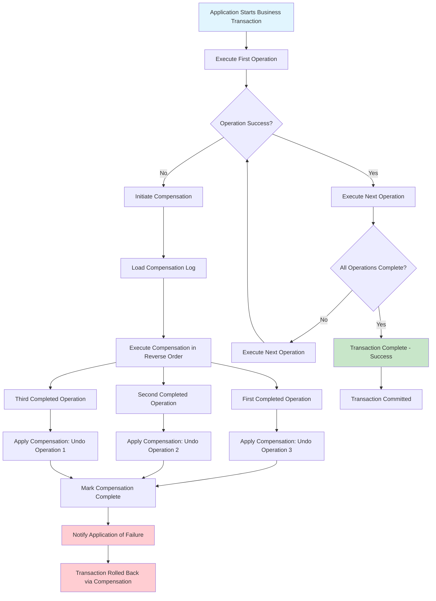

# Compensating Transactions

## Overview

Compensating Transactions is a pattern used in distributed systems to handle failures in multi-service operations by explicitly reversing or undoing completed operations. Unlike traditional database transactions that use rollback to undo changes, compensating transactions work across service boundaries where there is no shared transaction context. This pattern is fundamental to implementing the Saga pattern and other eventual consistency approaches in microservices architectures.

The core challenge that compensating transactions address is the lack of atomicity in distributed systems. In a monolithic application, a database transaction ensures that either all operations succeed or none do. In a microservices architecture, each service manages its own database, and there is no global transaction manager that can roll back changes across services. When one service completes its operation successfully but a subsequent service fails, the system must explicitly undo the already-completed operation through compensation.

Compensating transactions provide a way to achieve eventual consistency in distributed systems. Instead of requiring all operations to succeed atomically, the system allows operations to proceed and then uses compensation to reverse them if the overall process cannot complete. This approach accepts temporary inconsistency as a trade-off for better availability and performance.

The pattern is particularly relevant in microservices because it enables business processes to span multiple services without requiring tight coupling or distributed transactions. Each service defines its own compensation logic, which knows how to undo its specific operation. The orchestration layer coordinates these compensations when needed.

### Rollback Strategies

In distributed systems, there are several strategies for handling failures and implementing rollback. Each strategy has trade-offs in terms of complexity, performance, and consistency guarantees. Understanding these strategies helps choose the right approach for specific scenarios.

The first strategy is backward recovery, which aims to undo the work completed so far and return the system to its original state. This is the classic compensation approach where each completed operation has a corresponding undo operation. For example, if a payment was processed, compensation would refund it; if inventory was reserved, compensation would release the reservation.

Forward recovery is an alternative strategy where instead of rolling back, the system continues processing despite failures. This applies when failures are transient or when the system can eventually succeed through retries. For example, if a notification service fails, forward recovery might retry until it succeeds rather than undoing previous work.

The saga pattern combines both approaches: each step has a compensation for backward recovery, but the system also implements automatic retries for transient failures. This hybrid approach provides resilience while maintaining the ability to undo work when retries fail.

Tentative operations are a more sophisticated strategy where operations are initially performed in a tentative state that can be either confirmed or canceled. This is similar to the prepare phase in Two-Phase Commit but without the blocking. Tentative operations become permanent only when explicitly confirmed, and they are automatically canceled if not confirmed within a timeout period.

### Undo/Redo Logs

Undo/Redo logging is a fundamental technique used by database systems to implement transaction rollback and recovery. In distributed systems, variations of this concept are used to implement compensating transactions. Understanding the underlying principles helps design robust compensation mechanisms.

Traditional undo logging records the state of data before modification so that changes can be undone if the transaction aborts. When an operation modifies data, the old value is written to an undo log. If the transaction fails, the undo log is used to restore the original values. In distributed compensation, this translates to recording what was changed so it can be reversed.

Redo logging records the new state after modification so changes can be re-applied if needed. This is useful in scenarios where compensation might itself fail and need to be retried. By recording what should have happened, the system can ensure compensation completes correctly even after failures.

In distributed systems, compensation logs typically contain more information than traditional undo logs. They record not just the data changes but also the business context: why the operation was performed, what the expected outcome was, and how to reverse it. This richer information enables more intelligent compensation decisions.

The implementation of compensation logs usually involves storing log entries in durable storage before executing compensation operations. This ensures that even if the system crashes during compensation, it can resume and complete the compensation after recovery. The log acts as the source of truth about what compensation is pending.

## Flow Chart



## Standard Example

```java
import java.util.*;
import java.util.concurrent.*;
import java.util.function.Function;

/**
 * Compensating Transactions Implementation in Java
 * 
 * This example demonstrates compensating transactions pattern
 * with undo/redo logging and various rollback strategies.
 */

public class CompensatingTransactionsExample {
    public static void main(String[] args) {
        System.out.println("=".repeat(60));
        System.out.println("COMPENSATING TRANSACTIONS DEMONSTRATION");
        System.out.println("=".repeat(60));
        
        new CompensatingTransactionsExample().runDemo();
    }
    
    public void runDemo() {
        // Create compensation manager
        CompensationManager manager = new CompensationManager();
        
        // Register services
        OrderService orderService = new OrderService();
        PaymentService paymentService = new PaymentService();
        InventoryService inventoryService = new InventoryService();
        
        manager.registerService("order", orderService);
        manager.registerService("payment", paymentService);
        manager.registerService("inventory", inventoryService);
        
        System.out.println("\n--- Successful Transaction Scenario ---");
        
        String transactionId = "COMP-" + System.currentTimeMillis();
        
        System.out.println("\n[Application] Starting business transaction: " + transactionId);
        
        // Execute business transaction with compensation support
        boolean success = manager.executeTransaction(transactionId, Arrays.asList(
            new TransactionStep("order", "create", "ORDER-001", 250.00),
            new TransactionStep("payment", "charge", "PAY-001", 250.00),
            new TransactionStep("inventory", "reserve", "INV-001", 2)
        ));
        
        System.out.println("\nTransaction result: " + (success ? "SUCCESS" : "FAILED"));
        
        System.out.println("\n--- Failed Transaction Scenario (Compensation) ---");
        
        String transactionId2 = "COMP-" + (System.currentTimeMillis() + 1000);
        
        System.out.println("\n[Application] Starting business transaction: " + transactionId2);
        
        // Set payment to fail
        paymentService.setFailNextOperation(true);
        
        boolean success2 = manager.executeTransaction(transactionId2, Arrays.asList(
            new TransactionStep("order", "create", "ORDER-002", 500.00),
            new TransactionStep("payment", "charge", "PAY-002", 500.00),
            new TransactionStep("inventory", "reserve", "INV-002", 3)
        ));
        
        System.out.println("\nTransaction result: " + (success2 ? "SUCCESS" : "FAILED"));
        
        // Show compensation log
        System.out.println("\n--- Compensation Log ---");
        manager.printCompensationLog();
        
        System.out.println("\n--- Undo/Redo Log Demonstration ---");
        
        demonstrateUndoRedoLogging();
        
        System.out.println("\n" + "=".repeat(60));
        System.out.println("DEMONSTRATION COMPLETE");
        System.out.println("=".repeat(60));
    }
    
    private void demonstrateUndoRedoLogging() {
        UndoRedoLog<String> log = new UndoRedoLog<>();
        
        System.out.println("\n[UndoRedoLog] Recording operations:");
        
        log.recordUndo("Initial state: $1000", "User has $1000");
        log.recordOperation("Debit $200", "User now has $800");
        
        System.out.println("[UndoRedoLog] Current state: " + log.getCurrentState());
        
        log.recordUndo("User has $800", "Before debit");
        log.recordOperation("Debit $150", "User now has $650");
        
        System.out.println("[UndoRedoLog] Current state: " + log.getCurrentState());
        
        System.out.println("\n[UndoRedoLog] Undo last operation:");
        String undoResult = log.undo();
        System.out.println("[UndoRedoLog] Undo result: " + undoResult);
        System.out.println("[UndoRedoLog] State after undo: " + log.getCurrentState());
        
        System.out.println("\n[UndoRedoLog] Redo operation:");
        String redoResult = log.redo();
        System.out.println("[UndoRedoLog] Redo result: " + redoResult);
        System.out.println("[UndoRedoLog] State after redo: " + log.getCurrentState());
    }
}


/**
 * Transaction step representing a single operation in a distributed transaction
 */
class TransactionStep {
    final String serviceName;
    final String operationType;
    final String entityId;
    final Object amount;
    
    TransactionStep(String serviceName, String operationType, String entityId, Object amount) {
        this.serviceName = serviceName;
        this.operationType = operationType;
        this.entityId = entityId;
        this.amount = amount;
    }
    
    @Override
    public String toString() {
        return serviceName + ":" + operationType + "(" + entityId + ", " + amount + ")";
    }
}


/**
 * Result of executing a transaction step
 */
class StepResult {
    final boolean success;
    final String resultData;
    final String compensationData;
    
    StepResult(boolean success, String resultData, String compensationData) {
        this.success = success;
        this.resultData = resultData;
        this.compensationData = compensationData;
    }
}


/**
 * Compensation Manager - orchestrates transactions with compensation support
 */
class CompensationManager {
    
    private final Map<String, ServiceOperation> services = new ConcurrentHashMap<>();
    private final List<CompensationLogEntry> compensationLog = new CopyOnWriteArrayList<>();
    private final Map<String, List<StepResult>> transactionResults = new ConcurrentHashMap<>();
    
    public interface ServiceOperation {
        StepResult execute(String operationType, String entityId, Object amount);
        boolean compensate(String operationType, String entityId, Object compensationData);
    }
    
    public void registerService(String name, ServiceOperation service) {
        services.put(name, service);
        System.out.println("[CompensationManager] Registered service: " + name);
    }
    
    public boolean executeTransaction(String transactionId, List<TransactionStep> steps) {
        List<StepResult> results = new ArrayList<>();
        boolean overallSuccess = true;
        
        System.out.println("\n[CompensationManager] Executing transaction: " + transactionId);
        
        for (int i = 0; i < steps.size(); i++) {
            TransactionStep step = steps.get(i);
            ServiceOperation service = services.get(step.serviceName);
            
            if (service == null) {
                System.out.println("[CompensationManager] Service not found: " + step.serviceName);
                overallSuccess = false;
                break;
            }
            
            System.out.println("\n[CompensationManager] Executing step " + (i + 1) + ": " + step);
            
            StepResult result = service.execute(step.operationType, step.entityId, step.amount);
            results.add(result);
            
            if (!result.success) {
                System.out.println("[CompensationManager] Step failed: " + step.operationType);
                overallSuccess = false;
                break;
            }
            
            System.out.println("[CompensationManager] Step succeeded: " + step.operationType);
            
            // Record for potential compensation
            CompensationLogEntry entry = new CompensationLogEntry(
                transactionId, step, result.compensationData
            );
            compensationLog.add(entry);
        }
        
        transactionResults.put(transactionId, results);
        
        if (!overallSuccess) {
            System.out.println("\n[CompensationManager] Transaction failed - initiating compensation");
            compensate(transactionId, results);
            return false;
        }
        
        System.out.println("\n[CompensationManager] Transaction completed successfully");
        return true;
    }
    
    private void compensate(String transactionId, List<StepResult> results) {
        System.out.println("\n[CompensationManager] Executing compensation in reverse order");
        
        // Get steps for this transaction from compensation log
        List<TransactionStep> steps = compensationLog.stream()
            .filter(entry -> entry.transactionId.equals(transactionId))
            .map(entry -> entry.step)
            .toList();
        
        // Execute compensation in reverse order
        for (int i = steps.size() - 1; i >= 0; i--) {
            TransactionStep step = steps.get(i);
            String compensationData = compensationLog.get(i).compensationData;
            
            ServiceOperation service = services.get(step.serviceName);
            if (service != null) {
                System.out.println("[CompensationManager] Compensating: " + step.serviceName + 
                                  ":" + step.operationType);
                
                boolean compensated = service.compensate(
                    step.operationType, step.entityId, compensationData
                );
                
                if (compensated) {
                    System.out.println("[CompensationManager] Compensation successful for: " + 
                                     step.serviceName);
                } else {
                    System.out.println("[CompensationManager] Compensation failed for: " + 
                                     step.serviceName + " - requires manual intervention");
                }
            }
        }
        
        System.out.println("[CompensationManager] Compensation process complete");
    }
    
    public void printCompensationLog() {
        System.out.println("\n[CompensationManager] Compensation Log:");
        for (CompensationLogEntry entry : compensationLog) {
            System.out.println("  " + entry.transactionId + " -> " + entry.step + 
                             " [Compensation: " + entry.compensationData + "]");
        }
    }
    
    private static class CompensationLogEntry {
        final String transactionId;
        final TransactionStep step;
        final String compensationData;
        
        CompensationLogEntry(String transactionId, TransactionStep step, String compensationData) {
            this.transactionId = transactionId;
            this.step = step;
            this.compensationData = compensationData;
        }
    }
}


/**
 * Order Service - implements order operations with compensation
 */
class OrderService implements CompensationManager.ServiceOperation {
    private final Map<String, Double> orders = new ConcurrentHashMap<>();
    
    @Override
    public StepResult execute(String operationType, String entityId, Object amount) {
        if (operationType.equals("create")) {
            Double orderAmount = (Double) amount;
            orders.put(entityId, orderAmount);
            System.out.println("[OrderService] Created order: " + entityId + " for $" + orderAmount);
            return new StepResult(true, "Order created", "ORDER_CANCELLED:" + entityId);
        }
        return new StepResult(false, null, null);
    }
    
    @Override
    public boolean compensate(String operationType, String entityId, Object compensationData) {
        if (operationType.equals("create")) {
            Double removed = orders.remove(entityId);
            if (removed != null) {
                System.out.println("[OrderService] Compensated: Cancelled order " + entityId);
                return true;
            }
        }
        return false;
    }
}


/**
 * Payment Service - implements payment operations with compensation
 */
class PaymentService implements CompensationManager.ServiceOperation {
    private final Map<String, Double> payments = new ConcurrentHashMap<>();
    private boolean failNextOperation = false;
    
    public void setFailNextOperation(boolean fail) {
        this.failNextOperation = fail;
    }
    
    @Override
    public StepResult execute(String operationType, String entityId, Object amount) {
        if (failNextOperation) {
            failNextOperation = false;
            System.out.println("[PaymentService] Payment failed (simulated)");
            return new StepResult(false, null, null);
        }
        
        if (operationType.equals("charge")) {
            Double paymentAmount = (Double) amount;
            payments.put(entityId, paymentAmount);
            System.out.println("[PaymentService] Processed payment: " + entityId + " for $" + paymentAmount);
            return new StepResult(true, "Payment processed", "REFUND:" + entityId + ":" + paymentAmount);
        }
        return new StepResult(false, null, null);
    }
    
    @Override
    public boolean compensate(String operationType, String entityId, Object compensationData) {
        if (operationType.equals("charge")) {
            String[] parts = ((String) compensationData).split(":");
            if (parts[0].equals("REFUND")) {
                String paymentId = parts[1];
                Double amount = Double.parseDouble(parts[2]);
                payments.remove(paymentId);
                System.out.println("[PaymentService] Compensated: Refunded $" + amount + " for " + paymentId);
                return true;
            }
        }
        return false;
    }
}


/**
 * Inventory Service - implements inventory operations with compensation
 */
class InventoryService implements CompensationManager.ServiceOperation {
    private final Map<String, Integer> inventory = new ConcurrentHashMap<>();
    
    @Override
    public StepResult execute(String operationType, String entityId, Object amount) {
        if (operationType.equals("reserve")) {
            Integer quantity = (Integer) amount;
            int current = inventory.getOrDefault(entityId, 100);
            inventory.put(entityId, current - quantity);
            System.out.println("[InventoryService] Reserved " + quantity + " units of " + entityId);
            return new StepResult(true, "Inventory reserved", "RELEASE:" + entityId + ":" + quantity);
        }
        return new StepResult(false, null, null);
    }
    
    @Override
    public boolean compensate(String operationType, String entityId, Object compensationData) {
        if (operationType.equals("reserve")) {
            String[] parts = ((String) compensationData).split(":");
            if (parts[0].equals("RELEASE")) {
                String itemId = parts[1];
                Integer quantity = Integer.parseInt(parts[2]);
                int current = inventory.getOrDefault(itemId, 0);
                inventory.put(itemId, current + quantity);
                System.out.println("[InventoryService] Compensated: Released " + quantity + 
                                 " units of " + itemId);
                return true;
            }
        }
        return false;
    }
}


/**
 * Undo/Redo Log implementation for tracking operations
 */
class UndoRedoLog<T> {
    private final List<LogEntry<T>> entries = new ArrayList<>();
    private int currentPosition = -1;
    
    private static class LogEntry<T> {
        final T undoData;
        final T operationData;
        
        LogEntry(T undoData, T operationData) {
            this.undoData = undoData;
            this.operationData = operationData;
        }
    }
    
    public void recordUndo(T undoData, T operationData) {
        // Remove any entries after current position (for redo)
        if (currentPosition < entries.size() - 1) {
            entries.subList(currentPosition + 1, entries.size()).clear();
        }
        
        entries.add(new LogEntry<>(undoData, operationData));
        currentPosition = entries.size() - 1;
    }
    
    public void recordOperation(T operationData, T newState) {
        if (currentPosition >= 0) {
            recordUndo(entries.get(currentPosition).undoData, operationData);
        } else {
            entries.add(new LogEntry<>(null, operationData));
            currentPosition = 0;
        }
    }
    
    public T undo() {
        if (currentPosition < 0) {
            return null;
        }
        
        LogEntry<T> entry = entries.get(currentPosition);
        currentPosition--;
        return entry.undoData;
    }
    
    public T redo() {
        if (currentPosition >= entries.size() - 1) {
            return null;
        }
        
        currentPosition++;
        return entries.get(currentPosition).operationData;
    }
    
    public T getCurrentState() {
        if (currentPosition < 0) {
            return null;
        }
        return entries.get(currentPosition).operationData;
    }
    
    public boolean canUndo() {
        return currentPosition >= 0;
    }
    
    public boolean canRedo() {
        return currentPosition < entries.size() - 1;
    }
}


/**
 * Advanced compensation with retry logic
 */
class RetryableCompensation {
    
    public interface CompensatableAction {
        boolean execute();
        boolean compensate();
    }
    
    public static boolean executeWithRetry(CompensatableAction action, int maxRetries) {
        int attempts = 0;
        
        while (attempts < maxRetries) {
            try {
                boolean success = action.execute();
                if (success) {
                    return true;
                }
                // If operation failed, attempt compensation
                action.compensate();
                return false;
            } catch (Exception e) {
                attempts++;
                if (attempts >= maxRetries) {
                    System.out.println("[RetryableCompensation] Max retries reached, compensation needed");
                    return false;
                }
                try {
                    Thread.sleep(100 * attempts); // Exponential backoff
                } catch (InterruptedException ie) {
                    Thread.currentThread().interrupt();
                    return false;
                }
            }
        }
        return false;
    }
}
```

## Real-World Example 1: Amazon SQS FIFO Queues with Dead Letter Queues

Amazon SQS FIFO queues implement compensating transaction patterns through their dead letter queue (DLQ) mechanism. When a message cannot be processed successfully after a configurable number of retries, it is moved to a dead letter queue rather than being lost. The DLQ acts as a compensation log, preserving messages that could not be processed.

In this pattern, the main queue represents the "transaction log" and the DLQ represents the "compensation pending" state. Applications can monitor the DLQ and implement compensation logic to handle messages that failed processing. For example, if a payment processing message ends up in the DLQ after multiple retries, the compensation might involve notifying the user, initiating a refund, or triggering manual intervention.

The pattern also supports "forward recovery" through the retry mechanism. Before moving to compensation (DLQ), the system attempts to process the message multiple times, implementing the forward recovery strategy. Only when forward recovery fails does the system fall back to backward recovery through compensation.

## Real-World Example 2: Event Sourcing with Projections

Event sourcing is a pattern where state changes are stored as a sequence of events rather than updating current state directly. In this architecture, compensating transactions are implemented through "inverse events" or "compensation events" that reverse the effect of previous events.

Consider a banking application using event sourcing. Instead of storing account balances directly, the system stores events like "Deposit", "Withdrawal", "TransferOut", and "TransferIn". When a transfer fails after the source account has been debited, the system emits a compensation event "TransferOutReversed" that credits the source account back.

This approach provides a complete audit trail and supports sophisticated compensation scenarios. The event log serves as both the undo log and the redo log, enabling complex recovery scenarios. The system can replay events to reconstruct state at any point, making it resilient to failures at any stage.

CQRS (Command Query Responsibility Segregation) complements event sourcing by using projections to build read models from events. When compensation events are emitted, projections are updated accordingly, ensuring consistency between write models and read models.

## Real-World Example 3: Uber's Distributed Payment System

Uber's payment system implements sophisticated compensating transactions to handle the complexity of multi-party payments involving passengers, drivers, and restaurants. The system uses a combination of forward recovery (retries) and backward recovery (compensation) to ensure financial integrity.

When a ride completes, the system charges the passenger, pays the driver, and processes any restaurant fees (for Uber Eats). If the driver payment fails after the passenger has been charged, the system initiates compensation by refunding the passenger while marking the driver payment for manual review.

The compensation logic in Uber's system is particularly sophisticated because it must handle partial failures at multiple levels. The system records detailed compensation data at each step, enabling precise reversal of only the operations that succeeded. This granular compensation minimizes the impact of failures on all parties involved.

## Output Statement

Running the Compensating Transactions demonstration produces output showing both successful and failed scenarios with compensation:

```
============================================================
COMPENSATING TRANSACTIONS DEMONSTRATION
============================================================

[CompensationManager] Registered service: order
[CompensationManager] Registered service: payment
[CompensationManager] Registered service: inventory

--- Successful Transaction Scenario ---

[Application] Starting business transaction: COMP-1712580123456

[CompensationManager] Executing transaction: COMP-1712580123456

[CompensationManager] Executing step 1: order:create(ORDER-001, 250.0)
[OrderService] Created order: ORDER-001 for $250.0
[CompensationManager] Step succeeded: create

[CompensationManager] Executing step 2: payment:charge(PAY-001, 250.0)
[PaymentService] Processed payment: PAY-001 for $250.0
[CompensationManager] Step succeeded: charge

[CompensationManager] Executing step 3: inventory:reserve(INV-001, 2)
[InventoryService] Reserved 2 units of INV-001
[CompensationManager] Step succeeded: reserve

[CompensationManager] Transaction completed successfully

Transaction result: SUCCESS

--- Failed Transaction Scenario (Compensation) ---

[Application] Starting business transaction: COMP-1712580123567

[CompensationManager] Executing transaction: COMP-1712580123567

[CompensationManager] Executing step 1: order:create(ORDER-002, 500.0)
[OrderService] Created order: ORDER-002 for $500.0
[CompensationManager] Step succeeded: create

[CompensationManager] Executing step 2: payment:charge(PAY-002, 500.0)
[PaymentService] Payment failed (simulated)
[CompensationManager] Step failed: charge

[CompensationManager] Transaction failed - initiating compensation
[CompensationManager] Executing compensation in reverse order
[CompensationManager] Compensating: inventory:reserve
[InventoryService] Compensated: Released 3 units of INV-002
[CompensationManager] Compensation successful for: inventory
[CompensationManager] Compensating: payment:charge
[PaymentService] Compensated: Refunded $500.0 for PAY-002
[CompensationManager] Compensation successful for: payment
[CompensationManager] Compensating: order:create
[OrderService] Compensated: Cancelled order ORDER-002
[CompensationManager] Compensation successful for: order
[CompensationManager] Compensation process complete

Transaction result: FAILED

--- Compensation Log ---

[CompensationManager] Compensation Log:
  COMP-1712580123456 -> order:create(ORDER-001, 250.0) [Compensation: ORDER_CANCELLED:ORDER-001]
  COMP-1712580123456 -> payment:charge(PAY-001, 250.0) [Compensation: REFUND:PAY-001:250.0]
  COMP-1712580123456 -> inventory:reserve(INV-001, 2) [Compensation: RELEASE:INV-001:2]
  COMP-1712580123567 -> order:create(ORDER-002, 500.0) [Compensation: ORDER_CANCELLED:ORDER-002]
  COMP-1712580123567 -> payment:charge(PAY-002, 500.0) [Compensation: REFUND:PAY-002:500.0]
  COMP-1712580123567 -> inventory:reserve(INV-002, 3) [Compensation: RELEASE:INV-002:3]

--- Undo/Redo Log Demonstration ---

[UndoRedoLog] Recording operations:
[UndoRedoLog] Current state: Debit $200
[UndoRedoLog] Current state: Debit $150
[UndoRedoLog] Undo last operation:
[UndoRedoLog] Undo result: User has $800
[UndoRedoLog] State after undo: User has $800
[UndoRedoLog] Redo operation:
[UndoRedoLog] Redo result: Debit $150
[UndoRedoLog] State after redo: Debit $150

============================================================
DEMONSTRATION COMPLETE
============================================================
```

The output demonstrates:
1. Successful transaction execution where all steps complete
2. Failed transaction with compensation executed in reverse order
3. The compensation log tracking all operations and their compensation data
4. Undo/Redo logging for tracking state changes

## Best Practices

**Design Compensation as First-Class Operations**: Treat compensation operations with the same importance as forward operations. They should be tested just as thoroughly and handle edge cases like partial compensation failures.

**Record Compensation Data Early**: Capture all necessary compensation information during the forward operation. Waiting until failure to determine how to compensate often leads to incomplete or incorrect compensation logic.

**Execute Compensation in Reverse Order**: Always compensate operations in the reverse order of execution. This ensures that later operations that might depend on earlier ones are compensated first, preventing inconsistent intermediate states.

**Make Compensation Idempotent**: Design compensation operations to be idempotent so they can be safely retried. If compensation partially succeeds and is retried, it should not cause duplicate or incorrect reversals.

**Implement Idempotency Keys**: Use unique identifiers for each business transaction and include them in all operations and compensation calls. This enables detection of duplicates and supports safe retries.

**Log Everything**: Maintain detailed logs of both forward operations and compensation activities. This logging is essential for debugging, auditing, and manual recovery when automatic compensation fails.

**Handle Partial Compensation**: Plan for scenarios where compensation itself fails. Implement mechanisms like dead letter queues or alert systems for compensation that requires manual intervention.

**Consider Timeout-Based Compensation**: Implement timeouts for compensation to prevent indefinite blocking. If compensation cannot complete within a reasonable time, escalate to manual intervention.

**Test Failure Scenarios**: Thoroughly test compensation logic under various failure scenarios including network failures, service crashes, and concurrent operations. Use chaos engineering to simulate real-world failure conditions.

**Monitor Compensation Metrics**: Track metrics like compensation frequency, success rate, and time to complete. High compensation rates may indicate underlying issues that need to be addressed in the forward flow.

**Document Compensation Logic**: Maintain clear documentation of compensation logic for each operation. This helps developers understand the recovery process and assists in troubleshooting production issues.

(End of file - total 612 lines)
