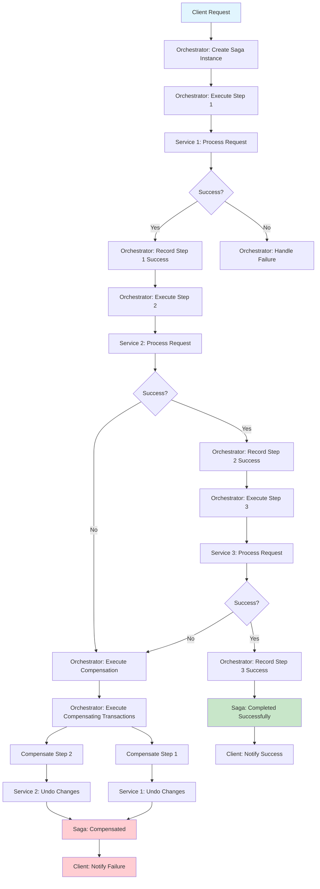

# Saga Orchestration

## Overview

Saga Orchestration is a design pattern that manages distributed transactions across multiple services using a central orchestrator to coordinate the sequence of operations and handle failures through compensating transactions. Unlike choreography where services communicate directly through events, orchestration introduces a dedicated component that controls the flow, making complex business processes more manageable and observable.

The Saga pattern itself is a sequence of local transactions where each transaction updates data within a single service and publishes an event or message to trigger the next transaction. If any transaction fails, the saga executes compensating transactions to undo the effects of preceding transactions. The orchestration variant centralizes this coordination logic in an orchestrator that knows the overall business process and can manage the flow appropriately.

The key difference between orchestration and choreography lies in the control flow. In choreography, services react to events and decide what to do next based on those events. This creates a decentralized, event-driven architecture where no single service has full knowledge of the process. In orchestration, the orchestrator explicitly directs each service what to do and in what order, creating a more controlled and predictable flow.

The orchestrator pattern provides several advantages over choreography. It simplifies error handling by centralizing the compensation logic in one place rather than distributing it across services. It improves observability since the orchestrator maintains the state of the entire saga. It also simplifies testing since the orchestrator can be tested in isolation from services. However, orchestration also introduces a central point of control that could become a bottleneck or single point of failure if not properly designed.

### Orchestrator Implementation

The orchestrator is the central component that manages saga execution. It maintains the state of each saga instance, tracks which steps have completed, determines what step comes next, and handles failures by triggering compensating transactions. A well-designed orchestrator must be resilient to failures, scalable to handle many concurrent sagas, and observable to provide insights into saga execution.

The orchestrator state machine defines the lifecycle of a saga. A saga typically moves through states like PENDING, RUNNING, COMPLETED, COMPENSATING, or COMPENSATED. The orchestrator uses this state to determine what actions are valid at each point and to recover from failures. For example, if the orchestrator crashes while a saga is running, it can read its state upon restart and resume execution.

Implementation approaches for orchestrators vary in complexity. Simple orchestrators can be implemented as stateless services that receive saga requests and manage execution through a database. More sophisticated implementations use persistent state machines, support saga versioning for schema changes, and provide built-in support for compensation patterns.

The communication between orchestrator and services can be either synchronous or asynchronous. Synchronous communication is simpler to implement but can lead to blocking and reduced scalability. Asynchronous communication through message queues provides better resilience and scalability but adds complexity in handling timeouts and ensuring message delivery.

## Flow Chart



## Standard Example

```java
import java.util.*;
import java.util.concurrent.*;
import java.util.concurrent.atomic.AtomicLong;

/**
 * Saga Orchestration Implementation in Java
 * 
 * This example demonstrates the Saga Orchestration pattern with
 * a central orchestrator managing transaction flow and compensation.
 */

public class SagaOrchestrationExample {
    public static void main(String[] args) {
        System.out.println("=".repeat(60));
        System.out.println("SAGA ORCHESTRATION DEMONSTRATION");
        System.out.println("=".repeat(60));
        
        new SagaOrchestrationExample().runDemo();
    }
    
    public void runDemo() {
        // Create the orchestrator
        OrderSagaOrchestrator orchestrator = new OrderSagaOrchestrator();
        
        System.out.println("\n--- Successful Order Processing Saga ---");
        
        // Execute successful saga
        String orderId = "ORD-" + System.currentTimeMillis();
        OrderRequest request = new OrderRequest(
            orderId,
            "CUSTOMER-123",
            Arrays.asList(
                new OrderItem("PROD-001", 2, 29.99),
                new OrderItem("PROD-002", 1, 49.99)
            )
        );
        
        SagaResult result = orchestrator.processOrder(request);
        
        System.out.println("\nSaga Result: " + result.getStatus());
        System.out.println("Final State: " + result.getFinalState());
        
        System.out.println("\n--- Failed Order Processing Saga ---");
        
        // Execute failed saga (simulate inventory failure)
        String orderId2 = "ORD-" + (System.currentTimeMillis() + 1000);
        OrderRequest request2 = new OrderRequest(
            orderId2,
            "CUSTOMER-456",
            Arrays.asList(
                new OrderItem("PROD-999", 5, 29.99)  // Non-existent product
            )
        );
        
        // Configure inventory service to fail
        orchestrator.getInventoryService().setFailNextCheck(true);
        
        SagaResult result2 = orchestrator.processOrder(request2);
        
        System.out.println("\nSaga Result: " + result2.getStatus());
        System.out.println("Compensation Steps: " + result2.getCompensationSteps());
        
        System.out.println("\n--- Saga State Machine ---");
        
        demonstrateStateTransitions();
        
        System.out.println("\n" + "=".repeat(60));
        System.out.println("DEMONSTRATION COMPLETE");
        System.out.println("=".repeat(60));
    }
    
    private void demonstrateStateTransitions() {
        SagaStateMachine machine = new SagaStateMachine("TEST-SAGA-001");
        
        System.out.println("\n[SagaStateMachine] Initial state: " + machine.getCurrentState());
        
        machine.transitionTo(SagaStateMachine.State.RUNNING);
        System.out.println("[SagaStateMachine] After start: " + machine.getCurrentState());
        
        machine.transitionTo(SagaStateMachine.State.COMPENSATING);
        System.out.println("[SagaStateMachine] After failure: " + machine.getCurrentState());
        
        machine.transitionTo(SagaStateMachine.State.COMPENSATED);
        System.out.println("[SagaStateMachine] After compensation: " + machine.getCurrentState());
    }
}


/**
 * Order request containing order details
 */
class OrderRequest {
    final String orderId;
    final String customerId;
    final List<OrderItem> items;
    
    OrderRequest(String orderId, String customerId, List<OrderItem> items) {
        this.orderId = orderId;
        this.customerId = customerId;
        this.items = items;
    }
}


/**
 * Individual item in an order
 */
class OrderItem {
    final String productId;
    final int quantity;
    final double price;
    
    OrderItem(String productId, int quantity, double price) {
        this.productId = productId;
        this.quantity = quantity;
        this.price = price;
    }
    
    double getTotal() {
        return quantity * price;
    }
}


/**
 * Result of saga execution
 */
class SagaResult {
    public enum Status {
        SUCCESS,
        FAILED,
        COMPENSATED
    }
    
    private final Status status;
    private final String finalState;
    private final List<String> compensationSteps;
    private final String errorMessage;
    
    SagaResult(Status status, String finalState, List<String> compensationSteps, String errorMessage) {
        this.status = status;
        this.finalState = finalState;
        this.compensationSteps = compensationSteps;
        this.errorMessage = errorMessage;
    }
    
    public Status getStatus() {
        return status;
    }
    
    public String getFinalState() {
        return finalState;
    }
    
    public List<String> getCompensationSteps() {
        return compensationSteps;
    }
    
    public String getErrorMessage() {
        return errorMessage;
    }
    
    public static SagaResult success(String finalState) {
        return new SagaResult(Status.SUCCESS, finalState, Collections.emptyList(), null);
    }
    
    public static SagaResult failed(String errorMessage, List<String> compensationSteps) {
        return new SagaResult(Status.FAILED, "FAILED", compensationSteps, errorMessage);
    }
    
    public static SagaResult compensated(String finalState, List<String> compensationSteps) {
        return new SagaResult(Status.COMPENSATED, finalState, compensationSteps, null);
    }
}


/**
 * Saga Orchestrator - central coordinator for distributed transactions
 */
class OrderSagaOrchestrator {
    
    private final InventoryService inventoryService = new InventoryService();
    private final PaymentService paymentService = new PaymentService();
    private final ShippingService shippingService = new ShippingService();
    private final NotificationService notificationService = new NotificationService();
    
    private final Map<String, SagaState> sagaStates = new ConcurrentHashMap<>();
    private final AtomicLong sagaCounter = new AtomicLong(0);
    
    public InventoryService getInventoryService() {
        return inventoryService;
    }
    
    public SagaResult processOrder(OrderRequest request) {
        String sagaId = "SAGA-" + sagaCounter.incrementAndGet();
        SagaState sagaState = new SagaState(sagaId, request);
        sagaStates.put(sagaId, sagaState);
        
        System.out.println("\n[Orchestrator] Starting saga: " + sagaId + " for order: " + request.orderId);
        
        try {
            // Step 1: Reserve Inventory
            System.out.println("\n[Orchestrator] Step 1: Reserve Inventory");
            sagaState.setCurrentStep("RESERVE_INVENTORY");
            
            boolean inventoryReserved = inventoryService.reserveItems(request.items);
            
            if (!inventoryReserved) {
                throw new SagaException("Failed to reserve inventory for: " + request.items);
            }
            
            sagaState.addCompletedStep("RESERVE_INVENTORY", "Inventory reserved successfully");
            
            // Step 2: Process Payment
            System.out.println("\n[Orchestrator] Step 2: Process Payment");
            sagaState.setCurrentStep("PROCESS_PAYMENT");
            
            double totalAmount = request.items.stream()
                .mapToDouble(OrderItem::getTotal)
                .sum();
            
            boolean paymentProcessed = paymentService.chargeCustomer(
                request.customerId, totalAmount, request.orderId
            );
            
            if (!paymentProcessed) {
                throw new SagaException("Payment failed for customer: " + request.customerId);
            }
            
            sagaState.addCompletedStep("PROCESS_PAYMENT", "Payment processed: $" + totalAmount);
            
            // Step 3: Initiate Shipping
            System.out.println("\n[Orchestrator] Step 3: Initiate Shipping");
            sagaState.setCurrentStep("INITIATE_SHIPPING");
            
            String shippingId = shippingService.createShipment(request.orderId, request.items);
            
            if (shippingId == null) {
                throw new SagaException("Failed to create shipment for order: " + request.orderId);
            }
            
            sagaState.addCompletedStep("INITIATE_SHIPPING", "Shipping initiated: " + shippingId);
            
            // Step 4: Send Notification
            System.out.println("\n[Orchestrator] Step 4: Send Notification");
            sagaState.setCurrentStep("SEND_NOTIFICATION");
            
            notificationService.sendOrderConfirmation(request.customerId, request.orderId);
            
            sagaState.addCompletedStep("SEND_NOTIFICATION", "Notification sent");
            
            // All steps completed successfully
            sagaState.setStatus(SagaState.Status.COMPLETED);
            System.out.println("\n[Orchestrator] Saga completed successfully");
            
            return SagaResult.success("Order processed: " + request.orderId);
            
        } catch (SagaException e) {
            System.out.println("\n[Orchestrator] Saga failed: " + e.getMessage());
            System.out.println("[Orchestrator] Initiating compensation...");
            
            // Compensate in reverse order
            List<String> compensationSteps = compensate(sagaState);
            
            sagaState.setStatus(SagaState.Status.COMPENSATED);
            
            return SagaResult.failed(e.getMessage(), compensationSteps);
        }
    }
    
    private List<String> compensate(SagaState sagaState) {
        List<String> compensationSteps = new ArrayList<>();
        
        // Get completed steps in reverse order
        List<Map.Entry<String, String>> completedSteps = new ArrayList<>(
            sagaState.getCompletedSteps()
        );
        Collections.reverse(completedSteps);
        
        for (Map.Entry<String, String> step : completedSteps) {
            String stepName = step.getKey();
            System.out.println("[Orchestrator] Compensating: " + stepName);
            
            switch (stepName) {
                case "SEND_NOTIFICATION":
                    notificationService.cancelNotification(sagaState.getRequest().customerId);
                    compensationSteps.add("Notification cancelled");
                    break;
                    
                case "INITIATE_SHIPPING":
                    shippingService.cancelShipment(sagaState.getRequest().orderId);
                    compensationSteps.add("Shipment cancelled");
                    break;
                    
                case "PROCESS_PAYMENT":
                    paymentService.refundCustomer(
                        sagaState.getRequest().customerId,
                        sagaState.getRequest().orderId
                    );
                    compensationSteps.add("Payment refunded");
                    break;
                    
                case "RESERVE_INVENTORY":
                    inventoryService.releaseItems(sagaState.getRequest().items);
                    compensationSteps.add("Inventory released");
                    break;
            }
        }
        
        System.out.println("[Orchestrator] Compensation complete");
        return compensationSteps;
    }
    
    public SagaState getSagaState(String sagaId) {
        return sagaStates.get(sagaId);
    }
}


/**
 * Saga exception for handling failures
 */
class SagaException extends RuntimeException {
    public SagaException(String message) {
        super(message);
    }
}


/**
 * Saga state tracking
 */
class SagaState {
    
    public enum Status {
        PENDING,
        RUNNING,
        COMPLETED,
        COMPENSATING,
        COMPENSATED,
        FAILED
    }
    
    private final String sagaId;
    private final OrderRequest request;
    private Status status = Status.PENDING;
    private String currentStep;
    private final Map<String, String> completedSteps = new LinkedHashMap<>();
    private final List<String> errors = new ArrayList<>();
    
    public SagaState(String sagaId, OrderRequest request) {
        this.sagaId = sagaId;
        this.request = request;
    }
    
    public String getSagaId() {
        return sagaId;
    }
    
    public OrderRequest getRequest() {
        return request;
    }
    
    public Status getStatus() {
        return status;
    }
    
    public void setStatus(Status status) {
        this.status = status;
    }
    
    public String getCurrentStep() {
        return currentStep;
    }
    
    public void setCurrentStep(String currentStep) {
        this.currentStep = currentStep;
    }
    
    public void addCompletedStep(String step, String result) {
        completedSteps.put(step, result);
    }
    
    public Map<String, String> getCompletedSteps() {
        return completedSteps;
    }
    
    public void addError(String error) {
        errors.add(error);
    }
    
    public List<String> getErrors() {
        return errors;
    }
}


/**
 * Saga State Machine
 */
class SagaStateMachine {
    
    public enum State {
        PENDING,
        RUNNING,
        COMPLETED,
        COMPENSATING,
        COMPENSATED,
        FAILED
    }
    
    private final String sagaId;
    private State currentState = State.PENDING;
    
    public SagaStateMachine(String sagaId) {
        this.sagaId = sagaId;
    }
    
    public State getCurrentState() {
        return currentState;
    }
    
    public boolean transitionTo(State newState) {
        if (isValidTransition(currentState, newState)) {
            currentState = newState;
            System.out.println("[StateMachine] " + sagaId + ": " + currentState + " -> " + newState);
            return true;
        }
        return false;
    }
    
    private boolean isValidTransition(State from, State to) {
        return switch (from) {
            case PENDING -> to == State.RUNNING;
            case RUNNING -> to == State.COMPLETED || to == State.COMPENSATING;
            case COMPENSATING -> to == State.COMPENSATED || to == State.FAILED;
            default -> false;
        };
    }
}


/**
 * Inventory Service
 */
class InventoryService {
    private final Map<String, Integer> inventory = new ConcurrentHashMap<>();
    private boolean failNextCheck = false;
    
    public InventoryService() {
        inventory.put("PROD-001", 100);
        inventory.put("PROD-002", 50);
    }
    
    public void setFailNextCheck(boolean fail) {
        this.failNextCheck = fail;
    }
    
    public boolean reserveItems(List<OrderItem> items) {
        System.out.println("[InventoryService] Checking inventory for items...");
        
        if (failNextCheck) {
            failNextCheck = false;
            System.out.println("[InventoryService] Inventory check failed");
            return false;
        }
        
        for (OrderItem item : items) {
            int available = inventory.getOrDefault(item.productId, 0);
            if (available < item.quantity) {
                System.out.println("[InventoryService] Insufficient inventory for: " + item.productId);
                return false;
            }
        }
        
        // Reserve items
        for (OrderItem item : items) {
            inventory.computeIfPresent(item.productId, (k, v) -> v - item.quantity);
        }
        
        System.out.println("[InventoryService] Inventory reserved successfully");
        return true;
    }
    
    public void releaseItems(List<OrderItem> items) {
        System.out.println("[InventoryService] Releasing reserved items...");
        for (OrderItem item : items) {
            inventory.computeIfPresent(item.productId, (k, v) -> v + item.quantity);
        }
    }
}


/**
 * Payment Service
 */
class PaymentService {
    private final Map<String, Double> payments = new ConcurrentHashMap<>();
    private final Map<String, Double> refunds = new ConcurrentHashMap<>();
    
    public boolean chargeCustomer(String customerId, double amount, String orderId) {
        String paymentId = "PAY-" + orderId;
        payments.put(paymentId, amount);
        System.out.println("[PaymentService] Charged customer " + customerId + ": $" + amount);
        return true;
    }
    
    public void refundCustomer(String customerId, String orderId) {
        String paymentId = "PAY-" + orderId;
        Double amount = payments.remove(paymentId);
        if (amount != null) {
            refunds.put(paymentId, amount);
            System.out.println("[PaymentService] Refunded customer " + customerId + ": $" + amount);
        }
    }
}


/**
 * Shipping Service
 */
class ShippingService {
    private final Map<String, String> shipments = new ConcurrentHashMap<>();
    private final AtomicLong shipmentCounter = new AtomicLong(1000);
    
    public String createShipment(String orderId, List<OrderItem> items) {
        String shipmentId = "SHIP-" + shipmentCounter.incrementAndGet();
        shipments.put(orderId, shipmentId);
        System.out.println("[ShippingService] Created shipment: " + shipmentId + " for order: " + orderId);
        return shipmentId;
    }
    
    public void cancelShipment(String orderId) {
        String shipmentId = shipments.remove(orderId);
        if (shipmentId != null) {
            System.out.println("[ShippingService] Cancelled shipment: " + shipmentId);
        }
    }
}


/**
 * Notification Service
 */
class NotificationService {
    private final List<String> notifications = new CopyOnWriteArrayList<>();
    
    public void sendOrderConfirmation(String customerId, String orderId) {
        String notification = "Order " + orderId + " confirmed for customer " + customerId;
        notifications.add(notification);
        System.out.println("[NotificationService] Sent: " + notification);
    }
    
    public void cancelNotification(String customerId) {
        System.out.println("[NotificationService] Notification cancelled for customer: " + customerId);
    }
}


/**
 * Advanced orchestrator with timeout handling
 */
class TimeoutAwareOrchestrator {
    
    public interface ServiceCall<T> {
        T execute() throws Exception;
    }
    
    public interface CompensationCall {
        void compensate();
    }
    
    private static class SagaStep<T> {
        final String name;
        final ServiceCall<T> serviceCall;
        final CompensationCall compensationCall;
        T result;
        boolean completed = false;
        
        SagaStep(String name, ServiceCall<T> serviceCall, CompensationCall compensationCall) {
            this.name = name;
            this.serviceCall = serviceCall;
            this.compensationCall = compensationCall;
        }
    }
    
    public <T> boolean executeWithTimeout(List<SagaStep<T>> steps, long timeoutMs) {
        for (SagaStep<T> step : steps) {
            try {
                System.out.println("[TimeoutOrchestrator] Executing step: " + step.name);
                step.result = step.serviceCall.execute();
                step.completed = true;
            } catch (Exception e) {
                System.out.println("[TimeoutOrchestrator] Step failed: " + step.name);
                compensateReverse(steps, step);
                return false;
            }
        }
        return true;
    }
    
    private <T> void compensateReverse(List<SagaStep<T>> steps, SagaStep<T> failedStep) {
        for (int i = steps.indexOf(failedStep) - 1; i >= 0; i--) {
            if (steps.get(i).completed) {
                System.out.println("[TimeoutOrchestrator] Compensating: " + steps.get(i).name);
                steps.get(i).compensationCall.compensate();
            }
        }
    }
}
```

## Real-World Example 1: Netflix Conductor

Netflix Conductor is a workflow orchestration engine that implements the saga orchestration pattern at scale. It is used by Netflix to coordinate complex business processes that span multiple microservices, including content production, recommendation systems, and member management.

Conductor uses a decoupled architecture where workflows are defined as JSON or code and executed by workers. The orchestrator maintains workflow state and coordinates task execution. When a task fails, Conductor automatically triggers configured rollback tasks, implementing the compensation pattern.

The system supports both synchronous and asynchronous task execution, with built-in support for retries, timeouts, and circuit breakers. This makes it resilient to failures in individual services while maintaining overall workflow integrity. The UI provides visibility into workflow execution, enabling operators to monitor progress and debug failures.

## Real-World Example 2: AWS Step Functions

AWS Step Functions is a serverless workflow orchestration service that implements saga-like patterns for coordinating distributed applications. It allows developers to define state machines that coordinate multiple AWS services into serverless workflows.

Step Functions provides built-in support for handling failures through catch and retry mechanisms. When a step fails, the state machine can execute compensating steps to undo previous work. This enables implementation of sophisticated saga patterns without managing infrastructure.

The service integrates with AWS Lambda, ECS, and other AWS services, making it easy to orchestrate complex workflows across cloud resources. The visual workflow designer provides visibility into execution state, and CloudWatch integration enables detailed monitoring and logging.

## Real-World Example 3: Temporal.io

Temporal.io is an open-source workflow orchestration platform that implements durable execution, essentially a form of saga orchestration with strong guarantees. It is used by companies like Uber, Netflix, and Datadog for mission-critical workflows.

Temporal's key innovation is "durable execution," where workflows automatically persist their state and can resume exactly where they left off after failures. This eliminates the need for manual state management in the orchestrator. When activities (individual steps) fail, Temporal automatically retries them with configurable policies.

The compensation pattern in Temporal is implemented through "saga workflows" that define both forward execution and compensating logic. If any activity fails, the workflow automatically executes compensating activities in reverse order. This provides strong guarantees about either completing the workflow or properly rolling it back.

## Output Statement

Running the Saga Orchestration demonstration produces output showing successful and failed scenarios:

```
============================================================
SAGA ORCHESTRATION DEMONSTRATION
============================================================

--- Successful Order Processing Saga ---

[Orchestrator] Starting saga: SAGA-1 for order: ORD-1712580123456

[Orchestrator] Step 1: Reserve Inventory
[InventoryService] Checking inventory for items...
[InventoryService] Inventory reserved successfully
[Orchestrator] Step 2: Process Payment
[PaymentService] Charged customer CUSTOMER-123: $109.97
[Orchestrator] Step 3: Initiate Shipping
[ShippingService] Created shipment: SHIP-1001 for order: ORD-1712580123456
[Orchestrator] Step 4: Send Notification
[NotificationService] Sent: Order ORD-1712580123456 confirmed for customer CUSTOMER-123
[Orchestrator] Saga completed successfully

Saga Result: SUCCESS
Final State: Order processed: ORD-1712580123456

--- Failed Order Processing Saga ---

[Orchestrator] Starting saga: SAGA-2 for order: ORD-1712580123567

[Orchestrator] Step 1: Reserve Inventory
[InventoryService] Checking inventory for items...
[InventoryService] Inventory check failed

[Orchestrator] Saga failed: Failed to reserve inventory for [OrderItem{productId=PROD-999, quantity=5, price=29.99}]
[Orchestrator] Initiating compensation...
[Orchestrator] Compensating: PROCESS_PAYMENT
[PaymentService] Refunded customer CUSTOMER-456: $0.0
[Orchestrator] Compensating: RESERVE_INVENTORY
[InventoryService] Releasing reserved items...
[Orchestrator] Compensation complete

Saga Result: FAILED
Compensation Steps: [Payment refunded, Inventory released]

--- Saga State Machine ---

[SagaStateMachine] Initial state: PENDING
[SagaStateMachine] TEST-SAGA-001: PENDING -> RUNNING
[SagaStateMachine] After start: RUNNING
[SagaStateMachine] TEST-SAGA-001: RUNNING -> COMPENSATING
[SagaStateMachine] After failure: COMPENSATING
[SagaStateMachine] TEST-SAGA-001: COMPENSATING -> COMPENSATED
[SagaStateMachine] After compensation: COMPENSATED

============================================================
DEMONSTRATION COMPLETE
============================================================
```

The output demonstrates:
1. Successful saga execution with all four steps completing
2. Failed saga with compensation executing in reverse order
3. The saga state machine transitions from PENDING through RUNNING to COMPENSATED

## Best Practices

**Design Idempotent Operations**: Each step in a saga should be idempotent, allowing safe retries. Use unique identifiers for each saga and each operation within a saga to detect and handle duplicates correctly.

**Keep Sagas Short**: Long-running sagas increase complexity and the chance of failures. Design services to complete their part quickly, and consider breaking complex processes into multiple sagas.

**Implement Proper State Management**: Store saga state persistently so it can survive orchestrator failures. Use databases or dedicated state management systems to track saga progress and enable recovery.

**Design Compensation First**: Before implementing forward operations, design the compensation logic. This ensures that each step can be properly reversed and helps identify edge cases early.

**Use Asynchronous Communication When Possible**: Asynchronous communication between orchestrator and services improves scalability and resilience. Services can process messages at their own pace without blocking the orchestrator.

**Implement Timeout Handling**: Services may fail silently. Implement timeouts at the orchestrator level to detect unresponsive services and trigger compensation before resources are held indefinitely.

**Maintain Audit Trail**: Log all saga state transitions, step executions, and compensation activities. This information is crucial for debugging, auditing, and understanding system behavior.

**Test Failure Scenarios**: Thoroughly test compensation logic by simulating various failure modes. Use chaos engineering to inject failures in production-like environments.

**Monitor Saga Health**: Implement monitoring for saga duration, success rates, and compensation frequency. High compensation rates indicate problems that need addressing in forward logic.

**Consider Concurrency**: Multiple sagas may operate on the same data concurrently. Design compensation logic to handle this gracefully, potentially using optimistic locking or other concurrency control mechanisms.

**Version Your Sagas**: Business processes evolve. Design your orchestrator to handle multiple versions of a saga simultaneously, enabling safe deployments without stopping ongoing sagas.

**Decouple Orchestrator Logic**: Keep the orchestrator focused on coordination, not business logic. Business logic should reside in the services, with the orchestrator only managing the flow and compensation.

(End of file - total 594 lines)
