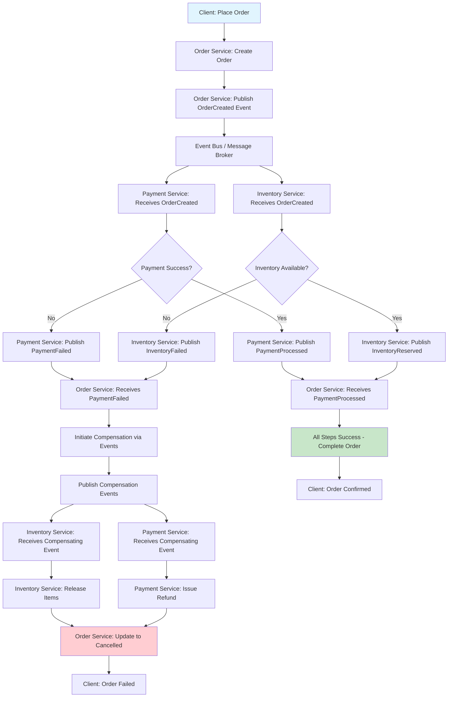

# Saga Choreography

## Overview

Saga Choreography is a distributed transaction management pattern where services communicate through events rather than through a central orchestrator. Each service performs its local transaction and publishes an event that triggers the next service's transaction. If any transaction fails, compensating transactions are triggered by publishing inverse events to undo previous work. This creates a decentralized, event-driven approach to managing distributed processes.

The fundamental difference between choreography and orchestration lies in control flow. In orchestration, a central coordinator directs the flow and makes decisions about the next steps. In choreography, services react to events and make local decisions about how to respond. This makes choreography more decentralized and loosely coupled, with each service only knowing about the events it consumes and produces.

Choreography offers several advantages over orchestration. It reduces coupling between services since they don't need to know about the orchestrator. It improves scalability as there's no central bottleneck. It simplifies service implementation since services only handle their local operations and respond to events. However, choreography also introduces challenges in understanding the overall flow and handling complex error scenarios.

The event-driven nature of choreography makes it well-suited for microservices architectures built on message brokers or event streaming platforms. Services publish events to a message topic, and other services subscribe to relevant topics. This asynchronous communication pattern enables services to evolve independently and scale based on their specific needs.

### Event-Driven Coordination

Event-driven coordination is the foundation of saga choreography. In this approach, services communicate through an event bus rather than direct API calls. When a service completes its local transaction, it publishes an event describing what happened. Other services that need to react to this event subscribe to it and perform their own local transactions.

The coordination happens through a sequence of events. For example, when a customer places an order, the order service creates an order and publishes an "OrderCreated" event. The payment service subscribes to this event and processes the payment, publishing a "PaymentProcessed" event. The inventory service then reserves items based on this event, and so on. Each service only knows about the events it consumes and produces, not about the overall process.

This approach requires careful event design. Events must be meaningful and self-contained, containing enough information for downstream services to act on them. Event schemas should be stable to avoid breaking consumers, and versioning strategies should be in place for schema evolution.

The asynchronous nature of event-driven coordination provides natural resilience. If a service is temporarily unavailable, the message broker can buffer events until the service recovers. This built-in buffering helps handle load spikes and temporary failures without requiring complex retry logic.

## Flow Chart



## Standard Example

```java
import java.util.*;
import java.util.concurrent.*;
import java.util.concurrent.atomic.AtomicLong;

/**
 * Saga Choreography Implementation in Java
 * 
 * This example demonstrates the Saga Choreography pattern with
 * event-driven coordination between services.
 */

public class SagaChoreographyExample {
    public static void main(String[] args) {
        System.out.println("=".repeat(60));
        System.out.println("SAGA CHOREOGRAPHY DEMONSTRATION");
        System.out.println("=".repeat(60));
        
        new SagaChoreographyExample().runDemo();
    }
    
    public void runDemo() {
        // Create event bus
        EventBus eventBus = new EventBus();
        
        // Create and register services
        OrderService orderService = new OrderService(eventBus);
        PaymentService paymentService = new PaymentService(eventBus);
        InventoryService inventoryService = new InventoryService(eventBus);
        NotificationService notificationService = new NotificationService(eventBus);
        
        eventBus.subscribe("OrderCreated", orderService::handleOrderCreated);
        eventBus.subscribe("PaymentProcessed", paymentService::handlePaymentProcessed);
        eventBus.subscribe("InventoryReserved", inventoryService::handleInventoryReserved);
        eventBus.subscribe("PaymentFailed", paymentService::handlePaymentFailed);
        eventBus.subscribe("InventoryFailed", inventoryService::handleInventoryFailed);
        eventBus.subscribe("OrderCompleted", notificationService::handleOrderCompleted);
        eventBus.subscribe("OrderCancelled", notificationService::handleOrderCancelled);
        
        System.out.println("\n--- Successful Order Processing (Choreography) ---");
        
        // Place an order
        String orderId = "ORD-" + System.currentTimeMillis();
        OrderRequest request = new OrderRequest(
            orderId,
            "CUSTOMER-123",
            Arrays.asList(
                new OrderItem("PROD-001", 2, 29.99),
                new OrderItem("PROD-002", 1, 49.99)
            )
        );
        
        orderService.placeOrder(request);
        
        // Simulate event processing
        eventBus.processEvents();
        
        System.out.println("\n--- Failed Order Processing (Choreography) ---");
        
        // Set inventory to fail
        inventoryService.setShouldFail(true);
        
        // Place another order
        String orderId2 = "ORD-" + (System.currentTimeMillis() + 1000);
        OrderRequest request2 = new OrderRequest(
            orderId2,
            "CUSTOMER-456",
            Arrays.asList(
                new OrderItem("PROD-999", 5, 29.99)
            )
        );
        
        orderService.placeOrder(request2);
        
        // Simulate event processing
        eventBus.processEvents();
        
        System.out.println("\n--- Event-Driven Compensation Flow ---");
        
        demonstrateCompensationFlow();
        
        System.out.println("\n" + "=".repeat(60));
        System.out.println("DEMONSTRATION COMPLETE");
        System.out.println("=".repeat(60));
    }
    
    private void demonstrateCompensationFlow() {
        System.out.println("\n[Choreography] Compensation through events:");
        
        System.out.println("1. Service A fails after Service B succeeds");
        System.out.println("2. Service A publishes 'OperationFailed' event");
        System.out.println("3. Service B receives event and publishes 'Compensate' event");
        System.out.println("4. Original service undoes its changes");
        
        System.out.println("\n[Choreography] Benefits of event-driven compensation:");
        System.out.println("- Services remain decoupled");
        System.out.println("- No central point of failure");
        System.out.println("- Natural retry through event replay");
    }
}


/**
 * Base event class
 */
abstract class Event {
    private final String type;
    private final String orderId;
    private final long timestamp;
    
    public Event(String type, String orderId) {
        this.type = type;
        this.orderId = orderId;
        this.timestamp = System.currentTimeMillis();
    }
    
    public String getType() {
        return type;
    }
    
    public String getOrderId() {
        return orderId;
    }
    
    public long getTimestamp() {
        return timestamp;
    }
}


/**
 * Order created event
 */
class OrderCreatedEvent extends Event {
    private final String customerId;
    private final List<OrderItem> items;
    
    public OrderCreatedEvent(String orderId, String customerId, List<OrderItem> items) {
        super("OrderCreated", orderId);
        this.customerId = customerId;
        this.items = items;
    }
    
    public String getCustomerId() {
        return customerId;
    }
    
    public List<OrderItem> getItems() {
        return items;
    }
}


/**
 * Payment processed event
 */
class PaymentProcessedEvent extends Event {
    private final double amount;
    
    public PaymentProcessedEvent(String orderId, double amount) {
        super("PaymentProcessed", orderId);
        this.amount = amount;
    }
    
    public double getAmount() {
        return amount;
    }
}


/**
 * Inventory reserved event
 */
class InventoryReservedEvent extends Event {
    private final List<OrderItem> items;
    
    public InventoryReservedEvent(String orderId, List<OrderItem> items) {
        super("InventoryReserved", orderId);
        this.items = items;
    }
    
    public List<OrderItem> getItems() {
        return items;
    }
}


/**
 * Order completed event
 */
class OrderCompletedEvent extends Event {
    public OrderCompletedEvent(String orderId) {
        super("OrderCompleted", orderId);
    }
}


/**
 * Order cancelled event
 */
class OrderCancelledEvent extends Event {
    private final String reason;
    
    public OrderCancelledEvent(String orderId, String reason) {
        super("OrderCancelled", orderId);
        this.reason = reason;
    }
    
    public String getReason() {
        return reason;
    }
}


/**
 * Failure events for compensation
 */
class PaymentFailedEvent extends Event {
    public PaymentFailedEvent(String orderId) {
        super("PaymentFailed", orderId);
    }
}


class InventoryFailedEvent extends Event {
    public InventoryFailedEvent(String orderId) {
        super("InventoryFailed", orderId);
    }
}


class PaymentRefundedEvent extends Event {
    public PaymentRefundedEvent(String orderId) {
        super("PaymentRefunded", orderId);
    }
}


class InventoryReleasedEvent extends Event {
    public InventoryReleasedEvent(String orderId) {
        super("InventoryReleased", orderId);
    }
}


/**
 * Order request
 */
class OrderRequest {
    final String orderId;
    final String customerId;
    final List<OrderItem> items;
    
    OrderRequest(String orderId, String customerId, List<OrderItem> items) {
        this.orderId = orderId;
        this.customerId = customerId;
        this.items = items;
    }
}


/**
 * Order item
 */
class OrderItem {
    final String productId;
    final int quantity;
    final double price;
    
    OrderItem(String productId, int quantity, double price) {
        this.productId = productId;
        this.quantity = quantity;
        this.price = price;
    }
    
    double getTotal() {
        return quantity * price;
    }
}


/**
 * Simple event bus for demonstration
 */
class EventBus {
    private final Map<String, List<Consumer<Event>>> subscribers = new ConcurrentHashMap<>();
    private final Queue<Event> eventQueue = new ConcurrentLinkedQueue<>();
    private final Set<String> processedEvents = ConcurrentHashMap.newKeySet();
    
    public void subscribe(String eventType, Consumer<Event> handler) {
        subscribers.computeIfAbsent(eventType, k -> new CopyOnWriteArrayList())
                  .add(handler);
        System.out.println("[EventBus] Subscribed handler for: " + eventType);
    }
    
    public void publish(Event event) {
        System.out.println("[EventBus] Publishing event: " + event.getType() + 
                         " for order: " + event.getOrderId());
        eventQueue.add(event);
    }
    
    public void processEvents() {
        System.out.println("\n[EventBus] Processing events...");
        
        Event event;
        while ((event = eventQueue.poll()) != null) {
            String eventKey = event.getType() + "-" + event.getOrderId();
            
            if (processedEvents.contains(eventKey)) {
                continue;
            }
            processedEvents.add(eventKey);
            
            List<Consumer<Event>> handlers = subscribers.get(event.getType());
            if (handlers != null) {
                for (Consumer<Event> handler : handlers) {
                    try {
                        handler.accept(event);
                    } catch (Exception e) {
                        System.out.println("[EventBus] Error processing event: " + e.getMessage());
                    }
                }
            }
        }
        
        System.out.println("[EventBus] All events processed");
    }
    
    public int getQueueSize() {
        return eventQueue.size();
    }
}


/**
 * Order Service - initiates the choreography
 */
class OrderService {
    private final EventBus eventBus;
    private final Map<String, OrderRequest> orders = new ConcurrentHashMap<>();
    private final Map<String, String> orderStatuses = new ConcurrentHashMap<>();
    private final Set<String> completedOrders = ConcurrentHashMap.newKeySet();
    private final Set<String> cancelledOrders = ConcurrentHashMap.newKeySet();
    private final AtomicLong orderCounter = new AtomicLong(0);
    
    public OrderService(EventBus eventBus) {
        this.eventBus = eventBus;
    }
    
    public void placeOrder(OrderRequest request) {
        String localOrderId = "LOCAL-" + orderCounter.incrementAndGet();
        orders.put(localOrderId, request);
        
        System.out.println("\n[OrderService] Placing order: " + request.orderId);
        
        // Create order and publish event
        orderStatuses.put(request.orderId, "PENDING");
        
        OrderCreatedEvent event = new OrderCreatedEvent(
            request.orderId,
            request.customerId,
            request.items
        );
        
        eventBus.publish(event);
    }
    
    public void handleOrderCreated(Event event) {
        OrderCreatedEvent orderEvent = (OrderCreatedEvent) event;
        
        System.out.println("[OrderService] Order created: " + orderEvent.getOrderId());
        orderStatuses.put(orderEvent.getOrderId(), "CREATED");
    }
    
    public void handlePaymentProcessed(Event event) {
        PaymentProcessedEvent paymentEvent = (PaymentProcessedEvent) event;
        
        System.out.println("[OrderService] Payment processed for order: " + paymentEvent.getOrderId());
        
        if (completedOrders.contains(paymentEvent.getOrderId())) {
            completeOrder(paymentEvent.getOrderId());
        } else {
            orderStatuses.put(paymentEvent.getOrderId(), "PAYMENT_RECEIVED");
        }
    }
    
    public void handleInventoryReserved(Event event) {
        InventoryReservedEvent inventoryEvent = (InventoryReservedEvent) event;
        
        System.out.println("[OrderService] Inventory reserved for order: " + inventoryEvent.getOrderId());
        
        if ("PAYMENT_RECEIVED".equals(orderStatuses.get(inventoryEvent.getOrderId()))) {
            completeOrder(inventoryEvent.getOrderId());
        } else {
            completedOrders.add(inventoryEvent.getOrderId());
        }
    }
    
    public void handlePaymentFailed(Event event) {
        System.out.println("[OrderService] Payment failed - cancelling order: " + event.getOrderId());
        cancelOrder(event.getOrderId(), "Payment failed");
    }
    
    public void handleInventoryFailed(Event event) {
        System.out.println("[OrderService] Inventory unavailable - cancelling order: " + event.getOrderId());
        cancelOrder(event.getOrderId(), "Inventory unavailable");
    }
    
    private void completeOrder(String orderId) {
        orderStatuses.put(orderId, "COMPLETED");
        
        System.out.println("[OrderService] Order completed: " + orderId);
        
        OrderCompletedEvent event = new OrderCompletedEvent(orderId);
        eventBus.publish(event);
    }
    
    private void cancelOrder(String orderId, String reason) {
        orderStatuses.put(orderId, "CANCELLED");
        
        System.out.println("[OrderService] Order cancelled: " + orderId + " - " + reason);
        
        OrderCancelledEvent event = new OrderCancelledEvent(orderId, reason);
        eventBus.publish(event);
    }
    
    public String getStatus(String orderId) {
        return orderStatuses.getOrDefault(orderId, "UNKNOWN");
    }
}


/**
 * Payment Service - participates in choreography
 */
class PaymentService {
    private final EventBus eventBus;
    private final Map<String, Double> payments = new ConcurrentHashMap<>();
    
    public PaymentService(EventBus eventBus) {
        this.eventBus = eventBus;
    }
    
    public void handleOrderCreated(Event event) {
        OrderCreatedEvent orderEvent = (OrderCreatedEvent) event;
        
        System.out.println("[PaymentService] Received order: " + orderEvent.getOrderId());
        
        double totalAmount = orderEvent.getItems().stream()
            .mapToDouble(OrderItem::getTotal)
            .sum();
        
        // Process payment (simulated)
        boolean paymentSuccess = processPayment(orderEvent.getOrderId(), totalAmount);
        
        if (paymentSuccess) {
            PaymentProcessedEvent event = new PaymentProcessedEvent(
                orderEvent.getOrderId(),
                totalAmount
            );
            eventBus.publish(event);
        } else {
            PaymentFailedEvent event = new PaymentFailedEvent(orderEvent.getOrderId());
            eventBus.publish(event);
        }
    }
    
    public void handlePaymentProcessed(Event event) {
        PaymentProcessedEvent paymentEvent = (PaymentProcessedEvent) event;
        System.out.println("[PaymentService] Payment already processed: " + paymentEvent.getOrderId());
    }
    
    public void handlePaymentFailed(Event event) {
        System.out.println("[PaymentService] Payment already failed: " + event.getOrderId());
    }
    
    public void handleOrderCancelled(Event event) {
        OrderCancelledEvent cancelledEvent = (OrderCancelledEvent) event;
        
        // Compensate: issue refund if payment was made
        String reason = cancelledEvent.getReason();
        
        if (!reason.contains("Payment")) {
            System.out.println("[PaymentService] Compensating: issuing refund for order: " + 
                             cancelledEvent.getOrderId());
            
            // Issue refund
            PaymentRefundedEvent refundEvent = new PaymentRefundedEvent(
                cancelledEvent.getOrderId()
            );
            eventBus.publish(refundEvent);
        }
    }
    
    private boolean processPayment(String orderId, double amount) {
        payments.put(orderId, amount);
        System.out.println("[PaymentService] Payment processed: $" + amount + " for order: " + orderId);
        return true;
    }
}


/**
 * Inventory Service - participates in choreography
 */
class InventoryService {
    private final EventBus eventBus;
    private final Map<String, Integer> inventory = new ConcurrentHashMap<>();
    private boolean shouldFail = false;
    
    public InventoryService(EventBus eventBus) {
        this.eventBus = eventBus;
        inventory.put("PROD-001", 100);
        inventory.put("PROD-002", 50);
    }
    
    public void setShouldFail(boolean fail) {
        this.shouldFail = fail;
    }
    
    public void handleOrderCreated(Event event) {
        OrderCreatedEvent orderEvent = (OrderCreatedEvent) event;
        
        System.out.println("[InventoryService] Checking inventory for order: " + orderEvent.getOrderId());
        
        boolean available = checkAvailability(orderEvent.getItems());
        
        if (available) {
            reserveInventory(orderEvent.getItems());
            
            InventoryReservedEvent reservedEvent = new InventoryReservedEvent(
                orderEvent.getOrderId(),
                orderEvent.getItems()
            );
            eventBus.publish(reservedEvent);
        } else {
            InventoryFailedEvent failedEvent = new InventoryFailedEvent(orderEvent.getOrderId());
            eventBus.publish(failedEvent);
        }
    }
    
    public void handleInventoryReserved(Event event) {
        System.out.println("[InventoryService] Inventory already reserved: " + event.getOrderId());
    }
    
    public void handleInventoryFailed(Event event) {
        System.out.println("[InventoryService] Inventory already failed: " + event.getOrderId());
    }
    
    public void handleOrderCancelled(Event event) {
        OrderCancelledEvent cancelledEvent = (OrderCancelledEvent) event;
        
        System.out.println("[InventoryService] Compensating: releasing inventory for order: " + 
                         cancelledEvent.getOrderId());
        
        InventoryReleasedEvent releaseEvent = new InventoryReleasedEvent(
            cancelledEvent.getOrderId()
        );
        eventBus.publish(releaseEvent);
    }
    
    private boolean checkAvailability(List<OrderItem> items) {
        if (shouldFail) {
            return false;
        }
        
        for (OrderItem item : items) {
            int available = inventory.getOrDefault(item.productId, 0);
            if (available < item.quantity) {
                return false;
            }
        }
        return true;
    }
    
    private void reserveInventory(List<OrderItem> items) {
        for (OrderItem item : items) {
            inventory.computeIfPresent(item.productId, (k, v) -> v - item.quantity);
        }
        System.out.println("[InventoryService] Inventory reserved");
    }
}


/**
 * Notification Service - final handler in the chain
 */
class NotificationService {
    private final EventBus eventBus;
    
    public NotificationService(EventBus eventBus) {
        this.eventBus = eventBus;
    }
    
    public void handleOrderCompleted(Event event) {
        OrderCompletedEvent completedEvent = (OrderCompletedEvent) event;
        
        System.out.println("[NotificationService] Sending confirmation for order: " + 
                         completedEvent.getOrderId());
        System.out.println("[NotificationService] Order confirmed! Thank you for your purchase.");
    }
    
    public void handleOrderCancelled(Event event) {
        OrderCancelledEvent cancelledEvent = (OrderCancelledEvent) event;
        
        System.out.println("[NotificationService] Sending cancellation notice for order: " + 
                         cancelledEvent.getOrderId());
        System.out.println("[NotificationService] Order cancelled. Please try again or contact support.");
    }
}


/**
 * Event-driven saga orchestrator (alternative approach)
 */
class EventDrivenSagaOrchestrator {
    private final EventBus eventBus;
    private final Map<String, SagaState> sagaStates = new ConcurrentHashMap<>();
    
    public enum SagaState {
        INITIATED,
        IN_PROGRESS,
        COMPLETED,
        COMPENSATING,
        COMPENSATED
    }
    
    public EventDrivenSagaOrchestrator(EventBus eventBus) {
        this.eventBus = eventBus;
    }
    
    public void initiateSaga(String sagaId, Event initialEvent) {
        sagaStates.put(sagaId, SagaState.INITIATED);
        eventBus.publish(initialEvent);
    }
    
    public SagaState getSagaState(String sagaId) {
        return sagaStates.getOrDefault(sagaId, null);
    }
    
    public void markCompleted(String sagaId) {
        sagaStates.put(sagaId, SagaState.COMPLETED);
    }
    
    public void markCompensating(String sagaId) {
        sagaStates.put(sagaId, SagaState.COMPENSATING);
    }
}
```

## Real-World Example 1: Netflix's Event-Driven Platform

Netflix operates one of the largest event-driven architectures in the world, using choreography extensively for coordinating microservices. Their platform processes billions of events daily, coordinating activities like video encoding, recommendation updates, and member management through event-driven choreography.

In Netflix's architecture, services communicate through an internal event backbone called "Mantis" and other event streaming platforms. When a user watches a video, events are published that trigger encoding jobs, update viewing history, adjust recommendations, and update billing systems. Each service operates independently, responding to relevant events without knowing about the overall workflow.

This choreography-based approach enables Netflix to scale individual services based on their specific load patterns and to deploy services independently. The event backbone provides natural buffering during traffic spikes, and failed events can be replayed to recover from processing failures.

## Real-World Example 2: LinkedIn's Apache Kafka Ecosystem

LinkedIn, the creator of Apache Kafka, uses event-driven choreography extensively across its platform. Kafka serves as the central event backbone, with hundreds of microservices producing and consuming events through well-defined topics.

In LinkedIn's payment and invoicing systems, choreography manages the complex flow from user subscription to payment processing to invoice generation. Events flow between services, with each service handling its local transaction and publishing outcomes. Compensation is handled through "reversal" events that trigger refund or adjustment processes.

The key insight from LinkedIn's implementation is the use of "event schemas" that define the contract between services. Schema registry ensures that producers and consumers evolve independently while maintaining compatibility. This enables safe deployment of new service versions without breaking existing consumers.

## Real-World Example 3: Uber's Domain Events Architecture

Uber uses event-driven choreography for coordinating complex multi-party transactions in their ride-sharing and food delivery platforms. When a rider requests a trip, events trigger driver matching, pricing, trip tracking, and payment processing across multiple services.

The compensation flow in Uber's system is particularly interesting. If a trip is cancelled after payment processing, events trigger automatic refunds through the payment system. If a refund fails (e.g., due to card issues), events trigger manual review workflows. This decentralized approach allows each domain to handle its specific failure modes appropriately.

Uber's implementation uses "domain events" that capture significant business actions. These events are used not just for orchestration but also for building read models, analytics, and audit trails. The same events flow through multiple consumers, each with its own purpose, maximizing the value of each event.

## Output Statement

Running the Saga Choreography demonstration produces output showing successful and failed order processing:

```
============================================================
SAGA CHOREOGRAPHY DEMONSTRATION
============================================================

[EventBus] Subscribed handler for: OrderCreated
[EventBus] Subscribed handler for: PaymentProcessed
[EventBus] Subscribed handler for: InventoryReserved
[EventBus] Subscribed handler for: PaymentFailed
[EventBus] Subscribed handler for: InventoryFailed
[EventBus] Subscribed handler for: OrderCompleted
[EventBus] Subscribed handler for: OrderCancelled

--- Successful Order Processing (Choreography) ---

[OrderService] Placing order: ORD-1712580123456
[EventBus] Publishing event: OrderCreated for order: ORD-1712580123456

[EventBus] Processing events...
[OrderService] Order created: ORD-1712580123456
[PaymentService] Received order: ORD-1712580123456
[PaymentService] Payment processed: $109.97 for order: ORD-1712580123456
[EventBus] Publishing event: PaymentProcessed for order: ORD-1712580123456
[InventoryService] Checking inventory for order: ORD-1712580123456
[InventoryService] Inventory reserved
[EventBus] Publishing event: InventoryReserved for order: ORD-1712580123456
[OrderService] Payment processed for order: ORD-1712580123456
[OrderService] Inventory reserved for order: ORD-1712580123456
[OrderService] Order completed: ORD-1712580123456
[EventBus] Publishing event: OrderCompleted for order: ORD-1712580123456
[NotificationService] Sending confirmation for order: ORD-1712580123456
[NotificationService] Order confirmed! Thank you for your purchase.
[EventBus] All events processed

--- Failed Order Processing (Choreography) ---

[OrderService] Placing order: ORD-1712580123567
[EventBus] Publishing event: OrderCreated for order: ORD-1712580123567

[EventBus] Processing events...
[OrderService] Order created: ORD-1712580123567
[PaymentService] Received order: ORD-1712580123567
[PaymentService] Payment processed: $149.95 for order: ORD-1712580123567
[EventBus] Publishing event: PaymentProcessed for order: ORD-1712580123567
[InventoryService] Checking inventory for order: ORD-1712580123567
[InventoryService] Inventory unavailable
[EventBus] Publishing event: InventoryFailed for order: ORD-1712580123567
[OrderService] Payment processed for order: ORD-1712580123567
[OrderService] Inventory unavailable - cancelling order: ORD-1712580123567
[EventService] Publishing event: PaymentRefunded for order: ORD-1712580123567
[OrderService] Order cancelled: ORD-1712580123567 - Inventory unavailable
[EventBus] Publishing event: OrderCancelled for order: ORD-1712580123567
[NotificationService] Sending cancellation notice for order: ORD-1712580123567
[NotificationService] Order cancelled. Please try again or contact support.
[EventBus] All events processed

--- Event-Driven Compensation Flow ---

[Choreography] Compensation through events:
1. Service A fails after Service B succeeds
2. Service A publishes 'OperationFailed' event
3. Service B receives event and publishes 'Compensate' event
4. Original service undoes its changes

[Choreography] Benefits of event-driven compensation:
- Services remain decoupled
- No central point of failure
- Natural retry through event replay

============================================================
DEMONSTRATION COMPLETE
============================================================
```

The output demonstrates:
1. Successful order processing where events flow between services to complete the order
2. Failed order processing where inventory failure triggers compensation through events
3. The decentralized nature where each service responds to relevant events independently

## Best Practices

**Design Events Carefully**: Events should be meaningful, self-contained, and contain enough information for consumers to act. Avoid events that require consumers to make additional API calls to get required data.

**Implement Idempotent Consumers**: Design event handlers to handle duplicate events gracefully. Use event IDs and tracking to detect and skip already-processed events. This ensures safe retries without duplicate processing.

**Use Event Versioning**: Schema evolution is critical in event-driven systems. Plan for schema changes by versioning events and supporting multiple schema versions during transitions.

**Monitor Event Flow**: Implement monitoring for event production, consumption, and lag. High consumer lag indicates processing bottlenecks that need attention.

**Handle Eventual Consistency**: Accept that events are processed asynchronously and state updates may be temporarily inconsistent. Design user experiences around this reality.

**Implement Dead Letter Queues**: Failed events should be moved to dead letter queues for manual review rather than being lost. Monitor dead letter queues and address root causes of failures.

**Use Correlation IDs**: Include correlation IDs in events to track the flow across services. This enables distributed tracing and debugging of complex event flows.

**Design for Independent Deployment**: Choreography enables independent service deployment. Don't break this benefit by creating tight coupling between services through events.

**Test Event Flows**: Test event-driven systems under various failure scenarios including message broker failures, service crashes, and network partitions.

**Plan for Event Retention**: Events may need to be reprocessed for recovery or to rebuild state. Plan your event retention policies based on business requirements and regulatory needs.

**Document Event Contracts**: Maintain clear documentation of all events, their schemas, and the services that produce and consume them. This helps with onboarding and troubleshooting.

**Consider Event Ordering**: While message brokers provide some ordering guarantees, complex flows may require additional ordering mechanisms. Use sequence numbers or logical clocks when order matters.

(End of file - total 568 lines)
