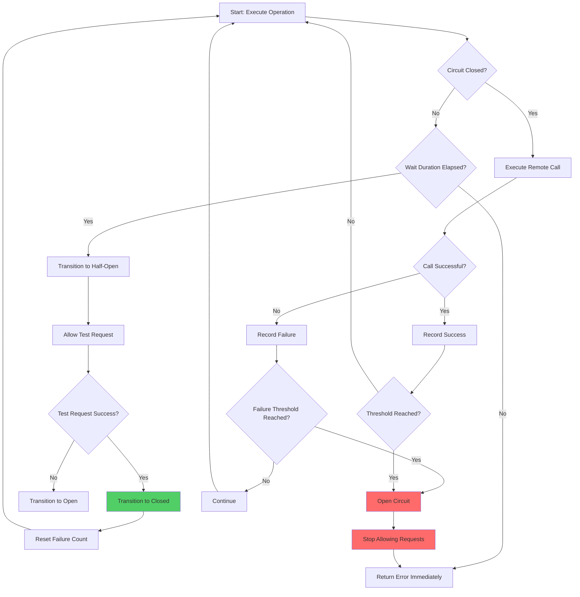

# Circuit Breaker Pattern

## Overview

The Circuit Breaker pattern is a resilience design pattern that prevents an application from performing operations that are likely to fail. It wraps calls to remote services in a circuit breaker object that monitors for failures. Once failures reach a certain threshold, the circuit breaker trips, and all subsequent calls fail immediately without attempting the remote operation.

The pattern draws inspiration from electrical circuit breakers, which prevent damage from power surges by interrupting the flow of electricity. In software systems, it prevents cascading failures by stopping requests to failing services and allowing them time to recover.

### Key Concepts

**States of Circuit Breaker:**

1. **Closed State**: The circuit breaker is closed, meaning requests flow through normally. It counts failures, and if failures exceed the threshold, it transitions to the Open state.

2. **Open State**: The circuit breaker is open, meaning requests fail immediately without attempting the remote call. This allows the failing service time to recover. After a timeout period, it transitions to Half-Open state.

3. **Half-Open State**: The circuit breaker allows a limited number of requests to test if the service has recovered. If these requests succeed, the circuit transitions to Closed. If they fail, it transitions back to Open.

### Failure Threshold Configuration

The circuit breaker makes decisions based on several configurable parameters:

- **Failure Threshold**: The percentage or count of failures that trigger the circuit to open
- **Success Threshold**: The number of consecutive successes required to close the circuit from Half-Open state
- **Wait Duration**: The time to wait before transitioning from Open to Half-Open state
- **Sliding Window**: The time window used to count failures (sliding or counting)

## Flow Chart



## Standard Example (Java with Resilience4j)

### Maven Dependencies

```xml
<dependency>
    <groupId>io.github.resilience4j</groupId>
    <artifactId>resilience4j-circuitbreaker</artifactId>
    <version>2.2.0</version>
</dependency>
<dependency>
    <groupId>io.github.resilience4j</groupId>
    <artifactId>resilience4j-micrometer</artifactId>
    <version>2.2.0</version>
</dependency>
```

### Basic Circuit Breaker Configuration

```java
import io.github.resilience4j.circuitbreaker.CircuitBreaker;
import io.github.resilience4j.circuitbreaker.CircuitBreakerConfig;
import io.github.resilience4j.circuitbreaker.CircuitBreakerRegistry;
import java.time.Duration;
import java.util.function.Supplier;

public class CircuitBreakerExample {

    public static void main(String[] args) {
        // Create custom circuit breaker configuration
        CircuitBreakerConfig config = CircuitBreakerConfig.custom()
            // Number of failures before opening the circuit
            .failureRateThreshold(50)
            // Minimum number of calls to evaluate failure rate
            .slowCallRateThreshold(100)
            .slowCallDurationThreshold(Duration.ofSeconds(2))
            // Wait time before transitioning from Open to Half-Open
            .waitDurationInOpenState(Duration.ofSeconds(30))
            // Number of calls in Half-Open state to determine if circuit closes
            .permittedNumberOfCallsInHalfOpenState(3)
            // Sliding window size for recording calls
            .slidingWindowSize(10)
            // Minimum number of calls required to calculate failure rate
            .minimumNumberOfCalls(5)
            // Whether to record exceptions as failures
            .recordExceptions(IOException.class, TimeoutException.class)
            // Ignore certain exceptions
            .ignoreExceptions(BusinessException.class)
            .build();

        // Create registry and circuit breaker
        CircuitBreakerRegistry registry = CircuitBreakerRegistry.of(config);
        CircuitBreaker circuitBreaker = registry.circuitBreaker("paymentService");

        // Decorate and execute the operation
        String result = executeWithCircuitBreaker(circuitBreaker, () -> {
            // This is the remote service call
            return callPaymentService();
        });

        System.out.println("Result: " + result);
    }

    private static <T> T executeWithCircuitBreaker(
            CircuitBreaker circuitBreaker, 
            Supplier<T> operation) {
        
        // Decorate the supplier with circuit breaker
        Supplier<T> decoratedSupplier = CircuitBreaker
            .decorateSupplier(circuitBreaker, operation);

        try {
            // Execute the decorated supplier
            return decoratedSupplier.get();
        } catch (CircuitBreakerOpenException e) {
            // Circuit is open - return fallback or throw
            System.out.println("Circuit breaker is OPEN - service unavailable");
            throw new ServiceUnavailableException("Payment service unavailable");
        } catch (Exception e) {
            // Other exceptions are recorded as failures
            System.out.println("Call failed: " + e.getMessage());
            throw e;
        }
    }

    private static String callPaymentService() throws IOException {
        // Simulate remote service call
        throw new IOException("Connection refused");
    }
}
```

### Spring Boot Integration

```java
import io.github.resilience4j.circuitbreaker.annotation.CircuitBreaker;
import org.springframework.stereotype.Service;
import org.springframework.web.client.RestTemplate;

@Service
public class PaymentService {

    private final RestTemplate restTemplate = new RestTemplate();

    @CircuitBreaker(name = "paymentCircuitBreaker", fallbackMethod = "fallbackPayment")
    public PaymentResult processPayment(PaymentRequest request) {
        // Make REST call to payment service
        String response = restTemplate.postForObject(
            "http://payment-service/api/payments",
            request,
            String.class
        );
        return new PaymentResult(response);
    }

    // Fallback method when circuit is open or call fails
    private PaymentResult fallbackPayment(PaymentRequest request, Exception e) {
        System.out.println("Fallback triggered for payment: " + e.getMessage());
        // Return a default response or queue for later processing
        return new PaymentResult("PAYMENT_QUEUED", "Payment queued for retry");
    }
}

// Circuit Breaker Configuration in application.yml
/*
resilience4j.circuitbreaker:
  instances:
    paymentCircuitBreaker:
      registerHealthIndicator: true
      slidingWindowSize: 10
      minimumNumberOfCalls: 5
      failureRateThreshold: 50
      waitDurationInOpenState: 30s
      permittedNumberOfCallsInHalfOpenState: 3
      slidingWindowType: COUNT_BASED
      recordExceptions:
        - java.io.IOException
        - java.util.concurrent.TimeoutException
*/
```

### Event Listeners and Monitoring

```java
import io.github.resilience4j.circuitbreaker.CircuitBreaker;
import io.github.resilience4j.circuitbreaker.event.CircuitBreakerEvent;

public class CircuitBreakerMonitor {

    public static void registerEventListener(CircuitBreaker circuitBreaker) {
        // Register event consumer for state transitions
        circuitBreaker.getEventPublisher()
            .onStateTransition(event -> {
                System.out.println("Circuit State Transition: " + 
                    event.getStateTransition());
                System.out.println("Timestamp: " + event.getCreationTime());
            })
            .onFailureRateExceeded(event -> {
                System.out.println("Failure rate exceeded: " + 
                    event.getFailureRate() + "%");
                System.out.println("Circuit opened at: " + event.getCreationTime());
            })
            .onCallNotPermitted(event -> {
                System.out.println("Call not permitted - circuit is OPEN");
            })
            .onSuccess(event -> {
                System.out.println("Successful call - duration: " + 
                    event.getDuration());
            })
            .onFailure(event -> {
                System.out.println("Failed call: " + event.getThrowable().getMessage());
            });
    }
}
```

## Real-World Examples

### Netflix Hystrix

Netflix Hystrix was the pioneer implementation of the Circuit Breaker pattern in Java. Although now in maintenance mode, it influenced many modern implementations.

```java
// Netflix Hystrix Example (Legacy - for reference)
@HystrixCommand(
    commandKey = "getCustomer",
    groupKey = "customer-service",
    fallbackMethod = "getCustomerFallback",
    threadPoolKey = "customerThreadPool",
    commandProperties = {
        @HystrixProperty(name = "execution.isolation.thread.timeoutInMilliseconds", value = "3000"),
        @HystrixProperty(name = "circuitBreaker.requestVolumeThreshold", value = "20"),
        @HystrixProperty(name = "circuitBreaker.sleepWindowInMilliseconds", value = "5000"),
        @HystrixProperty(name = "circuitBreaker.errorThresholdPercentage", value = "50")
    },
    threadPoolProperties = {
        @HystrixProperty(name = "coreSize", value = "30"),
        @HystrixProperty(name = "maxQueueSize", value = "10),
        @HystrixProperty(name = "queueSizeRejectionThreshold", value = "8)
    }
)
public Customer getCustomer(String customerId) {
    return restTemplate.getForObject(
        "http://customer-service/customers/" + customerId,
        Customer.class
    );
}

private Customer getCustomerFallback(String customerId, Throwable e) {
    // Return cached data or default customer
    return new Customer(customerId, "Unknown", "N/A");
}
```

### Spring Cloud Circuit Breaker

```java
import org.springframework.cloud.client.circuitbreaker.CircuitBreaker;
import org.springframework.cloud.client.circuitbreaker.CircuitBreakerFactory;
import org.springframework.web.bind.annotation.GetMapping;
import org.springframework.web.bind.annotation.RestController;
import java.time.Duration;

@RestController
public class ProductController {

    private final CircuitBreakerFactory circuitBreakerFactory;

    public ProductController(CircuitBreakerFactory circuitBreakerFactory) {
        this.circuitBreakerFactory = circuitBreakerFactory;
    }

    @GetMapping("/products/{id}")
    public Product getProduct(String id) {
        CircuitBreaker circuitBreaker = circuitBreakerFactory.create("productCircuit");
        
        return circuitBreaker.run(
            () -> productService.getProduct(id),
            throwable -> productService.getDefaultProduct(id) // Fallback
        );
    }
}
```

### Microservice Architecture Integration

In a typical microservices architecture, the Circuit Breaker pattern is implemented at the service client level:

1. **API Gateway**: Circuit breakers protect backend services from overload
2. **Service-to-Service Calls**: Each service uses circuit breakers when calling other services
3. **Database Connections**: Connection pools use circuit breaker logic for database resilience
4. **External API Clients**: Third-party API integrations are wrapped with circuit breakers

## Output Statement

The Circuit Breaker pattern provides critical protection against cascading failures in distributed systems by:

- **Failure Isolation**: Preventing failures in one service from affecting others
- **Quick Fail-Fast**: Returning errors immediately when services are unhealthy rather than waiting for timeouts
- **Self-Healing**: Automatically testing service recovery without overwhelming the system
- **Visibility**: Providing metrics and events for monitoring system health

By implementing proper failure thresholds, wait durations, and fallback mechanisms, applications can maintain availability and resilience even when dependent services experience issues.

## Best Practices

1. **Configure Appropriate Thresholds**: Set failure rate thresholds based on service criticality and typical failure patterns. Don't set too aggressive thresholds that cause unnecessary circuit openings.

2. **Implement Meaningful Fallbacks**: Always provide fallback methods that return degraded but useful responses rather than propagating errors.

3. **Monitor Circuit State**: Track circuit breaker state changes, failure rates, and success rates in your monitoring systems.

4. **Use Appropriate Timeouts**: Configure both circuit breaker wait durations and the underlying call timeouts to allow services time to recover.

5. **Test Circuit Behavior**: Regularly test circuit breaker behavior in staging environments to ensure it behaves as expected.

6. **Gradual Rollout**: When deploying new services or configurations, start with relaxed circuit breaker settings and tighten them based on observed behavior.

7. **Avoid Distributed State**: Don't share circuit breaker state across multiple instances; each instance should maintain its own state based on local metrics.

8. **Combine with Other Patterns**: Use circuit breakers alongside bulkhead patterns, timeouts, and retry mechanisms for comprehensive resilience.

9. **Document Circuit Behavior**: Ensure operations teams understand circuit breaker behavior and know how to manually override circuits if needed.

10. **Set Appropriate Sliding Windows**: Choose between count-based and time-based sliding windows based on your traffic patterns.
