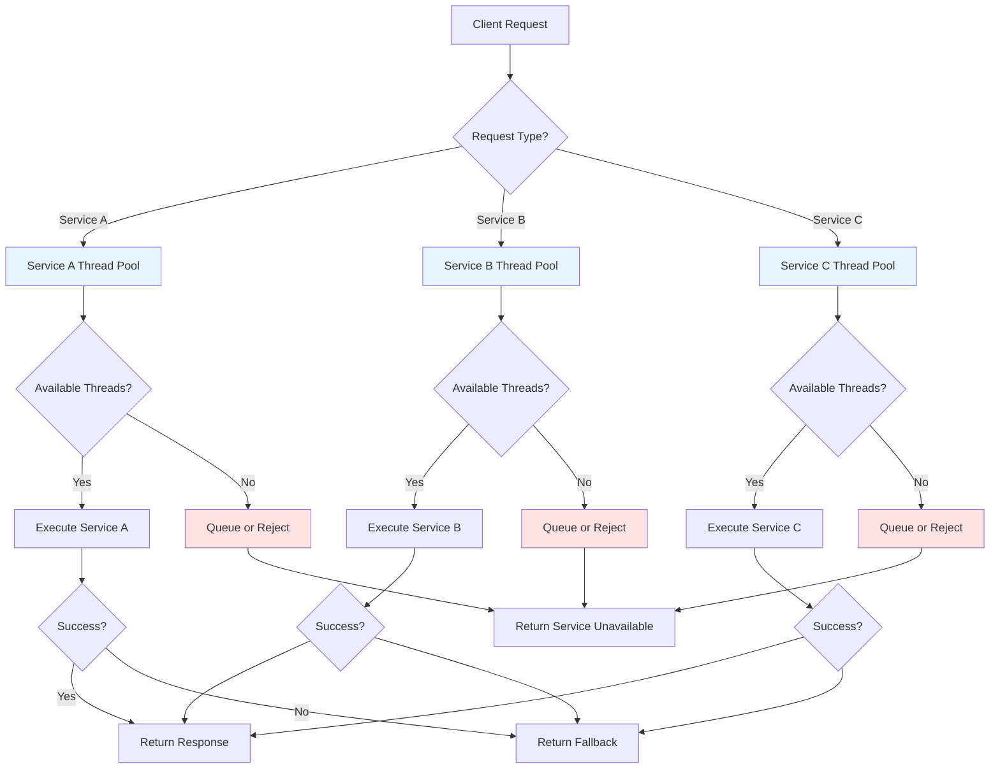

# Bulkhead Pattern
## Overview
The Bulkhead pattern is a resilience design pattern that isolates elements of an application into pools so that if one element fails, the others continue to function. Named after the watertight compartments in ships (bulkheads), this pattern prevents a failure in one part of the system from bringing down the entire application.
In microservices architectures, bulkheads isolate different service calls, preventing a single slow or failing service from consuming all available resources and affecting other parts of the application.
### Key Concepts
**Thread Pool Isolation**: Each remote service call uses a dedicated thread pool with a limited number of threads. If one service's pool is exhausted, other services remain unaffected.
**Connection Pool Isolation**: Database and external service connections are managed in separate pools to prevent one service from monopolizing all available connections.
**Process Isolation**: Critical components run in separate processes or containers for maximum isolation.
### Isolation Strategies
1. **Horizontal Isolation**: Different services run in separate containers or processes
2. **Vertical Isolation**: Different service functions use separate thread pools within the same process
3. **Hybrid Isolation**: Combination of both horizontal and vertical strategies
## Flow Chart

## Standard Example (Java)
### Maven Dependencies
```xml
<dependency>
    <groupId>io.github.resilience4j</groupId>
    <artifactId>resilience4j-bulkhead</artifactId>
    <version>2.2.0</version>
</dependency> 
```
### Thread Pool Bulkhead Implementation
```java
import io.github.resilience4j.bulkhead.Bulkhead;
import io.github.resilience4j.bulkhead.BulkheadConfig;
import io.github.resilience4j.bulkhead.BulkheadRegistry;
import io.github.resilience4j.bulkhead.ThreadPoolBulkhead;
import io.github.resilience4j.bulkhead.ThreadPoolBulkheadConfig;
import java.util.concurrent.*;
import java.util.function.Supplier;
public class BulkheadExample {
    private static final int CORE_POOL_SIZE = 10;
    private static final int MAX_POOL_SIZE = 20;
    private static final int QUEUE_CAPACITY = 100;
    private static final int TIMEOUT_SECONDS = 5;
    
    public static void main(String[] args) throws Exception {
        // Create custom thread pool for payment service
        ExecutorService paymentExecutor = new ThreadPoolExecutor(
            CORE_POOL_SIZE, MAX_POOL_SIZE, 60L, TimeUnit.SECONDS,
            new LinkedBlockingQueue<>(QUEUE_CAPACITY),
            new ThreadPoolExecutor.CallerRunsPolicy()
        );
        
        // Create thread pool for user service
        ExecutorService userExecutor = new ThreadPoolExecutor(
            CORE_POOL_SIZE, MAX_POOL_SIZE, 60L, TimeUnit.SECONDS,
            new LinkedBlockingQueue<>(QUEUE_CAPACITY),
            new ThreadPoolExecutor.CallerRunsPolicy()
        );
        
        // Use Resilience4j Thread Pool Bulkhead
        ThreadPoolBulkheadConfig config = ThreadPoolBulkheadConfig.custom()
            .maxThreadPoolSize(10)
            .coreThreadPoolSize(5)
            .queueCapacity(100)
            .keepAliveDuration(20, TimeUnit.SECONDS)
            .build();
        
        ThreadPoolBulkheadRegistry registry = ThreadPoolBulkheadRegistry.of(config);
        ThreadPoolBulkhead paymentBulkhead = registry.bulkhead("paymentService");
        
        // Execute with bulkhead protection
        String result = executeWithBulkhead(paymentBulkhead, paymentExecutor, () -> {
            return callPaymentService();
        });
        
        paymentExecutor.shutdown();
        userExecutor.shutdown();
    }
    
    private static <T> T executeWithBulkhead(
            ThreadPoolBulkhead bulkhead, 
            ExecutorService executor,
            Callable<T> operation) throws Exception {
        
        Supplier<T> decoratedSupplier = ThreadPoolBulkhead.decorateCallable(
            bulkhead, executor, operation);
        
        try {
            return decoratedSupplier.get();
        } catch (BulkheadFullException e) {
            System.out.println("Bulkhead full - rejecting request");
            throw new ServiceRejectedException("Service is busy, please try again");
        }
    }
    
    private static String callPaymentService() throws InterruptedException {
        Thread.sleep(1000);
        return "Payment processed successfully";
    }
}
``` 
### Semaphore-Based Bulkhead (Lightweight Isolation)
```java
import io.github.resilience4j.bulkhead.Bulkhead;
import io.github.resilience4j.bulkhead.BulkheadConfig;
import io.github.resilience4j.bulkhead.BulkheadFullException;
public class SemaphoreBulkheadExample {
    private final Bulkhead paymentServiceBulkhead;
    private final Bulkhead inventoryServiceBulkhead;
    private final Bulkhead notificationServiceBulkhead;
    
    public SemaphoreBulkheadExample() {
        // Configure bulkhead for each service
        BulkheadConfig paymentConfig = BulkheadConfig.custom()
            .maxConcurrentCalls(50)           // Maximum parallel executions
            .maxWaitDuration(500)              // Milliseconds to wait for slot
            .intervalFunction(IntervalFunction.ofDefaults())
            .build();
        
        BulkheadConfig inventoryConfig = BulkheadConfig.custom()
            .maxConcurrentCalls(30)
            .maxWaitDuration(500)
            .build();
        
        BulkheadConfig notificationConfig = BulkheadConfig.custom()
            .maxConcurrentCalls(100)
            .maxWaitDuration(100)
            .build();
        
        paymentServiceBulkhead = Bulkhead.of("paymentService", paymentConfig);
        inventoryServiceBulkhead = Bulkhead.of("inventoryService", inventoryConfig);
        notificationServiceBulkhead = Bulkhead.of("notificationService", notificationConfig);
    }
    
    public String processPayment(Order order) {
        return Bulkhead.decorateSupplier(paymentServiceBulkhead, () -> {
            return paymentClient.charge(order);
        }).get();
    }
    
    public InventoryResult checkInventory(String productId) {
        return Bulkhead.decorateSupplier(inventoryServiceBulkhead, () -> {
            return inventoryClient.checkStock(productId);
        }).get();
    }
    
    public void sendNotification(String userId, String message) {
        Bulkhead.executeSupplier(notificationServiceBulkhead, () -> {
            notificationClient.send(userId, message);
            return null;
        });
    }
}
``` 
### Spring Boot Integration
```java
import io.github.resilience4j.bulkhead.decorator.BulkheadDecorator;
import org.springframework.stereotype.Service;
import java.util.concurrent.CompletableFuture;
import org.springframework.web.client.RestTemplate;
@Service
public class OrderService {
    private final RestTemplate restTemplate;
    private final BulkheadRegistry bulkheadRegistry;
    
    public OrderService(BulkheadRegistry bulkheadRegistry) {
        this.restTemplate = new RestTemplate();
        this.bulkheadRegistry = bulkheadRegistry;
    }
    
    // Method-level bulkhead configuration
    @Bulkhead(name = "paymentService", fallbackMethod = "paymentFallback")
    public PaymentResult processPayment(Order order) {
        String response = restTemplate.postForObject(
            "http://payment-service/api/charge",
            order,
            String.class
        );
        return new PaymentResult(response);
    }
    
    // Async bulkhead
    @Bulkhead(name = "notificationService", fallbackMethod = "notificationFallback")
    public CompletableFuture<String> sendNotificationAsync(String message) {
        return CompletableFuture.supplyAsync(() -> {
            return notificationClient.send(message);
        });
    }
    
    private PaymentResult paymentFallback(Order order, Throwable t) {
        return new PaymentResult("PENDING", "Payment queued for processing");
    }
    
    private CompletableFuture<String> notificationFallback(String message, Throwable t) {
        return CompletableFuture.completedFuture("NOTIFICATION_QUEUED");
    }
}
// Configuration in application.yml
/*
resilience4j.bulkhead:
  instances:
    paymentService:
      maxConcurrentCalls: 50
      maxWaitDuration: 500ms
      eventConsumerBufferSize: 100
    inventoryService:
      maxConcurrentCalls: 30
      maxWaitDuration: 300ms
    notificationService:
      maxConcurrentCalls: 100
      maxWaitDuration: 1s
*/
``` 
### Circuit Breaker with Bulkhead Combination
```java
import io.github.resilience4j.circuitbreaker.CircuitBreaker;
import io.github.resilience4j.bulkhead.Bulkhead;
import io.github.resilience4j.circuitbreaker.CircuitBreakerConfig;
import io.github.resilience4j.bulkhead.BulkheadConfig;
public class CombinedResilienceExample {
    
    public String callServiceWithAllProtections(String serviceName) {
        // Create circuit breaker
        CircuitBreakerConfig cbConfig = CircuitBreakerConfig.custom()
            .failureRateThreshold(50)
            .waitDurationInOpenState(30, TimeUnit.SECONDS)
            .build();
        CircuitBreaker circuitBreaker = CircuitBreaker.of(serviceName, cbConfig);
        
        // Create bulkhead
        BulkheadConfig bhConfig = BulkheadConfig.custom()
            .maxConcurrentCalls(20)
            .maxWaitDuration(1, TimeUnit.SECONDS)
            .build();
        Bulkhead bulkhead = Bulkhead.of(serviceName, bhConfig);
        
        // Decorate with bulkhead first, then circuit breaker
        Supplier<String> decorated = Decorators
            .ofSupplier(() -> remoteService.call())
            .withBulkhead(bulkhead)
            .withCircuitBreaker(circuitBreaker)
            .withFallback(List.of(Exception.class), e -> "Fallback response")
            .decorate();
        
        return decorated.get();
    }
}
``` 
## Real-World Examples
### Netflix Hystrix Bulkhead
```java
@HystrixCommand(    commandKey = "getUserData",    groupKey = "user-service",    threadPoolKey = "userThreadPool",    threadPoolProperties = {
        @HystrixProperty(name = "coreSize", value = "30"),
        @HystrixProperty(name = "maxQueueSize", value = "100"),
        @HystrixProperty(name = "queueSizeRejectionThreshold", value = "80"),
        @HystrixProperty(name = "keepAliveTimeMinutes", value = "1")
    })
public UserData getUserData(String userId) {
    return restTemplate.getForObject(
        "http://user-service/users/" + userId,
        UserData.class    );
}
``` 
### Connection Pool Examples
```xml
<dependency>
    <groupId>com.zaxxer</groupId>
    <artifactId>HikariCP</artifactId>
    <version>5.0.1</version>
</dependency> 
``` 
```java
// HikariCP configuration for database connection pooling
HikariConfig config = new HikariConfig();config.setJdbcUrl("jdbc:mysql://localhost:3306/mydb");
config.setUsername("user");
config.setPassword("password");config.setMaximumPoolSize(20);  // Bulkhead: max connectionsconfig.setMinimumIdle(5);               // Minimum idle connectionsconfig.setConnectionTimeout(30000);     // Connection timeoutconfig.setIdleTimeout(600000);           // Idle timeoutconfig.setMaxLifetime(1800000);         // Max lifetime
HikariDataSource dataSource = new HikariDataSource(config); 
```
## Output Statement
The Bulkhead pattern provides essential resource isolation in distributed systems by: 
- **Failure Isolation**: Preventing one failing service from consuming all system resources 
- **Resource Protection**: Ensuring each service has dedicated resources available 
- **Graceful Degradation**: Maintaining partial functionality when some services fail 
- **Predictable Performance**: Providing consistent response times by queuing or rejecting excess requests 
Implementing bulkheads with appropriate thread pool sizes, queue capacities, and timeout configurations ensures that applications remain stable even under heavy load or when downstream services experience issues. 
## Best Practices
1. **Size Thread Pools Appropriately**: Calculate pool sizes based on expected concurrency, response times, and available resources.
2. **Monitor Queue Sizes**: Track queue depths and rejection rates to detect capacity issues early.
3. **Set Appropriate Timeouts**: Configure both wait timeouts and execution timeouts for bulkhead-protected operations.
4. **Use Fallback Mechanisms**: Always provide fallback responses when bulkheads reject requests.
5. **Isolate Critical Services**: Assign dedicated thread pools to critical services that must remain available.
6. **Avoid Shared Pools**: Don't share thread pools across different services to ensure true isolation.
7. **Tune Based on Load Testing**: Adjust bulkhead parameters based on actual load testing results.
8. **Implement Health Checks**: Expose bulkhead metrics for monitoring and alerting.
9. **Use Circuit Breakers with Bulkheads**: Combine bulkhead and circuit breaker patterns for comprehensive resilience.
10. **Consider Async Processing**: Use async patterns with bulkheads to improve resource utilization.
