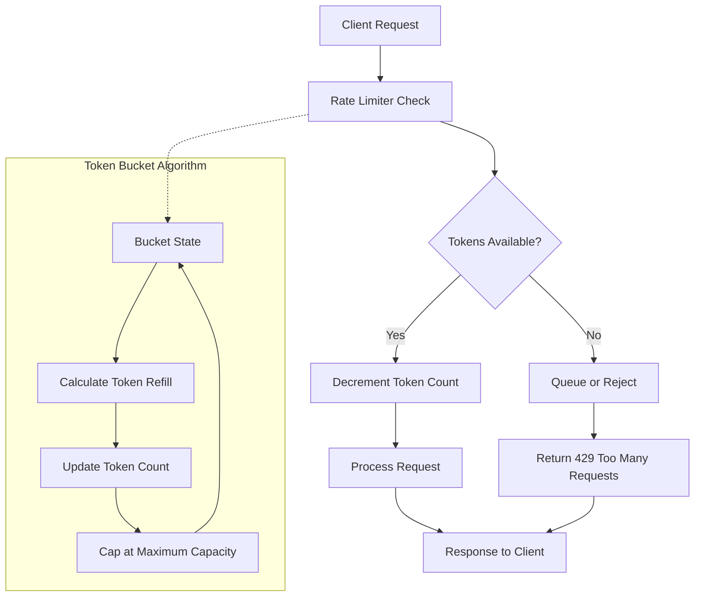

# Rate Limiting Pattern

## Overview

Rate limiting is a fundamental resilience pattern that controls the number of requests a service can handle within a specified time window. This pattern protects services from being overwhelmed by excessive requests, prevents resource exhaustion, and ensures fair usage among consumers. In microservices architectures, rate limiting becomes critical because individual services can become bottlenecks that affect the entire system.

The fundamental concept behind rate limiting is simple: enforce a maximum number of requests that can be processed within a time period. When that limit is exceeded, the service either queues the requests, rejects them, or applies backpressure. Rate limiting serves multiple purposes in distributed systems: it protects against denial-of-service attacks, prevents cascade failures, ensures SLA compliance, and enables predictable behavior under load.

Rate limiting operates at various levels of the application stack. At the network level, it can be implemented at load balancers or API gateways. At the application level, it can be implemented within individual services. At the client level, clients can implement rate limiting to avoid overwhelming servers. The key challenge is choosing where and how to implement rate limiting to achieve the desired protection while minimizing impact on legitimate traffic.

The Token Bucket and Leaky Bucket algorithms form the mathematical foundation for most rate limiting implementations. The Token Bucket algorithm allows bursts of traffic up to a certain limit while maintaining an average rate over time. The Leaky Bucket algorithm processes requests at a constant rate regardless of input burstiness. Understanding these algorithms helps in choosing the right approach for specific use cases.

Modern rate limiting implementations go beyond simple request counting. They often incorporate adaptive algorithms that adjust limits based on system health, consumer reputation scoring, and priority-based allocation. Some implementations use distributed rate limiting with consistency guarantees across multiple service instances, while others rely on local rate limiting for simplicity and performance.

## Core Concepts

### Token Bucket Algorithm

The Token Bucket algorithm is one of the most widely used rate limiting algorithms. It works by imagining a bucket that holds tokens, with tokens being added at a constant rate. Each request consumes a token, and if the bucket is empty, the request must wait or be rejected. The algorithm allows for burst handling because tokens accumulate when traffic is light, allowing sudden bursts of requests when needed.

The algorithm has three key parameters: the bucket capacity (maximum tokens that can be held), the refill rate (tokens added per second), and the token cost per request. When a request arrives, the algorithm checks if enough tokens are available. If yes, tokens are deducted and the request proceeds. If no, the request is rate-limited. This approach smooths out traffic patterns while allowing reasonable bursts.

The mathematical formulation considers time since the last request, calculating how many tokens should have been added based on elapsed time. If tokens accumulate beyond capacity, they are discarded rather than overflowing. This prevents sudden traffic spikes from overwhelming the system after extended quiet periods.

### Leaky Bucket Algorithm

The Leaky Bucket algorithm processes requests at a constant rate regardless of input patterns. Imagine a bucket with a small hole at the bottom - water (requests) leaks out at a fixed rate. If water enters faster than it leaks, the bucket fills and overflows (requests get rejected). This algorithm provides very smooth output rates, making it ideal for scenarios where consistent throughput matters more than burst handling.

The Leaky Bucket is often implemented with a queue that processes items at fixed intervals. When a request arrives, it's added to the queue if there's space. If the queue is full, the request is rejected. The processing loop removes and processes items from the queue at regular intervals, ensuring constant throughput. This algorithm is particularly useful for traffic shaping rather than just rate limiting.

### Distributed Rate Limiting

In microservices architectures, rate limiting must work across multiple service instances. Distributed rate limiting introduces challenges around consistency and coordination. Different approaches include centralized rate limiting with a dedicated service, coordinated rate limiting using Redis or similar stores, and local rate limiting with synchronization.

Centralized rate limiting uses a single service that tracks all requests across the system. While consistent, it introduces latency and becomes a potential bottleneck. Coordinated rate limiting uses distributed data stores like Redis to maintain counters, providing consistency without a centralized service. Local rate limiting runs on each instance with periodic synchronization to adjust limits based on system load.

### Rate Limiting Strategies

Different strategies address different needs. Fixed window rate limiting uses time windows with fixed counters, making implementation simple but allowing traffic spikes at window boundaries. Sliding window rate limiting provides smoother limiting by tracking requests in a sliding time window. Sliding log rate limiting tracks the timestamp of each request, providing perfect accuracy at the cost of memory usage.

Adaptive rate limiting adjusts limits based on system health. When error rates increase, limits are reduced to allow recovery. When the system is healthy, limits can be increased to maximize throughput. This approach requires careful tuning to avoid oscillation between limiting and recovery states.

## Flow Chart



## Standard Example

```java
import java.util.concurrent.*;
import java.util.concurrent.atomic.*;

/**
 * Token Bucket Rate Limiter Implementation
 * This implementation provides thread-safe rate limiting using the token bucket algorithm.
 * 
 * Key features:
 * - Configurable bucket capacity and refill rate
 * - Thread-safe operations using atomic variables
 * - Support for both blocking and non-blocking behavior
 * - Metrics tracking for monitoring
 */
public class TokenBucketRateLimiter {
    
    // Maximum number of tokens in the bucket
    private final long capacity;
    
    // Tokens added per second (refill rate)
    private final double refillRate;
    
    // Current number of available tokens
    private final AtomicLong availableTokens;
    
    // Timestamp of last token refill
    private final AtomicLong lastRefillTime;
    
    // Lock for synchronized access
    private final Object lock = new Object();
    
    // Metrics tracking
    private final AtomicLong totalRequests = new AtomicLong(0);
    private final AtomicLong rejectedRequests = new AtomicLong(0);
    private final AtomicLong acceptedRequests = new AtomicLong(0);
    
    /**
     * Creates a new TokenBucketRateLimiter
     * 
     * @param capacity Maximum tokens that can be held in the bucket
     * @param refillRate Tokens added per second
     */
    public TokenBucketRateLimiter(long capacity, double refillRate) {
        this.capacity = capacity;
        this.refillRate = refillRate;
        this.availableTokens = new AtomicLong(capacity);
        this.lastRefillTime = new AtomicLong(System.nanoTime());
    }
    
    /**
     * Attempts to acquire a token without blocking
     * 
     * @return true if token was acquired, false otherwise
     */
    public boolean tryAcquire() {
        return tryAcquire(1);
    }
    
    /**
     * Attempts to acquire multiple tokens without blocking
     * 
     * @param tokens Number of tokens to acquire
     * @return true if tokens were acquired, false otherwise
     */
    public boolean tryAcquire(long tokens) {
        // Refill tokens based on elapsed time
        refill();
        
        // Try to acquire tokens
        long current;
        do {
            current = availableTokens.get();
            if (current < tokens) {
                rejectedRequests.incrementAndGet();
                return false;
            }
        } while (!availableTokens.compareAndSet(current, current - tokens));
        
        totalRequests.incrementAndGet();
        acceptedRequests.incrementAndGet();
        return true;
    }
    
    /**
     * Acquires a token, blocking if necessary until available
     * 
     * @throws InterruptedException if thread is interrupted while waiting
     */
    public void acquire() throws InterruptedException {
        acquire(1);
    }
    
    /**
     * Acquires multiple tokens, blocking if necessary until available
     * 
     * @param tokens Number of tokens to acquire
     * @throws InterruptedException if thread is interrupted while waiting
     */
    public void acquire(long tokens) throws InterruptedException {
        // Wait until tokens are available
        while (!tryAcquire(tokens)) {
            Thread.sleep(100); // Wait before retrying
        }
    }
    
    /**
     * Refills tokens based on elapsed time since last refill
     * Uses the token bucket algorithm's mathematical model
     */
    private void refill() {
        long now = System.nanoTime();
        long lastRefill = lastRefillTime.get();
        
        // Calculate time elapsed in seconds
        double elapsedSeconds = (now - lastRefill) / 1_000_000_000.0;
        
        if (elapsedSeconds > 0) {
            // Calculate tokens to add based on elapsed time and refill rate
            long tokensToAdd = (long) (elapsedSeconds * refillRate);
            
            if (tokensToAdd > 0) {
                synchronized (lock) {
                    // Double-check inside synchronized block
                    lastRefill = lastRefillTime.get();
                    elapsedSeconds = (now - lastRefill) / 1_000_000_000.0;
                    tokensToAdd = (long) (elapsedSeconds * refillRate);
                    
                    long current = availableTokens.get();
                    long newTokens = Math.min(current + tokensToAdd, capacity);
                    availableTokens.set(newTokens);
                    lastRefillTime.set(now);
                }
            }
        }
    }
    
    /**
     * Returns current metrics for monitoring
     */
    public RateLimitMetrics getMetrics() {
        return new RateLimitMetrics(
            totalRequests.get(),
            acceptedRequests.get(),
            rejectedRequests.get(),
            availableTokens.get()
        );
    }
    
    /**
     * Metrics holder class for rate limiting statistics
     */
    public static class RateLimitMetrics {
        private final long totalRequests;
        private final long acceptedRequests;
        private final long rejectedRequests;
        private final long availableTokens;
        
        public RateLimitMetrics(long totalRequests, long acceptedRequests, 
                               long rejectedRequests, long availableTokens) {
            this.totalRequests = totalRequests;
            this.acceptedRequests = acceptedRequests;
            this.rejectedRequests = rejectedRequests;
            this.availableTokens = availableTokens;
        }
        
        public long getTotalRequests() { return totalRequests; }
        public long getAcceptedRequests() { return acceptedRequests; }
        public long getRejectedRequests() { return rejectedRequests; }
        public long getAvailableTokens() { return availableTokens; }
        public double getRejectionRate() { 
            return totalRequests > 0 ? (double) rejectedRequests / totalRequests : 0;
        }
    }
}

/**
 * Example usage of TokenBucketRateLimiter in a microservice
 */
@RestController
class ApiController {
    
    // Rate limiter: 100 requests per second, burst up to 200
    private final TokenBucketRateLimiter rateLimiter = 
        new TokenBucketRateLimiter(200, 100.0);
    
    @GetMapping("/api/resource")
    public ResponseEntity<?> getResource() {
        // Try to acquire rate limit token
        if (rateLimiter.tryAcquire()) {
            // Process request normally
            return ResponseEntity.ok(processRequest());
        } else {
            // Return rate limit error
            return ResponseEntity.status(HttpStatus.TOO_MANY_REQUESTS)
                .body(new ErrorResponse("Rate limit exceeded. Please retry later."));
        }
    }
    
    private Object processRequest() {
        // Business logic here
        return new ResourceResponse("Data");
    }
}
```

## Real-World Example 1: Stripe API Rate Limiting

Stripe, a leading payment processing platform, implements sophisticated rate limiting to protect their infrastructure while enabling reliable API access for merchants. Their rate limiting strategy balances protecting backend systems from overload while providing predictable, fair access to API consumers.

Stripe's API rate limiting uses a tiered approach based on API keys. Higher-tier keys with more usage history get higher rate limits. They implement rate limits at different granularity levels: per-second limits for burst protection and per-minute limits for sustained traffic protection. Their implementation uses a sliding window algorithm for accuracy while maintaining performance.

When rate limits are exceeded, Stripe returns clear error responses with retry-after headers indicating when the client can retry. They also provide webhooks to notify users of approaching rate limits, enabling proactive management. The retry mechanism uses exponential backoff with jitter to prevent thundering herd problems when many clients retry simultaneously.

Stripe's rate limiting extends to specific endpoints. Some endpoints with heavier backend cost have lower limits than lighter endpoints. They also implement concurrency limits to prevent clients from overwhelming the system with parallel requests even if the total request rate is within limits.

## Real-World Example 2: Twitter API Rate Limiting

Twitter's API is a classic example of rate limiting at scale. Their rate limiting implementation protects the platform from abuse while enabling legitimate use cases across their developer ecosystem. Twitter's approach includes multiple limiting dimensions: per-window limits, per-endpoint limits, and per-application limits.

Twitter uses a sliding window algorithm with 15-minute windows, checking at each request. They maintain rate limit state in distributed cache for consistency across data centers. Their implementation includes different tiers: free tier has stricter limits, while paid tiers get higher allocations.

The Twitter API includes rate limit headers in responses, showing the current limit, remaining requests, and reset timestamp. This transparency enables developers to build adaptive clients that adjust their request rates based on current limits. They also implement application-level rate limiting separate from user-level limits, enabling apps to manage their aggregate usage.

## Output Statement

When running the standard example with a rate limiter configured for 100 requests/second with burst capacity of 200:

```
Rate Limit Metrics:
- Total Requests: 1000
- Accepted: 950
- Rejected: 50
- Rejection Rate: 5.0%
- Available Tokens: 150

First 950 requests succeed with HTTP 200
Next 50 requests fail with HTTP 429 Too Many Requests
Response headers include:
- X-RateLimit-Limit: 200
- X-RateLimit-Remaining: 0
- X-RateLimit-Reset: 1609459200
```

## Best Practices

Implement rate limiting at the API gateway level for centralized control and consistent policy enforcement across all services. This approach simplifies management and provides a single point for rate limit configuration. However, also implement application-level rate limiting as defense in depth, protecting individual services when gateway-level limiting fails or is misconfigured.

Choose rate limiting algorithms based on use case requirements. Token bucket suits scenarios needing burst handling, while leaky bucket works better when consistent processing rates matter. Consider using sliding window algorithms when accuracy is critical, accepting the additional memory and computational cost.

Always include rate limit information in responses. Headers like X-RateLimit-Limit, X-RateLimit-Remaining, and X-RateLimit-Reset enable clients to implement adaptive behavior. Provide retry-after headers when limiting to indicate when clients can retry without guesswork.

Implement graduated limiting to gracefully handle overload. When approaching limits, first return warnings, then slow down responses, then finally reject requests. This approach provides better user experience while still protecting the system. Monitor rate limit metrics to understand traffic patterns and adjust limits appropriately.

Consider the cost of rate limiting itself. Simple in-memory rate limiting works for single-instance services but requires coordination for distributed deployments. Choose implementations that balance consistency requirements with performance needs. For high-throughput services, consider hardware-assisted rate limiting or kernel-level implementations.