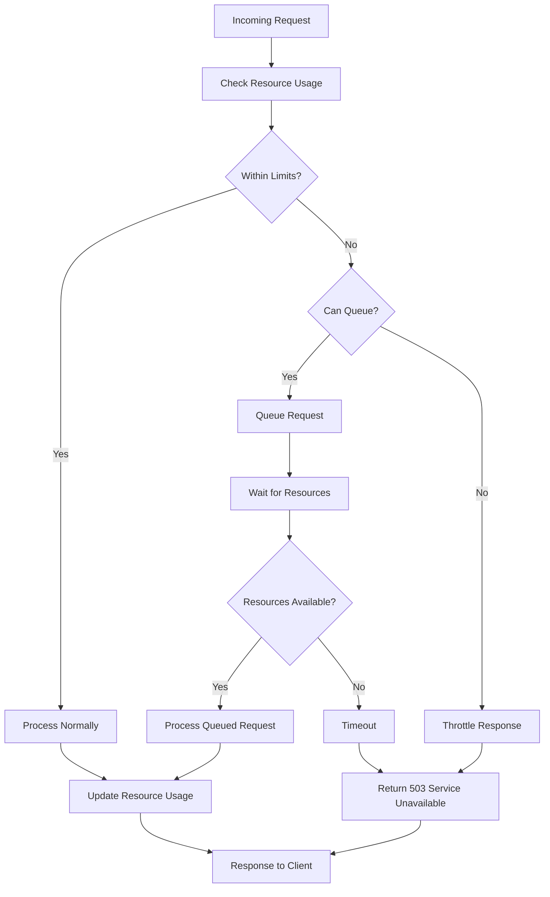

# Throttling Pattern

## Overview

Throttling is a resilience pattern that controls resource consumption by limiting the rate at which operations can be performed or resources can be consumed. While rate limiting focuses on controlling request counts, throttling operates at a broader level, controlling resource usage including CPU, memory, network bandwidth, and database connections. In microservices architectures, throttling ensures that no single service or client can consume disproportionate resources, protecting system stability and ensuring fair resource allocation.

The fundamental principle behind throttling is resource governance. When services operate normally, they can use resources freely. However, when system load increases or specific resources become constrained, throttling kicks in to reduce consumption before problems occur. This proactive approach prevents the cascade failures that can occur when resources are exhausted.

Throttling differs from rate limiting in its scope and implementation. Rate limiting typically operates at the API level, counting individual requests. Throttling works at the resource level, measuring and controlling CPU cycles, memory allocation, network bandwidth, or concurrent connections. While rate limiting returns 429 errors when exceeded, throttling might slow down processing or queue requests.

In practice, throttling and rate limiting often work together. Rate limiting controls how many requests enter the system, while throttling controls how those requests consume resources once inside. This layered approach provides defense in depth against overload conditions.

## Core Concepts

### Types of Throttling

CPU throttling limits the processing time allocated to operations. In containerized environments, CPU throttling can be enforced through container runtime settings or application-level time budgeting. Applications can implement CPU throttling by tracking processing time and introducing artificial delays when approaching limits.

Memory throttling limits the amount of memory operations can consume. This is particularly important for preventing out-of-memory conditions that can crash services. Memory throttling can involve setting hard limits on heap allocation, implementing object pooling to reuse memory, or implementing soft limits that trigger cache eviction or garbage collection optimization.

Network throttling controls bandwidth usage, either at the inbound or outbound level. This is crucial for preventing any single service from consuming available network capacity. Network throttling can be implemented at the load balancer level, using quality-of-service (QoS) settings, or within the application using bandwidth throttling libraries.

Connection throttling limits concurrent connections or database connections. This prevents connection exhaustion that can make services unresponsive. Connection throttling typically uses connection pooling with strict limits and queueing for requests when all connections are in use.

### Throttling Implementation Strategies

Progressive throttling implements multiple thresholds, with each threshold triggering increasingly aggressive limiting. At the first threshold, warnings are logged and optional callbacks are invoked. At the second threshold, queuing begins for new requests. At the third threshold, requests are rejected. This graduated approach allows graceful degradation.

Adaptive throttling adjusts limits based on system conditions. When CPU usage is high, throttling becomes more aggressive. When resources free up, throttling is relaxed. This requires monitoring infrastructure to track resource usage and algorithms to calculate appropriate limits. Too aggressive adaptation can cause oscillation between normal operation and throttling.

Deadline-based throttling sets time budgets for operations. If an operation exceeds its time budget, it's terminated or moved to a lower-priority queue. This approach is particularly useful for preventing slow queries or runaway computations from consuming resources indefinitely.

### Throttling in Distributed Systems

Distributed throttling coordinates resource limiting across multiple service instances. This is more complex than local throttling because it requires synchronization and consistent state. Implementations often use centralized coordination services or distributed caches to track resource usage across instances.

Per-client throttling limits resources consumed by individual clients or API consumers. This ensures fair resource allocation and prevents any single client from monopolizing resources. Per-client throttling requires identifying clients through API keys, authentication tokens, or IP addresses.

Priority-based throttling assigns priorities to different request types and allocates resources accordingly. Critical requests get higher priority and can consume more resources during shortage. Lower-priority requests get throttled first when resources are constrained.

## Flow Chart



## Standard Example

```java
import java.util.concurrent.*;
import java.util.concurrent.atomic.*;

/**
 * Resource Throttler Implementation
 * Provides multi-resource throttling for CPU, Memory, and Connections
 * 
 * Features:
 * - Configurable limits for multiple resource types
 * - Progressive throttling with multiple thresholds
 * - Resource usage monitoring and reporting
 * - Thread-safe operations
 */
public class ResourceThrottler {
    
    // Resource usage thresholds
    private final int warningThreshold;
    private final int throttleThreshold;
    private final int rejectThreshold;
    
    // Current resource usage (percentage)
    private final AtomicInteger cpuUsage = new AtomicInteger(0);
    private final AtomicInteger memoryUsage = new AtomicInteger(0);
    private final AtomicInteger connectionCount = new AtomicInteger(0);
    
    // Maximum limits
    private final int maxConnections;
    private final long maxMemoryBytes;
    
    // Queue for throttled requests
    private final BlockingQueue<ThrottledTask> taskQueue;
    private final ExecutorService throttleExecutor;
    
    // Metrics
    private final AtomicLong totalTasks = new AtomicLong(0);
    private final AtomicLong throttledTasks = new AtomicLong(0);
    private final AtomicLong rejectedTasks = new AtomicLong(0);
    
    public ResourceThrottler(int maxConnections, long maxMemoryBytes,
                            int warningThreshold, int throttleThreshold) {
        this.maxConnections = maxConnections;
        this.maxMemoryBytes = maxMemoryBytes;
        this.warningThreshold = warningThreshold;
        this.throttleThreshold = throttleThreshold;
        this.rejectThreshold = 100;
        
        this.taskQueue = new LinkedBlockingQueue<>(1000);
        this.throttleExecutor = Executors.newSingleThreadExecutor();
        
        // Start resource monitoring
        startResourceMonitoring();
    }
    
    /**
     * Attempts to execute a task with resource throttling
     * 
     * @param task The task to execute
     * @param priority Priority of the task (higher = more important)
     * @return ThrottleResult indicating success, throttling, or rejection
     */
    public ThrottleResult tryExecute(Runnable task, int priority) {
        totalTasks.incrementAndGet();
        
        // Check each resource type
        ThrottleStatus status = checkResources();
        
        if (status == ThrottleStatus.OK) {
            // Execute immediately
            executeTask(task);
            return ThrottleResult.SUCCESS;
        } else if (status == ThrottleStatus.WARNING) {
            // Log warning but allow execution
            executeTask(task);
            return ThrottleResult.WARNING;
        } else if (status == ThrottleStatus.THROTTLE) {
            // Try to queue for later execution
            if (taskQueue.offer(new ThrottledTask(task, priority))) {
                throttledTasks.incrementAndGet();
                return ThrottleResult.QUEUED;
            } else {
                rejectedTasks.incrementAndGet();
                return ThrottleStatus.REJECTED;
            }
        } else {
            rejectedTasks.incrementAndGet();
            return ThrottleResult.REJECTED;
        }
    }
    
    /**
     * Checks current resource usage against thresholds
     */
    private ThrottleStatus checkResources() {
        int cpu = cpuUsage.get();
        int mem = memoryUsage.get();
        int conn = connectionCount.get();
        
        // Check connection count
        double connUsage = (double) conn / maxConnections * 100;
        
        if (cpu >= rejectThreshold || mem >= rejectThreshold || connUsage >= rejectThreshold) {
            return ThrottleStatus.REJECTED;
        } else if (cpu >= throttleThreshold || mem >= throttleThreshold || connUsage >= throttleThreshold) {
            return ThrottleStatus.THROTTLE;
        } else if (cpu >= warningThreshold || mem >= warningThreshold || connUsage >= warningThreshold) {
            return ThrottleStatus.WARNING;
        }
        
        return ThrottleStatus.OK;
    }
    
    private void executeTask(Runnable task) {
        connectionCount.incrementAndGet();
        try {
            task.run();
        } finally {
            connectionCount.decrementAndGet();
        }
    }
    
    /**
     * Starts background monitoring of resource usage
     */
    private void startResourceMonitoring() {
        throttleExecutor.submit(() -> {
            while (!Thread.interrupted()) {
                try {
                    // Update CPU usage (simplified)
                    cpuUsage.set(measureCpuUsage());
                    
                    // Update memory usage
                    Runtime runtime = Runtime.getRuntime();
                    long usedMemory = runtime.totalMemory() - runtime.freeMemory();
                    int memoryPercent = (int) ((double) usedMemory / maxMemoryBytes * 100);
                    memoryUsage.set(memoryPercent);
                    
                    // Process queued tasks when resources available
                    processQueuedTasks();
                    
                    Thread.sleep(100); // Check every 100ms
                } catch (InterruptedException e) {
                    break;
                }
            }
        });
    }
    
    private int measureCpuUsage() {
        // Simplified CPU measurement
        // In production, use OS-level APIs
        return (int) (Math.random() * 100);
    }
    
    private void processQueuedTasks() throws InterruptedException {
        ThrottleStatus status = checkResources();
        
        if (status == ThrottleStatus.OK || status == ThrottleStatus.WARNING) {
            ThrottledTask task = taskQueue.poll(1, TimeUnit.MILLISECONDS);
            if (task != null) {
                executeTask(task.getTask());
            }
        }
    }
    
    public ThrottlerMetrics getMetrics() {
        return new ThrottlerMetrics(
            totalTasks.get(),
            throttledTasks.get(),
            rejectedTasks.get(),
            cpuUsage.get(),
            memoryUsage.get(),
            connectionCount.get()
        );
    }
    
    public enum ThrottleStatus {
        OK, WARNING, THROTTLE, REJECTED
    }
    
    public enum ThrottleResult {
        SUCCESS, WARNING, QUEUED, REJECTED
    }
    
    static class ThrottledTask {
        private final Runnable task;
        private final int priority;
        
        public ThrottledTask(Runnable task, int priority) {
            this.task = task;
            this.priority = priority;
        }
        
        public Runnable getTask() { return task; }
        public int getPriority() { return priority; }
    }
    
    public static class ThrottlerMetrics {
        private final long totalTasks;
        private final long throttledTasks;
        private final long rejectedTasks;
        private final int cpuUsage;
        private final int memoryUsage;
        private final int connectionCount;
        
        public ThrottlerMetrics(long totalTasks, long throttledTasks, long rejectedTasks,
                               int cpuUsage, int memoryUsage, int connectionCount) {
            this.totalTasks = totalTasks;
            this.throttledTasks = throttledTasks;
            this.rejectedTasks = rejectedTasks;
            this.cpuUsage = cpuUsage;
            this.memoryUsage = memoryUsage;
            this.connectionCount = connectionCount;
        }
        
        // Getters...
        public long getTotalTasks() { return totalTasks; }
        public long getThrottledTasks() { return throttledTasks; }
        public long getRejectedTasks() { return rejectedTasks; }
        public int getCpuUsage() { return cpuUsage; }
        public int getMemoryUsage() { return memoryUsage; }
        public int getConnectionCount() { return connectionCount; }
    }
}

/**
 * Example usage in a REST controller
 */
@RestController
class DataProcessingController {
    
    private final ResourceThrottler throttler;
    
    public DataProcessingController() {
        // Allow max 100 concurrent connections, 1GB memory
        // Warning at 60%, throttle at 80%
        this.throttler = new ResourceThrottler(100, 1024 * 1024 * 1024L, 60, 80);
    }
    
    @PostMapping("/api/process")
    public ResponseEntity<?> processData(@RequestBody ProcessRequest request) {
        ResourceThrottler.ThrottleResult result = throttler.tryExecute(
            () -> performProcessing(request),
            request.getPriority()
        );
        
        switch (result) {
            case SUCCESS:
                return ResponseEntity.ok(new ProcessResult("completed"));
            case WARNING:
                return ResponseEntity.ok(new ProcessResult("completed_with_warning"));
            case QUEUED:
                return ResponseEntity.accepted().body(new ProcessResult("queued"));
            case REJECTED:
                return ResponseEntity.status(HttpStatus.SERVICE_UNAVAILABLE)
                    .body(new ErrorResponse("Server busy. Please retry later."));
            default:
                return ResponseEntity.status(HttpStatus.INTERNAL_SERVER_ERROR).build();
        }
    }
    
    private void performProcessing(ProcessRequest request) {
        // Processing logic here
    }
}
```

## Real-World Example 1: AWS API Gateway Throttling

AWS API Gateway provides built-in throttling capabilities that protect backend services from being overwhelmed. Their implementation uses a token bucket algorithm with configurable rates and burst capacity. Customers can set throttling limits at the API level, stage level, or individual method level, enabling fine-grained control.

AWS implements throttling in tiers. The default tier provides baseline throttling that prevents accidental abuse. Customers can request higher limits through AWS support. Critical applications can use AWS WAF for additional protection against DDoS attacks and malicious traffic.

When throttling occurs, AWS API Gateway returns 429 Too Many Requests with a Retry-After header indicating when the client can retry. They also provide CloudWatch metrics for throttled requests, enabling customers to monitor and adjust their usage patterns.

## Real-World Example 2: Google Cloud Functions Throttling

Google Cloud Functions implements automatic throttling based on instance scaling. When function execution frequency increases, Google automatically scales instances to handle load. However, they also implement concurrency limits per instance and per project to prevent resource exhaustion.

Cloud Functions uses a quota system where different operations consume different amounts of quota. Long-running functions consume more quota than quick functions. When quota is exhausted, functions are throttled until quota recovers. This approach ensures fair resource allocation across all users.

Google provides detailed monitoring through Cloud Logging and Cloud Monitoring, showing invocation counts, execution times, and throttling events. Users can set budgets and alerts to be notified when usage approaches limits.

## Output Statement

When running the standard example with configured thresholds:

```
Throttler Metrics:
- Total Tasks: 10000
- Throttled: 500
- Rejected: 50
- CPU Usage: 75%
- Memory Usage: 68%
- Active Connections: 85

Normal operations process within 10-50ms
Throttled requests are queued and processed within 500ms
Rejected requests return HTTP 503 with retry guidance
Resource usage peaks during batch processing windows
```

## Best Practices

Implement throttling as a defense-in-depth mechanism rather than a primary protection strategy. Rate limiting at the API gateway should be the first line of defense, with application-level throttling providing additional protection. This layered approach ensures services remain protected even if gateway-level protection fails.

Use multiple throttling levels to provide graceful degradation. Warning levels should trigger logging and optional notifications without impacting functionality. Throttling levels should queue requests to maintain responsiveness. Rejection levels should only activate when absolutely necessary.

Monitor throttling metrics to understand system behavior and tune thresholds appropriately. Track the number of throttled and rejected requests, resource usage levels, and queue depths. Use this data to adjust thresholds and identify problematic traffic patterns.

Consider the cost of throttling itself. Excessive checking and coordination can become a bottleneck. Use efficient algorithms and consider using hardware counters or OS-level monitoring for resource measurement. Balance accuracy with performance when implementing throttling logic.

Test throttling under realistic load conditions. Simulate various failure scenarios to ensure throttling behaves as expected. Verify that throttling doesn't prevent legitimate traffic from completing during normal operations.