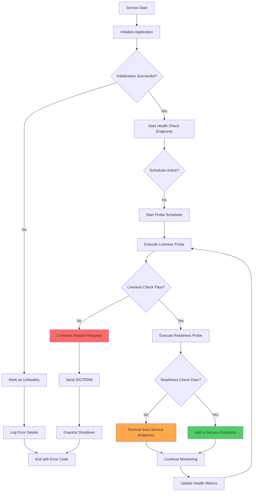

# Health Check Pattern

## Overview

Health check patterns are essential resilience mechanisms in microservices architecture that enable systems to detect, report, and recover from unhealthy states. A health check is a mechanism that allows a service to report its operational status and the status of its dependencies, enabling orchestrators and load balancers to make informed decisions about routing traffic and managing container lifecycles.

In containerized environments like Kubernetes, health checks are implemented through liveness and readiness probes. These probes serve different purposes: liveness probes determine when to restart a container, while readiness probes determine when a container is ready to accept traffic. Together, they form a comprehensive health monitoring system that enables self-healing behavior in distributed systems.

The health check pattern goes beyond simple ping mechanisms. Modern implementations include checks for dependency health (databases, message queues, downstream services), resource utilization (memory, CPU, disk), and business logic health (data consistency, queue depths). This comprehensive approach enables systems to detect issues before they impact users and take corrective action automatically.

### Key Concepts

**Liveness Probes:**
Liveness probes determine if a container is running and should be restarted if it enters an unhealthy state. They detect situations where the application is stuck or in a deadlock state. Kubernetes performs periodic checks and restarts the container if the probe fails. Common liveness check implementations include HTTP GET requests (returns 200-399 status), TCP socket checks, and command execution checks.

**Readiness Probes:**
Readiness probes determine if a container is ready to accept traffic. When a pod is not ready, it's removed from the Service endpoints, preventing traffic from being routed to unhealthy instances. Readiness probes check dependencies, initialization completion, and business-level readiness conditions. This ensures that traffic is only routed to instances that can properly handle requests.

**Startup Probes:**
Startup probes are used for slow-starting containers. They delay other probes until the container has completed startup, preventing false failures during initialization. Once the startup probe succeeds, liveness and readiness probes begin their normal operation. This is particularly useful for applications that require significant startup time for database migrations or cache warming.

## Flow Chart



## Standard Example (Java with Spring Boot)

### Maven Dependencies

```xml
<dependency>
    <groupId>org.springframework.boot</groupId>
    <artifactId>spring-boot-starter-actuator</artifactId>
    <version>3.2.0</version>
</dependency>
<dependency>
    <groupId>org.springframework.boot</groupId>
    <artifactId>spring-boot-starter-web</artifactId>
    <version>3.2.0</version>
</dependency>
<dependency>
    <groupId>org.springframework.boot</groupId>
    <artifactId>spring-boot-starter-data-jpa</artifactId>
    <version>3.2.0</version>
</dependency>
```

### Basic Health Indicator Implementation

```java
import org.springframework.boot.actuate.health.Health;
import org.springframework.boot.actuate.health.HealthIndicator;
import org.springframework.stereotype.Service;
import org.springframework.jdbc.core.JdbcTemplate;

@Service
public class DatabaseHealthIndicator implements HealthIndicator {

    private final JdbcTemplate jdbcTemplate;

    public DatabaseHealthIndicator(JdbcTemplate jdbcTemplate) {
        this.jdbcTemplate = jdbcTemplate;
    }

    @Override
    public Health health() {
        try {
            // Execute a simple database query to check connectivity
            Boolean result = jdbcTemplate.queryForObject(
                "SELECT 1", 
                Boolean.class
            );

            if (Boolean.TRUE.equals(result)) {
                return Health.up()
                    .withDetail("database", "reachable")
                    .withDetail("timestamp", System.currentTimeMillis())
                    .build();
            } else {
                return Health.down()
                    .withDetail("error", "Unexpected result")
                    .withDetail("timestamp", System.currentTimeMillis())
                    .build();
            }
        } catch (Exception e) {
            return Health.down()
                .withDetail("error", e.getMessage())
                .withDetail("timestamp", System.currentTimeMillis())
                .build();
        }
    }
}
```

### Custom Health Check Service

```java
import org.springframework.stereotype.Service;
import org.springframework.web.client.RestTemplate;
import org.springframework.beans.factory.annotation.Value;
import java.util.HashMap;
import java.util.Map;
import java.util.concurrent.TimeUnit;

@Service
public class CompositeHealthService {

    private final RestTemplate restTemplate;
    
    @Value("${health.check.timeout:5000}")
    private int healthCheckTimeout;
    
    @Value("${health.external-services:}")
    private String externalServices;
    
    private final Map<String, ServiceEndpoint> serviceEndpoints = new HashMap<>();

    public CompositeHealthService() {
        this.restTemplate = new RestTemplate();
    }

    public HealthStatus checkOverallHealth() {
        long startTime = System.currentTimeMillis();
        boolean allHealthy = true;
        Map<String, ComponentHealth> componentHealths = new HashMap<>();

        // Check database connectivity
        ComponentHealth dbHealth = checkDatabase();
        componentHealths.put("database", dbHealth);
        if (!dbHealth.isHealthy()) {
            allHealthy = false;
        }

        // Check external service dependencies
        for (String service : serviceEndpoints.keySet()) {
            ComponentHealth serviceHealth = checkExternalService(service);
            componentHealths.put(service, serviceHealth);
            if (!serviceHealth.isHealthy()) {
                allHealthy = false;
            }
        }

        // Check resource utilization
        ComponentHealth resourceHealth = checkResources();
        componentHealths.put("resources", resourceHealth);
        
        long duration = System.currentTimeMillis() - startTime;

        return new HealthStatus(
            allHealthy ? HealthState.UP : HealthState.DEGRADED,
            componentHealths,
            duration
        );
    }

    private ComponentHealth checkDatabase() {
        try {
            // Simplified database check
            return new ComponentHealth(
                true, 
                "Database connected",
                Map.of("connected", true)
            );
        } catch (Exception e) {
            return new ComponentHealth(
                false, 
                "Database check failed: " + e.getMessage(),
                Map.of("error", e.getMessage())
            );
        }
    }

    private ComponentHealth checkExternalService(String serviceName) {
        ServiceEndpoint endpoint = serviceEndpoints.get(serviceName);
        try {
            long start = System.currentTimeMillis();
            restTemplate.getForObject(
                endpoint.getHealthUrl(), 
                String.class
            );
            long responseTime = System.currentTimeMillis() - start;
            
            return new ComponentHealth(
                responseTime < healthCheckTimeout,
                "Service responded in " + responseTime + "ms",
                Map.of("responseTime", responseTime)
            );
        } catch (Exception e) {
            return new ComponentHealth(
                false,
                "Service unavailable: " + e.getMessage(),
                Map.of("error", e.getMessage())
            );
        }
    }

    private ComponentHealth checkResources() {
        Runtime runtime = Runtime.getRuntime();
        long maxMemory = runtime.maxMemory();
        long totalMemory = runtime.totalMemory();
        long freeMemory = runtime.freeMemory();
        long usedMemory = totalMemory - freeMemory;
        
        double usagePercent = (double) usedMemory / maxMemory * 100;
        
        return new ComponentHealth(
            usagePercent < 90,
            String.format("Memory usage: %.1f%%", usagePercent),
            Map.of(
                "usedMB", usedMemory / (1024 * 1024),
                "maxMB", maxMemory / (1024 * 1024),
                "usagePercent", usagePercent
            )
        );
    }
}

enum HealthState {
    UP, DEGRADED, DOWN
}

class HealthStatus {
    private final HealthState state;
    private final Map<String, ComponentHealth> components;
    private final long checkDuration;

    public HealthStatus(HealthState state, Map<String, ComponentHealth> components, long checkDuration) {
        this.state = state;
        this.components = components;
        this.checkDuration = checkDuration;
    }

    public HealthState getState() { return state; }
    public Map<String, ComponentHealth> getComponents() { return components; }
    public long getCheckDuration() { return checkDuration; }
}

class ComponentHealth {
    private final boolean healthy;
    private final String message;
    private final Map<String, Object> details;

    public ComponentHealth(boolean healthy, String message, Map<String, Object> details) {
        this.healthy = healthy;
        this.message = message;
        this.details = details;
    }

    public boolean isHealthy() { return healthy; }
    public String getMessage() { return message; }
    public Map<String, Object> getDetails() { return details; }
}

class ServiceEndpoint {
    private final String name;
    private final String healthUrl;

    public ServiceEndpoint(String name, String healthUrl) {
        this.name = name;
        this.healthUrl = healthUrl;
    }

    public String getHealthUrl() { return healthUrl; }
}
```

### Spring Boot Actuator Configuration

```java
import org.springframework.boot.actuate.endpoint.web.WebEndpointResponse;
import org.springframework.boot.actuate.endpoint.web.annotation.HealthEndpoint;
import org.springframework.boot.actuate.health.HealthAggregator;
import org.springframework.boot.context.properties.ConfigurationProperties;
import org.springframework.context.annotation.Bean;
import org.springframework.context.annotation.Configuration;

@Configuration
public class HealthCheckConfiguration {

    @Bean
    public WebEndpointResponse<?> healthEndpoint() {
        // Custom health endpoint configuration
        return null;
    }
}

// application.yml configuration
/*
management:
  endpoints:
    web:
      exposure:
        include: health,info,metrics,prometheus
      base-path: /actuator
  endpoint:
    health:
      show-details: always
      probes:
        enabled: true
  health:
    livenessProbe:
      enabled: true
      path: /actuator/health/liveness
    readinessProbe:
      enabled: true
      path: /actuator/health/readiness
    diskspace:
      enabled: true
      threshold: 10485760
    db:
      enabled: true
*/
```

### Kubernetes Probe Configuration

```yaml
# deployment.yaml
apiVersion: apps/v1
kind: Deployment
metadata:
  name: microservice-deployment
spec:
  replicas: 3
  selector:
    matchLabels:
      app: microservice
  template:
    metadata:
      labels:
        app: microservice
    spec:
      containers:
      - name: application
        image: myapp:latest
        ports:
        - containerPort: 8080
        
        # Liveness Probe Configuration
        livenessProbe:
          httpGet:
            path: /actuator/health/liveness
            port: 8080
          initialDelaySeconds: 30
          periodSeconds: 10
          timeoutSeconds: 5
          failureThreshold: 3
          successThreshold: 1
        
        # Readiness Probe Configuration
        readinessProbe:
          httpGet:
            path: /actuator/health/readiness
            port: 8080
          initialDelaySeconds: 10
          periodSeconds: 5
          timeoutSeconds: 3
          failureThreshold: 3
          successThreshold: 1
        
        # Startup Probe (for slow starting apps)
        startupProbe:
          httpGet:
            path: /actuator/health/startup
            port: 8080
          initialDelaySeconds: 0
          periodSeconds: 10
          timeoutSeconds: 5
          failureThreshold: 30
        
        resources:
          requests:
            memory: "512Mi"
            cpu: "250m"
          limits:
            memory: "1Gi"
            cpu: "500m"
*/
```

## Real-World Examples

### Netflix Health Check Implementation

Netflix uses comprehensive health checks in their microservices ecosystem, particularly in their Eureka service discovery infrastructure. Each microservice registers with Eureka and provides health status information that enables the load balancer to route traffic only to healthy instances.

```java
// Netflix Eureka Health Check (Conceptual Example)
@Configuration
public class EurekaHealthCheckRegistration {

    @Bean
    public EurekaInstanceConfigBean eurekaInstanceConfig() {
        EurekaInstanceConfigBean config = new EurekaInstanceConfigBean();
        config.setInstanceId("instance-" + UUID.randomUUID().toString());
        
        // Register health check URL
        config.setHealthCheckUrl(
            "http://" + config.getHostname() + ":" + 
            config.getNonSecurePort() + "/health"
        );
        
        // Enable status page URL for health visibility
        config.setStatusPageUrl(
            "http://" + config.getHostname() + ":" + 
            config.getNonSecurePort() + "/actuator/info"
        );
        
        return config;
    }
}

// Netflix Zuul Health Integration
/*
zuul:
  host:
    connect-timeout-millis: 5000
    socket-timeout-millis: 10000
  ribbon-ismx:
    enabled: false
  ribbon:
    NFLoadBalancerRuleClassName: com.netflix.loadbalancer.availability.AvailabilityFilteringRule
*/
```

### Google Cloud Run Health Checks

Google Cloud Run uses similar health check mechanisms but applies them through the Cloud Run infrastructure. Services must expose a health check endpoint that Cloud Run uses to determine when to route traffic to new revisions.

```yaml
# Google Cloud Run service.yaml
apiVersion: serving.knative.dev/v1
kind: Service
metadata:
  name: my-service
spec:
  template:
    metadata:
      annotations:
        autoscaling.knative.dev/minScale: "2"
        autoscaling.knative.dev/maxScale: "10"
    spec:
      containers:
      - image: gcr.io/my-project/my-service:latest
        ports:
        - containerPort: 8080
        env:
        - name: PORT
          value: "8080"
        readinessProbe:
          httpGet:
            path: /actuator/health/readiness
          initialDelaySeconds: 5
          periodSeconds: 10
        livenessProbe:
          httpGet:
            path: /actuator/health/liveness
          initialDelaySeconds: 30
          periodSeconds: 15
*/
```

### AWS ECS Health Check Configuration

Amazon ECS uses health checks defined in the task definition to monitor container health. ECS performs health checks and automatically replaces unhealthy containers.

```json
{
  "family": "microservice-task",
  "networkMode": "awsvpc",
  "containerDefinitions": [
    {
      "name": "application",
      "image": "myrepo/application:latest",
      "essential": true,
      "portMappings": [
        {
          "containerPort": 8080,
          "protocol": "tcp"
        }
      ],
      "healthCheck": {
        "command": ["CMD-SHELL", "curl -f http://localhost:8080/actuator/health || exit 1"],
        "interval": 30,
        "timeout": 5,
        "retries": 3,
        "startPeriod": 60
      }
    }
  ]
}
```

## Output Statement

Health checks form the foundation of self-healing systems by providing visibility into the operational state of services and their dependencies. The output of health checks includes:

- **Overall System Status**: UP, DOWN, or DEGRADED based on all component checks
- **Component Status**: Individual status for each dependency (database, external services, resources)
- **Discovery Integration**: Registration with service discovery only when healthy
- **Load Balancer Integration**: Traffic routing decisions based on readiness
- **Container Orchestrator Integration**: Automatic restart of unhealthy containers

When health checks fail, the system takes automated corrective actions:
1. Unhealthy instances are removed from service endpoints
2. Container restart is triggered after liveness probe failures
3. Alerts are generated for operations teams
4. Circuit breakers are activated for dependent services

## Best Practices

**1. Keep Health Checks Lightweight**
Health checks should execute quickly and not consume significant resources. Avoid complex queries or lengthy operations. Use simple, fast checks that accurately represent the service's ability to handle requests.

**2. Check Dependencies, Not Just Infrastructure**
Include health checks for databases, message queues, and external services. The service should report unhealthy if critical dependencies are unavailable, enabling upstream services to respond appropriately.

**3. Use Separate Probes Appropriately**
Configure liveness, readiness, and startup probes with appropriate thresholds. Use startup probes for slow-starting applications and ensure readiness probes check all initialization requirements.

**4. Implement Graceful Degradation**
Health checks should report degraded status when non-critical dependencies fail. This allows the system to continue operating with reduced functionality while alerting operations.

**5. Include Health Check Metrics**
Expose health check results through monitoring systems. Track health check durations, failure rates, and component-specific metrics to enable proactive issue detection.

**6. Implement Distributed Tracing**
Include correlation IDs in health check responses to enable tracing across service boundaries. This helps identify the source of health issues in distributed systems.

**7. Secure Health Endpoints**
Protect health check endpoints from unauthorized access while ensuring legitimate health checks can execute. Use authentication filters that allow health check endpoints without full authentication.

**8. Test Health Check Behavior**
Regularly test health check behavior by simulating failures. Verify that failed health checks trigger appropriate actions (restart, traffic removal, alerts).