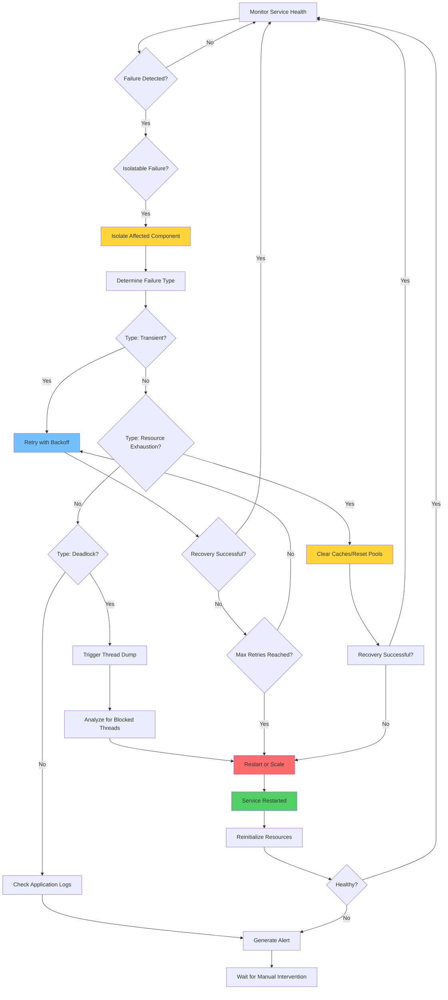

# Self-Healing Pattern

## Overview

Self-healing patterns enable microservices to automatically detect, diagnose, and recover from failures without human intervention. These patterns build upon health checks to create closed-loop systems that can identify problems and take corrective action. The goal is to maintain service availability and data integrity while minimizing the blast radius of failures.

Self-healing in microservices operates at multiple levels: application-level (restarting instances, clearing caches), infrastructure-level (container restarts, scaling), and data-level (transaction retries, compensation). Effective self-healing systems combine these levels to create comprehensive failure recovery mechanisms that preserve system state and ensure consistency.

The patterns discussed here form the foundation for resilient microservices that can automatically recover from various failure modes. Modern cloud-native applications require sophisticated self-healing capabilities to meet availability targets while minimizing operational overhead.

### Key Concepts

**Recovery Triggers:**
Self-healing is triggered by various conditions: health check failures, error rate thresholds, latency degradation, resource exhaustion, and circuit breaker state changes. Effective systems monitor multiple signals and correlate them to identify genuine issues requiring recovery actions.

**Recovery Actions:**
Recovery actions include: container restart, cache clearing, connection pool reset, service redeployment, traffic rerouting, and data compensation. The appropriate action depends on the failure type and severity. Systems should implement graduated recovery that escalates based on failure persistence.

**State Management:**
Self-healing must preserve system state during recovery. This includes: in-flight request handling, cached data preservation, transaction consistency, and session state. Proper state management ensures that recovery does not cause data loss or inconsistency.

## Flow Chart



## Standard Example (Java)

### Maven Dependencies

```xml
<dependency>
    <groupId>org.springframework.boot</groupId>
    <artifactId>spring-boot-starter-actuator</artifactId>
    <version>3.2.0</version>
</dependency>
<dependency>
    <groupId>io.github.resilience4j</groupId>
    <artifactId>resilience4j-retry</artifactId>
    <version>2.2.0</version>
</dependency>
```

### Self-Healing Service Implementation

```java
import org.springframework.stereotype.Service;
import org.springframework.jdbc.core.JdbcTemplate;
import javax.annotation.PostConstruct;
import javax.annotation.PreDestroy;
import java.util.concurrent.*;
import java.util.concurrent.atomic.AtomicInteger;
import java.util.function.Supplier;

@Service
public class SelfHealingService {

    private final JdbcTemplate jdbcTemplate;
    private final ExecutorService executorService;
    private final HealthCheckService healthCheckService;
    
    private volatile boolean isHealthy = true;
    private final AtomicInteger consecutiveFailures = new AtomicInteger(0);
    private final AtomicInteger restartCount = new AtomicInteger(0);
    
    private static final int MAX_CONSECUTIVE_FAILURES = 5;
    private static final int RECOVERY_TIMEOUT_SECONDS = 30;

    public SelfHealingService(
            JdbcTemplate jdbcTemplate,
            HealthCheckService healthCheckService) {
        this.jdbcTemplate = jdbcTemplate;
        this.healthCheckService = healthCheckService;
        this.executorService = Executors.newFixedThreadPool(2);
    }

    @PostConstruct
    public void initialize() {
        startHealthMonitoring();
        initializeResources();
    }

    private void initializeResources() {
        try {
            // Initialize database connection pool
            jdbcTemplate.queryForObject("SELECT 1", Integer.class);
            isHealthy = true;
            consecutiveFailures.set(0);
            System.out.println("Service resources initialized successfully");
        } catch (Exception e) {
            handleInitializationFailure(e);
        }
    }

    private void handleInitializationFailure(Exception e) {
        isHealthy = false;
        consecutiveFailures.incrementAndGet();
        System.err.println("Initialization failed: " + e.getMessage());
        // Trigger recovery procedure
        triggerRecovery();
    }

    private void startHealthMonitoring() {
        executorService.submit(() -> {
            while (!Thread.currentThread().isInterrupted()) {
                try {
                    Thread.sleep(10000);
                    performHealthCheck();
                } catch (InterruptedException e) {
                    Thread.currentThread().interrupt();
                    break;
                }
            }
        });
    }

    private void performHealthCheck() {
        boolean currentHealth = healthCheckService.checkHealth();
        
        if (currentHealth != isHealthy) {
            if (!currentHealth) {
                // Health degraded - increment failure counter
                consecutiveFailures.incrementAndGet();
                
                if (consecutiveFailures.get() >= MAX_CONSECUTIVE_FAILURES) {
                    triggerRecovery();
                }
            } else {
                // Health recovered
                isHealthy = true;
                consecutiveFailures.set(0);
                System.out.println("Service health recovered");
            }
        } else {
            // Reset failure counter on successful health
            if (currentHealth) {
                consecutiveFailures.set(0);
            }
        }
    }

    private void triggerRecovery() {
        System.out.println("Initiating self-healing recovery procedure...");
        
        try {
            // Attempt different recovery strategies
            if (attemptCacheClear()) {
                return;
            }
            
            if (attemptConnectionPoolReset()) {
                return;
            }
            
            if (attemptGracefulRestart()) {
                return;
            }
            
            // All recovery attempts failed
            handleRecoveryFailure();
        } catch (Exception e) {
            System.err.println("Recovery procedure failed: " + e.getMessage());
            handleRecoveryFailure();
        }
    }

    private boolean attemptCacheClear() {
        try {
            System.out.println("Attempting cache clear recovery...");
            // Clear internal caches
            clearApplicationCaches();
            
            // Verify recovery
            if (healthCheckService.checkHealth()) {
                isHealthy = true;
                consecutiveFailures.set(0);
                System.out.println("Recovery successful: cache clear");
                return true;
            }
        } catch (Exception e) {
            System.err.println("Cache clear failed: " + e.getMessage());
        }
        return false;
    }

    private boolean attemptConnectionPoolReset() {
        try {
            System.out.println("Attempting connection pool reset...");
            // Reset database connections
            resetDatabaseConnections();
            
            // Wait for connection recovery
            Thread.sleep(2000);
            
            // Verify recovery
            if (healthCheckService.checkHealth()) {
                isHealthy = true;
                consecutiveFailures.set(0);
                System.out.println("Recovery successful: connection pool reset");
                return true;
            }
        } catch (Exception e) {
            System.err.println("Connection pool reset failed: " + e.getMessage());
        }
        return false;
    }

    private boolean attemptGracefulRestart() {
        try {
            System.out.println("Attempting graceful restart...");
            restartCount.incrementAndGet();
            
            // Signal graceful shutdown
            performGracefulShutdown();
            
            // Wait for cleanup
            Thread.sleep(1000);
            
            // Reinitialize
            initializeResources();
            
            // Verify recovery
            if (healthCheckService.checkHealth()) {
                isHealthy = true;
                consecutiveFailures.set(0);
                System.out.println("Recovery successful: graceful restart");
                return true;
            }
        } catch (Exception e) {
            System.err.println("Graceful restart failed: " + e.getMessage());
        }
        return false;
    }

    private void clearApplicationCaches() {
        // Clear internal caches
        System.out.println("Caches cleared");
    }

    private void resetDatabaseConnections() {
        // Reset database connection handling
        System.out.println("Database connections reset");
    }

    private void performGracefulShutdown() {
        System.out.println("Performing graceful shutdown");
    }

    private void handleRecoveryFailure() {
        System.err.println("All recovery attempts exhausted");
        // Trigger final alert and exit
        System.exit(1);
    }

    @PreDestroy
    public void shutdown() {
        executorService.shutdown();
        try {
            if (!executorService.awaitTermination(10, TimeUnit.SECONDS)) {
                executorService.shutdownNow();
            }
        } catch (InterruptedException e) {
            executorService.shutdownNow();
        }
    }
}
```

### Automatic Retry with Exponential Backoff

```java
import io.github.resilience4j.retry.Retry;
import io.github.resilience4j.retry.RetryConfig;
import io.github.resilience4j.retry.RetryRegistry;
import java.time.Duration;
import java.util.function.Supplier;

public class RetryableOperation<T> {

    private final Retry retry;
    private final Supplier<T> operation;

    public RetryableOperation(Supplier<T> operation) {
        this.operation = operation;
        
        RetryConfig config = RetryConfig.custom()
            .maxAttempts(3)
            .waitDuration(Duration.ofSeconds(2))
            .retryExceptions(RetryableException.class)
            .ignoreExceptions(NonRetryableException.class)
            .build();

        this.retry = RetryRegistry.of(config).retry("operation");
    }

    public T execute() {
        return Retry.decorateSupplier(retry, operation).get();
    }
}

class RetryableException extends Exception {
    public RetryableException(String message) {
        super(message);
    }
}

class NonRetryableException extends Exception {
    public NonRetryableException(String message) {
        super(message);
    }
}
```

### Circuit Breaker Integration

```java
import io.github.resilience4j.circuitbreaker.CircuitBreaker;
import io.github.resilience4j.circuitbreaker.CircuitBreakerConfig;

public class SelfHealingOperation<T> {

    private final CircuitBreaker circuitBreaker;
    private final Retry retry;
    private final Supplier<T> fallback;
    private final Supplier<T> operation;

    public SelfHealingOperation(
            Supplier<T> operation,
            Supplier<T> fallback,
            String name) {
        this.operation = operation;
        this.fallback = fallback;
        
        CircuitBreakerConfig cbConfig = CircuitBreakerConfig.custom()
            .failureRateThreshold(50)
            .waitDurationInOpenState(Duration.ofSeconds(30))
            .permittedNumberOfCallsInHalfOpenState(3)
            .build();
        
        this.circuitBreaker = CircuitBreaker.of(name, cbConfig);
        
        RetryConfig retryConfig = RetryConfig.custom()
            .maxAttempts(3)
            .waitDuration(Duration.ofSeconds(2))
            .build();
        
        this.retry = RetryRegistry.of(retryConfig).retry(name);
    }

    public T execute() {
        try {
            Supplier<T> decorated = io.github.resilience4j.retry.Retry.decorateSupplier(
                retry,
                io.github.resilience4j.circuitbreaker.CircuitBreaker.decorateSupplier(
                    circuitBreaker,
                    operation
                )
            );
            return decorated.get();
        } catch (Exception e) {
            // Return fallback on ultimate failure
            return fallback.get();
        }
    }
}
```

## Real-World Examples

### Netflix Self-Healing Infrastructure

Netflix implements comprehensive self-healing through their Eureka service discovery and automated instance management. When instances become unhealthy, Eureka automatically deregisters them and removes them from traffic rotation.

```java
// Netflix Eureka Instance Registration
/*
eureka:
  instance:
    prefer-ip-address: true
    lease-renewal-interval-in-seconds: 30
    lease-expiration-duration-in-seconds: 90
  client:
    register-with-eureka: true
    fetch-registry: true
    health-check-url-path: /actuator/health
*/
```

### Kubernetes Self-Healing

Kubernetes provides built-in self-healing through pod restarts, replicated controllers, and node failure handling. The combination of liveness probes and replica sets creates automatic recovery from container failures.

```yaml
# Kubernetes Self-Healing Deployment
apiVersion: apps/v1
kind: Deployment
metadata:
  name: self-healing-app
spec:
  replicas: 3
  selector:
    matchLabels:
      app: self-healing-app
  template:
    spec:
      containers:
      - name: app
        image: myapp:latest
        livenessProbe:
          httpGet:
            path: /actuator/health/liveness
            port: 8080
          failureThreshold: 3
          periodSeconds: 10
        readinessProbe:
          httpGet:
            path: /actuator/health/readiness
            port: 8080
          failureThreshold: 3
          periodSeconds: 5
---
apiVersion: v1
kind: Service
metadata:
  name: self-healing-app
spec:
  selector:
    app: self-healing-app
  ports:
  - port: 80
    targetPort: 8080
  type: ClusterIP
```

### AWS Auto Recovery

AWS Auto Recovery automatically recovers EC2 instances when underlying hardware failures occur. This infrastructure-level self-healing operates below the operating system.

```json
{
  "AmazonEC2": {
    "AutoRecovery": {
      "InstanceRecovery": {
        "InstanceId": "i-1234567890abcdef0",
        "RecoveryLevel": "instance-recover"
      }
    }
  }
}
```

## Output Statement

Self-healing patterns produce the following outcomes:

- **Automatic Recovery**: Failed instances are automatically replaced or restarted
- **Service Continuity**: Minimized downtime through rapid recovery
- **State Preservation**: Critical state is maintained during recovery
- **Alert Generation**: Operations teams are notified of recovery events
- **Metrics Collection**: Recovery events are tracked for analysis

The output of self-healing includes system restarts, connection resets, cache invalidation, and traffic rerouting. These actions occur automatically and maintain service availability.

## Best Practices

**1. Implement Graduated Recovery**
Start with non-destructive recovery actions (retry, cache clear) before escalating to destructive actions (restart, redeploy). This preserves system state and minimizes impact.

**2. Use Exponential Backoff**
Implement exponential backoff for retries to avoid overloading recovering services. Use jitter to prevent thundering herd problems.

**3. Set Appropriate Thresholds**
Configure health check failure thresholds and timeout values based on service requirements. Avoid triggering recovery for transient issues.

**4. Preserve Request State**
Ensure in-flight requests are handled gracefully during recovery. Use circuit breakers to prevent requests to failing instances.

**5. Log Recovery Events**
Log all recovery events with sufficient detail for post-incident analysis. Include failure cause, recovery action, and outcome.

**6. Monitor Recovery Effectiveness**
Track recovery success rates and times. Adjust recovery strategies based on effectiveness data.

**7. Test Recovery Procedures**
Regularly test recovery procedures through chaos engineering. Verify that recovery completes successfully and maintains data consistency.

**8. Limit Recovery Attempts**
Set maximum recovery attempts to prevent infinite recovery loops. After exhausting attempts, escalate to manual intervention.