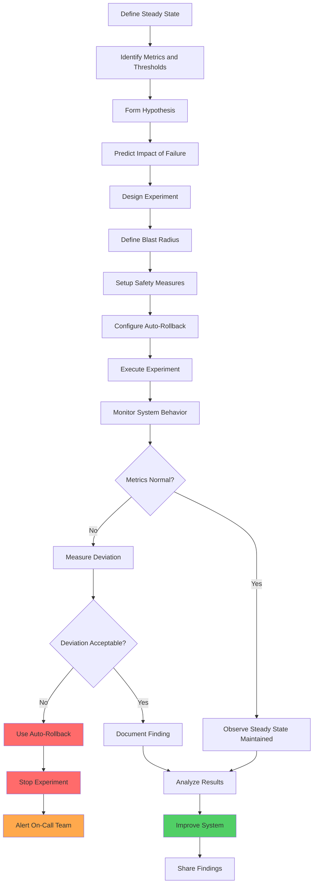

# Chaos Engineering

## Overview

Chaos engineering is the discipline of experimenting with systems to proactively identify weaknesses before they cause outages in production. It involves systematically injecting failures into systems to test resilience and discover unknown failure modes. The practice emerged from Netflix's internal tool, Chaos Monkey, and has evolved into a comprehensive discipline for building resilient systems.

The core principle of chaos engineering is to embrace failure as a natural occurrence in distributed systems. Rather than trying to prevent all failures, chaos engineering focuses on ensuring systems degrade gracefully and recover quickly when failures occur. This shift from prevention to resilience enables organizations to innovate faster while maintaining reliability.

Modern chaos engineering extends beyond simple component failures to include networkPartition testing (simulating network partitions), latency injection (introducing delays), resource exhaustion (CPU, memory, disk), and data corruption scenarios. The goal is to build confidence in system behavior under adverse conditions.

### Key Concepts

**Steady State Hypothesis:**
Before conducting chaos experiments, teams define the expected steady state behavior of the system. This includes normal metrics (response times, error rates, throughput) that indicate the system is functioning correctly. Experiments test whether the system maintains this steady state under failure conditions.

**Experiment Design:**
Chaos experiments follow a scientific method: define steady state, hypothesize the outcome, inject failure, observe results, and analyze findings. Each experiment has a defined blast radius to limit potential impact while gathering valuable information.

**Safe Experimentation:**
Production experiments require careful safety measures: automatic rollback, experiment timeout, and real-time monitoring. Teams stop experiments that exceed acceptable impact thresholds. Safety is paramount - experiments should never cause uncontrolled outages.

## Flow Chart



## Standard Example (Java)

### Maven Dependencies

```xml
<dependency>
    <groupId>org.springframework.boot</groupId>
    <artifactId>spring-boot-starter-actuator</artifactId>
    <version>3.2.0</version>
</dependency>
<dependency>
    <groupId>org.yaml</groupId>
    <artifactId>snakeyaml</artifactId>
    <version>2.2</version>
</dependency>
```

### Chaos Engineering Framework

```java
import java.util.concurrent.*;
import java.util.function.Supplier;
import java.util.Random;

public class ChaosExperiment {
    
    private final String experimentName;
    private final ExperimentType experimentType;
    private final int durationSeconds;
    private final double intensity;
    private final ExecutorService executor;
    private volatile boolean isRunning = false;
    private volatile boolean shouldStop = false;

    public enum ExperimentType {
        LATENCY_INJECTION,
        ERROR_INJECTION,
        RESOURCE_EXHAUSTION,
        NETWORK_PARTITION,
        SERVICE_SHUTDOWN,
        DATABASE_FAILURE,
        CACHE_INVALIDATION
    }

    public ChaosExperiment(
            String experimentName,
            ExperimentType experimentType,
            int durationSeconds,
            double intensity) {
        this.experimentName = experimentName;
        this.experimentType = experimentType;
        this.durationSeconds = durationSeconds;
        this.intensity = intensity;
        this.executor = Executors.newSingleThreadExecutor();
    }

    public void execute(ChaosTarget target) {
        if (isRunning) {
            throw new IllegalStateException("Experiment already running");
        }
        
        isRunning = true;
        shouldStop = false;
        
        executor.submit(() -> {
            try {
                System.out.println("Starting chaos experiment: " + experimentName);
                runExperiment(target);
            } finally {
                isRunning = false;
                System.out.println("Experiment completed: " + experimentName);
            }
        });
    }

    private void runExperiment(ChaosTarget target) {
        switch (experimentType) {
            case LATENCY_INJECTION:
                injectLatency(target);
                break;
            case ERROR_INJECTION:
                injectErrors(target);
                break;
            case RESOURCE_EXHAUSTION:
                exhaustResources(target);
                break;
            case NETWORK_PARTITION:
                createNetworkPartition(target);
                break;
            case SERVICE_SHUTDOWN:
                shutdownService(target);
                break;
            case DATABASE_FAILURE:
                failDatabase(target);
                break;
            case CACHE_INVALIDATION:
                invalidateCache(target);
                break;
        }
    }

    private void injectLatency(ChaosTarget target) {
        int baseLatency = (int) (intensity * 1000);
        Random random = new Random();
        
        long startTime = System.currentTimeMillis();
        
        while (!shouldStop && 
               System.currentTimeMillis() - startTime < durationSeconds * 1000) {
            int addedLatency = baseLatency + random.nextInt(500);
            target.addLatency(addedLatency);
            
            try {
                Thread.sleep(1000);
            } catch (InterruptedException e) {
                Thread.currentThread().interrupt();
                break;
            }
        }
        
        target.resetLatency();
    }

    private void injectErrors(ChaosTarget target) {
        Random random = new Random();
        
        long startTime = System.currentTimeMillis();
        
        while (!shouldStop && 
               System.currentTimeMillis() - startTime < durationSeconds * 1000) {
            if (random.nextDouble() < intensity) {
                target.injectError(new ChaosException("Injected failure"));
            }
            
            try {
                Thread.sleep(1000);
            } catch (InterruptedException e) {
                Thread.currentThread().interrupt();
                break;
            }
        }
    }

    private void exhaustResources(ChaosTarget target) {
        // Memory exhaustion simulation
        long startTime = System.currentTimeMillis();
        
        while (!shouldStop && 
               System.currentTimeMillis() - startTime < durationSeconds * 1000) {
            target.consumeResources((int) (intensity * 100));
            
            try {
                Thread.sleep(100);
            } catch (InterruptedException e) {
                Thread.currentThread().interrupt();
                break;
            }
        }
    }

    private void createNetworkPartition(ChaosTarget target) {
        System.out.println("Creating network partition...");
        target.blockTraffic(true);
        
        try {
            Thread.sleep(durationSeconds * 1000);
        } catch (InterruptedException e) {
            Thread.currentThread().interrupt();
        } finally {
            target.blockTraffic(false);
        }
    }

    private void shutdownService(ChaosTarget target) {
        System.out.println("Shutting down target service...");
        target.stop();
        
        try {
            Thread.sleep(durationSeconds * 1000);
        } catch (InterruptedException e) {
            Thread.currentThread().interrupt();
        } finally {
            target.start();
        }
    }

    private void failDatabase(ChaosTarget target) {
        System.out.println("Simulating database failure...");
        target.disconnectDatabase();
        
        try {
            Thread.sleep(durationSeconds * 1000);
        } catch (InterruptedException e) {
            Thread.currentThread().interrupt();
        } finally {
            target.reconnectDatabase();
        }
    }

    private void invalidateCache(ChaosTarget target) {
        System.out.println("Invalidating cache...");
        target.invalidateAllCaches();
    }

    public void stop() {
        shouldStop = true;
    }

    public boolean isRunning() {
        return isRunning;
    }
}

interface ChaosTarget {
    void addLatency(int milliseconds);
    void resetLatency();
    void injectError(Exception e);
    void consumeResources(int mb);
    void blockTraffic(boolean blocked);
    void stop();
    void start();
    void disconnectDatabase();
    void reconnectDatabase();
    void invalidateAllCaches();
}

class ChaosException extends Exception {
    public ChaosException(String message) {
        super(message);
    }
}
```

### Experiment Runner and Safety Controls

```java
import java.util.*;
import java.util.concurrent.*;

public class ChaosExperimentRunner {

    private final List<ChaosExperiment> experiments = new ArrayList<>();
    private final Map<String, ExperimentResult> results = new HashMap<>();
    private final ExecutorService executor = Executors.newFixedThreadPool(4);
    private final AlertService alertService;
    
    private static final int MAX_CONCURRENT_EXPERIMENTS = 1;
    private static final int EXPERIMENT_TIMEOUT_MINUTES = 10;

    public ChaosExperimentRunner(AlertService alertService) {
        this.alertService = alertService;
    }

    public ExperimentResult runExperiment(
            ChaosExperiment experiment,
            SteadyState steadyState,
            SafetyControls safetyControls) {
        
        // Validate experiment
        if (experiments.size() >= MAX_CONCURRENT_EXPERIMENTS) {
            throw new IllegalStateException("Maximum concurrent experiments reached");
        }

        // Create experiment context
        ExperimentContext context = new ExperimentContext(
            experiment,
            steadyState,
            safetyControls
        );

        // Schedule monitoring task
        Future<?> monitoringTask = executor.submit(() -> 
            monitorExperiment(context)
        );

        // Execute experiment
        long startTime = System.currentTimeMillis();
        
        try {
            experiment.execute(context.getTarget());
            
            // Wait for experiment completion or timeout
            monitoringTask.get(
                EXPERIMENT_TIMEOUT_MINUTES, 
                TimeUnit.MINUTES
            );
            
        } catch (TimeoutException e) {
            handleExperimentTimeout(experiment);
        } catch (Exception e) {
            handleExperimentError(experiment, e);
        } finally {
            experiment.stop();
            monitoringTask.cancel(true);
        }

        // Record results
        ExperimentResult result = context.buildResult();
        results.put(experiment.getExperimentName(), result);
        
        return result;
    }

    private void monitorExperiment(ExperimentContext context) {
        SteadyState steadyState = context.getSteadyState();
        SafetyControls safetyControls = context.getSafetyControls();
        
        long startTime = System.currentTimeMillis();
        int consecutiveViolations = 0;
        
        while (!Thread.currentThread().isInterrupted()) {
            long elapsed = System.currentTimeMillis() - startTime;
            
            // Check if experiment should stop
            if (elapsed > safetyControls.getMaxDurationMillis()) {
                context.stop();
                break;
            }
            
            // Check steady state
            boolean steadyStateMaintained = steadyState.check();
            
            if (!steadyStateMaintained) {
                consecutiveViolations++;
                
                if (consecutiveViolations >= 
                    safetyControls.getMaxConsecutiveViolations()) {
                    context.stop();
                    
                    alertService.sendAlert(new Alert(
                        "STEADY_STATE_VIOLATION",
                        "Experiment " + context.getExperimentName() + 
                        " violated steady state",
                        Alert.Severity.HIGH
                    ));
                    break;
                }
            } else {
                consecutiveViolations = 0;
            }

            try {
                Thread.sleep(1000);
            } catch (InterruptedException e) {
                break;
            }
        }
    }

    private void handleExperimentTimeout(ChaosExperiment experiment) {
        experiment.stop();
        alertService.sendAlert(new Alert(
            "EXPERIMENT_TIMEOUT",
            "Experiment " + experiment.getExperimentName() + " timed out",
            Alert.Severity.MEDIUM
        ));
    }

    private void handleExperimentError(
            ChaosExperiment experiment, 
            Exception e) {
        experiment.stop();
        alertService.sendAlert(new Alert(
            "EXPERIMENT_ERROR",
            "Experiment " + experiment.getExperimentName() + 
            " failed: " + e.getMessage(),
            Alert.Severity.CRITICAL
        ));
    }
}

class ExperimentContext {
    private final ChaosExperiment experiment;
    private final SteadyState steadyState;
    private final SafetyControls safetyControls;
    private final ChaosTarget target;
    private final List<Long> metricSnapshots = new ArrayList<>();
    private volatile boolean stopped = false;

    public ExperimentContext(
            ChaosExperiment experiment,
            SteadyState steadyState,
            SafetyControls safetyControls) {
        this.experiment = experiment;
        this.steadyState = steadyState;
        this.safetyControls = safetyControls;
        this.target = createTarget();
    }

    private ChaosTarget createTarget() {
        // Create appropriate target based on experiment
        return new DefaultChaosTarget();
    }

    public void stop() {
        stopped = true;
        experiment.stop();
    }

    public String getExperimentName() {
        return experiment.getExperimentName();
    }

    public SteadyState getSteadyState() {
        return steadyState;
    }

    public SafetyControls getSafetyControls() {
        return safetyControls;
    }

    public ChaosTarget getTarget() {
        return target;
    }

    public ExperimentResult buildResult() {
        return new ExperimentResult(
            experiment.getExperimentName(),
            stopped,
            metricSnapshots
        );
    }
}

class SteadyState {
    private final Supplier<Boolean> checkFunction;
    private final double maxErrorRate;
    private final int maxLatencyMs;

    public SteadyState(
            Supplier<Boolean> checkFunction,
            double maxErrorRate,
            int maxLatencyMs) {
        this.checkFunction = checkFunction;
        this.maxErrorRate = maxErrorRate;
        this.maxLatencyMs = maxLatencyMs;
    }

    public boolean check() {
        return checkFunction.get();
    }
}

class SafetyControls {
    private final int maxDurationMillis;
    private final int maxConsecutiveViolations;
    private final boolean autoRollback;

    public SafetyControls(
            int maxDurationMillis,
            int maxConsecutiveViolations,
            boolean autoRollback) {
        this.maxDurationMillis = maxDurationMillis;
        this.maxConsecutiveViolations = maxConsecutiveViolations;
        this.autoRollback = autoRollback;
    }

    public int getMaxDurationMillis() {
        return maxDurationMillis;
    }

    public int getMaxConsecutiveViolations() {
        return maxConsecutiveViolations;
    }
}

class ExperimentResult {
    private final String experimentName;
    private final boolean completed;
    private final List<Long> metricSnapshots;

    public ExperimentResult(
            String experimentName,
            boolean completed,
            List<Long> metricSnapshots) {
        this.experimentName = experimentName;
        this.completed = completed;
        this.metricSnapshots = metricSnapshots;
    }
}

interface AlertService {
    void sendAlert(Alert alert);
}

class Alert {
    public enum Severity { LOW, MEDIUM, HIGH, CRITICAL }
    private final String type;
    private final String message;
    private final Severity severity;

    public Alert(String type, String message, Severity severity) {
        this.type = type;
        this.message = message;
        this.severity = severity;
    }
}

class DefaultChaosTarget implements ChaosTarget {
    // Default implementation
    public void addLatency(int ms) { }
    public void resetLatency() { }
    public void injectError(Exception e) { }
    public void consumeResources(int mb) { }
    public void blockTraffic(boolean blocked) { }
    public void stop() { }
    public void start() { }
    public void disconnectDatabase() { }
    public void reconnectDatabase() { }
    public void invalidateAllCaches() { }
}
```

## Real-World Examples

### Netflix Chaos Monkey

Netflix pioneered chaos engineering with Chaos Monkey, which randomly terminates production instances. This forces development teams to design for instance failure and ensures automated recovery works correctly.

```java
// Netflix Chaos Monkey Configuration
/*
chaos.monkey:
  enabled: true
  level: 3
  minduration: 5000
  maxduration: 20000
  recurrence-period: 60000
  assault:
    attacks:
      - kill-method
    exceptions: false
    latency:
      active: true
      range: 1000-3000
    tag:
      "chaos-monkey"
*/
```

### LitmusChaos for Kubernetes

LitmusChaos provides a framework for chaos engineering on Kubernetes. It supports various experiments including pod failures, network latency, and resource exhaustion.

```yaml
# LitmusChaos Experiment
apiVersion: litmuschaos.io/v1alpha1
kind: ChaosEngine
metadata:
  name: pod-kill-chaos
  namespace: litmus
spec:
  appinfo:
    appns: default
    applabel: "app=payment-service"
  chaosServiceAccount: litmus-admin
  experiments:
  - name: pod-delete
    spec:
      components:
        env:
        - name: TOTAL_CHAOS_DURATION
          value: '30'
        - name: CHAOS_INTERVAL
          value: '10'
        - name: FORCE
          value: 'false'
  annotationCheck: 'true'
  mode: tune
```

### Gremlin Chaos Engineering Platform

Gremlin provides a commercial platform for chaos engineering with controlled injection of various failure types and safety features.

```yaml
# Gremlin Attack Configuration
apiVersion: v1
kind: Pod
metadata:
  name: gremlin-attack
spec:
  containers:
  - name: gremlin
    image: gremlin:latest
    env:
    - name: GREMLIN_IDENTIFIER
      value: "attack-001"
    - name: GREMLIN_ATTACK_TYPE
      value: "cpu"
    - name: GREMLIN_DURATION
      value: "60s"
    - name: GREMLIN_INTENSITY_PERCENT
      value: "50"
```

## Output Statement

Chaos engineering produces valuable insights about system behavior under failure conditions:

- **Failure Mode Discovery**: Identifies previously unknown failure modes and vulnerabilities
- **Recovery Validation**: Validates that automated recovery mechanisms work correctly
- **System Confidence**: Builds confidence that systems handle failures gracefully
- **Improvement Recommendations**: Provides specific findings to improve system resilience
- **Team Readiness**: Trains teams to respond to incidents effectively

The output includes detailed experiment reports, system improvements, and updated runbooks.

## Best Practices

**1. Start with Non-Production Environments**
Begin experiments in staging or development environments to build confidence. Progress to production only after validating procedures.

**2. Define Clear Steady State**
Define measurable steady state criteria before experiments. Use metrics that represent user-facing behavior.

**3. Implement Safety Controls**
Always implement safety controls: automatic rollback, experiment timeout, and manual abort capability. Never experiment without safety measures.

**4. Limit Blast Radius**
Start experiments with small blast radius. Increase scope only after confirming safety measures work correctly.

**5. Coordinate with Teams**
Coordinate experiments with on-call teams and stakeholders. Ensure everyone understands the experiment and knows how to abort.

**6. Document Hypotheses**
Document the hypothesis for each experiment before execution. This helps analyze results and build institutional knowledge.

**7. Analyze Results Thoroughly**
Analyze all results, even successful experiments. Look for unexpected behaviors and latent vulnerabilities.

**8. Improve Continuously**
Use findings to improve system resilience. Update experiments to cover newly discovered failure modes.